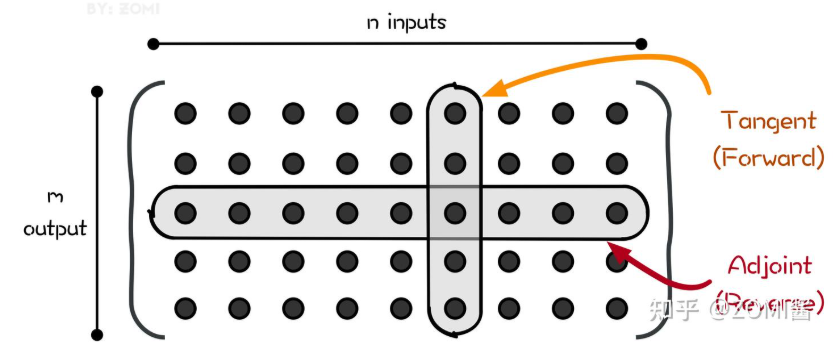

```python
import torch
from torch import fx

def f(x:int,y:int):
    """
    一个包含多种控制流的函数
    :param x:
    :return:
    """
    return (x.relu() + 1) * x.pow(5)

def conditional_computation(x):
    """

    Args:
        x:

    Returns:

    """
    if x.sum() < 0:
        return x + 1
    else:
        return x - 1

# 包含形状相关的代码
def shape_dependent(x):
    bsz, *sizes = x.shape
    return x.reshape(bsz, -1)

# 包含外部代码
def external_code(x):
    import numpy as np
    return x + torch.from_numpy(np.random.random((5, 5, 5)))

def case1():
    fx_model = fx.symbolic_trace(f)
    print(fx_model.graph)

def case2():
    input = torch.randn(5, 5, 5)
    f_traced = torch.jit.trace(f, input)
    print(f_traced.graph)

def custom_backend(gm, example_inputs):
    print(gm.compile_subgraph_reason)
    print(gm.graph)
    print(gm.code)
    return gm.forward


```



这个代码在递归的时候，获得结果的顺序是先正向的，先计算出底层正向的导数结果


反向自动微分同样是基于链式法则。仅需要一个前向过程和反向过程，就可以计算所有参数的导数或者梯度。因为需要结合前向和后向两个过程，因此反向自动微分会使用一个特殊的数据结构，来存储计算过程。

正向为啥不行？

对于多个输入而言，每次只能计算一个

> 你写的例子：
>
> ```
> x = ADTangent(x=2., dx=1)   # 对 x 求导
> y = ADTangent(x=5., dx=0)   # y 的 dx=0
> f = ADTangent.log(x) + x * y - ADTangent.sin(y)
> print(f)
> ```
>
> 结果里打印的 `grad`，其实就是 **df/dx**。
>  因为你初始化时只给 `x` 的 `dx=1`，而 `y` 的 `dx=0`，所以传播下来的梯度信息就只包含了对 `x` 的导数。
>
> ------
>
> ## 3. 如果你想对 y 求导呢？
>
> 只要换一下初始条件：
>
> ```
> python复制编辑x = ADTangent(x=2., dx=0)   # 不对 x 求导
> y = ADTangent(x=5., dx=1)   # 对 y 求导
> f = ADTangent.log(x) + x * y - ADTangent.sin(y)
> print(f)   # 现在打印的是 df/dy
> ```
>
> 这时你就能得到函数对 y 的偏导数。


> 前向模式的优点：
>
> - 实现起来很简单
> - 也不需要很多额外的内存空间
>
> 向前模式的缺点：
>
> - 每次前向计算只能计算对一个自变量的偏导数，对于一元函数求导是高效的，但是机器学习模型的自参数（入参）数量级大。
> - 如果有一个函数，其输入有 n 个，输出有 m个，对于每个输入来说，前向模式都需要遍历计算过程以得到当前输入的导数，求解整个函数梯度需要 n 遍如上计算过程。


## 反向模式

反向自动微分会使用一个特殊的数据结构，来存储计算过程。

而这个特殊的数据结构例如 [Tensorflow](https://zhida.zhihu.com/search?content_id=209881278&content_type=Article&match_order=1&q=Tensorflow&zhida_source=entity) 或者 MindSpore，则是把所有的操作以一张图的方式存储下来，这张图可以是一个有向无环（DAG）的计算图；而Pytroch 则是使用 Tape 来记录每一个操作，他们都表达了函数和变量的关系。

```python
import math

# ==============================
#  基础函数：sin 和 cos 的自动微分版本
# ==============================
def sin(x):
    # 如果输入是 Dual 类型（支持自动微分）
    if isinstance(x, Dual):
        # 复合规则：d/dx sin(x) = cos(x)
        return Dual(sin(x.x), cos(x.x) * x.dx)
    # 普通 float，就直接调用 math.sin
    return math.sin(x)

def cos(x):
    if isinstance(x, Dual):
        # 复合规则：d/dx cos(x) = -sin(x)
        return Dual(cos(x.x), -1 * sin(x.x) * x.dx)
    return math.cos(x)

# ==============================
#  前向模式 Dual 类
# ==============================
class Dual:
    """
    Dual 表示一个数值及其导数信息：
      - x : 实际的数值
      - dx: 导数信息，可以是 float，也可以是其他结构（Raw / WithBP / Batched）
    """
    def __init__(self, x, dx):
        self.x = x
        self.dx = dx

    def __add__(self, r):
        assert isinstance(r, Dual)
        # (x1 + x2, dx1 + dx2)
        return Dual(self.x + r.x, self.dx + r.dx)

    def __mul__(self, r):
        if isinstance(r, Dual):
            # 乘法法则：d/dx (u*v) = u*dv + v*du
            return Dual(self.x * r.x, self.x * r.dx + r.x * self.dx)
        assert isinstance(r, float)
        # float * Dual
        return Dual(self.x * r, r * self.dx)

    def __rmul__(self, r):
        return self * r

    def __repr__(self):
        # 打印 (值, 导数)
        return repr((self.x, self.dx))

# ==============================
#  Raw 占位类
# ==============================
class Raw:
    """
    Raw 是一个“占位符类（dummy class）”，
    在 forward pass 时用于构建计算图，但不真正存储梯度。
    """
    def __mul__(self, r):
        # 左边是 Raw，右边必须是 float
        assert isinstance(r, float)
        return Raw()  # 返回一个新的占位符

    def __rmul__(self, r):
        return self * r  # 支持 float * Raw

    def __add__(self, r):
        assert isinstance(r, Raw)
        return Raw()  # 返回一个新的占位符

    def __repr__(self):
        return repr(())  # 打印结果是 ()

# ==============================
#  示例函数 f(x, y)
# ==============================
def f(x, y):
    # 返回一个二元函数 (sin(x)*y, sin(y)+x)
    return sin(x) * y, sin(y) + x

# ------------------------------
#  测试 Raw (构图)
# ------------------------------
print("raw:")
print(f(Dual(1.0, Raw()), Dual(2.0, Raw())))

# ------------------------------
#  前向模式
# ------------------------------
print("forward mode:")
# 对 x 求偏导：dx=1, dy=0
print(f(Dual(1.0, 1.0), Dual(2.0, 0.0)))
# 对 y 求偏导：dx=0, dy=1
print(f(Dual(1.0, 0.0), Dual(2.0, 1.0)))

# ==============================
#  Ref 类：可变引用，用来存储梯度
# ==============================
class Ref:
    def __init__(self, v):
        """
        Ref 就是一个可变引用（包装数值），方便在闭包里修改梯度值。
        比如：a.dx.rdx.v = 1.0  # 设置 ∂L/∂a = 1
        """
        self.v = v

# ==============================
#  WithBP 类：反向模式 AD
# ==============================
class WithBP:
    """
    WithBP 用闭包的方式手工实现反向传播。
      - rdx: Ref 包裹的梯度累积变量
      - bp : Ref 包裹的“反向传播函数链”
    """
    def __init__(self, rdx, bp):
        self.rdx = rdx
        self.bp = bp

    def __mul__(self, rhs):
        assert isinstance(rhs, float)
        r = Ref(0.0)  # 新节点的梯度存储
        bpv = self.bp.v  # 保存旧的反向传播链

        def new_bp():
            # 梯度传回：∂L/∂self += ∂L/∂r * rhs
            self.rdx.v = self.rdx.v + r.v * rhs
            bpv()
        self.bp.v = new_bp
        return WithBP(r, self.bp)

    def __rmul__(self, rhs):
        return self * rhs

    def __add__(self, rhs):
        assert isinstance(rhs, WithBP)
        r = Ref(0.0)  # 新节点 c 的梯度存储
        bpv = self.bp.v

        def new_bp():
            # ∂L/∂self += ∂L/∂r
            self.rdx.v = self.rdx.v + r.v
            # ∂L/∂rhs += ∂L/∂r
            rhs.rdx.v = rhs.rdx.v + r.v
            bpv()

        self.bp.v = new_bp
        return WithBP(r, self.bp)

# ------------------------------
#  测试反向模式
# ------------------------------
print("reverse mode:")
# 初始化 backprop 链
bp = Ref(lambda: ())
x = WithBP(Ref(0.0), bp)
y = WithBP(Ref(0.0), bp)

# 构建函数
a, b = f(Dual(1.0, x), Dual(2.0, y))

# 对 a 求导（∂a/∂x, ∂a/∂y）
a.dx.rdx.v = 1.0  # 设置 ∂L/∂a = 1

# 执行反向传播
a.dx.bp.v()
print((x.rdx.v, y.rdx.v))

# 重置 bp 链
bp.v = lambda: ()
x = WithBP(Ref(0.0), bp)
y = WithBP(Ref(0.0), bp)

# 构建函数
a, b = f(Dual(1.0, x), Dual(2.0, y))

# 对 b 求导（∂b/∂x, ∂b/∂y）
b.dx.rdx.v = 1.0
bp.v()
print((x.rdx.v, y.rdx.v))

# ==============================
#  Batched 类：批量 AD
# ==============================
class Batched:
    """
    Batched 用于批量计算多个方向的导数。
    本质上就是把 dx 扩展成一个向量，里面存多个独立的导数。
    """
    def __init__(self, *l):
        self.l = l  # 元组，存多个 dx 值或对象

    def __mul__(self, rhs):
        assert isinstance(rhs, float)
        return Batched(*[x * rhs for x in self.l])

    def __add__(self, rhs):
        assert isinstance(rhs, Batched)
        assert len(self.l) == len(rhs.l)
        return Batched(*[self.l[i] + rhs.l[i] for i in range(len(self.l))])

    def __rmul__(self, rhs):
        return self * rhs

    def __repr__(self):
        return repr(self.l)

# ------------------------------
#  批量前向模式
# ------------------------------
print("batched forward mode:")
# 这里 dx 是一个向量，表示 [dx, dy]
print(f(Dual(1.0, Batched(1.0, 0.0)), Dual(2.0, Batched(0.0, 1.0))))

# ------------------------------
#  批量反向模式
# ------------------------------
print("batched reverse mode:")

bp = Ref(lambda: ())
ax = WithBP(Ref(0.0), bp)
bx = WithBP(Ref(0.0), bp)
ay = WithBP(Ref(0.0), bp)
by = WithBP(Ref(0.0), bp)

# 用 Batched 包装多个 WithBP 对象
# ax, bx 是 x 方向的两个梯度分量
a, b = f(Dual(1.0, Batched(ax, bx)), Dual(2.0, Batched(ay, by)))

# 设置 a 对应第一个分量的梯度 = 1
# 设置 b 对应第二个分量的梯度 = 1
a.dx.l[0].rdx.v = 1.0
b.dx.l[1].rdx.v = 1.0

# 执行反向传播
bp.v()
print((ax.rdx.v, bx.rdx.v, ay.rdx.v, by.rdx.v))

```

