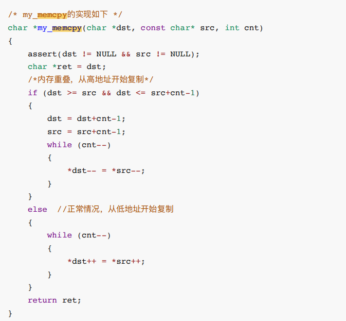

# 自我介绍

### Q:自我介绍，

* 面试官好，我叫王凯，是西安电子科技大学电子工程学院的硕士研究生。我的专业是新一代电子信息技术，就是之前的电子信息工程

  

* 我所在的影像处理实验室是科技部重点领域创新团队,实验室大方向是做深度学习的，我自己的研究方向是3D目标检测。

  

* 在校期间多次获得奖学金。在本科阶段，获得二次二等两次三等，硕士期间每个学期均二等。也有积极参加编程类竞赛，比如软件精英挑战赛西北赛区二等奖，嵌入式软件大赛西北13名，大学生数学竞赛三等奖等等

  

* 研究生期间也有参与组内和清华大学以及华为合作的项目，在其中负责一部分算法和开发工作，参与验收。

  

* 研究成果方面，目前有一篇《3D Object Detection Method Based on CA Sampling and Local Attention Feature Encoding 已投的smartiot会议论文和一篇准备投的期刊论文。

  

* 专业技能方面，有QT客户端界面开发经验，熟悉常用算法，操作系统，网络协议，以及深度学习框架pytorch。


# c/c++

### c和c++语言的区别

1. C语言是C++的子集，C++可以很好兼容C语言。但是C++又有很多新特性，如引用、智能指针、
   auto变量等。
2. C++是面对对象的编程语言；C语言是面对过程的编程语言。
3. C语言有一些不安全的语言特性，如指针使用的潜在危险、强制转换的不确定性、内存泄露等。而
   C++对此增加了不少新特性来改善安全性，如const常量、引用、cast转换、智能指针等等；
4. C++可复用性高，C++引入了模板的概念，后面在此基础上，实现了方便开发的标准模板库STL。
   C++的STL库相对于C语言的函数库更灵活、更通用  

### 面向对象

> 它基于将程序视为一组对象（objects）的集合，这些对象由类（classes）定义，并且彼此交互来完成任务。面向对象的核心思想是通过抽象、封装、继承和多态等概念来提高代码的重用性、可维护性和扩展性。
>
> ### 面向对象的四大基本原则：
>
> 1. **抽象（Abstraction）：**
>    - 抽象是从现实世界的事物中提取出共性，忽略不必要的细节，从而形成一个通用的类。这可以帮助开发者专注于对象的行为和属性，而不是细节实现。
> 2. **封装（Encapsulation）：**
>    - 封装是将对象的属性和行为绑定在一起，并通过访问控制（如私有化属性）来隐藏内部实现细节。这使得对象的内部状态不会被外部代码任意修改，从而保证了数据的完整性。
> 3. **继承（Inheritance）：**
>    - 继承允许一个类从另一个类继承属性和行为，从而实现代码重用。子类可以继承父类的所有特性，并可以添加新的特性或重写（覆盖）父类的方法。
> 4. **多态（Polymorphism）：**
>    - 多态是指相同的操作可以作用于不同的对象上，并且表现出不同的行为。多态通常通过接口（Interface）或继承实现，允许程序更加灵活和可扩展。

### 新特性

> C++新特性主要包括包含语法改进和标准库扩充两个方面，主要包括以下11点：
>
> 1. 语法的改进
>    （1）统一的初始化方法
>    （2）成员变量默认初始化
>    （3）auto关键字 用于定义变量，编译器可以自动判断的类型（前提：定义一个变量时对其进行
>    初始化）
>    （4）decltype 求表达式的类型
>    （5）智能指针 shared_ptr
>    （6）空指针 nullptr（原来NULL）
>    （7）基于范围的for循环
>    （8）右值引用和move语义 让程序员有意识减少进行深拷贝操作
> 2. 标准库扩充（往STL里新加进一些模板类，比较好用）
>    （9）无序容器（哈希表） 用法和功能同map一模一样，区别在于哈希表的效率更高
>    （10）正则表达式 可以认为正则表达式 实质上是一个字符串，该字符串描述了一种特定模式的字
>    符串
>    （11）Lambda表达式  

### C++常用库

> STL库
>
> STL（Standard Template Library）是C++标准库的一部分，提供了丰富的容器和算法，包括vector、list、set、map等容器，以及sort、find、replace等算法。STL库的使用简单明了，能够快速实现常见数据结构和算法。
>
> Boost库
>
> Boost库是一个由C++标准委员会外的开发者开发的、基于C++标准的开源库，提供了大量的跨平台、高质量的库，包括智能指针、线程、日期时间等。Boost库的功能非常丰富，可以满足各种需求，是一个非常不错的选择。
>
> OpenCV库
>
> OpenCV（Open Source Computer Vision Library）是一个开源计算机视觉库，提供了一系列视觉算法和工具，包括图像处理、计算机视觉、机器学习等。OpenCV库广泛应用于计算机视觉领域，例如人脸识别、运动跟踪等
>
> QT
>
> httplib
>
> cstring
>
> cjson
>
> Opengl
>
> pcl

### 循环引用

当我们的两个类出于以下状态时：

```text
struct A {
    std::shared_ptr<B> shrd_ptr;
};

struct B {
    std::shared_ptr<A> shrd_ptr;
};

std::shared_ptr<A> ptr_A (std::make_shared<A> ());
std::shared_ptr<B> ptr_B (std::make_shared<B> ());
ptr_A->shrd_ptr = ptr_B;
ptr_B->shrd_ptr = ptr_A;
```

假如我们的类A想要析构的时候，发现类B里还有个指针指着自己，怎么也得等类B析构完，完了类A才能析构成功，但是类B想要析构的时候发现类A也有一个指针指向自己，析构不了了！于是就一直僵持，最后内存泄露，这个时候`weak_ptr`就有用了，只要把其中一个类的`shared_ptr`换成`weak_ptr` 就行，weak_ptr是个辅助指针，只能用由`shraed_ptr`来构造，他不会增加`shread_ptr`的引用计数 ，只跟踪对象，当我们需要操控对象时，使用lock方法，就会将他转换成一个`shread_ptr`返回。

### 前置++与后置++

```c
//前置
self &operator++() {
    node = (linktype)((node).next);
    return *this;
}
//后置
const self operator++(int) {
    self tmp = *this;
    ++*this;
    return tmp;
}
```

为了区分前后置，重载函数是以参数类型来区分，在调⽤的时候，编译器默默给int指定为⼀个0

> 1、==为什么后置返回对象，⽽不是引⽤==
> 因为后置为了返回旧值创建了⼀个临时对象，在函数结束的时候这个对象就会被销毁，如果返回引⽤，那么我请问
> 你？你的对象对象都被销毁了，你引⽤啥呢？

> 2、==为什么后置前⾯也要加const==
> 其实也可以不加，但是为了防⽌你使⽤i++++,连续两次的调⽤后置++重载符，为什么呢?
> 原因：
> 它与内置类型⾏为不⼀致；你⽆法活得你所期望的结果，因为第⼀次返回的是旧值，⽽不是原对象，你调⽤两次后
> 置++，结果只累加了⼀次，所以我们必须⼿动禁⽌其合法化，就要在前⾯加上const  


### 基本数据类型长度

> **无符号整数类型**：`size_t` 是一个无符号整数类型，也就是说它只能表示非负整数。
>
> **与平台相关**：`size_t` 的大小取决于平台的位数。在 32 位系统上，`size_t` 通常是 32 位宽；在 64 位系统上，`size_t` 通常是 64 位宽。


# 设计模式

 常用的设计模式

 介绍一下工厂模式，以及为什么需要使用工厂模式

### 单例设计模式

项目中的某一个类只需要唯一的一个实例，即仅创建一次

使用单件模式，确保使用者也只能创建出一个实例

```c
class TaskManeger()
{
 private:
    // 私有构造函数，防止外部创建实例
    TaskManeger();
    {
        if(instance==nulltpr)
        {
            instance =  new TaskManeger();
            return instance;
        }
    }
    // 禁用拷贝构造函数和赋值运算符
    TaskManager(const TaskManager& other) = delete;
    TaskManager& operator=(const TaskManager& other) = delete;
    
    TaskManeger * instance = nulltpr;
public:
    TaskManeger * getinstance()
    {
        return instance;
    }
}
```


### 工厂模式

依旧是文件分割器。但是需要构建不同的分割器，由于需求的变化，导致对象的具体类型经常变化

变化被推迟到更上层的MainForm创建的时候

存在的问题

- 由于MainForm的稳定依赖了具体的（变化的）子类，造成了类间依赖关系的不稳定，违反了DIP（依赖倒置原则），是不推荐的情况。

> 解决方法
>
> - 使用工厂模式：实现一个方法，绕开new，同样返回一个对象。定义一个用于创建对象的接口，让子类决定实例化某个类。
> - 用于隔离类对象的使用者和具体类型之间的耦合关系
> - 通过面向对象，将创建具体对象的工作延迟到子类

```c
class TxtSplitter: public ISplitter {

};

class PictureSplitter: public ISplitter {

};

class VideoSplitter: public ISplitter {

};


class MainForm {
public:
    void buttonClick() {
        // 没有绕开具体类
        ISplitter* splitter = new BinarySplitter();
        splitter->split();
    }
};
```


```c
class VideoSplitterFactory: public SplitterFactory {
public:
    virtual ISplitter* CreateSpitter() {
        return new VideoSplitter();
    }
};

// MainForm不再依赖具体类
class MainForm {
private:
    SplitterFactory* factory;
public:
    MainForm(SplitterFactory* factory) {
        this->factory = factory;
    }
    void buttonClick() {
        // 多态new
        ISplitter* splitter = factory->CreateSpitter();
        splitter->split();
    }
};
```


### 抽象工厂

使用抽象工厂：工厂不再单一生产单个对象，而是将一系列操作放进一个工厂，都由一个工厂生产，故名抽象工厂

```c
// 数据库相关基类
class IDBConnection {

};

class IDBCommand {

};

class IDataReader {

};

// 抽象工厂
class IDBFactory {
public:
    virtual IDBConnection* CreateDBConnection() = 0;
    virtual IDBCommand* CreateDBCommand() = 0;
    virtual IDataReader* CreateDataReader() = 0;
};
```

### 观察者模式

 存在的问题

- 观察者会变化，需要更改目标的通知实现方式，对于观察者增减的需求不满足开闭原则；通知的具体实现在目标处完成，没有独立抽象，不符合DIP（依赖倒置原则）原则。

\5. 解决方法

- 使用观察者模式：定义对象间的一对多的关系，以便一个对象发生变化时，能够及时通知所依赖的其他对象（观察者），方便添加或删除观察者，并且符合DIP原则。

```c
#include <iostream>
using namespace std;

class FileSplitter {
private:
    string m_filePath;
    int m_fileNumber;
    ProgressBar* m_progressBar;

public:
    FileSplitter(string& filePath, int fileNumber, ProgressBar* progressBar):
        m_filePath(filePath), 
        m_fileNumber(fileNumber), 
        m_progressBar(progressBar) {
    }

    void split() {
        for (int i = 0; i < m_fileNumber; ++i) {
            m_progressBar->setValue();
        }
    }
};

// 主逻辑
class Form {};

class TextBox {
public:
    string getText() {
        return "";
    }
};

class ProgressBar {
public:
    void setValue() {}
};

class MainForm: Form {
private:
    TextBox* txtFilePath;
    TextBox* txtFileNumber;
    ProgressBar* progressBar;

public:
    void buttonClick() {
        string filePath = txtFilePath->getText();
        int fileNumber = atoi(txtFileNumber->getText().c_str());

        FileSplitter* splitter = new FileSplitter(filePath, fileNumber, progressBar);
        splitter->split();
    }
};
```

- 可以独立改变目标与观察者（松耦合）
- 目标发送通知时，无需指定观察者，只管通知机制，而通知自动传播
- 观察者自己决定是否订阅通知

```c
#include <iostream>
#include <vector>
using namespace std;

class IProgress {
public:
    virtual void DoProgress(float value) = 0;
    virtual ~IProgress() {}
};

class FileSplitter {
private:
    string m_filePath;
    int m_fileNumber;
    // 抽象通知机制
    IProgress* m_iprogress;
    // 多个观察者使用容器保存
    vector<IProgress*> m_iprogressVector;

public:
    FileSplitter(string& filePath, int fileNumber, IProgress* iprogress):
        m_filePath(filePath), 
        m_fileNumber(fileNumber), 
        m_iprogress(iprogress) {
    }

    void split() {
        for (int i = 0; i < m_fileNumber; ++i) {
            m_iprogress->DoProgress(i);
            // 多个观察者使用容器保存
        }
    }

    // 多个观察者
    void add() {}

    void remove() {}
};

// 主逻辑
class Form {};

class TextBox {
public:
    string getText() {
        return "";
    }
};

class ProgressBar {
public:
    void setValue() {}
};

class MainForm: public Form, public IProgress {
private:
    TextBox* txtFilePath;
    TextBox* txtFileNumber;
    ProgressBar* progressBar;

public:
    void buttonClick() {
        string filePath = txtFilePath->getText();
        int fileNumber = atoi(txtFileNumber->getText().c_str());

        // this比较重要
        FileSplitter* splitter = new FileSplitter(filePath, fileNumber, this);

        splitter->split();
    }

    // 不论有多少个观察者，都可以实现自己的通知机制
    virtual void Doprogress(float value) {
        progressBar->setValue();
    }
};
```

FileSplitter* splitter = new FileSplitter(filePath, fileNumber, this);==this比较重要==

### 依赖导致原则

**依赖倒置原则**是软件开发中的一项重要设计原则，‌旨在通过解耦和提高灵活性来构建可插拔的系统。‌该原则最早由罗伯特·C·马丁提出，‌基于两个关键概念：‌高层模块不应该依赖低层模块，‌二者都应该依赖其抽象；‌抽象不应该依赖细节，‌细节应该依赖抽象。‌简而言之，‌依赖倒置原则要求我们通过抽象来将高层和低层模块连接起来，‌而不是直接依赖于具体的实现。‌


# 网络

## TCP

#### TCP 三次握手过程是怎样的？

TCP 是面向连接的协议，所以使用 TCP 前必须先建立连接，而**建立连接是通过三次握手来进行的**。三次握手的过程如下图：


> - 一开始，客户端和服务端都处于 `CLOSE` 状态。先是服务端主动监听某个端口，处于 `LISTEN` 状态
> - 客户端会随机初始化序号（`client_isn`），将此序号置于 TCP 首部的「序号」字段中，同时把 `SYN` 标志位置为 `1`，表示 `SYN` 报文。接着把第一个 SYN 报文发送给服务端，表示向服务端发起连接，该报文不包含应用层数据，之后客户端处于 `SYN-SENT` 状态。
> - 服务端收到客户端的 `SYN` 报文后，首先服务端也随机初始化自己的序号（`server_isn`），将此序号填入 TCP 首部的「序号」字段中，其次把 TCP 首部的「确认应答号」字段填入 `client_isn + 1`, 接着把 `SYN` 和 `ACK` 标志位置为 `1`。最后把该报文发给客户端，该报文也不包含应用层数据，之后服务端处于 `SYN-RCVD` 状态。
> - 客户端收到服务端报文后，还要向服务端回应最后一个应答报文，首先该应答报文 TCP 首部 `ACK` 标志位置为 `1` ，其次「确认应答号」字段填入 `server_isn + 1` ，最后把报文发送给服务端，这次报文可以携带客户到服务端的数据，之后客户端处于 `ESTABLISHED` 状态。
> - 服务端收到客户端的应答报文后，也进入 `ESTABLISHED` 状态。
>
> 从上面的过程可以发现**第三次握手是可以携带数据的，前两次握手是不可以携带数据的**，这也是面试常问的题。
>
> 一旦完成三次握手，双方都处于 `ESTABLISHED` 状态，此时连接就已建立完成，客户端和服务端就可以相互发送数据了。

#### TCP四次挥手过程是怎样的？


> * 客户端打算关闭连接，此时会发送一个 TCP 首部 FIN 标志位被置为 1 的报文，也即 FIN 报 文，之后客户端进入 FIN_WAIT_1 状态。
> *  服务端收到该报文后，就向客户端发送 ACK 应答报文，接着服务端进入 CLOSE_WAIT 状态。
> *  客户端收到服务端的 ACK 应答报文后，之后进入 FIN_WAIT_2 状态。 等
> * 待服务端处理完数据后，也向客户端发送 FIN 报文，之后服务端进入 LAST_ACK 状态。
> *  客户端收到服务端的 FIN 报文后，回一个 ACK 应答报文，
> * 之后进入 TIME_WAIT 状态 服务端收到了 ACK 应答报文后，就进入了 CLOSE 状态，至此服务端已经完成连接的关闭。
> *  客户端在经过 2MSL 一段时间后，自动进入 CLOSE 状态，至此客户端也完成连接的关闭。
> *  你可以看到，每个方向都需要一个 FIN 和一个 ACK，因此通常被称为四次挥手。

## IP

### arp

ARP 在传输一个 IP 数据报的时候，确定了源 IP 地址和目标 IP 地址后，就会通过主机==「路由表」==确定 IP 数据包下一跳。然而，网络层的下一层是数据链路层，所以我们还要知道「下一跳」的 MAC 地址。 

由于主机的路由表中可以找到下一跳的 IP 地址，所以可以通过 ARP 协议，求得下一跳的 MAC 地 址。简单地说，

ARP 是借助 ARP 请求与 ARP 响应两种类型的包确定 MAC 地址的。 主机会通过==广播发送 ARP 请求==，这个包中包含了想要知道的 MAC 地址的主机 IP 地址。 当同个链路中的所有设备收到 ARP 请求时，会去拆开 ARP 请求包里的内容，如果 ARP 请求包中 的目标 IP 地址与自己的 IP 地址一致，那么这个设备就将自己的 MAC 地址塞入 ARP 响应包返回给主机。

 操作系统通常会把第一次通过 ARP 获取的 MAC 地址缓存起来，以便下次直接从缓存中找到对应 IP 地址的 MAC 地址，

> ARP表帮助找到对应的MAC地址   路由表是下一条ip

## HTTPS


## TSL/RSA

那浏览器怎么知道证书的签发机构是不是受信任的？

因为受信任机构的根证书安装到了系统中，你总得相信微软吧！

> 传统的 TLS 握手基本都是使用 RSA 算法来实现密钥交换的，在将 TLS 证书部署服务端时，证书文件其实就是服务端的公钥，会在 TLS 握手阶段传递给客户端，而服务端的私钥则一直留在服务端，一定要确保私钥不能被窃取。
>
> 在 RSA 密钥协商算法中，客户端会生成随机密钥，并使用服务端的公钥加密后再传给服务端。根据非对称加密算法，公钥加密的消息仅能通过私钥解密，这样服务端解密后，双方就得到了相同的密钥，再用它加密应用消息


> TLS 第一次握手

首先，由客户端向服务器发起加密通信请求，也就是 ClientHello 请求。在这一步，客户端主要向服务器发送以下信息：

- （1）客户端支持的 TLS 协议版本，如 TLS 1.2 版本。
- （2）客户端生产的随机数（Client Random），后面用于生成「会话秘钥」条件之一。
- （3）客户端支持的密码套件列表，如 RSA 加密算法。

> TLS 第二次握手

服务器收到客户端请求后，向客户端发出响应，也就是 SeverHello。服务器回应的内容有如下内容：

- （1）确认 TLS 协议版本，如果浏览器不支持，则关闭加密通信。
- （2）服务器生产的随机数（Server Random），也是后面用于生产「会话秘钥」条件之一。
- （3）确认的密码套件列表，如 RSA 加密算法。（4）服务器的数字证书。

> TLS 第三次握手

客户端收到服务器的回应之后，首先通过浏览器或者操作系统中的 CA 公钥，确认服务器的数字证书的真实性。如果证书没有问题，客户端会**从数字证书中取出服务器的公钥**，然后使用它加密报文，向服务器发送如下信息：

- （1）一个随机数（pre-master key）。该随机数会被服务器公钥加密。
- （2）加密通信算法改变通知，表示随后的信息都将用「会话秘钥」加密通信。
- （3）客户端握手结束通知，表示客户端的握手阶段已经结束。这一项同时把之前所有内容的发生的数据做个摘要，用来供服务端校验。

上面第一项的随机数是整个握手阶段的第三个随机数，会发给服务端，所以这个随机数客户端和服务端都是一样的。**服务器和客户端有了这三个随机数（Client Random、Server Random、pre-master key），接着就用双方协商的加密算法，各自生成本次通信的「会话秘钥」**。

> TLS 第四次握手

服务器收到客户端的第三个随机数（pre-master key）之后，通过协商的加密算法，计算出本次通信的「会话秘钥」。然后，向客户端发送最后的信息：

- （1）加密通信算法改变通知，表示随后的信息都将用「会话秘钥」加密通信。
- （2）服务器握手结束通知，表示服务器的握手阶段已经结束。这一项同时把之前所有内容的发生的数据做个摘要，用来供客户端校验。

至此，整个 TLS 的握手阶段全部结束。接下来，客户端与服务器进入加密通信，就完全是使用普通的 HTTP 协议，只不过用「会话秘钥」加密内容

# 数据结构

###  红黑树 vs AVL 树

- **AVL 树**：
  - AVL 树是另一种自平衡二叉搜索树，最主要的特点是每个节点的左右子树的高度差（平衡因子）最多为 1。
  - 由于 AVL 树比红黑树更加严格地保持平衡，所以在搜索性能上，AVL 树通常略优于红黑树（时间复杂度为 O(log n)）。
  - 然而，这种严格的平衡性也使得在插入和删除时需要更多的旋转操作来维持平衡，因此插入和删除操作的开销比红黑树更大。
- **红黑树**：
  - 红黑树相对于 AVL 树来说，平衡条件更加宽松，因此在插入和删除操作时，需要的旋转操作通常比 AVL 树少。
  - 由于旋转操作较少，红黑树在插入和删除大量数据时的总体性能往往优于 AVL 树。

**选择**：

- **插入少量数据后频繁查找**：如果插入操作不频繁，而查找操作比较多，AVL 树可能是更好的选择，因为它在查找操作上的性能稍优。
- **插入大量数据**：如果需要插入大量数据，并且需要数据保持平衡，红黑树通常是更好的选择，因为它在插入时的旋转操作较少，效率更高。

#  排序

### 冒泡

```
// 1 冒泡排序：‌
// 时间复杂度：‌最好情况为O(n)，‌当数组完全逆序时。‌平均时间复杂度为O(n^2)。‌
// 稳定性：‌稳定。‌
```

### 快速排序

```c

// 2  快速排序：‌
// 时间复杂度：‌平均时间复杂度为O(nlogn)，‌最好情况为O(nlogn)，‌最坏情况为O(n^2)。‌
// 稳定性：‌不稳定

void quiksort(int l, int r)
{
    if(l>=r) return;
    int i = l-1, j = r+1, mid = (l + r)/2;
    int target = nums[mid];
    while (i < j)
    {
        do i++; while (nums[i] < target);
        do j--; while (nums[j] > target);
            
        if (i < j)
            swap(nums[i], nums[j]);
        //cout << i << " " <<  j << endl;
    }
    quiksort(l, j);
    quiksort(j+1, r);
    return;
}
```

### 插入排序

```c

//3  直接插入排序：‌
// 时间复杂度：‌平均时间复杂度为O(n^2)，‌最好情况为O(n)。‌
// 稳定性：‌稳定。‌

void  insert_sort()
{
    vector<int> res(nums.size(),0);
    
    for(int i=0;i<nums.size();i++)
    {
        int idx = i;
        while(idx>0&&res[idx-1]>nums[i])
        {
            res[idx] = res[idx-1];
            idx--;
        }
        res[idx] = nums[i];
    }
    for(int i=0;i<nums.size();i++) nums[i] = res[i];
    return;
}

```

### 归并排序

```c


// 4 归并排序：‌
// 时间复杂度：‌平均时间复杂度为O(nlogn)。‌
//空间复杂度为O(n)
// 稳定性：‌稳定。‌

void merge_sort(int l, int r)
{
    if(l>=r) return;
    int mid = (l+r)/2;
    merge_sort(l,mid);
    merge_sort(mid+1,r);
    vector<int> temp;
    int i=l,j=mid+1;
    while(i<=mid&&j<=r)
    {
        if(nums[i]<=nums[j]) temp.push_back(nums[i++]);
        else temp.push_back(nums[j++]);
    }
    
    while(i<=mid) temp.push_back(nums[i++]);
    while(j<=r) temp.push_back(nums[j++]);
    int idx = 0;
    while(idx<temp.size()) 
    {
        nums[l++]=temp[idx++];
    }
    return;
}
```

### 堆排序

```c

// 5 堆排序：‌
// 时间复杂度：‌平均时间复杂度为O(nlogn)。‌
// 稳定性：‌不稳定。‌

void heapdown(int i, int max)
{
    int largest = i;
    int left = 2 * i + 1;
    int right = 2 * i + 2;

    if (left < max && nums[left] > nums[largest])
        largest = left;
    if (right < max && nums[right] > nums[largest])
        largest = right;

    if (largest != i)
    {
        swap(nums[i], nums[largest]);
        heapdown(largest, max);
    }
}

void build_heap()
{
    
    for(int i=n/2-1;i>=0;i--)
    {
        heapdown(i, n);
    }
    return;
}


void  heap_sort()
{
    build_heap();
    for(int i=n-1;i>=0;i--)
    {
        swap(nums[0],nums[i]);
        heapdown(0, i);
    }
}

```

## 二分

两种模版，一个是判断红色的右边界，一种是判断绿色的左边界


```c
版本1 绿色的左边界
int bsearch_1(int l, int r)
{
    while (l < r)
    {
        int mid = l + r >> 1;
        if (check(mid)) r = mid;
        else l = mid + 1;
    }
    return l;
}

版本2  红色的右边界
int bsearch_2(int l, int r)
{
    while (l < r)
    {
        int mid = l + r + 1 >> 1;
        if (check(mid)) l = mid;
        else r = mid - 1;
    }
    return l;
} 
```


# [select和epoll](https://zhuanlan.zhihu.com/p/179071801?utm_id=0)

> ### select
>
> `select` 是一种较老的 I/O 多路复用机制，几乎在所有 UNIX 系统上都可用。
>
> 1. **性能限制**：当处理大量文件描述符时，性能会显著下降。每次调用 `select` 都需要线性扫描所有的文件描述符。
> 2. **文件描述符限制**：`select` 的文件描述符数量有限制（通常为 1024），虽然可以通过修改系统参数来增加这个限制，但仍然不适合处理大规模连接。
> 3. **可移植性问题**：在不同的平台上可能会有一些细微的差别。
>
> ### epoll
>
> `epoll` 是 Linux 特有的 I/O 多路复用机制，设计用于替代 `select` 和 `poll`，在处理大量文件描述符时性能更佳。
>
> **优点**：
>
> 1. **高性能**：`epoll` 使用事件驱动机制，可以高效处理大量文件描述符。它避免了线性扫描文件描述符集，使用 O(1) 的复杂度。
> 2. **没有文件描述符限制**：`epoll` 没有像 `select` 那样的文件描述符数量限制，可以处理大规模连接。
> 3. **支持边缘触发和水平触发**：可以配置为只在有新的事件时通知，减少系统调用次数。
>
> **缺点**：
>
> 1. **仅限于 Linux**：`epoll` 仅在 Linux 系统上可用，降低了程序的可移植性。
> 2. **使用复杂**：相比 `select`，`epoll` 的使用稍微复杂一些。


> ### `select` 的瓶颈
>
> 1. **文件描述符限制**：
>    - `select` 在设计时对监视的文件描述符数量有限制，这通常是由系统的 `FD_SETSIZE` 限制的，默认值可能是1024（可以通过重新编译内核或调整系统参数来改变）。这意味着 `select` 处理的并发连接数有限，如果超出限制就无法再使用 `select`。
> 2. **性能开销**：
>    - 每次调用 `select` 时，都会将 `fd_set` 结构从用户态复制到内核态，并将其复制回去。这个操作在文件描述符数量非常大的情况下会产生显著的性能开销。
> 3. **线性扫描**：
>    - `select` 需要扫描整个文件描述符集合，检查哪些文件描述符准备好进行读写。这种线性扫描的方式会在文件描述符数量多时显著影响性能
>
> ### `epoll` 的瓶颈
>
> epoll适合连接多活跃的少、
>
> epoll移植性差
>
> **需要重新注册文件描述符**：‌在epoll模型下，‌为了保证同一个连接的数据始终落到同一个线程上，‌必须在每次处理完数据后重新把文件描述符加入epoll中，‌这增加了额外的操作复杂度
>
> ### [epoll反应堆监听写事件为什么要下树](http://www.baidu.com/link?url=LLljGulX5lz7VNrEJ77erUoJ0gMSi0qVGaL58wINe7VhVjG-m4RSNkVjsZdcZuCVFNWm-oUxcNdN0cqvJqzavt9FYUeR5TV4siU-LbFQ95y)
>
> (1) 如此频繁的增加删除不是浪费CPU资源吗？
> 答：对于同一个socket而言，完成收发至少占用两个树上的位置。
> 而交替只需要一个。任何一种设计方式都会有浪费CPU资源的时候，
> 关键看你浪费得值不值，此处的耗费能否换来更大的收益才是衡量是否浪费的标准。
> 和第二个问题综合来看，这里不算浪费
>
> (2) 为什么要可读以后设置可写，然后一直交替？
> 答：服务器的基本工作无非数据的收发，epoll反应堆模型准从TCP模式，一问一答。
> 服务器收到了数据，再给予回复，是目前绝大多数服务器的情况。
> (2-1) 服务器能收到数据并不是一定能写数据
> 假设一 ：服务器接收到客户端数据，刚好此时客户端的接收滑动窗口满，
> 我们假设不进行可写事件设置，并且客户端是有意让自己的接收滑动窗口满的情况(黑客)。
> 那么，当前服务器将随客户端的状态一直阻塞在可写事件，除非你自己在写数据时设置非阻塞+错误处理
> 假设二 ：客户端在发送完数据后突然由于异常原因停止，这将导致一个FIN发送至服务器，
> 如果服务器不设置可写事件监听，那么在接收数据后写入数据会引发异常SIGPIPE，最终服务器进程终止。


# Linux常用命令

- **used**：已经使用的内存。

- **free**：可用的空闲内存。

- **available**：可用的内存，这包括了操作系统缓存，这个值更能代表实际可用内存。

- **fconfig/ip** - 配置网络接口或显示网络接口信息

- **ls** - 列出目录内容

  **cd** - 切换当前工作目录

  **cp** - 复制文件或目录

  **mv** - 移动或重命名文件/目录

  **rm** - 删除文件或目录

  **touch** - 创建空文件或更新文件的时间戳

  **mkdir** - 创建新目录

  **cat** - 显示文件内容

  **grep** - 搜索文本中的模式

  **find** - 查找文件或目录

  **chmod** - 修改文件或目录权限

  **df** - 显示文件系统磁盘使用情况

  **du** - 显示目录或文件的磁盘使用情况

  **ps** - 显示当前运行的进程

  **top** - 实时显示系统资源使用情况

  **kill** - 终止进程


# 项目

## Q介绍自己做过的最满意一个项目

清华大学以及华为合作的项目我觉得都是挺重要的经历 。可能和清华大学目前合作的项目是我觉得在硕士期间比较得到锻炼的一个项目，因为这个项目主要是我在负责，包括和对方负责人的沟通，界面开发，功能的开发测试都是我在弄，也去清华那边出差了好几次去调试。项目设计的内容也挺多的，比如传感器之间的标定算法，看一些设备的文档进行二次开发，一些深度学习模型的部署，QT的用户界面开发，也涉及到一些多进程的知识。


## Q:在这个项目中最大的收获

 A:这是第一次多人合作的比较大的一个项目，再与对面的组员进行对接、沟通过程中与锻炼了与自己合作的能力。项目中用到的很多需求之前没接触过，也是边学边开发。在短时间内的自学能力得到了提升，也锻炼了自己阅读文档的能力，后面自己也要写一个关于这个项目的文档。


# 手撕

### mem函数




```c
void kernel_memcpy (void * dest, void * src, int size) {
    if (!dest || !src || !size) {
        return;
    }

    uint8_t * s = (uint8_t *)src;
    uint8_t * d = (uint8_t *)dest;
    while (size--) {
        *d++ = *s++;
    }
}

void kernel_memset(void * dest, uint8_t v, int size) {
    if (!dest || !size) {
        return;
    }

    uint8_t * d = (uint8_t *)dest;
    while (size--) {
        *d++ = v;
    }
}

int kernel_memcmp (void * d1, void * d2, int size) {
    if (!d1 || !d2) {
        return 1;
    }

	uint8_t * p_d1 = (uint8_t *)d1;
	uint8_t * p_d2 = (uint8_t *)d2;
	while (size--) {
		if (*p_d1++ != *p_d2++) {
			return 1;
		}
	}

	return 0;
}

void kernel_itoa(char * buf, int num, int base) {
    // 转换字符索引[-15, -14, ...-1, 0, 1, ...., 14, 15]
    static const char * num2ch = {"FEDCBA9876543210123456789ABCDEF"};
    char * p = buf;
    int old_num = num;

    // 仅支持部分进制
    if ((base != 2) && (base != 8) && (base != 10) && (base != 16)) {
        *p = '\0';
        return;
    }

    // 只支持十进制负数
    int signed_num = 0;
    if ((num < 0) && (base == 10)) {
        *p++ = '-';
        signed_num = 1;
    }

    if (signed_num) {
        do {
            char ch = num2ch[num % base + 15];
            *p++ = ch;
            num /= base;
        } while (num);
    } else {
        uint32_t u_num = (uint32_t)num;
        do {
            char ch = num2ch[u_num % base + 15];
            *p++ = ch;
            u_num /= base;
        } while (u_num);
    }
    *p-- = '\0';

    // 将转换结果逆序，生成最终的结果
    char * start = (!signed_num) ? buf : buf + 1;
    while (start < p) {
        char ch = *start;
        *start = *p;
        *p-- = ch;
        start++;
    }
}

```

### str函数

```c
//拷贝
void kernel_strcpy (char * dest, const char * src) {
    if (!dest || !src) {
        return;
    }

    while (*dest && *src) {
        *dest++ = *src++;
    }
    *dest = '\0';
}
//拷贝
char* strcpy(char *dst,const char *src) {// [1]
     assert(dst != NULL && src != NULL); // [2]
     char *ret = dst; // [3]
     while ((*dst++=*src++)!='\0'); // [4]
     return ret;
}
//拷贝n个
void kernel_strncpy(char * dest, const char * src, int size) {
    if (!dest || !src || !size) {
        return;
    }

    char * d = dest;
    const char * s = src;

    while ((size-- > 0) && (*s)) {
        *d++ = *s++;
    }
    if (size == 0) {
        *(d - 1) = '\0';
    } else {
        *d = '\0';
    }
}
//长度
int kernel_strlen(const char * str) {
    if (str == (const char *)0) {
        return 0;
    }

	const char * c = str;

	int len = 0;
	while (*c++) {
		len++;
	}

	return len;
}

/**
 * 比较两个字符串，最多比较size个字符
 * 如果某一字符串提前比较完成，也算相同
 */
int kernel_strncmp (const char * s1, const char * s2, int size) {
    if (!s1 || !s2) {
        return -1;
    }

    // 2023-3-18 这里size没有用到
    while (*s1 && *s2 && (*s1 == *s2) && size) {
    	s1++;
    	s2++;
    	size--;
    }

    return !((*s1 == '\0') || (*s2 == '\0') || (*s1 == *s2));
}
```


### atoi

注意异常返回-1 int溢出

```c
int atoi(const char *str) {
    int sign = 1, base = 0, i = 0;

    // 去除前导空白字符
    while (str[i] == ' ') { i++; }
    
    // 处理正负号
    if (str[i] == '+' || str[i] == '-') {
        sign = (str[i++] == '-') ? -1 : 1;
    }
    
    // 转换数字字符
    while (str[i] >= '0' && str[i] <= '9') {
        base = base * 10 + (str[i++] - '0');
    }
    
    return sign * base;
}
```


### 手写字符串

```c++
class String
{
public:
     String(const char *str = NULL);
     String(const String &other);
     ~ String(void);
     String & operate =(const String &other);
    private:
char *m_data;
};


// 构造函数
String::String(const char *str)
{
    if (str == NULL)
    {
        m_data = new char[1]; // 对空字符串⾃动申请存放结束标志'\0'
        *m_data = '\0';
    }
    else
    {
        int length = strlen(str);
        m_data = new char[length + 1];
        strcpy(m_data, str);
    }
}
// 析构函数
String::~String(void)
{
    delete[] m_data; // 或delete m_data;
}
// 拷⻉构造函数
String::String(const String &other)
{
    int length = strlen(other.m_data);
    m_data = new char[length + 1];
    strcpy(m_data, other.m_data);
}
// 赋值函数
String &String::operate = (const String &other)
{
    if (this == &other)
    {
        return *this; // 检查⾃赋值
    }
    delete[] m_data; // 释放原有的内存资源
    int length = strlen(other.m_data);
    m_data = new char[length + 1]; // 对m_data加NULL判断
    strcpy(m_data, other.m_data);
    return *this; // 返回本对象的引⽤
}

```

### 手写Vector

```c++
#include <iostream>
#include <sstream>
using namespace std;
int n;

template <class T>
class vector
{
public:
    vector() : m_data(nullptr), m_size(0), m_capacity(0)
    {
    }
    ~vector()
    {
        if (m_data != nullptr)
        {
            delete[] m_data;
        }
        m_size = 0;
        m_capacity = 0;
    }

    void push_back(T &value)
    {
        if (m_size < m_capacity)
        {
            m_data[m_size] = value;
            m_size++;
            return;
        }
        if (m_capacity == 0)
            m_capacity = 1;
        else
            m_capacity *= 2;

        T *data = new T[m_capacity];
        for (int i = 0; i < m_size; i++)
        {
            data[i] = m_data[i];
        }

        if (m_data != nullptr)
        {
            delete[] m_data;
            m_data = nullptr; // 防止指针悬挂，指向被释放的空间
        }
        m_data = data;
        m_data[m_size++] = value;
    }

    void pop_back()
    {
        if (m_size > 0)
            m_size--;
    }

    // 拷贝构造函数
    vector(const vector<T> &other) : m_data(nullptr), m_size(other.m_size), m_capacity(other.m_capacity)
    {
        if (m_capacity > 0)
        {
            m_data = new T[m_capacity];
            for (int i = 0; i < m_size; ++i)
            {
                m_data[i] = other.m_data[i];
            }
        }
    }

    // 赋值运算符重载
    vector<T> &operator=(const vector<T> &other)
    {
        if (this == &other)
            return *this; // 防止自赋值

        delete[] m_data; // 释放已有资源

        m_size = other.m_size;
        m_capacity = other.m_capacity;
        m_data = nullptr;

        if (m_capacity > 0)
        {
            m_data = new T[m_capacity];
            for (int i = 0; i < m_size; ++i)
            {
                m_data[i] = other.m_data[i];
            }
        }

        return *this;
    }

     // 移动构造函数
    vector(vector<T>&& other) noexcept // 声明一个不会抛出异常的函数
        : m_data(other.m_data), m_size(other.m_size), m_capacity(other.m_capacity)
    {
        other.m_data = nullptr;
        other.m_size = 0;
        other.m_capacity = 0;
    }

    // 访问
    T &at(int index)
    {
        if (index < 0 || index >= m_size)
            throw std::out_of_range("out of range");
        return m_data[index];
    }

    T &front() // 返回第一个
    {
        // if(m_data == nullptr)
        //     throw std::out_of_range("out of range");  可以抛出合适的异常，可能不是outofrange
        return m_data[0];
    }

    T &back() // 返回都是&引用类型，这样就可以直接对数据进行修改
    {
        return m_data[m_size - 1];
    }

    T &operator[](int index) // 使用重载  如果这里放在其他文件进行定义 那么就要加上作用域  比如  template <class T>  然后函数前面加上 vector<T>
    {
        return m_data[index];
    }

    T &operator[](int index) const // 使用重载  如果这里放在其他文件进行定义 那么就要加上作用域  比如  template <class T>  然后函数前面加上 vector<T>
    {
        return m_data[index];
    }

    const int size() const
    {
        return m_size;
    }

private:
    T *m_data; // 指向T类型的指针  这里如果T是 int 就可以理解为什么样的数组，
    int m_size;
    int m_capacity;
};
```

> ****
>
> ```c
>  // 常量版本
> 
>   const T& operator[](int index) const
>   {
> ​    return data[index];
>   }
>   
> `const T&`（返回值类型）**：确保通过这个下标运算符访问的元素不能被修改。
> `const`（成员函数）**：保证这个函数不会修改类的状态，从而可以被`const`对象调用。
> ```

### 手写线程池

```c
#include <vector>
#include <thread>
#include <queue>
#include <mutex>
#include <condition_variable>
#include <iostream>
#include "mingw.thread.h"
#include "mingw.mutex.h"
#include "mingw.condition_variable.h"
/*
定义线程池类：接下来定义线程池类，其中包含了线程池的管理逻辑，
如线程的创建、销毁、任务的添加等。线程池类需要包含一个线程池容器，用于存放线程对象。
*/

class Task
{
public:
    void execute()
    {
        std::cout << "Task is excuting" << std::endl;
    }
};

using namespace std;
class ThreadPool
{
public:
    ThreadPool(size_t numThreads);
    ~ThreadPool();
 
    void addTask(Task* task);
private:
    vector<std::thread> workers;  // 线程池中的线程
    queue<Task*> tasks;           // 任务队列
    mutex queueMutex;             // 保护任务队列的互斥量
    condition_variable condition; // 用于线程间通信的条件变量
    bool stop;                         // 标志线程池是否停止的标志位
};

ThreadPool::ThreadPool(size_t numThreads)
: stop(false)
{
    for(size_t i = 0; i < numThreads; ++i) 
    {
        workers.emplace_back([this] {
            while(true)
            {
                Task* task = nullptr;
                // 此线程取任务的时候  别的线程不可以取 所以必须上锁
                // 其他线程无法同时访问任务队列
                std::unique_lock<std::mutex> lock(queueMutex);
                // condition调用wait方法 使线程在条件变量condition上等待 
                // 当不满足条件时 会释放锁lock 满足条件时(stop为true 或 tasks不为空 满足之一时) 重新获取lock 并向下继续执行
                // 假如此时没有任务了 线程会阻塞在这里 直到任务队列有新任务到来时 该线程会被再次激活
                condition.wait(lock, [this] {return stop || !tasks.empty();});
                // 线程池停止 且 任务队列为空时 直接返回 默认情况下stop为false
                if(stop && tasks.empty())
                {
                    cout << "workers out! " <<endl;
                    return;
                }
                // 获取并执行任务
                task = tasks.front();
                tasks.pop();
                task->execute();
                delete task;
            }
        });
    }
}
 
ThreadPool::~ThreadPool()
{
    {
        std::unique_lock<std::mutex> lock(queueMutex);
        stop = true;

        // 清空任务队列
        while (!tasks.empty()) {
            Task* task = tasks.front();
            tasks.pop();
            delete task;
        }
    } // 这里结束作用域，lock 会自动释放!!
    condition.notify_all();
    for(std::thread& work : workers)
    {
        if (work.joinable()) {
            work.join();
        }
    }
}
 
void ThreadPool::addTask(Task* task)
{
    std::unique_lock<std::mutex> lock(queueMutex);
    tasks.push(task);
    // 向等待condition条件变量的一个线程发出通知
    // 告诉它有新的任务可执行 可以取出任务
    condition.notify_one();
}
 

int main()
{
    ThreadPool pool(4);   // 创建一个包含4个线程的线程池
    cout << 1 <<endl;
    // 添加任务到线程池
    for(int i = 0; i < 8; ++i)
    {
        pool.addTask(new Task());
    }
    cout << 1 <<endl;
    return 0;
}


```


### 手写自旋锁

```c
#include <atomic> // 引入原子操作的头文件
#include <thread> // 引入线程的头文件

class spinlock { // 定义一个自旋锁的类
    std::atomic_flag flag = ATOMIC_FLAG_INIT; // 定义一个原子标志，初始为假
public:
    void lock() { // 定义获取锁的方法
        while (flag.test_and_set(std::memory_order_acquire)); // 循环测试并设置标志，如果标志为真，表示锁被占用，继续循环；如果标志为假，表示锁空闲，设置标志为真，并跳出循环。这里使用内存顺序为获取，表示获取锁后，后续的读操作不能被重排到前面。
    }
    void unlock() { // 定义释放锁的方法
        flag.clear(std::memory_order_release); // 清除标志，设置为假，表示锁空闲。这里使用内存顺序为释放，表示释放锁前，前面的写操作不能被重排到后面。
    }
};
```

> - **memory_order_acquire**：‌用于`load`操作，‌表示acquire语义。‌它主要影响读取操作，‌确保在`load`操作之前的所有写入操作都已经完成，‌即确保读取到的数据是最新的。‌这种内存顺序可以防止编译器和CPU对读取操作进行重排序，‌从而确保了读取操作的正确性。‌
> - **memory_order_release**：‌用于`store`操作，‌表示release语义。‌它主要影响写入操作，‌确保在`store`操作之后的所有读取操作都能看到最新的数据。‌这种内存顺序可以确保写入的数据对其他线程是可见的，‌即其他线程能够读取到最新的数据

# Q:反问环节

几轮面试

工作时长和出差情况

入职培养机制


```
[238]: 好的，嗯，直接离开会议就可以了，再见。

[237]: 嗯，好的，呃，感谢您的参与啊，这样你把你把修改完的代码发一份到聊天框。

[236]: 没有大小。

[235]: 没有打什么时，具体你可以问一下HR。

[234]: 嗯嗯。

[233]: 加班的话，我只能说比那些大厂，比那些大厂好一些。

[232]: 加班出差，嗯，出差的话，我目前没有没有出差，没有出差过。

[231]: 按公司的政策来决定吧。

[230]: 啊，但是但是具体政策我我我我不太清楚啊，因为我来这个公司的时候，我已经不是应届生了，而且这个需要根据。

[229]: 你需要你自己去租房。

[228]: 嗯，据我了解的话，第一年的话是会给你们租一个在公司附近租一个房间的，第二年的话就是正常的。

[227]: 嗯。

[226]: 参与讨论。

[225]: 哦，薪资的话，这这个呃，你还是需要和HR去讨论，然后网上也有一些公布的信息，这个我们是不参与的。

[224]: 被大胆，那你大家可以大胆的问没有就没有的话，我们今天就。

[223]: 你还有其他问题吗？

[222]: 嗯，好的。

[221]: 嗯，好的锁以你是更倾向于做客户端是吗。

[220]: 嗯嗯。

[219]: 嗯嗯，好的。

[218]: 嗯，你你你你哎等我稍微我问一个问题，你是想之后去做服务端客户端，还是说想去做其他的呢。

[217]: 嗯，是。

[216]: 因为我们公司还有一些其他的岗位，之后是可以根据你的意愿进行调整。

[215]: 你你你怎样，还是说你做什么都可以呢？

[214]: 嗯，你是期望做其他的呢，还是说你你。

[213]: 这是第一面技术面试面基础，后面的就是考你的算法以及其他的。

[212]: 技术面的话一共有3个，然后还有一轮HR面。

[211]: 没事儿没事儿，你你你别紧张，你别紧张。

[210]: 嗯，昨天差不多的已经超时了，然后我这边的问题已经问完了，你有什么需要问的吗？

[209]: 嗯，就那你刚才删掉那一行代码的。

[208]: 那就什么法引用技术那个delete删掉。

[207]: 那如果还有人引用，那还有有有人共享他的，你就直接给他删了。

[206]: 你就直接释放呀，你就直接释放。

[205]: 他本来指向的那一份地址以及它的引用技术需要变化吗？

[204]: 那对于operator，等于还有一个U，就是你offer就是你的offer，等于就意味着你你已经是一个创建好的对象了，对不对。

[203]: 那对于你的，嗯。

[202]: 啊啊，是。

[201]: 啊，那他的引用技术。

[200]: 它的引用技术。

[199]: 或者说我想创建两个一模一样的东西，但他们又有一点不一样，那我就需要去做一个拷贝构造。

[198]: 就是在什么场景下会有这种需求呢？就是我想一个做备份，然后去修改另外一个的值。

[197]: 那有没有可能，他不是想指向同一个内存，而是想要把同一个内存里面放的数据复制成两份？

[196]: 拷贝构造就是其实是一个复制的过程，对吧。

[195]: 就是让一个让多，让多个指针指向同一个地址的这个一个共享指针，那我是应该用拷贝多造，而不是用等于什么。

[194]: 嗯。

[193]: 嗯嗯，那如果我想创建一个。

[192]: 布置的过程是吗？

[191]: 就是它是一个是创建一个新的，然后一个只是一个复制。

[190]: 哦，好，那那那如果你觉得你是错的，那么这两者被你修改之后，他们就变成一样了，他俩他两个有区别吗？

[189]: 哦，不是质疑啊，我是和你探讨啊，我不是说你做错了，你可以告诉我为什么这么做，如果你觉得你做的是对的，然后这样对的理由是什么？

[188]: 呃，操作等于的重写有什么区别呢？

[187]: 那它和O等于的区别是什么？

[186]: 拷贝构造，你这里是希望他们两个其实是指向了同一块儿区域还是不同的区域呢？如果是相同的区域，嗯，那你为什么要加加呢？如果是不同的区域，你为什么需要6呢？

[185]: 呃。

[184]: 我没这么大。

[183]: 那我看一下。

[182]: 嗯嗯，关于这个拷贝构造，如果拷贝构造。

[181]: 它是首先它是一个构造函数，那它和有参和无餐对于这个技术值的处理有什么不同吗？

[180]: 并不是node，并不是no的这个。

[179]: Count的值呢，因为T它并不是这个。

[178]: 点击。

[177]: 呃，你的你的第13行，为什么这个other它会有一个。

[176]: 嗯。

[175]: 嗯，好的，你在我有，我有一些疑问。

[174]: 干完了哦，男。

[173]: 嗯，那你现在就是尝试修改一下吧。

[172]: 哎，对对，我们讨论了这么多之后，你是否想要对你的代码进行修改，你有思路吗？

[171]: 析构函数，那么剩下两个是不是就会变成一两个悬挂指针？

[170]: 我其中一个，我给他释放了，他就调用你的。

[169]: 你就是我在虚构的过程中，比如说我现在有3个这样的指针，还是刚才那个。

[168]: 啊，再回来，假设不考虑这个就是你，在你的虚构函数中，我有一个疑问。

[167]: 那那你要修改吗。

[166]: 啊，我没有说不能啊，只是讨论一下你这个用这个int的可能性。

[165]: 233应该说是233。

[164]: 嗯，只不过你这个样子好像是也加，因为你用的是加加对吧？啊，那那那如果再复制第三个呢，那如果再复制第三个的话，那它的数量是不是就变成了223。

[163]: 或者或者或者反过来。

[162]: 那么。

[161]: 那个引用技术。

[160]: 它加，因为它只是一个int对吧，那它第二个的数字是2，那第一个的数字就是1。

[159]: 这个时候你的技术加1了，那么。

[158]: 然后通过operator等于创建了两个指针指向了同一个地址，对吧。

[157]: 第一个是什么？第一个是午参构造，你创建了一个指针。

[156]: 就是比如说他的这个。

[155]: 呃，就是在。

[154]: 嗯，那一样的话，那我们来一起看一下你这个里面的操作吧。

[153]: 我不是，我不是质疑你啊，我就是跟你讨论一下。

[152]: 就是你这个定义。

[151]: 嗯，那你这样实现能一样吗？

[150]: 呃，我有两个指针指向了相同的对象，那么他们的引用技术的值应该是一样的是吗？

[149]: 那就是说。

[148]: 嗯嗯。

[147]: 嗯，是。

[146]: 怎样的需求吧。

[145]: 需求嘛，你可以，你可以再说一次引用技术，它是一个。

[144]: 嗯，如果是一个int的话，它能够实现你用技术的。

[143]: 他们需要。

[142]: 的访问权限需要修改一下吗？

[141]: 呃，就是说相对于做题而言，这算是一个更加正式的代码，你的成员变量。

[140]: 嗯，你的。

[139]: 我们一起来看一下你这样代码。

[138]: 嗯，那你先复制一份发到聊天框。

[137]: 写完了之后你看。

[136]: 对，是。

[135]: 哎。

[134]: 你是需要我给你提示吗？还是你要自己想一想？

[133]: 为什么五三不是行？

[132]: 哎。

[131]: 嗯。

[130]: 我看。

[129]: 嗯嗯，但我这个写的可能。

[128]: 嗯，对，模板内的写法我发到聊天框中，如果你想使用的话，你可以使用一下。

[127]: 呃，模板类的写法。

[126]: 嗯。

[125]: 啊，你不用把它想的很复杂，它就是一个考察你对指针的一个使用。

[124]: 其实就是要你实现一个共享指针，然后它是一个模板。

[123]: 题目的要求就是让你实现一个类，你可以把目前这个代码删掉，或者怎样都行。

[122]: 嗯，聊天框是我发了一个。

[121]: 就在那个一排按钮的当中啊，我收到我收到，嗯，我收到。

[120]: 嗯嗯嗯，好的。

[119]: 呃呃。

[118]: 就是不考虑做题的简便性吗？

[117]: 啊。

[116]: 嗯，那那你那你目前的这个数据结构，你觉得是安全的吗。

[115]: 嗯。

[114]: 那你就讲一下这个访问权限吧，就是public protected.

[113]: 那你就讲一下那个，呃。

[112]: 你先把你的代码复制一份发到聊天框，我们做一下记录。

[111]: 那你have不是就等于free？

[110]: 但是你的，但是你的had不是had next不是已经等于pre了吗？

[109]: 那你先讲一下你的思路吧，先讲下你的思路，再还有什么说出不对吗？

[108]: 哎。

[107]: 嗳。

[106]: 哎。

[105]: 呃呃。

[104]: 嗯。

[103]: 哦。

[102]: 哎。

[101]: 嗯，我就写一个1~5的。

[100]: 就是关于其他的，我暂时不做要求。

[99]: 就是如果是12345，那么反转之后就变成54321。

[98]: 嗯。

[97]: 呃呃，不能修修改啊，对是。

[96]: 呃，要求不能修改链，不能直接修改链表里面的值。

[95]: 不是输出都是头节点的指针。

[94]: 不不不不不不嗯啊是是是是，但是你你你它是一个单，它是一个单向链表，你你你这个写的是双向。

[93]: 嗯。

[92]: 嗯，要求输入输出都是这个链表头节点指针。

[91]: 是。

[90]: 嗯，可以看见。

[89]: 单项链表，然后链表的结构需要你自己写，你没用T就可以了。

[88]: 你可以先把函数写出来之后再看要不要写测试用例。

[87]: 嗯，是。

[86]: 呃，都行，你你做的话，那你就写吧，你做没做我都得写一下，那你就开一下屏幕共享，然后写一个代表反转。

[85]: 那我们做一个，我们做了一个简单的算法题吧，呃，列表反转，你你有做过吗？

[84]: 嗯，那你对。

[83]: 嗯嗯嗯，好的。

[82]: 嗯，可以。

[81]: 比如说，比如说我从头到尾遍历一下我的磁盘，或者说是别的方法。

[80]: 就是肯定有一个规则嘛，对吧，或者说是有一个什么机制。

[79]: 就是他是怎么样在一个内存中寻找这样一块区域的呢。

[78]: 嗯，让他寻找这一块新的八字节的空间，是一个怎样的寻找过程？

[77]: 他的一些操作是一个怎样的步骤？

[76]: 让他扩容，选择那个新的一块内存。

[75]: 那它扩容的。

[74]: 嗯。

[73]: 嗯，好的。

[72]: 就是它的底层。

[71]: 基本的构造什么的。

[70]: 他的一些。

[69]: 就是它的使用，然后它的一些。

[68]: 嗯，你对vector有什么了解吗？

[67]: 好的。

[66]: 嗯，好的，那你对共享指针有什么了解呢？

[65]: 嗯，好的，你刚才提到智能指针，那你对智能指针有什么了解呢？

[64]: 嗯，那你如何避免内存泄露，应该还有其他内存泄露。

[63]: 嗯嗯，好的。

[62]: 嗯，相关的东西，比如说他还可以说和那什么有什么区别，就是你除了知道你有一个对象之外，还有其他的什么方法可以创建一个对象。

[61]: 嗯。

[60]: 比如说你用new去创建一个对象，它会返回给你一个指针，然后你需要对它的空间进行释放，就是这是，这是我希望你回答的，不是说我告诉你，就是你可以把你了解的相关的说出来就是。

[59]: 不是说。

[58]: 你对你有什么了解吗？

[57]: 呃呃，怎样创建一个指针吧，对于指针你有什么了解吗？就比如说用new这种拼音溜出一个指针。

[56]: 啊，就是比如说你可以创建一个。

[55]: 嗯，好的，刚才提到了一个对象的创建，那你一般是怎样创建一个对象。

[54]: 嗯，对。

[53]: 程序还是要了解吗？

[52]: 嗯，那你对。

[51]: 嗯，他这问题是我回答出来的。

[50]: 呃，但是指针它是属于对象的是吧，但是对象并不是在编译的时候创建的，而是在运行的时候调用到创建的这个指针，它才会创建。

[49]: 嗯，对，就是那个表的指针。

[48]: 嗯，他刚才提到的那个指针你还记得吗？就是这个指针，同样的它是在什么时候创建和存储在哪儿呢。

[47]: 嗯嗯，好的。

[46]: 是继就继承一个鸡类，但是这个鸡类的虚函数它没有重写，那么它就没有这个表是吗？

[45]: 嗯嗯，好的，那就是如果我们子类继承了一个。

[44]: 啊，对，是。

[43]: 不，不就是。

[42]: 就是，嗯。

[41]: 当你提到重写的时候，重写是指我们写代码的时候。

[40]: 嗯嗯，那这个表它在什么时候创建呢？它会存储在哪个地方呢。

[39]: 就是它肯定是一个映射关系对吧。

[38]: 嗯，那你总结一下算了，不总结了啊，那你知道这个重写的方法是是存在一个怎样的东西当中呢。

[37]: 那你刚才有。

[36]: 嗯嗯，好的。

[35]: 嗯，不是啊，你对多肽有了解吗？

[34]: 嗯。

[33]: 嗯，好的好的。

[32]: 嗯，那如果是按最大的话，那你其他的答案要修改吗？

[31]: S3了2分。

[30]: 嗯嗯嗯，那那锁以他自己的补齐是怎么补的呢。

[29]: 嗯。

[28]: 嗯，可以可以。

[27]: 刚才给出的答案是12。

[26]: 嗯，你能再分析一下第4个计算过程。

[25]: 不知道自己。

[24]: 嗯。

[23]: 嗯，对，你可以分析一下计算过程，然后再告诉我结果。

[22]: 嗯，可以计算出他们占用的内内存，对其后占用的内存大小嘛，自己。

[21]: 嗯，好的，嗯，聊天框中我发了4个结构题，你可以看到。

[20]: 嗯，内存占用的内存大小是你刚才说到最小嘛，因为你刚才提到要按照最小来对齐。

[19]: 但是刚才提到这个自定义。

[18]: 嗯嗯。

[17]: 嗯，好的，那你刚才提到4字节对齐，它是只能进行4字节对齐。

[16]: 嗯。

[15]: 啊，不是内存对齐的有缺点。

[14]: 嗯，好的，那他的优缺点是什么。

[13]: 嗯，你对内存对企业有了解吗？

[12]: 嗯嗯，好的。

[11]: 嗯，好的，我们今天主要是面一些C加加的基础，还有上马琴这边都OK吗？等下可以共享屏幕携带代码代码吗？

[10]: 你好，我是今天的面试官，你先自我介绍一下。

[9]: 哎呀。

[8]: 嗯，可以的，可以。

[7]: 嗯，声音忽大忽小的。

[6]: 嗯嗯，能不太你你声音可以大一点吗？感觉不是听得很清楚。

[5]: 你好，可以听到吗？

[4]: 风多布里奇。

[3]: 阿夫拉莫维奇，小前锋。

[2]: 哎。

[1]: 嘿嘿。

[0]: 再加上30号空位阿夫拉莫。


```

