# 网站
[代码随想录]https://www.programmercarl.com/  
https://cplusplus.com/ 

# 项目
https://www.bilibili.com/read/cv19048785  
https://blog.csdn.net/lu_embedded/article/details/121641662 


# 路线

1. 语言本身
   变量、条件、循环、字符串、数组、函数、结构体······  
   C语言重点：指针、内存管理  
   C++要学：面向对象特性、泛型、模板、STL  

2. 基础四大件  
   1.数据结构和算法：  
   数据结构：字符串、链表、二叉树、堆、栈、队列、哈希······  
   算法：查找、排序、动态规划······  
   2.计算机网络  
   TCP/IP协议栈：ARP协议、IP协议、ICMP协议、TCP协议、UDP协议、DNS协议、HTTP协议、HTTPS协议  
   3.操作系统  
   进程和线程：原子性、并发、锁······  
   内存：内存分布、内存调度······  
   4.设计模式  
   单例、工厂、代理、策略、模板方法  
3. 应用与编程实践  
   1.Linux操作系统：系统命令、基本shell编程  
   2.编译/调试工具：GCC编译器、写makefile、GDB调试器  
   3.Linux系统编程  
   (1).Linux API  
   (2).多线程编程(实践)：线程、资源、信号、同步、互斥、锁······  
   (3).网络编程：Linux网络编程API、IO函数······  

# 书籍

程序员柠檬 编程柠檬

[侯捷C++全套视频｜含下载方式](https://mp.weixin.qq.com/s/mpTILjE78EGNU5clnMjF4A)
[Linux C/C++ 学习路线](https://mp.weixin.qq.com/s/v4LDsUFIcejoK453Oixv_g)
[C++经典书籍盘点](https://mp.weixin.qq.com/s/CXhWnhuSy-HUjq7vykK_CQ)

https://blog.csdn.net/qq_37187606/article/details/128670407

一、编程语言阶段
《C Primer Plus》
《C与指针》
《C专家编程》

二、编程基础四大件
1、数据结构与算法
《大话数据结构》、《算法》(红皮书)、《剑指offer》
2、计算机网络
《TCP/IP详解》
3、计算机操作系统
《深入理解计算机系统》
4、设计模式
《大话设计模式》

三、应用与编程实践
1、shell、Linux
《Linux就该这么学》
2、编译调试工具makefile
GUN官方资料：GCC、GDB
《debugging with GDB》、《跟我一起写makefile》

四、Linux环境编程
1、Linux系统编程：Linux API编程
2、多线程编程：线程、进程、互斥、锁
3、网络编程：
《Linux环境编程》、《Linux高性能服务器编程》、《POSIX多线程程序设计》

## 第一本换成essential c++


# STL

## 容器类型

vector和list是顺序型容器

map set是关联型容器

## 实现array和vector通用的find函数

是靠传入元素指针（迭代器）

## 容器的索引

其实就是

```c++
vector<int > v;
v[4];其实就是 *v +  4*sizeof
```

## bind2bind

二元 function  object 变成一元 function  object 

```c++
while(iter = find_if( iter,vec,end(),bind2bind(less<int>(),val)) )
    
    //bind2bind(less<int>(),val) 绑定第二个参数是默认的val   
```

## not1 not2

对一元二元 function  object 取反

```c++
not1(bind2bind(less<int>(),val));
```

## set

没有顺序索引只有key

```
set<int,less<int>>
```

## Iterator Inserter

对于传递的参数是迭代器可能超出范围的情况

```c++
vector<int> listclone
copy(lsit.begin(),list.end(),front_inserter(listclone))
```

## ostream_iterator

```c++
istream_iterator<string> is(ifstream);
istream_iterator<string> eof;
vector<string> v;
copy(is,eof,back_insertor(v));

ostream_iterator<string> os(ofstream);
copy(v.begin(),v.end(),os);
```


# 头文件
防卫式的声明

# 函数

## 参数传递和返回值

1. 首先考虑引用来传递参数，不传递指针和引用其实是拷贝了一份
2. ==局部变量不能返回引用，会被释放==
3. C++传送者无需知道接受者是接受的value还是reference，返回者都可以返回*p
4. ==很多函数考虑设计成引用传参和bool返回值比较好==


## 参数是* & int

而 int*&  a 是一个指向 int 类型指针的引用

int&*  a 可以解释为，int类型引用 的指针（C++不允许声明 指向引用的指针）。

```
这么看的话int*a  还是应该看成 int*   a 而不是int   *a;
```


# 面对对象编程

## 三大特性

*封装、继承、多态*

## 构造

1. 默认初始化  


```c++
#include "iostream"
using namespace std;
class Person 
{
public:
	//无参（默认）构造函数
	Person() {
		cout << "无参构造函数!" << endl;
	}
	//有参构造函数
	Person(int a) {
		age = a;
		cout << "有参构造函数!" << endl;
	}
	//拷贝构造函数
	Person(const Person& p) {
		age = p.age;
		cout << "拷贝构造函数!" << endl;
	}
	//析构函数
	~Person() {
		cout << "析构函数!" << endl;
	}
public:
	int age;
};

//2、构造函数的调用
//调用无参构造函数

Person p; //调用无参构造函数

//调用有参的构造函数


//2.1  括号法，常用
Person p1(10);
//注意1：调用无参构造函数不能加括号，如果加了编译器认为这是一个函数声明
//Person p2();

//2.2 显式法
Person p2 = Person(10); 
Person p3 = Person(p2);
//Person(10)单独写就是匿名对象  当前行结束之后，马上析构

//2.3 隐式转换法
Person p4 = 10; // Person p4 = Person(10); 
Person p5 = p4; // Person p5 = Person(p4); 

//注意2：不能利用 拷贝构造函数 初始化匿名对象 编译器认为是对象声明
//Person p5(p4);

```


2. 拷贝构造

   ```c++
   //拷贝构造函数
   	Person(const Person& p) {
   		age = p.age;
   		cout << "拷贝构造函数!" << endl;
   	}
   ```

   这里必须使用引用，不能用

   ```
   Person(const Person p) 
   ```

   

3. 同一个类的对象的方法直接互为友元

##  转换函数

1. 

  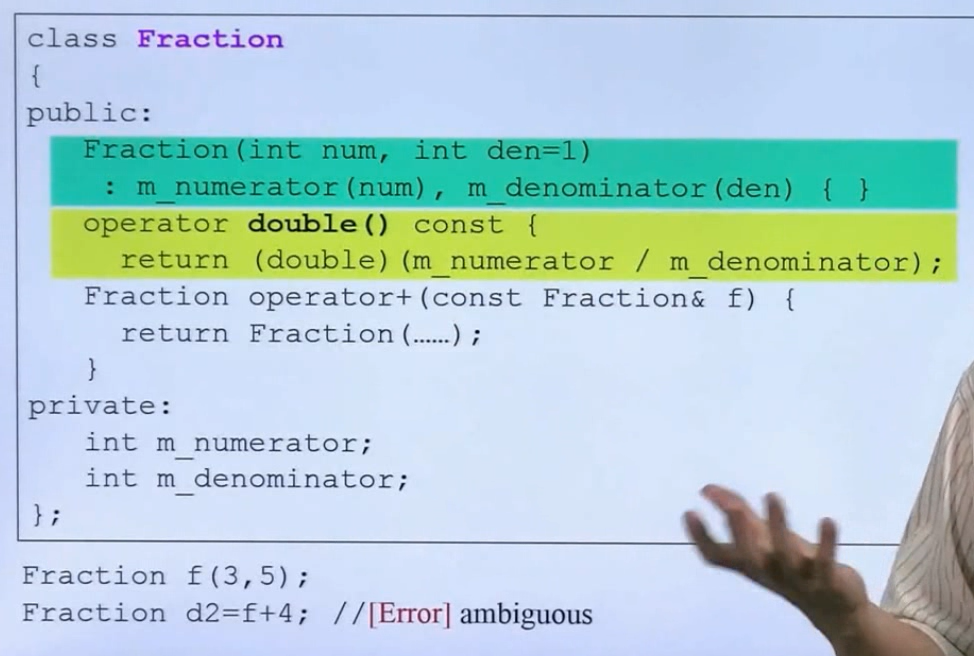

报错  

==不知道自动调用operator+还是构造函数（第二个参数是默认）==

多种方法可行，可以显示构造

2. 

```
class T t = 8;
//调用单参数的构造而不是等于
//等于应该是 t= 8;才会调用
 
```


## .和->
.（点）运算符和 ->（箭头）运算符用于引用类、结构和共用体的成员。
==左边为结构对象时用".",左边为指针对象时，使用->==

1. A.B则A为对象或者结构体；

2. A->B则A为指针，->是成员B提取，A->B是提取A中的成员B，A只能是指向类、结构、联合的指针；

```c++
#include "iostream"

using namespace std;
class A
{
public:
    int a=10;
};


A b;
A *p=&b;
b.a;  //类类型的对象访问类的成员
p->a;  //类类型的指针访问类的成员
cout <<b.a<<endl;
cout <<p->a<<endl;
cout <<(*p).a<<endl;  //等价于p->a
return 0;

```

## 运算符重载    

### <<运算符重载   

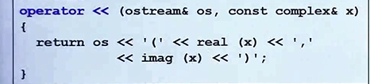  
左侧是函数第一个参数<<右侧是第二个参数  

这个运算符好像必须写在类外实现，因为本体是第二个参数

### ++

T  T::operate ++ ()    对应++class;

T  T::operate ++ (int)   对应 class++;


## 含有指针的类


1. 需要写拷贝复制，拷贝构造和析构，不然就是浅拷贝  
   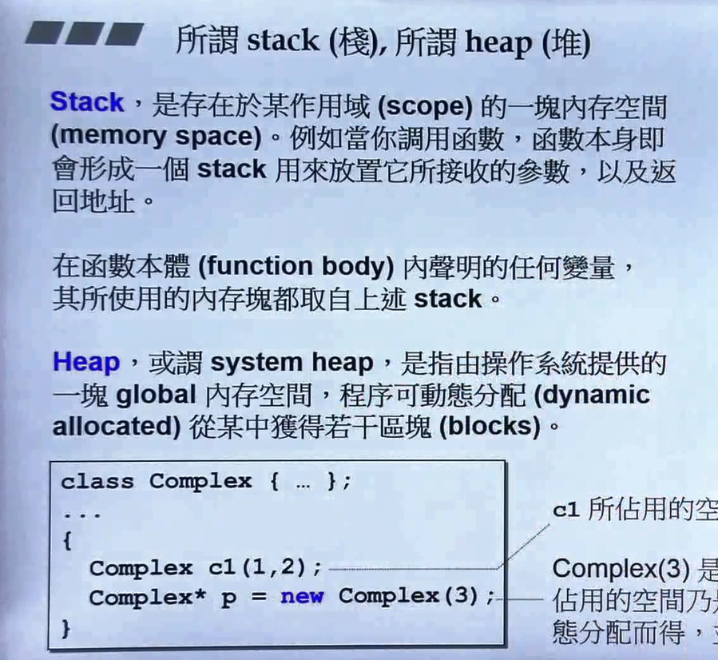

2. ==指针都需要手动释放==

3. new的在heap要手动释放，stack离开作用域就消失了    

4. new 过程的拆分，先分配内存再构造函数，先析构再删除内存

   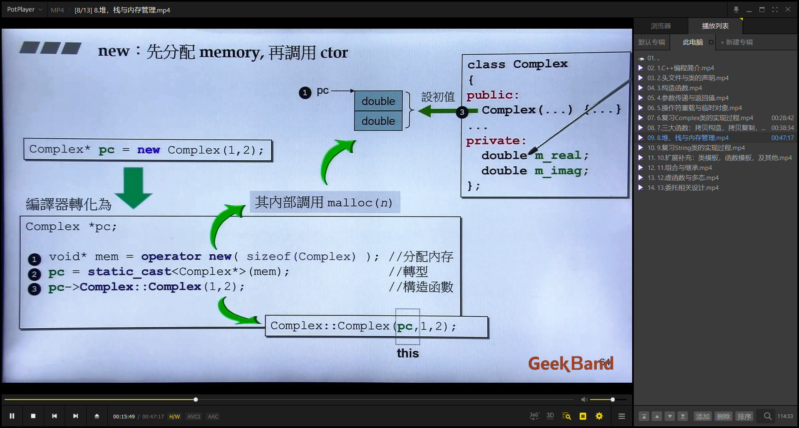    

   

## 指针指向成员函数

```c++
void (T::*pm) (int) =0;
typedef  void (T::*PtrType) (int) =0;
```

  


# 参数作用域
## static

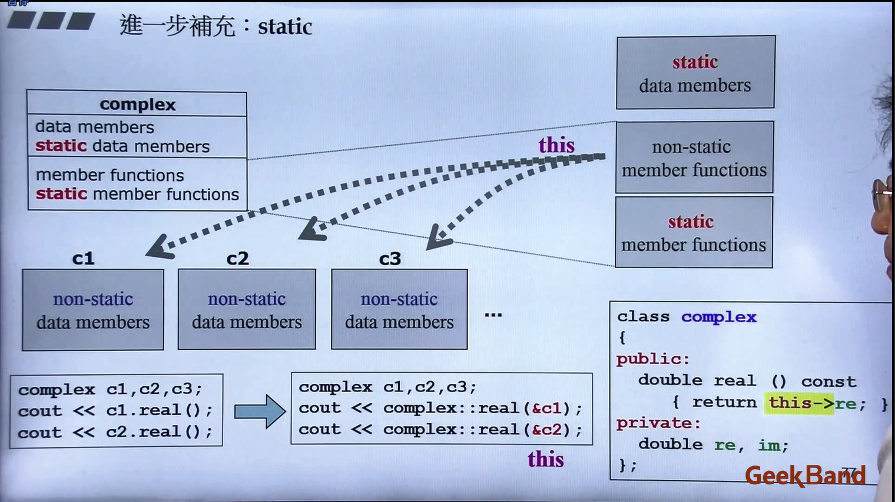 
没有this point,所有对象是一个内存

## 声明周期

1. <br>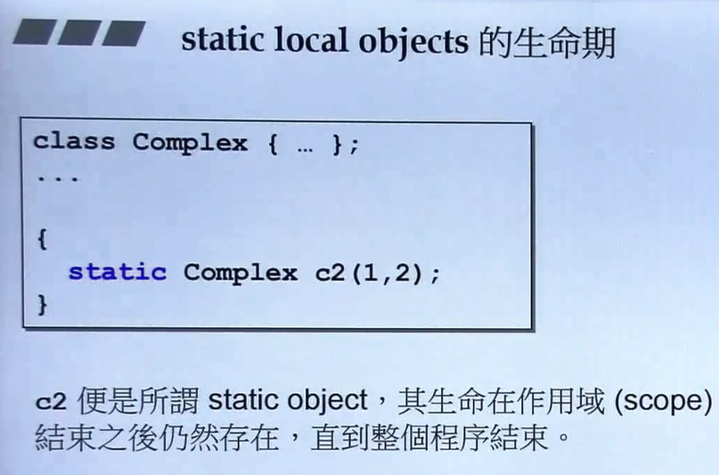
2. <br>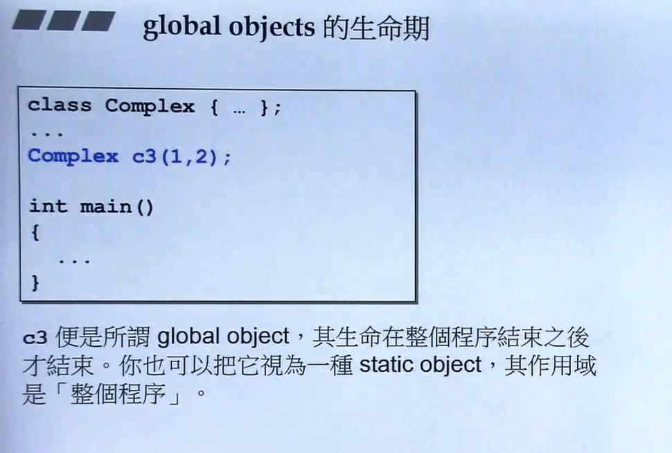


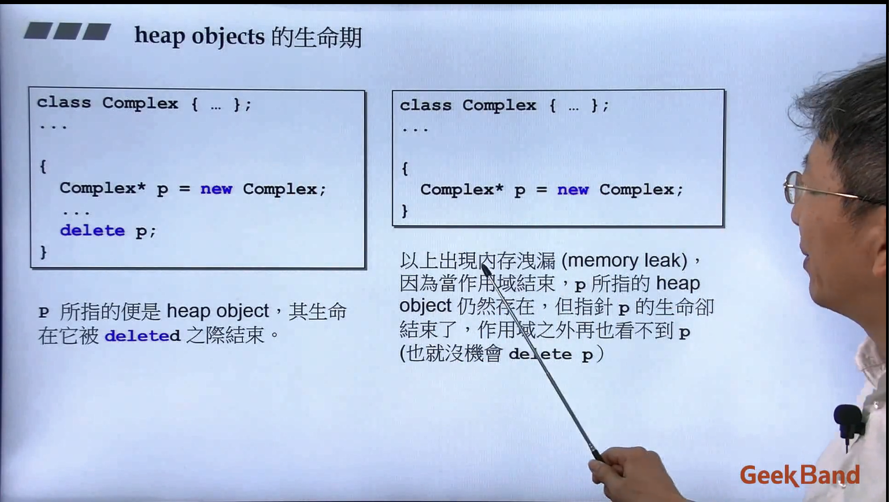

# 继承

## 构造析构

1. ==复合是构造由内而外，析构由外而内== 

2. 子类对象可以初始化父类变量  

3. ==基类析构应该设计成virtual==

   > 

4. 如果在基类的构造和析构调用虚函数， 如果是派生类的话，这个虚函数会调用基类的那一份

   因为先构造基类的时候派生类并为初始化，此时调用派生类的虚函数实现会出问题，析构同理

## 父类 拷贝 构造  子类 

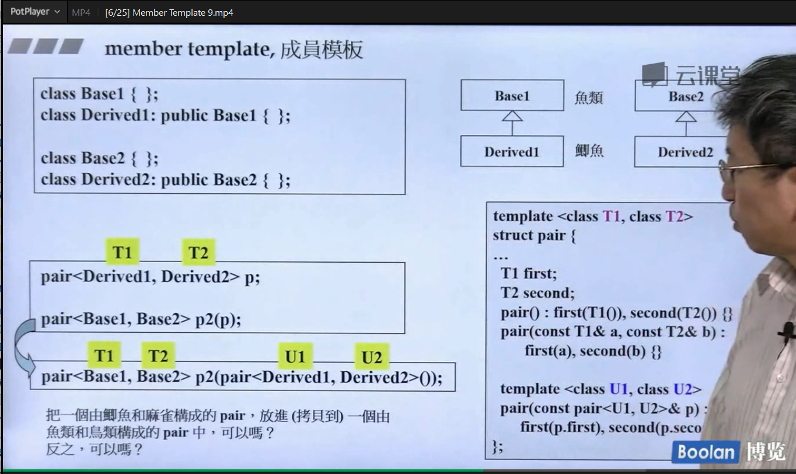

```c++
pair<Base1, Base2> p2(pair<Derived1, Derived2>());
// 即对类型为 Base1 和 Base2 的 pair 变量赋初值为其对应子类 Derived1 和 Derived2

//反之不行

```

要拷贝构造和assign操作在默认时候是由default memberwise initialization

成员默认一一拷贝赋值一份

## 基类数组存子类

> 在 C++ 中，基类数组可以存储派生类对象，但要注意对象切片（slicing）的问题。反之则不成立。
>
> 考虑以下的情况：
>
> ```c++
> cppCopy codeclass Base {
> public:
>  Base() {}
>  virtual ~Base() {}
>  // 其他成员和方法
> };
> 
> class Derived : public Base {
> public:
>  Derived() {}
>  // 派生类的成员和方法
> };
> ```
>
> 现在，你可以创建一个基类数组并将派生类对象存储在其中：
>
> ```c++
> cppCopy codeBase* baseArray[5];
> baseArray[0] = new Derived();  // 存储派生类对象
> baseArray[1] = new Base();     // 存储基类对象
> // 其他赋值操作...
> ```
>
> 但需要注意，如果你通过基类指针数组存储派生类对象，访问这个数组的时候只能看到基类的成员。这就是所谓的切片问题。如果你想访问派生类的成员，需要使用动态类型转换，如 `dynamic_cast`：
>
> ```c++
> cppCopy codeDerived* derivedPtr = dynamic_cast<Derived*>(baseArray[0]);
> if (derivedPtr) {
>  // 现在你可以使用 derivedPtr 访问 Derived 类的成员
> }
> ```
>
> 反之，不能直接将基类数组用于存储派生类对象。例如，下面的代码是错误的：
>
> ```c++
> cppCopy code
> Derived derivedArray[5]; // 错误，不能用 Derived 类型数组存储 Base 对象
> ```
>
> 因为数组的类型是静态的，无法用派生类的类型去初始化基类的数组。


## 继承

public  所有均可访问；

private **类自己的成员函数**或**友元**访问，不能被类对象、子类访问；（封装概念）

protected 类自己、友元以及**子类**访问，不能被类对象访问；(继承概念)

friend 友元，别人是你的朋友，他可以访问我的东西。（但不是我可以访问他的东西）


==这个权限问题主要就是看这个图就可以了，protect和private就是在继承上的不同==

## 多态

函数参数是基类指针或reference但是可能传入的是派生类（实现多态必须借用pointer reference,）

```
void print(基类)
print(派生类对象)  //内存会被裁切掉了
```

具体是哪个子类是==动态绑定的（使用virtual关键字）==

只有到运行时才会解析

## [虚函数](https://blog.csdn.net/Dasis/article/details/121047964)实现多态

- 纯虚  virtual   func = 0，必须由子类实现否则不完整无法创建对象

- 父类虚函数 子类重新实现多态
- [static成员无法设为virtual虚函数](https://blog.csdn.net/hanzhen7541/article/details/98741825)


```c++
#include<iostream>
using namespace std;

// 动物类
class Animal
{
public:
	// 虚函数 virtual
	virtual void speak()
	{
		cout << "动物在说话" << endl;
	}
};

// 猫类
class Cat :public Animal
{
public:
	// 重写：函数返回值类型 函数名 参数列表 三个完全相同
	void speak()
	{
		cout << "小猫在说话" << endl;
	}
};

//狗类
class Dog :public Animal
{
public:
	void speak()
	{
		cout << "小狗在说话" << endl;
	}
};

// 我们希望传入什么对象，那么就调用什么对象的函数
// 如果函数地址在编译阶段就能确定，那么静态联编
// 如果函数地址在运行阶段才能确定，就是动态联编

// 执行说话的函数
// 地址早绑定，在编译阶段就确定函数地址
// 如果想执行让猫说话，那么这个函数地址就不能提前绑定，需要在运行阶段进行绑定，地址晚绑定
void dospeak(Animal& animal)// 类似Animal &animal=cat，父类引用指向子类的传递对象
{
	animal.speak();// 加了virtual后，由于加入的对象不同，确定不同函数地址
}


int main(int argc, char* argv[])
{
    #include<vector>

    Cat cat;
    dospeak(cat);  //小猫说话

    Dog dog;
    dospeak(dog);   //小狗说话  

    vector<Animal*> anis;
    anis.push_back(&cat);
    anis.push_back(&dog);

    for (Animal* a : anis)
    {
        a->speak();   //小猫说话    小狗说话  
    }
}

```

父类虚函数和子类的重新实现 ：

- 如果一个加const  一个不加const是不会override的而是变成两个函数
- 返回值必须类型一样不然报错，除了一个返回类型是 基类的指针或引用，另一个返回的是派生类的基类的指针或引用

## [虚继承](https://blog.csdn.net/weixin_61857742/article/details/127344922)

==虚函数，父类定义，子类再实现==


继承的是一个虚基表

vbptr 指向 vbtable（虚 基类 表），表中记录了一个偏移量，vbptr+偏移量 就是唯一继承的 m_Age 的地址


```c++
1 //动物类
 2 class Animal
 3 {
 4 public:
 5     int m_Age;
 6 };
 7 
 8 //利用虚继承，可以解决菱形继承的问题
 9 //继承方式之前，加上关键字virtual，变为虚继承
10 //被虚继承的 Animal 类，称为虚基类
11 //羊类
12 class Sheep :virtual public Animal
13 {};
14 //驼类
15 class Camel :virtual public Animal
16 {};
17 //草泥马类
18 class Alpaca :public Sheep, public Camel
19 {};
20 
21 void test01()
22 {
23     Alpaca a1;25     //当菱形继承，两个父类拥有相同成员，需要加作用域区分
26     a1.Sheep::m_Age = 18;
27     a1.Camel::m_Age = 28;
28     cout << "a1.Sheep::m_Age = " << a1.Sheep::m_Age << endl;
29     cout << "a1.Camel::m_Age = " << a1.Camel::m_Age << endl;
30 
31     cout << "a1.m_Age = " << a1.m_Age << endl;　　//此时可以直接访问到 a1.m_Age 了
32 }
33 
34 int main()
35 {
36     test01();
37     return 0;
38 }
```


## override

- `override` 是用于指定派生类中的成员函数覆盖基类中的虚函数的关键字。
- 在派生类的函数声明或定义中，使用 `override` 表示该函数是一个覆盖基类虚函数的函数。

### 什么是override

override的翻译是覆盖。实际上它在C++中可以检测哪些[虚函数](https://so.csdn.net/so/search?q=虚函数&spm=1001.2101.3001.7020)没有被重写并报错
注：在[派生类](https://so.csdn.net/so/search?q=派生类&spm=1001.2101.3001.7020)的成员函数中使用override时，如果基类中无此函数，或基类中的函数并不是虚函数，编译器会给出相关错误信息

# pointlike&funclike 

重新了 * -> ()的类罢了


# 模板

模板的typename和class是一样的

## 特化  (指定一个类的模板是特地的函数)

单独类型特例

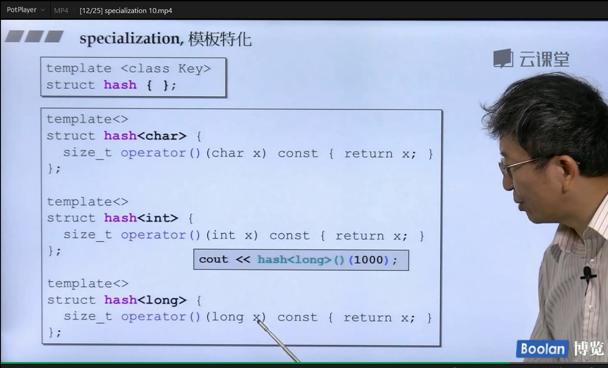


## 偏特化


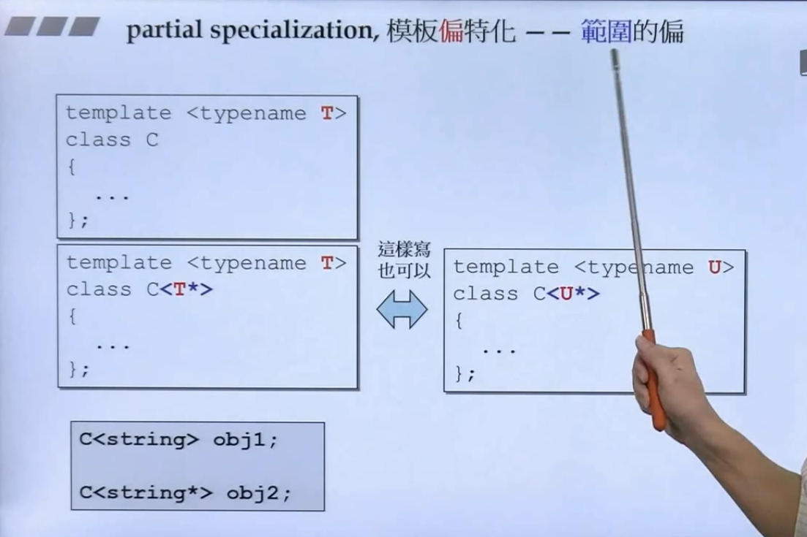

## 模板模板参数  （难）

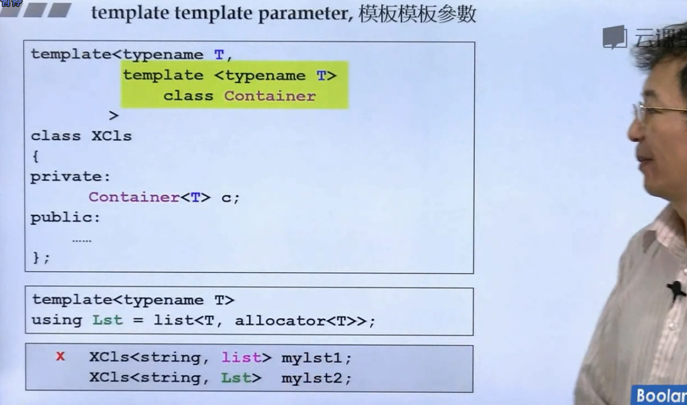


```c++
template<typename T,template<typename T> class Q> >
    class XCl
{
    Q<T> c;
}
Xcls<string,vector>
等效
template<typename T, class Q> >
{
    Q c;
}
Xcls<string,vector<string>>
```


# 特殊关键字

## 可以被多次定义的特例

可以写在头文件被多个模块定义

1. inline 

   直接编译的时候在调用处展开

   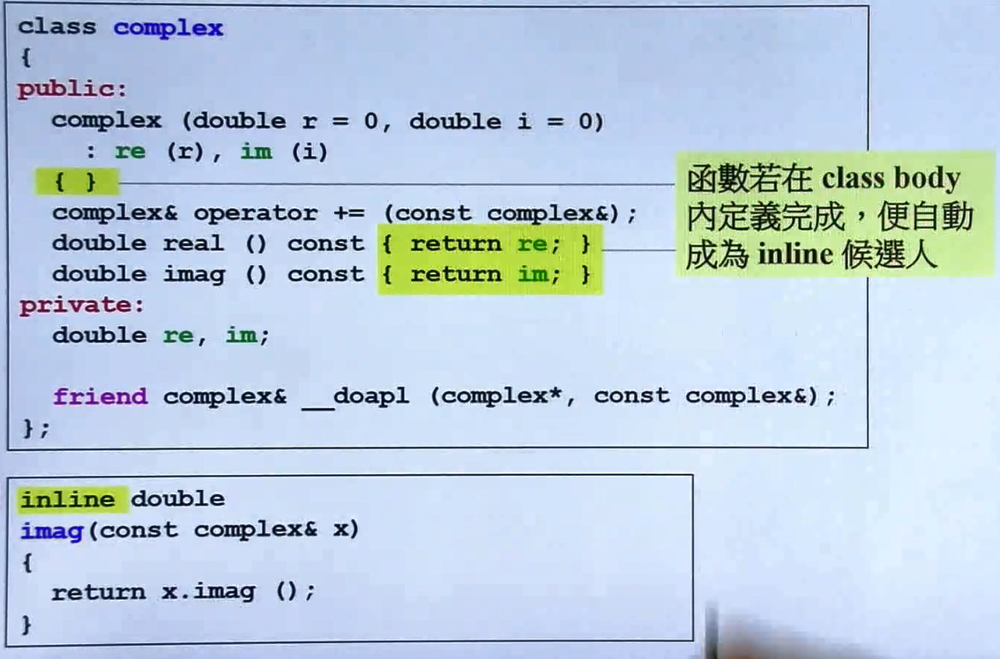

2. const object  

   可以被多次定义

3. static 

   作用域只在file scope

4. extern 

   说明在其他模块找定义，只能在头文件定义

   extern int x = 0;只能在源文件有一处

## inline

直接编译的时候在调用处展开,一般是短小简单的函数

==class主体内的member function 会自动定义为inline==


## const

1. 对象是const调用的方法却不是const会报错==

2. ==const函数不能返回引用因为相当于暴露出去修改权限==

## mutable

修饰的变量改变不算修改const对象状态，可以在const内修改

## explicit

必须显式构造

# 异常处理

## throw

抛出异常   

```
try{
thow   iter_overflow(3,4)(任何一个对象);
}
catch( iter_overflow& iter)
{
      iter.mothed;
}

```

如果本函数没有异常会一直解函数一直到main

throw出来的异常如果到最后也没有被catch,那么程序会abort

## noexcept

- `noexcept` 是一个指定函数异常规范（exception specification）的关键字。

- 在函数声明或定义中，noexcept 后面可以跟随一个表达式，或者直接使用 noexcept，表示函数不会抛出异常。例如：

  ```c++
  cppCopy codevoid myFunction() noexcept;
  void myFunction2() noexcept(true);  // 等效于上面的声明
  ```

- 如果函数在 `noexcept` 规定的情况下抛出了异常，`std::terminate` 会被调用，程序终止。

- 从运行结果就可以看出,*抛出异常*try内部的*throw*()后面程序不会*再执行*,而try外部后面的程序会*继续执行*。==另外,析构函数在生存期结束也会被调用，所以把释放内存放在析构很重要==。

# RTTI

## runtime type identification

```c++
#include <typeinfo>
inline const char* num_sequence::
what_an_i() const {
	return typeid(*this).name()
};
```

可以判断派生类是什么类型，但是

```c++
num_sequence* ps= &fid;
if(typeid(* ps).name()==typeid(Fibonacci)
	ps->genn_elems(64);
```

编译会报错，虽然我们和typeid机制知道是派生类，但是ps指针不知道

所以要用

```c++
static_cast<Fibonacci *>(*ps) 
```


## static_cast

```
在你提供的代码中，static_cast<Shape*>(*res) 尝试将 *res 转换为 Shape* 类型的指针。这种类型的转换通常用于将基类指针指向派生类对象的情况。
```

智能指针和dynamic_cast？


对于你的情况，如果你确定 `res` 的类型是 `Shape` 或其派生类，==并且不需要运行时类型检查，那么 `static_cast` 是合适的选择。如果你需要进行安全的运行时类型检查，建议使用 `dynamic_cast`==


C风格的强制类型转换 `(Shape*)res` 是一种旧式的类型转换语法，也称为C风格的强制类型转换。尽管它在某些情况下是有效的，但不推荐使用，因为它具有较低的类型安全性，并且在面对继承层次结构时可能导致未定义的行为。

# 其他


## [正则表达式](https://blog.csdn.net/m0_56312312/article/details/131059486)


## 编译器的c++版本支持

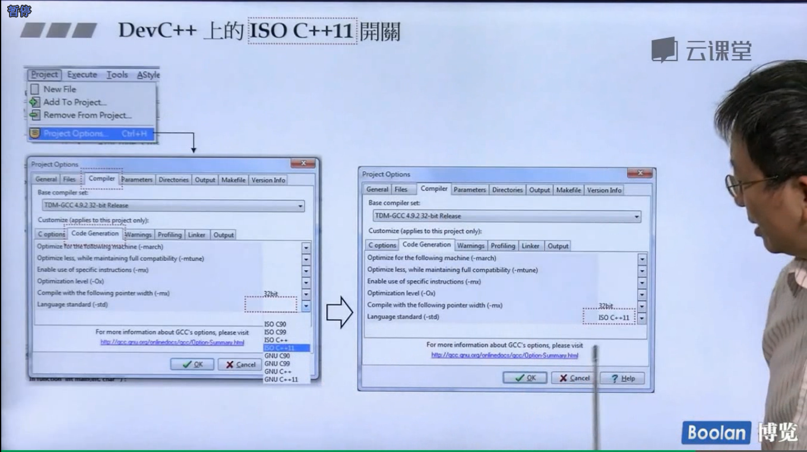

## [编译过程](https://zhuanlan.zhihu.com/p/372004972?utm_id=0)


## [动静态链接](https://www.zhihu.com/question/439231062/answer/1728137221?utm_id=0)


## 堆栈

- [0.前言](https://blog.csdn.net/K346K346/article/details/80849966/#0_4)
- [1.程序内存分区中的堆与栈](https://blog.csdn.net/K346K346/article/details/80849966/#1_9)
- - [1.1 栈简介](https://blog.csdn.net/K346K346/article/details/80849966/#11__10)
  - [1.2 堆简介](https://blog.csdn.net/K346K346/article/details/80849966/#12__20)
  - [1.3 堆与栈区别](https://blog.csdn.net/K346K346/article/details/80849966/#13__42)
- [2.数据结构中的堆与栈](https://blog.csdn.net/K346K346/article/details/80849966/#2_73)
- - [2.1 栈简介](https://blog.csdn.net/K346K346/article/details/80849966/#21__75)
  - [2.2 堆简介](https://blog.csdn.net/K346K346/article/details/80849966/#22__194)
  - - [2.2.1 堆的性质](https://blog.csdn.net/K346K346/article/details/80849966/#221__195)
    - [2.2.2 堆的基本操作](https://blog.csdn.net/K346K346/article/details/80849966/#222__200)
    - [2.2.3 堆操作实现](https://blog.csdn.net/K346K346/article/details/80849966/#223__218)
    - [2.2.4 堆的具体应用——堆排序](https://blog.csdn.net/K346K346/article/details/80849966/#224__301)

堆相对于栈的好处来说：编译器不需要知道存储的数据在堆里存活多长。当需要一个对象时，使用new写一行代码，当执行这行代码时，会自动在堆里进行存储分配。同时，因为以上原因，用堆进行数据的存储分配和清理，需要花费更多的时间。

堆栈，都在ram内存中


## 虚拟内存

- [一、虚拟内存](https://blog.csdn.net/qq_43686863/article/details/129880279#_5)
- [二、C 中的虚拟内存布局](https://blog.csdn.net/qq_43686863/article/details/129880279#C__13)
- [三、C++ 中的虚拟内存布局](https://blog.csdn.net/qq_43686863/article/details/129880279#C__27)
- [四、堆区和栈区的区别](https://blog.csdn.net/qq_43686863/article/details/129880279#_38)


[内存管理——申请超过物理内存容量的内存](https://www.cnblogs.com/Ethan-Code/p/16627754.html)


## 内存管理单元和内存四区

[虚拟地址空间与内存四区](https://blog.csdn.net/qq_58550520/article/details/129063764)


