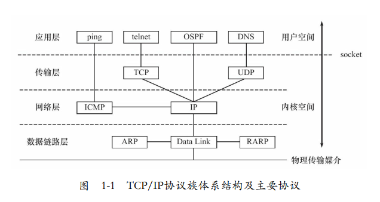
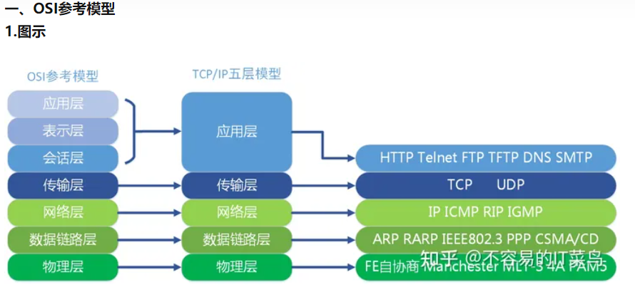
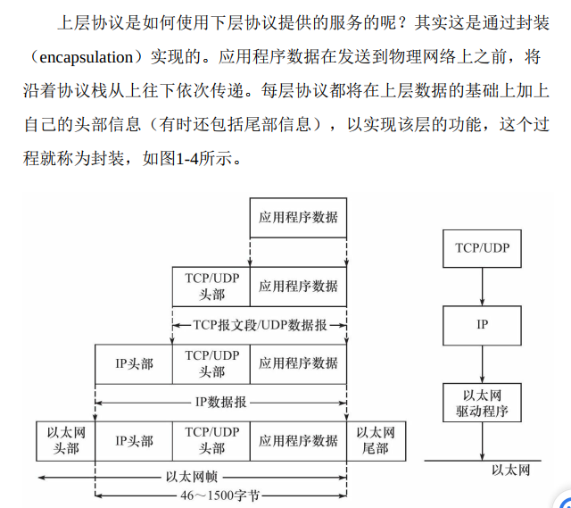
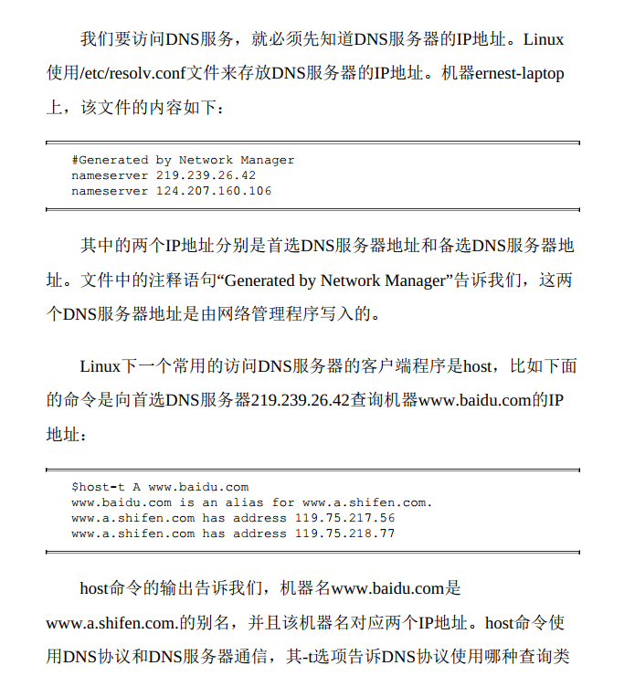
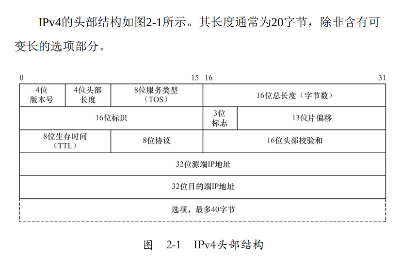
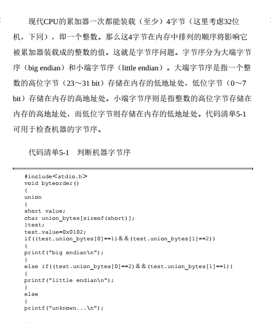

# Linux 高性能服务器编程 无双 笔记

## 第一篇 TCP/IP协议详解

### 第1章 TCP/IP协议族

#### 1.1 TCP/IP协议族体系结构以及主要协议

TCP/IP协议族是一个四层协议系统， 自底而上分别是数据链路层、网络层、 传输层和应用层
  
  

**数据链路层**：它们实现了==IP地址和机器物理地址之间的相互转换==。网络层使用IP地址寻址一台机器， 而数据链路层使用物理地址寻址。一台机器， 因此网络层必须先将目标机器的IP地址转化成其物理地址，才能使用数据链路层提供的服务。
**网络层**：最核心的协议是==IP协议==，[IP协议根据数据包的目的IP地址来决定如何投递它](https://www.bilibili.com/video/BV1DD4y127r4/?spm_id_from=333.999.0.0&vd_source=eef102f4fb053709a57c96d0c876628a)。 如果数据包不能直接发送给目标主机， 那么IP协议就为它寻找一个合适的下一跳路由器， 并将数据包交付给该路由器来转发。 多次重复这一过程， 数据包最终到达目标主机， 或者由于发送失败而被丢弃。
**传输层**:为两台主机上的应用程序提供端到端（ end to end） 的通信。与网络层使用的逐跳通信方式不同， ==传输层只关心通信的起始端和目的端==， 而不在乎数据包的中转过程。 图1-3展示了传输层和网络层的这种区别。

**传输层协议**:主要有三个：==TCP协议==、 ==UDP协议==和SCTP协议。

**TCP协议**为应用层提供可靠的、 面向连接的和基于流的服务。 TCP协议使用超时重传、 数据确认等方式来==确保数据包被正确地发送至目的端==， 因此TCP服务是可靠的。 使用TCP协议通信的双方必须==先建立TCP连接==， 并在内核中为该连接维持一些必要的数据结构， 比如连接的状态、 读写缓冲区， 以及诸多定时器等。 当通信结束时， 双方必须关闭连接以释放这些内核数据。 TCP服务是基于流的。 基于流的数据没有边界（长度） 限制， ==它源源不断地从通信的一端流入另一端==。

**UDP协议**则与TCP协议完全相反， 它为应用层提供不可靠、 无连接和基于数据报的服务。 “不可靠”意味着UDP协议无法保证数据从发送端正确地传送到目的端。 如果数据在中途丢失， 或者目的端通过数据校验发现数据错误而将其丢弃， 则UDP协议只是简单地通知应用程序发送失败。 因此， 使用UDP协议的应用程序通常要自己处理数据确认、 超时重传等逻辑。 UDP协议是无连接的， 即通信双方不保持一个长久的联系， 因此应用程序==每次发送数据都要明确指定接收端的地址（IP地址等信息）== 。 基于数据报的服务， 是相对基于流的服务而言的。 每个UDP数据报都有一个长度，接收端必须以该长度为最小单位将其所有内容==一次性读出==， 否则数据将被截断。

#### 1.2 封装

  

#### 1.3 分用

#### 1.4 测试网络

  

#### 1.5 ARP协议工作原理

#### 1.6 DNS工作原理

我们通常使用机器的域名来访问这台机器， 而不直接使用其IP地址， 比如访问因特网上的各种网站。 那么如何将机器的==域名转换成IP地址呢==？ 这就需要使用域名查询服务。 域名查询服务有很多种实现方式，比如NIS（Network Information Service， 网络信息服务） 、 DNS和本地静态文件等。 本节主要讨论==DNS==

**Linux访问DNS服务**
   

后面接介绍了执行tcpdump抓包观察DNS通信过程

#### 1.7 socket和TCP/IP协议族的关系

前文提到， 数据链路层、 网络层、 传输层协议是在内核中实现的。因此操作系统需要实现一组系统调用， 使得应用程序能够访问这些协议提供的服务。 实现这组系统调用的==API==主要有两套： ==socket==和XTI。

由socket定义的这一组API提供如下两点功能： 一是将应用程序数据从用户缓冲区中复制到TCP/UDP内核发送缓冲区， 以交付内核来==发送数据==， 或者是从内核TCP/UDP接收缓冲区中复制数据到用户缓冲区， ==以读取数据==； 二是应用程序可以通过它们来修改内核中各层协议的某些头部信息或其他数据结构， 从而精细地控制底层通信的行为。

### 第2章 IP协议详解

#### 2.1 IP服务的特点

==IP协议==是TCP/IP协议族的动力， 它为上层协议提供==无状态、 无连
接、 不可靠的服务==

**无状态**：==比如发送端发送出的第N个IP数据报可能比第N+1个IP数据报后到达接收端==， 而同一个IP数据报也可能经过不同的路径多次到达接收端。 在这两种情况下， 接收端的IP模块无法检测到乱序和重复， 因为这些IP数据报之间没有任何上下文关系。 接收端的IP模块只要收到了完整的IP数据报（如果是IP分片的话， IP模块将先执行重组） ， 就将其数据部分（TCP报文段、 UDP数据报或者ICMP报文） 上交给上层协议。 那么从上层协议来看， 这些数据就可能是乱序的、 重复的。 面向连接的协议， ==比如TCP协议， 则能够自己处理乱序的、 重复的报文段， 它递交给上层协议的内容绝对是有序的、 正确的==。
无连
**不可靠**
**无连接**

#### 2.2 IPv4头部结构

  
2.2.2 使用tcpdump观察IPv4头部结构

#### 2.3 IP分片

#### 2.4 IP路由

#### 2.5 IP转发

前文提到， 不是发送给本机的IP数据报将由数据报转发子模块来处理。 ==路由器都能执行数据报的转发操作， 而主机一般只发送和接收数据报==， 这是因为主机上/proc/sys/net/ipv4/ip_forward内核参数默认被设置为0。 我们可以通过修改它来使能主机的数据报转发功能（在测试机器Kongming20上以root身份执行

#### 2.6 重定向

#### 2.7 IPv6头部结构

### 第3章 TCP协议详解

#### 3.1 TCP服务的特点

使用TCP协议通信的==双方必须先建立连接， 然后才能开始数据的读写。 双方都必须为该连接分配必要的内核资源==， 以管理连接的状态和连接上数据的传输。 TCP连接是全双工的， 即双方的数据读写可以通过一个连接进行。 ==完成数据交换之后， 通信双方都必须断开连接以释放系统资源==。

TCP传输是可靠的。 首先， TCP协议采用发送应答机制， 即发送端发送的每个TCP报文段都必须得到接收方的应答， 才认为这个TCP报文段传输成功。 其次， TCP协议采用==超时重传机制==， 发送端在发送出一个TCP报文段之后启动定时器， 如果在定时时间内未收到应答， 它将重发该报文段。 最后， 因为TCP报文段最终是以IP数据报发送的， ==而IP数据报到达接收端可能乱序、 重复， 所以TCP协议还会对接收到的TCP报文段重排、 整理， 再交付给应用层==。

#### 3.2 TCP头部结构

#### 3.3 TCP连接的建立和关闭

#### 3.4 TCP状态转移

#### 3.5 复位报文段

#### 3.6 TCP交互数据流

#### 3.7 TCP成块数据流

#### 3.8 带外数据

#### 3.9 TCP超时重传

#### 3.10 拥塞控制

### 第4章 TCP/IP通信案例： 访问Internet上的Web服务器

#### 4.1 实例总图

#### 4.2 部署代理服务器

#### 4.3 使用tcpdump抓取传输数据包

#### 4.4 访问DNS服务器4.5 本地名称查询

#### 4.6 HTTP通信

#### 4.7 实例总结

## 第二篇 深入解析高性能服务器编程

### 第5章 Linux网络编程基础API

它探讨Linux网络编程基础API与内核中TCP/IP协议族之间的关系， 并为后续章节提供编程基础。 我们将从如下3个方面讨论Linux网络API：

- **socket地址API**
  socket最开始的含义是一个IP地址和端口对（ip， port） 。 它唯一地表示了使用TCP通信的一端。 本书称其socket地址。
- **socket基础API**
  socket的主要API都定义在sys/socket.h头文件中，==包括创建socket、 命名socket、 监听socket、 接受连接、 发起接、 读写数据、 获取地址信息、 检测带外标记， 以及读取和设置socket选项==。
- **网络信息API**
  Linux提供了一套网络信息API， ==以实现主机名和IP地址之间的转换==， 以及服务名称和端口号之间的转换。 这些API都定义在netdb.h头文件中， 我们将讨论其中几个主要的函数

#### 5.1 socket地址API

**union** ：共用体表示几个变量共用一个内存位置，在不同的时间保存不同的数据类型和不同长度的变量

#### 5.2 创建socket

#### 5.3 命名socket

#### 5.4 监听socket

#### 5.5 接受连接

#### 5.6 发起连接

#### 5.7 关闭连接

#### 5.8 数据读写

#### 5.9 带外标记

#### 5.10 地址信息函数

#### 5.11 socket选项

#### 5.12 网络信息API

### 第6章 高级I/O函数

#### 6.1 pipe函数

#### 6.2 dup函数和dup2函数

#### 6.3 readv函数和writev函数6.4 sendfile函数

#### 6.5 mmap函数和munmap函数

#### 6.6 splice函数

#### 6.7 tee函数

#### 6.8 fcntl函数

### 第7章 Linux服务器程序规范

#### 7.1 日志

#### 7.2 用户信息

#### 7.3 进程间关系

#### 7.4 系统资源限制

#### 7.5 改变工作目录和根目录

#### 7.6 服务器程序后台化

### 第8章 高性能服务器程序框架

#### 8.1 服务器模型

#### 8.2 服务器编程框架

#### 8.3 I/O模型

#### 8.4 两种高效的事件处理模式

#### 8.4.3 模拟Proactor模式

#### 8.5 两种高效的并发模式

#### 8.6 有限状态机

#### 8.7 提高服务器性能的其他建议

### 第9章 I/O复用

#### 9.1 select系统调用

#### 9.2 poll系统调用

#### 9.3 epoll系列系统调用

#### 9.4 三组I/O复用函数的比较

#### 9.5 I/O复用的高级应用一： 非阻塞connect

#### 9.6 I/O复用的高级应用二： 聊天室程序

#### 9.7 I/O复用的高级应用三： 同时处理TCP和UDP服务

#### 9.8 超级服务xinetd

### 第10章 信号

#### 10.1 Linux信号概述

#### 10.2 信号函数

#### 10.3 信号集

#### 10.4 统一事件源

#### 10.5 网络编程相关信号

### 第11章 定时器

#### 11.1 socket选项SO_RCVTIMEO和SO_SNDTIMEO

#### 11.2 SIGALRM信号

#### 11.3 I/O复用系统调用的超时参数

#### 11.4 高性能定时器

### 第12章 高性能I/O框架库Libevent12.1 I/O框架库概述

#### 12.2 Libevent源码分析

### 第13章 多进程编程

#### 13.1 fork系统调用

#### 13.2 exec系列系统调用

#### 13.3 处理僵尸进程

#### 13.4 管道

#### 13.5 信号量

#### 13.6 共享内存

#### 13.7 消息队列

#### 13.8 IPC命令

#### 13.9 在进程间传递文件描述符

### 第14章 多线程编程

#### 14.1 Linux线程概述

#### 14.2 创建线程和结束线程

#### 14.3 线程属性

#### 14.4 POSIX信号量

#### 14.5 互斥锁

#### 14.6 条件变量

#### 14.7 线程同步机制包装类

#### 14.8 多线程环境第15章 进程池和线程池

#### 15.1 进程池和线程池概述

#### 15.2 处理多客户

#### 15.3 半同步/半异步进程池实现

#### 15.4 用进程池实现的简单CGI服务器

#### 15.5 半同步/半反应堆线程池实现

#### 15.6 用线程池实现的简单Web服务器

## 第三篇 高性能服务器优化与监测

### 第16章 服务器调制、 调试和测试

#### 16.1 最大文件描述符数

#### 16.2 调整内核参数

#### 16.3 gdb调试

#### 16.4 压力测试

### 第17章 系统监测工具

#### 17.1 tcpdump

#### 17.2 lsof

#### 17.3 nc

#### 17.4 strace

#### 17.5 netstat

#### 17.6 vmstat

#### 17.7 ifstat17.8 mpstat

