## IP,mac地址，路由器数据转发


- [路由器转发数据包过程](https://wenku.baidu.com/view/21167aa16237ee06eff9aef8941ea76e58fa4ad1.html?_wkts_=1689691064618)
- [路由器数据转发博客](https://wenku.baidu.com/view/8889ee8afbc75fbfc77da26925c52cc58bd690ab.html?_wkts_=1688971628224&bdQuery=%E6%95%B0%E6%8D%AE%E5%8C%85%E7%BB%8F%E8%BF%87%E6%AF%8F%E4%B8%80%E4%B8%AA%E8%B7%AF%E7%94%B1%E5%99%A8%E9%83%BD%E4%BC%9A%E8%A2%AB%E6%8B%86%E5%BC%80%E5%90%97)

- [关于路由器交换机(数据如何经过路由器交换机)](https://www.luyouqi.com/shezhi/12430.html)

- 其余b站收藏

- 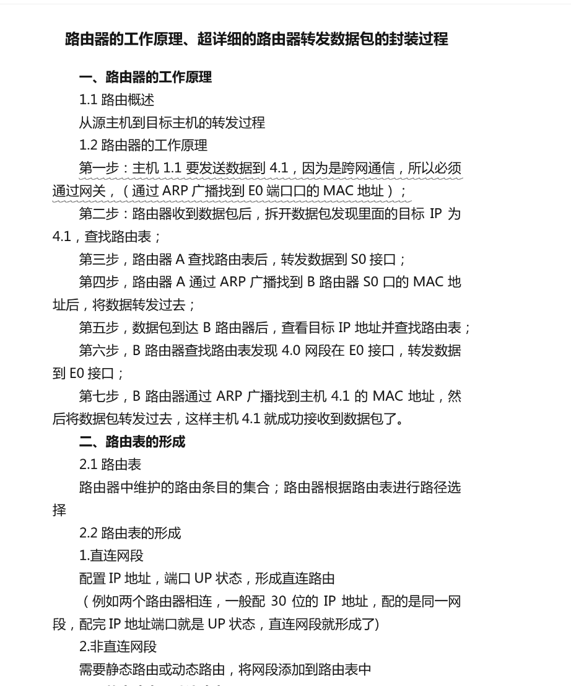

  ------

## NAT


大内网


内网之上还是一层NAT,还是局域网IP

## 桥接


桥接没有NAT ip转换


pc3向上访问后，路由器记得数据路径和映射才能通过NAT反向传输到pc3


## Socket

*socket*一般指套接字。 所谓套接字(Socket)，就是对网络中不同主机上的应用进程之间进行双向通信的端点的抽象。一个套接字就是网络上进程通信的一端，提供了应用层进程利用网络协议交换数据的机制。从所处的地位来讲，套接字上联应用进程，下联网络协议栈，是应用程序通过网络协议进行通信的接口，是应用程序与网络协议栈进行交互的接口

Socket的通信模式也是基于文件操作的ꎮ客户端和服务端均对一个文件完成“打开－读/写－关闭”的操作通过此文件传输信息完成通信

### 监听通信文件描符


TCP不是有吗三次握手，当客户端发送连接请求给服务器端，服务器端会回应请求，这就是监听写缓冲区的内容

### ubuntu一些socket命令

```shell
ssh username@server_ip_address
ssh vip417@10.193.21.197 -p 6000
ifconfig

netstat -apn | grep clinet
netstat -apn | grep 8888
grep 查找字符串


ps ajx 父进程
ps aux 占用率
```


## TCP建立连接，发送流程和断开连接

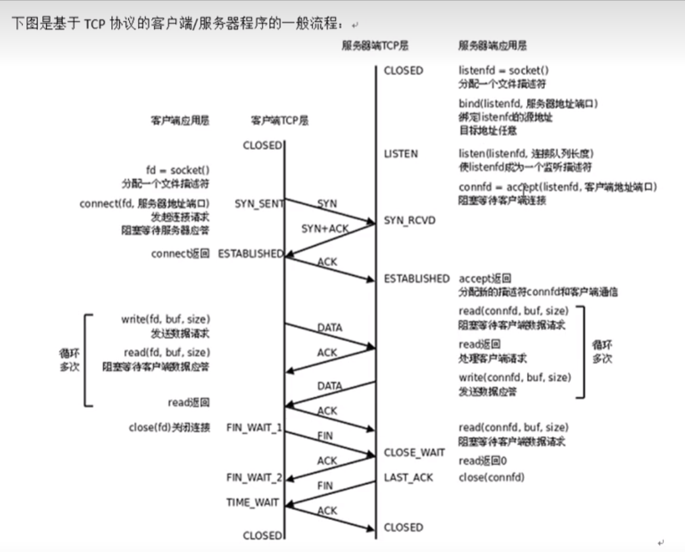  


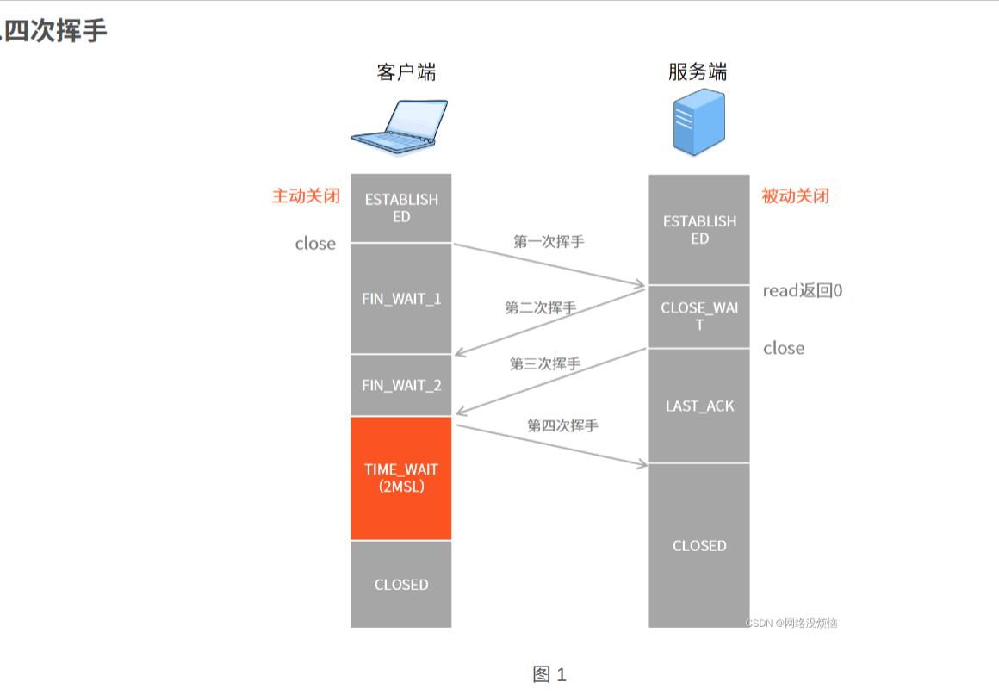  

## [TCP三次握手四次挥手，一文读懂四次挥手以及为什么2，3不能合并](https://blog.csdn.net/weixin_28673511/article/details/129981737)

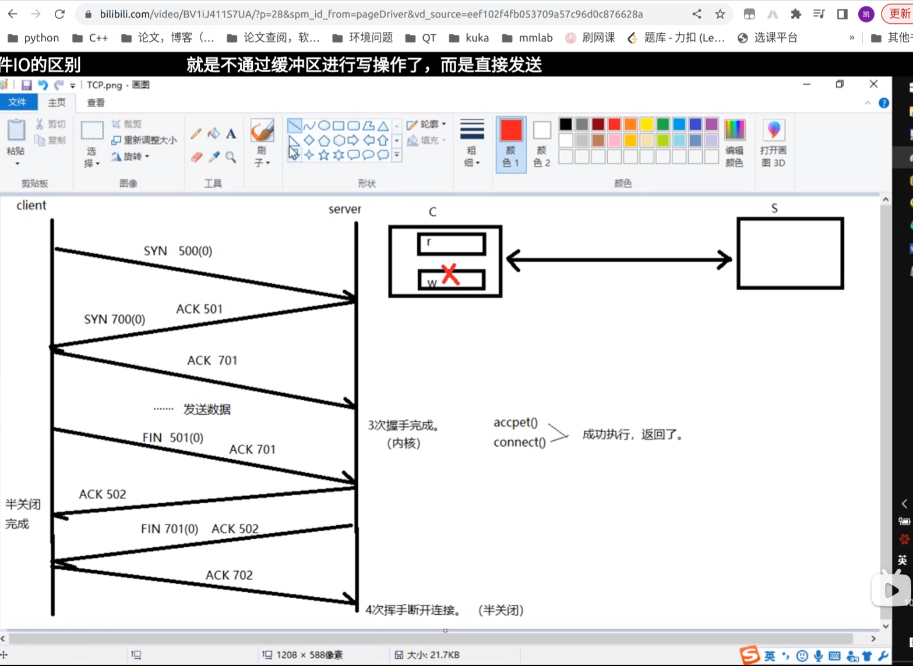  
半关闭，关闭了缓冲区但是可以发送ack


## 状态转换图
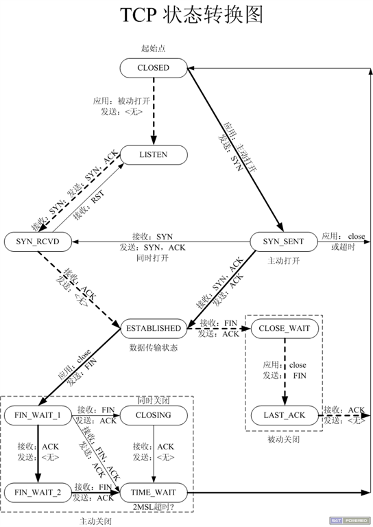  


## goto函数
```
do
{
    break;
}while(0)
```


## 端口复用
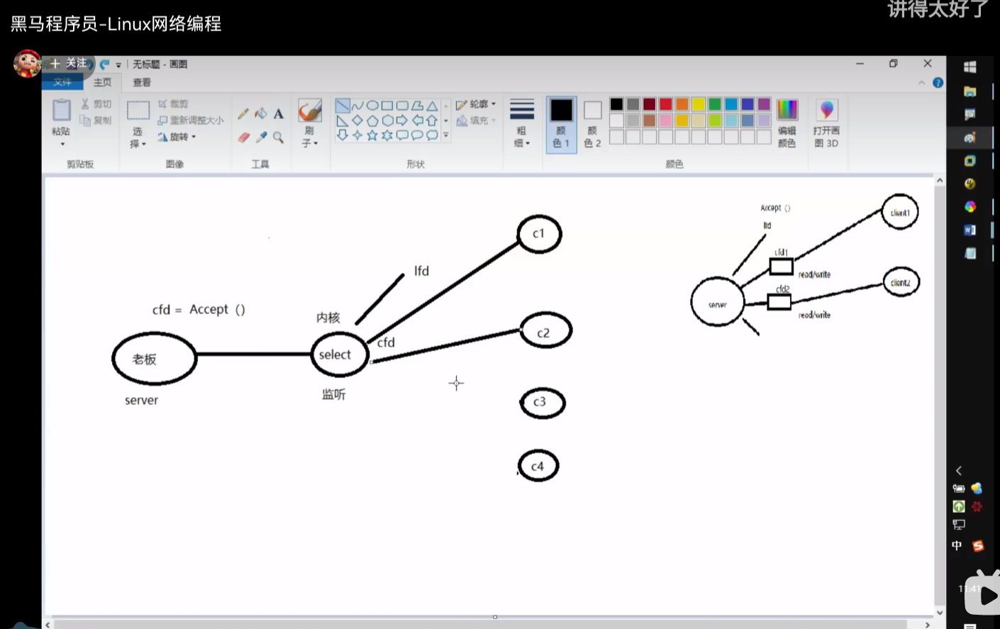  
推测是利用的内核中断对时间进行执行回调函数
多路io转接

## epoll 反应堆

> 高并发文件监听树
>
> 多路IO复用
>
> 一个线程监听多个IO,是通过==事件==触发回调

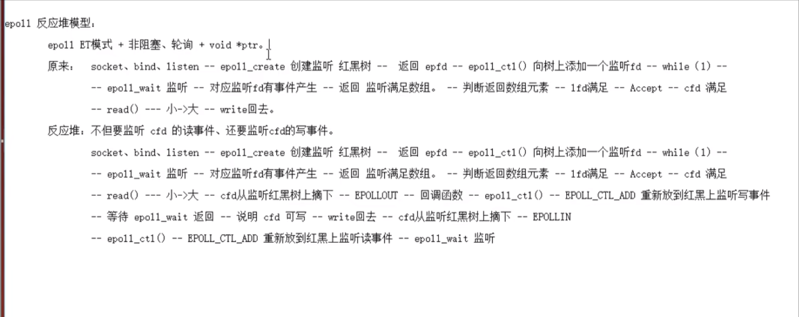  
本质就是把一系列变量封装到 myevent_s

```c++
struct myevent_s {
    int fd;                                                 //要监听的文件描述符
    int events;                                             //对应的监听事件
    void *arg;                                              //泛型参数
    void (*call_back)(int fd, int events, void *arg);       //回调函数
    int status;                                             //是否在监听:1->在红黑树上(监听), 0->不在(不监听)
    char buf[BUFLEN];
    int len;
    long last_active;                                       //记录每次加入红黑树 g_efd 的时间值
};
```
然后myevent_s整体复制给epoll_event的 epv.data.ptr,   ptrs是一个void *
```c++
struct epoll_event epv = {0, {0}};
int op;
epv.data.ptr = ev;c
epv.events = ev->events = events; 
```

触发后直接调时间的ev->call_back, 就是epv.data.ptr指向的myevent_s.call_back
```c++
//读就绪事件
if ((events[i].events & EPOLLIN) && (ev->events & EPOLLIN)) 
{
    //ev->call_back(ev->fd, events[i].events, ev->arg);
    ev->call_back(ev->fd, events[i].events, ev);
}
//写就绪事件
if ((events[i].events & EPOLLOUT) && (ev->events & EPOLLOUT))
{
    //ev->call_back(ev->fd, events[i].events, ev->arg);
    ev->call_back(ev->fd, events[i].events, ev);
}
```

## 线程池
###  pthread_cond_broadcast
您提出的问题是非常重要的，涉及到在使用 pthread_cond_broadcast 时的一个关键点：多个等待线程在被唤醒后，是如何与互斥锁结合使用的。

在使用条件变量时，pthread_cond_broadcast 会唤醒所有等待在条件变量上的线程，但这并不意味着所有这些线程可以立即获得互斥锁。只有一个线程能够获得互斥锁，并且可以继续执行其临界区代码，其他线程则需要等待互斥锁可用。

互斥锁的目的是确保在同一时间只有一个线程可以进入临界区。在使用 pthread_cond_broadcast 后，唤醒的多个线程都会竞争互斥锁，但只有一个线程会成功获取锁。其他线程将会在互斥锁不可用时阻塞等待。

以下是一个简单示例，说明了在使用 pthread_cond_broadcast 后，多个线程之间如何与互斥锁交互：


### pthread_cond_wait
```c++
    /*添加任务到任务队列里*/
    pool->task_queue[pool->queue_rear].function = function;
    pool->task_queue[pool->queue_rear].arg = arg;
    pool->queue_rear = (pool->queue_rear + 1) % pool->queue_max_size;       /* 队尾指针移动, 模拟环形 */
    pool->queue_size++;

    /*添加完任务后，队列不为空，唤醒线程池中 等待处理任务的线程*/
    pthread_cond_signal(&(pool->queue_not_empty));
    //连续唤醒两次？       //如果有任务，就不会pthread_cond_wait，线程会一直处理任务
    pthread_mutex_unlock(&(pool->lock));
    //解除的是自己的锁

    return 0;
}

/* 线程池中各个工作线程 */
void *threadpool_thread(void *threadpool)
{
    threadpool_t *pool = (threadpool_t *)threadpool;
    threadpool_task_t task;

    while (true) 
	{
        /* Lock must be taken to wait on conditional variable */
        /*刚创建出线程，等待任务队列里有任务，否则阻塞等待任务队列里有任务后再唤醒接收任务*/
        pthread_mutex_lock(&(pool->lock));

        /*queue_size == 0 说明没有任务，调 wait 阻塞在条件变量上, 若有任务，跳过该while*/
        while ((pool->queue_size == 0) && (!pool->shutdown)) 
		{  
            printf("thread 0x%x is waiting\n", (unsigned int)pthread_self());
            pthread_cond_wait(&(pool->queue_not_empty), &(pool->lock));//暂停到这
            //等待期间解锁，满足条件再加锁！！！！！！！！！！,可以加锁成功，上面signal后解开了
```


## 一些并发编程的概念
[异步和并行、并发的区别](https://blog.csdn.net/wangxiaosu0501/article/details/124602000)

[什么是上下文切换](https://zhuanlan.zhihu.com/p/626209824)

[什么时候上下文切换和分类](https://blog.csdn.net/zydybaby/article/details/127080584)

[上下文切换的过程](https://blog.csdn.net/a2591748032/article/details/131545148)

[多线程多进程和协程的例子和python下的优缺点总结](https://blog.csdn.net/csdncjh/article/details/127328570)

[深入浅出理解进程、线程、协程——优缺点、举例说明](https://www.cnblogs.com/hello-python2020/p/12599589.html)

[线程池例子和获取返回值的异步调用★★★★★](https://www.cnblogs.com/lxd670/p/17035803.html)

协程是单个线程内基于事件和回调的异步策略：
比如阻塞任务是阻止当前线程继续进行的任务。
如果在 asyncio 程序中执行阻塞任务，相当于回调函数，它会停止整个事件循环，从而阻止任何其他协程继续进行
但是线程cpu会调度给别的并发的任务
## libevent
```
cd /home/wangkai/black_horse/socket/网络编程第6天/文档/libevent-2.0.22-stable/
./configure
make
sudo make install
cd sample/
gcc hello-world.c -o  hello_world -levent
history
```
### gcc编译加动态库
gcc mutl_thread_adv.c wrap.c -o mutl_thread_adv -Wall -lpthread
gcc hello-world.c -o  hello_world -levent
### 事件的异步通信模型

## html
www.w3school.com.cn/html/index.asp
www.runoob.com


## HTTP
GET 不携带数据
POST 携带数据
90秒返回空断开连接了


## [sscanf和正则表达式](https://blog.csdn.net/m0_50668851/article/details/111614025)
deerchao.net/tutorials/regex/regex.htm
www.jb51.net/tools/regexsc.htm

# webserver

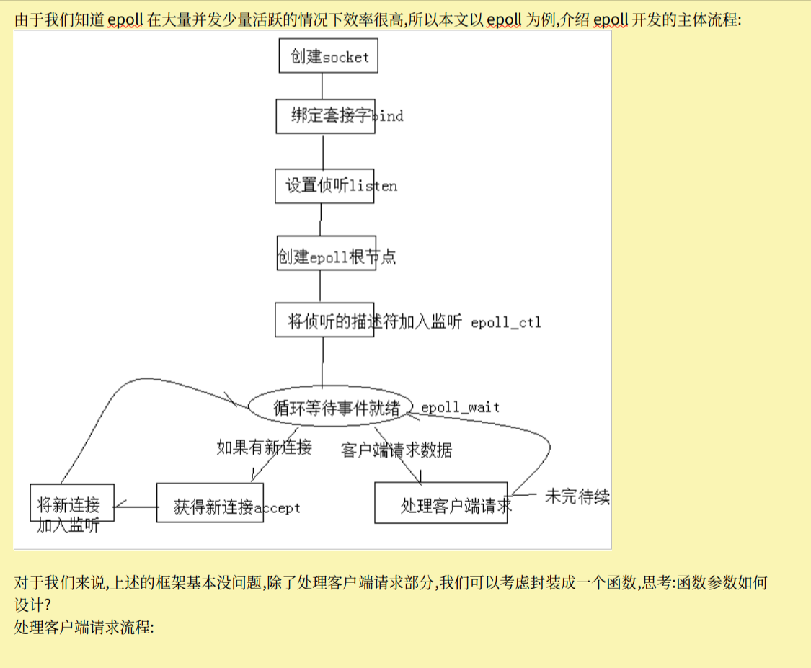

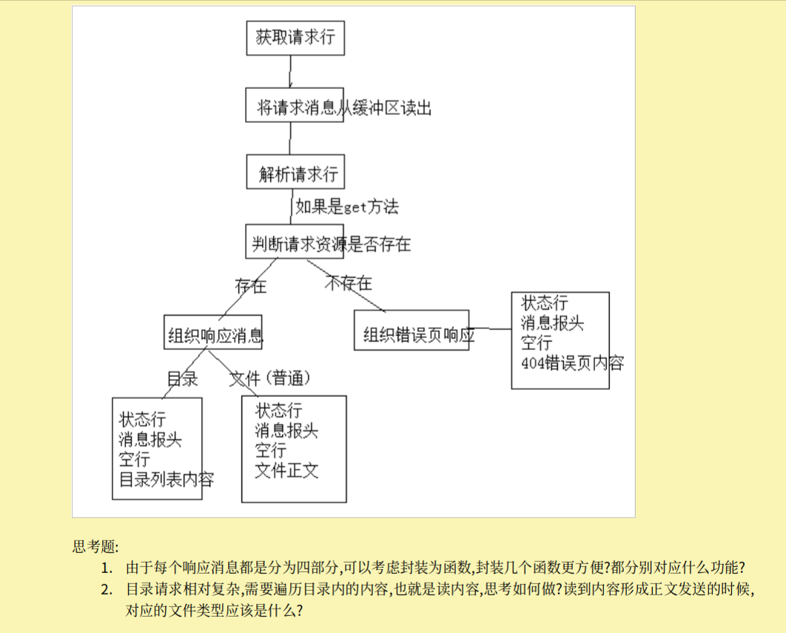


### [阿里云服务器是如何实现每台服务器都是公网IP的呢?](https://it.sohu.com/a/701269221_121751176)

### [华为云](https://www.bilibili.com/video/BV113411s7sM/?spm_id_from=333.337.search-card.all.click&vd_source=eef102f4fb053709a57c96d0c876628a)
领券，买，重置密码，安装宝塔，
mm:Wk20000726
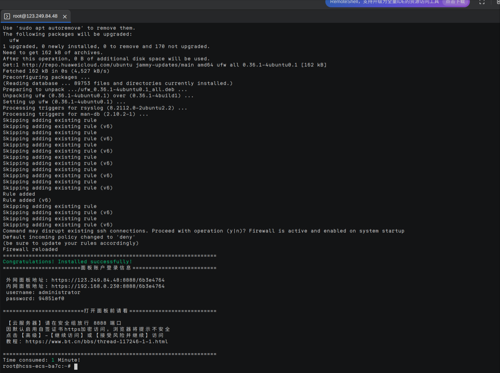  
http://123.249.84.48:8888/6b3e4764
administrator
n
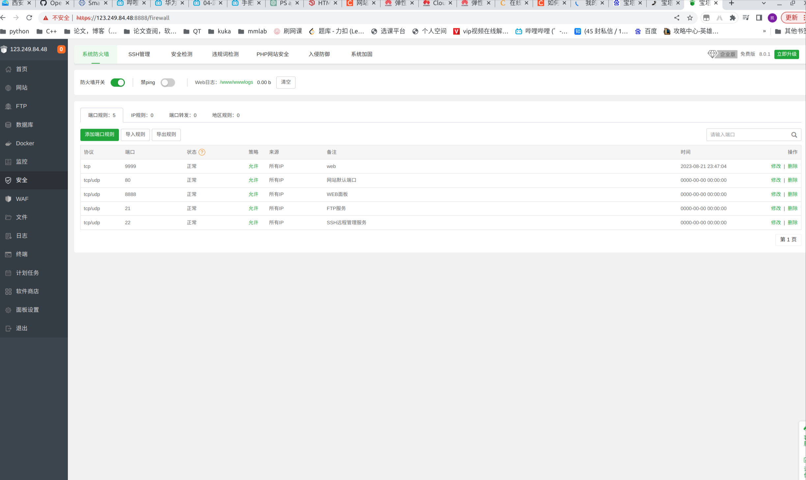  
要开防火墙

### [穿 透](https://blog.csdn.net/probezy/article/details/126665890)

【B站最详细内网穿透原理，看了包懂，全是干货！-哔哩哔哩】 https://b23.tv/cLf8naI


  


### 问题
- **服务器应该有3m的上限。写的过快导致socket暂时无法使用**
```
int send_file(int cfd, char *fileName)
{
	//打开文件
	int idx=0;
	int fd = open(fileName, O_RDONLY);
	if(fd<0)
	{
		perror("open error");
		return -1;
	}
	//循环读文件, 然后发送
	int n;
	char buf[1024];
	while(1)
	{
		memset(buf, 0x00, sizeof(buf));
		printf("read:%d\n",idx++);
		n = read(fd, buf, sizeof(buf));
		printf("read%d\n",idx++);
		if(n<=0)
		{
			break;
		}
		else 
		{
			printf("Write:%d\n",idx++);
			Write(cfd, buf, n);
			printf("Writed:%d\n",idx++);
		}
		usleep(1000); !!!!!!!!!!!!!!!!!!!!!!!!!!!!!!!!!!!!!!!!!!

	}
}
```
成功了,但是传mp3就中断了，不知道为什么

- **24期的代码应该还是有编码啥的问题** 
- 而且后面就该网页无法正常运作123.249.84.48 目前无法处理此请求。 不能挂梯子
HTTP ERROR 502

!!!错误没有判断errno
最后一个错误如果是缓存
EINTR EAGAIN应该continue


# [服务器网站部署](https://mp.weixin.qq.com/s/Xfcv3vnlkrKDz4OTAA8_RQ)
