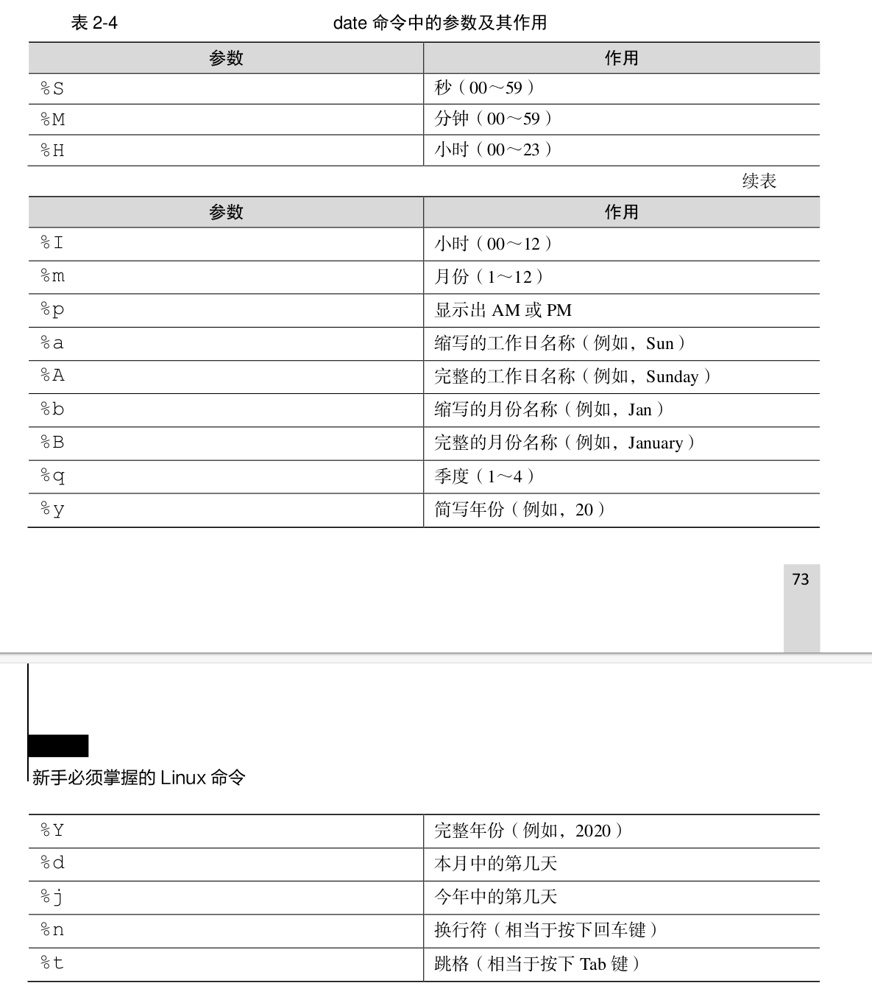
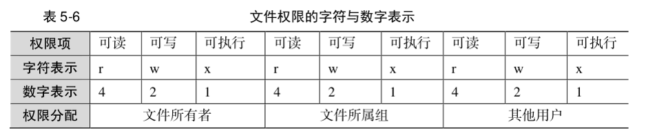

# [Linux基础网页教程](https://subingwen.cn/linux/)

### 第 1 章 Linux 基础

- 初识 Linux 操作系统
- 文件管理命令
- 用户管理命令
- 压缩命令
- 查找命令
- Vim 的使用
- GCC
- 静态库和动态库
- Makefile
- GDB 调试

### 第 2 章 文件 IO

- 文件描述符
- Linux 系统 IO
- 文件状态和属性信息
- 文件描述符复制和重定向
- 目录的遍历

### 第 3 章 进程和线程

- 进程控制
- 管道
- 内存映射区
- 共享内存
- 信号
- 守护进程
- 多线程
- 线程同步
- 线程池 - C 语言版
- 线程池 - C 改 C++ 版

### 第 4 章 套接字通信 tcp io多路复用

- 套接字 socket
- 三次握手、四次挥手
- TCP 状态转换
- 服务器并发
- TCP 数据粘包的处理
- 套接字通信类的封装
- IO 多路转接（复用）之 select
- IO 多路转接（复用）之 poll
- IO 多路转接（复用）之 epoll
- 基于 UDP 的套接字通信
- UDP 之广播
- UDP 之组播（多播）


# Linux就该这么学

## [一个不错的笔记](https://blog.51cto.com/liruilong/5931226)


## 软件管理


### sudo apt install


### sudo dpkg - i 


## 常用命令 conda 


- conda -V
- conda create -n  name  py=3.7
- conda activate name
- conda deactivate
- C:\Program Files\NVIDIA Corporation\NVSMI，nvidia-smi  就可以看到cuda版本
- nvcc -V   torch版本这个一致
- conda env list
- conda info --env

## 常用shell命令

### 命令参数


```shell
//短格式可以合并
ps -aux  == ps -a -u -x


```

```python
import argparse

def parse_args():
    parser = argparse.ArgumentParser(description='Train a 3D detector')
    parser.add_argument('config', help='train config file path')
    parser.add_argument('--work-dir', help='the dir to save logs and models')
    parser.add_argument(
        '--amp',
        action='store_true',
        default=False,
        help='enable automatic-mixed-precision training')
    parser.add_argument(
        '--sync_bn',
        choices=['none', 'torch', 'mmcv'],
        default='none',
        help='convert all BatchNorm layers in the model to SyncBatchNorm '
        '(SyncBN) or mmcv.ops.sync_bn.SyncBatchNorm (MMSyncBN) layers.')
    parser.add_argument(
        '--auto-scale-lr',
        action='store_true',
        help='enable automatically scaling LR.')
    parser.add_argument(
        '--resume',
        nargs='?',
        type=str,
        const='auto',
        help='If specify checkpoint path, resume from it, while if not '
        'specify, try to auto resume from the latest checkpoint '
        'in the work directory.')
    parser.add_argument(
        '--ceph', action='store_true', help='Use ceph as data storage backend')
    parser.add_argument(
        '--cfg-options',
        nargs='+',
        action=DictAction,
        help='override some settings in the used config, the key-value pair '
        'in xxx=yyy format will be merged into config file. If the value to '
        'be overwritten is a list, it should be like key="[a,b]" or key=a,b '
        'It also allows nested list/tuple values, e.g. key="[(a,b),(c,d)]" '
        'Note that the quotation marks are necessary and that no white space '
        'is allowed.')
    parser.add_argument(
        '--launcher',
        choices=['none', 'pytorch', 'slurm', 'mpi'],
        default='none',
        help='job launcher')
    # When using PyTorch version >= 2.0.0, the `torch.distributed.launch`
    # will pass the `--local-rank` parameter to `tools/train.py` instead
    # of `--local_rank`.
    parser.add_argument('--local_rank', '--local-rank', type=int, default=0)
    args = parser.parse_args()
    if 'LOCAL_RANK' not in os.environ:
        os.environ['LOCAL_RANK'] = str(args.local_rank)
    return args


def main():
    args = parse_args()
```

```python
//'-s', '--work-dir'  等效
parser.add_argument('-s', '--work-dir', default='/default/path', help='the dir to save logs and models')


//action='store_true' 更关注参数是否出现在命令行中
//default=True 更关注参数的默认值

nargs： 用于指定参数应该消耗的命令行参数的数量。一些常见的值包括：

N：指定固定数量的参数。
?：表示参数可有可无，可以出现 0 或 1 次。
*：表示参数可以出现任意次数，包括 0 次。
+：表示参数可以出现任意次数，但至少要出现 1 次。
```

==有的参数好像不能放在最后面==

```
scp  ./readme.txt  vip416@10.193.48.16:/home   -P 6000 错误

scp -P 6000 ./readme.txt  vip416@10.193.48.16:/home 


You
ubuntu所有命令都是这样么，不能放在最后
ChatGPT
不是的，大多数 Linux 命令的选项（flags）通常可以放在命令后面，而不会影响命令的执行。然而，有一些命令对于选项的顺序有一些要求。
对于 scp 命令，一般而言，全局选项（例如 -P）应该放在命令行的前面，而非全局选项通常可以放在文件路径的后面。但这并不是 Linux 命令的通用规则。

```


### 常用系统工作命令

#### manpage


#### watch 

```
watch  -n 1 nvidia-smi
```


#### echo 

输出信息到文件或者打印

```
[root@linuxprobe~]# echo $SHELL
/bin/bash
```

#### data

用户只需在强大的 date 命令后输入以“+”号开头的参数，即可按照指定格式来输出系统的时间或日期



```
[root@linuxprobe~]# date "+%Y-%m-%d %H:%M:%S"
2020-09-05 09:14:35

时间戳
(base) wangkai@wangkai-Legion-Y9000P-IAH7H:~$ date +%s
1704815745

```

#### wget


#### ps


#### pstree

#### top

#### nice

nice 命令用于调整进程的优先级，语法格式为“nice 优先级数字 服务名称”。
在 top 命令输出的结果中，PR 和 NI 值代表的是进程的优先级，数字越低（取值范围是
-20～19），优先级越高。

#### pid

#### pidof

#### kill

```
kill - 9 pid
```

### 常用系统状态检查命令

#### ifconfig

```
wangkai@wangkai-MS-Challenger-H610M-D:~/codenotes台式$ ifconfig

enp2s0: flags=4099<UP,BROADCAST,MULTICAST>  mtu 1500
        ether 00:e2:69:76:25:bf  txqueuelen 1000  (以太网)
        RX packets 0  bytes 0 (0.0 B)
        RX errors 0  dropped 0  overruns 0  frame 0
        TX packets 0  bytes 0 (0.0 B)
        TX errors 0  dropped 0 overruns 0  carrier 0  collisions 0

lo: flags=73<UP,LOOPBACK,RUNNING>  mtu 65536
        inet 127.0.0.1  netmask 255.0.0.0
        inet6 ::1  prefixlen 128  scopeid 0x10<host>
        loop  txqueuelen 1000  (本地环回)
        RX packets 710747  bytes 2412133157 (2.4 GB)
        RX errors 0  dropped 0  overruns 0  frame 0
        TX packets 710747  bytes 2412133157 (2.4 GB)
        TX errors 0  dropped 0 overruns 0  carrier 0  collisions 0

wlx502b73d0a6c5: flags=4163<UP,BROADCAST,RUNNING,MULTICAST>  mtu 1500
        inet 192.168.0.103  netmask 255.255.255.0  broadcast 192.168.0.255
        inet6 fe80::334f:fd7b:39b6:3a78  prefixlen 64  scopeid 0x20<link>
        ether 50:2b:73:d0:a6:c5  txqueuelen 1000  (以太网)
        RX packets 3764052  bytes 5089536888 (5.0 GB)
        RX errors 0  dropped 39  overruns 0  frame 0
        TX packets 1593339  bytes 272833733 (272.8 MB)
        TX errors 0  dropped 0 overruns 0  carrier 0  collisions 0

```


#### uptime

#### free -h

#### ping  

```
 ping -c 4 180.76.76.76  -W 1
PING 180.76.76.76 (180.76.76.76) 56(84) bytes of data.
64 字节，来自 180.76.76.76: icmp_seq=1 ttl=50 时间=25.4 毫秒
64 字节，来自 180.76.76.76: icmp_seq=2 ttl=50 时间=24.4 毫秒
64 字节，来自 180.76.76.76: icmp_seq=3 ttl=50 时间=23.2 毫秒
64 字节，来自 180.76.76.76: icmp_seq=4 ttl=50 时间=24.5 毫秒

--- 180.76.76.76 ping 统计 ---
已发送 4 个包， 已接收 4 个包, 0% 包丢失, 耗时 3005 毫秒
rtt min/avg/max/mdev = 23.170/24.371/25.442/0.806 ms

```

#### tracepath

#### netstat

netstat -aptn #查看所有开放端口

### 定位文件命令

#### pwd

#### cd

#### ls 

```
ls -ld 当前文件夹信息
```

#### tree

#### find

```
(base) vip417@vip417-System-Product-Name:/mnt/data01/WK/object_pcd/training$ 
find  .  -name "cal*"
./calib
```


#### whereis

#### which

#### du

```
du -hs
```

### 文本编辑命令

#### cat

```
cat 1.txt -n
```

#### more

#### head

#### tail 

```
tail 1.txt -n 3
```

#### tr

```
cat anaconda-ks.cfg | tr [a-z] [A-Z]
```

#### wc

```
wc -cw 1.txt
```

#### stat

#### grep

```
 grep word 1.txt
 
  grep word ./ -r
```

#### cut

```
(base) wangkai@wangkai-Legion-Y9000P-IAH7H:~$ head  /etc/passwd
root:x:0:0:root:/root:/bin/bash
daemon:x:1:1:daemon:/usr/sbin:/usr/sbin/nologin
bin:x:2:2:bin:/bin:/usr/sbin/nologin
sys:x:3:3:sys:/dev:/usr/sbin/nologin
sync:x:4:65534:sync:/bin:/bin/sync
games:x:5:60:games:/usr/games:/usr/sbin/nologin
man:x:6:12:man:/var/cache/man:/usr/sbin/nologin
lp:x:7:7:lp:/var/spool/lpd:/usr/sbin/nologin
mail:x:8:8:mail:/var/mail:/usr/sbin/nologin
news:x:9:9:news:/var/spool/news:/usr/sbin/nologin


(base) wangkai@wangkai-Legion-Y9000P-IAH7H:~$ cut -d :  /etc/passwd -f 1
root
daemon
bin
sys
sync
games
man
lp
mail
news

```

#### diff

```
(base) wangkai@wangkai-Legion-Y9000P-IAH7H:~$ diff 1.txt  2.txt 
2c2
< asdasdsa
---
> asdascxx
9c9
< asd
---
> asd2e

```

#### uniq

#### sort

### 文件目录管理命令

#### touch

#### mkdir

```
mkdir -p abd/asd/a1    //p参数嵌套
```


#### cp


```
cp spurce target
cp   -rf  递归强制
```


#### mv


#### rm


#### file

file 命令用于查看文件的类型，语法格式为“file 文件名称”


#### tar


刘遄老师一般使用“tar -czvf 压缩包名
称.tar.gz 要打包的目录”命令把指定的文件进行打包压缩；相应的解压命令为“tar -xzvf 压缩
包名称.tar.gz”。

#### zip 

```
zip  -r html.zip html
```


#### unzip


在上述命令中，名为 linuxprobe 的文件是真实存在的，输出信息是该文件的一些相关权限、所
有者、所属组、文件大小及修改时间等信息，这也是该命令的标准输出信息。而名为 xxxxxx 的第
二个文件是不存在的，因此在执行完 ls 命令之后显示的报错提示信息也是该命令的错误输出信息。
那么，要想把原本输出到屏幕上的数据转而写入到文件当中，就要区别对待这两种输出信息。


## 其他常用命令

### ln -s example example2 创建软链接

### nvidia-smi

### df -h 查看磁盘

### watch -n 1 nvidia-smi

### ==screen -r wk==

https://linux265.com/course/linux-command-screen.html


### df -h 查看内存

### watch -n 1 nvidia-smi

### sudo dpkg -i deb

### source ~/.bashrc 刷新环境

### chomd 权限

### [vim命令](https://blog.csdn.net/blood_Z/article/details/12506927)

### screen

```
-A 　将所有的视窗都调整为目前终端机的大小。
-d <作业名称> 　将指定的screen作业离线。
-h <行数> 　指定视窗的缓冲区行数。
-m 　即使目前已在作业中的screen作业，仍强制建立新的screen作业。
-r <作业名称> 　恢复离线的screen作业。
-R 　先试图恢复离线的作业。若找不到离线的作业，即建立新的screen作业。
-s 　指定建立新视窗时，所要执行的shell。
-S <作业名称> 　指定screen作业的名称。
-v 　显示版本信息。
-x 　恢复之前离线的screen作业。
-ls或--list 　显示目前所有的screen作业。
-wipe 　检查目前所有的screen作业，并删除已经无法使用的screen作业。

screen -S your_screen_name -X quit  删除screen作业。
```

## 管道符, 重定向，环境变量

### 重定向


### 管道|

`|` 符号表示管道（pipe），它是用来将一个命令的输出传递给另一个命令的机制。通过使用管道，你可以将多个命令组合在一起，形成一个命令链，实现更复杂的任务。


其执行格式为“命令 A | 命令 B”
管道命令符的作用也可以用一句话概括为“前一个命令的输出作为后一个命令的输入

==区分 命令 >> 文件== 而管道是两个命令

```
ps aux |   grep bash
```


### 通配符

语法有点像 正则表达式


### 环境变量 $

```
[root@linuxprobe~]# echo $SHELL
/bin/bash
```


#### env命令


#### .bashrc

直接在终端设置的变量能够立即生效，但在重启服务器后就会失效，因此我们需
要将变量和变量值写入到.bashrc 或者.bash_profile 文件中，以确保永久能使用它们。什
么？不知道该怎么编辑文件？快来看第 4 章吧

```
source  ~/.bashrc
```


## Vim 编辑器与 Shell 命令脚本


### 主机名称

主机名大多保存在/etc/hostname 文件中，接下来将/etc/hostname 配置文件的内容修改
为“linuxprobe.com”，步骤如下。
：使用 Vim 编辑器修改/etc/hostname 主机名称文件

### shell

#### 输入参数

这意味着命令不仅要能接收用户输入的内容，还要有能力进行判断区别，根据不同的输
入调用不同的功能。
其实，Linux 系统中的 Shell 脚本语言早就考虑到了这些，已经内设了用于接收参数的变
量，变量之间使用空格间隔。例如，$0 对应的是当前 Shell 脚本程序的名称，$#对应的是总
共有几个参数，$*对应的是所有位置的参数值，$?对应的是显示上一次命令的执行返回值，
而$1、$2、$3……则分别对应着第 N 个位置的参数值

```
[root@linuxprobe~]# vim example.sh
#!/bin/bash
echo "当前脚本名称为$0"
echo "总共有$#个参数，分别是$*。"
echo "第 1 个参数为$1，第 5 个为$5。"
[root@linuxprobe~]# bash example.sh one two three four five six
当前脚本名称为 example.sh
总共有 6 个参数，分别是 one two three four five six。
第 1 个参数为 one，第 5 个为 five。
```

#### 测试语句


```
[ ! $USER = root ] && echo "user" || echo "root"
```


### 流程控制语句

#### if


```
[root@linuxprobe~]# vim chkhost.sh
#!/bin/bash
ping -c 3 -i 0.2 -W 3 $1 &> /dev/null
if [ $? -eq 0 ]
then
echo "Host $1 is On-line."
else
echo "Host $1 is Off-line."
fi
```

我们在 4.2.3 节中用过$?变量，作用是显示上一次命令的执行返回值。若前面的那条语句
成功执行，则$?变量会显示数字 0，反之则显示一个非零的数字（可能为 1，也可能为 2，取
决于系统版本）。因此可以使用整数比较运算符来判断$?变量是否为 0，从而获知那条语句的
最终判断情况。这里的服务器 IP 地址为 192.168.10.10，我们来验证一下脚本的效果：

```
[root@linuxprobe~]# bash chkhost.sh 192.168.10.10
Host 192.168.10.10 is On-line.
[root@linuxprobe~]# bash chkhost.sh 192.168.10.20
Host 192.168.10.20 is Off-line.
```


#### for


```
[root@linuxprobe~]# vim users.txt
andy
barry
carl
duke
eric
george
```

```
[root@linuxprobe~]# vim addusers.sh
#!/bin/bash
read -p "Enter The Users Password : " PASSWD
for UNAME in `cat users.txt`
do
id $UNAME &> /dev/null
if [ $? -eq 0 ]
then
echo "$UNAME , Already exists"
else
useradd $UNAME &> /dev/null
echo "$PASSWD" | passwd --stdin $UNAME &> /dev/null
echo "$UNAME , Create success"
fi
done
```


#### while


#### case


```

[root@linuxprobe~]# vim Checkkeys.sh
#!/bin/bash
read -p "请输入一个字符，并按 Enter 键确认：" KEY
case "$KEY" in
[a-z]|[A-Z])
echo "您输入的是 字母。"
;;
[0-9])
echo "您输入的是 数字。"
;;
*)
echo "您输入的是 空格、功能键或其他控制字符。"
esac
[root@linuxprobe~]# bash Checkkeys.sh
请输入一个字符，并按 Enter 键确认：6
您输入的是 数字。
[root@linuxprobe~]# bash Checkkeys.sh
请输入一个字符，并按 Enter 键确认：p
您输入的是 字母。
[root@linuxprobe~]# bash Checkkeys.sh
请输入一个字符，并按 Enter 键确认：^[[15~
您输入的是 空格、功能键或其他控制字符。
```

### 计划服务

#### 定时

```
echo "systemctl restart httpd" | at 23:30

```

这里还有一种特殊场景—把计划任务写入 Shell 脚本中，当用户激活该脚本后再开始倒
计时执行，而不是像上面那样在固定的时间（“at 23:30”命令）进行。这该怎么办呢？
一般我们会使用“at now +2 MINUTE”的方式进行操作，这表示 2 分钟（MINUTE）后
执行这个任务，也可以将其替代成小时（HOUR）、日（DAY）、月（MONTH）等词汇：

```
[root@linuxprobe~]# at now +2 MINUTE
warning: commands will be executed using /bin/sh
at> systemctl restart httpd
at> 此处请同时按下<Ctrl>+<d>键来结束编写计划任务
job 3 at Wed Oct 14 22:50:00 2020
```

#### 周期

```
crontab -e

+
25 3 * * 1,3,5 /usr/bin/tar -czvf backup.tar.gz /home/wwwroot

crontab -l

```

## 用户和文件权限

### 用户操作


#### id

```
(base) wangkai@wangkai-Legion-Y9000P-IAH7H:/media/wangkai/MyPassport/dataset/kitti$ id
用户id=1000(wangkai) 组id=1000(wangkai) 组=1000(wangkai),4(adm),24(cdrom),27(sudo),30(dip),46(plugdev),120(lpadmin),132(lxd),133(sambashare)

```

#### finger

```
环境编程/src.3e/stdio$ finger wangkai
Login: wangkai                          Name: wangkai
Directory: /home/wangkai                Shell: /bin/bash
On since Mon Jan  8 19:33 (CST) on :1 from :1 (messages off)
No mail.
No Plan.
```


#### useradd

添加用户   添加组  groupadd

#### usermod

usermod 命令用于修改用户的属性，英文全称为“user modify”，语法格式为“usermod [参
数] 用户名”。

#### userdel

#### passwd

修改密码

### 文件权限

第一位为文件类型

常见的文件类型包括普通文件（-）、目录文件
（d）、链接文件（l）、管道文件（p）、块设备文件（b）以及字符设备文件（c）。


后面9位为权限



### 特殊标志位

==suid==

```
(base) wangkai@wangkai-Legion-Y9000P-IAH7H:/media/wangkai/MyPassport/dataset/kitti$ ls -l /bin/passwd
-rwsr-xr-x 1 root root 68208 11月 29  2022 /bin/passwd

```

这里文件所有者执行权限S表示运行

能够让二进制程序的执行者临时拥有所有者的权限

==SBIT==

RHEL 8 系统中的/tmp 作为一个共
享文件的目录，默认已经设置了 SBIT 特殊权限位，因此除非是该目录的所有者，否则无法删
除这里面的文件。

与前面所讲的 SUID 和 SGID 权限显示方法不同，当目录被设置 SBIT 特殊权限位后，文
件的其他用户权限部分的 x 执行权限就会被替换成 t 或者 T—原本有 x 执行权限则会写成 t，
原本没有 x 执行权限则会被写成 T。

由下可知，/tmp 目录上的 SBIT 权限默认已经存在，这体现为“其他用户”权限字段的
权限变为 rwt：


### chmod

change mode

```
chmod 760 anaconda-ks.cfg
```


### chown

change own

修改 所有者和所有组

```
chown linuxprobe:linuxprobe anaconda-ks.cfg
```

### 隐藏权限

注意切换到#   管理员权限

#### chattr

```
[root@linuxprobe~]# echo "for Test" > linuxprobe
[root@linuxprobe~]# chattr +a linuxprobe
[root@linuxprobe~]# rm linuxprobe
rm: remove regular file‘linuxprobe’? y
rm: cannot remove‘linuxprobe’: Operation not permitted
```

#### lsattr

```
lsattr linuxprobe
```


### 针对用户权限

#### setfacl


#### getfacl

读取和备份权限


### 切换用户和权限配置文件

su wangkai

sudo -h

visudo 命令用于编辑、配置用户 sudo 的权限文件，语法格式为“visudo [参数]”

```
[root@linuxprobe~]# visudo
99 ## Allow root to run any commands anywhere
100 root
ALL=(ALL) ALL
101 linuxprobe ALL=(ALL) ALL
```

## 存储结构和管理硬盘


### linux目录结构

​	是一个倒立的树状结构;

|        |                                            |
| ------ | ------------------------------------------ |
| /bin:  | ls cp mv                                   |
| /sbin: | ifconfig halt shutdown                     |
| /lib:  | 库目录                                     |
| /root: | root用户的家目录                           |
| /dev:  | 字符设备和块设备.  在linux下, 一切皆是文件 |
| /home: | 用户的家目录                               |
| /usr:  | 相当于windows的program files               |
| /etc:  | 系统级别的配置文件                         |
| /mnt:  |                                            |
| /media |                                            |
| /tmp   |                                            |
| /opt   | -az                                        |


### 分区


拓展分区时候， 这里的分区四存一个地址执行拓展分区


（这里的箭头是尖尖指的色块，拓展分区指的就是绿色区域）

然后拓展分区存的是第一个逻辑分区的信息的地址,

第一个逻辑分区的信息又会存第二个逻辑分区的信息的地址,

构成类似链表

> 扩展分区：除了主分区外，剩余的磁盘空间就是扩展分区了，扩展分区可以没有，最多1个。严格地讲它不是一个实际意义的分区，它仅仅是一个指向下一个分区的指针，这种指针结构将形成一个单向链表。这样在主引导扇区中除了主分区外，仅需要存储一个被称为扩展分区的分区数据，通过这个扩展分区的数据可以找到下一个分区(实际上也就是下一个逻辑磁盘)的起始位置，以此起始位置类推可以找到所有的分区。无论系统中建立多少个逻辑磁盘，在主引导扇区中通过一个扩展分区的参数就可以逐个找到每一个逻辑磁盘。
>
> 原文链接：https://blog.csdn.net/buzaikoulan/article/details/44405915


### 挂载

#### df   -h

```
/dev/loop0      128K  128K     0  100% /snap/bare/5
/dev/loop3       74M   74M     0  100% /snap/core22/864
/dev/loop1       64M   64M     0  100% /snap/core20/2015
/dev/loop2       64M   64M     0  100% /snap/core20/2105
/dev/loop4       13M   13M     0  100% /snap/snap-store/959
/dev/loop6       75M   75M     0  100% /snap/core22/1033
/dev/loop5       41M   41M     0  100% /snap/snapd/20092
/dev/loop8       41M   41M     0  100% /snap/snapd/20290
/dev/loop7      350M  350M     0  100% /snap/gnome-3-38-2004/143
/dev/loop9       55M   55M     0  100% /snap/snap-store/558
/dev/loop10      92M   92M     0  100% /snap/gtk-common-themes/1535
/dev/loop11     350M  350M     0  100% /snap/gnome-3-38-2004/140
/dev/nvme0n1p5  187G   95G   83G   54% /home
/dev/nvme1n1p1  256M   69M  188M   27% /boot/efi
/dev/loop12     173M  173M     0  100% /run/wine
tmpfs           1.6G   16K  1.6G    1% /run/user/125
tmpfs           1.6G   72K  1.6G    1% /run/user/1000
/dev/sda3       151G  125G   26G   84% /media/wangkai/ROG
/dev/sda4       327G  105G  223G   32% /media/wangkai/软件
/dev/sdb1       118G   35G   83G   30% /media/wangkai/thinkplus

```

如果想将文件系统为 Ext4 的硬件设备/dev/sdb2 在开机后自动挂载到/backup 目录上，并
保持默认权限且无须开机自检，就需要在/etc/fstab 文件中写入下面的信息，这样在系统重启
后也会成功挂载。


```
# /etc/fstab: static file system information.
#
# Use 'blkid' to print the universally unique identifier for a
# device; this may be used with UUID= as a more robust way to name devices
# that works even if disks are added and removed. See fstab(5).
#
# <file system> <mount point>   <type>  <options>       <dump>  <pass>
# / was on /dev/nvme0n1p4 during installation
UUID=b9a8df10-a771-4956-ab7d-e2a07ea2bd6e /               ext4    errors=remount-ro 0       1
# /boot/efi was on /dev/nvme1n1p1 during installation
UUID=6083-5406  /boot/efi       vfat    umask=0077      0       1
# /home was on /dev/nvme0n1p5 during installation
UUID=a40e3e9e-f8bf-4c36-8ab8-478c1af3a6a9 /home           ext4    defaults        0       2
# swap was on /dev/nvme0n1p3 during installation
UUID=8eca4f92-86bc-4f42-a6b0-3b104b9c9b1e none            swap    sw              0       0


/dev/sdb2          /backup      ext4   defaults    0 0


```

#### blkid

```
(mvp_kitti) wangkai@wangkai-Legion-Y9000P-IAH7H:~/桌面$ blkid
/dev/nvme0n1p3: UUID="8eca4f92-86bc-4f42-a6b0-3b104b9c9b1e" TYPE="swap" PARTUUID="9a36e2d8-823a-4e1c-b1e0-08d228bf1858"
/dev/nvme0n1p4: UUID="b9a8df10-a771-4956-ab7d-e2a07ea2bd6e" TYPE="ext4" PARTUUID="43458656-a09c-477c-9800-dea163af9c33"

```


#### mount 

```
(base) wangkai@wangkai-Legion-Y9000P-IAH7H:~$ sudo mount /dev/sdb1 /media/wangkai/thinkplus_u

```

#### umount

```
[root@linuxprobe~]# umount /dev/sdb2
```

#### lsblk

```
(base) wangkai@wangkai-Legion-Y9000P-IAH7H:~$ lsblk
NAME        MAJ:MIN RM   SIZE RO TYPE MOUNTPOINT
loop0         7:0    0     4K  1 loop /snap/bare/5
loop1         7:1    0  63.5M  1 loop /snap/core20/2015
loop2         7:2    0  63.9M  1 loop /snap/core20/2105
loop3         7:3    0  73.9M  1 loop /snap/core22/864
loop4         7:4    0  12.3M  1 loop /snap/snap-store/959
loop5         7:5    0  40.9M  1 loop /snap/snapd/20092
loop6         7:6    0  74.1M  1 loop /snap/core22/1033
loop7         7:7    0 349.7M  1 loop /snap/gnome-3-38-2004/143
loop8         7:8    0  40.9M  1 loop /snap/snapd/20290
loop9         7:9    0  54.2M  1 loop /snap/snap-store/558
loop10        7:10   0  91.7M  1 loop /snap/gtk-common-themes/1535
loop11        7:11   0 349.7M  1 loop /snap/gnome-3-38-2004/140
loop12        7:12   0   173M  0 loop /run/wine
sda           8:0    0   477G  0 disk 
├─sda1        8:1    0   301M  0 part 
├─sda2        8:2    0    16M  0 part 
├─sda3        8:3    0   150G  0 part /media/wangkai/ROG
└─sda4        8:4    0 326.6G  0 part /media/wangkai/软件
sdb           8:16   1 117.2G  0 disk 
└─sdb1        8:17   1 117.2G  0 part /media/wangkai/thinkplus_u
nvme0n1     259:0    0 931.5G  0 disk 
├─nvme0n1p1 259:2    0    16M  0 part 
├─nvme0n1p2 259:3    0   400G  0 part 
├─nvme0n1p3 259:4    0  30.5G  0 part [SWAP]
├─nvme0n1p4 259:5    0  57.2G  0 part /
└─nvme0n1p5 259:6    0 190.8G  0 part /home
nvme1n1     259:1    0   477G  0 disk 
├─nvme1n1p1 259:7    0   260M  0 part /boot/efi
├─nvme1n1p2 259:8    0    16M  0 part 
├─nvme1n1p3 259:9    0   200G  0 part 
├─nvme1n1p4 259:10   0 274.3G  0 part 
├─nvme1n1p5 259:11   0     2G  0 part 
└─nvme1n1p6 259:12   0   400M  0 part 
```

#### fdisk


```
sudo fdisk /dev/sdb

欢迎使用 fdisk (util-linux 2.34)。
更改将停留在内存中，直到您决定将更改写入磁盘。
使用写入命令前请三思。


命令(输入 m 获取帮助)： p
Disk /dev/sdb：117.19 GiB，125829120000 字节，245760000 个扇区
Disk model: USB             
单元：扇区 / 1 * 512 = 512 字节
扇区大小(逻辑/物理)：512 字节 / 512 字节
I/O 大小(最小/最佳)：512 字节 / 512 字节
磁盘标签类型：dos
磁盘标识符：0x5dfe0355

设备       启动  起点      末尾      扇区   大小 Id 类型
/dev/sdb1  *     2048 245759999 245757952 117.2G  7 HPFS/NTFS/exFAT

命令(输入 m 获取帮助)： n
所有主分区的空间都在使用中。
```

#### mkfs

分区后需要格式化

```
base) wangkai@wangkai-Legion-Y9000P-IAH7H:~$ mkfs
mkfs         mkfs.cramfs  mkfs.ext3    mkfs.fat     mkfs.msdos   mkfs.vfat
mkfs.bfs     mkfs.ext2    mkfs.ext4    mkfs.minix   mkfs.ntfs  
```

#### du

```
du --max-depth 1 -h
```

### 交换分区

==交换（SWAP）分区是一种通过在硬盘中预先划分一定的空间，然后把内存中暂时不常
用的数据临时存放到硬盘中==，以便腾出物理内存空间让更活跃的程序服务来使用的技术，其
设计目的是为了解决真实物理内存不足的问题。通俗来讲就是让硬盘帮内存分担压力。但由
于交换分区毕竟是通过硬盘设备读写数据的，速度肯定要比物理内存慢，所以只有当真实的
物理内存耗尽后才会调用交换分区的资源。

添加交换分区空间:

```
fdisk /dev/sdb   
mkswap /dev/sdb2    
free -m
swapon /dev/sdb2
free -m
```

### 软硬方式链接

加s就是软链接

```
ln -s old.txt new.txt
```

接下来针对原始文件 old 创建一个硬链接，即相当于针对原始文件的硬盘存储位置创建
了一个指针。这样一来，新创建的这个硬链接就不再依赖于原始文件的名称等信息，

```
ln  old.txt new.txt
```


### 磁盘容量配额(跳过了)

如果某些用户不断地在 Linux 系统上创建文件或者存放电影，硬盘空间总有一天会被占满。针对这种情况，root
管理员就需要使用磁盘容量配额服务来限制某位用户或某个用户组针对特定文件夹可以使用
的最大硬盘空间或最大文件个数，一旦达到这个最大值就不再允许继续使用。

### [VDO---虚拟数据优化](https://blog.csdn.net/qq_45364825/article/details/128404127)

VDO技术的关键就是对硬盘内原有的数据进行删重操作，它有点类似于我们平时使用的网盘服务，
在第一次正常上传文件时速度特别慢，在第二次上传相同的文件时仅作为一个数据指针，几
乎可以达到“秒传”的效果，无须再多占用一份空间，也不用再漫长等待。除了删重操作，
VDO 技术还可以对日志和数据库进行自动压缩，进一步减少存储浪费的情况。

## RAID LVM磁盘阵列技术（略）

```
	近年来，CPU 的处理性能保持着高速增长。2017 年，Intel 公司发布了 i9-7980XE 处理器
芯片，率先让家用电脑达到了 18 核心 36 线程。2020 年末，AMD 公司又推出了“线程撕裂
者”系统处理器 3990X，家用电脑自此也可以轻松驾驭 64 核心 128 线程的处理器小怪兽了。
但与此同时，硬盘设备的性能提升却不是很大，逐渐成为当代计算机整体性能的瓶颈。而且，
由于硬盘设备需要进行持续、频繁、大量的 IO 操作，相较于其他设备，其损坏几率也大幅增
加，导致重要数据丢失的几率也随之增加。

硬盘设备是计算机中较容易出现故障的元器件之一，加之由于其需要存储数据的特殊性
质，不能像 CPU、内存、电源甚至主板那样在出现故障后更换新的就好，所以在生产环境中
一定要未雨绸缪，提前做好数据的冗余及异地备份等工作。

	1988 年，美国加利福尼亚大学伯克利分校首次提出并定义了 RAID 技术的概念。RAID
技术通过把多个硬盘设备组合成一个容量更大、安全性更好的磁盘阵列，并把数据切割成多
个区段后分别存放在各个不同的物理硬盘设备上，然后利用分散读写技术来提升磁盘阵列整
体的性能，同时把多个重要数据的副本同步到不同的物理硬盘设备上，从而起到了非常好的
数据冗余备份效果。

	任何事物都有它的两面性。RAID 技术确实具有非常好的数据冗余备份功能，但是它也
相应地提高了成本支出。就像原本我们只有一个电话本，但是为了避免遗失，我们把联系人
213使用 RAID 与 LVM 磁盘阵列技术

	号码信息写成了两份，自然要为此多买一个电话本，这也就相应地提升了成本支出。RAID 技
术的设计初衷是减少因为采购硬盘设备带来的费用支出，但是与数据本身的价值相比较，现
代企业更看重的则是 RAID 技术所具备的冗余备份机制以及带来的硬盘吞吐量的提升。也就
是说，RAID 不仅降低了硬盘设备损坏后丢失数据的几率，还提升了硬盘设备的读写速度，所
以它在绝大多数运营商或大中型企业中得到了广泛部署和应用。

	出于成本和技术方面的考虑，需要针对不同的需求在数据可靠性及读写性能上做出权衡，
制定出满足各自需求的不同方案。目前已有的 RAID 磁盘阵列的方案至少有十几种，而刘遄
老师接下来会详细讲解 RAID 0、RAID 1、RAID 5 与 RAID 10 这 4 种最常见的方案。这 4 种
方案的对比如表 7-1 所示，其中 n 代表硬盘总数。
```


## 防火墙

UFW、firewall、[iptables](https://so.csdn.net/so/search?q=iptables&spm=1001.2101.3001.7020)，其中，UFW是Debian系列的默认防火墙，firewall 是红帽系列7及以上的防火墙（如CentOS7.x），iptables是红帽系列6及以下（如CentOS6.x）的防火墙。事实上，他们很可能同时**[安装在同一个系统上，并且相互作用影响！](https://blog.csdn.net/qq_37373209/article/details/121513113)**

==只要在这多个防火墙管理工具中任选一款并将其学透，就足以满足日常的工作需求了==


### 使用 iptables 与 firewalld 

首先，iptables是最底层、最古老的防火墙系统，所有系统都会存在此防火墙，但一般而言只需保证该防火墙处于完全开放状态即可，其他不用管他，更不需要复杂的配置。==而ufw和firewall都是较新linux系统上的替代iptables的工具，当他们同时安装在服务器上时，两者之间就会存在冲突==。


其实，iptables 与 firewalld 都不是真正的防火墙，它们都只是用来定义防火墙策略的防火墙管理工具而已；或者说，它们只是一种服务。iptables 服务会把配置好的防火墙策略交由内核层面的 netfilter 网络过滤器来处理，而firewalld 服务则是把配置好的防火墙策略交由内核层面的 nftables 包过滤框架来处理。


其中 firewalld （Dynamic Firewall Manager of Linux systems，Linux 系统的动态防火墙管理器）

服务是默认的防火墙配置管理工具，它拥有基于 CLI（命令行界面）和基于 GUI（图形用户界面）的两种管理方式。


### UFW

[==ubuntu20.4默认安装了UFW(uncomplicated Firewall)==](https://zhuanlan.zhihu.com/p/571124400)

默认应该是安装了没有启用

[ufw命令](https://www.python100.com/html/100976.html)

netstat -aptn #查看所有开放端口

[ufw端口转发](http://www.noobyard.com/article/p-xxrmrlnl-ob.html)

## [SSH服务远程控制主机](https://blog.csdn.net/chao_shine/article/details/106966854)

### [内网穿透](https://blog.csdn.net/probezy/article/details/126665890)

### [lo、eth0、br0、wlan0接口](https://blog.csdn.net/weixin_30376163/article/details/99128710)

```
wangkai@wangkai-MS-Challenger-H610M-D:~/codenotes台式$ ifconfig
enp2s0: flags=4099<UP,BROADCAST,MULTICAST>  mtu 1500
        ether 00:e2:69:76:25:bf  txqueuelen 1000  (以太网)
        RX packets 0  bytes 0 (0.0 B)
        RX errors 0  dropped 0  overruns 0  frame 0
        TX packets 0  bytes 0 (0.0 B)
        TX errors 0  dropped 0 overruns 0  carrier 0  collisions 0

lo: flags=73<UP,LOOPBACK,RUNNING>  mtu 65536
        inet 127.0.0.1  netmask 255.0.0.0
        inet6 ::1  prefixlen 128  scopeid 0x10<host>
        loop  txqueuelen 1000  (本地环回)
        RX packets 710747  bytes 2412133157 (2.4 GB)
        RX errors 0  dropped 0  overruns 0  frame 0
        TX packets 710747  bytes 2412133157 (2.4 GB)
        TX errors 0  dropped 0 overruns 0  carrier 0  collisions 0

wlx502b73d0a6c5: flags=4163<UP,BROADCAST,RUNNING,MULTICAST>  mtu 1500
        inet 192.168.0.103  netmask 255.255.255.0  broadcast 192.168.0.255
        inet6 fe80::334f:fd7b:39b6:3a78  prefixlen 64  scopeid 0x20<link>
        ether 50:2b:73:d0:a6:c5  txqueuelen 1000  (以太网)
        RX packets 3764052  bytes 5089536888 (5.0 GB)
        RX errors 0  dropped 39  overruns 0  frame 0
        TX packets 1593339  bytes 272833733 (272.8 MB)
        TX errors 0  dropped 0 overruns 0  carrier 0  collisions 0

```

### nmcli查看网络连接

```
angkai@wangkai-MS-Challenger-H610M-D:~/codenotes台式$ nmcli connection show
NAME          UUID                                  TYPE      DEVICE          
Tenda_A5AE68  06086ccb-edd9-4eca-add7-5b246ad99f5b  wifi      wlx502b73d0a6c5 
有线连接 1    e53be53c-26ad-3120-b3fb-6b73e52af085  ethernet  --  
```

### 配置 sshd 服务


```
ssh -p 6000 vip417@10.193.48.16
ssh 10.193.48.16
```

```
vim /etc/ssh/sshd_config
```

```
sudo apt-get install ssh
sudo apt-get install openssh-server
service ssh status
service ssh restart

```

### 密钥验证

一言以蔽之，在生产环境中使用密码进行验证终归存在着被暴力破解或嗅探截获的风险。如果
正确配置了密钥验证方式，那么 sshd 服务程序将更加安全


### 远程传输命令


```
scp -P 6000 ./readme.txt  vip416@10.193.48.16:/home 

```

### 不间断会话服务

Terminal Multiplexer（终端复用器，简称为 Tmux）是一款能够实现多窗口远程控制的开源
服务程序。简单来说就是为了解决网络异常中断或为了同时控制多个远程终端窗口而设计的程
序。用户还可以使用 Tmux 服务程序同时在多个远程会话中自由切换


但是平时常用的就是screen解决中断，xshell创建多个终端

除此之外

Tmux可以终端分屏和==多个用户共享终端==

### 检索日志信息


#### journalctl


```
wangkai@wangkai-MS-Challenger-H610M-D:~/codenotes台式$ journalctl -n 5
-- Logs begin at Wed 2023-11-15 00:53:02 CST, end at Tue 2024-01-02 07:49:35 CST. --
1月 02 00:55:01 wangkai-MS-Challenger-H610M-D CRON[13305]: (root) CMD (command -v debian-sa1 > /dev/null && debian-sa1 1>
1月 02 00:55:01 wangkai-MS-Challenger-H610M-D CRON[13304]: pam_unix(cron:session): session closed for user root
1月 02 00:55:31 wangkai-MS-Challenger-H610M-D clashy.desktop[2007]: 00:55:31.462 › time="2024-01-02T00:55:31+08:00" leve>
1月 02 00:55:31 wangkai-MS-Challenger-H610M-D gnome-shell[4416]: [4410:4410:0102/005531.532855:ERROR:object_proxy.cc(623>
1月 02 00:56:49 wangkai-MS-Challenger-H610M-D ubuntu-report[1516]: level=error msg="data were not delivered successfully>

```


```
journalctl -p crit
```

#### 登录记录

在Ubuntu中查看登录记录可以通过以下几种方法实现：

方法1: 使用last命令

last命令可以显示系统中所有用户的登录历史记录，包括登录时间、登录IP等信息。在终端中输入以下命令即可查看登录记录：

```
last
```

方法2: 检查/var/log/auth.log文件

系统会将登录相关的信息记录在/var/log/auth.log文件中。你可以通过终端命令或者文本编辑器来查看该文件的内容，以获取登录记录：

```
sudo cat /var/log/auth.log
```

## 使用APache服务部署静态网站


## 使用vsftpd服务传输文件


## 使用Samba或者NFS实现文件共享


## 使用BIND提供域名解析服务


## 使用DHCP动态管理主机地址


## 使用Posfix与Dovecot部署邮件系统


## 使用Ansible服务实现自动化运维


## 使用iSCSI服务部署网络存储


## 使用MariaDB数据库管理系统


## 使用PXE+Kickstart 无人值守安装服务


## 使用LNMP架构部署动态网站环境


