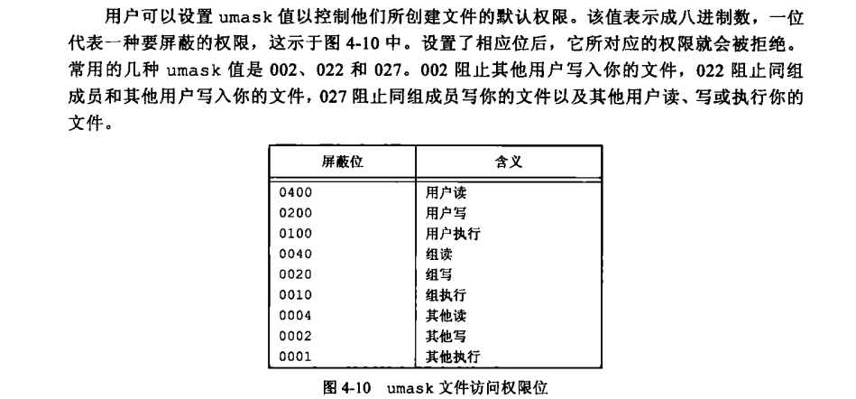
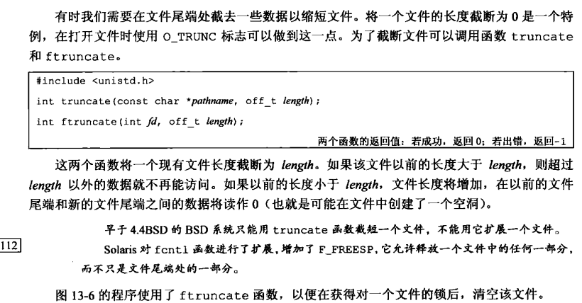
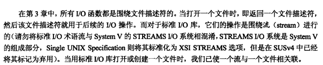
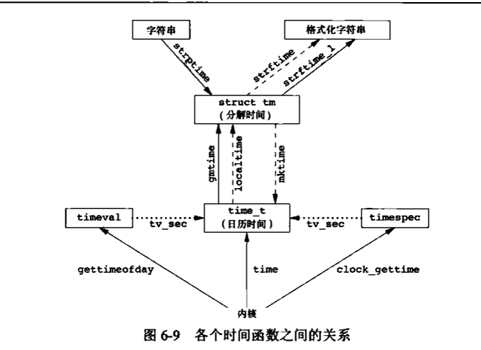
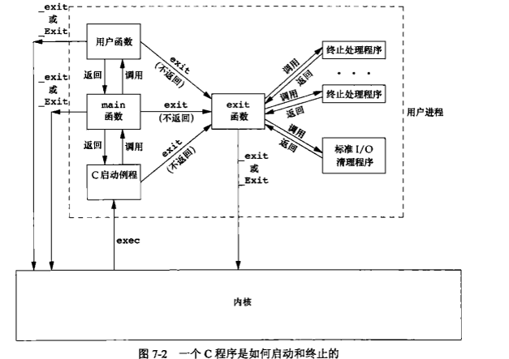
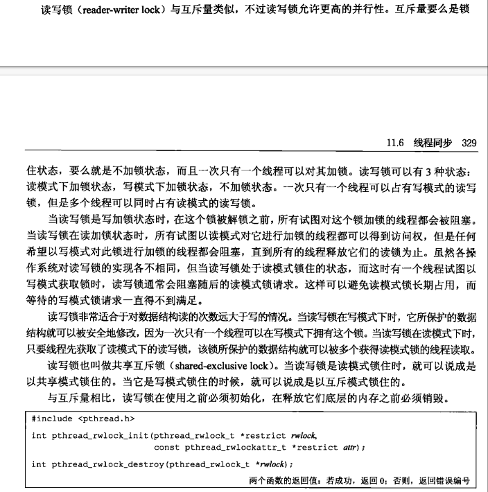
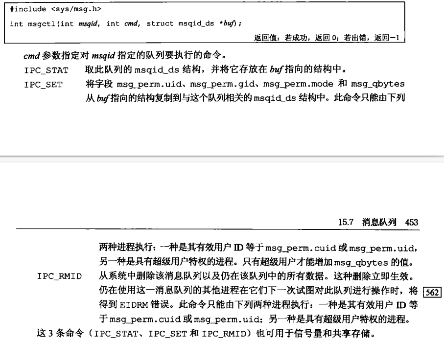

```
find ./ -type f -mmin -120
```


# 一、Unix基础知识


## ls函数实现

```c
#include "apue.h"
#include <dirent.h>

int
main(int argc, char *argv[])
{
	DIR				*dp;
	struct dirent	*dirp;

	if (argc != 2)
		err_quit("usage: ls directory_name");

	printf("%s\n", argv[0]);

	if ((dp = opendir(argv[1])) == NULL)
		err_sys("can't open %s", argv[1]);
	while ((dirp = readdir(dp)) != NULL)
		printf("%s\n", dirp->d_name);

	closedir(dp);
	exit(0);
}
```

主要头文件<dirent.h>


argc是参数个数

argv【0】是./ls1

进程结束exit(0)

chdir可以更改进程工作目录

## [不带缓冲的IO](https://www.cnblogs.com/ymd12103410/p/10004140.html)

```c
#include "apue.h"

#define	BUFFSIZE	4096

int
main(void)
{
	int		n;
	char	buf[BUFFSIZE];

	while ((n = read(STDIN_FILENO, buf, BUFFSIZE)) > 0)
		if (write(STDOUT_FILENO, buf, n) != n)
			err_sys("write error");

	if (n < 0)
		err_sys("read error");

	exit(0);
}

```

主要头文件  unistd.h


## 标准IO  


```c
#include "apue.h"

int
main(void)
{
	int		c;

	while ((c = getc(stdin)) != EOF)
		if (putc(c, stdout) == EOF)
			err_sys("output error");

	if (ferror(stdin))
		err_sys("input error");

	exit(0);
}

```

## exec簇函数

```c
#include "apue.h"
#include <sys/wait.h>

int
main(void)
{
	char	buf[MAXLINE];	/* from apue.h */
	pid_t	pid;
	int		status;

	printf("%% ");	/* print prompt (printf requires %% to print %) */
	while (fgets(buf, MAXLINE, stdin) != NULL) {
		if (buf[strlen(buf) - 1] == '\n')
			buf[strlen(buf) - 1] = 0; /* replace newline with null */

		if ((pid = fork()) < 0) {
			err_sys("fork error");
		} else if (pid == 0) {		/* child */
			execlp(buf, buf, (char *)0);
			err_ret("couldn't execute: %s", buf);
			exit(127);
		}

		/* parent */
		if ((pid = waitpid(pid, &status, 0)) < 0)
			err_sys("waitpid error");
		printf("%% ");
	}
	exit(0);
}

```

```c
fork
```

```c
pid = waitpid(pid, &status, 0)

printf("%d",(status >> 8) & 0xFF);
(status & 0x7F)
```

进程退出码 异常是低七位 正常是高8位


```c
geipid
```

```c
execlp("echo", "echo","localhost", NULL);
```

在这段代码中，确实如果 `execlp` 成功执行，后续的代码就不会被执行。这是因为 `execlp` 成功执行后，当前进程的内存映像已经被替换为新的程序，原先的代码段、数据段等都被新程序的内容覆盖。因此，任何在 `execlp` 之后的代码都不会被执行。

这是 `execlp` 和其它 `exec` 系列函数的预期行为：一旦执行成功，当前进程就被新程序替代，原来的进程上下文就结束了。

## 出错处理


```c
#include "apue.h"
#include <errno.h>

int
main(int argc, char *argv[])
{
	fprintf(stderr, "EACCES: %s\n", strerror(EACCES));
	errno = ENOENT;
	errno = ENODEV;
	perror(argv[0]);
	exit(0);
}

```

## 用户标识

```c
#include "apue.h"

int
main(void)
{
	printf("uid = %d, gid = %d\n", getuid(), getgid());
	exit(0);
}


(base) wangkai@wangkai-Legion-Y9000P-IAH7H:~/codenotes_ubuntu/Linux/Unix环境编程/sr
c.3e/proc$ ../intro/uidgid 
uid = 1000, gid = 1000
    

int setuid(uid_t uid)
int setgid(gid_t gid)
```


## 信号

```c++
#include "apue.h"
#include <sys/wait.h>

static void	sig_int(int);		/* our signal-catching function */

int
main(void)
{
	char	buf[MAXLINE];	/* from apue.h */
	pid_t	pid;
	int		status;

	if (signal(SIGINT, sig_int) == SIG_ERR)
		err_sys("signal error");

	printf("%% ");	/* print prompt (printf requires %% to print %) */
	while (fgets(buf, MAXLINE, stdin) != NULL) {
		if (buf[strlen(buf) - 1] == '\n')
			buf[strlen(buf) - 1] = 0; /* replace newline with null */

		if ((pid = fork()) < 0) {
			err_sys("fork error");
		} else if (pid == 0) {		/* child */
			execlp(buf, buf, (char *)0);
			err_ret("couldn't execute: %s", buf);
			exit(127);
		}

		/* parent */
		if ((pid = waitpid(pid, &status, 0)) < 0)
			err_sys("waitpid error");
		printf("%% ");
	}
	exit(0);
}

void
sig_int(int signo)
{
	printf("interrupt\n%% ");
}

```

signal(SIGINT, sig_int)指定INT信号要调用的函数，进行了捕获

## 时间值

```
time -p ./mycat
ca
ca
sad
sad
^C
real 5.13
user 0.00
sys 0.00
```

## 系统调用

[哪些常用函数算系统调用](https://blog.csdn.net/crr411422/article/details/131527068)


## [makefile](https://blog.csdn.net/qq_35484725/article/details/127034667)

```makefile
src=$(wildcard ./*.c)   # 匹配.c结尾
object=$(patsubst %.c, %.o, $(src))   # .o 替换 .c
target=main
cc=gcc
CPPFLAGS=-I ./
myArgs= -Wall -g
 
# $@规则中的目标 $<规则中的第一个条件 $^规则中的所有条件
 

 
$(target):$(object)
	$(cc)  -o  $@ $^  $(myArgs) 
	
# $(object):%.o:%.c 静态模式规则
%.o:%.c
	$(cc) -o $@ -c $<  $(CPPFLAGS) $(myArgs)

.PHONY:clean
clean:
	-rm -f  $(target)  $(object)
```

## cmakelist

```cmake
cmake_minimum_required(VERSION 3.0)

project(main)


set(CMAKE_CXX_FLAGS "${CMAKE_CXX_FLAGS} -g -O2 -Wall -lboost_thread -lboost_filesystem -lpthread -lboost_system -std=c++11 -I /usr/local/include/boost -L /usr/local/lib")
set(CMAKE_BUILD_TYPE Debug)

# 添加Boost库的查找
find_package(Boost COMPONENTS thread filesystem system REQUIRED)

# 将Boost库的头文件目录添加到包含路径中
include_directories(include ${Boost_INCLUDE_DIRS})

# 将Boost库的库目录添加到链接路径中
link_directories(${Boost_LIBRARY_DIRS})

include_directories(include /usr/local/include/boost)
link_directories(/usr/local/lib)

add_executable(main main.cpp)
target_link_libraries(main ${Boost_LIBRARIES})  # 必须加这个


```


# 二、UNIX标准和实现

## UNIX标准化

### ISO C


### IEEE POSIX


## UNIX系统实现


### SVR4

### 4.4BSD

### LINUX

### Max OS X

### .........


## 限制


### getconf


```
(base) wangkai@wangkai-Legion-Y9000P-IAH7H:~/codenotes_ubuntu/Linux/Unix环境编程/src.3e/standards$ getconf PAGE_SIZE
4096
```


### 函数sysconf  oathconf  fpathconf

提供的代码是awk解析的sys文件获得的c代码


```c
pr_sysconf("SYMLOOP_MAX =", _SC_SYMLOOP_MAX);
pr_pathconf("PATH_MAX =", argv[1], _PC_PATH_MAX);

static void
pr_sysconf(char *mesg, int name)
{
	long	val;

	fputs(mesg, stdout);
	errno = 0;
	if ((val = sysconf(name)) < 0) {
		if (errno != 0) {
			if (errno == EINVAL)
				fputs(" (not supported)\n", stdout);
			else
				err_sys("sysconf error");
		} else {
			fputs(" (no limit)\n", stdout);
		}
	} else {
		printf(" %ld\n", val);
	}
}

static void
pr_pathconf(char *mesg, char *path, int name)
{
	long	val;

	fputs(mesg, stdout);
	errno = 0;
	if ((val = pathconf(path, name)) < 0) {
		if (errno != 0) {
			if (errno == EINVAL)
				fputs(" (not supported)\n", stdout);
			else
				err_sys("pathconf error, path = %s", path);
		} else {
			fputs(" (no limit)\n", stdout);
		}
	} else {
		printf(" %ld\n", val);
	}
}

```

 sysconf(name)获取判断

```
if  返回值<0
	if errno ==0 无限制
	else  读取错误
```

# 三、文件IO

## open


mode_t是访问权限

## create


## read write lseed

 lseed 空洞文件

```c++
#include "apue.h"
#include <fcntl.h>

char	buf1[] = "abcdefghij";
char	buf2[] = "ABCDEFGHIJ";

int
main(void)
{
	int		fd;

	if ((fd = creat("file.txt", FILE_MODE)) < 0)
		err_sys("creat error");

	if (write(fd, buf1, 10) != 10)
		err_sys("buf1 write error");
	/* offset now = 10 */

	if (lseek(fd, 16384, SEEK_SET) == -1)
		err_sys("lseek error");
	/* offset now = 16384 */

	if (write(fd, buf2, 10) != 10)
		err_sys("buf2 write error");
	/* offset now = 16394 */

	exit(0);
}

```

mycat

```c
#include "apue.h"

#define	BUFFSIZE	4096

int
main(void)
{
	int		n;
	char	buf[BUFFSIZE];

	while ((n = read(STDIN_FILENO, buf, BUFFSIZE)) > 0)
		if (write(STDOUT_FILENO, buf, n) != n)
			err_sys("write error");

	if (n < 0)
		err_sys("read error");

	exit(0);
}

```


## 进程文件共享


## 文件描述符标志和文件状态标志


## 原子性操作

多步操作要么都执行要么都失败

```
pread
pwrite
```

是lseek和read组成的原子操作

## dup函数

*功能:复制文件描述符,重定向输入输出*

## fcntl

```
1、获取文件的flags，即open函数的第二个参数:

       flags = fcntl(fd,F_GETFL,0);

2、设置文件的flags:

      fcntl(fd,F_SETFL,flags);

3、增加文件的某个flags，比如文件是阻塞的，想设置成非阻塞:

       flags = fcntl(fd,F_GETFL,0);

       flags |= O_NONBLOCK;

      fcntl(fd,F_SETFL,flags);

4、取消文件的某个flags，比如文件是非阻塞的，想设置成为阻塞:

      flags = fcntl(fd,F_GETFL,0);

      flags &= ~O_NONBLOCK;

      fcntl(fd,F_SETFL,flags);
```

```
/*************************************************************************
    > File Name: test.c
    > Author: zhou
    > Mail:none 
    > Created Time: Fri 25 Dec 2020 09:17:36 PM EST
 ************************************************************************/

#include<stdio.h>
#include<fcntl.h>
#include<sys/types.h>
#include<sys/stat.h>
#include<unistd.h>
int main(int argc,char *argv[])
{
	int fd=open("/dev/tty",O_RDONLY);
	int flag=fcntl(fd,F_GETFL);
	flag|=O_NONBLOCK;
	fcntl(fd,F_SETFL,flag);
	while(1)
	{
		char buf[1024]={0};
		int n=read(fd,buf,1024);
		if(n>0)
		{
			printf("%s \n",buf);
		}else if(n==0)
		{
			printf("empty\n");
		}else
		{
		
			printf("test\n");
		}
		
		sleep(2);
	}
	close(fd);
	return 0;
}
————————————————
版权声明：本文为CSDN博主「小丑快学习」的原创文章，遵循CC 4.0 BY-SA版权协议，转载请附上原文出处链接及本声明。
原文链接：https://blog.csdn.net/qq_44664843/article/details/112351419
```

## ioctl


## /dev/fd

等效 

```
fd = open("/dev/fd/0",mode")
等效
fd = dup(0)
```

# 四、文件和目录

## 函数stat fstat fstatat

```
struct stat            sbuf;

if (fstat(fd, &fdstat) < 0)
```


## 文件类型


## 文件权限




## access

```c
#include "apue.h"
#include <fcntl.h>

int
main(int argc, char *argv[])
{
	if (argc != 2)
		err_quit("usage: a.out <pathname>");
	if (access(argv[1], R_OK) < 0)
		err_ret("access error for %s", argv[1]);
	else
		printf("read access OK\n");
	if (open(argv[1], O_RDONLY) < 0)
		err_ret("open error for %s", argv[1]);
	else
		printf("open for reading OK\n");
	exit(0);
}

```


## umask

```
flag -= umask
```

```c
#include "apue.h"

#include <fcntl.h>


#define RWRWRW (S_IRUSR|S_IWUSR|S_IRGRP|S_IWGRP|S_IROTH|S_IWOTH)


int

main(void)

{

​        umask(0);

​        if (creat("foo", RWRWRW) < 0)

​                err_sys("creat error for foo");

​        umask(S_IRGRP | S_IWGRP | S_IROTH | S_IWOTH);

​        if (creat("bar", RWRWRW) < 0)

​                err_sys("creat error for bar");

​        exit(0);

}
```

## chmod

```c++
#include "apue.h"

int
main(void)
{
	struct stat		statbuf;

	/* turn on set-group-ID and turn off group-execute */

	if (stat("foo", &statbuf) < 0)
		err_sys("stat error for foo");
	if (chmod("foo", (statbuf.st_mode & ~S_IXGRP) | S_ISGID) < 0)
		err_sys("chmod error for foo");

	/* set absolute mode to "rw-r--r--" */

	if (chmod("bar", S_IRUSR | S_IWUSR | S_IRGRP | S_IROTH) < 0)
		err_sys("chmod error for bar");

	exit(0);
}

```

## chown


修改用户和用户组


## 文件长度  truncate截断


 truncate



## 文件系统


## [硬链接和软(符号)连接 ](https://www.jianshu.com/p/7e3af93f6cc9) ln命令

```shell
shell创建硬链接和符号链接
在Shell中，可以使用ln命令来创建硬链接和符号链接。

创建硬链接：

ln <源文件> <目标文件>

示例：将名为file.txt的文件创建为hardlink.txt的硬链接。

ln file.txt hardlink.txt

创建符号链接（软连接）：

ln -s <源文件或目录> <目标文件或目录>

示例：将名为dir/file.txt的文件创建为symlink.txt的符号链接。

ln -s dir/file.txt symlink.txt
```

```shell
-rw-rw-rw-  2 wangkai wangkai     0 1月   8 00:28 foo
-rw-rw-rw-  2 wangkai wangkai     0 1月   8 00:28 foo1
lrwxrwxrwx  1 wangkai wangkai     3 1月   8 22:01 foo2 -> foo
-rw-r--r--  1 wangkai wangkai  4253 3月  20  2014 ftw8.c
```


## link


## unlink


## symlink


## remove rename


## 文件时间


```c++
#include "apue.h"
#include <fcntl.h>

int
main(int argc, char *argv[])
{
	int				i, fd;
	struct stat		statbuf;
	struct timespec	times[2];

	for (i = 1; i < argc; i++) {
		if (stat(argv[i], &statbuf) < 0) {	/* fetch current times */
			err_ret("%s: stat error", argv[i]);
			continue;
		}
		if ((fd = open(argv[i], O_RDWR | O_TRUNC)) < 0) { /* truncate */
			err_ret("%s: open error", argv[i]);
			continue;
		}
		times[0] = statbuf.st_atim;
		times[1] = statbuf.st_mtim;
		if (futimens(fd, times) < 0)		/* reset times */
			err_ret("%s: futimens error", argv[i]);
		close(fd);
	}
	exit(0);
}

```

ll命令的应该是修改时间

## mkdir chdir rmdir

```c
int mkdir(NAME, DIR_MODE)
int chdir(const char* PATH) //更改当前目录
int fchdir(const char* PATH) 
int rmdir(const char* PATH) //目录需要时空的
    int
```

创建    更改当前目录

```c
if (chdir(STARTDIR) < 0)
		err_sys("chdir error");

	for (i = 0; i < DEPTH; i++) {
		if (mkdir(NAME, DIR_MODE) < 0)
			err_sys("mkdir failed, i = %d", i);
		if (chdir(NAME) < 0)
			err_sys("chdir failed, i = %d", i);
	}
```

打开和删除目录


```c
#include <stdio.h>
#include <stdlib.h>
#include <dirent.h>
#include <sys/stat.h>
 
void deleteDirectory(const char* path) {
    DIR *dir;
    struct dirent *entry;
    
    if ((dir = opendir(path)) != NULL) { // 打开目录
        while ((entry = readdir(dir)) != NULL) { // 读取目录内容
            if (strcmp(".", entry->d_name) == 0 || strcmp("..", entry->d_name) == 0) continue; // 忽略当前目录和上级目录
            
            char filePath[256];
            snprintf(filePath, sizeof(filePath), "%s/%s", path, entry->d_name); // 构建文件路径
            
            struct stat st;
            lstat(filePath, &st); // 获取文件信息
            
            if (S_ISDIR(st.st_mode)) { // 如果是子目录则递归删除
                deleteDirectory(filePath);
            } else { // 否则直接删除文件
                remove(filePath);
            }
        }
        
        closedir(dir); // 关闭目录
        
        rmdir(path); // 最后删除空目录
    }
}
 
int main() {
    const char* directoryToDelete = "/path/to/directory"; // 要删除的目录路径
    
    deleteDirectory(directoryToDelete); // 调用函数进行删除操作
    
    printf("已成功删除非空目录\n");
    
    return 0;
}
```

### getcwd 

```c
#include "apue.h"

int
main(void)
{
	char	*ptr;
	size_t		size;  //缓冲区需要能放得下路径的长度

	if (chdir("/usr/spool/uucppublic") < 0)
		err_sys("chdir failed");

	ptr = path_alloc(&size);	/* our own function */
	if (getcwd(ptr, size) == NULL)
		err_sys("getcwd failed");

	printf("cwd = %s\n", ptr);
	exit(0);
}

```

# 五、标准IO库

## 流和FILE对象



stdin stderr是文件指针

STDIN_FILENO是文件描述符


==流缓存类型是可以更改的==

## 打开流

### fopen


### getc  putc


[fgets( )和fputs( )(建议用其完全代替gets和puts*函数*)](https://download.csdn.net/download/qfeung/9585608?spm=1001.2101.3001.6661.1&utm_medium=distribute.pc_relevant_t0.none-task-download-2~default~CTRLIST~Paid-1-9585608-blog-84799613.235^v40^pc_relevant_anti_t3_base&depth_1-utm_source=distribute.pc_relevant_t0.none-task-download-2~default~CTRLIST~Paid-1-9585608-blog-84799613.235^v40^pc_relevant_anti_t3_base&utm_relevant_index=1)

```c
#include "apue.h"

int
main(void)
{
    FILE	*fp;
	int		c;
    fp = fopen("./test.c", "r");
	while ((c = fgetc(fp)) != EOF)
		if (fputc(c, stdout) == EOF)
			err_sys("output error");
        else fputc("~",stdout);

	if (ferror(stdin))
		err_sys("input error");

	exit(0);
}


```

### ferror


## 一次一行fgets


```c
#include "apue.h"

int
main(void)
{
	char	buf[MAXLINE];

	while (fgets(buf, MAXLINE, stdin) != NULL)
		if (fputs(buf, stdout) == EOF)
			err_sys("output error");

	if (ferror(stdin))
		err_sys("input error");

	exit(0);
}


```

EOP是-1

\0和NULL都是0000000

## 二进制IO


## 格式化输入


```c
#include "apue.h"

#define BSZ 48

int
main()
{
	FILE *fp;
	char buf[BSZ];

	memset(buf, 'a', BSZ-2);
	buf[BSZ-2] = '\0';
	buf[BSZ-1] = 'X';
	if ((fp = fmemopen(buf, BSZ, "w+")) == NULL)
		err_sys("fmemopen failed");
	printf("initial buffer contents: %s\n", buf);
	fprintf(fp, "hello, world");
	printf("before flush: %s\n", buf);
	fflush(fp);
	printf("after fflush: %s\n", buf);
	printf("len of string in buf = %ld\n", (long)strlen(buf));

	memset(buf, 'b', BSZ-2);
	buf[BSZ-2] = '\0';
	buf[BSZ-1] = 'X';
	fprintf(fp, "hello, world");
	fseek(fp, 0, SEEK_SET);
	printf("after  fseek: %s\n", buf);
	printf("len of string in buf = %ld\n", (long)strlen(buf));

	memset(buf, 'c', BSZ-2);
	buf[BSZ-2] = '\0';
	buf[BSZ-1] = 'X';
	fprintf(fp, "hello, world");
	fclose(fp);
	printf("after fclose: %s\n", buf);
	printf("len of string in buf = %ld\n", (long)strlen(buf));

	return(0);
}

```

## 格式化输出


```c


#include "apue.h"
#define BSZ 4800

int
main(void)
{
    FILE	*fp;
	int		c;
    char buf[BSZ];
    fp = fopen("./test.c", "r");
	while ((fgets(buf,BSZ,fp)) != NULL)
		if (fputs(buf, stdout) == EOF)
			err_sys("output error");
        else fputs("~",stdout);

	if (ferror(stdin))
		err_sys("input error");
    fclose(fp);
    printf("%012.5f",99.0);

    sprintf(buf,"%012.5f/n",99.0);
    if (fputs(buf, stdout) == EOF)
		err_sys("output error");

	exit(0);
}
```

## fileno


## rewind和临时文件

倒带回文件开头

```c
#include "apue.h"

int
main(void)
{
	char	name[L_tmpnam], line[MAXLINE];
	FILE	*fp;

	printf("%s\n", tmpnam(NULL));		/* first temp name */

	tmpnam(name);						/* second temp name */
	printf("%s\n", name);

	if ((fp = tmpfile()) == NULL)		/* create temp file */
		err_sys("tmpfile error");
	fputs("one line of output\n", fp);	/* write to temp file */
	rewind(fp);							/* then read it back */
	if (fgets(line, sizeof(line), fp) == NULL)
		err_sys("fgets error");
	fputs(line, stdout);				/* print the line we wrote */

	exit(0);
}

```

# 六、系统数据文件和信息

## 口令文件


### finger

```
环境编程/src.3e/stdio$ finger wangkai
Login: wangkai                          Name: wangkai
Directory: /home/wangkai                Shell: /bin/bash
On since Mon Jan  8 19:33 (CST) on :1 from :1 (messages off)
No mail.
No Plan.
```

### getpwnm


```c
#include <pwd.h>
#include <stddef.h>
#include <string.h>

struct passwd *
getpwnam(const char *name)
{
    struct passwd  *ptr;

    setpwent();  //硕士反绕使用的文件，意思就是回到开头位置
    while ((ptr = getpwent()) != NULL)
        if (strcmp(name, ptr->pw_name) == 0)
            break;		/* found a match */
    endpwent();
    return(ptr);	/* ptr is NULL if no match found */
}

```

## 组文件


## 其他文件


## 登录记录

```
journalctl -n 5
-- Logs begin at Sun 2024-01-07 06:29:49 CST, end at Tue 2024-01-09 20:4>
1月 09 20:47:45 wangkai-Legion-Y9000P-IAH7H 微信.desktop[4064]: WeChat i>
1月 09 20:47:48 wangkai-Legion-Y9000P-IAH7H 微信.desktop[4064]: 0x720003a
1月 09 20:47:48 wangkai-Legion-Y9000P-IAH7H 微信.desktop[4064]: WeChat i>
1月 09 20:47:51 wangkai-Legion-Y9000P-IAH7H 微信.desktop[4064]: 0x720003a
1月 09 20:47:51 wangkai-Legion-Y9000P-IAH7H 微信.desktop[4064]: WeChat i>
```

```
cat /var/log/auth.log
```

## 系统标识


```
(base) wangkai@wangkai-Legion-Y9000P-IAH7H:~/codenotes_ubuntu/Linux/Unix
环境编程/src.3e$ uname -a
Linux wangkai-Legion-Y9000P-IAH7H 5.15.0-88-generic #98~20.04.1-Ubuntu SMP Mon Oct 9 16:43:45 UTC 2023 x86_64 x86_64 x86_64 GNU/Linux
```

## 时间戳



```
  struct timespec {
        time_t   tv_sec;        // 秒数
        long     tv_nsec;       // 纳秒数
    };
```

```c
#include <stdio.h>
#include <stdlib.h>
#include <time.h>

int
main(void)
{
	time_t t;//时间戳
	struct tm *tmp;
	char buf1[16];
	char buf2[64];

	time(&t);
	tmp = localtime(&t);
	if (strftime(buf1, 16, "time and date: %r, %a %b %d, %Y", tmp) == 0)
		printf("buffer length 16 is too small\n");
	else
		printf("%s\n", buf1);
	if (strftime(buf2, 64, "time and date: %r, %a %b %d, %Y", tmp) == 0)
		printf("buffer length 64 is too small\n");
	else
		printf("%s\n", buf2);
	exit(0);
}
```

shell的time是运行时间   对应的获得时间戳应该是date

```shell
(base) wangkai@wangkai-Legion-Y9000P-IAH7H:~/codenotes_ubuntu/Linux/Unix
环境编程/src.3e$ time

real    0m0.002s
user    0m0.001s
```

# 七、进程环境

## 进程终止



exit会有一系列处理然后返回内核

```c
#include "apue.h"

static void	my_exit1(void);
static void	my_exit2(void);

int
main(void)
{
	if (atexit(my_exit2) != 0)
		err_sys("can't register my_exit2");

	if (atexit(my_exit1) != 0)
		err_sys("can't register my_exit1");
	if (atexit(my_exit1) != 0)
		err_sys("can't register my_exit1");

	printf("main is done\n");
	return(0);
}

static void
my_exit1(void)
{
	printf("first exit handler\n");
}

static void
my_exit2(void)
{
	printf("second exit handler\n");
}

```

## 命令行参数


```shell
//短格式可以合并
ps -aux  == ps -a -u -x


```

### python

```python
import argparse

def parse_args():
    parser = argparse.ArgumentParser(description='Train a 3D detector')
    parser.add_argument('config', help='train config file path')
    parser.add_argument('--work-dir', help='the dir to save logs and models')
    parser.add_argument(
        '--amp',
        action='store_true',
        default=False,
        help='enable automatic-mixed-precision training')
    parser.add_argument(
        '--sync_bn',
        choices=['none', 'torch', 'mmcv'],
        default='none',
        help='convert all BatchNorm layers in the model to SyncBatchNorm '
        '(SyncBN) or mmcv.ops.sync_bn.SyncBatchNorm (MMSyncBN) layers.')
    parser.add_argument(
        '--auto-scale-lr',
        action='store_true',
        help='enable automatically scaling LR.')
    parser.add_argument(
        '--resume',
        nargs='?',
        type=str,
        const='auto',
        help='If specify checkpoint path, resume from it, while if not '
        'specify, try to auto resume from the latest checkpoint '
        'in the work directory.')
    parser.add_argument(
        '--ceph', action='store_true', help='Use ceph as data storage backend')
    parser.add_argument(
        '--cfg-options',
        nargs='+',
        action=DictAction,
        help='override some settings in the used config, the key-value pair '
        'in xxx=yyy format will be merged into config file. If the value to '
        'be overwritten is a list, it should be like key="[a,b]" or key=a,b '
        'It also allows nested list/tuple values, e.g. key="[(a,b),(c,d)]" '
        'Note that the quotation marks are necessary and that no white space '
        'is allowed.')
    parser.add_argument(
        '--launcher',
        choices=['none', 'pytorch', 'slurm', 'mpi'],
        default='none',
        help='job launcher')
    # When using PyTorch version >= 2.0.0, the `torch.distributed.launch`
    # will pass the `--local-rank` parameter to `tools/train.py` instead
    # of `--local_rank`.
    parser.add_argument('--local_rank', '--local-rank', type=int, default=0)
    args = parser.parse_args()
    if 'LOCAL_RANK' not in os.environ:
        os.environ['LOCAL_RANK'] = str(args.local_rank)
    return args


def main():
    args = parse_args()
```

```python
//'-s', '--work-dir'  等效
parser.add_argument('-s', '--work-dir', default='/default/path', help='the dir to save logs and models')


//action='store_true' 更关注参数是否出现在命令行中
//default=True 更关注参数的默认值

nargs： 用于指定参数应该消耗的命令行参数的数量。一些常见的值包括：

N：指定固定数量的参数。
?：表示参数可有可无，可以出现 0 或 1 次。
*：表示参数可以出现任意次数，包括 0 次。
+：表示参数可以出现任意次数，但至少要出现 1 次。
```


### shell脚本

直接参数     ./example.sh param1 param2

```shell
1. 位置参数：位置参数是指通过在运行脚本时，后面紧跟着的参数。位置参数可以有多个，从$1开始递增。$0表示脚本本身的名称，$1表示第一个位置参数，$2表示第二个位置参数，以此类推。位置参数可以在脚本中使用，获取传递进来的值。

示例：

# 脚本名称为example.sh，执行命令为./example.sh param1 param2
echo "第一个参数：$1"   # 输出：第一个参数：param1
echo "第二个参数：$2"   # 输出：第二个参数：param2
2. 特殊参数：特殊参数在Shell中具有特殊的含义，是事先定义好的变量。以下是常用的特殊参数：

– $0：行参名称（即脚本本身的名称）
– $1~$9：位置参数（$1表示第一个位置参数，$2表示第二个位置参数，以此类推）
– $*：所有位置参数列表（将所有位置参数视为一个整体）
– $#：位置参数的个数
– $?：上一个命令的返回值
– $$：当前进程的进程号
– $!：最后一个后台进程的进程号


```

```shell
if [ x$1 != x ]; then
     echo "...有参数x"
else
     echo "...没有参数x"
fi

(base) wangkai@wangkai-Legion-Y9000P-IAH7H:~$ bash 1.sh x
...有参数x

```

getopts处理    短参数bash 1.sh -bca  th -l ./

```shell
#!/bin/bash

while getopts ":a:bc" opt; do
  case $opt in
    a)
      echo "a option: $OPTARG"
      ;;
    b)
      echo "b option: $OPTARG"
      ;;
    c)
      echo "c option: $OPTARG"
      ;;
     
    \?)
      echo "Invalid option: -$OPTARG"
      ;;
    :)
      echo "Option -$OPTARG requires an argument."
      ;;
  esac
done

# 处理剩余的参数
shift $((OPTIND-1))
echo "Remaining arguments: $@"


(base) wangkai@wangkai-Legion-Y9000P-IAH7H:~$ bash 1.sh -b -c  --a  th -l ./
b option: 
c option: 
Invalid option: --
a option: th
Invalid option: -l
Remaining arguments: ./

(base) wangkai@wangkai-Legion-Y9000P-IAH7H:~$ bash 1.sh -bca  th -l ./
b option: 
c option: 
a option: th
Invalid option: -l
Remaining arguments: ./


```

长参数 getopts处理 比较复杂

### c

```c
#include "apue.h"

int
main(int argc, char *argv[])
{
	int		i;

	for (i = 0; i < argc; i++)		/* echo all command-line args */
		printf("argv[%d]: %s\n", i, argv[i]);
	exit(0);
}

```

## c程序的存储空间分布


# 

### 进程空间  堆和栈


### PCB进程控制块


### [虚拟地址和虚拟内存的区别](https://blog.csdn.net/weixin_49503250/article/details/129493556)

Linux虚拟内存应该是用在Swap交换空间,Swap交换空间是一种虚拟内存技术

虚拟地址空间不是存储地方，是地址映射到物理内存和虚拟内存


### 虚拟地址空间映射物理内存


当物理内存分页闲置时候，会把虚拟地址映射到物理内存的地址换到虚拟内存（同时把对应数据从物理内存移到磁盘的虚拟内存页），反之也会移动会物理内存

### [==进行创建和运行时候的虚拟地址、虚拟内存、物理内存之间的关系==](https://zhuanlan.zhihu.com/p/655263291)


### IO的用户空间和内核空间切换


```c
//测试1秒钟可以数多少数字
#include <stdio.h>
#include <stdlib.h>
#include <sys/types.h>
#include <unistd.h>
#include <signal.h>

int main()
{
	alarm(1);
	int i = 0;
	while(1)
	{
		printf("[%d]", i++);
	}

	return 0;
}
```

```c

闹钟
实际执行时间 = 系统时间 + 用户时间 + 损耗时间
损耗时间= 实际执行时间-(系统时间 + 用户时间 )
每一个数字都直接打印:printf("[%d]\n", i++);
real    0m1.217s
user    0m0.120s
sys     0m0.252s
15734次
损耗时间= 1.217-(0.120+0.252)=0.845
文件重定向之后:
time ./alarm_uncle  > test.logc
real    0m1.003s
user    0m0.520s
sys     0m0.428s
2191879次
损耗时间=1.003-(0.520+0.428)=0.055
	原因是: 调用printf函数打印数字遇到\n才会打印, 打印过程涉及到从
	用户区到内核区的切换, 切换次数越多消耗的时间越长, 效率越低;
	而使用文件重定向, 由于文件操作是带缓冲的, 所以涉及到用户区到内核区的
	切换次数大大减少,从而使损耗降低.
```

## malloc

类似memset的函数吧,在堆区动态分配内存


> - 和new的区别
>
>  malloc 只管分配内存，并不能对所得的内存进行初始化，所以得到的一片新内存中，其值将是随机的。
> 除了分配及最后释放的方法不一样以外，通过malloc或new得到指针，在其它操作上保持一致。


> - void *malloc(int size);*
>
> 说明：malloc 向系统申请分配指定size个字节的内存空间，返回类型是 void* 类型。void* 表示未确定类型的指针。C,C++规定，void* 类型可以强制转换为任何其它类型的指针。 　　
> 备注：void* 表示未确定类型的指针，更明确的说是指申请内存空间时还不知道用户是用这段空间来存储什么类型的数据（比如是char还是int或者...）

也就是可以   P* ptr = (P*)malloc(sizeof(P) * 3)

## 环境变量

```shell
(base) wangkai@wangkai-Legion-Y9000P-IAH7H:/media/wangkai/ROG$ $LD_LIBRARY_PATH
bash: /opt/ros/noetic/lib:/usr/local/cuda11.1/lib64:/usr/local/cuda11.1/lib64:/usr/local/lib:/usr/local/lib: 没有那个文件或目录
```

```
char *getenv(const char *name);
```


## 跳转函数

### goto

不能跨越函数

```c
#include<stdio.h>

int main() {
	int c = 1;
	if (c > 0) {
		goto start;
	}
	printf("实力1\n");
	printf("实例2\n");
	printf("实例3\n");

start:	
	printf("实例4\n");
	printf("实例5\n");

}


```

### setjump longjump

```c
#include "apue.h"
#include <setjmp.h>

static void	f1(int, int, int, int);
static void	f2(void);

static jmp_buf	jmpbuffer;
static int		globval;

int
main(void)
{
	int				autoval;
	register int	regival;
	volatile int	volaval;
	static int		statval;

	globval = 1; autoval = 2; regival = 3; volaval = 4; statval = 5;

	if (setjmp(jmpbuffer) != 0) {
		printf("after longjmp:\n");
		printf("globval = %d, autoval = %d, regival = %d,"
		    " volaval = %d, statval = %d\n",
		    globval, autoval, regival, volaval, statval);
		exit(0);
	}

	/*
	 * Change variables after setjmp, but before longjmp.
	 */
	globval = 95; autoval = 96; regival = 97; volaval = 98;
	statval = 99;

	f1(autoval, regival, volaval, statval);	/* never returns */
	exit(0);
}

static void
f1(int i, int j, int k, int l)
{
	printf("in f1():\n");
	printf("globval = %d, autoval = %d, regival = %d,"
	    " volaval = %d, statval = %d\n", globval, i, j, k, l);
	f2();
}

static void
f2(void)
{
	longjmp(jmpbuffer, 1);
}

(base) wangkai@wangkai-Legion-Y9000P-IAH7H:~/codenotes_ubuntu/Linux/Unix环境编
程/src.3e/environ$ ./testjmp 
in f1():
globval = 95, autoval = 96, regival = 97, volaval = 98, statval = 99
after longjmp:
globval = 95, autoval = 96, regival = 3, volaval = 98, statval = 99

```

好像一般是向前跳转，向后直接if就好了

## getrlimit

`sysconf` 是一个通用函数，用于获取许多不同**系统配置** 变量的值，而不仅仅是资源限制。有些代表系统范围的限制。 `sysconf` 没有对应的设置函数(其中一些值不是动态的)。所有这些值都不应在同一进程中的两次调用之间发生变化(请参阅下面的异常(exception)情况)。

`getrlimit` 是一个获取**资源限制**值的函数。它的设置对应物是 `setrlimit`(可以有一些限制)。

两者都是由 POSIX 定义的，除了 `OPEN_MAX` 可能会在进程生命周期内发生变化外，标准没有提及重叠

```c
#include "apue.h"
#include <sys/resource.h>

#define	doit(name)	pr_limits(#name, name)

static void	pr_limits(char *, int);

int
main(void)
{
#ifdef	RLIMIT_AS
	doit(RLIMIT_AS);
#endif

	doit(RLIMIT_CORE);
	doit(RLIMIT_CPU);
	doit(RLIMIT_DATA);
	doit(RLIMIT_FSIZE);

#ifdef	RLIMIT_MEMLOCK
	doit(RLIMIT_MEMLOCK);
#endif

#ifdef RLIMIT_MSGQUEUE
	doit(RLIMIT_MSGQUEUE);
#endif

#ifdef RLIMIT_NICE
	doit(RLIMIT_NICE);
#endif

	doit(RLIMIT_NOFILE);

#ifdef	RLIMIT_NPROC
	doit(RLIMIT_NPROC);
#endif

#ifdef RLIMIT_NPTS
	doit(RLIMIT_NPTS);
#endif

#ifdef	RLIMIT_RSS
	doit(RLIMIT_RSS);
#endif

#ifdef	RLIMIT_SBSIZE
	doit(RLIMIT_SBSIZE);
#endif

#ifdef RLIMIT_SIGPENDING
	doit(RLIMIT_SIGPENDING);
#endif

	doit(RLIMIT_STACK);

#ifdef RLIMIT_SWAP
	doit(RLIMIT_SWAP);
#endif

#ifdef	RLIMIT_VMEM
	doit(RLIMIT_VMEM);
#endif

	exit(0);
}

static void
pr_limits(char *name, int resource)
{
	struct rlimit		limit;
	unsigned long long	lim;

	if (getrlimit(resource, &limit) < 0)
		err_sys("getrlimit error for %s", name);
	printf("%-14s  ", name);
	if (limit.rlim_cur == RLIM_INFINITY) {
		printf("(infinite)  ");
	} else {
		lim = limit.rlim_cur;
		printf("%10lld  ", lim);
	}
	if (limit.rlim_max == RLIM_INFINITY) {
		printf("(infinite)");
	} else {
		lim = limit.rlim_max;
		printf("%10lld", lim);
	}
	putchar((int)'\n');
}

```

# 八、进程控制

## 进程标识 getpid


## fork

fork()与vfork()都是创建一个进程，不过他们有以下几个区别：

> 1. fork(): 子进程拷贝父进程的数据段，代码段
>
>    vfork(): 子进程与父进程共享数据段
>
> 2. fork(): 父子进程执行次序不确定
>
>    vfork(): 保证子进程先运行，在调用exec()或exit()之前，与父进程数据共享，在exec()或exit()调用之    后，父进程才能运行
>
> 3. 在使用vfork函数在调用exec()或exit()之前，子进程依赖于父进程的进一步动作，将会导致死锁。
>

### fork函数子进程的数据不影响父进程

```c
#include "apue.h"

int		globvar = 6;		/* external variable in initialized data */
char	buf[] = "a write to stdout\n";

int
main(void)
{
	int		var;		/* automatic variable on the stack */
	pid_t	pid;

	var = 88;
	if (write(STDOUT_FILENO, buf, sizeof(buf)-1) != sizeof(buf)-1)
		err_sys("write error");
	printf("before fork\n");	/* we don't flush stdout */

	if ((pid = fork()) < 0) {
		err_sys("fork error");
	} else if (pid == 0) {		/* child */
		globvar++;				/* modify variables */
		var++;
	} else {
		sleep(2);				/* parent */
	}

	printf("pid = %ld, glob = %d, var = %d\n", (long)getpid(), globvar,
	  var);
	exit(0);
}

```


### 文件共享

```c++
#include "apue.h"
#include <fcntl.h>

int
main(void)
{
	FILE	*fp;
	int		fd;
	pid_t	pid;
    fp = fopen("./test1.c", "r");
	fd = open("./1.txt", O_WRONLY);
	char	buf[MAXLINE];
	if ((pid = fork()) < 0) {
		err_sys("fork error");
	} else if (pid == 0) {		/* child */
		sleep(1);				/* parent */
		fgets(buf, MAXLINE, fp);
		if (fputs(buf, stdout) == EOF)
			err_sys("output error");
	} else {
		dup2(fd,STDOUT_FILENO);
		sleep(2);				/* parent */
		fgets(buf, MAXLINE, fp);
		if (fputs(buf, stdout) == EOF)
			err_sys("output error");
		fgets(buf, MAXLINE, fp);
		if (fputs(buf, stdout) == EOF)
			err_sys("output error");
	}
	exit(0);

}

```

打开的文件和偏移是共享的，

但结果父进程是std输出，子进程被重定向了


==所以打开的文件和偏移是共享的因为指向的同一个文件表==

但是重定向是更改了进程指向的文件表，所以两个进程就不一样了


## vfork

```c
#include "apue.h"

int		globvar = 6;		/* external variable in initialized data */

int
main(void)
{
	int		var;		/* automatic variable on the stack */
	pid_t	pid;

	var = 88;
	printf("before vfork\n");	/* we don't flush stdio */
	if ((pid = vfork()) < 0) {
		err_sys("vfork error");
	} else if (pid == 0) {		/* child */
		globvar++;				/* modify parent's variables */
		var++;
		_exit(0);				/* child terminates */
	}

	/* parent continues here */
	printf("pid = %ld, glob = %d, var = %d\n", (long)getpid(), globvar,
	  var);
	exit(0);
}

```

vfork共享数据段并且父进程会阻塞


## waitpid 和子进程exit退出状态


```c
#include "apue.h"
#include <sys/wait.h>

int
main(void)
{
	char	buf[MAXLINE];	/* from apue.h */
	pid_t	pid;
	int		status;

	printf("%% ");	/* print prompt (printf requires %% to print %) */
	while (fgets(buf, MAXLINE, stdin) != NULL) {
		if (buf[strlen(buf) - 1] == '\n')
			buf[strlen(buf) - 1] = 0; /* replace newline with null */

		if ((pid = fork()) < 0) {
			err_sys("fork error");
		} else if (pid == 0) {		/* child */
			execlp(buf, buf, (char *)0);
			err_ret("couldn't execute: %s", buf);
			exit(127);
		}

		/* parent */
		if ((pid = waitpid(pid, &status, 0)) < 0)
			err_sys("waitpid error");
		printf("%% ");
	}
	exit(0);
}

```

```
pid = waitpid(pid, &status, 0)

printf("%d",(status >> 8) & 0xFF);
(status & 0x7F)
```

此外还有waitid指定子进程所属的类型

### 进程退出码 异常是低七位 正常是高8位

### 

### 非阻塞


```
wpid = waitpid(-1,&status,WNOHANG);
```

## 竞争条件  多进程协同

```c
#include "apue.h"

static void charatatime(char *);

int
main(void)
{
	pid_t	pid;

	TELL_WAIT();

	if ((pid = fork()) < 0) {
		err_sys("fork error");
	} else if (pid == 0) {
		WAIT_PARENT();		/* parent goes first */
		charatatime("output from child\n");
	} else {
		charatatime("output from parent\n");
		TELL_CHILD(pid);
	}
	exit(0);
}
```

TELL_WAIT();是初始化

WAIT_PARENT;

TELL_CHILD;

可以基于信号和==管道==实现

其实用的更多的是锁替代吧x

## exec簇函数


## execl解释器文件

```c
#include "apue.h"
#include <sys/wait.h>

int
main(void)
{
	pid_t	pid;

	if ((pid = fork()) < 0) {
		err_sys("fork error");
	} else if (pid == 0) {			/* child */
		if (execl("/home/sar/bin/testinterp",
				  "testinterp", "myarg1", "MY ARG2", (char *)0) < 0)
			err_sys("execl error");
	}
	if (waitpid(pid, NULL, 0) < 0)	/* parent */
		err_sys("waitpid error");
	exit(0);
}

```


## exec定义的system函数

直接可以system   shell的命令

```c
#include	<sys/wait.h>
#include	<errno.h>
#include	<unistd.h>

int
system(const char *cmdstring)	/* version without signal handling */
{
	pid_t	pid;
	int		status;

	if (cmdstring == NULL)
		return(1);		/* always a command processor with UNIX */

	if ((pid = fork()) < 0) {
		status = -1;	/* probably out of processes */
	} else if (pid == 0) {				/* child */
		execl("/bin/sh", "sh", "-c", cmdstring, (char *)0);
		_exit(127);		/* execl error */
	} else {							/* parent */
		while (waitpid(pid, &status, 0) < 0) {
			if (errno != EINTR) {
				status = -1; /* error other than EINTR from waitpid() */
				break;
			}
		}
	}

	return(status);
}

```

## 进程调度和进程优先级


```c
#include "apue.h"
#include <errno.h>
#include <sys/time.h>

#if defined(MACOS)
#include <sys/syslimits.h>
#elif defined(SOLARIS)
#include <limits.h>
#elif defined(BSD)
#include <sys/param.h>
#endif

unsigned long long count;
struct timeval end;

void
checktime(char *str)
{
	struct timeval	tv;

	gettimeofday(&tv, NULL);
	if (tv.tv_sec >= end.tv_sec && tv.tv_usec >= end.tv_usec) {
		printf("%s count = %lld\n", str, count);
		exit(0);
	}
}

int
main(int argc, char *argv[])
{
	pid_t	pid;
	char	*s;
	int		nzero, ret;
	int		adj = 0;

	setbuf(stdout, NULL);
#if defined(NZERO)
	nzero = NZERO;
#elif defined(_SC_NZERO)
	nzero = sysconf(_SC_NZERO);
#else
#error NZERO undefined
#endif
	printf("NZERO = %d\n", nzero);
	if (argc == 2)
		adj = strtol(argv[1], NULL, 10);
	gettimeofday(&end, NULL);
	end.tv_sec += 10;	/* run for 10 seconds */

	if ((pid = fork()) < 0) {
		err_sys("fork failed");
	} else if (pid == 0) {	/* child */
		s = "child";
		printf("current nice value in child is %d, adjusting by %d\n",
		  nice(0)+nzero, adj);
		errno = 0;
		if ((ret = nice(adj)) == -1 && errno != 0)
			err_sys("child set scheduling priority");
		printf("now child nice value is %d\n", ret+nzero);
	} else {		/* parent */
		s = "parent";
		printf("current nice value in parent is %d\n", nice(0)+nzero);
	}
	for(;;) {
		if (++count == 0)
			err_quit("%s counter wrap", s);
		checktime(s);
	}
}

```

## 进程时间times

```c
#include "apue.h"
#include <sys/times.h>

static void	pr_times(clock_t, struct tms *, struct tms *);
static void	do_cmd(char *);

int
main(int argc, char *argv[])
{
	int		i;

	setbuf(stdout, NULL);
	for (i = 1; i < argc; i++)
		do_cmd(argv[i]);	/* once for each command-line arg */
	exit(0);
}

static void
do_cmd(char *cmd)		/* execute and time the "cmd" */
{
	struct tms	tmsstart, tmsend;
	clock_t		start, end;
	int			status;

	printf("\ncommand: %s\n", cmd);

	if ((start = times(&tmsstart)) == -1)	/* starting values */
		err_sys("times error");

	if ((status = system(cmd)) < 0)			/* execute command */
		err_sys("system() error");

	if ((end = times(&tmsend)) == -1)		/* ending values */
		err_sys("times error");

	pr_times(end-start, &tmsstart, &tmsend);
	pr_exit(status);
}

static void
pr_times(clock_t real, struct tms *tmsstart, struct tms *tmsend)
{
	static long		clktck = 0;

	if (clktck == 0)	/* fetch clock ticks per second first time */
		if ((clktck = sysconf(_SC_CLK_TCK)) < 0)
			err_sys("sysconf error");

	printf("  real:  %7.2f\n", real / (double) clktck);
	printf("  user:  %7.2f\n",
	  (tmsend->tms_utime - tmsstart->tms_utime) / (double) clktck);
	printf("  sys:   %7.2f\n",
	  (tmsend->tms_stime - tmsstart->tms_stime) / (double) clktck);
	printf("  child user:  %7.2f\n",
	  (tmsend->tms_cutime - tmsstart->tms_cutime) / (double) clktck);
	printf("  child sys:   %7.2f\n",
	  (tmsend->tms_cstime - tmsstart->tms_cstime) / (double) clktck);
}

```

```c
clock_t		start, end;
start = times(&tmsstart)
end = times(&tmsend)
pr_times(end-start, &tmsstart, &tmsend);

times返回值是墙上时钟   较大的时间
```

# 九、进程关系

## 进程组

同一进程组接受终端的各种信号


## 会话

pid_t setsid(void);

pid_t getsid(void);


## 控制终端


## shell运行时的会话

```
(base) wangkai@wangkai-Legion-Y9000P-IAH7H:/media/wangkai/ROG$ ps -o pid,ppid,pgid,sid,comm
    PID    PPID    PGID     SID COMMAND
 532528  532521  532528  532528 bash
 550171  532528  550171  532528 bash
 552361  550171  552361  532528 bash
 642659  552361  642659  532528 ps

```


## 孤儿进程和后台进程


### 后台进程

1：我们这边是否关机不影响日本那边的程序运行。（不会像以前那样，我们这网络一断开，或一关机，程序就断掉或找不到数据，跑了几天的程序只能重头再来，很是烦恼）

2：不影响计算效率

3：让程序在后台跑后，不会占据终端，我们可以用终端做别的事情。


链接：https://www.jianshu.com/p/4c60c6d68d23


### 孤儿进程


```c
#include "apue.h"
#include <errno.h>

static void
sig_hup(int signo)
{
	printf("SIGHUP received, pid = %ld\n", (long)getpid());
}

static void
pr_ids(char *name)
{
	printf("%s: pid = %ld, ppid = %ld, pgrp = %ld, tpgrp = %ld\n",
	    name, (long)getpid(), (long)getppid(), (long)getpgrp(),
	    (long)tcgetpgrp(STDIN_FILENO));
	fflush(stdout);
}

int
main(void)
{
	char	c;
	pid_t	pid;

	pr_ids("parent");
	if ((pid = fork()) < 0) {
		err_sys("fork error");
	} else if (pid > 0) {	/* parent */
		sleep(5);		/* sleep to let child stop itself */
	} else {			/* child */
		pr_ids("child");
		signal(SIGHUP, sig_hup);	/* establish signal handler */
		kill(getpid(), SIGTSTP);	/* stop ourself */ 
		pr_ids("child");	/* prints only if we're continued */
		if (read(STDIN_FILENO, &c, 1) != 1)
			printf("read error %d on controlling TTY\n", errno);
	}
	exit(0);
}


(base) wangkai@wangkai-Legion-Y9000P-IAH7H:~/codenotes_ubuntu/Linux/Unix环境编程/sr
c.3e/relation$ ./orphan3 
parent: pid = 649139, ppid = 545093, pgrp = 649139, tpgrp = 649139
child: pid = 649140, ppid = 649139, pgrp = 649139, tpgrp = 649139
SIGHUP received, pid = 649140
child: pid = 649140, ppid = 2071, pgrp = 649139, tpgrp = 545093
read error 5 on controlling TTY
```

SIGTSTP 暂停

SIGHUP父进程g了会给暂停的子进程发送挂断


 


大概意思就是 右边进程组的父进程g了变成孤儿进程了，被init进程回收，父进程变成init，找不到属于他的bash终端


# 十、信号

软件中断提供，异步的一种方式


## 设置回调signal

### SIGUSR1

```c
#include "apue.h"

static void	sig_usr(int);	/* one handler for both signals */

int
main(void)
{
	if (signal(SIGUSR1, sig_usr) == SIG_ERR)
		err_sys("can't catch SIGUSR1");
	if (signal(SIGUSR2, sig_usr) == SIG_ERR)
		err_sys("can't catch SIGUSR2");
	for ( ; ; )
		pause();
}

static void
sig_usr(int signo)		/* argument is signal number */
{
	if (signo == SIGUSR1)
		printf("received SIGUSR1\n");
	else if (signo == SIGUSR2)
		printf("received SIGUSR2\n");
	else
		err_dump("received signal %d\n", signo);
}


终端1
(base) wangkai@wangkai-Legion-Y9000P-IAH7H:~$ kill -USR1 7660
(base) wangkai@wangkai-Legion-Y9000P-IAH7H:~$ kill  7660

终端2
(base) wangkai@wangkai-Legion-Y9000P-IAH7H:~/codenotes_ubuntu/Linux/Unix环境
编程/src.3e/signals$ ./sigusr 
pid = 7660
received SIGUSR1
已终止

```


## 不可靠的信号  


==[signal函数每次设置具体的信号处理函数(非SIG_IGN)只能生效一次](https://www.cnblogs.com/linyx/p/9674711.html)==,每次在进程响应处理信号时，随即将信号处理函数恢复为默认处理方式.所以如果想多次相同方式处理某个信号,通常的做法是,在响应函数开始,再次调用signal设置。虽然这样可以一直能处理这个信号，但是可以看出，在sa_handler指针恢复到再次调用signal注册信号期间如果收到这个信号，那么这个信号就按默认方式处理，如果是INT之类信号的话，进程就可能退出了，虽然有这种概率，但还是非常非常小的。更好的做法是：除了SIG_IGN、SIG_DFL之外，最好用sigaction来代替signal注册信号。

### sigaction

1.在信号处理程序被调用时，系统建立的新信号屏蔽字会自动包括正被递送的信号。因此保证了在处理一个 给定的信号时，如果这种信号再次发生，那么它会被阻塞到对前一个信号的处理结束为止

## 中断系统调用  慢系统调用 *

https://www.cnblogs.com/fortunely/p/14850804.html

读IO等阻塞系统调用会在一些信号触发时候中断


## 可重入函数


回调函数应该是可重入的不然会意想不到的错误，比如malloc free重复调用带来的错误


## 未决信号 和 阻塞信号集


> 下面以SIGINT为例说明信号未决信号集和阻塞信号集的关系：
>
> ​        当进程收到一个SIGINT信号（信号编号为2），首先这个信号会保存在未决信号集合中，此时对应的2号编号的这个位置上置为1，表示处于未决状态；在这个信号需要被处理之前首先要在阻塞信号集中的编号为2的位置上去检查该值是否为1：
>
> 
>
> ​        如果为1，表示SIGNIT信号被当前进程阻塞了，这个信号暂时不被处理，所以未决信号集  上该位置上的值保持为1，表示该信号处于未决状态；
>
> 
>
> ​        如果为0，表示SIGINT信号没有被当前进程阻塞，这个信号需要被处理，内核会对SIGINT信号进行处理（执行默认动作，忽略或者执行用户自定义的信号处理函数），并将未决信号集中编号为2的位置上将1变为0，表示该信号已经处理了，这个时间非常短暂，用户感知不到。
>
> 
>
> ​        当SIGINT信号从阻塞信号集中解除阻塞之后，该信号就会被处理。
> 

https://www.cnblogs.com/codingbigdog/p/16246557.html


## Kill和raise


## alarm和pause


```c
#include	<signal.h>
#include	<unistd.h>

static void
sig_alrm(int signo)
{
	/* nothing to do, just return to wake up the pause */
}

unsigned int
sleep1(unsigned int seconds)
{
	if (signal(SIGALRM, sig_alrm) == SIG_ERR)
		return(seconds);
	alarm(seconds);		/* start the timer */
	pause();			/* next caught signal wakes us up */
	return(alarm(0));	/* turn off timer, return unslept time */
}

```

## 信号集操作

### 信号集操作


```c
#include	<signal.h>
#include	<errno.h>

/*
 * <signal.h> usually defines NSIG to include signal number 0.
 */
#define	SIGBAD(signo)	((signo) <= 0 || (signo) >= NSIG)

int
sigaddset(sigset_t *set, int signo)
{
	if (SIGBAD(signo)) {
		errno = EINVAL;
		return(-1);
	}
	*set |= 1 << (signo - 1);		/* turn bit on */
	return(0);
}

int
sigdelset(sigset_t *set, int signo)
{
	if (SIGBAD(signo)) {
		errno = EINVAL;
		return(-1);
	}
	*set &= ~(1 << (signo - 1));	/* turn bit off */
	return(0);
}

int
sigismember(const sigset_t *set, int signo)
{
	if (SIGBAD(signo)) {
		errno = EINVAL;
		return(-1);
	}
	return((*set & (1 << (signo - 1))) != 0);
}


```

### sigprocmask

设置和获得信号集MASK


```c
#include "apue.h"
#include <errno.h>

void
pr_mask(const char *str)
{
	sigset_t	sigset;
	int			errno_save;

	errno_save = errno;		/* we can be called by signal handlers */
	if (sigprocmask(0, NULL, &sigset) < 0) {
		err_ret("sigprocmask error");
	} else {
		printf("%s", str);
		if (sigismember(&sigset, SIGINT))
			printf(" SIGINT");
		if (sigismember(&sigset, SIGQUIT))
			printf(" SIGQUIT");
		if (sigismember(&sigset, SIGUSR1))
			printf(" SIGUSR1");
		if (sigismember(&sigset, SIGALRM))
			printf(" SIGALRM");

		/* remaining signals can go here  */

		printf("\n");
	}

	errno = errno_save;		/* restore errno */
}

```

### sigpending

*sigpending*函数返回在送往进程的时候被阻塞挂起的信号集合。这个信号集合通过参数set返回。

sigpending是获得未决信号集   sigprocmask是获得阻塞信号集mask

### sigaction

signal函数是基于sigaction实现的


### sigsetjmp


### sigsuspend

原子操作释放阻塞信号然后pause


```c
#include "apue.h"

static void	sig_int(int);

int
main(void)
{
	sigset_t	newmask, oldmask, waitmask;

	pr_mask("program start: ");

	if (signal(SIGINT, sig_int) == SIG_ERR)
		err_sys("signal(SIGINT) error");
	sigemptyset(&waitmask);
	sigaddset(&waitmask, SIGUSR1);
	sigemptyset(&newmask);
	sigaddset(&newmask, SIGINT);

	/*
	 * Block SIGINT and save current signal mask.
	 */
	if (sigprocmask(SIG_BLOCK, &newmask, &oldmask) < 0)
		err_sys("SIG_BLOCK error");

	/*
	 * Critical region of code.
	 */
	pr_mask("in critical region: ");

	/*
	 * Pause, allowing all signals except SIGUSR1.
	 */
	if (sigsuspend(&waitmask) != -1)
		err_sys("sigsuspend error");

	pr_mask("after return from sigsuspend: ");

	/*
	 * Reset signal mask which unblocks SIGINT.
	 */
	if (sigprocmask(SIG_SETMASK, &oldmask, NULL) < 0)
		err_sys("SIG_SETMASK error");

	/*
	 * And continue processing ...
	 */
	pr_mask("program exit: ");

	exit(0);
}

static void
sig_int(int signo)
{
	pr_mask("\nin sig_int: ");
}

```

## system

 CMD可以执行很多命令，C语言的执行时通过调用system函数来实现cmd命令，system(arg1)只有一个参数，参数即cmd命令行中要执行的那一行命令。

### system和exec簇的区别

system会新起一个子进程来调用要执行的命令。而exec簇只是用另一个新程序替换了当前进程的正文、数据、堆和栈段。

# 十一、线程

## 线程创建


> 4、输入参数：（以下做简介，具体参见实例一目了然）
>
> （1）tidp：事先创建好的pthread_t类型的参数。成功时tidp指向的内存单元被设置为新创建线程的线程ID。
>
> （2）attr：用于定制各种不同的线程属性。APUE的12.3节讨论了线程属性。通常直接设为NULL。
>
> （3）start_rtn：新创建线程从此函数开始运行。无参数是arg设为NULL即可。
>
> （4）arg：start_rtn函数的参数。无参数时设为NULL即可。有参数时输入参数的地址。当多于一个参数时应当使用结构体传入。
>
> 原文链接：https://blog.csdn.net/mijichui2153/article/details/82855925

```c
#include "apue.h"
#include <pthread.h>

pthread_t ntid;

void
printids(const char *s)
{
	pid_t		pid;
	pthread_t	tid;

	pid = getpid();
	tid = pthread_self();
	printf("%s pid %lu tid %lu (0x%lx)\n", s, (unsigned long)pid,
	  (unsigned long)tid, (unsigned long)tid);
}

void
thr_fn(void *arg)
{
	printids("new thread: ");
	return((void *)0);
}

int
main(void)
{
	int		err;

	err = pthread_create(&ntid, NULL, thr_fn, NULL);
	if (err != 0)
		err_exit(err, "can't create thread");
	printids("main thread:");
	sleep(1);
	exit(0);
}

```


## 线程终止和阻塞

==如果线程调用exit族函数进程会直接结束==

```c
#include "apue.h"
#include <pthread.h>

void *
thr_fn1(void *arg)
{
	printf("thread 1 returning\n");
	return((void *)1);
}

void *
thr_fn2(void *arg)
{
	printf("thread 2 exiting\n");
	pthread_exit((void *)2);
}

int
main(void)
{
	int			err;
	pthread_t	tid1, tid2;
	void		*tret;

	err = pthread_create(&tid1, NULL, thr_fn1, NULL);
	if (err != 0)
		err_exit(err, "can't create thread 1");
	err = pthread_create(&tid2, NULL, thr_fn2, NULL);
	if (err != 0)
		err_exit(err, "can't create thread 2");
	err = pthread_join(tid1, &tret);
	if (err != 0)
		err_exit(err, "can't join with thread 1");
	printf("thread 1 exit code %ld\n", (long)tret);
	err = pthread_join(tid2, &tret);
	if (err != 0)
		err_exit(err, "can't join with thread 2");
	printf("thread 2 exit code %ld\n", (long)tret);
	exit(0);
}

```

## 线程互斥量自定义的函数


```c
#include <stdlib.h>
#include <pthread.h>

struct foo {
	int             f_count;
	pthread_mutex_t f_lock;
	int             f_id;
	/* ... more stuff here ... */
};

struct foo *
foo_alloc(int id) /* allocate the object */
{
	struct foo *fp;

	if ((fp = malloc(sizeof(struct foo))) != NULL) {
		fp->f_count = 1;
		fp->f_id = id;
		if (pthread_mutex_init(&fp->f_lock, NULL) != 0) {
			free(fp);
			return(NULL);
		}
		/* ... continue initialization ... */
	}
	return(fp);
}

void
foo_hold(struct foo *fp) /* add a reference to the object */
{
	pthread_mutex_lock(&fp->f_lock);
	fp->f_count++;
	pthread_mutex_unlock(&fp->f_lock);
}

void
foo_rele(struct foo *fp) /* release a reference to the object */
{
	pthread_mutex_lock(&fp->f_lock);
	if (--fp->f_count == 0) { /* last reference */
		pthread_mutex_unlock(&fp->f_lock);
		pthread_mutex_destroy(&fp->f_lock);
		free(fp);
	} else {
		pthread_mutex_unlock(&fp->f_lock);
	}
}

```

foo_alloc这个函数失败则返回NULL

## 避免死锁try_lock


## timedlock


## 读写锁

### 读写锁




### 带超时读写锁


## [其他同步方法](https://blog.csdn.net/weixin_68993573/article/details/130311390)

### [python的同步方法](https://www.jb51.net/python/2888872vd.htm#_label3)

### 条件变量

通过通知的方式，解除阻塞

搭配互斥量使用的


```c
#include <pthread.h>

struct msg {
	struct msg *m_next;
	/* ... more stuff here ... */
};

struct msg *workq;

pthread_cond_t qready = PTHREAD_COND_INITIALIZER;

pthread_mutex_t qlock = PTHREAD_MUTEX_INITIALIZER;

void
process_msg(void)
{
	struct msg *mp;

	for (;;) {
		pthread_mutex_lock(&qlock);
		while (workq == NULL)
			pthread_cond_wait(&qready, &qlock);
		mp = workq;
		workq = mp->m_next;
		pthread_mutex_unlock(&qlock);
		/* now process the message mp */
	}
}

void
enqueue_msg(struct msg *mp)
{
	pthread_mutex_lock(&qlock);
	mp->m_next = workq;
	workq = mp;
	pthread_mutex_unlock(&qlock);
	pthread_cond_signal(&qready);
}

```

### Barrier


### 自旋锁 ×

### 信号量×

### 线程同步方式用在进程

> 在 Linux 中，互斥量（Mutex）通常用于同一进程内的线程同步，而不是用于不同进程之间的通信。互斥量是一种线程同步机制，它可以确保在同一进程中的不同线程之间互斥地访问共享资源，以防止竞态条件和数据不一致性。
>
> 如果你需要在不同进程之间进行同步，通常会使用其他的 IPC（Inter-Process Communication，进程间通信）机制，例如信号量、消息队列、共享内存等。


# 十二、线程控制

## 线程属性


```c
#include "apue.h"
#include <pthread.h>

int
makethread(void *(*fn)(void *), void *arg)
{
	int				err;
	pthread_t		tid;
	pthread_attr_t	attr;

	err = pthread_attr_init(&attr);
	if (err != 0)
		return(err);
	err = pthread_attr_setdetachstate(&attr, PTHREAD_CREATE_DETACHED);
	if (err == 0)
		err = pthread_create(&tid, &attr, fn, arg);
	pthread_attr_destroy(&attr);
	return(err);
}

```

## 互斥量属性


## 其他互斥量属性×


## 重入


## 线程和信号

信号未决:,从产生到递达之间的状态称为未决状态.进程可以选择阻塞某个信号,==被阻塞的信号产生时将保持未决状态,直到进程解除对次信号的阻塞,才执行递达的动作.==


这段描述涉及到线程中的信号处理和信号掩码的一些特性，下面我将分别解释：

1. **线程共享信号：**
   - 在一个进程中的所有线程共享同一个信号空间，这意味着一个信号可以被进程中的任何一个线程接收。
   - 当信号发生时，线程库根据线程信号掩码来确定应该将信号发送给哪个线程。线程信号掩码是一个决定每个线程是否阻塞或接收某个信号的集合。
2. **线程信号掩码：**
   - 线程信号掩码是每个线程独立维护的，可以通过 `pthread_sigmask` 函数设置。
   - 如果某个线程对某个信号设置了信号掩码，表示该线程在收到这个信号时将被阻塞，直到解除信号掩码为止。这样做可以防止某个线程在关键时刻收到不希望处理的信号。
3. **信号处理函数：**
   - 在一个进程中，所有线程共享相同的信号处理函数。这意味着，如果在一个线程中为某个信号设置了新的信号处理函数，那么这个新的处理函数将覆盖其他线程为同一个信号设置的处理函数。
   - 这可能会导致逻辑错误，因为在一个线程中的信号处理函数的修改会影响到整个进程中所有线程对该信号的处理。


> 在 POSIX 线程中，当一个信号发生时，系统会将信号发送给进程中的某个线程，但是具体发送给哪个线程是不确定的。这是由操作系统的实现决定的，通常称为 "signal dispatching"。

```c
#include "apue.h"
#include <pthread.h>

int			quitflag;	/* set nonzero by thread */
sigset_t	mask;

pthread_mutex_t lock = PTHREAD_MUTEX_INITIALIZER;
pthread_cond_t waitloc = PTHREAD_COND_INITIALIZER;

void *
thr_fn(void *arg)
{
	int err, signo;

	for (;;) {
		err = sigwait(&mask, &signo);//等待获取信号给signo,会解除信号的阻塞
		if (err != 0)
			err_exit(err, "sigwait failed");
		switch (signo) {
		case SIGINT:
			printf("\ninterrupt\n");
			break;

		case SIGQUIT:
			pthread_mutex_lock(&lock);
			quitflag = 1;
			pthread_mutex_unlock(&lock);
			pthread_cond_signal(&waitloc);
			return(0);

		default:
			printf("unexpected signal %d\n", signo);
			exit(1);
		}
	}
}

int
main(void)
{
	int			err;
	sigset_t	oldmask;
	pthread_t	tid;

	sigemptyset(&mask);
	sigaddset(&mask, SIGINT);
	sigaddset(&mask, SIGQUIT);
	if ((err = pthread_sigmask(SIG_BLOCK, &mask, &oldmask)) != 0)
		err_exit(err, "SIG_BLOCK error");

	err = pthread_create(&tid, NULL, thr_fn, 0);
	if (err != 0)
		err_exit(err, "can't create thread");

	pthread_mutex_lock(&lock);
	while (quitflag == 0)
		pthread_cond_wait(&waitloc, &lock); //条件变量等待
	pthread_mutex_unlock(&lock);

	/* SIGQUIT has been caught and is now blocked; do whatever */
	quitflag = 0;

	/* reset signal mask which unblocks SIGQUIT */
	if (sigprocmask(SIG_SETMASK, &oldmask, NULL) < 0)
		err_sys("SIG_SETMASK error");
	exit(0);
}

```


## 线程和fork后的锁问题

在多线程环境中，`fork` 函数的行为可能导致一些问题，特别是在涉及到互斥量、读写锁、条件变量等同步机制的情况下。以下是对你提到的情况的详细解释：

1. **`fork` 创建进程的副本：**
   - 当一个进程调用 `fork` 函数时，操作系统会创建当前进程的一个副本，包括整个地址空间的副本。这意味着子进程将继承父进程的所有资源，包括互斥量、读写锁、条件变量等。
2. **锁状态的继承：**
   - 如果在父进程中存在锁（比如互斥量）且锁是被锁住的，那么在 `fork` 之后，子进程的锁状态也会是被锁住的。
   - 这种情况下，子进程继承了父进程的锁状态，但是子进程并不知道锁的状态，因为它没有主动去锁这个互斥量。这可能导致不安全的情况，因为子进程无法解锁它不知道的锁。
3. **解决方案：**
   - 为了避免这个问题，通常在 `fork` 之后，子进程应该谨慎地使用同步机制。一种解决方案是在 `fork` 之后立即解锁父进程中的锁。
   - 对于互斥量，可以在 `fork` 之后使用 `pthread_mutex_unlock` 来解锁。


## 线程和IO


# 十三、守护进程

## 守护进程特征

和python的等主进程结束不同

这里的daemon进程是指 后台运行==没有连接用户登录时所用的终端==


```
ps -efj     

(base) wangkai@wangkai-Legion-Y9000P-IAH7H:/media/wangkai/ROG$ ps -efj
UID          PID    PPID    PGID     SID  C STIME TTY          TIME CMD
root           1       0       1       1  0 1月08 ?       00:00:03 /sbin/init s
root           2       0       0       0  0 1月08 ?       00:00:00 [kthreadd]
root           3       2       0       0  0 1月08 ?       00:00:00 [rcu_gp]
root           4       2       0       0  0 1月08 ?       00:00:00 [rcu_par_gp]
root           5       2       0       0  0 1月08 ?       00:00:00 [slub_flushw
root           6       2       0       0  0 1月08 ?       00:00:00 [netns]
gdm         1747    1673    1747    1747  0 1月08 ?       00:00:00 /usr/libexec
gdm         1823    1700    1700    1700  0 1月08 tty1    00:00:00 dbus-run-ses
gdm         1824    1823    1700    1700  0 1月08 tty1    00:00:00 dbus-daemon 

```

TTY 是？就是没有终端

CMD  []的是内核守护进程

## 守护进程，会话的介绍

https://blog.csdn.net/qq_66157971/article/details/134453074


> 守护进程是有一个父进程创建然后脱离的么？
>
> 
>
> 是的，守护进程通常是由一个父进程创建，然后脱离终端（即与控制终端断开关联）的一种进程。守护进程的创建过程通常包括以下步骤：
>
> 1. **创建子进程：** 一个普通的父进程会创建一个子进程。
> 2. **结束父进程：** 子进程创建成功后，父进程通常会立即退出，使得子进程成为孤儿进程。
> 3. **设置新会话和脱离终端：** 子进程调用 `setsid` 函数创建一个新的会话，并脱离控制终端。这样，子进程不再与终端关联，而且即使终端关闭，它也能够继续运行。
> 4. **切换工作目录：** 为了避免守护进程占用某个文件系统，子进程可能会切换到一个新的工作目录，通常是根目录。
> 5. **关闭文件描述符：** 守护进程会关闭与父进程和终端相关的文件描述符，防止它们的意外使用。
> 6. **执行实际的守护任务：** 守护进程现在可以执行实际的任务，比如监控某些资源、提供服务等。

# 十四、高级IO

## 非阻塞IO

```c
#include "apue.h"
#include <errno.h>
#include <fcntl.h>

char	buf[500000];

int
main(void)
{
	int		ntowrite, nwrite;
	char	*ptr;

	ntowrite = read(STDIN_FILENO, buf, sizeof(buf));
	fprintf(stderr, "read %d bytes\n", ntowrite);

	set_fl(STDOUT_FILENO, O_NONBLOCK);	/* set nonblocking */

	ptr = buf;
	while (ntowrite > 0) {
		errno = 0;
		nwrite = write(STDOUT_FILENO, ptr, ntowrite);
		fprintf(stderr, "nwrite = %d, errno = %d\n", nwrite, errno);

		if (nwrite > 0) {
			ptr += nwrite;
			ntowrite -= nwrite;
		}
	}

	clr_fl(STDOUT_FILENO, O_NONBLOCK);	/* clear nonblocking */

	exit(0);
}

```


## 记录锁

貌似是一个单个文件划分文件区的锁


## select

> 1. ​	select能监听的文件描述符个数受限于FD_SETSIZE，一般为1024，单纯改变进程打开的文件描述符个数并不能改变select监听文件个数
> 2. ​	解决1024以下客户端时使用select是很合适的，但如果链接客户端过多，select采用的是轮询模型，会大大降低服务器响应效率，不应在select上投入更多精力。

```c
#include <sys/select.h>
/* According to earlier standards */
#include <sys/time.h>
#include <sys/types.h>
#include <unistd.h>
int select(int nfds, fd_set *readfds, fd_set *writefds,
			fd_set *exceptfds, struct timeval *timeout);

	nfds: 		监控的文件描述符集里最大文件描述符加1，因为此参数会告诉内核检测前多少个文件描述符的状态
	readfds：	监控有读数据到达文件描述符集合，传入传出参数
	writefds：	监控写数据到达文件描述符集合，传入传出参数
	exceptfds：	监控异常发生达文件描述符集合,如带外数据到达异常，传入传出参数
	timeout：	定时阻塞监控时间，3种情况
				1.NULL，永远等下去
				2.设置timeval，等待固定时间
				3.设置timeval里时间均为0，检查描述字后立即返回，轮询
	struct timeval {
		long tv_sec; /* seconds */
		long tv_usec; /* microseconds */
	};
	void FD_CLR(int fd, fd_set *set); 	//把文件描述符集合里fd位清0
	int FD_ISSET(int fd, fd_set *set); 	//测试文件描述符集合里fd是否置1
	void FD_SET(int fd, fd_set *set); 	//把文件描述符集合里fd位置1
	void FD_ZERO(fd_set *set); 			//把文件描述符集合里所有位清0
```


```c
//IO多路复用技术select函数的使用 
#include <stdio.h>
#include <stdlib.h>
#include <string.h>
#include <unistd.h>
#include <sys/types.h>
#include <errno.h>
#include <arpa/inet.h>
#include <netinet/in.h>
#include <sys/select.h>

int main()
{
	int i;
	int n;
	int lfd;
	int cfd;
	int ret;
	int nready;
	int maxfd;//最大的文件描述符
	char buf[FD_SETSIZE];
	socklen_t len;
	int maxi;  //有效的文件描述符最大值
	int connfd[FD_SETSIZE]; //有效的文件描述符数组
	fd_set tmpfds, rdfds; //要监控的文件描述符集
	struct sockaddr_in svraddr, cliaddr;

	//创建socket
	lfd = socket(AF_INET, SOCK_STREAM, 0);
	if(lfd<0)
	{
		perror("socket error");
		return -1;
	}

	//允许端口复用
	int opt = 1;
	setsockopt(lfd, SOL_SOCKET, SO_REUSEADDR, &opt, sizeof(int));

	//绑定bind
	svraddr.sin_family = AF_INET;
	svraddr.sin_addr.s_addr = htonl(INADDR_ANY);
	svraddr.sin_port = htons(8888);
	ret = bind(lfd, (struct sockaddr *)&svraddr, sizeof(struct sockaddr_in));
	if(ret<0)
	{
		perror("bind error");
		return -1;
	}

	//监听listen
	ret = listen(lfd, 5);
	if(ret<0)
	{
		perror("listen error");
		return -1;
	}

	//文件描述符集初始化
	FD_ZERO(&tmpfds);
	FD_ZERO(&rdfds);

	//将lfd加入到监控的读集合中
	FD_SET(lfd, &rdfds);

	//初始化有效的文件描述符集, 为-1表示可用, 该数组不保存lfd
	for(i=0; i<FD_SETSIZE; i++)
	{
		connfd[i] = -1;
	}

	maxfd = lfd;
	len = sizeof(struct sockaddr_in);

	//将监听文件描述符lfd加入到select监控中
	while(1)
	{
		//select为阻塞函数,若没有变化的文件描述符,就一直阻塞,若有事件发生则解除阻塞,函数返回
		//select的第二个参数tmpfds为输入输出参数,调用select完毕后这个集合中保留的是发生变化的文件描述符
		tmpfds = rdfds;
		nready = select(maxfd+1, &tmpfds, NULL, NULL, NULL);
		if(nready>0)
		{
			//发生变化的文件描述符有两类, 一类是监听的, 一类是用于数据通信的
			//监听文件描述符有变化, 有新的连接到来, 则accept新的连接
			if(FD_ISSET(lfd, &tmpfds))	
			{
				cfd = accept(lfd, (struct sockaddr *)&cliaddr, &len);			
				if(cfd<0)
				{
					if(errno==ECONNABORTED || errno==EINTR)
					{
						continue;
					}
					break;
				}

				//先找位置, 然后将新的连接的文件描述符保存到connfd数组中
				for(i=0; i<FD_SETSIZE; i++)
				{
					if(connfd[i]==-1)
					{
						connfd[i] = cfd;
						break;
					}
				}
				//若连接总数达到了最大值,则关闭该连接
				if(i==FD_SETSIZE)
				{	
					close(cfd);
					printf("too many clients, i==[%d]\n", i);
					//exit(1);
					continue;
				}

				//确保connfd中maxi保存的是最后一个文件描述符的下标
				if(i>maxi)
				{
					maxi = i;
				}

				//打印客户端的IP和PORT
				char sIP[16];
				memset(sIP, 0x00, sizeof(sIP));
				printf("receive from client--->IP[%s],PORT:[%d]\n", inet_ntop(AF_INET, &cliaddr.sin_addr.s_addr, sIP, sizeof(sIP)), htons(cliaddr.sin_port));

				//将新的文件 描述符加入到select监控的文件描述符集合中
				FD_SET(cfd, &rdfds);
				if(maxfd<cfd)
				{
					maxfd = cfd;
				}

				//若没有变化的文件描述符,则无需执行后续代码
				if(--nready<=0)
				{
					continue;
				}	
			}

			//下面是通信的文件描述符有变化的情况
			//只需循环connfd数组中有效的文件描述符即可, 这样可以减少循环的次数
			for(i=0; i<=maxi; i++)
			{
				int sockfd = connfd[i];
				//数组内的文件描述符如果被释放有可能变成-1
				if(sockfd==-1)
				{
					continue;
				}

				if(FD_ISSET(sockfd, &tmpfds))
				{
					memset(buf, 0x00, sizeof(buf));
					n = read(sockfd, buf, sizeof(buf));
					if(n<0)
					{
						perror("read over");
						close(sockfd);
						FD_CLR(sockfd, &rdfds);
						connfd[i] = -1; //将connfd[i]置为-1,表示该位置可用
					}
					else if(n==0)
					{
						printf("client is closed\n");	
						close(sockfd);
						FD_CLR(sockfd, &rdfds);
						connfd[i] = -1; //将connfd[i]置为-1,表示该位置可用
					}
					else
					{
						printf("[%d]:[%s]\n", n, buf);
						write(sockfd, buf, n);
					}

					if(--nready<=0)
					{
						break;  //注意这里是break,而不是continue, 应该是从最外层的while继续循环
					}
				}	
			}
		}	
	}

	//关闭监听文件描述符
	close(lfd);

	return 0;
}
```


## poll


```c
#include <poll.h>
int poll(struct pollfd *fds, nfds_t nfds, int timeout);
	struct pollfd {
		int fd; /* 文件描述符 */
		short events; /* 监控的事件 */
		short revents; /* 监控事件中满足条件返回的事件 */
	};
	POLLIN			普通或带外优先数据可读,即POLLRDNORM | POLLRDBAND
	POLLRDNORM		数据可读
	POLLRDBAND		优先级带数据可读
	POLLPRI 		高优先级可读数据
	POLLOUT		普通或带外数据可写
	POLLWRNORM		数据可写
	POLLWRBAND		优先级带数据可写
	POLLERR 		发生错误
	POLLHUP 		发生挂起
	POLLNVAL 		描述字不是一个打开的文件

	nfds 			监控数组中有多少文件描述符需要被监控

	timeout 		毫秒级等待
		-1：阻塞等，#define INFTIM -1 				Linux中没有定义此宏
		0：立即返回，不阻塞进程
		>0：等待指定毫秒数，如当前系统时间精度不够毫秒，向上取值
```

```c
//IO多路复用技术poll函数的使用 
#include <stdio.h>
#include <stdlib.h>
#include <string.h>
#include <unistd.h>
#include <sys/types.h>
#include <errno.h>
#include <arpa/inet.h>
#include <netinet/in.h>
#include <poll.h>
#include "wrap.h"

int main()
{
	int i;
	int n;
	int lfd;
	int cfd;
	int ret;
	int nready;
	int maxfd;
	char buf[1024];
	socklen_t len;
	int sockfd;
	fd_set tmpfds, rdfds;
	struct sockaddr_in svraddr, cliaddr;
	
	//创建socket
	lfd = Socket(AF_INET, SOCK_STREAM, 0);

	//允许端口复用
	int opt = 1;
	setsockopt(lfd, SOL_SOCKET, SO_REUSEADDR, &opt, sizeof(int));

	//绑定bind
	svraddr.sin_family = AF_INET;
	svraddr.sin_addr.s_addr = htonl(INADDR_ANY);
	svraddr.sin_port = htons(8888);
	ret = Bind(lfd, (struct sockaddr *)&svraddr, sizeof(struct sockaddr_in));

	//监听listen
	ret = Listen(lfd, 128);

	struct pollfd client[1024];
	for(i=0; i<1024; i++)
	{
		client[i].fd = -1;
	}		

	//将监听文件描述符委托给内核监控----监控读事件
	client[0].fd = lfd;
	client[0].events = POLLIN;

	maxfd = 0; //maxfd表示内核监控的范围

	while(1)
	{
		nready = poll(client, maxfd+1, -1);
		if(nready<0)
		{
			perror("poll error");
			exit(1);
		}
		
		//有客户端连接请求
		if(client[0].fd==lfd && (client[0].revents & POLLIN))
		{
			cfd = Accept(lfd, NULL, NULL);

			//寻找client数组中的可用位置
			for(i=1; i<1024; i++)
			{
				if(client[i].fd==-1)
				{
					client[i].fd = cfd;
					client[i].events = POLLIN;
					break;
				}
			}

			//若没有可用位置, 则关闭连接
			if(i==1024)
			{
				Close(cfd);
				continue;
			}

			if(maxfd<i)
			{
				maxfd = i;
			}
			
			if(--nready==0)
			{
				continue;
			}
		}

		//下面是有数据到来的情况
		for(i=1; i<=maxfd; i++)
		{
			//若fd为-1, 表示连接已经关闭或者没有连接
			if(client[i].fd==-1)	
			{
				continue;
			}
			
			sockfd = client[i].fd;
			memset(buf, 0x00, sizeof(buf));
			n = Read(sockfd, buf, sizeof(buf));
			if(n<=0)
			{
				printf("read error or client closed,n==[%d]\n", n);
				Close(sockfd);
				client[i].fd = -1; //fd为-1,表示不再让内核监控
			}
			else
			{
				printf("read over,n==[%d],buf==[%s]\n", n, buf);
				write(sockfd, buf, n);
			}

			if(--nready==0)
			{
				break;
			}
		}

	}


	Close(lfd);
	return 0;
}
```


## epoll


> epoll是Linux下多路复用IO接口select/poll的增强版本，它能显著提高程序在大量并发连接中只有少量活跃的情况下的系统CPU利用率，因为它会复用文件描述符集合来传递结果而不用迫使开发者每次等待事件之前都必须重新准备要被侦听的文件描述符集合，另一点原因就是获取事件的时候，它无须遍历整个被侦听的描述符集，只要遍历那些被内核IO事件异步唤醒而加入Ready队列的描述符集合就行了。
>
> 
>
> 目前epoll是linux大规模并发网络程序中的热门首选模型。
>
> 
>
> epoll除了提供select/poll那种IO事件的水平触发（Level Triggered）外，还提供了边沿触发（Edge Triggered），这就使得用户空间程序有可能缓存IO状态，减少epoll_wait/epoll_pwait的调用，提高应用程序效率。

1. ​	创建一个epoll句柄，参数size用来告诉内核监听的文件描述符的个数，跟内存大小有关。

​	

```c
#include <sys/epoll.h>
​	int epoll_create(int size)		
​		size：监听数目（内核参考值）
​		返回值：成功：非负文件描述符；失败：-1，设置相应的errno
```

2.  控制某个epoll监控的文件描述符上的事件：注册、修改、删除。

```c
#include <sys/epoll.h>
	int epoll_ctl(int epfd, int op, int fd, struct epoll_event *event)
		epfd：	为epoll_creat的句柄
		op：		表示动作，用3个宏来表示：
			EPOLL_CTL_ADD (注册新的fd到epfd)，
			EPOLL_CTL_MOD (修改已经注册的fd的监听事件)，
			EPOLL_CTL_DEL (从epfd删除一个fd)；
		event：	告诉内核需要监听的事件

		struct epoll_event {
			__uint32_t events; /* Epoll events */
			epoll_data_t data; /* User data variable */
		};
		typedef union epoll_data {
			void *ptr;
			int fd;
			uint32_t u32;
			uint64_t u64;
			} epoll_data_t;

		EPOLLIN ：	表示对应的文件描述符可以读（包括对端SOCKET正常关闭）
		EPOLLOUT：	表示对应的文件描述符可以写
		EPOLLPRI：	表示对应的文件描述符有紧急的数据可读（这里应该表示有带外数据到来）
		EPOLLERR：	表示对应的文件描述符发生错误
		EPOLLHUP：	表示对应的文件描述符被挂断；
		EPOLLET： 	将EPOLL设为边缘触发(Edge Triggered)模式，这是相对于水平触发(Level Triggered)而言的
		EPOLLONESHOT：只监听一次事件，当监听完这次事件之后，如果还需要继续监听这个socket的话，需要再次把这个socket加入到EPOLL队列里
		返回值：成功：0；失败：-1，设置相应的errno
```

3.  等待所监控文件描述符上有事件的产生，类似于select()调用。

```c
#include <sys/epoll.h>

​	int epoll_wait(int epfd, struct epoll_event *events, int maxevents, int timeout)

​		events：		用来存内核得到事件的集合，可简单看作数组。
​		maxevents：	告之内核这个events有多大，这个maxevents的值不能大于创建epoll_create()时的size，
    
​		timeout：	是超时时间
​			-1：	阻塞
​			0：	立即返回，非阻塞
​			>0：	指定毫秒
    
​		返回值：	成功返回有多少文件描述符就绪，时间到时返回0，出错返回-1
```


```c
//EPOLL模型测试
#include "wrap.h"
#include <sys/epoll.h>
#include <ctype.h>

int main()
{
	int ret;
	int n;
	int i;
	int k;
	int nready;
	int lfd;
	int cfd;
	int sockfd;
	char buf[1024];
	socklen_t socklen;
	struct sockaddr_in svraddr;
	struct epoll_event ev;
	struct epoll_event events[1024];
	
	//创建socket
	lfd = Socket(AF_INET, SOCK_STREAM, 0);
	
	//设置文件描述符为端口复用
	int opt = 1;
	setsockopt(lfd, SOL_SOCKET, SO_REUSEADDR, &opt, sizeof(int));

	//绑定bind
	svraddr.sin_family = AF_INET;
	svraddr.sin_addr.s_addr = htonl(INADDR_ANY);
	svraddr.sin_port = htons(8888);
	Bind(lfd, (struct sockaddr *)&svraddr, sizeof(struct sockaddr_in));
	
	//监听listen
	Listen(lfd, 128);
	
	//创建一棵epoll树
	int epfd = epoll_create(1024);
	if(epfd<0)
	{
		perror("create epoll error");
		return -1;
	}
	
	//将lfd上epoll树
	ev.data.fd = lfd;
	ev.events = EPOLLIN;
	epoll_ctl(epfd, EPOLL_CTL_ADD, lfd, &ev);
	
	while(1)
	{
		nready = epoll_wait(epfd, events, 1024, -1);
		if(nready<0)
		{
			perror("epoll_wait error");
			if(errno==EINTR)
			{
				continue;
			}
			break;			
		}
		
		for(i=0; i<nready; i++)
		{
			//有客户端连接请求
			sockfd = events[i].data.fd;
			if(sockfd==lfd)
			{
				cfd = Accept(lfd, NULL, NULL);
				//将新的cfd上epoll树
				ev.data.fd = cfd;
				ev.events = EPOLLIN;
				epoll_ctl(epfd, EPOLL_CTL_ADD, cfd, &ev);
				continue;
			}
			
			//有客户端发送数据过来
			memset(buf, 0x00, sizeof(buf));
			//n = Read(sockfd, buf, sizeof(buf));
			n = recv(sockfd, buf, sizeof(buf), 0);
			if(n<=0)
			{
				printf("n==[%d], buf==[%s]\n", n, buf);
				close(sockfd);
				//将sockfd对应的事件就节点从epoll树上删除
				epoll_ctl(epfd, EPOLL_CTL_DEL, sockfd, NULL);
				
			}
			else 
			{
				printf("n==[%d], buf==[%s]\n", n, buf);
				for(k=0; k<n; k++)
				{
					buf[k] = toupper(buf[k]);
				}
				//Write(sockfd, buf, n);
				send(sockfd, buf, n, 0);
			}
		}
	}
	
	close(epfd);
	close(lfd);
	return 0;
}
```

## [这三个的区别](https://blog.csdn.net/weixin_43376501/article/details/108664706)


## 其他

### readv读取分区的数据


### readn读取n次一直到指定大小


### mmap存储映射  把文件映射成缓冲区存储

不用read和write就可以操作


# 十五、进程间通信

## 管道


管道是半双工工作的，也就是可以A进程读B进程写，也可以B进程读A进程写，但是A、B两个进程不能同时读写。


```c
#include "apue.h"

int
main(void)
{
	int		n;
	int		fd[2];
	pid_t	pid;
	char	line[MAXLINE];

	if (pipe(fd) < 0)
		err_sys("pipe error");
	if ((pid = fork()) < 0) {
		err_sys("fork error");
	} else if (pid > 0) {		/* parent */
		close(fd[0]);
		write(fd[1], "hello world\n", 12);
	} else {					/* child */
		close(fd[1]);
		n = read(fd[0], line, MAXLINE);
		write(STDOUT_FILENO, line, n);
	}
	exit(0);
}

```


通过管道直接输出到分页程序

```c
#include "apue.h"
#include <sys/wait.h>

#define	DEF_PAGER	"/bin/more"		/* default pager program */

int
main(int argc, char *argv[])
{
	int		n;
	int		fd[2];
	pid_t	pid;
	char	*pager, *argv0;
	char	line[MAXLINE];
	FILE	*fp;

	if (argc != 2)
		err_quit("usage: a.out <pathname>");

	if ((fp = fopen(argv[1], "r")) == NULL)
		err_sys("can't open %s", argv[1]);
	if (pipe(fd) < 0)
		err_sys("pipe error");

	if ((pid = fork()) < 0) {
		err_sys("fork error");
	} else if (pid > 0) {								/* parent */
		close(fd[0]);		/* close read end */

		/* parent copies argv[1] to pipe */
		while (fgets(line, MAXLINE, fp) != NULL) {
			n = strlen(line);
			if (write(fd[1], line, n) != n)
				err_sys("write error to pipe");
		}
		if (ferror(fp))
			err_sys("fgets error");

		close(fd[1]);	/* close write end of pipe for reader */

		if (waitpid(pid, NULL, 0) < 0)
			err_sys("waitpid error");
		exit(0);
	} else {										/* child */
		close(fd[1]);	/* close write end */
		if (fd[0] != STDIN_FILENO) {
			if (dup2(fd[0], STDIN_FILENO) != STDIN_FILENO)
				err_sys("dup2 error to stdin");
			close(fd[0]);	/* don't need this after dup2 */
		}

		/* get arguments for execl() */
		if ((pager = getenv("PAGER")) == NULL)
			pager = DEF_PAGER;
		if ((argv0 = strrchr(pager, '/')) != NULL)
			argv0++;		/* step past rightmost slash */
		else
			argv0 = pager;	/* no slash in pager */

		if (execl(pager, argv0, (char *)0) < 0)
			err_sys("execl error for %s", pager);
	}
	exit(0);
}

```

### 实现 TELL_WAIT......

```c
#include "apue.h"

static int	pfd1[2], pfd2[2];

void
TELL_WAIT(void)
{
	if (pipe(pfd1) < 0 || pipe(pfd2) < 0)
		err_sys("pipe error");
}

void
TELL_PARENT(pid_t pid)
{
	if (write(pfd2[1], "c", 1) != 1)
		err_sys("write error");
}

void
WAIT_PARENT(void)
{
	char	c;

	if (read(pfd1[0], &c, 1) != 1)
		err_sys("read error");

	if (c != 'p')
		err_quit("WAIT_PARENT: incorrect data");
}

void
TELL_CHILD(pid_t pid)
{
	if (write(pfd1[1], "p", 1) != 1)
		err_sys("write error");
}

void
WAIT_CHILD(void)
{
	char	c;

	if (read(pfd2[0], &c, 1) != 1)
		err_sys("read error");

	if (c != 'c')
		err_quit("WAIT_CHILD: incorrect data");
}

```

## popen pcllose


### fflush

```
清空缓冲区函数fflush(stdin)主要用于从键盘输入以后接下来需要再次从键盘输入并读取字符，因为上次输入以回车结束’,\n’还保留在缓冲区，因此在下一次使用scanf()或者getchar()来读取的话会把‘\n’读入，因此需要清理缓冲区域。
```

myuclc.c

```c
#include "apue.h"
#include <ctype.h>

int
main(void)
{
	int		c;

	while ((c = getchar()) != EOF) {
		if (isupper(c))
			c = tolower(c);
		if (putchar(c) == EOF)
			err_sys("output error");
		if (c == '\n')
			fflush(stdout);
	}
	exit(0);
}

```

popen1.c

```c
#include "apue.h"
#include <sys/wait.h>

int
main(void)
{
	char	line[MAXLINE];
	FILE	*fpin;

	if ((fpin = popen("./myuclc", "r")) == NULL)
		err_sys("popen error");
	for ( ; ; ) {
		fputs("prompt> ", stdout);
		fflush(stdout);//调用这个才会立马输出   prompt> 
		if (fgets(line, MAXLINE, fpin) == NULL)	/* read from pipe */
			break;
		if (fputs(line, stdout) == EOF)
			err_sys("fputs error to pipe");
	}
	if (pclose(fpin) == -1)
		err_sys("pclose error");
	putchar('\n');
	exit(0);
}

```

popen("./myuclc", "r")调用的时候就执行elec了，对输入输出进行了重定向，如上面的图


## 协同进程


```c
#include "apue.h"

int
main(void)
{
	int		n, int1, int2;
	char	line[MAXLINE];

	while ((n = read(STDIN_FILENO, line, MAXLINE)) > 0) {
		line[n] = 0;		/* null terminate */
		if (sscanf(line, "%d%d", &int1, &int2) == 2) {
			sprintf(line, "%d\n", int1 + int2);
			n = strlen(line);
			if (write(STDOUT_FILENO, line, n) != n)
				err_sys("write error");
		} else {
			if (write(STDOUT_FILENO, "invalid args\n", 13) != 13)
				err_sys("write error");
		}
	}
	exit(0);
}

```


```c
#include "apue.h"

static void	sig_pipe(int);		/* our signal handler */

int
main(void)
{
	int		n, fd1[2], fd2[2];
	pid_t	pid;
	char	line[MAXLINE];

	if (signal(SIGPIPE, sig_pipe) == SIG_ERR)
		err_sys("signal error");

	if (pipe(fd1) < 0 || pipe(fd2) < 0)
		err_sys("pipe error");

	if ((pid = fork()) < 0) {
		err_sys("fork error");
	} else if (pid > 0) {							/* parent */
		close(fd1[0]);
		close(fd2[1]);

		while (fgets(line, MAXLINE, stdin) != NULL) {
			n = strlen(line);
			if (write(fd1[1], line, n) != n)
				err_sys("write error to pipe");
			if ((n = read(fd2[0], line, MAXLINE)) < 0)
				err_sys("read error from pipe");
			if (n == 0) {
				err_msg("child closed pipe");
				break;
			}
			line[n] = 0;	/* null terminate */
			if (fputs(line, stdout) == EOF)
				err_sys("fputs error");
		}

		if (ferror(stdin))
			err_sys("fgets error on stdin");
		exit(0);
	} else {									/* child */
		close(fd1[1]);
		close(fd2[0]);
		if (fd1[0] != STDIN_FILENO) {
			if (dup2(fd1[0], STDIN_FILENO) != STDIN_FILENO)
				err_sys("dup2 error to stdin");
			close(fd1[0]);
		}

		if (fd2[1] != STDOUT_FILENO) {
			if (dup2(fd2[1], STDOUT_FILENO) != STDOUT_FILENO)
				err_sys("dup2 error to stdout");
			close(fd2[1]);
		}
		if (execl("./add2", "add2", (char *)0) < 0)
			err_sys("execl error");
	}
	exit(0);
}

static void
sig_pipe(int signo)
{
	printf("SIGPIPE caught\n");
	exit(1);
}

```


popen是在子进程读取标准输入，而协同进程时在主进程获得标准输入

### read和fgets的区别

> n = read(STDIN_FILENO, line, MAXLINE)) > 0如果只输入了4个字节但是maxline是4096也读取4096？
>
> 
>
> 在你提供的代码片段中，`read` 函数是从标准输入（`STDIN_FILENO`）中读取数据，并且 `MAXLINE` 表示缓冲区的最大容量。如果只输入了4个字节，而 `MAXLINE` 是4096，`read` 函数仍然会读取 4096 字节，但实际上只有前面的 4 个字节是有意义的，后面的字节可能包含之前缓冲区中的垃圾数据。


- 最底层的就是read，叫做系统调用，由linux内核提供

- fgets是一个c语言函数, read 是一个系统调用（实际上也是libc里面的一个c语言函数，只不过封装了一个系统调用）

- fgets 读取的数据来自stdin的缓冲区（由read负责读入stdin缓冲区）再写入用户指定的缓冲区, read则是直接读取数据存到用户指定的缓冲区（不经过stdin缓冲区）

- fgets 遇到回车就停止读取 而read遇到回车、空格、\x00都不管，它会一直读取你让他读取的字节数。
- fgets把数据拷贝到用户指定的缓冲之后会加一个\x00，read不会加。

### 带缓冲标准IO造成的死锁


子进程的read换成fgets，主进程和子进程使用一个文件描述符缓冲，发生问题


## FIFO

也叫命令管道，  之前的未命名管道只能在两个相关的进程间使用

FIFO在不相干的两个进程也可以交换数据


```c
#include "apue.h"
#include <fcntl.h>

#define	FIFO	"temp.fifo"
#define	FILE_MODE	(S_IRUSR | S_IWUSR | S_IRGRP | S_IROTH)

int
main(void)
{
	int		fdread, fdwrite;

	unlink(FIFO);
	if (mkfifo(FIFO, FILE_MODE) < 0)
		err_sys("mkfifo error");
	if ((fdread = open(FIFO, O_RDONLY | O_NONBLOCK)) < 0)
		err_sys("open error for reading");
	if ((fdwrite = open(FIFO, O_WRONLY)) < 0)
		err_sys("open error for writing");
	clr_fl(fdread, O_NONBLOCK);
	exit(0);
}

```


### 用FIFO复制输出流


### FIFO进行客户和服务进程通信

## XSI IPC(Inter-Process Communication)

*XSI IPC* 历史由来 XSI IPC(进程间通信)实现源自于UNIX系统的System V版本,最终在POSIX标准上得以规定 XSI IPC包括消息队列,信号量以及共享存储三种进程间通信方式 

> 为什么管道不算XSI IPC？
>
> 
>
> 管道（`pipe`）是一种简单的 IPC 机制，但它通常被认为不属于 XSI IPC。原因主要是 XSI IPC 提供了更复杂和灵活的通信机制，例如消息队列、信号量和共享内存，而管道则是一个基本的、面向流的通信方式。


## [消息队列](https://blog.csdn.net/m0_59052131/article/details/129503272)

消息的链表，标识符简称队列ID


msgid就是队列id

```c
写消息

#include<stdio.h>
#include<stdlib.h>
#include<unistd.h>
#include<string.h>
#include<sys/msg.h>
 
struct mess
{
    long type;//长整形，代表消息类型
    char data[128];
};
 
int main()
{
    int msgid =msgget((key_t)1235,IPC_CREAT|0600); //1235号队列  0600文件权限
    if(msgid==-1)
    {   
        exit(0);
    }   
    
    //将mess结构体添加到消息队列中
    struct mess dt; 
    dt.type=1;//大于等于1的数字，代表类型!
    strcpy(dt.data,"hello1");
    msgsnd(msgid,(void*)&dt,128,0);
}
```


```c
读消息
    
    #include<stdio.h>
#include<stdlib.h>
#include<unistd.h>
#include<string.h>
#include<sys/msg.h>
 
struct mess
{
    long type;
    char data[128];
};
 
int main()
{
    //得到id
    int msgid =msgget((key_t)1235,IPC_CREAT|0600);
    if(msgid==-1)
    {
        exit(0);
    }
 
    //获取消息
    struct mess dt; 
    msgrcv(msgid,(void*)&dt,128,1,0);//如果第四个数字为0，那什么类型的消息都可以接收,否则数字为几就接收哪种类型      第五个参数为0表示接受第一个消息
    printf("read:%s\n",dt.data);//打印消息
}
~              

```


### msqid_ds


### msgctl



```c
// 设置消息队列属性
struct msqid_ds msgqbuf;
msgqbuf.msg_perm.uid = getuid();  // 设置用户ID
msgqbuf.msg_qbytes = 65536;       // 设置队列大小
if (msgctl(msgqid, IPC_SET, &msgqbuf) == -1) {
    perror("msgctl IPC_SET error");
    exit(EXIT_FAILURE);
}
```

msgctl可控制的属性有很多，包括：读写权限，当前消息数量，消息队列的大小，队列的创建时间等等。

这里，我们主要介绍以下几个比较常用的属性：

- msg_perm：用于设置消息队列的读写权限等。包含uid，gid，mode等信息。
- msg_qbytes：用于设置消息队列的大小
- msg_nmsgs：当前队列中消息的数量
- msg_stime：队列的创建时间


## 信号量

是一个计数器

在Linux中，你可以使用信号量来进行进程间的同步和互斥操作。Linux提供了两种主要类型的信号量：System V 信号量和 POSIX 信号量。以下是它们的简要说明：

### 1. System V 信号量：

**[使用和函数说明]**

> (https://www.cnblogs.com/wucongzhou/p/12497849.html)
>
> (https://blog.csdn.net/x20020402/article/details/127686343)

和python的不一样，这个信号量还需要选择获取的是第几个信号灯


**a. 创建或获取信号量集合：**

```c
cCopy code#include <sys/types.h>
#include <sys/ipc.h>
#include <sys/sem.h>

int semid = semget((key_t)1234, 1, IPC_CREAT | 0666);
```

这段代码创建了一个具有一个信号量的信号量集合，并返回该信号量集合的标识符 `semid`。这里的 `1234` 是一个键值，用于唯一标识信号量集合。

**b. 初始化信号量：**

```c
cCopy code#include <sys/sem.h>

union semun {
    int val;
    struct semid_ds *buf;
    unsigned short *array;
};

union semun arg;
arg.val = 1;  // 初始值为 1    0号信号通道流量是1
semctl(semid, 0, SETVAL, arg);
```

这段代码初始化了信号量的值为1。`semctl` 函数用于对信号量进行控制操作，这里使用了 `SETVAL` 来设置初始值。

**c. 等待和释放信号量：**

```c
cCopy code#include <sys/sem.h>

struct sembuf sem_op;

// 等待信号量
sem_op.sem_num = 0;
sem_op.sem_op = -1;  // 等待          流量减1
sem_op.sem_flg = SEM_UNDO;
semop(semid, &sem_op, 1);

// 执行互斥代码

// 释放信号量
sem_op.sem_num = 0;
sem_op.sem_op = 1;  // 释放              ；流量加一
sem_op.sem_flg = SEM_UNDO;
semop(semid, &sem_op, 1);
```

这里使用了 `semop` 函数来进行等待和释放信号量的操作。`sem_op.sem_op` 的值为 -1 表示等待（P操作），为 1 表示释放（V操作）。


### 2. [POSIX 信号量](https://blog.csdn.net/sjsjnsjnn/article/details/126307485)

在 Python 中，`multiprocessing` 模块中的 `Semaphore` 类是基于 POSIX 信号量实现的，而不是 System V 信号量。在 POSIX 信号量中，你不需要显式地指定信号量的索引，因为 `sem_wait` 和 `sem_post` 操作针对的是==单个信号量(流量可以加到n)==，而不是信号量集合。


## 共享存储 


### 书上例子 

tshm.c

```c

#include "apue.h"
#include <sys/shm.h>

#define	ARRAY_SIZE	40000
#define	MALLOC_SIZE	100000
#define	SHM_SIZE	100000
#define	SHM_MODE	0600	/* user read/write */

char	array[ARRAY_SIZE];	/* uninitialized data = bss */

int
main(void)
{
	int		shmid;
	char	*ptr, *shmptr;

	printf("array[] from %p to %p\n", (void *)&array[0],
	  (void *)&array[ARRAY_SIZE]);
	printf("stack around %p\n", (void *)&shmid);

	if ((ptr = malloc(MALLOC_SIZE)) == NULL)
		err_sys("malloc error");
	printf("malloced from %p to %p\n", (void *)ptr,
	  (void *)ptr+MALLOC_SIZE);

	if ((shmid = shmget(IPC_PRIVATE, SHM_SIZE, SHM_MODE)) < 0)
		err_sys("shmget error");
	if ((shmptr = shmat(shmid, 0, 0)) == (void *)-1)
		err_sys("shmat error");
	printf("shared memory attached from %p to %p\n", (void *)shmptr,
	  (void *)shmptr+SHM_SIZE);

	if (shmctl(shmid, IPC_RMID, 0) < 0)
		err_sys("shmctl error");
	sleep(100);
	exit(0);
}


wangkai@wangkai-MS-Challenger-H610M-D:~/codenotes_ubuntu/src.3e/apue.3e/ipc1$ ./tshm 
array[] from 0x557ba745f060 to 0x557ba7468ca0
stack around 0x7ffd710c1e84
malloced from 0x557ba86c86b0 to 0x557ba86e0d50
shared memory attached from 0x7f03a7d7a000 to 0x7f03a7d926a0

```

### cpp通信数组

test1.cpp

```c
#include <iostream>
#include <sys/ipc.h>
#include <sys/shm.h>
#include <vector>
#include <unistd.h>

int main() {
    // 创建共享内存
    key_t key = ftok("/tmp", 'A');
    int shmid = shmget(key, sizeof(int) * 5, IPC_CREAT | 0666);
    if (shmid == -1) {
        perror("shmget");
        return 1;
    }

    // 将共享内存连接到当前进程的地址空间
    int* sharedArray = static_cast<int*>(shmat(shmid, nullptr, 0));
    if (sharedArray == reinterpret_cast<int*>(-1)) {
        perror("shmat");
        return 1;
    }

    // 在共享内存中写入数据
    for (int i = 0; i < 5; ++i) {
        sharedArray[i] = i + 1;
    }

    // 断开共享内存连接
    if (shmdt(sharedArray) == -1) {
        perror("shmdt");
        return 1;
    }

    sleep(100);

    return 0;
}
```

test2.cpp

```c

#include <iostream>
#include <sys/ipc.h>
#include <sys/shm.h>
#include <vector>

int main() {
    // 获取共享内存
    key_t key = ftok("/tmp", 'A');
    int shmid = shmget(key, sizeof(int) * 5, 0666);
    if (shmid == -1) {
        perror("shmget");
        return 1;
    }

    // 将共享内存连接到当前进程的地址空间
    int* sharedArray = static_cast<int*>(shmat(shmid, nullptr, 0));
    if (sharedArray == reinterpret_cast<int*>(-1)) {
        perror("shmat");
        return 1;
    }

    std::cout << "Shared Array: ";
    for (int i = 0; i < 5; ++i) {
        std::cout << sharedArray[i] << " ";
    }
    std::cout << std::endl;

    // 断开共享内存连接
    if (shmdt(sharedArray) == -1) {
        perror("shmdt");
        return 1;
    }
        

    return 0;
}


```

在这里，使用 reinterpret_cast<int*>(-1) 是一种更明确地表达我们是在处理一个指向错误的指针的方式。如果使用 static_cast<int*>(-1)，在这个上下文中，它可能会工作，但 reinterpret_cast 更加直观地表达了我们的意图。


### **存STL动态存储的问题**


> 如果你坚持使用`std::vector<int>`，你需要考虑共享内存中的动态内存管理问题。在这种情况下，你可能需要自定义内存分配器，并确保所有的构造、拷贝和析构操作都在共享内存中正确执行。
>
> 以下是一个尝试使用`std::allocator`的简化版本，但请注意这可能仍然存在潜在的问题，因为`std::vector`在内部可能会执行其他需要考虑的操作。这只是一个简单的示例，实际上，使用固定大小数组可能是更可靠的选择。


[想存动态大小的东西还是很复杂的](https://blog.csdn.net/weixin_30952103/article/details/95481296?utm_medium=distribute.pc_relevant.none-task-blog-2~default~baidujs_baidulandingword~default-4-95481296-blog-116657175.235^v43^pc_blog_bottom_relevance_base1&spm=1001.2101.3001.4242.3&utm_relevant_index=7)


> ==shmat会返回开辟的共享内存地址==
>
> 
>
> 你提供的代码使用了定位 `new` 和自定义分配器来构造一个 `std::vector<int>` 对象。让我们来详细解释一下这段代码：
>
> ```c
> cppCopy code
> vector<int>* vpInA = new(rp) vector<int, myAlloc<int>>;
> ```
>
> 在这里，`vpInA` 是一个指向 `std::vector<int>` 对象的指针，使用了定位 `new`。`new` 表达式用于在指定的位置分配内存并在该位置构造一个对象。
>
> - `rp` 是一个指针，指向你想要放置新对象的内存位置。
> - `vector<int, myAlloc<int>>` 是你要构造的对象的类型，它是一个使用自定义分配器 `myAlloc<int>` 的 `std::vector`。
>
> 使用 `new(rp)` 表达式意味着对象的内存将在指定位置（在这种情况下是 `rp`）上分配。然后，对象的类型使用其默认构造函数进行构造。
>
> 这是一种在你想要控制对象的内存分配或者将对象放置在预先分配的内存区域的场景中使用的技术。
>
> 请注意，当使用定位 `new` 时，你需要手动管理内存（析构和释放）。如果你使用定位 `new`，确保在完成对象使用后显式调用析构函数并释放内存：
>
> ```c
> cppCopy codevpInA->~vector<int, myAlloc<int>>();  // 调用析构函数
> operator delete(vpInA, rp);           // 释放内存
> ```
>
> 确保使用与定位 `new` 期间使用的分配函数相对应的正确释放函数（`operator delete`）。


# 十六、网络IPC 套接字

## 套接字

IPC允许同一台计算机的进程通信，而 套接字是不同计算机

>
> 套接字（Socket）是一种在网络编程中广泛使用的通信机制，而文件描述符（File Descriptor）是在操作系统级别用于访问文件或其他输入/输出资源的抽象。在很多系统中，==套接字实际上也被视为文件描述符的一种==。
>
> 在类UNIX系统（例如Linux）中，文件描述符是一个非负整数，它是进程打开文件或套接字时的引用。套接字通常也通过文件描述符来标识，而它们的创建、操作和关闭等都使用类似的系统调用。
>
> 套接字文件描述符可以被用于 `select`、`poll` 或 `epoll` 等系统调用，实现多路复用以监控多个文件描述符的状态。


> 套接字（Socket）和一般文件描述符在某些方面有相似之处，但它们也有一些关键的区别。以下是它们之间的主要不同点：
>
> 1. **通信模型：**
>    - **一般文件描述符：** 通常用于访问文件、管道、设备等。文件描述符对应的文件可以是本地的普通文件，也可以是特殊文件或设备。
>    - **套接字：** 用于网络通信，提供了一种进程间或计算机间进行数据交换的机制。
> 2. **数据传输方式：**
>    - **一般文件描述符：** 通常是基于文件的顺序读写，读取和写入都是按照文件中的字节顺序进行的。
>    - **套接字：** 提供了面向流（TCP）或面向消息（UDP）的通信方式。TCP套接字提供一个可靠的、双向的、面向连接的字节流，而UDP套接字提供无连接的数据报传输。
> 3. **地址和端口：**
>    - **一般文件描述符：** 不涉及地址和端口的概念，因为它主要用于本地文件系统的读写。
>    - **套接字：** 与网络相关，使用IP地址和端口来标识通信的双方。在UNIX域套接字中，也使用本地文件路径来标识。
> 4. **通信域：**
>    - **一般文件描述符：** 通常使用文件系统路径来定位文件，不涉及网络概念。
>    - **套接字：** 使用不同的通信域，例如IPv4、IPv6、UNIX域等，以确定通信的范围和方式。
> 5. **连接性：**
>    - **一般文件描述符：** 通常是单个进程对文件的读写，可以是同一进程的不同部分或不同进程间的读写。
>    - **套接字：** 可以是单个进程间的通信，也可以是不同计算机上的进程间的通信，具备网络连接的特性。
>
> 总体而言，套接字和一般文件描述符都是通过文件描述符（文件描述符是一个整数，用于唯一标识一个打开的文件或I/O资源）来引用的，但它们在用途、通信方式、数据传输方式等方面存在明显的区别，取决于它们在操作系统和网络编程中的不同角色。

## [函数说明](https://blog.csdn.net/qq_68581231/article/details/132276784)

黑马例子在前面epoll

## 套接字描述符


## 寻址

### 字节序

大端字节序：反之

小端字节序：最低有效字节包含最小字节地址


tcp ip是大段字节序

```c
	//绑定bind
	svraddr.sin_family = AF_INET;
	svraddr.sin_addr.s_addr = htonl(INADDR_ANY);
	svraddr.sin_port = htons(8888);
	Bind(lfd, (struct sockaddr *)&svraddr, sizeof(struct sockaddr_in));
```

### 地址格式sockaddr


```c
struct sockaddr_in {
	__kernel_sa_family_t sin_family; 			/* Address family */  	地址结构类型
	__be16 sin_port;					 		/* Port number */		端口号
	struct in_addr sin_addr;					/* Internet address */	IP地址
	/* Pad to size of `struct sockaddr'. */
	unsigned char __pad[__SOCK_SIZE__ - sizeof(short int) -
	sizeof(unsigned short int) - sizeof(struct in_addr)];
};

struct in_addr {						/* Internet address. */
	__be32 s_addr;
};

struct sockaddr_in6 {
	unsigned short int sin6_family; 		/* AF_INET6 */
	__be16 sin6_port; 					/* Transport layer port # */
	__be32 sin6_flowinfo; 				/* IPv6 flow information */
	struct in6_addr sin6_addr;			/* IPv6 address */
	__u32 sin6_scope_id; 				/* scope id (new in RFC2553) */
};


```

Pv4和IPv6的地址格式定义在netinet/in.h中，IPv4地址用sockaddr_in结构体表示，包括16位端口号和32位IP地址，IPv6地址用sockaddr_in6结构体表示

```c
struct sockaddr_in servaddr;
bind(listen_fd, (struct sockaddr *)&servaddr, sizeof(servaddr));		/* initialize servaddr */
```

因此，socket API可以接受各种类型的sockaddr结构体指针做参数，例如bind、accept、connect等函数，这些函数的参数应该设计成void *类型以便接受各种类型的指针，但是sock API的实现早于ANSI C标准化，那时还没有void *类型，因此这些函数的参数都用struct sockaddr *类型表示，在传递参数之前要强制类型转换一下，例如：


**输出**


```c
#include <arpa/inet.h>
	int inet_pton(int af, const char *src, void *dst);
	const char *inet_ntop(int af, const void *src, char *dst, socklen_t size);

```


支持IPv4和IPv6
可重入函数
其中inet_pton和inet_ntop不仅可以转换IPv4的in_addr，还可以转换IPv6的in6_addr。
因此函数接口是void *addrptr。

## socket创建流程图


## socket

### socket函数

```c
#include <sys/types.h> /* See NOTES */

#include <sys/socket.h>

int socket(int domain, int type, int protocol);

domain:

​	AF_INET 这是大多数用来产生socket的协议，使用TCP或UDP来传输，用IPv4的地址

​	AF_INET6 与上面类似，不过是来用IPv6的地址

​	AF_UNIX 本地协议，使用在Unix和Linux系统上，一般都是当客户端和服务器在同一台及其上的时候使用

type:

​	SOCK_STREAM 这个协议是按照顺序的、可靠的、数据完整的基于字节流的连接。这是一个使用最多的socket类型，这个socket是使用TCP来进行传输。

​	SOCK_DGRAM 这个协议是无连接的、固定长度的传输调用。该协议是不可靠的，使用UDP来进行它的连接。

​	SOCK_SEQPACKET该协议是双线路的、可靠的连接，发送固定长度的数据包进行传输。必须把这个包完整的接受才能进行读取。

​	SOCK_RAW socket类型提供单一的网络访问，这个socket类型使用ICMP公共协议。（ping、traceroute使用该协议）

​	SOCK_RDM 这个类型是很少使用的，在大部分的操作系统上没有实现，它是提供给数据链路层使用，不保证数据包的顺序

protocol:

​	传0 表示使用默认协议。

返回值：

​	成功：返回指向新创建的socket的文件描述符，失败：返回-1，设置errno
```

socket()打开一个网络通讯端口，如果成功的话，就像open()一样返回一个文件描述符，应用程序可以像读写文件一样用read/write在网络上收发数据，如果socket()调用出错则返回-1。对于IPv4，domain参数指定为AF_INET。对于TCP协议，type参数指定为SOCK_STREAM，表示面向流的传输协议。如果是UDP协议，则type参数指定为SOCK_DGRAM，表示面向数据报的传输协议。protocol参数的介绍从略，指定为0即可。


## bind函数


### 套接字选项

