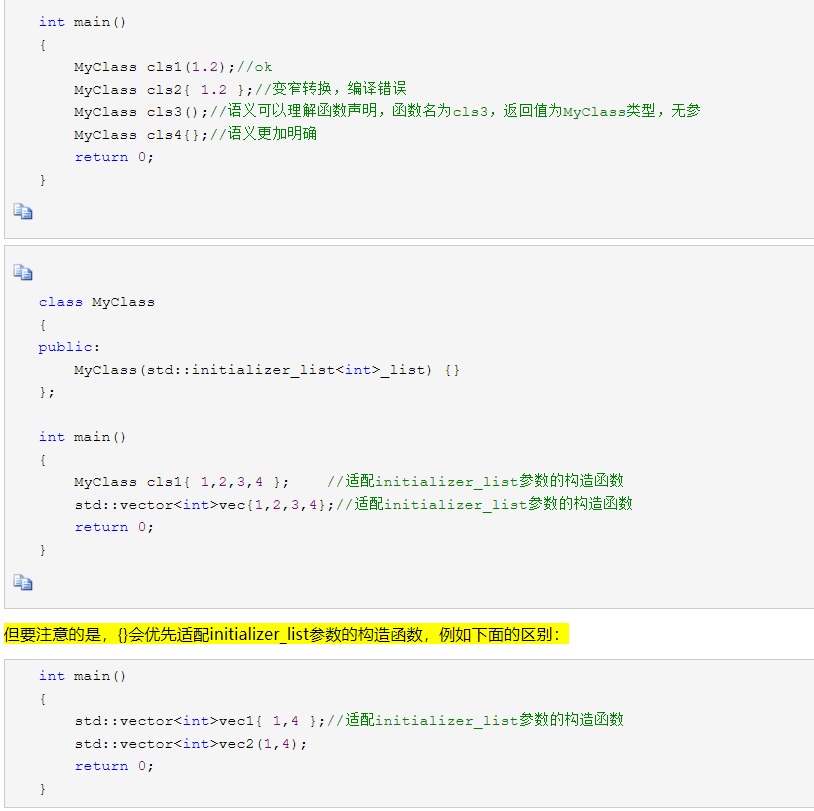
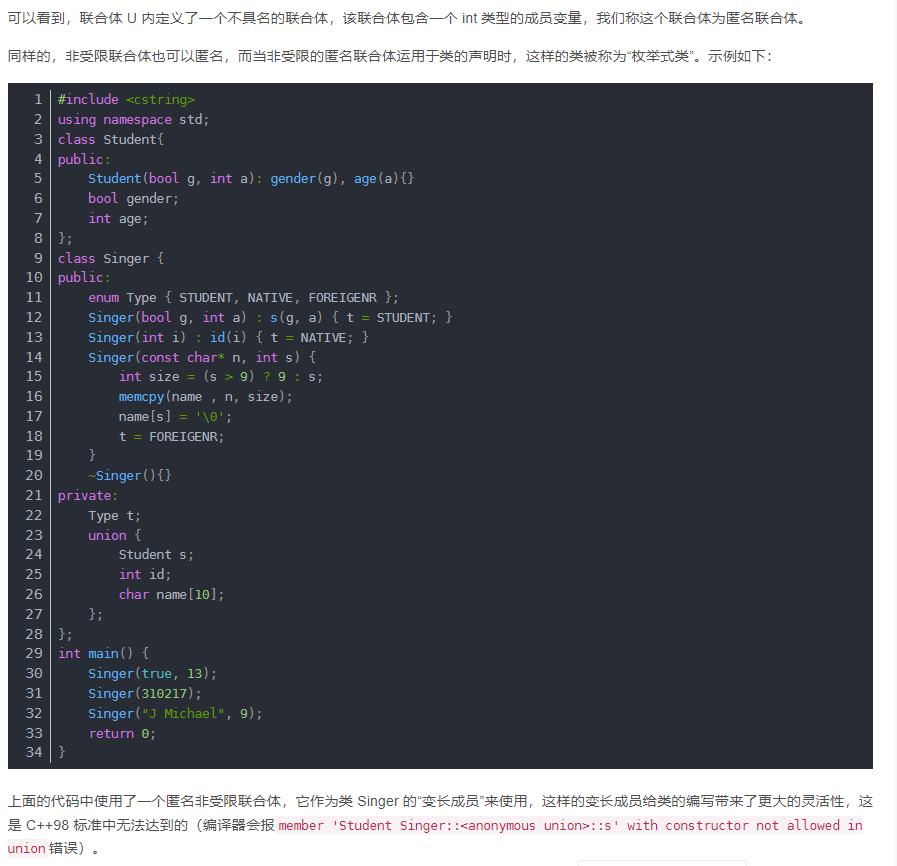
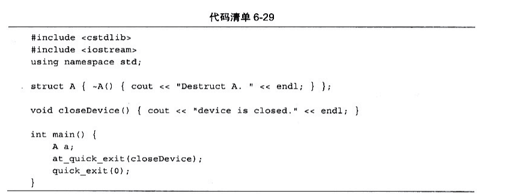

[TOC]

## https://subingwen.cn/linux/

## https://subingwen.cn/cplusplus/


##  1 新标准的诞生

#### 1.2.2 c++11语言变化的领域

C++11 语言变化的领域如果谁说 C++11 只是对C++语言做了大幅度的改进，那么他很可能就错过了C++11精彩的地方。事实上，读罢本书后，读者只需要看一眼代码，就可以说出代码究竟是C++98/03的，还是 C++11的。C++11为程序员创造了很多更有效、更便捷的代码编写方式，程序员可以用简短的代码来完成 C++98/03 中同样的功能，简单到你惊呼“天哪，怎么能这么简单”从一些简单的数据统计上看，**比起 C++98/03，C++11大大缩短了代码编写量**，依情况最多可以将代码缩短30%~80%。

那么C++11相对于 C++98/03有哪些显著的增强呢?事实上，这包括以下几点:

- 通过**内存模型、线程、原子操作等来支持本地并行编程(Native Concurrency )。**

- 口通过统一**初始化表达式、auto、declytype、移动语义等来统一对泛型编程的支持。**
- 口通过constexpr、POD(概念)等更好地支持系统编程。
- 口通过内联命名空间、继承构造函数和-有值引用等，以更好地支持库的构建。

## 2 保证稳定性和兼容性

### 2.1 保持与c99兼容

#### 2.1.3 [_Pragma操作符](https://www.cnblogs.com/Braveliu/p/12216032.html)   


#### [标记粘贴运算符 (##)](https://learn.microsoft.com/zh-cn/previous-versions/09dwwt6y(v=vs.120))

```
# 去字符串

## 连接
```


#### 2.1.4  __VA_ARGS__


### 2.4 防卫声明


### 2.5 静态断言

#### 2.5.1 断言


 

#### static_assert静态断言


#### static_cast


#### [do while(0)](https://blog.csdn.net/qq_27575841/article/details/104332888)


### 2.6 noexcept


### 2.7 快速初始化


#### [初始化使用花括号还是圆括号？](https://www.cnblogs.com/hosseini/p/18157633)





#### [必须使用{}场景](https://www.cnblogs.com/hongyugao/p/17489382.html)


#### [const变量初始化](https://blog.csdn.net/qq_45481606/article/details/118731473)


#### GPT

> 在C++中，初始化列表（initializer list）和括号初始化（parentheses initialization）或大括号初始化（brace initialization）的区别在于它们的语法和适用场景。虽然它们通常都会调用构造函数，但在某些情况下，它们的行为是不同的。让我们深入了解一下它们的区别。
>
> ### 1. 初始化列表（Initializer List）
>
> 初始化列表使用大括号`{}`来初始化对象，适用于数组、结构体和类成员的初始化。其语法如下：
>
> ```
> cpp
> 复制代码
> ClassName obj {value1, value2, ...};
> ```
>
> #### 特点：
>
> - 可以用于所有类型的初始化，包括基本类型、数组和类对象。
> - 对于类对象，它可以用于调用构造函数。
> - 可以直接初始化成员变量（特别是常量成员或引用成员）。
> - 可以避免窄化转换（narrowing conversion），即防止将大范围类型转换为小范围类型，从而丢失数据。
>
> #### 示例：
>
> ```c
> cpp复制代码class MyClass {
> public:
>     MyClass(int a, double b) { /*...*/ }
>     MyClass(std::initializer_list<int> il) { /*...*/ }
> };
> 
> MyClass obj1{1, 2.5};   // 调用 MyClass(int, double) 构造函数
> MyClass obj2{1, 2};     // 调用 MyClass(std::initializer_list<int>) 构造函数
> ```
>
> ### 2. 括号初始化（Parentheses Initialization）
>
> 括号初始化使用圆括号`()`来初始化对象。其语法如下：
>
> ```
> cpp
> 复制代码
> ClassName obj(value1, value2, ...);
> ```
>
> #### 特点：
>
> - 主要用于调用构造函数。
> - 不能直接用于初始化数组和某些结构体。
> - 对于基本类型，括号初始化和等号初始化等效。
>
> #### 示例：
>
> ```c
> cpp
> 复制代码
> MyClass obj1(1, 2.5);   // 调用 MyClass(int, double) 构造函数
> ```
>
> ### 3. 大括号初始化（Brace Initialization）
>
> 大括号初始化是C++11引入的，提供了一种统一的初始化语法，可以用于初始化各种类型。其语法如下：
>
> ```c
> cpp复制代码ClassName obj = {value1, value2, ...};
> ClassName obj{value1, value2, ...};
> ```
>
> #### 特点：
>
> - 提供统一的语法，可以用于初始化基本类型、数组、结构体和类对象。
> - 可以避免窄化转换。
> - 对于类对象，优先调用接受`std::initializer_list`的构造函数（如果存在），否则调用匹配的其他构造函数。
>
> #### 示例：
>
> ```c
> cpp复制代码MyClass obj1 = {1, 2.5};   // 调用 MyClass(int, double) 构造函数
> MyClass obj2 = {1, 2};     // 调用 MyClass(std::initializer_list<int>) 构造函数
> ```
>
> ### 总结
>
> - **初始化列表 `{}`** 提供了一种统一的初始化方式，可以用于数组、结构体和类成员，能够调用接受`std::initializer_list`的构造函数。
> - **括号初始化 `()`** 主要用于调用构造函数，不能直接用于初始化数组和某些结构体。
> - **大括号初始化 `{}`** 提供了一种避免窄化转换的安全初始化方式，对于类对象会优先调用接受`std::initializer_list`的构造函数。
>
> 这些初始化方式在适用场景和优先级上有一定区别，选择哪种初始化方式取决于具体的需求和代码风格。
>
> 
>
> 
>
> 您
>
> 怎么用大括号初始化这个数组MyClass(int a, double b)
>
> 
>
> ChatGPT
>
> ChatGPT
>
> 在C++中，如果你有一个类 `MyClass`，它有一个构造函数 `MyClass(int a, double b)`，你可以使用大括号初始化来初始化该类的对象数组。然而，需要注意的是，大括号初始化不会直接作用于构造函数，而是用于初始化列表。以下是如何使用大括号初始化来初始化一个包含多个 `MyClass` 对象的数组。
>
> 假设你有如下的类定义：
>
> ```c
> cpp复制代码class MyClass {
> public:
>     int a;
>     double b;
>     
>     MyClass(int a, double b) : a(a), b(b) {}
> };
> ```
>
> ### 初始化 `MyClass` 对象的数组
>
> 要使用大括号初始化一个包含多个 `MyClass` 对象的数组，可以按照如下方式进行：
>
> ```c
> cpp复制代码#include <iostream>
> #include <array>  // C++11及以上标准
> #include <vector> // 或者使用std::vector
> 
> class MyClass {
> public:
>     int a;
>     double b;
> 
>     MyClass(int a, double b) : a(a), b(b) {}
> };
> 
> int main() {
>     // 使用std::array来初始化数组
>     std::array<MyClass, 3> myArray = { 
>         MyClass{1, 1.1}, 
>         MyClass{2, 2.2}, 
>         MyClass{3, 3.3} 
>     };
> 
>     // 或者使用std::vector来初始化数组
>     std::vector<MyClass> myVector = { 
>         MyClass{1, 1.1}, 
>         MyClass{2, 2.2}, 
>         MyClass{3, 3.3} 
>     };
> 
>     // 打印数组内容
>     for (const auto& obj : myArray) {
>         std::cout << "MyClass(" << obj.a << ", " << obj.b << ")" << std::endl;
>     }
> 
>     return 0;
> }
> ```


### 2.8 非静态成员sizeof


### 2.10 final override

final  不给重写

override 必须重写

### 2.1x mutable

 那么我们怎样修改才能做到既使用const保证其他变量不可随意修改，又能保证在const函数体内counter可以修改呢？这时候mutable的关键字的作用就体现出来了。

我们仅仅需要在声明counter变量时使用mutable修饰一下即可，也就是：

```
class Person{
public:
    explicit Person(int a):age(a){
 
    }
    ~Person(){
 
    }
    int getAge() const{
        counter++;
        return age;
    }
private:
    int age{18};
    mutable int counter{0};
};

```

如果我们希望在被const修饰的*函数*getAge内age变量也可被修改的话,也*可以*使用*mutable修饰*age变量

### 2.11 模版默认参数

### 2.13局部和匿名类型作模版参数

在C++中，你可以创建没有标签（即匿名）的结构体。这在你只需要定义一次结构体，并且只创建该结构体类型的一个实例时非常有用。

下面是一个匿名结构体的示例：

```
struct {
    int a;
    double b;
    char c;
} instance1 = {1, 2.0, 'c'};
 
int main() {
    // 直接使用instance1
    std::cout << instance1.a << std::endl; // 输出: 1
    std::cout << instance1.b << std::endl; // 输出: 2.0
    std::cout << instance1.c << std::endl; // 输出: c
 
    // 创建另一个匿名结构体实例
    struct {
        int a;
        double b;
        char c;
    } instance2 = {3, 4.0, 'd'};
 
    // 直接使用instance2
    std::cout << instance2.a << std::endl; // 输出: 3
    std::cout << instance2.b << std::endl; // 输出: 4.0
    std::cout << instance2.c << std::endl; // 输出: d
 
    return 0;
}
```


## 3 通用为本

### [3.1 using /继承构造函数](https://blog.csdn.net/qq_45254369/article/details/126752314)

> class C : public A, public B { public:    using A::A;    using B::B;    C(int c) : A(c), B(c) {        // 自定义构造函数逻辑    } };但是没有在C(int c) :后面加上 A(c), B(c)
>
> 
>
> ChatGPT
>
> ChatGPT
>
> 在C++中，当你使用`using`声明从基类继承构造函数时，这些继承的构造函数会被添加到派生类的构造函数集合中。然而，如果你显式声明了一个构造函数并且没有在初始化列表中显式地调用基类构造函数，则会使用基类的默认构造函数（如果存在）。
>
> 你的例子中涉及的情况是继承构造函数和显式声明构造函数之间的关系。让我们深入理解一下：
>
> 假设你有如下基类定义：
>
> ```c
> cpp复制代码class A {
> public:
>     int a;
>     A(int a) : a(a) {
>         std::cout << "A's constructor with parameter " << a << std::endl;
>     }
>     A() {
>         std::cout << "A's default constructor" << std::endl;
>     }
> };
> 
> class B {
> public:
>     double b;
>     B(double b) : b(b) {
>         std::cout << "B's constructor with parameter " << b << std::endl;
>     }
>     B() {
>         std::cout << "B's default constructor" << std::endl;
>     }
> };
> ```
>
> 然后定义你的类C：
>
> ```c
> cpp复制代码class C : public A, public B {
> public:
>     using A::A;
>     using B::B;
>     C(int c) {
>         std::cout << "C's constructor with parameter " << c << std::endl;
>     }
> };
> ```
>
> ### 行为分析
>
> 在上面的定义中，`C`类有三个构造函数：
>
> 1. 从`A`继承的构造函数：`C(int a)`
> 2. 从`B`继承的构造函数：`C(double b)`
> 3. 显式定义的构造函数：`C(int c)`
>
> #### 调用显式定义的构造函数`C(int c)`
>
> 当你调用`C(int c)`时，如果没有在初始化列表中显式调用基类构造函数，编译器会尝试调用基类的默认构造函数。如果基类没有默认构造函数，编译会失败

### 3.2 委派构造


不能和初始化列表共存

### 3.3 右值引用


#### [3.3.1 移动构造](https://blog.csdn.net/weixin_59913110/article/details/131294802)


#### 3.3.2 引用折叠


### 3.4 显示转换操作符 explicit


表示 不能直接通过 

```
Convertable c;
ConverTo ct2 =  c;
```

这种方式或者传参的方法隐式构造


### 3.5列表初始化

在 C++ 中，`Vector<类A> v = {1, 3, 4, 5}` 这种写法是否合法，取决于类 A 是否有相应的构造函数来处理这些整数值。具体而言：

1. **列表初始化**：这种写法使用了列表初始化 (list initialization)，它要求类 A 必须有一个构造函数可以接受单个整数参数。也就是说，类 A 必须定义一个构造函数 `A(int)`。
2. **隐式转换**：如果类 A 有构造函数 `A(int)`，编译器会尝试使用它将每个整数转换为类 A 的实例，然后将这些实例放入 `Vector` 中。


**除了Vector**


类型收窄无法通过编译


### [3.x 虚基表](https://blog.csdn.net/qq_31125257/article/details/122957422)

https://www.cnblogs.com/xingqiu/p/13754654.html


### 3.7 [非受限联合体 枚举式的类 变长成员](https://blog.csdn.net/heli200482128/article/details/128935288)




###  3.8 用户自定义字面量


### 3.x 容器


> 
> c++ list和map set支不支持索引
>
> 在C++中，`std::list`、`std::map`、`std::set` 这三个标准库容器不支持使用索引来直接访问元素，因为它们分别是==双向链表、有序映射表和有序集合(是基于红黑树实现的)==，其内部元素之间的访问只能通过迭代器或指针进行。
>
> 以下是一些示例代码，展示如何使用这些容器的成员函数和迭代器来访问和操作它们的元素：
>
> ```c
> #include <list>
> #include <map>
> #include <set>
> #include <iostream>
>  
> int main() {
>     // 使用std::list
>     std::list<int> myList = {1, 2, 3, 4, 5};
>     // 错误：list不支持使用索引访问
>     // int firstElement = myList[0];
>     for (std::list<int>::iterator it = myList.begin(); it != myList.end(); ++it) {
>             std::cout << *it << " ";
>         }
>         
>     // 使用std::map
>     std::map<int, std::string> myMap = {{1, "one"}, {2, "two"}, {3, "three"}};
>     // 通过key访问map中的元素
>     std::cout << "Element with key 2 is " << myMap[2] << std::endl;
>  
>     // 使用std::set
>     std::set<int> mySet = {1, 2, 3, 4, 5};
>     // 迭代器遍历set中的元素
>     for (auto it = mySet.begin(); it != mySet.end(); ++it) {
>         // 输出set中的元素
>         std::cout << *it << std::endl;
>     }
>  
>     return 0;
> }
> 
> ```
>
> 在这个例子中，`myList` 是一个 `std::list` 容器，它不支持使用索引访问元素。`myMap` 是一个 `std::map` 容器，可以使用索引访问操作（[]操作符），因为它实现了随机访问迭代器。`mySet` 是一个 `std::set` 容器，它的元素是无序的，所以不支持使用索引来直接访问，但可以通过迭代器进行遍历和访问


### 3.9 内联命名空间


通常配合定义宏使用


### 3.10 别名 using


## 4 新手易学

### 4.1 右括号>>改动


### 4.2 auto

不能推导的情况


### 4.3  typeid 和 decltype


推导规则


### 4.x i++ ++i的返回值


> ### 前置增量操作符（`++i`）
>
> - **操作**：`++i` 先将 `i` 的值增加1，然后返回 `i` 本身的引用。
> - **为什么是左值**：返回的 `i` 本身具有确定的内存位置，可以被修改。因此，`++i` 是一个左值。
>
> ### 后置增量操作符（`i++`）
>
> - **操作**：`i++` 先返回 `i` 当前值的副本，然后将 `i` 的值增加1。
> - **为什么是右值**：返回的是一个临时对象（`i` 的当前值的副本），没有明确的内存地址，其生命周期短暂，只存在于表达式求值过程中。因此，`i++` 是一个右值。

### 4.x volatile

*volatile*是一个特征修饰符（type specifier）.*volatile的作用*是作为指令*关键字*，确保本条指令不会因编译器的优化而省略，且要求每次直接读值。*volatile*的变量是说这变量可能会被意想不到地改变，

### 4.4追踪返回类型 auto + decltype


> 编译器无法在解析函数参数之前推导出 `t1 + t2` 的类型。这是因为 `auto` 仅在表达式已知时才有效，而在函数参数列表之前，返回类型还未知。
>
> **示例解释**
>
> 让我们通过具体示例更详细地说明：
>
> #### 使用尾置返回类型的示例
>
> ```c
> cpp复制代码template<typename T1, typename T2>
> auto Sum(T1 t1, T2 t2) -> decltype(t1 + t2) {
>     return t1 + t2;
> }
> 
> int main() {
>     int a = 10;
>     double b = 5.5;
> 
>     auto result = Sum(a, b);  // result的类型是double
>     std::cout << "Sum(a, b): " << result << std::endl;
> 
>     return 0;
> }
> ```
>
> 在这个例子中，`Sum` 函数返回的类型是 `decltype(t1 + t2)`，即 `int` 和 `double` 相加后的类型（通常为 `double`）。编译器在解析参数之后，能够根据参数类型推导出 `decltype(t1 + t2)` 的类型。


### 4.5 基于范围的for循环

for auto x:arr

## 5 提高安全类型

### 5.1 强枚举


#### 匿名类的对象

```
class {

} object_name;
```

### 5.2 堆内存管理  智能指针与垃圾回收

#### 5.2.1 显示内存管理


#### 5.2.2 智能指针


unique_ptr: 不能和其他unique_ptr执向同一块内存，但可以用move转移

share_ptr: 采用引用计数，只用达到次数就会释放占有的内存


#### 5.2.3 垃圾回收机制


#### 5.2.5 垃圾回收机制的支持


## 6 提高性能及操作硬件的能力

### 6.1 常量表达式

#### 6.1.1 运行时和编译时常量


#### 6.x 非类型模板参数

```c++
// 类型模板参数
// 非类型模板参数 -- 整形常量
template<class T=int,size_t N=100>
class Array
{
public:
private:
	T _a[N];
};
int main()
{
	Array<int, 100> a1;
	Array<int,1000> a2;
 
	return 0;
}
 
int main()
{
	Array<int, 100> a1;
	Array<int,1000> a2;
	return 0;

}
```

非类型模板参数一定是整形常量（不能是浮点型，字符串），模板参数都可以使用缺省值，==但是不能使用const x==，因为这些值需要再编译就是常量值，而const是在运行时候才是常量


那怎么办呢？

```
constexpr int GetConst(){return 1};
```

#### 6.1.2 常量表达函数

就是说了constexpr常量表达函数一大堆条件，几乎只能直接return 一个值；

#### 6.1.3 常量表达式值


自定义结构体和成员函数


### 6.2变长模板


#### 6.2.1变长函数

有点想python的收集参数

比如printf


#### 6.2.x [POD plain old data](https://blog.csdn.net/tjcwt2011/article/details/110381531)


#### 6.2.x  tuple

是可以接受任意个参数类型的pair？


#### 6.2.2  变长模板

```c++
template <typename... Elements> class tuple;
```


```c++
template <int... A> class Variad;
```


### 6.3原子类型和原子操作

> 原子操作：最小的不可并行化的操作

> 进程是资源分配的最小单位，线程是CPU调度的最小单位


#### 6.3.2 Pthread的mutex实现多线程累加


代码很多而且麻烦


#### c++11中的原子类型


```
atomic_llong
```


并且可以使用

```c++
std::atomic<T> t; //实现自定义的原子类型
```


原子类型默认删除拷贝构造，所以只能从模板参数类型中构造


```c++
std::atomic<int> a;
a.load();

```

特殊的 atomic_flag是无锁的

#### 6.3.3顺序一致性

在python中我记得我是通过锁或者事件来保证执行按设想的顺序


没有顺序一致性的例子


会输出多种可能的原因


除此之外


这里最后可以

```
a使用relaxed
b使用release
```


### 6.4线程局部存储

　　如果需要在一个线程内部的各个函数调用都能访问、但其它线程不能访问的变量（被称为static memory local to a thread 线程局部静态变量），就需要新的机制来实现。这就是TLS。


```
int thread_local errcode
```


### 6.5 快速退出


python界面多进程的异常退出，其他线程依然存活？

> terminate：	异常未捕捉则调用terminate
>
> abort: 			terminate默认调用abort:且不执行析构
>
> exit：正常析构
>
> quick_exit: 快速退出，不析构但属于正常推出，且可以用at_quick_exit注册回调函数



## 7 为改变思考方式而改变


0可以表示为int也可是（void *）

### 7.1 nullptr

### 7.x decltype

decltype(tea) tea2;// 会推导出 tea类型是Teacher并 tea2 = Teacher


#### 7.1.2 nulltpr_t


### 7.2 默认函数的控制

```
构造函数= default   //表示用默认版本，这样还是POD（平凡的）
```

```
private:
	拷贝构造();  //禁用拷贝
	
拷贝构造() = delete	
```

### 7.3 lambda


## 8 融入实际

### 8.1 **对齐支持**

#### 7.4 内存对齐

#### validate

#### alignof alignas

>
> alignof是一个操作符，用于查询类型或变量的对齐要求。它返回一个std::size_t类型的值，表示类型或变量的对齐字节数。
>
> ```
> #include <iostream>
> 
> struct MyStruct {
>     char c;
>     int i;
> };
> 
> int main() {
>     std::cout << "Alignment of char: " << alignof(char) << std::endl;
>     std::cout << "Alignment of int: " << alignof(int) << std::endl;
>     std::cout << "Alignment of MyStruct: " << alignof(MyStruct) << std::endl;
>     return 0;
> }
> ```
>
> 输出：
>
> ```
> Alignment of char: 1
> Alignment of int: 4
> Alignment of MyStruct: 4
> ```
>
> 在这个例子中，alignof操作符用来查询char、int和用户定义的MyStruct类型的对齐要求。
>
> alignas
> alignas是一个对齐说明符，用于指定变量或类型的最小对齐要求。alignas可以用于变量声明或类型定义中，以确保所声明的变量或类型实例具有特定的对齐。
>
> ```
> #include <iostream>
> 
> struct alignas(16) AlignedStruct {
>     int i;
> };
> 
> int main() {
>     AlignedStruct a;
>     std::cout << "Alignment of AlignedStruct: " << alignof(a) << std::endl;
>     return 0;
> 
> 输出：
> Alignment of AlignedStruct: 16
> ```
>
> 原文链接：https://blog.csdn.net/kelvin_yin/article/details/137468039

#### align


### 8.2 通用属性

#### 8.2.1 拓展通用属性 __ attribute __   __ declspec __ 


### 8.3  [unicode支持](https://dablelv.blog.csdn.net/article/details/82016543?spm=1001.2101.3001.6650.4&utm_medium=distribute.pc_relevant.none-task-blog-2%7Edefault%7EBlogCommendFromBaidu%7ERate-4-82016543-blog-134856514.235%5Ev43%5Epc_blog_bottom_relevance_base6&depth_1-utm_source=distribute.pc_relevant.none-task-blog-2%7Edefault%7EBlogCommendFromBaidu%7ERate-4-82016543-blog-134856514.235%5Ev43%5Epc_blog_bottom_relevance_base6&utm_relevant_index=7)


#### 格式字符串 R""

```c

#include <iostream>
#include <format>  // C++20


R""
    


int main() {
    int age = 25;
    std::string name = "Alice";
    std::string formatted_string = std::format("Hello, {}! You are {} years old.", name, age);
    std::cout << formatted_string << std::endl;
    return 0;
}


int main() {
    int age = 25;
    std::string name = "Alice";
    
    std::stringstream ss;
    ss << "Hello, " << name << "! You are " << age << " years old.";
    
    std::string formatted_string = ss.str();
    std::cout << formatted_string << std::endl;
    return 0;
}
```

