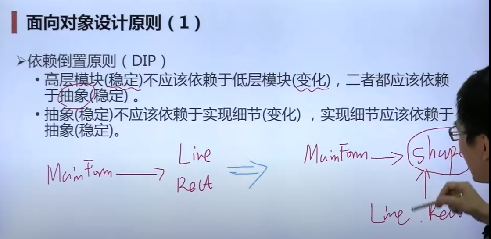

[TOC]


# 设计模式

##  

## 面向对象


### 底层思维：

封装 继承 多态


### 抽象层面：

1. 隔离变化：适应变化

2. 各司其职：

   比如Draw这个任务不应该属于Line,rectangle,circular而是应该属于基类shape

   


## 分解的思路和抽象的思路

一个界面内有Line,rectangle,circular

一个界面内有shape,  shape包括  Line,rectangle,circular

## 设计原则


### 依赖倒置原则

 

开放封闭原则：类模块应该是可扩展，但是不可修改的

单一责任原则: 	一 个类应该只有一个引起变化的原则

### 一、模板方法

1. 组件协作模式（晚绑定）——框架与应用程序划分

- 模板方法
- 策略模式
- 观察者模式

\2. 动机与背景

现在需要做一道菜，做菜的步骤是确定的。库函数就是厨房，提供了水、油、煤气灶等功能，这些是不变的；应用程序是做的菜，比如番茄炒蛋、凉拌黄瓜，根据需求不同具体的步骤也不同，这些是可变的。

\3. 没有使用设计模式的代码

```cpp
#include <iostream>
using namespace std;

class Library {
public:
    void step1() {
        cout << "i am step 1" << endl;
    }
    void step3() {
        cout << "i am step 3" << endl;
    }
    void step5() {
        cout << "i am step 5" << endl;
    }
};

// 应用程序开发者负责主流程
class Application {
public:
    bool step2() {
        cout << "i am step 2 from Application" << endl;
        return true;
    }
    void step4() {
        cout << "i am step 4 from Application" << endl;
    }
};

int main() {
    Library* lib = new Library();
    Application* app = new Application();

    lib->step1();
    if (app->step2()) {
        lib->step3();
    }
    for (int i = 0; i < 4; ++i) {
        app->step4();
    }
    lib->step5();

    return 0;
}
```

\4. 存在的问题

对于不同的菜，除了具体的菜品以外，很多东西的流程是固定的，比如：架锅、倒油、开火这些，没有必要将这些步骤重复交给应用程序的开发者来完成，造成很多的重复性工作。

\5. 解决方法

使用模板方法：将主流程抽象出来，交给库函数实现，应用程序继承自库函数，重写存在变化的步骤，减少重复性工作。

\6. 使用设计模式的代码

```cpp
#include <iostream>
using namespace std;

// 库开发者负责主流程
class Library {
public:
    void Run() {
        step1();
        if (step2()) {
            step3();
        }
        for (int i = 0; i < 4; ++i) {
            step4();
        }
        step5();
    }
    virtual ~Library() {}
protected:
    void step1() {
        cout << "i am step 1" << endl;
    }
    void step3() {
        cout << "i am step 3" << endl;
    }
    void step5() {
        cout << "i am step 5" << endl;
    }
    virtual bool step2() = 0;
    virtual void step4() = 0;
};

class Application: public Library {
protected:
    bool step2() {
        cout << "i am step 2 from Application" << endl;
        return true;
    }
    void step4() {
        cout << "i am step 4 from Application" << endl;
    }
};

int main() {
    // 多态指针
    Library* lib = new Application();
    lib->Run();

    return 0;
}
```

\7. 适用场景

- Run是稳定的，将所支持的变化写成虚函数

\8. 总结

- 常用、简洁（虚函数），易扩展
- 反向控制——不要调用我，让我来调用你
- 被模板调用的方法，可以实现也可以不实现

\9. 绑定

- 早绑定（结构化流程）：Application（晚）调用Library（早）
- 晚绑定（面向对象）：Library（早）调用Application（晚）

### 二、策略模式

1. 组件协作模式（晚绑定）——框架与应用程序划分

- 模板方法
- 策略模式
- 观察者模式

\2. 动机与背景

- 税种计算，根据不同国家的税法的不同，实现不同的选择。例如中国、美国、德国的税法计算规则不同，需要根据当前的情况选择相应的策略。

\3. 没有使用设计模式的代码

```cpp
#include <iostream>
using namespace std;

enum TaxBase {
    CN_tax,
    US_tax,
    DE_tax
};

class SalesOrder {
    TaxBase tax;
public:
    SalesOrder(TaxBase _tax): tax(_tax) {}
    void calculateTax() {
        if (tax == CN_tax) {
            cout << "i am CN_tax" << endl;
        }
        else if (tax == US_tax) {
            cout << "i am US_tax" << endl;
        }
        else if (tax == DE_tax) {
            cout << "i am DE_tax" << endl;
        }
        else {
            cout << "invalid TaxBase" << endl;
        }
    }
};

int main() {
    SalesOrder* order = new SalesOrder(CN_tax);
    order->calculateTax();

    return 0;
}
```

\4. 存在的问题

- 对于以后的新增需求，需要更改源代码，不仅麻烦，还违反了开闭原则；如果只在某种情况使用（例如只在中国使用），其他的代码块判断是不必要的开销。

\5. 解决方法

- 使用策略模式：将每一种算法独立封装，可以独立使用（稳定不依赖变化），使用扩展（子类化）的方式来实现细节。在以后每一次增加新的税法计算规则时，不需要更改之前的代码，而是新增子类继承自策略抽象类。

\6. 使用设计模式的代码

```cpp
#include <iostream>
using namespace std;

class TaxStrategy {
public:
    virtual void calculate() = 0;
    virtual ~TaxStrategy() {}
};

class CNTax: public TaxStrategy {
public:
    virtual void calculate() {
        cout << "i am CN_tax" << endl;
    }
};

class USTax: public TaxStrategy {
public:
    virtual void calculate() {
        cout << "i am US_tax" << endl;
    }
};

class DETax: public TaxStrategy {
public:
    virtual void calculate() {
        cout << "i am DE_tax" << endl;
    }
};

class SalesOrder {
private:
    // 多态指针
    TaxStrategy* strategy;
public:
    // 使用工厂方法改变strategy指针（挖坑，后面填）
    SalesOrder() {}
    ~SalesOrder() {}
    void calculate() {
        // 多态调用
        strategy->calculate();
    }
};

int main() {
    SalesOrder* order = new SalesOrder();
    order->calculate();

    return 0;
}
```

\7. 适用场景

- 从时间的维度上看，不同的策略多变，增减更改频繁。

\8. 总结

- 提供了一系列可重用的算法，实现了运行时根据需要灵活切换各个策略
- 对`if else`（结构化思维）的一种重新实现（面向对象思维）
- 可以配合单例模式，节省对象开销

\9. 复用

- 编译单位的复用性、二进制文件意义下的复用性

### 三、观察者模式

1. 组件协作模式（晚绑定）——框架与应用程序划分

- 模板方法
- 策略模式
- 观察者模式

\2. 动机与背景

- 文件分割器。大文件需要分成若干个小文件，这其中需要进行进度展示（或者其他的类似场景），但是需要的进度展示不是一个，而是多个。

\3. 没有使用设计模式的代码

```cpp
#include <iostream>
using namespace std;

class FileSplitter {
private:
    string m_filePath;
    int m_fileNumber;
    ProgressBar* m_progressBar;

public:
    FileSplitter(string& filePath, int fileNumber, ProgressBar* progressBar):
        m_filePath(filePath), 
        m_fileNumber(fileNumber), 
        m_progressBar(progressBar) {
    }

    void split() {
        for (int i = 0; i < m_fileNumber; ++i) {
            m_progressBar->setValue();
        }
    }
};

// 主逻辑
class Form {};

class TextBox {
public:
    string getText() {
        return "";
    }
};

class ProgressBar {
public:
    void setValue() {}
};

class MainForm: Form {
private:
    TextBox* txtFilePath;
    TextBox* txtFileNumber;
    ProgressBar* progressBar;

public:
    void buttonClick() {
        string filePath = txtFilePath->getText();
        int fileNumber = atoi(txtFileNumber->getText().c_str());

        FileSplitter* splitter = new FileSplitter(filePath, fileNumber, progressBar);
        splitter->split();
    }
};
```

\4. 存在的问题

- 观察者会变化，需要更改目标的通知实现方式，对于观察者增减的需求不满足开闭原则；通知的具体实现在目标处完成，没有独立抽象，不符合DIP原则。

\5. 解决方法

- 使用观察者模式：定义对象间的一对多的关系，以便一个对象发生变化时，能够及时通知所依赖的其他对象（观察者），方便添加或删除观察者，并且符合DIP原则。

\6. 使用设计模式的代码

```cpp
#include <iostream>
#include <vector>
using namespace std;

class IProgress {
public:
    virtual void DoProgress(float value) = 0;
    virtual ~IProgress() {}
};

class FileSplitter {
private:
    string m_filePath;
    int m_fileNumber;
    // 抽象通知机制
    IProgress* m_iprogress;
    // 多个观察者使用容器保存
    vector<IProgress*> m_iprogressVector;

public:
    FileSplitter(string& filePath, int fileNumber, IProgress* iprogress):
        m_filePath(filePath), 
        m_fileNumber(fileNumber), 
        m_iprogress(iprogress) {
    }

    void split() {
        for (int i = 0; i < m_fileNumber; ++i) {
            m_iprogress->DoProgress(i);
            // 多个观察者使用容器保存
        }
    }

    // 多个观察者
    void add() {}

    void remove() {}
};

// 主逻辑
class Form {};

class TextBox {
public:
    string getText() {
        return "";
    }
};

class ProgressBar {
public:
    void setValue() {}
};

class MainForm: public Form, public IProgress {
private:
    TextBox* txtFilePath;
    TextBox* txtFileNumber;
    ProgressBar* progressBar;

public:
    void buttonClick() {
        string filePath = txtFilePath->getText();
        int fileNumber = atoi(txtFileNumber->getText().c_str());

        // this比较重要
        FileSplitter* splitter = new FileSplitter(filePath, fileNumber, this);

        splitter->split();
    }

    // 不论有多少个观察者，都可以实现自己的通知机制
    virtual void Doprogress(float value) {
        progressBar->setValue();
    }
};
```

\7. 适用场景

- 通知事件时，被通知的对象（观察者）经常变化，但不需要频繁改变目标的通知方式。

\8. 总结

- 可以独立改变目标与观察者（松耦合）
- 目标发送通知时，无需指定观察者，只管通知机制，而通知自动传播
- 观察者自己决定是否订阅通知

\9. 依赖

- 编译时依赖，在编译A之前必须完成B的编译，我们就说A依赖于B
- 运行时依赖

### 四、装饰模式

1. “单一职责”模式——责任划分不清晰

- 装饰模式
- 桥模式

\2. 动机与背景

- 流处理。存在不同流，例如文件、网络、内存等，实现对其进行的操作，包括加密、缓存既加密又缓存等。

\3. 没有使用设计模式的代码

```cpp
#include <iostream>
using namespace std;

// 业务操作
class Stream{
public:
    virtual char Read(int number) = 0;
    virtual void Seek(int position) = 0;
    virtual void Write(char data) = 0;

    virtual ~Stream() {}
};

// 主体类
class FileStream: public Stream{
public:
    virtual char Read(int number) {
        // 读文件流
    }
    virtual void Seek(int position) {
        // 定位文件流
    }
    virtual void Write(char data) {
        // 写文件流
    }
};

class NetworkStream: public Stream{
public:
    virtual char Read(int number) {
        // 读网络流
    }
    virtual void Seek(int position) {
        // 定位网络流
    }
    virtual void Write(char data) {
        // 写网络流
    }
};

class MemoryStream: public Stream{
public:
    virtual char Read(int number) {
        // 读内存流
    }
    virtual void Seek(int position) {
        // 定位内存流
    }
    virtual void Write(char data) {
        // 写内存流
    }
};

// 扩展操作
class CryptoFileStream: public FileStream{
public:
    virtual char Read(int number) {
        // 额外加密操作
        FileStream::Read(number); // 读文件流
    }
    virtual void Seek(int position) {
        // 额外加密操作
        FileStream::Seek(position); // 定位文件流
    }
    virtual void Write(char data) {
        // 额外加密操作
        FileStream::Write(data); // 写文件流
    }
};

class CryptoNetworkStream: public NetworkStream{
public:
    virtual char Read(int number) {
        // 额外加密操作
        NetworkStream::Read(number); // 读网络流
    }
    virtual void Seek(int position) {
        // 额外加密操作
        NetworkStream::Seek(position); // 定位网络流
    }
    virtual void Write(char data) {
        // 额外加密操作
        NetworkStream::Write(data); // 写网络流
    }
};

class CryptoMemoryStream: public MemoryStream{
public:
    virtual char Read(int number) {
        // 额外加密操作
        MemoryStream::Read(number); // 读内存流
    }
    virtual void Seek(int position) {
        // 额外加密操作
        MemoryStream::Seek(position); // 定位内存流
    }
    virtual void Write(char data) {
        // 额外加密操作
        MemoryStream::Write(data); // 写内存流
    }
};

// 其他需求
class BufferedFileStream: public FileStream{
    // 缓冲
};

class BufferedNetworkStream: public NetworkStream{
    // ...
};

class BufferedMemoryStream: public MemoryStream{
    // ...
};

class CryptoBufferedFileStream: public FileStream{
    // 既加密
    // 又缓冲
};

class CryptoBufferedNetworkStream: public NetworkStream{
    // ...
};

class CryptoBufferedMemoryStream: public MemoryStream{
    // ...
};

// process
void Process(){
    // 编译时装配
    CryptoFileStream* fs1 = new CryptoFileStream();

    BufferedFileStream* fs2 = new BufferedFileStream();

    CryptoBufferedFileStream* fs3 = new CryptoBufferedFileStream();
}
```

\4. 存在的问题

- 加密等操作不会因为Read等操作对象的不同而不同，造成了代码冗余的问题，代码大量重复；扩展缺乏灵活性，随着子类增多，各种子类的组合会导致子类膨胀。

\5. 解决方法

- 使用装饰模式：加密、缓存、以及其他的“扩展性质”与文件、网络、以及内存等“主体类”可以分开继承，使用组合代替继承。

\6. 使用设计模式的代码

```cpp
#include <iostream>
using namespace std;

// 业务操作
class Stream{
public:
    virtual char Read(int number) = 0;
    virtual void Seek(int position) = 0;
    virtual void Write(char data) = 0;

    virtual ~Stream() {}
};

// 主体类
class FileStream: public Stream{
public:
    virtual char Read(int number) {
        // 读文件流
    }
    virtual void Seek(int position) {
        // 定位文件流
    }
    virtual void Write(char data) {
        // 写文件流
    }
};

class NetworkStream: public Stream{
public:
    virtual char Read(int number) {
        // 读网络流
    }
    virtual void Seek(int position) {
        // 定位网络流
    }
    virtual void Write(char data) {
        // 写网络流
    }
};

class MemoryStream: public Stream{
public:
    virtual char Read(int number) {
        // 读内存流
    }
    virtual void Seek(int position) {
        // 定位内存流
    }
    virtual void Write(char data) {
        // 写内存流
    }
};

// 扩展操作
class CryptoStream: public Stream{ // 定义了接口规范
    // 未来（运行时）变成new FileStream()、new NetworkStream()、new MemoryStream()
    Stream* stream;
public:
    // 构造函数
    CryptoStream(Stream* stm): stream(stm) {}

    virtual char Read(int number) {
        // 额外加密操作
        stream->Read(number); // 读xx流
    }
    virtual void Seek(int position) {
        // 额外加密操作
        stream->Seek(position); // 定位xx流
    }
    virtual void Write(char data) {
        // 额外加密操作
        stream->Write(data); // 写xx流
    }
};

// 其他需求
class BufferedStream: public Stream{
    Stream* stream;
public:
    // 构造函数
    BufferedStream(Stream* stm): stream(stm) {}

    virtual char Read(int number) {
        // 额外缓存操作
        stream->Read(number); // 读xx流
    }
    virtual void Seek(int position) {
        // 额外缓存操作
        stream->Seek(position); // 定位xx流
    }
    virtual void Write(char data) {
        // 额外缓存操作
        stream->Write(data); // 写xx流
    }
};

// process
void Process(){
    // 运行时通过组合装配
    FileStream* fs1 = new FileStream();
    CryptoStream* fs2 = new CryptoStream(fs1);
    BufferedStream* fs3 = new BufferedStream(fs1);
    // 既加密又缓存
    BufferedStream* fs4 = new BufferedStream(fs2);
}
```

\7. 适用场景

设计类时，几个子类型之间不是同一个变化方向，可以分开进行处理。例如本例子中“主体”和“扩展”应该分别进行继承，而不是“扩展”需要继承自“主体”。

\8. 总结

- 继承为类型引入静态特性
- 组合使用了动态特性
- 通过组合而非继承，实现了运行时动态扩展对象功能的能力

\9. 特殊点

- 既继承，又有父类字段（构造器有同样类型的参数），那么很可能是装饰模式

### 五、桥模式

1. “单一职责”模式——责任划分不清晰

- 装饰模式
- 桥模式

\2. 动机与背景

- 不同平台的程序。对于同一个程序，需要对不同平台进行设计，并且每种平台都有对应的不同版本。

\3. 没有使用设计模式的代码

```cpp
#include <iostream>
using namespace std;

class Messager{
public:
    virtual void Login(string username, string password) = 0;
    virtual void SendMessage(string massage) = 0;
    virtual void SendPicture(Image image) = 0;

    virtual void PlaySound() = 0;
    virtual void DrawShape() = 0;
    virtual void WriteText() = 0;
    virtual void Connect() = 0;

    virtual ~Messager() {}
};

// 平台实现
class PCMessagerBase: public Messager{
public:
    virtual void PlaySound() {
        // ...
    }
    virtual void DrawShape() {
        // ...
    }
    virtual void WriteText() {
        // ...
    }
    virtual void Connect() {
        // ...
    }
};

class MobileMessagerBase: public Messager{
public:
    virtual void PlaySound() {
        // ...
    }
    virtual void DrawShape() {
        // ...
    }
    virtual void WriteText() {
        // ...
    }
    virtual void Connect() {
        // ...
    }
};

// 业务抽象
class PCMessagerLite: public PCMessagerBase{
public:
    virtual void Login(string username, string password) {
        PCMessagerBase::Connect();
        // ...
    }
    virtual void SendMessage(string massage) {
        PCMessagerBase::WriteText();
        // ...
    }
    virtual void SendPicture(string massage) {
        PCMessagerBase::DrawShape();
        // ...
    }
};

class PCMessagerPerfect: public PCMessagerBase{
public:
    virtual void Login(string username, string password) {
        PCMessagerBase::PlaySound();
        // ...
        PCMessagerBase::Connect();
        // ...
    }
    virtual void SendMessage(string massage) {
        PCMessagerBase::PlaySound();
        // ...
        PCMessagerBase::WriteText();
        // ...
    }
    virtual void SendPicture(string massage) {
        PCMessagerBase::PlaySound();
        // ...
        PCMessagerBase::DrawShape();
        // ...
    }
};

class MobileMessagerLite: public MobileMessagerBase{
public:
    virtual void Login(string username, string password) {
        MobileMessagerBase::Connect();
        // ...
    }
    virtual void SendMessage(string massage) {
        MobileMessagerBase::WriteText();
        // ...
    }
    virtual void SendPicture(string massage) {
        MobileMessagerBase::DrawShape();
        // ...
    }
};

class MobileMessagerPerfect: public MobileMessagerBase{
public:
    virtual void Login(string username, string password) {
        MobileMessagerBase::PlaySound();
        // ...
        MobileMessagerBase::Connect();
        // ...
    }
    virtual void SendMessage(string massage) {
        MobileMessagerBase::PlaySound();
        // ...
        MobileMessagerBase::WriteText();
        // ...
    }
    virtual void SendPicture(string massage) {
        MobileMessagerBase::PlaySound();
        // ...
        MobileMessagerBase::DrawShape();
        // ...
    }
};

void Process() {
    // 编译时装配
    Messager* m = new MobileMessagerPerfect();
}
```

\4. 存在的问题

- 与装饰模式相似，由于类的继承而造成代码大量重复；随着子类增多，各种子类的组合会导致子类膨胀。

\5. 解决方法

- 使用桥模式：将平台程序与业务特性分离，以组合来替代继承。

\6. 使用设计模式的代码

```cpp
#include <iostream>
using namespace std;

class Messager{
protected:
    MessagerImp* messagerImp;
public:
    Messager(MessagerImp* mImp) {
        // 初始化字段messagerImp
        messagerImp = mImp;
    }
    virtual void Login(string username, string password) = 0;
    virtual void SendMessage(string massage) = 0;
    virtual void SendPicture(Image image) = 0;

    virtual ~Messager() {}
};

class MessagerImp{
public:
    virtual void PlaySound() = 0;
    virtual void DrawShape() = 0;
    virtual void WriteText() = 0;
    virtual void Connect() = 0;

    virtual ~MessagerImp() {}
};

// 平台实现
class PCMessagerImp: public MessagerImp{
public:
    virtual void PlaySound() {
        // ...
    }
    virtual void DrawShape() {
        // ...
    }
    virtual void WriteText() {
        // ...
    }
    virtual void Connect() {
        // ...
    }
};

class MobileMessagerImp: public MessagerImp{
public:
    virtual void PlaySound() {
        // ...
    }
    virtual void DrawShape() {
        // ...
    }
    virtual void WriteText() {
        // ...
    }
    virtual void Connect() {
        // ...
    }
};

// 业务抽象
class MessagerLite: public Messager{
    // 重写构造函数，new的对象不同
public:
    virtual void Login(string username, string password) {
        messagerImp->Connect();
        // ...
    }
    virtual void SendMessage(string massage) {
        messagerImp->WriteText();
        // ...
    }
    virtual void SendPicture(string massage) {
        messagerImp->DrawShape();
        // ...
    }
};

class MessagerPerfect: public Messager{
public:
    virtual void Login(string username, string password) {
        messagerImp->PlaySound();
        // ...
        messagerImp->Connect();
        // ...
    }
    virtual void SendMessage(string massage) {
        messagerImp->PlaySound();
        // ...
        messagerImp->WriteText();
        // ...
    }
    virtual void SendPicture(string massage) {
        messagerImp->PlaySound();
        // ...
        messagerImp->DrawShape();
        // ...
    }
};

void Process() {
    // 运行时装配
    MessagerImp* mImp = new PCMessagerImp();
    Messager* m = new Messager(mImp);
}
```

\7. 适用场景

- 一般应用在“两个非常强的变化维度”，有时一个类也有多于两个的变化维度，这时可以用桥的扩展模式。

\8. 总结

- 使用“对象间的组合关系”解耦了抽象和实现之间固有的绑定关系
- 比多继承更好的解决方法

\9. 疑问

- Messager类为纯虚基类，为什么在Process中可以实例化呢？

### 六、工厂模式

\1. “对象创建”模式——绕开new

- 工厂模式
- 抽象工厂
- 原型模式
- 构建器

\2. 动机与背景

- 依旧是文件分割器。但是需要构建不同的分割器，由于需求的变化，导致对象的具体类型经常变化。

\3. 没有使用设计模式的代码

```cpp
#include <iostream>
using namespace std;

// 抽象基类
class ISplitter {
public:
    virtual void split() = 0;
    virtual ~ISplitter() {}
};

// 具体类型
class BinarySplitter: public ISplitter {
public:
    void split() {
        // ...
    }
};

class TxtSplitter: public ISplitter {

};

class PictureSplitter: public ISplitter {

};

class VideoSplitter: public ISplitter {

};


class MainForm {
public:
    void buttonClick() {
        // 没有绕开具体类
        ISplitter* splitter = new BinarySplitter();
        splitter->split();
    }
};
```

\4. 存在的问题

- 由于MainForm的稳定依赖了具体的（变化的）子类，造成了类间依赖关系的不稳定，违反了DIP（依赖倒置原则），是不推荐的情况。

\5. 解决方法

- 使用工厂模式：实现一个方法，绕开new，同样返回一个对象。定义一个用于创建对象的接口，让子类决定实例化某个类。

\6. 使用设计模式的代码

```cpp
#include <iostream>
using namespace std;

// 抽象基类
class ISplitter {
public:
    virtual void split() = 0;
    virtual ~ISplitter() {}
};

// 具体类型
class BinarySplitter: public ISplitter {
public:
    void split() {
        // ...
    }
};

class TxtSplitter: public ISplitter {

};

class PictureSplitter: public ISplitter {

};

class VideoSplitter: public ISplitter {

};

// 工厂基类
class SplitterFactory {
public:
    virtual ISplitter* CreateSpitter() = 0;
    virtual ~SplitterFactory() {}
};

// 具体工厂
class BinarySplitterFactory: public SplitterFactory {
public:
    virtual ISplitter* CreateSpitter() {
        return new BinarySplitter();
    }
};

class TxtSplitterFactory: public SplitterFactory {
public:
    virtual ISplitter* CreateSpitter() {
        return new TxtSplitter();
    }
};

class PictureSplitterFactory: public SplitterFactory {
public:
    virtual ISplitter* CreateSpitter() {
        return new PictureSplitter();
    }
};

class VideoSplitterFactory: public SplitterFactory {
public:
    virtual ISplitter* CreateSpitter() {
        return new VideoSplitter();
    }
};

// MainForm不再依赖具体类
class MainForm {
private:
    SplitterFactory* factory;
public:
    MainForm(SplitterFactory* factory) {
        this->factory = factory;
    }
    void buttonClick() {
        // 多态new
        ISplitter* splitter = factory->CreateSpitter();
        splitter->split();
    }
};
```

\7. 适用场景

- 对于创建对象的需求多变，如果在时间线上有改动，则需要修改源代码，而不是用增加代替，就可以以工厂代替原本的new操作。

\8. 总结

- 用于隔离类对象的使用者和具体类型之间的耦合关系
- 通过面向对象，将创建具体对象的工作延迟到子类
- 解决“单个对象”的需求变化；要求创建方法/参数相同

\9. 面向接口编程

- 对象要声明成为抽象基类

### 七、抽象工厂

\1. “对象创建”模式——绕开new

- 工厂模式
- 抽象工厂
- 原型模式
- 构建器

\2. 动机与背景

- 对数据库操作的接口。一系列操作包括连接、命令、读取等，另一系列包括Sql、Oracle等数据库。

\3. 没有使用设计模式的代码

```cpp
#include <iostream>
using namespace std;

// 数据库相关基类
class IDBConnection {

};

class IDBCommand {

};

class IDataReader {

};

// 基类对应工厂
class IDBConnectionFactory {
public:
    virtual IDBConnection* CreateDBConnection() = 0;
};

class IDBCommandFactory {
public:
    virtual IDBCommand* CreateDBCommand() = 0;
};

class IDataReaderFactory {
public:
    virtual IDataReader* CreateDataReader() = 0;
};

// 支持Sql
class SqlConnection: public IDBConnection {

};

class SqlCommand: public IDBCommand {

};

class SqlDataReader: public IDataReader {

};

// Sql相关工厂
// 略

// 支持Oracle
// 略

// Oracle相关工厂
// 略

class EmployeeDAO {
private:
    // 三个工厂是有相关性的，不可以使用Sql的Connection和Oracle的Command
    IDBConnectionFactory* dbConnectionFactory;
    IDBCommandFactory* dbCommandFactory;
    IDataReaderFactory* dbDataReaderFactory;

public:
    vector<EmployeeDO> GetEmployees() {
        IDBConnection* connection = dbConnectionFactory->CreateDBConnection();
        connection->ConnectionString("...");

        IDBCommand* command = dbCommandFactory->CreateDBCommand();
        command->CommandText("...");

        IDataReader* reader = command->ExecuteReader();

        while (reader->Read()) {
            // ...
        }
    }
};
```

\4. 存在的问题

- 在使用过程中，实际上不允许出现Sql的连接搭配Oracle的命令的操作，但是代码没有保证这一点，存在不便利之处。

\5. 解决方法

- 使用抽象工厂：工厂不再单一生产单个对象，而是将一系列操作放进一个工厂，都由一个工厂生产，故名抽象工厂。

\6. 使用设计模式的代码

```cpp
#include <iostream>
using namespace std;

// 数据库相关基类
class IDBConnection {

};

class IDBCommand {

};

class IDataReader {

};

// 抽象工厂
class IDBFactory {
public:
    virtual IDBConnection* CreateDBConnection() = 0;
    virtual IDBCommand* CreateDBCommand() = 0;
    virtual IDataReader* CreateDataReader() = 0;
};

// 支持Sql
// 略

// Sql工厂
class SqlDBFactory: public IDBFactory {
public:
    virtual IDBConnection* CreateDBConnection() {

    }
    virtual IDBCommand* CreateDBCommand() {

    }
    virtual IDataReader* CreateDataReader() {

    }
};

// Oracl工厂
// 略

class EmployeeDAO {
private:
    IDBFactory* dbFactory;

public:
    vector<EmployeeDO> GetEmployees() {
        IDBConnection* connection = dbFactory->CreateDBConnection();
        connection->ConnectionString("...");

        IDBCommand* command = dbFactory->CreateDBCommand();
        command->CommandText("...");

        IDataReader* reader = command->ExecuteReader();

        while (reader->Read()) {
            // ...
        }
    }
};
```

\7. 适用场景

- 大体与工厂模式相同。特殊点是一系列相互依赖的对象。

\8. 总结

- 重点在于“多系列对象构建”，否则退化至简单工厂
- ”系列对象“指的是某一特定系列下相互依赖的对象，不同系列对象不互相依赖
- 可以应对”新系列“的需求变化，难以应对”新对象“的需求变动

### 八、原型模式

\1. “对象创建”模式——绕开new

- 工厂模式
- 抽象工厂
- 原型模式
- 构建器

1. 动机与背景

- 依旧是文件分割器，对比代码为工厂模式。

\3. 没有使用设计模式的代码

```cpp
#include <iostream>
using namespace std;

// 抽象基类
class ISplitter {
public:
    virtual void split() = 0;
    virtual ~ISplitter() {}
};

// 具体类型
class BinarySplitter: public ISplitter {
public:
    void split() {
        // ...
    }
};

class TxtSplitter: public ISplitter {

};

class PictureSplitter: public ISplitter {

};

class VideoSplitter: public ISplitter {

};

// 工厂基类
class SplitterFactory {
public:
    virtual ISplitter* CreateSpitter() = 0;
    virtual ~SplitterFactory() {}
};

// 具体工厂
class BinarySplitterFactory: public SplitterFactory {
public:
    virtual ISplitter* CreateSpitter() {
        return new BinarySplitter();
    }
};

class TxtSplitterFactory: public SplitterFactory {
public:
    virtual ISplitter* CreateSpitter() {
        return new TxtSplitter();
    }
};

class PictureSplitterFactory: public SplitterFactory {
public:
    virtual ISplitter* CreateSpitter() {
        return new PictureSplitter();
    }
};

class VideoSplitterFactory: public SplitterFactory {
public:
    virtual ISplitter* CreateSpitter() {
        return new VideoSplitter();
    }
};

// MainForm不再依赖具体类
class MainForm {
private:
    SplitterFactory* factory;
public:
    MainForm(SplitterFactory* factory) {
        this->factory = factory;
    }
    void buttonClick() {
        // 多态new
        ISplitter* splitter = factory->CreateSpitter();
        splitter->split();
    }
};
```

\4. 存在的问题

- 本模式以工厂模式为基础讲解，工厂模式面对较为固定的对象，但是面对“结构比较复杂的对象”的创建工作，工厂模式不便使用。

\5. 解决方法

- 使用原型模式：借助`clone`方法，使用拷贝构造函数，直接深拷贝绕过复杂对象的复杂构造过程。

\6. 使用设计模式的代码

```cpp
#include <iostream>
using namespace std;

// 基类
class ISplitter {
public:
    virtual void split() = 0;
    virtual ISplitter* clone() = 0; // 通过可克隆自己来实现

    virtual ~ISplitter() {}
};

// 类型
class BinarySplitter: public ISplitter {
public:
    void split() {
        // ...
    }
    virtual ISplitter* clone() {
        return new BinarySplitter(*this);
    }
};

class TxtSplitter: public ISplitter {
    virtual ISplitter* clone() {
        return new TxtSplitter(*this);
    }
};

class PictureSplitter: public ISplitter {
    virtual ISplitter* clone() {
        return new PictureSplitter(*this);
    }
};

class VideoSplitter: public ISplitter {
    virtual ISplitter* clone() {
        return new VideoSplitter(*this);
    }
};


// MainForm不再依赖具体类
class MainForm {
private:
    ISplitter* prototype; // 只用来克隆
public:
    MainForm(ISplitter* prototype) {
        this->prototype = prototype;
    }
    void buttonClick() {
        // 通过克隆原型，得到新对象
        ISplitter* splitter = prototype->clone(); 
        splitter->split();
    }
};
```

\7. 适用场景

- 大体与工厂模式相同。主要用于处理“结构比较复杂的对象”的创建工作。

\8. 总结

- 结构比较复杂的对象，在使用工厂模式时，创建对象的过程也比较复杂，甚至可能出现错误，借助C++的拷贝构造函数，可以轻松解决此问题
- 面对问题为仅仅需要注册新对象而不设计对象内部复杂使用过程，且接口稳定
- 用法简单，但使用较少

### 九、构建器

\1. “对象创建”模式——绕开new

- 工厂模式
- 抽象工厂
- 原型模式
- 构建器

\2. 动机与背景

- 目前需要建造一个房子，建造房子需要一系列特定的步骤，但是房子的类型也有很多，不同类型的房子对应的建造步骤也不尽相同。

\3. 没有使用设计模式的代码

```cpp
// 可以参照模板方法
```

\4. 存在的问题

- 个人感觉与模板方式很相似，所以上面的代码使用了模板方法的代码

\5. 解决方法

- 使用构建器，将复杂多变的对象的构建过程抽象出来

\6. 使用设计模式的代码

```cpp
#include <iostream>
using namespace std;

class House {
    // 不能使用构造函数，因为C++为静态绑定
};

class HouseBuilder {
public:
    House *GetResult() {
        return pHouse;
    }
    virtual ~HouseBuilder(){}

protected:
    House *pHouse;
    virtual void BuildPart1()=0;
    virtual void BuildPart2()=0;
    virtual bool BuildPart3()=0;
    virtual void BuildPart4()=0;
    virtual void BuildPart5()=0;
};

class HouseDirector {
public:
    HouseBuilder *pHouseBuilder;
    HouseDirector(HouseBuilder *pHouseBuilder) {
        this->pHouseBuilder = pHouseBuilder;
    }

    void Construct() {
        pHouseBuilder->BuildPart1();

        for (int i = 0; i < 4; i++) {
            pHouseBuilder->BuildPart2();
        }

        bool flag = pHouseBuilder->BuildPart3();

        if (flag) {
            pHouseBuilder->BuildPart4();
        }

        pHouseBuilder->BuildPart5();
    }
};

// 具体类
class StoneHouseBuilder: public HouseBuilder {
public:
    virtual void BuildPart1() {
        // 具体实现
    }
    virtual void BuildPart2() {

    }
    virtual bool BuildPart3() {

    }
    virtual void BuildPart4() {

    }
    virtual void BuildPart5() {

    }
};

void main() {
    StoneHouseBuilder *pStoneHouseBuilder = new StoneHouseBuilder;
    HouseDirector *pHouseDirector = new HouseDirector(HouseBuilder *pStoneHouseBuilder);
    pHouseDirector->Construct();

    // 操作
}
```

\7. 适用场景

- 面临“复杂对象”的创建工作，且通常各个部分的子对象由一定的算法构成，各个部分变化较为剧烈

\8. 总结

- 主要用于分步构建一个复杂的对象，虽然步骤稳定，但各个对象经常变化
- 变化点在哪里，封装就在哪里
- 使用较少

### 十、单件模式

\1. “对象性能”模式——解决“抽象”带来的代价（继承、虚函数）

- 单件模式
- 享元模式

\2. 动机与背景

- 项目中的某一个类只需要唯一的一个实例，即仅创建一次

\3. 没有使用设计模式的代码

```cpp
// 告诉使用者，只创建一个实例就好了，别乱创建
```

\4. 存在的问题

- 项目代码是类设计者的责任，而不是使用者的责任

\5. 解决方法

- 使用单件模式，确保使用者也只能创建出一个实例

\6. 使用设计模式的代码

- 版本1：

```cpp
#include <iostream>
using namespace std;

class Singleton {
// 构造函数声明私有，否则外部也可以构建
private:
    Singleton();
    Singleton(const Singleton &other);
public:
    static Singleton *getInstance();
    static Singleton *m_instance;
};

// 线程非安全版本
Singleton *Singleton::getInstance() {
    if (m_instance == nullptr) {
        m_instance = new Singleton();
    }
    return m_instance;
}
```

分析：线程A和线程B先后执行`if (m_instance == nullptr)`，但是此时线程A未创建完毕，线程B判空，线程B依然执行创建工作。结果为创建了2个实例，线程不安全。

- 版本2：

```cpp
// 线程安全版本，但是锁的代价较高
Singleton *Singleton::getInstance() {
    Lock lock;
    if (m_instance == nullptr) {
        m_instance = new Singleton();
    }
    return m_instance;
}
```

分析：线程A创建时，直接加锁，线程B无法访问，直到线程A创建完毕，成功创建实例，线程B访问时，指针不为空，确保只有一个实例。问题是，对`m_instance`的操作是读操作，而非写操作，于是加锁导致了大量的性能下降，在高并发（例如web服务器）的情况下，会导致时间开销过大。

- 版本3：

```cpp
// 双检查锁，但是内存读取reorder不安全
Singleton *Singleton::getInstance() {
    if (m_instance == nullptr) {
        Lock lock;
        if (m_instance == nullptr) {
            m_instance = new Singleton();
        }
    }
    return m_instance;
}
```

分析：双检查锁，在读取`m_instance`时不加锁，保证线程A和线程B都可以读取。而假设A读取为空后，便直接加锁，从而进行实例的创建工作。线程B如果在锁前判断非空，则直接返回实例，如果在锁后判断非空，则依旧不重复创建，返回实例，保证了正确性。

**为什么锁后还要进行一次检查**？保证正确性。如果去掉，则线程A和线程B同时进入条件中，线程A加锁创建完毕，线程B没有发现此时指针不为空，继续创建实例导致重复。

**为什么锁前还要进行一次检查**？避免都是读操作带来的时间开销，退化为上一个版本。

**为什么内存读写reorder不安全**？首先引入时间片的概念：同一个CPU永远不可能真正地同时运行多个任务。在只考虑一个CPU的情况下，这些进程“看起来像”同时运行的，实则是轮番穿插地运行。

复习一下创建对象的三步：分配内存、创建对象、返回指针。但是这只是代码层面的步骤，**实际上，在编译成为指令之后，编译器有自己的想法（例如编译器优化），而指令就会发生reorder的情况**，将创建对象的三步变成为：分配内存、返回指针、创建对象。而返回指针之后，指针不为空，但实际上之后内存没有构造过程；对于线程B而言，得到了不为空的指针，却返回了错误的结果，所以即便是加锁，代码依然有问题风险。

- 版本4：

```cpp
// C++11，使用原子操作
std::atomic<Singleton*> Singleton::m_instance;
std::mutex Singleton::m_mutex;

Singleton *Singleton::getInstance() {
    // tmp不会被reorder
    Singleton *tmp = m_instance.load(std::memory_order_relaxed);
    std::atomic_thread_fence(std::memory_order_acquire); // 获取内存fence

    if (tmp == nullptr) {
        std::lock_guard<std::mutex> lock(m_mutex);
        tmp = m_instance.load(std::memory_order_relaxed);
        if (tmp == nullptr) {
            tmp = new Singleton();
            std::atomic_thread_fence(std::memory_order_release); // 释放内存fence
            m_instance.store(std::memory_order_relaxed);
        }
    }
    return tmp;
}
```

分析：2005年微软首先给出了`volatile`关键字，而C++也在C++11引入了解决方案，其他语言也有不同的实现。

\7. 适用场景

- 绕过new，即绕过常规构造器，而确保一种独特的机制（只创建一个）构造对象

\8. 总结

- 实例构造器可以声明为protected允许子类派生
- Singleton一般不支持拷贝构造函数和Clone接口，有可能导致多个对象的实例，与模式初衷相违背
- 注意双检查锁

### 十一、享元模式

\1. “对象性能”模式——解决“抽象”带来的代价（继承、虚函数）

- 单件模式
- 享元模式

\2. 动机与背景

- 软件系统中采用纯粹的对象方案，大量细粒度的对象会带来很高的运行时代价，内存需求待优化；例如线程池，也是一种共享机制的优化

\3. 没有使用设计模式的代码

```cpp
// 每次创建一个新的对象
```

\4. 存在的问题

- 细粒度对象带来大量的内存消耗

\5. 解决方法

- 使用享元模式，运用共享技术有效支持大量细粒度的对象

\6. 使用设计模式的代码

```cpp
#include <iostream>
using namespace std;

class Font {
private:
    // unique object key
    string key;

    // object state
    // ...

public:
    Font(const string &key) {
        // 使用key构建对象
    }
};

class FontFactory {
private:
    // 字体池，保证每一个key只有一个对象
    map<string, Font*> fontPool;
public:
    // 创建出来是只读的
    Font *GetFont(const strint &key) {
        map<string, Font*>::iterator item = fontPool.find(key);

        if (item != fontPool.end()) {
            return fontPool[key];
        }
        else {
            Font *font = new Font(key);
            fontPool[key] = font;
            return font;
        }
    }

    void clear() {
        // ...
    }
};
```

\7. 适用场景

- 项目中有众多细粒度的对象，大量对象造成了内存的巨大开销

\8. 总结

- 很多编译器在编译器优化层面也对字符串使用了共享机制，解决面向对象的性能问题
- 具体实现的过程中，注意对象状态的处理（只读）
- 对象数量和消耗需要根据实际情况评估

### 十二、门面模式

\1. “接口隔离”模式——解决耦合度太高的问题

- 门面模式
- 代理模式
- 适配器
- 中介者

\2. 动机与背景

- 系统间耦合较为复杂，不同的对象之间紧密耦合。例如在一个访问过程中涉及到的各种对象，将变化的部分抽象为一个`Facade`，从而让外界只面向这个`Facade`接口

\3. 没有使用设计模式的代码

```cpp
// 本节没有示例代码
```

\4. 存在的问题

- 在面临变化时，由于复杂的耦合与依赖关系，使得代码更改起来复杂，甚至出错

\5. 解决方法

- 使用门面模式，将内部一系列子系统作为一个统一对外提供的接口，简化外部与子系统之间的交互，是一个更高层的接口


门面模式示意图

\6. 使用设计模式的代码

```cpp
// 本节没有示例代码
```

\7. 适用场景

- 子系统变化剧烈，耦合紧密，例如：数据对象、连接对象、命令对象、参数对象等等之间与外部都有耦合，就可以尝试利用一个统一的门面接口来对外提供功能

\8. 总结

- 从客户角度看，门面模式简化了一整个组件系统的接口，内部的变化不会影响到门面接口的变化
- 更注重从架构的层次去看整个系统，而不是单个的层次，更像一种架构设计模式
- 并不是一个集装箱，任意放入任意对象，而是耦合度比较大的一系列组件
- **低耦合！高内聚！**

\9. 如何理解“间接”

- 间接：即剥离稳定与变化的部分
- 软件作为人和硬件之间的间接，操作系统作为软件和硬件之间的间接，中间件虚拟机等作为软件和操作系统之间的间接，等等
- 之前所了解的依赖倒置原则、C++的指针等

### 十三、代理模式

\1. “接口隔离”模式——解决耦合度太高的问题

- 门面模式
- 代理模式
- 适配器
- 中介者

\2. 动机与背景

- 某些对象开销很大、需要安全控制、需要进程外访问等，直接访问会给使用者或者系统结构带来麻烦。在不失去透明操作的情况下，增加间接层来完成相应操作

\3. 没有使用设计模式的代码

```cpp
#include <iostream>
using namespace std;

// 接口
class ISubject {
public:
    // ...
    virtual void process() = 0;
};

// 具体类
class RealSubject: public ISubject {
public:
    // ...
    virtual void process() {

    }
};

// 客户端
class ClientAPP {
    ISubject *subject;
public:
    ClientAPP() {
        subject = new RealSubject(); // 建议通过工厂模式等设计模式完成
    }
    void DoTask() {
        // ...
        subject->process();

        // ...
    }
};
```

\4. 存在的问题

- 对对象的访问可能不是很方便，甚至在分布式的系统中无法访问

\5. 解决方法

- 使用代理模式，为其他对象增加代理从而控制对这个对象的访问，使用接口完成隔离

\6. 使用设计模式的代码

```cpp
#include <iostream>
using namespace std;

// 接口
class ISubject {
public:
    // ...
    virtual void process() = 0;
};

// 代理
class SubjectProxy: public ISubject {

public:
    // 完成RealSubject的间接访问（将RealSubject对象放入等）
    virtual void process() {

    }
};

// 客户端
class ClientAPP {
    ISubject *subject;
public:
    ClientAPP() {
        subject = new SubjectProxy(); // 建议通过工厂模式等设计模式完成
    }
    void DoTask() {
        // ...
        subject->process();

        // ...
    }
};
```

\7. 适用场景

- 对于对象的操作出现不方便的情况，尤其是分布式系统中

\8. 总结

- 从客户角度看，使用代理和没有使用代理的方式，接口基本没有区别
- 看起来简单，实际使用较为复杂，部分使用工具完成代理的实现
- 在分布式系统中最常且大量使用

\9. copy-on-write

- 例如字符串，是一种浅拷贝，在需要更改的时候才会做深拷贝，实现与原本字符串是不同的，也可以视为一种代理模式

### 十四、适配器

\1. “接口隔离”模式——解决耦合度太高的问题

- - 门面模式
  - 代理模式
  - 适配器
  - 中介者

\2. 动机与背景

- - 有一个旧的接口，实现了`foo`和`bar`2个方法，但是目前有一个新的`process`接口，那么旧的类就不能直接使用之前的接口规范了

\3. 没有使用设计模式的代码

```cpp
#include <iostream>
using namespace std;

// 目标接口
class ITarget {
public:
    virtual void process() = 0;
};

// 遗留接口
class IAdaptee {
public:
    virtual void foo(int data) = 0;
    virtual int bar() = 0;
};

// 旧对象
class OldClass: public IAdaptee {
public:
    // 具体实现
    virtual void foo(int data) {

    }
    virtual int bar() {

    }
};

int main() {
    // 旧的对象
    IAdaptee* pAdaptee = new OldClass();

    // 无法直接调用process方法
}
```

\4. 存在的问题

- - 旧接口在复用时不满足新的环境

\5. 解决方法

- - 使用适配器，将一个类的接口转换成客户希望的另一个接口；使得原本由于接口不兼容而不能在一起工作的类可以一起工作

\6. 使用设计模式的代码

```cpp
#include <iostream>
using namespace std;

// 目标接口
class ITarget {
public:
    virtual void process() = 0;
};

// 遗留接口
class IAdaptee {
public:
    virtual void foo(int data) = 0;
    virtual int bar() = 0;
};

// 旧对象
class OldClass: public IAdaptee {
public:
    // 具体实现
    virtual void foo(int data) {

    }
    virtual int bar() {

    }
};

// 实现适配器
class Adapter: public ITarget {
private:
    IAdaptee* pAdaptee;
public:
    Adapter(IAdaptee* pAdaptee) {
        this->pAdaptee = pAdaptee;
    }
    // 例如
    virtual void process() {
        int data = pAdaptee->bar();
        pAdaptee->foo(data);
    }
};

int main() {
    // 旧的对象
    IAdaptee* pAdaptee = new OldClass();

    // 塞到适配器中，满足新的接口
    ITarget* pAdapter = new Adapter(pAdaptee);
    pAdapter->process();
}
```

\7. 适用场景

- - 遗留代码复用、类库迁移等

\8. 总结

- - 希望复用一些现有的类，但现有接口与需要复用的环境不一致
  - 实际上适配器有对象适配器和类适配器，但是对象适配器采用组合的方式，更加灵活，满足低耦合，不推荐使用类适配器
  - 注意和装饰模式的区别

### 十五、中介者

1. “接口隔离”模式——解决耦合度太高的问题

- 门面模式
- 代理模式
- 适配器
- 中介者

\2. 动机与背景

- - 在一个系统中，多个对象相互关联交互，对象之间维持有复杂的引用关系，遇到需求更改时，直接的引用关系面临不断的变化

\3. 没有使用设计模式的代码

```cpp
// 本节没有示例代码
```

\4. 存在的问题

- - 面临需求变化时，相互交互的对象之间存在紧耦合关系，无法抵御变化

\5. 解决方法

- - 使用中介者，来封装各个对象之间的相互引用（封装变化）；将**编译时依赖**转变为**运行时依赖**


中介者模式示意图

\6. 使用设计模式的代码

```cpp
// 本节没有示例代码
```

\7. 适用场景

- - 多个对象相互关联交互，对象之间维持有复杂的引用关系

\8. 总结

- - 将多个对象间的关联关系解耦，利用中介者集中管理，将其转变为多个对象和一个中介者关联
  - 可以对中介者进行分解处理
  - 与门面模式区别，门面模式是解耦系统间（单向）的关联关系，而中介者是解耦各个对象之间（双向）的关联关系

### 十六、状态模式

\1. “状态变化”模式——针对对象变化进行管理，维持高层模块稳定

- - 状态模式
  - 备忘录

\2. 动机与背景

- - 某些对象状态改变时，行为也会随之改变，例如文档处于只读状态时的行为与读写状态时的行为可能存在很大不同。在运行时根据对象状态透明更改对象的行为，而不引入紧耦合

\3. 没有使用设计模式的代码

```cpp
#include <iostream>
using namespace std;

// 枚举状态
enum NetworkState {
    Network_Open,
    Network_Close,
    Network_Connect,
    // 新增 Network_Wait 会遇到新增 if-else 的情况
};

// 根据状态处理对象
class NetworkProcessor {
    NetworkState state;
public:
    void Operation1() {
        if (state == Network_Open) {
            // ...
            state = Network_Close;
        } else if (state == Network_Close) {
            // ...
            state = Network_Connect;
        } else if (state == Network_Connect) {
            // ...
            state = Network_Open;
        }
    }

    void Operation2() {
        if (state == Network_Open) {
            // ...
            state = Network_Connect;
        } else if (state == Network_Close) {
            // ...
            state = Network_Open;
        } else if (state == Network_Connect) {
            // ...
            state = Network_Close;
        }
    }

    void Operation3() {
        // ...
    }

    // ...
};
```

\4. 存在的问题

- - 如果需要添加一个新的状态`wait`，那么就需要新增对应的枚举值与代码中的`if-else`

\5. 解决方法

- - 使用状态模式，允许一个对象内部状态改变时改变其行为，去掉`if-else`这样的`坏味道`，将**编译时依赖**转变为**运行时依赖**

\6. 使用设计模式的代码

```cpp
#include <iostream>
using namespace std;

// 状态抽象基类
class NetworkState {
public:
    NetworkState* pNext;
    virtual void Operation1() = 0;
    virtual void Operation2() = 0;
    virtual void Operation3() = 0;

    virtual ~NetworkState() {}
};

// 具体状态类
class OpenState: public NetworkState {
    static NetworkState* m_instance;
public:
    // 单例模式
    static NetworkState* getInstance() {
        if (m_instance == nullptr) {
            m_instance = new OpenState();
        }
        return m_instance;
    }

    void virtual Operation1() {
        // ...
        // 更改对象
        pNext = CloseState::getInstance();
    }
    void virtual Operation2() {
        // ...
        // 更改对象
        pNext = ConnectState::getInstance();
    }
    void virtual Operation3() {
        // ...
        // 更改对象
        pNext = OpenState::getInstance();
    }
};

class CloseState: public NetworkState {
    // ...
};

class ConnectState: public NetworkState {
    // ...
};

// 增加 `Network_Wait` 状态时，只需要增加子类即可

class NetworkProcessor {
    NetworkState* pState;
public:
    NetworkProcessor(NetworkState* pState) {
        this->pState = pState;
    }

    void Operation1() {
        pState->Operation1();
        pState = pState->pNext;
    }
    void Operation2() {
        pState->Operation2();
        pState = pState->pNext;
    }

    void Operation3() {
        pState->Operation3();
        pState = pState->pNext;
    }
};
```

\7. 适用场景

- - 对象具有多种状态，且每种状态下对应的操作不同

\8. 总结

- - **虚函数就是运行时的`if-else`**
  - 将所有与一个特定状态相关的行为都放入一个State的子类中，实现了具体操作与状态转换之间的解耦
  - 转换是原子性的，要么彻底转换，要么不转换
  - 如果State对象没有实例变量，可以共享一个State对象（单例模式）

### 十七、备忘录

\1. “状态变化”模式——针对对象变化进行管理，维持高层模块稳定

- - 状态模式
  - 备忘录

\2. 动机与背景

- - 某些对象状态会改变，但系统有时需要回溯到对象之前的某个状态，如果使用公共接口让其他对象得到该对象的状态，可能会暴露对象的细节实现

\3. 没有使用设计模式的代码

```cpp
// 没有示例代码
```

\4. 存在的问题

- - 直接保存对象状态会导致对象接口的细节暴露

\5. 解决方法

- - 使用备忘录，捕获一个对象的内部状态，并在对象之外保存这个状态，以后就可以根据备忘录将对象恢复到之前的状态

\6. 使用设计模式的代码

```cpp
#include <iostream>
using namespace std;

class Memento {
    string state;
public:
    Memento(const string& s): state(s) {

    }
    string getState() const {
        return state;
    }
    void setState(const string& s) {
        state = s;
    }
};

class Originator {
    string state;
public:
    Originator() {

    }
    Memento createMemento() {
        Memento m(state);
        return m;
    }
    void setMemento(const Memento& m) {
        state = m.getState();
    }
};

int main() {
    // 创建原发器
    Originator originator;

    // 捕获对象状态，保存至备忘录
    Memento mem = originator.createMemento();

    // 从备忘录恢复对象
    originator.setMemento(mem);
}
```

\7. 适用场景

- - 对象状态会发生变化，需要在未来某个时间恢复之前的状态

\8. 总结

- - 某种程度上已经过时，今天的语言与框架提供了很多类似的功能
  - 核心是信息隐藏，即原发器需要向外界隐藏信息，也需要将对象状态保存在外界
  - 实现了类似深拷贝的功能，在对象较为复杂的情况下，往往采取效率较高的序列化方案来实现

### 十八、组合模式

\1. “数据结构”模式——将特定数据结构封装在内部，在外部提供统一的接口，来实现与特定数据结构无关的访问

- - 组合模式
  - 迭代器
  - 职责链

\2. 动机与背景

- - 某些情况下，客户代码过多地依赖对象容器复杂的内部实现结构，对象容器内部结构的变化引起客户代码的频繁变化，不易维护扩展

\3. 没有使用设计模式的代码

```cpp
// 没有示例代码
```

\4. 存在的问题

- - 客户代码没有统一而简单的方式处理所有对象

\5. 解决方法

- - 使用组合模式，将对象组合成树形结构以表示“部分-整体”的层次结构，使得用户对单个对象和组合对象的使用具有一致性（稳定）

\6. 使用设计模式的代码

```cpp
#include <iostream>
using namespace std;

// 抽象基类
class Component {
public:
    virtual void process() = 0;
    virtual ~Component() {}
};

// 子节点
class Composite: public Component {
    string name;
    list<Component*> elements;
public:
    Composite(const string& s): name(s) {}
    void add(Component* element) {
        elements.push_back(element);
    }
    void remove(Component* element) {
        elements.remove(element);
    }

    void process() {
        // 处理当前节点
        // 处理子节点
        for (auto& e: elements) {
            e->process(); // 虚函数调用，多态
        }
    }
};

// 叶子节点
class Leaf: public Component {
    string name;
public:
    Leaf(string s): name(s) {}
    void process() {
        // 处理当前节点，不需要循环
    }
};

void Invoke(Component& c) {
    c.process();
}


void main() {
    Composite root("root");
    Composite treeNode1("treeNode1");
    Composite treeNode2("treeNode2");
    Composite treeNode3("treeNode3");
    Composite treeNode4("treeNode4");
    Leaf leaf1("leaf1");
    Leaf leaf2("leaf2");

    // 建树
    root.add(&treeNode1);
    treeNode1.add(&treeNode2);
    treeNode2.add(&leaf1);

    root.add(&treeNode3);
    treeNode3.add(&treeNode4);
    treeNode4.add(&leaf2);

    // 统一处理
    Invoke(root);
    Invoke(leaf2);
    Invoke(treeNode3);
}
```

\7. 适用场景

- - 客户端需要面对单个对象以及对象容器，而判断较为麻烦

\8. 总结

- - 采用树形结构实现，将复杂的“一对一”和“一对多”统一，使客户代码可以一致的处理对象和对象容器，无需担心是单个对象还是对象容器
  - 将客户代码与复杂容器对象解耦，客户代码面对纯粹的抽象接口
  - 具体实现中，可以让父对象的子对象反向回溯，如果父对象有频繁的遍历需求，可以使用缓存改善效率

### 二十一、命令模式

\1. “行为变化”模式——组件行为（本质是一段代码）的变化经常导致组件本身（本质是对象）的变化，一部分是编译时绑定（非虚函数、静态函数），一部分是运行时绑定（虚函数），而这都属于紧耦合

- - 命令模式
  - 访问器

\2. 动机与背景

- - 软件构件过程中，需要对行为进行“记录、撤销”等处理

\3. 没有使用设计模式的代码

```cpp
// 没有示例代码
```

\4. 存在的问题

- - 行为请求者与行为实现者是紧耦合，面对“记录、撤销”等对于行为的处理时，无法抵御变化

\5. 解决方法

- - 使用命令模式，解耦“行为请求者”与“行为实现者”，将行为抽象成对象，可以使用不同的请求对客户进行参数化

\6. 使用设计模式的代码

```cpp
#include <iostream>
using namespace std;

class Command {
public:
    virtual void execute() = 0;
};

// 具体命令对象
class ConcreteCommand1: public Command {
    string arg;
public:
    ConcreteCommand1(const string& a): arg(a) {

    }
    void execute() override {
        cout << "#1 process..." << arg << endl;
    }
};

class ConcreteCommand2: public Command {
    string arg;
public:
    ConcreteCommand2(const string& a): arg(a) {

    }
    void execute() override {
        cout << "#2 process..." << arg << endl;
    }
};

// 宏
class MacroCommand: public Command {
    vector<Command*> commands;
public:
    void addCommand(Command* c) {
        commands.push_back(c);
    }
    void execute() override {
        for (auto& c: commands) {
            c->execute();
        }
    }
};

int main() {
    ConcreteCommand1 command1("Arg ###");
    ConcreteCommand2 command2("Arg $$$");

    MacroCommand macro;
    macro.addCommand(&command1);
    macro.addCommand(&command2);

    macro.execute();
}
```

\7. 适用场景

- - 需要将行为抽象成为对象时

\8. 总结

- - “将行为封装成对象”，行为请求者与实现者解耦
  - ConcreteCommand可以保存额外信息，结合使用组合模式，可以将多个“命令”封装成一个复合命令MacroCommand
  - **命令模式与函数对象很相似**，函数对象是重载了参数，结合泛型编程，使用模板实现编译时绑定；而命令模式是运行时绑定（虚函数调用）。且在94年的时候，泛型编程和函数对象不流行，目前应用不广泛

\9. 区别浅析

- - 命令模式：函数名+返回值+参数，重载要符合接口规范，规范更严格，有性能损失（虚函数）
  - 函数对象：以签名区分，只需要参数+返回值一致，接口规范更灵活，编译时依赖，性能更高
  - 函数对象（仿函数）使用更广泛（C++以性能优先）