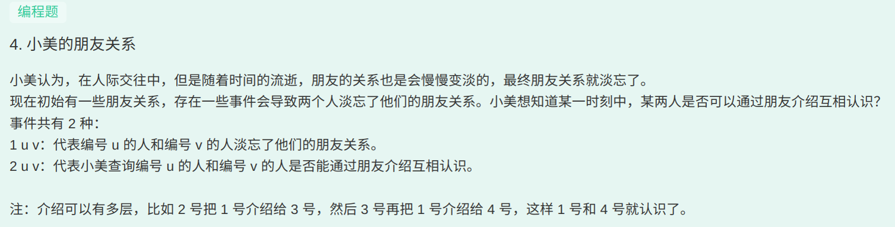
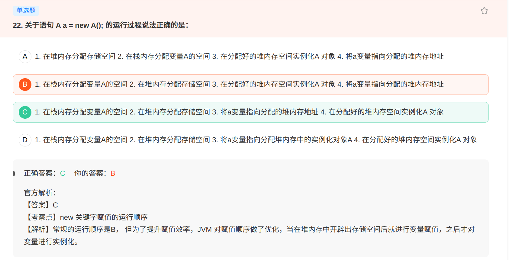

# 编程题目

## 美团2024年春招第一场笔试【技术】

### 小美和朋友的关系【trie路径压缩】



```c
#include <iostream>
#include <vector>
#include <set>
#include <map>

using namespace std;

map<int, int> fa;

int find(int x){// 路径压缩
    while(fa[x] != x) x = fa[x] = fa[fa[x]];
    return x;
}

void union_set(int x, int y) {
    int fx = find(x);
    int fy = find(y);
    fa[fy] = fx;
}

int main() {
    int n, m, q;
    cin >> n >> m >> q;

    set<pair<int, int>> edges;
    for (int i = 0; i < m; ++i) {
        int u, v;
        cin >> u >> v;
        edges.insert({u, v});
        fa[u] = u;
        fa[v] = v;
    }

    vector<tuple<int, int, int>> ops(q);
    for (int i = 0; i < q; ++i) {
        int op, u, v;
        cin >> op >> u >> v;
        if (op == 1) {
            if(edges.find({u, v}) != edges.end()) edges.erase({u, v});
            else if(edges.find({v, u}) != edges.end()) edges.erase({v, u});
            else continue;
        }
        ops[i] = {op, u, v};
    }

    // 逆向构图
    for (auto& [u, v] : edges) {
        union_set(u, v);
    }

    vector<string> ans;
    // 逆向遍历
    for (int i = q - 1; i >= 0; --i) {
        auto [op, u, v] = ops[i];
        if (op == 2) {
            if(!fa[u]) fa[u] = u;
            if(!fa[v]) fa[v] = v;
            ans.push_back(find(u) == find(v) ? "Yes" : "No");
        }
        else {
            union_set(u, v);
        }
    }

    for (auto iter = ans.rbegin(); iter != ans.rend(); ++iter) {
        cout << *iter << endl;
    }

    return 0;
}

```

不超时得路径压缩和

```
if(!fa[u]) fa[u] = u;
if(!fa[v]) fa[v] = v;
```

因为数据量很大，所以需要路径压缩，降低时限。所以需要初始化 f [ i ] = i f[i] = if[i]=i。
但是，不能按照并查集模板中 init() 操作一样，从 1 11 到 1 e 9 1e91e9 循环 f [ i ] = i f[i] = if[i]=i。只有当出现的结点，我们才需要 f [ i ] = i f[i] = if[i]=i，所以不用全部赋值，会超时！

## 美团实习笔试

### 树染色【树dp】

> ## **题目内容**
>
> 小美拿到了一棵树，每个节点有一个权值。初始每个节点都是白色。
>
> 小美有若干次操作，每次操作可以选择两个相邻的节点，如果它们都是白色且权值的乘积是完全平方数，小美就可以把这两个节点同时染红。
>
> 小美想知道，自己最多可以染红多少个节点?
>
> ## **输入描述**
>
> 第一行输入一个正整数n，代表节点的数量。
>
> 第二行输入n个正整数a_i，代表每个节点的权值。
>
> 接下来的n-1行，每行输入两个正整教u,v，代表节点u和节点v有一条边连接

[贪心解](https://blog.csdn.net/m0_64263546/article/details/133049079)

[树dp](https://zhuanlan.zhihu.com/p/649652679)

模版

```c
#include <bits/stdc++.h>
using namespace std;
const int N = 6010;
int n;
int w[N];
int h[N], e[N], ne[N], idx;
bool st[N];
int f[N][2];
void add(int a, int b) {
	e[idx] = b, ne[idx] = h[a], h[a] = idx++;
}

void dfs(int u) {
	f[u][1] = w[u];
	for (int i = h[u]; ~i; i = ne[i]) {
		int j = e[i];
		dfs(j);
		f[u][0] += max(f[j][0], f[j][1]);
		f[u][1] += f[j][0];
	}
}

int main()
{
	cin>>n;
	for (int i = 1; i <= n; i++) cin>>w[i];
	memset(h, -1, sizeof h);
	for (int i = 0; i < n - 1; i++) {
		int a, b; cin>>a>>b;
		add(b, a); st[a] = true;
	}
	int root = 1;
	while (st[root]) root++;
	dfs(root);
	cout<<max(f[root][0], f[root][1])<<endl;
	return 0;
}
```


### [交易逆序对的总数 【归并】](https://leetcode.cn/problems/shu-zu-zhong-de-ni-xu-dui-lcof/)

> 在股票交易中，如果前一天的股价高于后一天的股价，则可以认为存在一个「交易逆序对」。请设计一个程序，输入一段时间内的股票交易记录 `record`，返回其中存在的「交易逆序对」总数。
>
> 
>
> **示例 1:**
>
> ```
> 输入：record = [9, 7, 5, 4, 6]
> 输出：8
> 解释：交易中的逆序对为 (9, 7), (9, 5), (9, 4), (9, 6), (7, 5), (7, 4), (7, 6), (5, 4)。
> ```
>
> 
>
> **限制：**
>
> ```
> 0 <= record.length <= 50000
> ```

```c
class Solution {
public:
    vector<int> temp = vector<int>(60000,0);
    vector<int> a;
    int merge_sort(int l,int r)
    {
        if(l >= r) return 0;
        int mid = (l+r)/2;
        int i = l,j = mid+1,pos=0;
        int cnt = merge_sort(l,mid) + merge_sort(mid+1,r);
        
        while(i<=mid&&j<=r)
        {
            if(a[i]<=a[j]) temp[pos++] = a[i++];
            else
            {
                temp[pos++] = a[j++];
                cnt += mid - i +1;
            } 
            
        }
        while(i<=mid)temp[pos++] = a[i++];
        while(j<=r)temp[pos++] = a[j++];
        for(int i = l,j=0;i<=r;i++,j++) a[i] = temp[j];
        return cnt;
    }
    int reversePairs(vector<int>& record) {
        a = record;
        return merge_sort(0,record.size()-1);
        for(auto x:a)
        cout << x << " ";
        return 0;
    }
};
```


### 树的乘积为平方树


dfs求2的次方的个数？

## 柠檬

### 链表两两交换


### 链表排序

### 

### 动态规划


```c++
#include <functional>
#include <iostream>
#include <vector>
#include "queue"
#include "algorithm"
using namespace std;
int main1() {
    int n;
    cin >> n;
    typedef pair<int,int> PII;
    vector<PII> v;
    vector<bool> flag(1e9);
    int res = 0;

    while (n--) { // 注意 while 处理多个 case
        PII t;
        cin >> t.second >> t.first;
        v.push_back(t);
    }
    sort(v.begin(),v.end());
    while(!v.empty())
    {
        PII t = v.back();
        v.pop_back();
        int prefit = t.first;
        int dead = t.second;
        //cout << t.first <<t.second <<endl;
        while(dead>=1)
        {
            if(!flag[dead]){
                flag[dead] = true;
                res+=prefit;
                break;
            }
            dead--;
        }
    }
    cout << res;
}
struct  myless{
    public:
        bool operator() (const int& lhs, const int& rhs) const{
            return lhs > rhs;
        }
};

int main() {
    int n;
    cin >> n;
    typedef pair<int,int> PII;
    vector<PII> v;
    vector<bool> flag(1e9);
    priority_queue<int,vector<int>,myless> pres;
    int res = 0;
    int last = 0;
    int time=0;
    while (n--) { // 注意 while 处理多个 case
        PII t;
        cin >> t.first >> t.second;
        v.push_back(t);
    }
    sort(v.begin(),v.end());
    for(auto t:v)
    {
        int prefit = t.first;
        int dead = t.second;
        
        time+=t.first - last;
        last = t.first;
        
        
        if(time)
        {
            res+=t.second;
            time--;
        } 
        else if(t.second>pres.top()){
            res+=t.second;
            res-=pres.top();
            pres.pop();
        }
        pres.push(t.second);
        cout << t.first << " "<<t.second<< " " << res<< " "<< time << " "<< pres.top() <<endl;
    }
    cout << res;
}
// 64 位输出请用 printf("%lld")
```

```
9
3 7
3 10
4 10
4 16
4 17
5 50
6 50
6 50
7 100
10+16+17+200+50
```

## 深信服

### 正则表达式

### 图减金币一次穿墙机会


```

```


### 任意状态汉诺塔


```c
#include <functional>
#include <iostream>
#include <vector>
#include "queue"
#include "algorithm"
using namespace std;

int hal(int n)
{
    if(n==1) return 1;
    return 2*hal(n-1)+1;
}

int main() {
    int x=186;
    vector<int> bita;
    vector<int> bitb;
    //cin>>x;
    for(int i=0;i<8;i++)
    {
        if(x%2) bitb.push_back(8-i);
        else bita.push_back(8-i);
        x>>=1;
    }
    int res=0;
    int last = 0;
    vector<int> nums; 
    if(bita.front()==8) nums = bitb;
    else nums = bita;

    sort(nums.begin(),nums.end());
    for(auto a:nums) 
    {
        cout <<"a:"<< a <<endl;
        if(a!=last+1)
        {
            if(last>0) res+=hal(last);
            cout << res <<endl;
            res+=hal(a-1);
            cout << res <<endl;
        } 
        last=a;
    }
    res += hal(last);
    cout << res <<endl;
    res += hal(8-last);
    cout << res <<endl;
    cout <<((1 +hal(2) +hal(3) )+ hal(5) + 1) + 1 +hal(7)<<endl;
    return 0;
}

// 64 位输出请用 printf("%lld")

//186
//A 862
//B 75431

```

难

## 小红书24秋后端

### 【15.背包】

小红的分享日常

小红很喜欢前往小红书分享她的日常生活。已知她生活中有�*i*个事件，分享第�*i*个事件需要她花费��*t**i*的时间和ℎ�*h**i*的精力来编辑文章，并能获得��*a**i*的快乐值。
小红想知道，在总花费时间不超过�*T*且总花费精力不超过�*H*的前提下，小红最多可以获得多少快乐值？

```
#include <iostream>
#include <vector>
#include <algorithm>
using namespace std;
int T,H,N;

int main() {
    cin >> N;
    cin >> T >> H;
    vector<vector<long long>> f(T+1,vector<long long>(H+1,0));
    while (N--) { // 注意 while 处理多个 case
        long long t,h,a;
        cin >> t >> h >> a;
        for(int i=T;i>=t;i--)
        {
            for(int j=H;j>=h;j--)
            {
                f[i][j] = max(f[i][j],f[i-t][j-h]+a);
            }
        }
        
    }
    cout << f[T][H] <<endl;
}
// 64 位输出请用 printf("%lld")
```


# 网络编程

## TCP IP 网络层以及对应的osi模型对应的功能

> 美团2024年春招第一场笔试【技术】

> 
>
> ChatGPT
>
> TCP/IP模型和OSI模型是两种不同的网络协议栈模型，它们用于描述网络通信过程中的不同层级和功能。以下是TCP/IP模型的网络层及其在OSI模型中的对应层以及各层的功能：
>
> ### TCP/IP 模型
>
> TCP/IP模型分为四层：
>
> 1. **网络接口层（Link Layer）**
> 2. **网络层（Internet Layer）**
> 3. **传输层（Transport Layer）**
> 4. **应用层（Application Layer）**
>
> #### 网络层（Internet Layer）
>
> - 功能
>
>   ：
>
>   - 路由选择：确定数据从源到目的地的最佳路径。
>   - 数据报传送：传输数据包，并处理数据包的分片和重组。
>   - 地址指定：使用IP地址标识网络上的设备。
>   - 协议：主要协议是IP（Internet Protocol），包括IPv4和IPv6。
>
> ### OSI 模型
>
> OSI模型分为七层：
>
> 1. **物理层（Physical Layer）**
> 2. **数据链路层（Data Link Layer）**
> 3. **网络层（Network Layer）**
> 4. **传输层（Transport Layer）**
> 5. **会话层（Session Layer）**
> 6. **表示层（Presentation Layer）**
> 7. **应用层（Application Layer）**
>
> #### 网络层（Network Layer）
>
> - 功能
>
>   ：
>
>   - 路由：决定数据包通过网络的路径。
>   - 数据包转发：传输和中继数据包。
>   - 逻辑地址：分配和管理网络中的IP地址。
>   - 分片和重组：将大的数据包分成小片以适应传输链路，并在目的地重组。
>
> ### 对应关系
>
> 在TCP/IP模型和OSI模型中，网络层的功能大致对应如下：
>
> - TCP/IP 网络层（Internet Layer）
>   - **OSI 网络层（Network Layer）**
>
> 具体对应关系和功能总结如下：
>
> - **路由选择**：两者都负责确定数据包从源到目的地的最佳路径。
> - **数据报传送**：两者都处理数据包的分片和重组。
> - **地址指定**：两者都使用IP地址来标识网络设备。
> - **协议**：TCP/IP网络层主要使用IP协议（IPv4和IPv6），而OSI网络层包括更多协议，如IP、ICMP等。
>
> 通过以上对应关系和功能描述，可以更好地理解TCP/IP模型和OSI模型中网络层的角色和功能。

## 传输层功能

> ChatGPT
>
> 传输层在网络协议栈中起着至关重要的作用，无论是在TCP/IP模型还是在OSI模型中。传输层的主要功能包括端到端的通信控制、数据传输的完整性、流量控制和错误检测。以下是传输层在这两个模型中的具体功能：
>
> ### TCP/IP 模型的传输层
>
> 在TCP/IP模型中，传输层（Transport Layer）位于网络层之上，应用层之下。
>
> #### 功能：
>
> 1. **端到端通信**：
>    - 传输层提供应用进程之间的逻辑通信通道，使数据可以从一个进程传输到另一个进程。
> 2. **数据传输的可靠性**：
>    - 传输层提供可靠的数据传输服务，确保数据包按照正确的顺序到达目的地并且无差错。TCP（传输控制协议）是提供这种服务的主要协议。
> 3. **流量控制**：
>    - 传输层管理数据流量，以防止发送方的数据传输速率超过接收方的处理能力。TCP使用滑动窗口机制实现流量控制。
> 4. **错误检测和纠正**：
>    - 传输层实现数据传输的错误检测和纠正，通过校验和等机制来确保数据的完整性。TCP提供了错误检测和自动重传请求（ARQ）机制。
> 5. **多路复用和解复用**：
>    - 传输层支持多个应用进程同时使用网络服务，通过端口号区分不同的应用数据流。TCP和UDP（用户数据报协议）都实现了多路复用和解复用。
>
> #### 主要协议：
>
> - TCP（Transmission Control Protocol）
>
>   ：
>
>   - 提供可靠、面向连接的服务。
>   - 实现数据分段、流量控制、错误检测、重传机制等。
>
> - UDP（User Datagram Protocol）
>
>   ：
>
>   - 提供不可靠、无连接的服务。
>   - 适用于对传输延迟敏感但对可靠性要求较低的应用，如实时音视频传输。
>
> ### OSI 模型的传输层
>
> 在OSI模型中，传输层（Transport Layer）是第4层，位于网络层之上，会话层之下。
>
> #### 功能：
>
> 1. **可靠数据传输**：
>    - 提供端到端的可靠数据传输服务，确保数据无差错、无重复、按序到达。
> 2. **连接管理**：
>    - 建立、维护和终止传输连接。OSI传输层通过连接建立、数据传输和连接释放三个阶段来管理通信。
> 3. **流量控制和拥塞控制**：
>    - 管理发送方和接收方之间的数据流量，避免网络拥塞和数据丢失。OSI传输层使用窗口机制和速率控制技术。
> 4. **错误检测与恢复**：
>    - 提供数据传输的错误检测和恢复功能，确保数据的完整性和准确性。
> 5. **服务质量**：
>    - 提供不同等级的服务质量（QoS），满足不同应用的需求，如低延迟、高可靠性等。
> 6. **多路复用和解复用**：
>    - 支持多个应用进程同时使用网络服务，通过端口或服务访问点（SAP）区分不同的应用数据流。
>
> #### 主要协议：
>
> - TCP（Transmission Control Protocol）
>
>   ：
>
>   - 类似于TCP/IP模型中的TCP协议。
>
> - UDP（User Datagram Protocol）
>
>   ：
>
>   - 类似于TCP/IP模型中的UDP协议。
>
> ### 总结
>
> 传输层的核心功能在TCP/IP模型和OSI模型中基本一致，主要包括：
>
> - 提供端到端的可靠数据传输
> - 管理流量和拥塞控制
> - 进行错误检测和纠正
> - 支持多路复用和解复用
> - 管理连接的建立和释放
>
> 这些功能确保了网络通信的稳定性和可靠性，为应用层提供高质量的数据传输服务。
>
> 

## TCP握手


## TCP挥手

> 小红书24秋后端


## HTTP请求行包括


## SMTP邮件


## DNS使用哪种协议


### 

# 算法

## 时间复杂度为On的排序算法

> 美团2024年春招第一场笔试【技术】

> 
>
> ChatGPT
>
> 在计算机科学中，实现线性时间复杂度 O(n)O(n)O(n) 的排序算法是一个挑战，因为常见的比较排序算法（如快速排序、归并排序、堆排序）通常有最佳的时间复杂度 O(nlog⁡n)O(n \log n)O(nlogn)。然而，有一些特殊情况下可以达到 O(n)O(n)O(n) 时间复杂度的排序算法。以下是一些线性时间复杂度的排序算法，它们依赖于特定的数据特性：
>
> ### 1. 计数排序 (Counting Sort)
>
> 计数排序适用于整数排序，其范围已知且不大的情况。它通过计数每个整数出现的次数，然后按计数的顺序输出排序结果。
>
> **步骤：**
>
> 1. 找出数组中的最大值和最小值，计算范围。
> 2. 创建一个计数数组，记录每个整数出现的次数。
> 3. 遍历原数组，填充计数数组。
> 4. 根据计数数组重建排序后的数组。
>
> **时间复杂度：** O(n+k)O(n + k)O(n+k)，其中 nnn 是输入数组的大小，kkk 是数值范围。
>
> ```
> cpp复制代码void countingSort(int arr[], int n, int maxVal) {
>     int* count = new int[maxVal + 1]();
>     int* output = new int[n];
> 
>     // 计数每个元素出现的次数
>     for (int i = 0; i < n; ++i) {
>         count[arr[i]]++;
>     }
> 
>     // 累加计数
>     for (int i = 1; i <= maxVal; ++i) {
>         count[i] += count[i - 1];
>     }
> 
>     // 构建输出数组
>     for (int i = n - 1; i >= 0; --i) {
>         output[count[arr[i]] - 1] = arr[i];
>         count[arr[i]]--;
>     }
> 
>     // 复制输出数组到原数组
>     for (int i = 0; i < n; ++i) {
>         arr[i] = output[i];
>     }
> 
>     delete[] count;
>     delete[] output;
> }
> ```
>
> ### 2. 基数排序 (Radix Sort)
>
> 基数排序适用于整数或字符串排序，通过逐位比较和排序实现，通常结合计数排序来处理每个位。
>
> **步骤：**
>
> 1. 从最低有效位（LSD）开始，对每个位进行计数排序。
> 2. 重复步骤1，直到最高有效位（MSD）。
>
> **时间复杂度：** O(d(n+k))O(d(n + k))O(d(n+k))，其中 ddd 是位数，nnn 是输入数组大小，kkk 是基数（如10）。
>
> ```
> cpp复制代码void countingSortForRadix(int arr[], int n, int exp) {
>     int* output = new int[n];
>     int count[10] = {0};
> 
>     // 计数每个位出现的次数
>     for (int i = 0; i < n; ++i) {
>         count[(arr[i] / exp) % 10]++;
>     }
> 
>     // 累加计数
>     for (int i = 1; i < 10; ++i) {
>         count[i] += count[i - 1];
>     }
> 
>     // 构建输出数组
>     for (int i = n - 1; i >= 0; --i) {
>         output[count[(arr[i] / exp) % 10] - 1] = arr[i];
>         count[(arr[i] / exp) % 10]--;
>     }
> 
>     // 复制输出数组到原数组
>     for (int i = 0; i < n; ++i) {
>         arr[i] = output[i];
>     }
> 
>     delete[] output;
> }
> 
> void radixSort(int arr[], int n) {
>     // 找到最大数以决定位数
>     int maxVal = *std::max_element(arr, arr + n);
> 
>     // 按位排序
>     for (int exp = 1; maxVal / exp > 0; exp *= 10) {
>         countingSortForRadix(arr, n, exp);
>     }
> }
> ```
>
> ### 3. 桶排序 (Bucket Sort)
>
> 桶排序适用于均匀分布的浮点数或整数，通过将数据分配到固定数量的桶中，每个桶内部使用其他排序算法（通常是插入排序）进行排序。
>
> **步骤：**
>
> 1. 创建若干桶，每个桶存储一定范围内的元素。
> 2. 将输入数组中的元素分配到对应的桶中。
> 3. 对每个桶内部进行排序。
> 4. 合并所有桶中的元素得到排序后的数组。
>
> **时间复杂度：** 平均情况下 O(n+k)O(n + k)O(n+k)，其中 nnn 是输入数组大小，kkk 是桶的数量。
>
> ```
> cpp复制代码#include <vector>
> #include <algorithm>
> 
> void bucketSort(float arr[], int n) {
>     // 创建桶
>     std::vector<float> buckets[n];
> 
>     // 分配元素到桶中
>     for (int i = 0; i < n; ++i) {
>         int index = n * arr[i];
>         buckets[index].push_back(arr[i]);
>     }
> 
>     // 对每个桶排序
>     for (int i = 0; i < n; ++i) {
>         std::sort(buckets[i].begin(), buckets[i].end());
>     }
> 
>     // 合并所有桶
>     int index = 0;
>     for (int i = 0; i < n; ++i) {
>         for (size_t j = 0; j < buckets[i].size(); ++j) {
>             arr[index++] = buckets[i][j];
>         }
>     }
> }
> ```
>
> ### 总结
>
> 以上三种排序算法在特定条件下可以实现线性时间复杂度 O(n)O(n)O(n)：
>
> 1. **计数排序**：适用于已知范围内的整数排序。
> 2. **基数排序**：适用于位数固定的整数或字符串排序。
> 3. **桶排序**：适用于均匀分布的浮点数或整数排序。
>
> 这些算法在其特定应用场景中表现优异，但在一般情况下仍需要根据数据的特点选择最合适的排序算法。

## 排序是稳定的

> 快手24秋游戏开发


稳定的排序算法不会改变相等元素之间的相对顺序

### 堆排序

而在堆中进行元素交换时，没有保证相同关键字元素的相对顺序不变。


去除顶交换下沉

> 在C++中，构建堆的过程通常分为两个部分：构建最大堆或最小堆，以及调整堆（heapify）。以下是一个完整的例子，展示了如何在C++中构建最大堆并进行堆排序。
>
> ### 最大堆的构建和调整
>
> 首先，我们需要一个函数来调整堆（heapify），然后使用这个函数来构建堆（build heap）。
>
> #### `heapify` 函数
>
> `heapify` 函数用于维护堆的性质。对于最大堆，如果某个节点的子节点违反了最大堆的性质（即子节点的值大于父节点的值），则通过交换元素和递归调用来修复堆。
>
> ```c
> #include <iostream>
> #include <vector>
> 
> void heapify(std::vector<int>& arr, int n, int i) {
>  int largest = i;  // Initialize largest as root
>  int left = 2 * i + 1;  // left = 2*i + 1
>  int right = 2 * i + 2;  // right = 2*i + 2
> 
>  // If left child is larger than root
>  if (left < n && arr[left] > arr[largest])
>      largest = left;
> 
>  // If right child is larger than largest so far
>  if (right < n && arr[right] > arr[largest])
>      largest = right;
> 
>  // If largest is not root
>  if (largest != i) {
>      std::swap(arr[i], arr[largest]);
> 
>      // Recursively heapify the affected sub-tree
>      heapify(arr, n, largest);
>  }
> }
> ```
>
> #### `buildHeap` 函数
>
> `buildHeap` 函数将数组转换为堆结构。我们从最后一个非叶子节点开始调用 `heapify` 函数，直到根节点。
>
> ```c
> void buildHeap(std::vector<int>& arr, int n) {
>  // Index of last non-leaf node
>  int startIdx = n / 2 - 1;
> 
>  // Perform reverse level order traversal from last non-leaf node and heapify each node
>  for (int i = startIdx; i >= 0; i--) {
>      heapify(arr, n, i);
>  }
> }
> ```
>
> #### 堆排序函数
>
> 在构建好堆之后，我们可以进行堆排序。堆排序的基本思想是不断将堆顶元素（最大值）与当前堆的最后一个元素交换，然后减少堆的大小并重新调整堆。
>
> ```c
> void heapSort(std::vector<int>& arr, int n) {
>  // Build heap (rearrange array)
>  buildHeap(arr, n);
> 
>  // One by one extract an element from heap
>  for (int i = n - 1; i >= 0; i--) {
>      // Move current root to end
>      std::swap(arr[0], arr[i]);
> 
>      // Call max heapify on the reduced heap
>      heapify(arr, i, 0);
>  }
> }
> ```
>
> #### 主程序
>
> 最后，我们编写一个主程序来演示堆排序的使用。
>
> ```c
> int main() {
>  std::vector<int> arr = {12, 11, 13, 5, 6, 7};
>  int n = arr.size();
> 
>  heapSort(arr, n);
> 
>  std::cout << "Sorted array is \n";
>  for (int i = 0; i < n; ++i)
>      std::cout << arr[i] << " ";
>  std::cout << std::endl;
> 
>  return 0;
> }
> ```


### 排序算法复杂度


堆排序：原地构建堆，存在数组末尾

归并:空间不止1,需要合并到新空间

快排：这两者是先后进行的，在执行完上面代码的之后再执行下面代码，又因为从第一层开始最先执行的是QuickSort(array, low, i - 1)，且在没有回调一直递下去直到最底层时候，一共走了log2(n)次（因为有log2(n)层），每次的空间复杂度是o（1），因此最大的空间复杂度也就是log2(n)了

# 数据库

## 声明参数类型声明


##  增量备份


## select


```
LEFT(str,length); 
str是要提取子字符串的字符串。length是一个正整数，指定将从左边返回的字符数。
```


## 数据库中记录存储的数据结构是什么

> 美团2024年春招第一场笔试【技术】

> ChatGPT
>
> 在数据库系统中，记录的存储通常采用多种数据结构，以优化查询、插入、删除和更新操作的效率。以下是一些常见的数据结构及其在数据库中的应用：
>
> ### 1. B树和B+树
>
> #### B树
>
> - **特点**：B树是一种自平衡的树数据结构，每个节点可以包含多个键和值，保证了数据的有序性和高效性。
> - **应用**：适用于存储索引数据，支持高效的查找、插入和删除操作。
> - **优势**：能够保持平衡，保证了操作的时间复杂度为 O(log⁡n)O(\log n)O(logn)。
>
> #### B+树
>
> - **特点**：B+树是B树的变种，所有实际数据存储在叶子节点中，内部节点只存储索引。
> - **应用**：广泛用于数据库索引结构，如MySQL的InnoDB存储引擎。
> - **优势**：叶子节点形成链表，有利于范围查询和顺序遍历。
>
> ### 2. 哈希表
>
> #### 特点
>
> - **哈希表**通过将键值对映射到特定位置，实现快速的数据存取。
> - **应用**：适用于需要快速查找操作的场景，如数据库中的哈希索引。
> - **优势**：查找、插入和删除操作的平均时间复杂度为 O(1)O(1)O(1)。
>
> ### 3. 堆文件组织
>
> #### 特点
>
> - **堆文件**是一种简单的数据存储方式，记录无特定顺序地存储在文件中。
> - **应用**：适用于插入频繁但查询不频繁的场景。
> - **优势**：插入操作非常高效。
>
> ### 4. 聚簇索引和非聚簇索引
>
> #### 聚簇索引
>
> - **特点**：数据存储和索引相结合，数据按索引排序存储。
> - **应用**：适用于查询操作多且对数据排序有要求的场景，如主键索引。
> - **优势**：查询效率高，但插入、删除和更新操作可能较慢，因为需要维护数据的有序性。
>
> #### 非聚簇索引
>
> - **特点**：索引和数据分开存储，索引指向数据的位置。
> - **应用**：适用于多种查询条件的场景，如次要索引。
> - **优势**：灵活性高，但查询需要多次查找，效率较聚簇索引略低。
>
> ### 5. 树型结构（如Trie树）
>
> #### 特点
>
> - **Trie树**是一种特殊的树结构，通常用于存储字符串集合。
> - **应用**：适用于前缀匹配查询，如自动补全、词典树。
> - **优势**：高效的前缀查询和插入操作。
>
> ### 6. LSM 树（Log-Structured Merge-Tree）
>
> #### 特点
>
> - **LSM树**通过批量写入和顺序写入优化磁盘写入操作，特别适合于写入密集型工作负载。
> - **应用**：NoSQL数据库如Cassandra、LevelDB、HBase等。
> - **优势**：写入性能高，读取性能通过分层合并优化。
>
> ### 7. 图数据结构
>
> #### 特点
>
> - **图数据结构**用于存储节点和边的信息，适合表示和查询复杂关系的数据。
> - **应用**：图数据库如Neo4j、ArangoDB、JanusGraph等。
> - **优势**：高效处理关系查询，如社交网络、推荐系统。
>
> ### 总结
>
> 不同的数据库系统根据其特定的需求和应用场景，采用不同的数据结构来存储记录。常见的数据结构包括B树和B+树、哈希表、堆文件、聚簇和非聚簇索引、Trie树、LSM树以及图数据结构。选择适合的数据结构对于提升数据库的性能和效率至关重要。
>
> 

## 乐观锁和悲观锁的区别

> 美团2024年春招第一场笔试【技术】

### 乐观锁和悲观锁

> 乐观锁的概念：
>         乐观锁：指的是在操作数据的时候非常乐观，乐观地认为别人不会同时修改数据，因此乐观锁默认是不会上锁的，只有在执行更新的时候才会去判断在此期间别人是否修改了数据，如果别人修改了数据则放弃操作，否则执行操作。
>
>         冲突比较少的时候, 使用乐观锁(没有悲观锁那样耗时的开销) 由于乐观锁的不上锁特性，所以在性能方面要比悲观锁好，比较适合用在DB的读大于写的业务场景。
>
> 悲观锁的概念：
>         悲观锁：指的是在操作数据的时候比较悲观，悲观地认为别人一定会同时修改数据，因此悲观锁在操作数据时是直接把数据上锁，直到操作完成之后才会释放锁，在上锁期间其他人不能操作数据。
>
>         冲突比较多的时候, 使用悲观锁(没有乐观锁那么多次的尝试)对于每一次数据修改都要上锁，如果在DB读取需要比较大的情况下有线程在执行数据修改操作会导致读操作全部被挂载起来，等修改线程释放了锁才能读到数据，体验极差。所以比较适合用在DB写大于读的情况。
>
> 读取频繁使用乐观锁，写入频繁使用悲观锁。

> ChatGPT
>
> 乐观锁和悲观锁是两种用于控制并发访问的机制，它们的主要区别在于对数据冲突的处理方式不同。下面详细说明两者的区别：
>
> ### 悲观锁（Pessimistic Locking）
>
> #### 特点
>
> - **锁定策略**：悲观锁假定数据在并发环境下会发生冲突，因此在读写数据之前，都会锁定数据。
> - **锁定范围**：通常包括行锁、表锁，甚至数据库级别的锁。
> - **加锁时间**：在读取数据时就加锁，直到事务结束才释放锁。
>
> #### 优点
>
> - **数据一致性高**：通过加锁保证了在并发操作下的数据一致性和完整性。
> - **适用于高冲突场景**：在高冲突的场景下，能够有效防止数据的并发修改问题。
>
> #### 缺点
>
> - **性能开销大**：由于频繁加锁、解锁，系统的性能开销较大，容易导致死锁问题。
> - **并发性低**：由于锁的存在，会导致较低的并发性能，其他事务需要等待锁释放。
>
> #### 适用场景
>
> - **高冲突场景**：数据冲突较多的场景，如银行转账系统。
> - **关键数据更新**：数据一致性要求极高的场景。
>
> #### 示例
>
> 在关系型数据库中，使用悲观锁可以通过SQL语句实现：
>
> ```
> sql复制代码-- 悲观锁示例，使用SELECT ... FOR UPDATE语句
> BEGIN;
> SELECT * FROM accounts WHERE id = 1 FOR UPDATE;
> -- 对数据进行更新操作
> UPDATE accounts SET balance = balance - 100 WHERE id = 1;
> COMMIT;
> ```
>
> ### 乐观锁（Optimistic Locking）
>
> #### 特点
>
> - **锁定策略**：乐观锁假定数据在并发环境下不会发生冲突，因此在读写数据之前不会加锁，只在提交数据时进行冲突检测。
> - **冲突检测**：通常通过版本号或时间戳来检测数据是否发生变化。
> - **加锁时间**：仅在提交数据时检测并发冲突，如果检测到冲突则回滚事务。
>
> #### 优点
>
> - **性能开销低**：因为不需要频繁加锁和解锁，系统的性能开销较低。
> - **并发性高**：允许更多的事务并发执行，提高系统的并发性能。
>
> #### 缺点
>
> - **数据一致性较低**：在高冲突场景下，可能会频繁回滚事务，导致性能下降。
> - **重试机制复杂**：事务冲突时需要进行重试，增加了实现的复杂度。
>
> #### 适用场景
>
> - **低冲突场景**：数据冲突较少的场景，如用户个人信息更新。
> - **读多写少**：读操作多于写操作的场景。
>
> #### 示例
>
> 在关系型数据库中，使用乐观锁可以通过版本号实现：
>
> ```
> sql复制代码-- 乐观锁示例，使用版本号机制
> -- 假设accounts表中有一个version列
> BEGIN;
> -- 读取数据及其版本号
> SELECT id, balance, version FROM accounts WHERE id = 1;
> -- 更新操作时，检查版本号是否一致
> UPDATE accounts SET balance = balance - 100, version = version + 1 
> WHERE id = 1 AND version = <old_version>;
> COMMIT;
> ```
>
> 如果`UPDATE`语句影响的行数为0，说明版本号不一致，事务回滚并重试。
>
> ### 总结
>
> - **悲观锁**：适用于高冲突场景，通过加锁确保数据一致性，但会影响并发性能，存在较高的性能开销和死锁风险。
> - **乐观锁**：适用于低冲突场景，通过版本号或时间戳检测并发冲突，具有较高的并发性能，但需要处理冲突重试逻辑。
>
> 选择使用哪种锁策略取决于具体应用场景的数据冲突频率和对并发性能的要求。
>
> 

### 事务回滚

仅在提交数据时检测并发冲突，如果检测到冲突则回滚事务。，事务回滚是什么意思

> 在数据库管理系统中，事务（Transaction）是指一组逻辑操作单元，这些操作要么全部成功，要么全部失败。事务具有四个主要特性，简称为ACID属性：原子性（Atomicity）、一致性（Consistency）、隔离性（Isolation）和持久性（Durability）。
>
> 当我们提到“事务回滚”时，指的是将事务中的所有操作撤销，恢复到事务开始之前的状态。这种操作通常在事务遇到错误或检测到并发冲突时进行，以确保数据的一致性和完整性。具体来说：
>
> ### 事务回滚的详细解释
>
> #### 1. 原子性（Atomicity）
>
> 事务必须是一个不可分割的工作单位，其中的所有操作要么全部完成，要么全部不完成。如果事务在进行中遇到错误或其他情况需要中止，那么已经执行的所有操作必须撤销，即回滚。
>
> #### 2. 一致性（Consistency）
>
> 事务必须使数据库从一个一致性状态转变到另一个一致性状态。回滚确保在事务失败时，数据库不会处于不一致的状态。
>
> #### 3. 隔离性（Isolation）
>
> 事务的执行是隔离的，一个事务的操作对其他事务是不可见的，直到事务提交为止。如果在提交前检测到并发冲突，回滚确保不会将未完成的、不一致的数据暴露给其他事务。
>
> #### 4. 持久性（Durability）
>
> 一旦事务提交，修改就会永久保存到数据库中，不会因为系统崩溃或其他原因丢失。回滚操作在事务提交前进行，不影响已经提交的持久化数据。
>
> ### 事务回滚的工作机制
>
> 1. **事务开始**：事务开始时，数据库系统记录当前状态，通常使用日志来记录事务的各项操作。
> 2. **操作执行**：事务执行过程中，所有操作的修改不会立即写入持久存储，而是暂时保存在缓存中。
> 3. **冲突检测**：在事务提交前，系统会检测是否存在并发冲突（如版本号不一致）。
> 4. **回滚操作**：如果检测到冲突或遇到其他错误，系统将利用日志中记录的原始状态信息，撤销事务中已执行的操作，将数据恢复到事务开始前的状态。
> 5. **事务结束**：如果事务没有遇到冲突且成功执行所有操作，则进行提交操作，将所有修改永久写入数据库。
>
> ### 事务回滚的示例
>
> 假设有两个用户同时尝试更新同一个银行账户的余额：
>
> ```
> sql复制代码-- 事务1
> BEGIN;
> SELECT balance FROM accounts WHERE id = 1;
> -- balance = 100
> UPDATE accounts SET balance = balance - 50 WHERE id = 1;
> -- 修改还未提交
> 
> -- 事务2
> BEGIN;
> SELECT balance FROM accounts WHERE id = 1;
> -- balance = 100
> UPDATE accounts SET balance = balance - 30 WHERE id = 1;
> -- 修改还未提交
> 
> -- 事务1提交
> COMMIT;
> -- 提交成功，账户余额更新为50
> 
> -- 事务2提交
> -- 检测到并发冲突，因为事务2读取的balance是旧值100而非最新值50
> -- 事务2回滚，撤销更新操作，账户余额恢复到提交前的状态50
> ROLLBACK;
> ```
>
> 在上面的示例中，事务1和事务2都试图更新同一个账户的余额。由于事务1先提交成功，事务2在提交时检测到余额已被事务1修改过，因此事务2回滚，撤销其对余额的更新操作。
>
> ### 总结
>
> 事务回滚是确保数据库一致性和完整性的重要机制。它通过撤销事务中的操作，将数据恢复到事务开始前的状态，以应对错误和并发冲突。回滚操作在数据库系统中是自动执行的，用户无需手动干预。
>
> 
>
> 

###  FOR UPDATE;加不加的区别

> 在SQL中，`FOR UPDATE` 子句用于在执行查询时锁定所选记录，防止其他事务修改这些记录。它通常与`SELECT`语句一起使用，以确保在事务提交之前，这些记录不会被其他事务更改。这种锁定机制对于实现悲观锁非常重要。
>
> ### `FOR UPDATE` 加与不加的区别
>
> #### 不加 `FOR UPDATE`
>
> ```
> sql
> 复制代码
> SELECT * FROM accounts WHERE id = 1;
> ```
>
> - **读操作**：直接读取数据，不会对数据进行任何锁定。
> - **并发性**：多个事务可以同时读取相同的数据，不会相互阻塞。
> - **数据一致性**：不能保证在读取数据到更新数据之间，数据不会被其他事务修改。可能会导致“不可重复读”或“幻读”等并发问题。
>
> #### 加 `FOR UPDATE`
>
> ```
> sql
> 复制代码
> SELECT * FROM accounts WHERE id = 1 FOR UPDATE;
> ```
>
> - **读操作**：读取数据并加锁（通常是行锁）。
> - **并发性**：其他事务在试图读取相同的数据时，如果也使用`FOR UPDATE`，将被阻塞，直到当前事务释放锁。
> - **数据一致性**：保证在读取到更新数据之间，数据不会被其他事务修改，避免了“不可重复读”和“幻读”问题。
>
> ### 具体应用场景与示例
>
> #### 不加 `FOR UPDATE` 的场景
>
> 1. **只读操作**：当你只需要读取数据，不进行任何修改时，不需要加锁。例如，生成报表或统计数据。
> 2. **低并发要求**：在不需要严格控制并发的应用中，可以避免加锁带来的性能开销。
>
> ```
> sql复制代码-- 只读查询
> SELECT balance FROM accounts WHERE id = 1;
> -- 可以多个事务并发执行，无锁定开销
> ```
>
> #### 加 `FOR UPDATE` 的场景
>
> 1. **事务完整性**：需要在读取后进行更新操作，并确保数据在读取到更新之间不被其他事务修改时。
> 2. **高并发控制**：在多用户高并发的环境中，需要严格控制数据一致性。
>
> ```
> sql复制代码-- 事务开始
> BEGIN;
> 
> -- 读取数据并加锁
> SELECT balance FROM accounts WHERE id = 1 FOR UPDATE;
> 
> -- 执行更新操作
> UPDATE accounts SET balance = balance - 50 WHERE id = 1;
> 
> -- 提交事务
> COMMIT;
> ```
>
> ### 例子解释
>
> 假设有两个事务，事务A和事务B，都尝试读取和更新同一账户的余额。
>
> #### 不加 `FOR UPDATE` 的情况
>
> ```
> sql复制代码-- 事务A
> BEGIN;
> SELECT balance FROM accounts WHERE id = 1;
> -- 读取到的balance为100
> -- 假设此时事务B也开始执行
> 
> -- 事务B
> BEGIN;
> SELECT balance FROM accounts WHERE id = 1;
> -- 读取到的balance也是100
> UPDATE accounts SET balance = balance - 30 WHERE id = 1;
> COMMIT;
> 
> -- 事务A继续
> UPDATE accounts SET balance = balance - 50 WHERE id = 1;
> COMMIT;
> -- 最终余额为50，但事务A和事务B都基于初始余额100进行了更新，导致数据不一致。
> ```
>
> #### 加 `FOR UPDATE` 的情况
>
> ```
> sql复制代码-- 事务A
> BEGIN;
> SELECT balance FROM accounts WHERE id = 1 FOR UPDATE;
> -- 读取到的balance为100，锁定记录
> 
> -- 事务B
> BEGIN;
> SELECT balance FROM accounts WHERE id = 1 FOR UPDATE;
> -- 此时事务A已经锁定记录，事务B将被阻塞，直到事务A完成
> 
> -- 事务A继续
> UPDATE accounts SET balance = balance - 50 WHERE id = 1;
> COMMIT;
> -- 事务A提交，释放锁
> 
> -- 事务B继续
> SELECT balance FROM accounts WHERE id = 1 FOR UPDATE;
> -- 读取到的balance为50
> UPDATE accounts SET balance = balance - 30 WHERE id = 1;
> COMMIT;
> -- 最终余额为20，数据一致。
> ```
>
> ### 总结
>
> - **不加 `FOR UPDATE`**：适用于只读操作或低并发要求的场景，不会加锁，允许多个事务并发读取数据，但不能保证数据一致性。
> - **加 `FOR UPDATE`**：适用于需要确保数据一致性的场景，通过加锁防止数据在读取到更新之间被其他事务修改，适用于高并发环境，确保事务的完整性和数据的一致性。
>
> 根据具体应用场景的需求选择是否使用`FOR UPDATE`，以平衡性能和数据一致性。

# 数据结构

## 哈希算法

[acwing](https://blog.csdn.net/weixin_50909982/article/details/115186333)

### 原理

> Hash，一般翻译做散列、杂凑，或音译为哈希，是把任意长度的[输入](https://baike.baidu.com/item/输入/5481954?fromModule=lemma_inlink)（又叫做预映射pre-image）通过散列算法变换成固定长度的[输出](https://baike.baidu.com/item/输出/11056752?fromModule=lemma_inlink)，该输出就是散列值。这种转换是一种[压缩映射](https://baike.baidu.com/item/压缩映射/5114126?fromModule=lemma_inlink)，也就是，散列值的空间通常远小于输入的空间，不同的输入可能会散列成相同的输出，所以不可能从散列值来确定唯一的输入值。简单的说就是一种将任意长度的消息压缩到某一固定长度的[消息摘要](https://baike.baidu.com/item/消息摘要/4547744?fromModule=lemma_inlink)的函数。应该不可逆

> ### [ 哈希算法有哪几种](http://www.baidu.com/link?url=gKy6eug0oyVn1ehYHViBKoJdEi2II-iwFg4p6smcysR_wndj_naJpDI9mboeI8eUNUIBcxwkdLYAbDGTbJ03kQ9qkAYi2IHEnn3DZJovbAWfPAfhCAYftXrl3Rvey6xrqEvjD-_-iU2p_xIk0lKoys-j8jxMztaDl_KtrqEcFOHsFr1tjzgTKbR6OTmPCqd6a7LoWsSn1Id8KSQr1TRfvHjhks15MWzdiEksfxIXnevz9PA1d2Q5vGfg4G5GY0d5FajTkP_SJd3OGFgq5h3nxlARbZrGdMUObkw3K0sjw510Xup9gQEn1mnI0MVxYS0xMgDJtGx5tC-a6pPkSTkrQIicjSkC0w642g95fFmNLVYq5gtz9AvBWZjRuLlmxtAy-emumvA6Z5IYj9bVWHMwbOBvrE9XJ6albmWmw7V-ezQQ4dz2cOT3QV2IVrwG7-i9r4LVH9qXH3pvDVeG4Xz3FzLMANp7J5ssm3fMUdUg6QSH09l0Fw64-nZ6T2UqV10KxrdaD_HfeiIrNz3ds2jt8a)
>
> 哈希算法是一类用于数据校验和快速查找的算法，它们通过将任意长度的数据（如文本或数字）转换为固定长度的哈希值（通常是十六进制数）来工作。根据不同的应用场景和需求，哈希算法可以分为多种类型，包括但不限于以下几种：12
>
> 1. **[MD5](https://www.baidu.com/s?wd=MD5&usm=1&ie=utf-8&rsv_pq=f1012d8800097448&oq=哈希算法有哪几种&rsv_t=2af6d%2FMJTnbD0LBm3GqIm7MDJKNyy1Gyfy4gPwFGR2c6hHBllhcn%2BRQH%2FUU&sa=re_dqa_zy&icon=1)**：一种输出长度为128位的哈希算法，广泛用于文件校验、密码存储等场景，但已经被证明存在安全漏洞，不适合用于敏感数据的加密。
> 2. [SHA-1](https://www.baidu.com/s?wd=SHA-1&usm=1&ie=utf-8&rsv_pq=f1012d8800097448&oq=哈希算法有哪几种&rsv_t=2af6d%2FMJTnbD0LBm3GqIm7MDJKNyy1Gyfy4gPwFGR2c6hHBllhcn%2BRQH%2FUU&sa=re_dqa_zy&icon=1)：输出长度为160位的哈希算法，曾经是互联网安全标准之一，但也被证明存在安全漏洞，不适合用于敏感数据的加密。
> 3. [SHA-2](https://www.baidu.com/s?wd=SHA-2&usm=1&ie=utf-8&rsv_pq=f1012d8800097448&oq=哈希算法有哪几种&rsv_t=e8460VA4iYVxL4FD9FtVE3FnjvELpLTgaTTeXoC4kWhbcmiuzjqQRTjzHis&sa=re_dqa_zy&icon=1)：输出长度为224位、256位、384位或者512位的哈希算法，是目前最广泛使用的哈希算法之一，适合用于敏感数据的加密。
> 4. [SHA-3](https://www.baidu.com/s?wd=SHA-3&usm=1&ie=utf-8&rsv_pq=f1012d8800097448&oq=哈希算法有哪几种&rsv_t=e8460VA4iYVxL4FD9FtVE3FnjvELpLTgaTTeXoC4kWhbcmiuzjqQRTjzHis&sa=re_dqa_zy&icon=1)：输出长度为224位、256位、384位或者512位的哈希算法，是最新的哈希算法标准之一，适合用于敏感数据的加密。
> 5. [BLAKE2](https://www.baidu.com/s?wd=BLAKE2&usm=1&ie=utf-8&rsv_pq=f1012d8800097448&oq=哈希算法有哪几种&rsv_t=e8460VA4iYVxL4FD9FtVE3FnjvELpLTgaTTeXoC4kWhbcmiuzjqQRTjzHis&sa=re_dqa_zy&icon=1)：输出长度可变（最大为512位）的哈希算法，基于BLAKE和SHA-3设计，具有高速和高安全性的特点，适合用于敏感数据的加密。
> 6. [RIPEMD](https://www.baidu.com/s?wd=RIPEMD&usm=1&ie=utf-8&rsv_pq=f1012d8800097448&oq=哈希算法有哪几种&rsv_t=232eJmbQCQZ73db6rSmvTNltLIatlg%2Fh27SDBOXWJhU0%2FVcNUBLQIyU7kCs&sa=re_dqa_zy&icon=1)：输出长度为128位、160位、256位或者320位的哈希算法，基于MD4和MD5设计，具有较高的碰撞抵抗性，适合用于敏感数据的加密

## 小根堆


插入到最后然后往根节点冒泡

## 数组链表和二叉树结构之间的区别

> [美团2024年春招第一场笔试【技术】](https://blog.csdn.net/weixin_62517188/article/details/136777830?spm=1001.2014.3001.5502)

> ChatGPT
>
> 数组、链表和二叉树是三种常见的数据结构，它们各自具有不同的特点和适用场景。以下是它们之间的主要区别：
>
> ### 1. 数组（Array）
>
> #### 特点
>
> - **连续内存**：数组在内存中占据连续的存储空间。
> - **固定大小**：数组的大小在创建时就确定了，不能动态调整大小。
> - **索引访问**：通过索引可以快速访问任意元素，时间复杂度为 O(1)O(1)O(1)。
> - **插入和删除**：插入和删除操作效率较低，平均时间复杂度为 O(n)O(n)O(n)（因为需要移动元素）。
>
> #### 优点
>
> - 直接索引访问效率高，适合频繁读取操作。
> - 简单易用，内存管理相对容易。
>
> #### 缺点
>
> - 大小固定，无法动态扩展。
> - 插入和删除操作效率较低。
>
> #### 适用场景
>
> - 需要快速访问任意元素的场景。
> - 数据大小固定，变化不频繁的场景。
>
> ### 2. 链表（Linked List）
>
> #### 特点
>
> - **非连续内存**：链表在内存中不需要连续存储，每个节点通过指针指向下一个节点。
> - **动态大小**：链表的大小可以动态调整，可以随时增加或减少节点。
> - **顺序访问**：需要顺序访问元素，平均访问时间复杂度为 O(n)O(n)O(n)。
> - **插入和删除**：插入和删除操作效率较高，时间复杂度为 O(1)O(1)O(1)（假设已知要操作的节点位置）。
>
> #### 优点
>
> - 动态调整大小，内存利用率高。
> - 插入和删除操作效率高，适合频繁进行插入和删除操作的场景。
>
> #### 缺点
>
> - 顺序访问效率低，查找元素需要遍历链表。
> - 额外的内存开销（存储指针）。
>
> #### 适用场景
>
> - 数据量不固定，频繁插入和删除操作的场景。
> - 需要动态调整数据结构大小的场景。
>
> ### 3. 二叉树（Binary Tree）
>
> #### 特点
>
> - **层次结构**：二叉树是一种层次结构的数据结构，每个节点最多有两个子节点（左子节点和右子节点）。
> - **非连续内存**：二叉树的节点在内存中不需要连续存储。
> - **动态大小**：可以随时增加或删除节点，结构动态调整。
> - **多种形式**：包括普通二叉树、二叉搜索树、平衡二叉树（如AVL树和红黑树）等。
> - **树的高度**：访问、插入和删除操作的时间复杂度与树的高度成正比，最坏情况下为 O(n)O(n)O(n)，平衡情况下为 O(log⁡n)O(\log n)O(logn)。
>
> #### 优点
>
> - 支持高效的插入、删除和查找操作（在平衡情况下）。
> - 灵活的结构，适合表示具有层次关系的数据。
>
> #### 缺点
>
> - 需要维护平衡，以确保操作的高效性（如平衡二叉树）。
> - 实现复杂度相对较高。
>
> #### 适用场景
>
> - 需要高效的动态插入、删除和查找操作的场景。
> - 表示层次结构数据（如文件系统、组织结构）的场景。
> - 需要有序数据存储和快速检索的场景（如二叉搜索树）。
>
> ### 总结
>
> - **数组**：适用于固定大小、需要快速随机访问的场景，但不适合频繁插入和删除。
> - **链表**：适用于动态大小、频繁插入和删除的场景，但随机访问效率低。
> - **二叉树**：适用于动态插入、删除和查找操作高效的场景，尤其适合表示层次结构的数据，但需要维护平衡以保证性能。
>
> 每种数据结构都有其特定的应用场景和优缺点，选择合适的数据结构取决于具体的应用需求和操作模式。
>
> 


# C++语法

## 基本数据类型大小


## STL size和capacity的区别


## STL容器结论


## 声明默认值定义不能有默认值


## string


## 析构函数


析构函数中释放对象分配的内存以避免内存泄漏是正确的，但析构函数中抛出异常是不建议的，甚至是危险的。让我们详细解释这两点。


？

## new过程



## volatile


## mutable 

> `mutable`关键字在C++中主要用于指示结构体或联合体中的某个成员变量即使在结构体是const的情况下也可以修改。
>
> 解决方案：
>
> 1. 使用`mutable`关键字修饰一个或多个成员变量，使得即使是在const成员函数中，这些变量也是可以被修改的。
>
> 例如：
>
> ```
> cppstruct S {    int x;    mutable bool y;    void f() const {        x = 1;  // 错误: 试图修改const对象        y = true;  // 正确: y是mutable的    }};
> ```
>
> 在上述代码中，`x`成员变量在const成员函数中被修改，会导致编译错误。而`y`成员变量由于被`mutable`关键字修饰，所以即使在const成员函数中也可以被修改。

锁 mutex

## 编译器优化内存对齐

> 13.
>
> 请阅读以下代码，比较fun1、fun2、fun3三个函数的Cache命中率。假设Cache总大小为2KB，每行32B，使用直接映射，函数开始执行时Cache为空。需考虑内存对齐且编译器不进行优化。
>
> ```c
> struct EnemyA{
> short typeId; //2B
> short skinId; //2B
> float hp; //4B
> };编译器优化内存对齐
> 13.
> 
> 请阅读以下代码，比较fun1、fun2、fun3三个函数的Cache命中率。假设Cache总大小为2KB，每行32B，使用直接映射，函数开始执行时Cache为空。需考虑内存对齐且编译器不进行优化。
> 
> 
> struct EnemyB{
> short typeId; //2B
> float hp; //4B
> short skinId; //2B
> 
> };
> void fun1(){
> struct EnemyA e[8][256];
> for(int i = 0;i<8;i++){
> ​    for(int j = 0;j<256;j++)
> ​    {
> ​      e[i][j].hp += 100.0f;
> ​    }
> }
> }
> void fun2(){
> 
> struct EnemyA e[8][256];
> 
> for(int j = 0;j<256;j++)
> 
> {
> 
> ​    for(int i = 0;i<8;i++)
> ​    {
> ​      e[i][j].hp += 100.0f;
> ​    }
> }
> }
> void fun3(){
> struct EnemyB e[8][256];
> for(int i = 0;i<8;i++)
> {
> ​    for(int j = 0;j<256;j++)
> ​    {
> ​      e[i][j].hp += 100.0f;
> ​    }
> }
> }
> ```
>
> A
>
> fun1 > fun3 > fun2
>
> B
>
> fun1 = fun3 > fun2
>
> C
>
> fun2 > fun1 > fun3
>
> D
>
> fun1 = fun2 > fun3

# 操作系统

### 进程安全序列


### LVM寻执最小单元4M

### 

### SHELL


### PV操作


### 段错误


### 编译和链接


### 线程安全怎么保证

> 1. 互斥锁（Mutex）：互斥锁是最常⻅的保证线程安全的⽅法之⼀、当线程要访 问共享数据时，先锁定互斥锁，其他线程要访问同⼀份数据时需要等待互斥锁被释 放。互斥锁⼀次只能被⼀个线程占有，从而避免了多个线程同时访问共享数据的问 题。 
> 2. 读写锁（ReadWrite Lock）：在⼀些场景下，多个线程只读取共享数据而不 修改它们。这种情况下，可以使⽤读写锁来提⾼性能。读写锁允许多个线程同时读取 共享数据，但在有写操作时，会阻塞其他线程的读和写操作，从而保证数据的⼀致 性。 
> 3. 原⼦操作（Atomic Operations）：原⼦操作是指能够在单个步骤中完成的操 作，不会被其他线程中断。在多线程编程中，可以使⽤原⼦操作保证共享数据的连续 性。例如，Java提供了原⼦类（如AtomicInteger、AtomicLong等）来保证整数操 作的原⼦性。 
> 4.  同步代码块（Synchronized Block）：通过使⽤synchronized关键字修饰⼀ 个代码块，可以将其变成互斥区域，即在同⼀时间只允许⼀个线程执⾏该代码块。线 程进⼊synchronized代码块时会⾃动获得锁，执⾏完代码块后会释放锁，其他线程才 能继续执⾏。这样可以保证在同⼀时间只有⼀个线程执⾏临界区（即使⽤共享数据的 代码段）。

### [select和epoll详解](https://zhuanlan.zhihu.com/p/179071801?utm_id=0)

> ### select
>
> `select` 是一种较老的 I/O 多路复用机制，几乎在所有 UNIX 系统上都可用。
>
> 1. **性能限制**：当处理大量文件描述符时，性能会显著下降。每次调用 `select` 都需要线性扫描所有的文件描述符。
> 2. **文件描述符限制**：`select` 的文件描述符数量有限制（通常为 1024），虽然可以通过修改系统参数来增加这个限制，但仍然不适合处理大规模连接。
> 3. **可移植性问题**：在不同的平台上可能会有一些细微的差别。
>
> ### epoll
>
> `epoll` 是 Linux 特有的 I/O 多路复用机制，设计用于替代 `select` 和 `poll`，在处理大量文件描述符时性能更佳。
>
> **优点**：
>
> 1. **高性能**：`epoll` 使用事件驱动机制，可以高效处理大量文件描述符。它避免了线性扫描文件描述符集，使用 O(1) 的复杂度。
> 2. **没有文件描述符限制**：`epoll` 没有像 `select` 那样的文件描述符数量限制，可以处理大规模连接。
> 3. **支持边缘触发和水平触发**：可以配置为只在有新的事件时通知，减少系统调用次数。
>
> **缺点**：
>
> 1. **仅限于 Linux**：`epoll` 仅在 Linux 系统上可用，降低了程序的可移植性。
> 2. **使用复杂**：相比 `select`，`epoll` 的使用稍微复杂一些。


# PYTHON语法


# 设计模式

### 松耦合


> 


前缀和 n加上m次选择


1/2次方


函数成员nulptr可以？


## TPLINK提面


