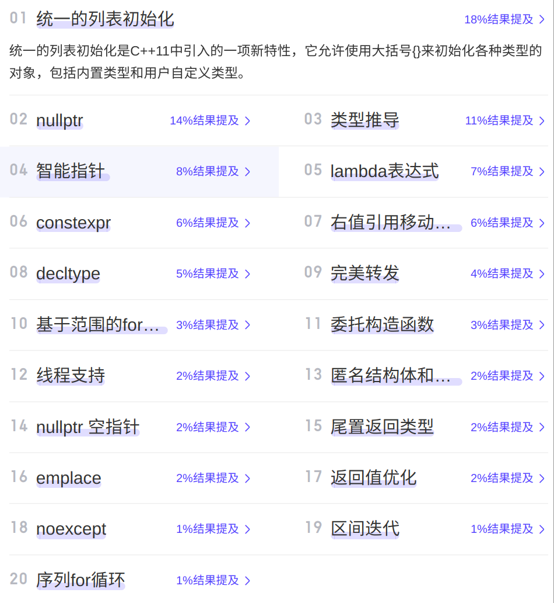

[【游戏开发面经汇总】- 计算机基础篇](https://zhuanlan.zhihu.com/p/417640759)

https://zhuanlan.zhihu.com/p/624285893

https://leetcode.cn/studyplan/top-interview-150/

https://mp.weixin.qq.com/s/p_EP1JTSkx2xwuDF5CfN0w

https://mp.weixin.qq.com/s/B44lyGuz446Ly_m92uQ_ag

https://leetcode.cn/problems/lru-cache-lcci/description/

# c++

### 新特性



### 前置++与后置++

```c
//前置
self &operator++() {
    node = (linktype)((node).next);
    return *this;
}
//后置
const self operator++(int) {
    self tmp = *this;
    ++*this;
    return tmp;
}
```

为了区分前后置，重载函数是以参数类型来区分，在调⽤的时候，编译器默默给int指定为⼀个0

> 1、==为什么后置返回对象，⽽不是引⽤==
> 因为后置为了返回旧值创建了⼀个临时对象，在函数结束的时候这个对象就会被销毁，如果返回引⽤，那么我请问
> 你？你的对象对象都被销毁了，你引⽤啥呢？

> 2、==为什么后置前⾯也要加const==
> 其实也可以不加，但是为了防⽌你使⽤i++++,连续两次的调⽤后置++重载符，为什么呢?
> 原因：
> 它与内置类型⾏为不⼀致；你⽆法活得你所期望的结果，因为第⼀次返回的是旧值，⽽不是原对象，你调⽤两次后
> 置++，结果只累加了⼀次，所以我们必须⼿动禁⽌其合法化，就要在前⾯加上const  


### 基本数据类型长度

> **无符号整数类型**：`size_t` 是一个无符号整数类型，也就是说它只能表示非负整数。
>
> **与平台相关**：`size_t` 的大小取决于平台的位数。在 32 位系统上，`size_t` 通常是 32 位宽；在 64 位系统上，`size_t` 通常是 64 位宽。


# 手撕代码

### atoi (ascii to int )

```c
#include <stdio.h>
#include <stdlib.h>
#include <assert.h>

int isempty(char* str)
{
    if (str == ' ' ||
        str == '\t' ||
        str == '\n' ||
        str == '\f' ||
        str == '\v' ||
        str == '\r')
    {
        return 1;
    }
    return 0;
}

int isnumber(char* str)
{
    if (str >= '0' && str <= '9')
    {
        return 1;
    }
    return 0;
}

int  my_atoi(char* str)
{
    assert(str != NULL);
    char sign;
    int flag = 0;
    while (isempty(*str)==1)//判断是否为空
    {
        str++;
    }
    sign = *str;
    if (sign == '-' || sign == '+')
    {
        str++;
    }
    while (isnumber(*str) == 1)//判断是否为数字
    {
        flag = 10 * flag + (*str - '0');//在循环过程中，每次处理一个数字字符时，我们需要将其转换成对应的整数值，并将其累加到已经转换好的部分上。
                                        //乘以10的目的是为了将已经转换好的部分向左移动一位，为新的数字字符腾出位置。
        str++;
    }
    return sign == '-' ? -flag : flag;
}


int main()
{
    const char* str1 = "123";
    const char* str2 = "-123abc12";
    const char* str3 = "abc";
    int value1 = my_atoi(str1);
    int value2 = my_atoi(str2);
    int value3 = my_atoi(str3); 
    printf("Value of str1: %d\n", value1);//123
    printf("Value of str2: %d\n", value2);//-123
    printf("Value of str3: %d\n", value3); //0
    return 0;
}
                        
原文链接：https://blog.csdn.net/qq_57425280/article/details/133438479
```

```c
#include<stdio.h>
#include<stdlib.h>
#include<ctype.h>
int my_atoi(const char* str)
{
	assert(str);
	//用isspace函数向后过滤空白字符
	//isspace返回值不为0，代表是空格
	while (isspace(*str))
	{
		str++;
	}//走到这里str一定不是空格了
	if (*str == '\0')//空字符串问题
	{
		return 0;
	}
	//+-号问题
	int flg = 1;
	if (*str == '+')
	{
		flg = 1;
		str++;
	}//注意这里要用else if，不能用else
	else if(*str == '-')
	{
		flg = -1;
		str++;
	}
	long long n = 0;
	while (*str != "\0")
	{
		if (isdigit(*str))
		{//是数字字符==>返回值不为0
			n = n * 10 + (*str - '\0') * flg;
		}
		else//不是数字字符
		{
			return (int)n;
		}
		str++;
	}
	return (int)n;
}
int main()
{
	int ret = my_atoi("123");
	printf("&d\n", ret);
	return 0;
}
```


### iota下标绑定排序

```c
iota(id.begin(), id.end(), 0);
sort(id.begin(), id.end(), [&](int i, int j)  {return indices[i] > indices[j];});
```

