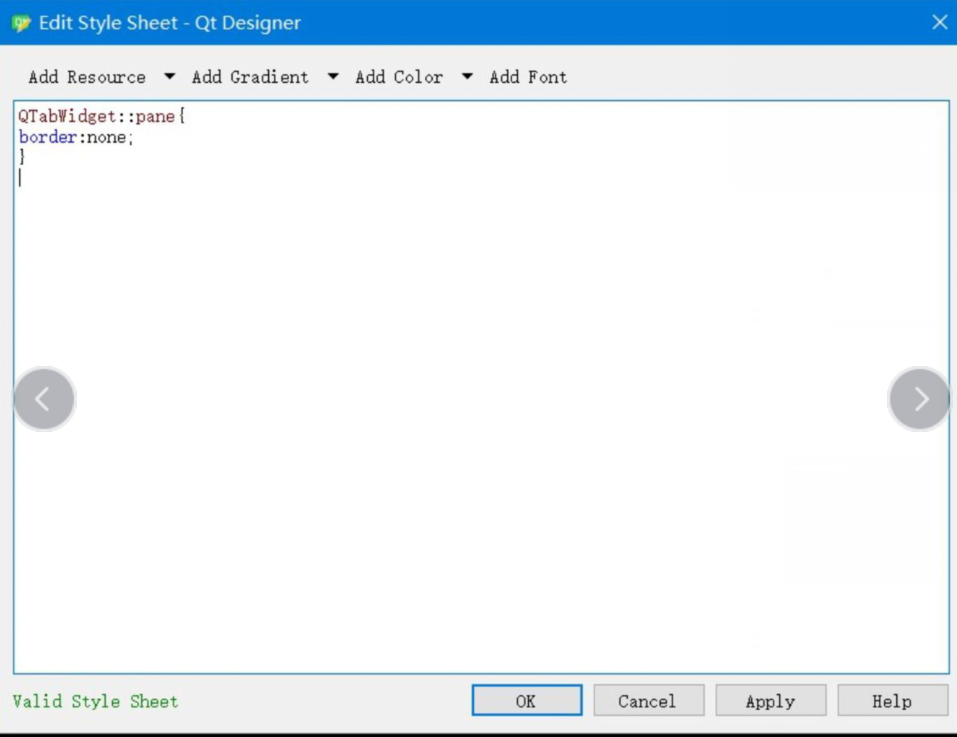
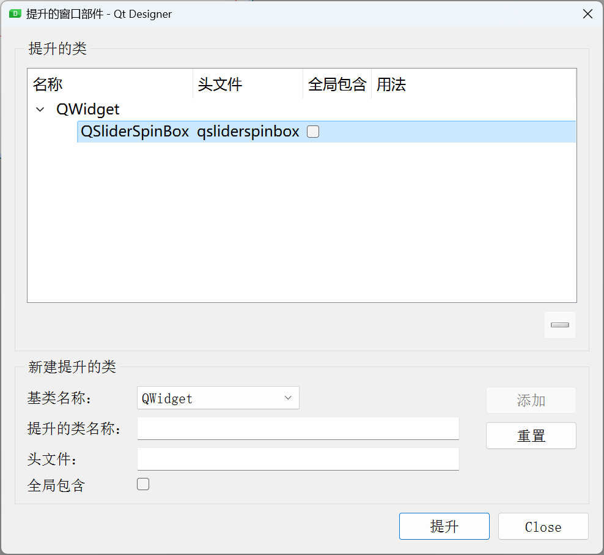
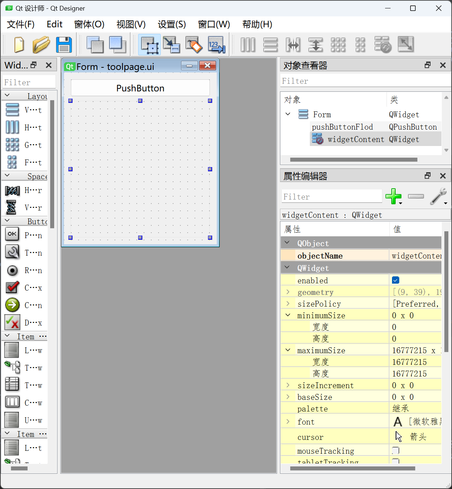
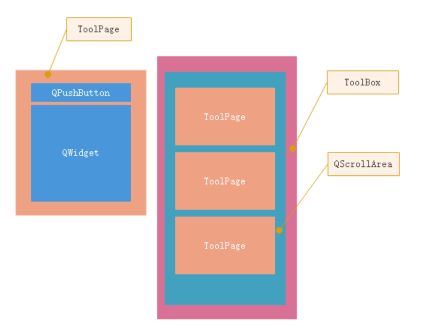

# QTCreator

## qt cmake项目和环境

需要安装vs  cmake  [debugger](https://blog.csdn.net/wang_gan_7889/article/details/120200265)

5.15.2 以上检测c编译器环境好一点

可以在安装后添加编译器路径，之前的版本是安装的时候检测的

5.12.12 以后可以添加msvc

# QFLuentUI

qt 5.12.2 

vs 2019

MSVC2019 64bit


## 怎么使用fluentwindows

```
https://zhuanlan.zhihu.com/p/661439723  
```


## bianyi 

https://www.bilibili.com/video/BV1ek4y1N7r8/?spm_id_from=333.788&vd_source=eef102f4fb053709a57c96d0c876628a

```cmake
cmake_minimum_required(VERSION 3.14)

project(FluentUIdemo VERSION 0.1 LANGUAGES CXX)

set(CMAKE_AUTOUIC ON)
set(CMAKE_AUTOMOC ON)
set(CMAKE_AUTORCC ON)

set(CMAKE_CXX_STANDARD 17)
set(CMAKE_CXX_STANDARD_REQUIRED ON)
set(FLUENTUI_BUILD_EXAMPLES OFF)
set(FLUENTUI_BUILD_STATIC_LIB OFF)

find_package(QT NAMES Qt6 Qt5 REQUIRED COMPONENTS Core Quick)
find_package(Qt${QT_VERSION_MAJOR} REQUIRED COMPONENTS Core Quick)

set(PROJECT_SOURCES
        main.cpp
        qml.qrc
)

if(${QT_VERSION_MAJOR} GREATER_EQUAL 6)
    qt_add_executable(FluentUIdemo
        MANUAL_FINALIZATION
        ${PROJECT_SOURCES}
    )
# Define target properties for Android with Qt 6 as:
#    set_property(TARGET FluentUIdemo APPEND PROPERTY QT_ANDROID_PACKAGE_SOURCE_DIR
#                 ${CMAKE_CURRENT_SOURCE_DIR}/android)
# For more information, see https://doc.qt.io/qt-6/qt-add-executable.html#target-creation
else()
    if(ANDROID)
        add_library(FluentUIdemo SHARED
            ${PROJECT_SOURCES}
        )
# Define properties for Android with Qt 5 after find_package() calls as:
#    set(ANDROID_PACKAGE_SOURCE_DIR "${CMAKE_CURRENT_SOURCE_DIR}/android")
    else()
        add_executable(FluentUIdemo
          ${PROJECT_SOURCES}
          resource.qrc
          qml/AppMainWindow.qml


        )
    endif()
endif()

target_link_libraries(FluentUIdemo
  PRIVATE Qt${QT_VERSION_MAJOR}::Core Qt${QT_VERSION_MAJOR}::Quick fluentuiplugin)

# Qt for iOS sets MACOSX_BUNDLE_GUI_IDENTIFIER automatically since Qt 6.1.
# If you are developing for iOS or macOS you should consider setting an
# explicit, fixed bundle identifier manually though.
if(${QT_VERSION} VERSION_LESS 6.1.0)
  set(BUNDLE_ID_OPTION MACOSX_BUNDLE_GUI_IDENTIFIER com.example.FluentUIdemo)
endif()
set_target_properties(FluentUIdemo PROPERTIES
    ${BUNDLE_ID_OPTION}
    MACOSX_BUNDLE_BUNDLE_VERSION ${PROJECT_VERSION}
    MACOSX_BUNDLE_SHORT_VERSION_STRING ${PROJECT_VERSION_MAJOR}.${PROJECT_VERSION_MINOR}
    MACOSX_BUNDLE TRUE
    WIN32_EXECUTABLE TRUE
)

include(GNUInstallDirs)
install(TARGETS FluentUIdemo
    BUNDLE DESTINATION .
    LIBRARY DESTINATION ${CMAKE_INSTALL_LIBDIR})

if(QT_VERSION_MAJOR EQUAL 6)
    qt_import_qml_plugins(FluentUIdemo)
    qt_finalize_executable(FluentUIdemo)
endif()


add_subdirectory(FluentUI)
```

> !!!
>
> set(FLUENTUI_BUILD_EXAMPLES OFF)
> set(FLUENTUI_BUILD_STATIC_LIB OFF)

# QT TOOL

### ui转py
```
D:\\soft\\Anaconda3\\envs\\py37\\Scripts\\pyside2-uic -o  F:\\Work\\THU\\code\\Zivid\\zivid_ui.py  F:\\Work\\THU\\code\\Zivid\\zivid.ui
```
```
D:/Soft/Anaconda/envs/py37/Scripts/pyside2-uic   E:\Work\THU\code\THU_Project6优化多进程通信/UI/untitled.ui > E:\Work\THU\code\THU_Project6优化多进程通信/UI/untitled.py
```
```
pyuic5 -x untitled.ui -o untitled.py
```
### designer
```
D:\soft\Anaconda3\envs\py37\Lib\site-packages\qt5_applications\Qt\bin\designer.exe
```
### icon生成py文件
```
pyrcc5 -o D:/Workdir/working/pythonwork/THU/THU_Project5yolo/UI/icon.py D:/Workdir/working/pythonwork/THU/THU_Project5yolo/UI/icon/icon.qrc
```

# 官方文档Qweiget
[官方Qweiget](https://doc.qt.io/qtforpython-6/PySide6/QtWidgets/index.html#module-PySide6.QtWidgets)


# QSS

[QSS介绍博客](https://blog.csdn.net/weixin_44002829/article/details/123747063 )

[样式表属性官方例子](https://doc.qt.io/qtforpython-6/overviews/stylesheet-examples.html?highlight=border%20image#customizing-qslider)
[样式表属性官方文档](https://doc.qt.io/qt-5/stylesheet-reference.html#list-of-properties  )  
[选择器](https://blog.csdn.net/weixin_44002829/article/details/123747063)
所有的子类和子组件也会收父类的影响但可以被子类覆盖

```
QTabWidget::pane{								/*选定Tab组件的窗格*/
    border:none;								/*设置窗格的边框线条为无*/  
	top: -15px;} 								/*将窗格向下移*/
 
QTabWidget::tab-bar{							/*选中Tab组件的tab条*/
	alignment:center;}							/*定位居中*/
 
QWidget{										/*选中组件/*/
	background-color: rgb(225, 225, 225);}		/*设置组件整体背景颜色*/
 
 
QTabBar::tab:selected{							/*当Tab条的tab被选中*/
	background-color: rgb(85, 170, 255);}		/*改变被选中tab的颜色*/
 
 
QTabBar::tab{									/*选中Tab条的tab条*/
	background-color: rgb(255, 255, 255);		/*设置初始tab条颜色*/	
	border: none;								/*设置tab条的边框线条为无*/
	border-radius: 5px; 						/*设置tab条的边框倒角半径*/
	font-size:20px;								/*设置tab条文字大小*/
	height: 30px;								/*设置tab条高度*/
	width:100px;}								/*设置tab条宽度*/
```



# 加载ui两种方法
法1：  
self.ui = QUiLoader().load('windows.ui')   
没有setupui方法，控件和树挂在self.ui
<br/>

法二：  
self.ui = Ui_Formf()  
self.ui.setupUi(self)  
控件都是Ui_Form().label也就是self.ui.label,但是树挂在self
```python
class Windows(QWidget):

    def __init__(self):
        super().__init__()
        # 从文件中加载UI定义
        # 从 UI 定义中动态 创建一个相应的窗口对象
        # 注意：里面的控件对象也成为窗口对象的属性了
        # 比如 self.ui.button , self.ui.textEdit
        self.ui = QUiLoader().load('windows.ui')
        # self.ui = Ui_Form()
        # self.ui.setupUi(self)

        self.ui.pushButton.clicked.connect(lambda: self.search())
```


# Signal
```python
# 定义信号
str_text = Signal(QTextBrowser, str)

# 信号连接槽函数
global_signal.str_error.connect(self.connect_show_error)

# signal.emit会传参数过来
def connect_show_error(self, text):
        """ 显示错误信息"""
        QMessageBox.warning(None, 'error', text)
```


# event
```python
def mouseMoveEvent(self, e):
        pos = e.pos()
        self._resizeWidget(pos)
        if self.moving:
            relpos = e.globalPos() - self.start_pos
            self.move(self.start_windowpos + relpos)
```
虚函数，事件触发自动回调用


# 图元类QGraphicsItem
[图元类QGraphicsItem](https://blog.csdn.net/seniorwizard/article/details/110633084)


# [嵌入第三方](https://blog.csdn.net/wangxiaolin1992/article/details/127637351)

# 动画
[动画例子](https://www.qb5200.com/article/382274.html  )
[动画例子2](https://blog.csdn.net/kenfan1647/article/details/109845295)
QPropertyAnimation  

```python
self.anim = QPropertyAnimation(self.down_widget)
self.anim.setTargetObject(self.down_widget)  # 设置动画对象
self.anim.setPropertyName(b"geometry")
self.anim.setStartValue(QRect(x, y, self.clickbutton.width(), 0))  # 设置起始点;初始尺寸
self.anim.setEndValue((QRect(x, y, self.clickbutton.width(), self.clickbutton.height()*4)))  # 设置终点；终止尺寸
self.anim.setDuration(150)  # 时长单位毫秒
self.anim.start()
```


## Desiger控件的提升和继承父类的初始化，鼠标事件和show等方法
python2必须写成 super（父类，self）.方法名（参数）  
重写ui转py文件时候的会用的一些函数
```
class DoubleSlider(QtWidgets.QSlider):

    # create our our signal that we can connect to if necessary
    doubleValueChanged = QtCore.Signal(float)

    def __init__(self,decimals=2, *args, **kargs):
        super(DoubleSlider, self).__init__(*args, **kargs)

        self._multi = 10 ** decimals
        self.valueChanged.connect(self.emitDoubleValueChanged)
        self.setSingleStep(1)
        self.setOrientation(QtCore.Qt.Horizontal)

    def emitDoubleValueChanged(self):
        value = float(super(DoubleSlider, self).value())/self._multi
        self.doubleValueChanged.emit(value)

    def value(self):
        return float(super(DoubleSlider, self).value()) / self._multi

    def setMinimum(self, value):
        return super(DoubleSlider, self).setMinimum(value * self._multi)

    def setMaximum(self, value):
        return super(DoubleSlider, self).setMaximum(value * self._multi)

    def setSingleStep(self, value):
        return super(DoubleSlider, self).setSingleStep(value * self._multi)

    def singleStep(self):
        return float(super(DoubleSlider, self).singleStep()) / self._multi

    def setValue(self, value):
        super(DoubleSlider, self).setValue(int(value * self._multi))
```
自定义的控件designer无法预览到   
from 头文件 import 名称



# 罪人控件解析器

https://pypi.org/project/PyQtGuiLib/
```python
import sys

from PyQtGuiLib.core.resolver import dumpStructure

from PySide2.QtWidgets import QApplication, QWidget,QTabWidget,QTabBar

if __name__=="__main__":
    app = QApplication(sys.argv)
    dumpStructure(QTabWidget())
```

# CDrawer学习
https://github.com/PyQt5/CustomWidgets
```python
    def doOpenTop(self):
        if not hasattr(self, 'topDrawer'):
            self.topDrawer = CDrawer(self, stretch=0.5, direction=CDrawer.TOP)
            self.topDrawer.setWidget(DrawerWidget(self.topDrawer))
        self.topDrawer.show()
```
```python
class DrawerWidget(QWidget):

    def __init__(self, *args, **kwargs):
        super(DrawerWidget, self).__init__(*args, **kwargs)
        self.setAttribute(Qt.WA_StyledBackground, True) # setAttribute设置属性
        self.setStyleSheet('DrawerWidget{background:white;}')
        layout = QVBoxLayout(self)
        layout.addWidget(QLineEdit(self))
        layout.addWidget(QPushButton('button', self))
```
### setAttribute设置属性
[官方文档](https://doc.qt.io/qtforpython-6/PySide6/QtCore/Qt.html#PySide6.QtCore.PySide6.QtCore.Qt.WidgetAttribute  )

比如：Qt.WA_StyledBackground   QWidget的子类窗口如要正常显示背景色，需要setAttribute(Qt::WA_StyledBackground);
目的是脱离父窗口的样式。


比如无边框窗口和透明窗口
```
setWindowFlag(Qt::FramelessWindowHint);  
self.hidewindow.setWindowFlags(self.windowFlags() | Qt.FramelessWindowHint | Qt.Popup | Qt.NoDropShadowWindowHint)
```


```python
    def setWidget(self, widget):
        """设置子控件
        :param widget:
        """
        self.widget = widget
        if widget:
            widget.setParent(self)
            self.animIn.setTargetObject(widget)
            self.animOut.setTargetObject(widget)
```
CDrawer.setWidget(DrawerWidget(CDrawer))  
在CDrawer类内   self.widget = Widget(self)


# CSider学习

```python
class CSlider(QSlider):

    def __init__(self, *args, **kwargs):
        super(CSlider, self).__init__(*args, **kwargs)
        self.setCursor(Qt.PointingHandCursor)
        self.setStyleSheet(Style)

    def mousePressEvent(self, event):
        # 获取上面的拉动块位置
        option = QStyleOptionSlider()
        self.initStyleOption(option)
        rect = self.style().subControlRect(
            QStyle.CC_Slider, option, QStyle.SC_SliderHandle, self)
        if rect.contains(event.pos()):
            # 如果鼠标点击的位置在滑块上则交给Qt自行处理
            super(CSlider, self).mousePressEvent(event)
            return
        if self.orientation() == Qt.Horizontal:
            # 横向，要考虑invertedAppearance是否反向显示的问题
            self.setValue(self.style().sliderValueFromPosition(
                self.minimum(), self.maximum(),
                event.x() if not self.invertedAppearance() else (self.width(
                ) - event.x()), self.width()))
        else:
            # 纵向
            self.setValue(self.style().sliderValueFromPosition(
                self.minimum(), self.maximum(),
                (self.height() - event.y()) if not self.invertedAppearance(
                ) else event.y(), self.height()))
```
### self.style()
slider根据像素位置设置value
```
self.style().sliderValueFromPosition
```
看像素位置是否在控件内
```
rect = self.style().subControlRect(
            QStyle.CC_Slider, option, QStyle.SC_SliderHandle, self)
        if rect.contains(event.pos()):
```


# QToolbox

toolpage_ui.py
```python
from PySide2 import QtCore, QtGui, QtWidgets


class Ui_Form(object):
    def setupUi(self, Form):
        Form.setObjectName("Form")
        Form.setStyleSheet("font-family:微软雅黑;")
        self.verticalLayout = QtWidgets.QVBoxLayout(Form)
        self.verticalLayout.setObjectName("verticalLayout")
        self.pushButtonFlod = QtWidgets.QPushButton(Form)
        self.pushButtonFlod.setObjectName("pushButtonFlod")
        self.verticalLayout.addWidget(self.pushButtonFlod)
        self.widgetContent = QtWidgets.QWidget(Form)
        self.widgetContent.setObjectName("widgetContent")
        self.verticalLayout.addWidget(self.widgetContent)

        self.retranslateUi(Form)
        QtCore.QMetaObject.connectSlotsByName(Form)

    def retranslateUi(self, Form):
        _translate = QtCore.QCoreApplication.translate
        Form.setWindowTitle(_translate("Form", "Form"))
        self.pushButtonFlod.setText(_translate("Form", "PushButton"))
```
## QToolpage
```python
import sys
import time

from PySide2.QtCore import *
from PySide2.QtGui import *
from PySide2.QtWidgets import *
from toolpage import  Ui_Form

class QToolpage(QWidget):

    def __init__(self, *args, **kwargs):
        super().__init__(*args, **kwargs)
        self.setStyleSheet(
            """
            background-color: black;
            """
        )
        self.is_expand = False
        self.ui = Ui_Form()
        self.ui.setupUi(self)
        self.ui.verticalLayout.setContentsMargins(0, 0, 0, 0) # 设置外边界
        self.ui.pushButtonFlod.clicked.connect(self.btn_clicked)
        self.ui.widgetContent.hide() # 隐藏下拉菜单
        self.ui.widgetContent.setAttribute(Qt.WA_StyledBackground)
        self.ContentLayout = QVBoxLayout(self.ui.widgetContent)
        self.ContentLayout.setSpacing(2) # 控件之间空白空间2 px
        self.ContentLayout.setContentsMargins(0, 0, 0, 0)
        self.ContentLayout.addStretch(1) # 最下方空白空间最大化


    def btn_clicked(self):
        if self.is_expand:
            self.ui.widgetContent.hide()
            self.is_expand = False
        else:
            # 设置动画
            self.anim = QPropertyAnimation(self.ui.widgetContent)
            self.anim.setTargetObject(self.ui.widgetContent)
            self.anim.setPropertyName(b"geometry")
            self.ui.widgetContent.show() # 这里建议先show再开始动画，不然获取空间的hw出错
            self.anim.setStartValue(QRect(0, 44, self.ui.pushButtonFlod.width(), 0))
            self.anim.setEndValue((QRect(0, 44, self.ui.pushButtonFlod.width(), self.ui.widgetContent.height())))
            self.anim.setDuration(150)
            self.anim.start()

            self.is_expand = True

    def addWidget(self, title, widget):
        self.ui.pushButtonFlod.setText(title)
        self.ContentLayout.addWidget(widget)


if __name__ == "__main__":

    app = QApplication(sys.argv)
    window = QToolpage()
    window.show()
    sys.exit(app.exec_())
```

### addStretch的作用

今天在使用addStretch，布局的时候，发现addStretch竟然是可以平均分配的，有意思。比如：
```
QVBoxLayout *buttonLayout = new QVBoxLayout;
buttonLayout->addStretch(1);
buttonLayout->addWidget(Button1);
buttonLayout->addStretch(1);
buttonLayout->addWidget(Button2);
buttonLayout->addStretch(1);
buttonLayout->addWidget(Button3);
buttonLayout->addStretch(6);
```
您会发现，buttonLayout的布局将空白没有widget的地方分成了9份，然后按照您所规定的地方分配弹簧，
于是布局起来就方便多了，以前没有发现这个，一直还为布局头疼呢，现在有点门路 

###  设置各部件的相邻距离
Layout->setSpacing(2); 

## QToolbox

```python
import sys
from PySide2.QtWidgets import *
from QToolpage import QToolpage

class QToolQToolpage(QWidget):

    def __init__(self, *args, **kwargs):
        super().__init__(*args, **kwargs)

        self.layout = QVBoxLayout(self)
        self.setMinimumSize(400,600)

        self.widget = QWidget(self)

        self.ContentLayout = QVBoxLayout() # 下拉控件空布局
        self.ContentLayout.setSpacing(2)
        self.ContentLayout.setContentsMargins(0, 0, 0, 0)

        self.scrollLayout = QVBoxLayout(self.widget) # 滚动区域
        self.scrollLayout.setContentsMargins(0, 0, 0, 0)
        self.scrollLayout.addLayout(self.ContentLayout) # 添加下拉控件空布局
        self.scrollLayout.addStretch(1) # 下方空白最大化

        self.scrollarea = QScrollArea(self) # 滚动区域
        self.scrollarea.setWidgetResizable(True)
        self.scrollarea.setWidget(self.widget)
        self.layout.addWidget(self.scrollarea)

    def addWidget(self, title, widget):
        page = QToolpage(self)
        page.addWidget(title, widget)
        self.ContentLayout.addWidget(page)

    def addWidget(self, title, widget):
        page = QToolpage(self)
        page.addWidget(title, widget)
        self.ContentLayout.addWidget(page)


if __name__ == "__main__":

    app = QApplication(sys.argv)
    window = QToolBox()
    window.show()
    sys.exit(app.exec_())
```
Test
```python
class window(QWidget):

    def __init__(self, *args, **kwargs):
        super().__init__(*args, **kwargs)
        self.Layout = QVBoxLayout(self)
        widget = QWidget()
        Layout = QVBoxLayout(widget)
        Layout.setSpacing(2)
        Layout.setContentsMargins(0, 0, 0, 0)
        Layout.addWidget(QPushButton(widget))
        Layout.addWidget(QPushButton(widget))
        Layout.addWidget(QPushButton(widget))

        self.toolbox = QToolBox(self)
        self.toolbox.addWidget("toolbox", widget)
```

# Fluent Studio

Fluent Studio 软件可以一键将 Fluent Designer 设计师软件生成的 PyQt-Fluent-Widgets ui 文件转换为 C++ QFluentWidgets 所需的 ui 文件。PyQt-Fluent-Widgets 编写界面代码，ChatGPT 转换代码为 C++ Qt，开发效率大大提高，开启界面开发新纪元。
官网地址：https://qfluentwidgets.com/
仓库地址：https://github.com/zhiyiYo/PyQt-Fluent-Widgets
示例程序：https://github.com/zhiyiYo/PyQt-Fluent-Widgets/releases
