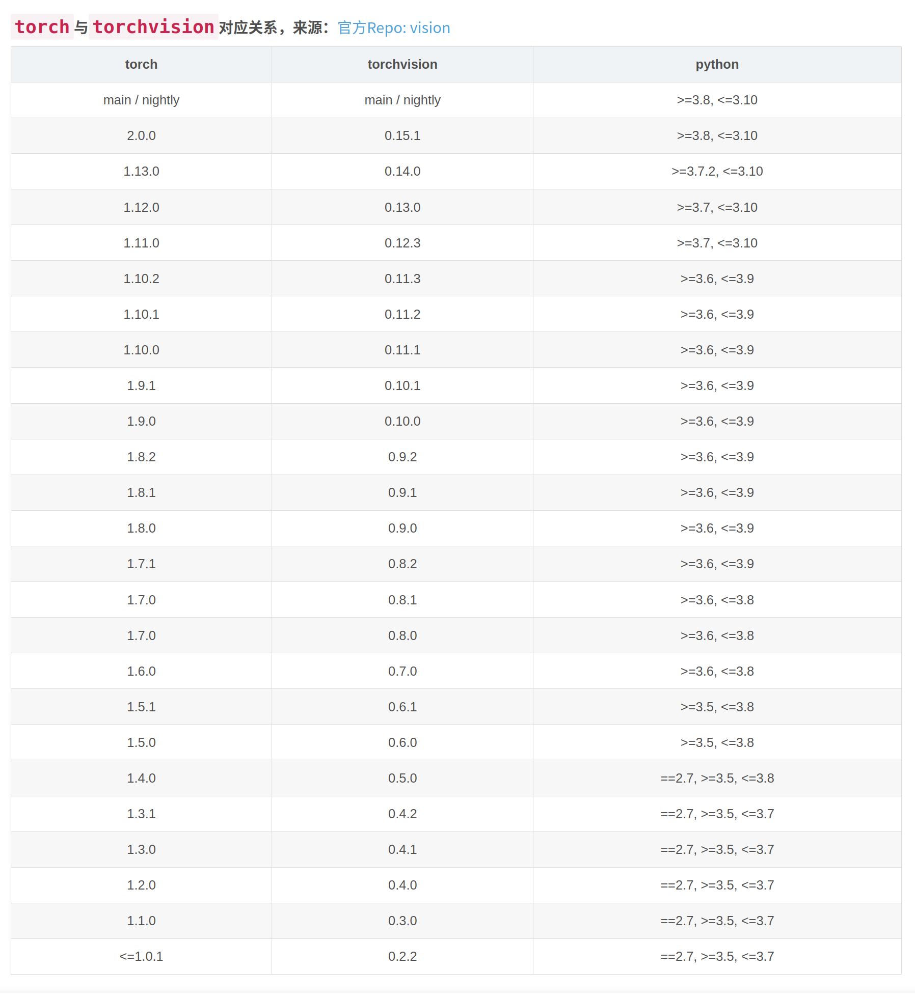

# torch和torchvision 对应关系
 

[torch whl链接](https://download.pytorch.org/whl/torch_stable.html)


# 安装
[mmcv下载链接](https://download.openmmlab.com/mmcv/dist/cu116/torch1.13.0/index.html)  
[mmcv文档](https://mmcv.readthedocs.io/zh_CN/latest/)   
[mmdet](https://mmdetection.readthedocs.io/zh_CN/latest/)  
[mmdet3d](https://mmdetection3d.readthedocs.io/zh_CN/latest/)  
[版本对应](https://mmdetection3d.readthedocs.io/zh_CN/latest/faq.html) 


[知乎安装](https://zhuanlan.zhihu.com/p/478155959)  
老版就用保存的源码和知乎安装

[V1.1.0rc2](https://github.com/open-mmlab/mmdetection3d/releases/tag/v1.1.0rc2)
新版创建新环境然后按照文档，用源码安装mmengine0.7.2，numba要0.53.0
***具体环境版本在安装包文件夹里***


# 安装1.1.0

### 
```
tensorboard --logdir=E:\codenotes\deeplearning\recurrent\mit\mit_pytorch\logs
Serving TensorBoard on localhost; to expose to the network, use a proxy or pass --bind_all
TensorBoard 2.11.0 at http://localhost:6006/ (Press CTRL+C to quit)
```

# 操作命令

## 修改进程名字
```
import setproctitle
setproctitle.setproctitle("进程别名")
```

## 运行实例
```
python pcd_demo.py F:\kitti\object_mit\testing\ang_2000_carn32_0.005_deepmap16_add16line_16lineground\velodyne_reduced\000018.bin configs/pointpillars/hv_pointpillars_secfpn_6x8_160e_kitti-3d-3class.py E:\codenotes\deeplearning\mm3dnotes\work_dirs\pointpillars_ang_2000_carn32_0.005_deepmap16_add16line_16lineground/epoch_80.pth --show
```

##  准备数据集
```
python   ./tools/create_data.py kitti --root-path /mnt/data01/WK/object_old1.0.0 --out-dir /mnt/data01/WK/object_old1.0.0 --extra-tag kitti
```
```
python tools/create_data.py kitti --root-path F:\kitti\object_mit --out-dir F:\kitti\object_mit --extra-tag kitti 
```

## 测试评估数据

```
python ./tools/test.py ./configs/pointpillars/hv_pointpillars_secfpn_6x8_160e_kitti-3d-3class.py E:\codenotes\deeplearning\mm3dnotes\work_dirs\pointpillars_ang_2000_carn32_0.005_deepmap16_add16line_16lineground/epoch_80.pth --eval mAP  --eval-options show=False out_dir=E:\codenotes\deeplearning\mm3dnotes\work_dirs\pointpillars_ang_2000_carn32_0.005_deepmap16_add16line_16lineground\show_result --out E:\codenotes\deeplearning\mm3dnotes\work_dirs\pointpillars_ang_2000_carn32_0.005_deepmap16_add16line_16lineground\show_result\result.pkl
python ./tools/test.py ./configs/pointpillars/hv_pointpillars_secfpn_6x8_160e_kitti-3d-3class.py E:\codenotes\deeplearning\mm3dnotes\work_dirs\pointpillars_ang_2000_carn32_0.005_deepmap16_add16line_16lineground/epoch_80.pth --show --show-dir E:\codenotes\deeplearning\mm3dnotes\work_dirs\pointpillars_ang_2000_carn32_0.005_deepmap16_add16line_16lineground\show_result

```
```
python test.py ../configs\point_rcnn\point_rcnn_2x8_kitti-3d-3classes.py G:\codenotes\deeplearning\mm3dnotes\work_dirs/hv_point_rcnn_2x8_kitti-3d-3class_super32/point_rcnn_2x8_kitti-3d-3classes_20211208_151344.pth --eval mAP  --options show=True out_dir=G:\codenotes\deeplearning\mm3dnotes\work_dirs\hv_point_rcnn_2x8_kitti-3d-3class_super32/show_results_pseudo
```
```
python test.py ..\configs\parta2\hv_PartA2_secfpn_2x8_cyclic_80e_kitti-3d-3class.py G:\codenotes\deeplearning\mm3dnotes\work_dirs\hv_PartA2_secfpn_2x8_cyclic_80e_kitti-3d-3class_super64\hv_PartA2_secfpn_2x8_cyclic_80e_kitti-3d-3class_20210831_022017-454a5344.pth --eval mAP  --options show=True out_dir=G:\codenotes\deeplearning\mm3dnotes\work_dirs\hv_point_rcnn_2x8_kitti-3d-3class_super32/show_results_pseudo
```


## 训练模型
pointpillars
```
python ./tools/train.py /mnt/data01/WK/mmdetection3d1.0.0/mmdetection3d-master/configs/pointpillars/hv_pointpillars_secfpn_6x8_160e_kitti-3d-3class.py --work-dir /mnt/data01/WK/mmdetection3d1.0.0/mmdetection3d-master/work_dirs/pointpillars_ang_2000_carn32_0.01_50_deepmap16_16lineadd_rfilter
```
```
python ./tools/train.py E:\codenotes\deeplearning\mm3dnotes/configs/pointpillars/hv_pointpillars_secfpn_6x8_160e_kitti-3d-3class.py --work-dir E:\codenotes\deeplearning\mm3dnotes/work_dirs/pillar_CARN2000_ang_0.01_16line&gt16liine 
```
```
python ./tools/train.py E:\codenotes\deeplearning\mm3dnotes/configs/pointpillars/hv_pointpillars_secfpn_6x8_160e_kitti-3d-3class.py --work-dir E:\codenotes\deeplearning\mm3dnotes\work_dirs\pointpillars_ang_2000_carn32_0.005_deepmap16_16linereplace_noground  --resume-from E:\codenotes\deeplearning\mm3dnotes\work_dirs\pointpillars_ang_2000_carn32_0.005_deepmap16_16linereplace_noground/epoch_40.pth
```
point_rcnn
```
python ./tools/train.py /mnt/data01/WK/mmdetection3d/mmdetection3d/configs/point_rcnn/point_rcnn_2x8_kitti-3d-3classes.py --work-dir /mnt/data01/WK/mmdetection3d/mmdetection3d/work_dirs/hv_point_rcnn_ang_2000_carn32_0.005_deepmap16_16linereplace_16lineground
```
PartA2
```
python ./tools/train.py configs\parta2\hv_PartA2_secfpn_2x8_cyclic_80e_kitti-3d-3class.py --work-dir G:\codenotes\deeplearning\mm3dnotes\work_dirs\hv_PartA2_secfpn_2x8_cyclic_80e_kitti-3d-3class_super64 --resume-from  G:\codenotes\deeplearning\mm3dnotes\work_dirs\hv_PartA2_secfpn_2x8_cyclic_80e_kitti-3d-3class_super64\hv_PartA2_secfpn_2x8_cyclic_80e_kitti-3d-3class_20210831_022017-454a5344.pth
```
pv_rcnn
```
python ./tools/train.py /mnt/data01/WK/mmdetection3d/mmdetection3d/configs/pv_rcnn/pv_rcnn_8xb2-80e_kitti-3d-3class.py --work-dir /mnt/data01/WK/mmdetection3d/mmdetection3d/work_dirs/pv_rcnn_ang_2000_carn32_0.01_50_deepmap16_16lineadd_rfilter --resume
```

mvx

```
python ./tools/train.py /mnt/data01/WK/mmdetection3d/mmdetection3d/configs/mvxnet/mvxnet_fpn_dv_second_secfpn_8xb2-80e_kitti-3d-3class.py --work-dir /mnt/data01/WK/mmdetection3d/mmdetection3d/work_dirs/mvxnet_fpn_dv_second_secfpn_8xb2-80e_kitti-3d-3class_16
```


## 可视化

```
python tools/misc/visualize_results.py E:\codenotes\deeplearning\mm3dnotes/configs/pointpillars/hv_pointpillars_secfpn_6x8_160e_kitti-3d-3class.py  --show-dir E:\codenotes\deeplearning\mm3dnotes\work_dirs\pointpillars_ang_2000_carn32_0.005_deepmap16_add16line_16lineground\show_result\000001 --result E:\codenotes\deeplearning\mm3dnotes\work_dirs\pointpillars_ang_2000_carn32_0.005_deepmap16_add16line_16lineground\show_result\result.pkl
```

## 支持kitti数据3class的
1. SECOND (Sensor'2018)
2. PointPillars (CVPR'2019)
3. SA-SSD (CVPR'2020)
4. PointRCNN (CVPR'2019)
5. Part-A2 (TPAMI'2020)


## 新版本的坑
- 一个是有的img损坏
- 一个是predata和老版本不一样
- use_ground_plane (bool): 是否使用地平面去调整3d标签，默认True会导致报错,改成flase
```
train_pipeline = [
    dict(type='LoadPointsFromFile', coord_type='LIDAR', load_dim=4, use_dim=4),
    dict(type='LoadAnnotations3D', with_bbox_3d=True, with_label_3d=True),
    dict(type='ObjectSample', db_sampler=db_sampler, use_ground_plane=False),
    dict(type='RandomFlip3D', flip_ratio_bev_horizontal=0.5),
    dict(
        type='GlobalRotScaleTrans',
        rot_range=[-0.78539816, 0.78539816],
        scale_ratio_range=[0.95, 1.05]),
    dict(type='PointsRangeFilter', point_cloud_range=point_cloud_range),
    dict(type='ObjectRangeFilter', point_cloud_range=point_cloud_range),
    dict(type='PointShuffle'),
    dict(
        type='Pack3DDetInputs',
        keys=['points', 'gt_bboxes_3d', 'gt_labels_3d'])
]
```
- 不保存pth文件
default_runtime.py里修改
```
default_hooks = dict(
    timer=dict(type='IterTimerHook'),
    logger=dict(type='LoggerHook', interval=50),
    param_scheduler=dict(type='ParamSchedulerHook'),
    checkpoint=dict(type='CheckpointHook', interval=1),
    sampler_seed=dict(type='DistSamplerSeedHook'),
    visualization=dict(type='Det3DVisualizationHook'))
```
- resume不再是参数，而是在last_checkpoints.int文件里写的，在workdir里
</p>


- 配置
https://mmdetection3d.readthedocs.io/en/latest/user_guides/config.html?highlight=--resume#runtime-config
</p>


- 没有tensorboard文件
在kitti-3d-3class里改
```
vis_backends = [dict(type='LocalVisBackend'),
                dict(type='TensorboardVisBackend')]
visualizer = dict(
    type='Det3DLocalVisualizer', vis_backends=vis_backends, name='visualizer')

```


- 文件可以导出pdf，没有试
```
python tools/analysis_tools/analyze_logs.py plot_curve /mnt/data01/WK/mmdetection3d/mmdetection3d/work_dirs/pv_rcnn_ang_2000_carn32_0.01_50_deepmap16_16lineadd_rfilter/20230519_111117/vis_data/scalars.json --keys loss_cls loss_bbox --out /mnt/data01/WK/mmdetection3d/mmdetection3d/work_dirs/pv_rcnn_ang_2000_carn32_0.01_50_deepmap16_16lineadd_rfilter/losses.pdf

```

- 优化器会自动加载pth，resume修改cfg无效
在runner.py里改
```
    def resume(self,
               filename: str,
1935           resume_optimizer: bool = False,
1936           resume_param_scheduler: bool = False,
               map_location: Union[str, Callable] = 'default') -> None:
```
如果resume学习率不加载pth，这个学习率step等于0，epoch从0开始计的
```
    dict(
        type='CosineAnnealingLR',
        T_max=25,
        eta_min=lr * 10,
        begin=0,
        end=25,
        by_epoch=True,
        convert_to_iter_based=True),
    dict(
        type='CosineAnnealingLR',
        T_max=25,
        eta_min=lr * 1e-4,
        begin=25,
        end=50,
        by_epoch=True,
        convert_to_iter_based=True),
```