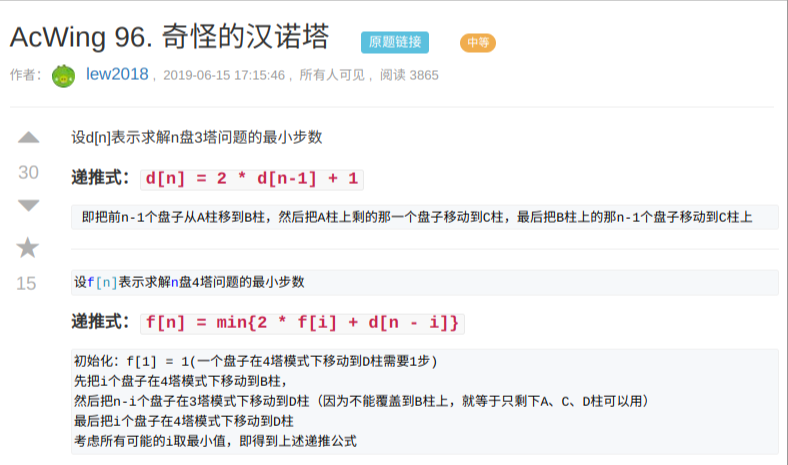
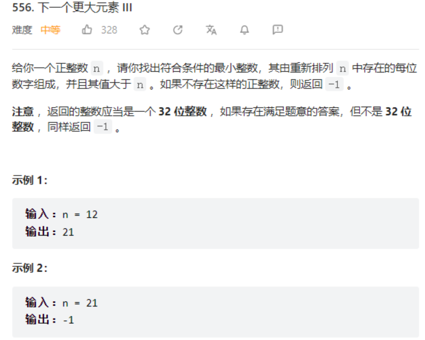

# 一段时间不做就生疏了

# 运行

- conda activate cpp  
- jupyter notebook --allow-root

- jupyter lab --allow-root -i ./


# STL函数

## STL简介

```
vector, 变长数组，倍增的思想
    size()  返回元素个数
    empty()  返回是否为空
    clear()  清空
    front()/back()
    push_back()/pop_back()  emplace_back()//直接构造
    begin()/end()
    []
    支持比较运算，按字典序

pair<int, int>
    first, 第一个元素
    second, 第二个元素
    支持比较运算，以first为第一关键字，以second为第二关键字（字典序）

string，字符串
    size()/length()  返回字符串长度
    empty()
    clear()
    substr(起始下标，(子串长度))  返回子串
    c_str()  返回字符串所在字符数组的起始地址

queue, 队列
    size()
    empty()
    push()  向队尾插入一个元素
    front()  返回队头元素
    back()  返回队尾元素
    pop()  弹出队头元素

priority_queue, 优先队列，默认是大根堆
    size()
    empty()
    push()  插入一个元素
    top()  返回堆顶元素
    pop()  弹出堆顶元素
    定义成小根堆的方式：priority_queue<int, vector<int>, greater<int>> q;

stack, 栈
    size()
    empty()
    push()  向栈顶插入一个元素
    top()  返回栈顶元素
    pop()  弹出栈顶元素

deque, 双端队列
    size()
    empty()
    clear()
    front()/back()
    push_back()/pop_back()
    push_front()/pop_front()
    begin()/end()
    []

set, map, multiset, multimap, 基于平衡二叉树（红黑树），动态维护有序序列
    size()
    empty()
    clear()
    begin()/end()
    ++, -- 返回前驱和后继，时间复杂度 O(logn)

    set/multiset
        insert()  插入一个数
        find()  查找一个数
        count()  返回某一个数的个数
        erase()
            (1) 输入是一个数x，删除所有x   O(k + logn)
            (2) 输入一个迭代器，删除这个迭代器
        lower_bound()/upper_bound()
            lower_bound(x)  返回大于等于x的最小的数的迭代器
            upper_bound(x)  返回大于x的最小的数的迭代器
    map/multimap
        insert()  插入的数是一个pair
        erase()  输入的参数是pair或者迭代器
        find()
        []  注意multimap不支持此操作。 时间复杂度是 O(logn)
        lower_bound()/upper_bound()

unordered_set, unordered_map, unordered_multiset, unordered_multimap, 哈希表
    和上面类似，增删改查的时间复杂度是 O(1)
    不支持 lower_bound()/upper_bound()， 迭代器的++，--

bitset, 圧位
    bitset<10000> s;
    ~, &, |, ^
    >>, <<
    ==, !=
    []

    count()  返回有多少个1

    any()  判断是否至少有一个1
    none()  判断是否全为0

    set()  把所有位置成1
    set(k, v)  将第k位变成v
    reset()  把所有位变成0
    flip()  等价于~
    flip(k) 把第k位取反
```


## [STL 常用操作](https://cloud.tencent.com/developer/article/2149799) 


**queue**


**deque**


**[unordered_map](https://blog.csdn.net/weixin_55267022/article/details/122689446)**   

哈希表，重载了[]操作可以insert


[**priority_queue**](https://cplusplus.com/reference/queue/priority_queue/)

按顺序排列，acwing的单调队列和栈是插入时候删除大于的元素，而stl的是不会删除，而是插进去


 [**set**](https://blog.csdn.net/weixin_52115456/article/details/124210086?spm=1001.2101.3001.6650.2&utm_medium=distribute.pc_relevant.none-task-blog-2%7Edefault%7ECTRLIST%7ERate-2-124210086-blog-132415308.235%5Ev38%5Epc_relevant_default_base&depth_1-utm_source=distribute.pc_relevant.none-task-blog-2%7Edefault%7ECTRLIST%7ERate-2-124210086-blog-132415308.235%5Ev38%5Epc_relevant_default_base&utm_relevant_index=5)

所有元素都会在插入时自动被排序


## [STL 中的常用算法](https://blog.csdn.net/KamikazePilot/article/details/127136271)

[lower_bound和upper_bound](https://blog.csdn.net/m0_72542983/article/details/128748604) 第一个大于等于和第一个大于

[**C++ lower_bound/upper_bound用法解析**](https://www.bilibili.com/read/cv18053710/)


> upper_bound返回的就是[begin, end)区间中第一个满足cmp(value, element)为true的数。
>
> 
>
> lower_bound的匿名函数element和value的顺序反过来了！lower_bound返回的是[begin, end)区间中第一个使cmp(element, value)为**false**的数
>
> 
>
> 有人可能会说了，lower_bound和upper_bound只能查找升序序列岂不是很废？那你一定是没有好好学sort ，显然，我们可以通过自定义比较函数来实现降序序列的查找:
>
> ```c
> bool cmp(const int& a,const int& b){
> 	return a>b;
> }
> lower_bound(a,a+n,val,cmp);
> upper_bound(a,a+n,val,cmp); 
> ```
>
> 

## [官方文档](https://cplusplus.com/reference/stl/)


# 写法

## [正则表达式](https://blog.csdn.net/m0_56312312/article/details/131059486)


## [匿名函数](https://www.cnblogs.com/conscience-remain/p/13722518.html)  
```c++
[捕获列表] (参数列表) mutable(可选) 异常属性 -> 返回类型 {  
// 函数体  
}
auto ok = [&](int x, int y) -> bool { // 不越界且不在墙上
            return x >= 0 && x < m && y >= 0 && y < n && grid[x][y] != '#';
        };
```


## 遍历容器
```c++
for(auto& x:time) x %=60;


unordered_map<int, int> cnt;
for (auto &[k, v] : cnt)
{
	ans += v * (v - 1) * 4;
}
```

## 同异或

~反

^异或


## n次方

pow函数

```
#include <iostream>
#include <cmath>
double a=2;
double b=3
cout<<pow(a,b)<<endl;
```

## static

```
static const int N = nums.size();
for(int i=0;i<N;i++) //报错

const int N = nums.size();
for(int i=0;i<N;i++) //不报错

```

## iota

### iota下标绑定排序

```c
iota(id.begin(), id.end(), 0);
sort(id.begin(), id.end(), [&](int i, int j)  {return indices[i] > indices[j];});
```

配合sort函数操作

> 
>
> - 3.1 什么时候用
>   有时候配合sort函数非常好用，多数组同时排序（比如说期末考试，按照分数排名的时候，排分数人名要跟着一起动）。
> - 3.2 怎么用
>   这个时候可以先用iota函数生成序列，此时序列里面存的值指向姓名和分数，有点类似构造了一个结构体。
>   对iota按照分数进行排序
>   最后就从这个数组按序遍历，数组里的号指向姓名和分数数组的对应位置
> - 3.3 优缺点分析
>   优点：非常简单，不需要额外针对这种类型的数据编写一个完整的排序法则
>   缺点：额外o(n)的空间复杂度
> - 例子：[花期内花的数目](https://leetcode.cn/problems/number-of-flowers-in-full-bloom/)

## [function](https://blog.csdn.net/qq_41317716/article/details/125839126?spm=1001.2101.3001.6650.6&utm_medium=distribute.pc_relevant.none-task-blog-2%7Edefault%7EBlogCommendFromBaidu%7ERate-6-125839126-blog-128697589.235%5Ev38%5Epc_relevant_sort_base3&depth_1-utm_source=distribute.pc_relevant.none-task-blog-2%7Edefault%7EBlogCommendFromBaidu%7ERate-6-125839126-blog-128697589.235%5Ev38%5Epc_relevant_sort_base3&utm_relevant_index=13)

```c++
  function<long long(int, int)> dfs = [&](int x, int fa) -> long long 
  {
  }
```

## ceil floor

> [a/b] = （a-1/b）+1

# 基础算法


## 排序

==很多题情况考虑不全，可能遇到很多swich case 就应该先排序一遍，使得其规律==


### 【[H 指数](https://leetcode.cn/problems/h-index/)】

> 给你一个整数数组 `citations` ，其中 `citations[i]` 表示研究者的第 `i` 篇论文被引用的次数。计算并返回该研究者的 **`h` 指数**。
>
> 根据维基百科上 [h 指数的定义](https://baike.baidu.com/item/h-index/3991452?fr=aladdin)：`h` 代表“高引用次数” ，一名科研人员的 `h` **指数** 是指他（她）至少发表了 `h` 篇论文，并且每篇论文 **至少** 被引用 `h` 次。如果 `h` 有多种可能的值，**`h` 指数** 是其中最大的那个。
>
>  
>
> **示例 1：**
>
> ```
> 输入：citations = [3,0,6,1,5]
> 输出：3 
> 解释：给定数组表示研究者总共有 5 篇论文，每篇论文相应的被引用了 3, 0, 6, 1, 5 次。
>      由于研究者有 3 篇论文每篇 至少 被引用了 3 次，其余两篇论文每篇被引用 不多于 3 次，所以她的 h 指数是 3。
> ```
>
> **示例 2：**
>
> ```
> 输入：citations = [1,3,1]
> 输出：1
> ```

```c++
class Solution {
public:
    int hIndex(vector<int>& citations) {
        sort(citations.begin(),citations.end());
        int res=0;
        for(vector<int>:: reverse_iterator iter=citations.rbegin();iter!=citations.rend();iter++)
        {
            if((*iter) <= res) break;
            //cout << *iter << endl;
            res++;
        }
        return res;
    }
};
```

### 【[咒语和药水的成功对数](https://leetcode.cn/problems/successful-pairs-of-spells-and-potions/)】

> 给你两个正整数数组 `spells` 和 `potions` ，长度分别为 `n` 和 `m` ，其中 `spells[i]` 表示第 `i` 个咒语的能量强度，`potions[j]` 表示第 `j` 瓶药水的能量强度。
>
> 同时给你一个整数 `success` 。一个咒语和药水的能量强度 **相乘** 如果 **大于等于** `success` ，那么它们视为一对 **成功** 的组合。
>
> 请你返回一个长度为 `n` 的整数数组 `pairs`，其中 `pairs[i]` 是能跟第 `i` 个咒语成功组合的 **药水** 数目。
>
>  
>
> **示例 1：**
>
> ```
> 输入：spells = [5,1,3], potions = [1,2,3,4,5], success = 7
> 输出：[4,0,3]
> 解释：
> - 第 0 个咒语：5 * [1,2,3,4,5] = [5,10,15,20,25] 。总共 4 个成功组合。
> - 第 1 个咒语：1 * [1,2,3,4,5] = [1,2,3,4,5] 。总共 0 个成功组合。
> - 第 2 个咒语：3 * [1,2,3,4,5] = [3,6,9,12,15] 。总共 3 个成功组合。
> 所以返回 [4,0,3] 。
> ```
>
> **示例 2：**
>
> ```
> 输入：spells = [3,1,2], potions = [8,5,8], success = 16
> 输出：[2,0,2]
> 解释：
> - 第 0 个咒语：3 * [8,5,8] = [24,15,24] 。总共 2 个成功组合。
> - 第 1 个咒语：1 * [8,5,8] = [8,5,8] 。总共 0 个成功组合。
> - 第 2 个咒语：2 * [8,5,8] = [16,10,16] 。总共 2 个成功组合。
> 所以返回 [2,0,2] 。
> ```

```c++
class Solution {
public:
    vector<int> successfulPairs(vector<int>& spells, vector<int>& potions, long long success) {
        int n = spells.size(),m = potions.size(),cnt=0,last=0;
        vector<int> id(n),res(n);
        iota(id.begin(), id.end(), 0); // id[i] = i
        sort(id.begin(), id.end(), [&](int i, int j) { return spells[i] < spells[j]; });
        sort(potions.begin(),potions.end(),greater<int>());
        int j=0,i=0;
        for(i;i<n;i++)
            for(j;j<m;j++)
                if((long long)spells[id[i]]*potions[j]>=success)
                {
                    cnt++;
                }
                else{
                    last = i+1;
                    //cout << id[i] << cnt <<endl;
                    res[id[i]]=cnt;
                    break;
                }
        while(last<n)
        {
            res[id[last]]=cnt;  
            last++; 
        } 
        return res;
    }
};
```

### 【[最大和查询](https://leetcode.cn/problems/maximum-sum-queries/)】

> 你两个长度为 `n` 、下标从 **0** 开始的整数数组 `nums1` 和 `nums2` ，另给你一个下标从 **1** 开始的二维数组 `queries` ，其中 `queries[i] = [xi, yi]` 。
>
> 对于第 `i` 个查询，在所有满足 `nums1[j] >= xi` 且 `nums2[j] >= yi` 的下标 `j` `(0 <= j < n)` 中，找出 `nums1[j] + nums2[j]` 的 **最大值** ，如果不存在满足条件的 `j` 则返回 **-1** 。
>
> 返回数组 `answer` *，*其中 `answer[i]` 是第 `i` 个查询的答案。
>
>  
>
> **示例 1：**
>
> ```
> 输入：nums1 = [4,3,1,2], nums2 = [2,4,9,5], queries = [[4,1],[1,3],[2,5]]
> 输出：[6,10,7]
> 解释：
> 对于第 1 个查询：xi = 4 且 yi = 1 ，可以选择下标 j = 0 ，此时 nums1[j] >= 4 且 nums2[j] >= 1 。nums1[j] + nums2[j] 等于 6 ，可以证明 6 是可以获得的最大值。
> 对于第 2 个查询：xi = 1 且 yi = 3 ，可以选择下标 j = 2 ，此时 nums1[j] >= 1 且 nums2[j] >= 3 。nums1[j] + nums2[j] 等于 10 ，可以证明 10 是可以获得的最大值。
> 对于第 3 个查询：xi = 2 且 yi = 5 ，可以选择下标 j = 3 ，此时 nums1[j] >= 2 且 nums2[j] >= 5 。nums1[j] + nums2[j] 等于 7 ，可以证明 7 是可以获得的最大值。
> 因此，我们返回 [6,10,7] 。
> ```
>
> **示例 2：**
>
> ```
> 输入：nums1 = [3,2,5], nums2 = [2,3,4], queries = [[4,4],[3,2],[1,1]]
> 输出：[9,9,9]
> 解释：对于这个示例，我们可以选择下标 j = 2 ，该下标可以满足每个查询的限制。
> ```

```c++
class Solution {
public:
    typedef pair<int,int> PII;
    struct com{
        bool operator() (PII a,PII b)
        {
            return  a.first + a.second > b.first + b.second;
        }
    };
    vector<int> maximumSumQueries(vector<int>& nums1, vector<int>& nums2, vector<vector<int>>& queries) {
        //优先队列
        map<PII,int> umap;
        int n = nums1.size();
        vector<int> res;
        vector<PII> nums;
        for(int i=0;i< n;i++)
        {
            nums.push_back({nums1[i],nums2[i]});
        }
        sort(nums.begin(),nums.end(),com());

        for(int i=0;i<queries.size();i++)
        {
            if(umap[{queries[i][0],queries[i][1]}])
            {
                res.push_back(umap[{queries[i][0],queries[i][1]}]);
                continue;
            } 
            for(int j=0;j<nums.size();j++)
            {
               
                if(queries[i][0]<=nums[j].first&&queries[i][1]<=nums[j].second)
                {
                    res.push_back(nums[j].first + nums[j].second);
                    umap[{queries[i][0],queries[i][1]}] = nums[j].first + nums[j].second;
                    break;
                }  
            }
            if(res.size()==i) res.push_back(-1);
        }

        //for(auto x:nums) 
        //    cout << x.first<< x.second <<  endl;
        
        return res;
    }
};

```


## 二分

[二分边界](https://blog.csdn.net/m0_64548487/article/details/132590215)

> ​		区间划分不重叠，左半部分区间为[l,mid]右半部分区间为[ mid+1,r]。
>
> ​		
>
> mid值更新：在找左半边区间分界点的时候，如果check（）结果为true，那么答案一定在mid的右边并且包括mid，所以为true时 r=mid;为false时，答案一定在mid左边，并且不包括mid，所以为false时l=mid+1;同理可推寻找右边区间分界点时的结果。
>
> 
>
>    求左端和右端分界点，mid取值不同。一个小口诀，==男左女右（判断为true时） 男是一 所以加一 女是零所以不用加 （真的很好用）==。

​    

```c++

bool check(int x) {/* ... */} // 检查x是否满足某种性质
 
// 区间[l, r]被划分成[l, mid]和[mid + 1, r]时使用：
int bsearch_1(int l, int r)
{
    while (l < r)
    {
        int mid = l + r >> 1;		//女+0
        if (check(mid)) r = mid;    //女右
        else l = mid + 1;
    }
    return l;
}
// 区间[l, r]被划分成[l, mid - 1]和[mid, r]时使用：
int bsearch_2(int l, int r)
{
    while (l < r)
    {
        int mid = l + r + 1 >> 1;	//男+1
        if (check(mid)) l = mid;   //男右
        else r = mid - 1;
    }
    return l;
```

https://blog.csdn.net/qq_62417282/article/details/127862093


```c
#include<iostream>
 
using namespace std;
 
const int N = 100010;
int n,q;
int a[N];
 
int main()
{
    cin >> n >> q;
    for(int i = 0; i < n; i++) cin >> a[i];
    
    while(q--)
    {
        int x;
        cin >> x;
        int l = 0, r = n - 1;
        while(l < r)
        {
            int mid = l + r >> 1;
            if(a[mid] >= x) r = mid;
            else l = mid + 1;
        }
        if(a[l] != x)
        {
            cout << "-1 -1" << endl;
            continue;
        }
        cout << l << " ";
        l = 0, r = n - 1;
        while(l < r)
        {
            int mid = l + r + 1 >> 1;
            if(a[mid] <= x) l = mid;
            else r = mid - 1;
        }
        cout << l << endl;
    }
    
    return 0;
}
```


- 看到==「最大化最小值」或者「最小化最大值」==就要想到二分答案，这是一个固定的套路

- 当答案是单调函数而且不好求解就想到二分

- ```cpp
  sort(num,num+6);                           //按从小到大排序 
      int pos1=lower_bound(num,num+6,7)-num;    //返回数组中第一个大于或等于被查数的值 
      int pos2=upper_bound(num,num+6,7)-num;    //返回数组中第一个大于被查数的值
      cout<<pos1<<" "<<num[pos1]<<endl;
      cout<<pos2<<" "<<num[pos2]<<endl;
      sort(num,num+6,cmd);                      //按从大到小排序
      int pos3=lower_bound(num,num+6,7,greater<int>())-num;  //返回数组中第一个小于或等于被查数的值 
      int pos4=upper_bound(num,num+6,7,greater<int>())-num;  //返回数组中第一个小于被查数的值 
      cout<<pos3<<" "<<num[pos3]<<endl;
      cout<<pos4<<" "<<num[pos4]<<endl;
  
  内置方法是二分
  ```

### 【[修车的最少时间](https://leetcode.cn/problems/minimum-time-to-repair-cars/)】

> 给你一个整数数组 `ranks` ，表示一些机械工的 **能力值** 。`ranksi` 是第 `i` 位机械工的能力值。能力值为 `r` 的机械工可以在 `r * n2` 分钟内修好 `n` 辆车。
>
> 同时给你一个整数 `cars` ，表示总共需要修理的汽车数目。
>
> 请你返回修理所有汽车 **最少** 需要多少时间。
>
> **注意：**所有机械工可以同时修理汽车。
>
>  
>
> **示例 1：**
>
> ```
> 输入：ranks = [4,2,3,1], cars = 10
> 输出：16
> 解释：
> - 第一位机械工修 2 辆车，需要 4 * 2 * 2 = 16 分钟。
> - 第二位机械工修 2 辆车，需要 2 * 2 * 2 = 8 分钟。
> - 第三位机械工修 2 辆车，需要 3 * 2 * 2 = 12 分钟。
> - 第四位机械工修 4 辆车，需要 1 * 4 * 4 = 16 分钟。
> 16 分钟是修理完所有车需要的最少时间。
> ```
>
> **示例 2：**
>
> ```
> 输入：ranks = [5,1,8], cars = 6
> 输出：16
> 解释：
> - 第一位机械工修 1 辆车，需要 5 * 1 * 1 = 5 分钟。
> - 第二位机械工修 4 辆车，需要 1 * 4 * 4 = 16 分钟。
> - 第三位机械工修 1 辆车，需要 8 * 1 * 1 = 8 分钟。
> 16 分钟时修理完所有车需要的最少时间。
> ```

```c++
class Solution {
public:

    long long t_repair(long long time,vector<int>& ranks)
    {
        long long res=0;
        for(int x:ranks) res+=(long long)(sqrt(time/x));
        return res;
    }

    long long repairCars(vector<int>& ranks, int cars) {
        int min_r = *min_element(ranks.begin(), ranks.end());
        long long left = 0, right = (long long)min_r * cars * cars;
        while(left<right)
        {
            long long min = (left + right)/2;
            if(t_repair(min,ranks)<cars) left =min+1;
            else right =min;
        }
        return right;
    }
};
```


### 【求根号】

**二分**

浮点数的看acwing的二分

```c++
class Solution {
public:
    int mySqrt(int x) {
        int l=0,r=x,mid=0;
        while(l<=r)
        {
            mid = l + (r- l)/2  ; //下取整左边界l需要+1
            if((long long)mid*mid<=x)  l = mid + 1;
            else r =mid-1;
        }
        return r;
    }
};
```

**牛顿法**

也可是浮点数

```c++
class Solution {
public:
    int mySqrt(int x) {
        if(!x) return 0;
        double x0 = x,res;
        while(true) //while(abs(res*res-x)>1e-7)乘法耗时
        {
            res =  0.5*(x0 + x/x0);
             if(fabs(res - x0) < 1e-7) {
                break;
            }
            x0 = res;
        }
        return int(res);
    }
};
```

**快速平法根倒数**

抽象强

### 【[打家劫舍 IV](https://leetcode.cn/problems/house-robber-iv/)】

> 沿街有一排连续的房屋。每间房屋内都藏有一定的现金。现在有一位小偷计划从这些房屋中窃取现金。
>
> 由于相邻的房屋装有相互连通的防盗系统，所以小偷 **不会窃取相邻的房屋** 。
>
> 小偷的 **窃取能力** 定义为他在窃取过程中能从单间房屋中窃取的 **最大金额** 。
>
> 给你一个整数数组 `nums` 表示每间房屋存放的现金金额。形式上，从左起第 `i` 间房屋中放有 `nums[i]` 美元。
>
> 另给你一个整数 `k` ，表示窃贼将会窃取的 **最少** 房屋数。小偷总能窃取至少 `k` 间房屋。
>
> 返回小偷的 **最小** 窃取能力。
>
>  
>
> **示例 1：**
>
> ```
> 输入：nums = [2,3,5,9], k = 2
> 输出：5
> 解释：
> 小偷窃取至少 2 间房屋，共有 3 种方式：
> - 窃取下标 0 和 2 处的房屋，窃取能力为 max(nums[0], nums[2]) = 5 。
> - 窃取下标 0 和 3 处的房屋，窃取能力为 max(nums[0], nums[3]) = 9 。
> - 窃取下标 1 和 3 处的房屋，窃取能力为 max(nums[1], nums[3]) = 9 。
> 因此，返回 min(5, 9, 9) = 5 。
> ```
>
> **示例 2：**
>
> ```
> 输入：nums = [2,7,9,3,1], k = 2
> 输出：2
> 解释：共有 7 种窃取方式。窃取能力最小的情况所对应的方式是窃取下标 0 和 4 处的房屋。返回 max(nums[0], nums[4]) = 2 。
> ```

换句话理解就是选k个不相邻的房子，最大值（f） 最小是几(二分的数)  


排序然后，位置相邻+1   不行  

×  最小的可能选不到[9,6,20,21,8]，最大值最小其实对于很多的选法不是固定的


对于偷取能力最小多少， 最多可以偷取到房子数大于k间
对偷取能力二分，求出来最小为多少可以偷到k间屋子

```c++
class Solution {
    //偷取能力为mx,能否偷到k间屋子
    bool check(vector<int> &nums, int k, int mx) {
        int cnt = 0, n = nums.size();
        for (int i = 0; i < n; i++) {
            if (nums[i] <= mx) {
                cnt++; // 偷 nums[i]
                i++; // 跳过下一间房子
            }
        }
        return cnt >= k;
    }

public:
    int minCapability(vector<int> &nums, int k) {
        //二分
        int left = 0, right = *max_element(nums.begin(), nums.end());
        while (left + 1 < right) { // 开区间写法
            int mid = left + (right - left) / 2;
            (check(nums, k, mid) ? right : left) = mid;
        }
        return right;
    }
};

```


## 高精度


## 前缀和与差分

### 【连续子数组和 】 

  
  

### 【[ 移动机器人](https://leetcode.cn/problems/movement-of-robots/)】

> 有一些机器人分布在一条无限长的数轴上，他们初始坐标用一个下标从 **0** 开始的整数数组 `nums` 表示。当你给机器人下达命令时，它们以每秒钟一单位的速度开始移动。
>
> 给你一个字符串 `s` ，每个字符按顺序分别表示每个机器人移动的方向。`'L'` 表示机器人往左或者数轴的负方向移动，`'R'` 表示机器人往右或者数轴的正方向移动。
>
> 当两个机器人相撞时，它们开始沿着原本相反的方向移动。
>
> 请你返回指令重复执行 `d` 秒后，所有机器人之间两两距离之和。由于答案可能很大，请你将答案对 `109 + 7` 取余后返回。
>
> **注意：**
>
> - 对于坐标在 `i` 和 `j` 的两个机器人，`(i,j)` 和 `(j,i)` 视为相同的坐标对。也就是说，机器人视为无差别的。
> - 当机器人相撞时，它们 **立即改变** 它们的前进方向，这个过程不消耗任何时间。
> - 当两个机器人在同一时刻占据相同的位置时，就会相撞。
>   - 例如，如果一个机器人位于位置 0 并往右移动，另一个机器人位于位置 2 并往左移动，下一秒，它们都将占据位置 1，并改变方向。再下一秒钟后，第一个机器人位于位置 0 并往左移动，而另一个机器人位于位置 2 并往右移动。
>   - 例如，如果一个机器人位于位置 0 并往右移动，另一个机器人位于位置 1 并往左移动，下一秒，第一个机器人位于位置 0 并往左行驶，而另一个机器人位于位置 1 并往右移动。
>
>  
>
> **示例 1：**
>
> ```
> 输入：nums = [-2,0,2], s = "RLL", d = 3
> 输出：8
> 解释：
> 1 秒后，机器人的位置为 [-1,-1,1] 。现在下标为 0 的机器人开始往左移动，下标为 1 的机器人开始往右移动。
> 2 秒后，机器人的位置为 [-2,0,0] 。现在下标为 1 的机器人开始往左移动，下标为 2 的机器人开始往右移动。
> 3 秒后，机器人的位置为 [-3,-1,1] 。
> 下标为 0 和 1 的机器人之间距离为 abs(-3 - (-1)) = 2 。
> 下标为 0 和 2 的机器人之间的距离为 abs(-3 - 1) = 4 。
> 下标为 1 和 2 的机器人之间的距离为 abs(-1 - 1) = 2 。
> 所有机器人对之间的总距离为 2 + 4 + 2 = 8 。
> ```
>
> **示例 2：**
>
> ```
> 输入：nums = [1,0], s = "RL", d = 2
> 输出：5
> 解释：
> 1 秒后，机器人的位置为 [2,-1] 。
> 2 秒后，机器人的位置为 [3,-2] 。
> 两个机器人的距离为 abs(-2 - 3) = 5 。
> ```
>
>  
>
> **提示：**
>
> - `2 <= nums.length <= 105`
> - `-2 * 109 <= nums[i] <= 2 * 109`
> - `0 <= d <= 109`
> - `nums.length == s.length `
> - `s` 只包含 `'L'` 和 `'R'` 。
> - `nums[i]` 互不相同。

```c++
class Solution {
public:
    typedef long long LL;
    int sumDistance(vector<int>& nums, string s, int d) {
        const int N = nums.size();
        int direct[N];
        vector<LL> a(N);
        int mod  = (1e9 +7);
        for(int i=0;i<N;i++){
            direct[i] =  s[i] == 'L'? -1:1;
        }
        //for(auto x:direct) cout << x << " ";


        for(int i=0;i<N;i++)
        {
            a[i] =  (nums[i] + (LL)direct[i]*d);
        }
        
        sort(a.begin(), a.end());

        LL res=0,sum=0;
        for(int i=0;i<N;i++)
        {   
            
            res = (res + i * a[i] - sum) % mod;
            sum += a[i];
            //  for(int j=i;j<N;j++)
            //  {
            //     //cout << nums[i] <<" " <<nums[j] << endl;
            //     res = (res +abs(nums[i] - nums[j])% mod) % mod;
            // }
            //两层循环超时
        }

        return res;
    }
};

//一秒秒的运行然后移动和判断是否碰撞改变direct
//更新方向
//移动

//结果是脑筋急转弯
//其实碰撞不影响所有的距离

```

### 【[花期内花的数目](https://leetcode.cn/problems/number-of-flowers-in-full-bloom/)-好题】


[算法课堂差分数组](https://leetcode.cn/circle/discuss/FfMCgb/)

hashmap但是暴力的把区间+1超时

```c++
class Solution {
public:
    vector<int> fullBloomFlowers(vector<vector<int>>& flowers, vector<int>& people) {
        unordered_map<int,int> opennums;
        const int n=flowers.size(),m = people.size();
        for(int i=0;i<n;i++)
        {
            for(int j=flowers[i][0];j<=flowers[i][1];j++)//优化掉这个不能一个个加，复杂度上去了，前缀和加1减1
            opennums[j]++;
        }
        // for(auto &[k, v]:opennums) cout << k << " " << v << endl;
        vector<int>  res;
        for(auto x: people) res.push_back(opennums[x]);
        return res;
    }
};
//多次查询所以一定是预处理出所有来访时间的开花数目

```

数组前缀和超内存

```
class Solution {
public:
    vector<int> fullBloomFlowers(vector<vector<int>>& flowers, vector<int>& people) {
        const int N = 1e9 + 7;
        int a[N],sum[N];
        memset(a,0,sizeof a);
        const int n=flowers.size(),m = people.size();
        for(int i=0;i<n;i++)
        {
           a[flowers[i][0]] ++;
           a[flowers[i][1]+1] --;
        }
        sum[0] = a[0];    
        for(int i=1;i<N;i++)
        {
            sum[i] = sum[i-1] =a[i];
        }
        vector<int>  res;
        for(auto x: people) res.push_back(res[x]);
        return res;
    }
};
//多次查询所以一定是预处理出所有来访时间的开花数目

```

所以应该是在map（可排序）的基础上，算前缀和

边算前缀和变存people的结果，people也是无序的

==iota + sort==，不打乱people的顺序对people值排序

```c++
class Solution {
public:
    vector<int> fullBloomFlowers(vector<vector<int>> &flowers, vector<int> &people) {
        map<int, int> diff;
        for (auto &f : flowers) {
            diff[f[0]]++;
            diff[f[1] + 1]--;
        }

        int n = people.size();
        vector<int> id(n);
        iota(id.begin(), id.end(), 0); // id[i] = i
        (id.begin(), id.end(), [&](int i, int j) { return people[i] < people[j]; });

        auto it = diff.begin();
        int sum = 0;
        for (int i : id) {
            while (it != diff.end() && it->first <= people[i])
                sum += it++->second; // 累加不超过 people[i] 的差分值
            people[i] = sum; // 从而得到这个时刻花的数量
        }
        return people;
    }
};

作者：灵茶山艾府
链接：https://leetcode.cn/problems/number-of-flowers-in-full-bloom/
来源：力扣（LeetCode）
著作权归作者所有。商业转载请联系作者获得授权，非商业转载请注明出处。
    

```

自己又写了一遍

```c++

class Solution {
public:
    vector<int> fullBloomFlowers(vector<vector<int>>& flowers, vector<int>& people) {
        
        int n = people.size();
        map<int,int> diff;
        for(auto f:flowers)
        {
            diff[f[0]] ++;
            diff[f[1]+1] --;
        }
        vector<int> idx(n);
        iota(idx.begin(),idx.end(),0);
        sort(idx.begin(),idx.end(),[&](int x,int y){
           return people[x] < people[y];
        });
        int sum=0;
        auto it = diff.begin();
        for(int i=0;i<n;i++)
        {
            while(it != diff.end() && it->first <= people[idx[i]])
                sum+=it++->second;
            people[idx[i]] = sum;
        }
       
        return people;
    }
};
//多次查询所以一定是预处理出所有来访时间的开花数目

    
```

==这题还可以把所有花的开始和结束日期存下来，然后排序。然后开花个数就等于所有的当前日期之前的开花个数-结束个数==

### 【[切割后面积最大的蛋糕](https://leetcode.cn/problems/maximum-area-of-a-piece-of-cake-after-horizontal-and-vertical-cuts/)】

> 
>
> 矩形蛋糕的高度为 `h` 且宽度为 `w`，给你两个整数数组 `horizontalCuts` 和 `verticalCuts`，其中：
>
> -  `horizontalCuts[i]` 是从矩形蛋糕顶部到第 `i` 个水平切口的距离
> - `verticalCuts[j]` 是从矩形蛋糕的左侧到第 `j` 个竖直切口的距离
>
> 请你按数组 *`horizontalCuts`* 和 *`verticalCuts`* 中提供的水平和竖直位置切割后，请你找出 **面积最大** 的那份蛋糕，并返回其 **面积** 。由于答案可能是一个很大的数字，因此需要将结果 **对** `109 + 7` **取余** 后返回。
>
>  
>
> **示例 1：**
>
> 
>
> ```
> 输入：h = 5, w = 4, horizontalCuts = [1,2,4], verticalCuts = [1,3]
> 输出：4 
> 解释：上图所示的矩阵蛋糕中，红色线表示水平和竖直方向上的切口。切割蛋糕后，绿色的那份蛋糕面积最大。
> ```
>
> **示例 2：**
>
> ****
>
> ```
> 输入：h = 5, w = 4, horizontalCuts = [3,1], verticalCuts = [1]
> 输出：6
> 解释：上图所示的矩阵蛋糕中，红色线表示水平和竖直方向上的切口。切割蛋糕后，绿色和黄色的两份蛋糕面积最大。
> ```

```
class Solution {
public:
    int maxArea(int h, int w, vector<int>& horizontalCuts, vector<int>& verticalCuts) {
        int mod = (1e9+7);
        int n = horizontalCuts.size(),m = verticalCuts.size();
        sort(horizontalCuts.begin(),horizontalCuts.end());
        sort(verticalCuts.begin(),verticalCuts.end());

        int h_max = horizontalCuts[0],w_max = verticalCuts[0];

        for(int i=0;i<n-1;i++)
        {
            horizontalCuts[i] = horizontalCuts[i+1] -  horizontalCuts[i];
        }
        horizontalCuts[n-1] = h - horizontalCuts[n-1];
        for(int i=0;i<m-1;i++)
        {
            verticalCuts[i] = verticalCuts[i+1] -  verticalCuts[i];
        }
        verticalCuts[m-1] = w - verticalCuts[m-1];

        

        for(int i=0;i<n;i++)
        {
            //cout << horizontalCuts[i] << endl;
            h_max = max(h_max,horizontalCuts[i]);
        }
         for(int i=0;i<m;i++)
        {
            //cout << verticalCuts[i] << endl;
            w_max = max(w_max,verticalCuts[i]);
        }
        return (long long)w_max * h_max%mod;
    }
};
//求差分，再求乘积
```

### 【[用邮票贴满网格图](https://leetcode.cn/problems/stamping-the-grid/)】

> 给你一个 `m x n` 的二进制矩阵 `grid` ，每个格子要么为 `0` （空）要么为 `1` （被占据）。
>
> 给你邮票的尺寸为 `stampHeight x stampWidth` 。我们想将邮票贴进二进制矩阵中，且满足以下 **限制** 和 **要求** ：
>
> 1. 覆盖所有 **空** 格子。
> 2. 不覆盖任何 **被占据** 的格子。
> 3. 我们可以放入任意数目的邮票。
> 4. 邮票可以相互有 **重叠** 部分。
> 5. 邮票不允许 **旋转** 。
> 6. 邮票必须完全在矩阵 **内** 。
>
> 如果在满足上述要求的前提下，可以放入邮票，请返回 `true` ，否则返回 `false` 。
>
>  
>
> **示例 1：**
>
> 
>
> ```
> 输入：grid = [[1,0,0,0],[1,0,0,0],[1,0,0,0],[1,0,0,0],[1,0,0,0]], stampHeight = 4, stampWidth = 3
> 输出：true
> 解释：我们放入两个有重叠部分的邮票（图中标号为 1 和 2），它们能覆盖所有与空格子。
> ```


```c++
class Solution {
public:
    bool possibleToStamp(vector<vector<int>> &grid, int stampHeight, int stampWidth) {
        int m = grid.size(), n = grid[0].size();

        // 1. 计算 grid 的二维前缀和
        vector<vector<int>> s(m + 1, vector<int>(n + 1));
        for (int i = 0; i < m; i++) {
            for (int j = 0; j < n; j++) {
                s[i + 1][j + 1] = s[i + 1][j] + s[i][j + 1] - s[i][j] + grid[i][j];
            }
        }

        // 2. 计算二维差分
        // 为方便第 3 步的计算，在 d 数组的最上面和最左边各加了一行（列），所以下标要 +1
        vector<vector<int>> d(m + 2, vector<int>(n + 2));
        for (int i2 = stampHeight; i2 <= m; i2++) {
            for (int j2 = stampWidth; j2 <= n; j2++) {
                int i1 = i2 - stampHeight + 1;
                int j1 = j2 - stampWidth + 1;
                if (s[i2][j2] - s[i2][j1 - 1] - s[i1 - 1][j2] + s[i1 - 1][j1 - 1] == 0) {
                    d[i1][j1]++;
                    d[i1][j2 + 1]--;
                    d[i2 + 1][j1]--;
                    d[i2 + 1][j2 + 1]++;
                }
            }
        }

        // 3. 还原二维差分矩阵对应的计数矩阵（原地计算）
        for (int i = 0; i < m; i++) {
            for (int j = 0; j < n; j++) {
                d[i + 1][j + 1] += d[i + 1][j] + d[i][j + 1] - d[i][j];
                if (grid[i][j] == 0 && d[i + 1][j + 1] == 0) {
                    return false;
                }
            }
        }
        return true;
    }
};

作者：灵茶山艾府
链接：https://leetcode.cn/problems/stamping-the-grid/
来源：力扣（LeetCode）
著作权归作者所有。商业转载请联系作者获得授权，非商业转载请注明出处。
```

前缀和求格子内的障碍格的数量，

如果if (s[i2][j2] - s[i2][j1 - 1] - s[i1 - 1][j2] + s[i1 - 1][j1 - 1] == 0)   说明区域内没有障碍格就贴

cnt先记差分，最后求一遍前缀和

[题解](https://leetcode.cn/problems/stamping-the-grid/solutions/2562069/yong-you-piao-tie-man-wang-ge-tu-by-leet-kiaq/?envType=daily-question&envId=2024-01-04)

## 双指针

### 【[无重复字符的最长子串](https://leetcode.cn/problems/longest-substring-without-repeating-characters/)】

> 
>
> 给定一个字符串 `s` ，请你找出其中不含有重复字符的 **最长子串** 的长度。
>
>  
>
> **示例 1:**
>
> ```
> 输入: s = "abcabcbb"
> 输出: 3 
> 解释: 因为无重复字符的最长子串是 "abc"，所以其长度为 3。
> ```
>
> **示例 2:**
>
> ```
> 输入: s = "bbbbb"
> 输出: 1
> 解释: 因为无重复字符的最长子串是 "b"，所以其长度为 1。
> ```
>
> **示例 3:**
>
> ```
> 输入: s = "pwwkew"
> 输出: 3
> 解释: 因为无重复字符的最长子串是 "wke"，所以其长度为 3。
>      请注意，你的答案必须是 子串 的长度，"pwke" 是一个子序列，不是子串
> ```

因为unordered_map的初始值是0，判断h[x]>=p的时候在第一个指针在开头的时候会出问题

```c++
class Solution {
public:
    int lengthOfLongestSubstring(string s) {
        if(!s.size()) return 0;
        unordered_map<int,int> h;
        int p=1,res = 1;
        h[s[0]] = 1;
        for(int i=1;i<s.size();i++)
        {
            int x = s[i];
            if(h[x]>=p) p = h[x]+1;
            h[x] = i+1;
            //cout << p << s[i]<<endl;
            res = max(res,i-p+2);
        }

        return res;
    }
};
//hashmap+双指针
```


## 位运算


### 【[只出现一次的数字](https://leetcode.cn/problems/single-number/)】
 
***我用的查找，效率很低***

```c++
class Solution {
public:
    int singleNumber(vector<int>& nums) {
        int len = nums.size();
        vector<int> temp;
        for(vector<int>::iterator iter=nums.begin();iter!=nums.end();iter++)
        {
            cout<<*iter<<endl;
            vector<int>::iterator iter_find = find(temp.begin(),temp.end(),*iter);
            if(iter_find==temp.end())
            {
                temp.insert(temp.end(),*iter);
            }
            else
            {
                temp.erase(iter_find);
            }
        }
        cout<<temp.front()<<endl;
        return temp.front();
    }
};
```
***可以用hashmap***
```java
class Solution {
    public int singleNumber(int[] nums) {
        Map<Integer, Integer> map = new HashMap<>();
        for (Integer i : nums) {
            Integer count = map.get(i);
            count = count == null ? 1 : ++count;
            map.put(i, count);
        }
        for (Integer i : map.keySet()) {
            Integer count = map.get(i);
            if (count == 1) {
                return i;
            }
        }
        return -1; // can't find it.
    }
}

```
***位运算***
  

### 【[只出现一次的数字 II](https://leetcode.cn/problems/single-number-ii/)】

**哈希解**

> 给你一个整数数组 `nums` ，除某个元素仅出现 **一次** 外，其余每个元素都恰出现 **三次 。**请你找出并返回那个只出现了一次的元素。
>
> 你必须设计并实现线性时间复杂度的算法且使用常数级空间来解决此问题。
>
> 
>
> **示例 1：**
>
> ```
> 输入：nums = [2,2,3,2]
> 输出：3
> ```
>
> **示例 2：**
>
> ```
> 输入：nums = [0,1,0,1,0,1,99]
> 输出：99
> ```
>
> **提示：**
>
> - `1 <= nums.length <= 3 * 104`
> - `-231 <= nums[i] <= 231 - 1`
> - `nums` 中，除某个元素仅出现 **一次** 外，其余每个元素都恰出现 **三次**

```c++
class Solution {
public:
    int singleNumber(vector<int>& nums) {
        unordered_map<int,int> cnt;
        for(auto x:nums)
        {
            cnt[x] ++;
        }
        for(auto x:cnt)
        {
            if(x.second!=3) return x.first;
        }
        return -1;
    }
};

```

**统计每一位的个数**


```c++
class Solution {
public:
    int singleNumber(vector<int> &nums) {
        int ans = 0;
        for (int i = 0; i < 32; i++) {
            int cnt1 = 0;
            for (int x: nums) {
                cnt1 += x >> i & 1;
            }
            ans |= cnt1 % 3 << i;
        }
        return ans;
    }
};

```

**纯位运算**


```c++
class Solution {
public:
    int singleNumber(vector<int> &nums) {
        int a = 0, b = 0;
        for (int x: nums) {
            int tmp_a = a;
            a = (a ^ x) & (a | b);
            b = (b ^ x) & ~tmp_a;
        }
        return b;
    }
};

```

### 【[环和杆](https://leetcode.cn/problems/rings-and-rods/)】

> 总计有 `n` 个环，环的颜色可以是红、绿、蓝中的一种。这些环分别穿在 10 根编号为 `0` 到 `9` 的杆上。
>
> 给你一个长度为 `2n` 的字符串 `rings` ，表示这 `n` 个环在杆上的分布。`rings` 中每两个字符形成一个 **颜色位置对** ，用于描述每个环：
>
> - 第 `i` 对中的 **第一个** 字符表示第 `i` 个环的 **颜色**（`'R'`、`'G'`、`'B'`）。
> - 第 `i` 对中的 **第二个** 字符表示第 `i` 个环的 **位置**，也就是位于哪根杆上（`'0'` 到 `'9'`）。
>
> 例如，`"R3G2B1"` 表示：共有 `n == 3` 个环，红色的环在编号为 3 的杆上，绿色的环在编号为 2 的杆上，蓝色的环在编号为 1 的杆上。
>
> 找出所有集齐 **全部三种颜色** 环的杆，并返回这种杆的数量。
>
>  
>
> **示例 1：**
>
> 
>
> ```
> 输入：rings = "B0B6G0R6R0R6G9"
> 输出：1
> 解释：
> - 编号 0 的杆上有 3 个环，集齐全部颜色：红、绿、蓝。
> - 编号 6 的杆上有 3 个环，但只有红、蓝两种颜色。
> - 编号 9 的杆上只有 1 个绿色环。
> 因此，集齐全部三种颜色环的杆的数目为 1 。
> ```

```c++
class Solution {
public:
    int countPoints(string rings) {
        int l[10];
        memset(l,0,sizeof l);
        for(int i=0;i<rings.size();i++)
        {
            if(rings[i]=='B') l[rings[i+1]- '0']  |=  1;
            if(rings[i]=='G') l[rings[i+1] - '0'] |=  2;
            if(rings[i]=='R') l[rings[i+1] - '0'] |= 4;
            i++;
        }
        // for(auto x:l)
        //     cout << x << endl;
        int res = 0;
        for(auto x:l) 
        {
            if (x==7) res++;
        }
        return res ;
    }
};
```

### 【[最大单词长度乘积](https://leetcode.cn/problems/maximum-product-of-word-lengths/)】

暴力超时

```c++
class Solution {
public:
    bool same(string a,string b)
    {
        for(char c:a)
            for(char u:b)
                if(u==c) return true;
        return false;
    }

    int maxProduct(vector<string>& words) {
        
        int res=0;
        for(int i=0;i<words.size(); i++)
        {
            for(int j=0;j<words.size(); j++)
            {
                //cout << words[i] << endl;
                if(!same(words[i],words[j]))
                {
                    //cout << i << j << endl;
                    //cout << words[i].size()* words[j].size() << endl;
                    res=max(res,int(words[i].size()* words[j].size()));
                }
            }
                
        }
            
        return res;
    }
};
```

排序超时，2logn

```c++
class Solution {
public:
    bool same(string a,string b)
    {
        for(char c:a)
            for(char u:b)
                if(u==c) return true;
        return false;
    }

    int maxProduct(vector<string>& words) {
        typedef pair<int,int> PII;
        vector<PII> p;
        for(int i=0;i<words.size(); i++)
            for(int j=0;j<words.size(); j++)
                p.push_back({i,j});

        sort(p.begin(),p.end(),[&](PII a,PII b)
        {
            return words[a.first].size() * words[a.second].size() > words[b.first].size() * words[b.second].size();
        });
 
        for(auto t:p)
        {
            if(!same(words[t.first],words[t.second]))
            {
                return  words[t.first].size() * words[t.second].size();
            }
        }
        return 0;
    }
};
```

预处理每一个字符串的26位表示每一个字母是否出现过

```c++
class Solution {
public:
    int maxProduct(vector<string>& words) {
        int length = words.size();
        vector<int> masks(length);
        for (int i = 0; i < length; i++) {
            string word = words[i];
            int wordLength = word.size();
            for (int j = 0; j < wordLength; j++) {
                masks[i] |= 1 << (word[j] - 'a');
            }
        }
        int maxProd = 0;
        for (int i = 0; i < length; i++) {
            for (int j = i + 1; j < length; j++) {
                if ((masks[i] & masks[j]) == 0) {
                    maxProd = max(maxProd, int(words[i].size() * words[j].size()));
                }
            }
        }
        return maxProd;
    }
};

作者：力扣官方题解
链接：https://leetcode.cn/problems/maximum-product-of-word-lengths/
来源：力扣（LeetCode）
著作权归作者所有。商业转载请联系作者获得授权，非商业转载请注明出处。
```

### [【找出最长的超赞子字符串】](https://leetcode.cn/problems/find-longest-awesome-substring/)

> 给你一个字符串 `s` 。请返回 `s` 中最长的 **超赞子字符串** 的长度。
>
> 「超赞子字符串」需满足满足下述两个条件：
>
> - 该字符串是 `s` 的一个非空子字符串
> - 进行任意次数的字符交换后，该字符串可以变成一个回文字符串
>
>  
>
> **示例 1：**
>
> ```
> 输入：s = "3242415"
> 输出：5
> 解释："24241" 是最长的超赞子字符串，交换其中的字符后，可以得到回文 "24142"
> ```
>
> **示例 2：**
>
> ```
> 输入：s = "12345678"
> 输出：1
> ```
>
> **示例 3：**
>
> ```
> 输入：s = "213123"
> 输出：6
> 解释："213123" 是最长的超赞子字符串，交换其中的字符后，可以得到回文 "231132"
> ```

```c
class Solution {
    const int D = 10; // s 中的字符种类数
public:
    int longestAwesome(string s) {
        int n = s.size();
        vector<int> pos(1 << D, n); // n 表示没有找到异或前缀和
        pos[0] = -1; // pre[-1] = 0
        int ans = 0, pre = 0;
        for (int i = 0; i < n; i++) {
            pre ^= 1 << (s[i] - '0');
            for (int d = 0; d < D; d++) {
                ans = max(ans, i - pos[pre ^ (1 << d)]); // 奇数
            }
            ans = max(ans, i - pos[pre]); // 偶数
            if (pos[pre] == n) { // 首次遇到值为 pre 的前缀异或和，记录其下标 i
                pos[pre] = i;
            }
        }
        return ans;
    }
};

```


## 离散化


## 区间合并

### 【[合并区间](https://leetcode.cn/problems/merge-intervals/)】

> 以数组 `intervals` 表示若干个区间的集合，其中单个区间为 `intervals[i] = [starti, endi]` 。请你合并所有重叠的区间，并返回 *一个不重叠的区间数组，该数组需恰好覆盖输入中的所有区间* 。
>
>  
>
> **示例 1：**
>
> ```
> 输入：intervals = [[1,3],[2,6],[8,10],[15,18]]
> 输出：[[1,6],[8,10],[15,18]]
> 解释：区间 [1,3] 和 [2,6] 重叠, 将它们合并为 [1,6].
> ```
>
> **示例 2：**
>
> ```
> 输入：intervals = [[1,4],[4,5]]
> 输出：[[1,5]]
> 解释：区间 [1,4] 和 [4,5] 可被视为重叠区间。
> ```
>
>  
>
> **提示：**
>
> - `1 <= intervals.length <= 104`
> - `intervals[i].length == 2`
> - `0 <= starti <= endi <= 104`

```c++
class Solution {
public:
    vector<vector<int>> merge(vector<vector<int>>& intervals) {
        sort(intervals.begin(),intervals.end());
        /*
        不需要自己写匿名函数，速度和内存慢很多
        sort(intervals.begin(),intervals.end() ,[&](vector<int> i,vector<int> j){
            return i[0] < j[0];
        });
        */
    
        vector<vector<int>> res;
        int r = intervals[0][1];
        int l = intervals[0][0];
        for(int i=1;i<intervals.size();i++)
        {
            if(intervals[i][1]<r) continue;
            if(intervals[i][0]<=r&&intervals[i][1]>=r) r = intervals[i][1];
            else{
                res.push_back(vector<int> {l,r});
                r = intervals[i][1];
                l = intervals[i][0];
            }
        }
        res.push_back(vector<int> {l,r});
        return res;
    }
};
```

### 【[丢失的数字](https://leetcode.cn/problems/missing-number/)】

> 给定一个包含 `[0, n]` 中 `n` 个数的数组 `nums` ，找出 `[0, n]` 这个范围内没有出现在数组中的那个数。
>
> 
>
>  
>
> **示例 1：**
>
> ```
> 输入：nums = [3,0,1]
> 输出：2
> 解释：n = 3，因为有 3 个数字，所以所有的数字都在范围 [0,3] 内。2 是丢失的数字，因为它没有出现在 nums 中。
> ```
>
> **示例 2：**
>
> ```
> 输入：nums = [0,1]
> 输出：2
> 解释：n = 2，因为有 2 个数字，所以所有的数字都在范围 [0,2] 内。2 是丢失的数字，因为它没有出现在 nums 中。
> ```

```c++
class Solution {
public:
    int missingNumber(vector<int>& nums) {
        int a1=0,a2=0;
        for(int i=0;i<=nums.size();i++)
        {
            a1 = a1^i;
        }
        for(auto x:nums) a2 = a2^x;
        return a1^a2;
    }
};
```

### 【[被列覆盖的最多行数](https://leetcode.cn/problems/maximum-rows-covered-by-columns/)】


> 给你一个下标从 **0** 开始、大小为 `m x n` 的二进制矩阵 `matrix` ；另给你一个整数 `numSelect`，表示你必须从 `matrix` 中选择的 **不同** 列的数量。
>
> 如果一行中所有的 `1` 都被你选中的列所覆盖，则认为这一行被 **覆盖** 了。
>
> **形式上**，假设 `s = {c1, c2, ...., cnumSelect}` 是你选择的列的集合。对于矩阵中的某一行 `row` ，如果满足下述条件，则认为这一行被集合 `s` **覆盖**：
>
> - 对于满足 `matrix[row][col] == 1` 的每个单元格 `matrix[row][col]`（`0 <= col <= n - 1`），`col` 均存在于 `s` 中，或者
> - `row` 中 **不存在** 值为 `1` 的单元格。
>
> 你需要从矩阵中选出 `numSelect` 个列，使集合覆盖的行数最大化。
>
> 返回一个整数，表示可以由 `numSelect` 列构成的集合 **覆盖** 的 **最大行数** 。
>
> 
>
>  **示例 1：**
>
> ****
>
> 
>
> - ```
>   输入：matrix = [[0,0,0],[1,0,1],[0,1,1],[0,0,1]], numSelect = 2
>   输出：3
>   解释：
>   图示中显示了一种覆盖 3 行的可行办法。
>   选择 s = {0, 2} 。
>   - 第 0 行被覆盖，因为其中没有出现 1 。
>   - 第 1 行被覆盖，因为值为 1 的两列（即 0 和 2）均存在于 s 中。
>   - 第 2 行未被覆盖，因为 matrix[2][1] == 1 但是 1 未存在于 s 中。
>   - 第 3 行被覆盖，因为 matrix[2][2] == 1 且 2 存在于 s 中。
>   因此，可以覆盖 3 行。
>   另外 s = {1, 2} 也可以覆盖 3 行，但可以证明无法覆盖更多行。
>   ```


```c++
class Solution {
public:
    //计算有几位或列 是1
    int cnt1(int x)
    {
        int cnt =0;
        while(x)
        {
            cnt+= x &1;
            x >>= 1;
        }
        return cnt;
    }
    int maximumRows(vector<vector<int>>& matrix, int numSelect) {
        int m = matrix.size();
        int n = matrix[0].size();
        int col = 1 << n;
        int res =0;
        vector<int> nums;

        //用一个数字的位 来表示是否选取这一列
        for(auto a:matrix)
        {
            int num=0;
            for(int i=0;i<n;i++)
            {
                num+= a[i] * (1<<i);
            }
            //cout <<  num << " ";
            nums.push_back(num);
        }

        function<int(int)> cal = [&](int a)-> int{
            int cnt = 0;
            for(auto num:nums)
                if((num|a) == a) cnt++;
            return cnt;
        };

        for(int i=0;i<col;i++)
            if(cnt1(i)==numSelect)
            {
                //cout << i << cal(i) << endl;
                res = max(res,cal(i));
            }
        return res;
    }
};
```


# 数据结构

## 单链表

### [206. 反转链表](https://leetcode.cn/problems/reverse-linked-list/)

```c
/**
 * Definition for singly-linked list.
 * struct ListNode {
 *     int val;
 *     ListNode *next;
 *     ListNode() : val(0), next(nullptr) {}
 *     ListNode(int x) : val(x), next(nullptr) {}
 *     ListNode(int x, ListNode *next) : val(x), next(next) {}
 * };
 */
class Solution {
public:
    void dfs(ListNode* head,ListNode* &res)
    {
        if(head->next==nullptr)
        {
            res = head;
            return;
        } 
        dfs(head->next,res);
        head->next->next = head;
        return;
    }
    ListNode* reverseList(ListNode* head) {
        if(head==nullptr) return head;
        ListNode* res;
        dfs(head,res);
        head->next = nullptr;
        // cout << 2;
        // cout << res->val;
        return res;
    }
};
```


## 双链表


## 栈


## 队列


## 优先队列

###  [@优先队列](https://blog.csdn.net/xingzi201/article/details/119884227)，map和sort排序规则

**==sort==**

1. sort 默认从小到大less,可以是greater<int> 

   greater<int>是类名,greater<int>（）是匿名构造对象


2. 比较函数可以是普通函数

   

```
sort(nums.begin(), nums.end(), greater<int>());
```

3. 如果排序元素是  

- pari：先比较第一个元素，第一个相等比较第二个   

- vector：默认小到大   
  应用 ：***推箱子***，深度优先搜索

  

4. ==sort + 匿名函数 + iota 可以不用pair对索引排序==

   ```
   iota(id.begin(), id.end(), 0); // id[i] = i
   sort(id.begin(), id.end(), [&](int i, int j) { return people[i] < people[j]; });
   ```

   

**==优先队列==**

1. 优先队列初始化排序：

```
priority_queue <int,vector<int>,greater<int> > bit;
priority_queue <int,vector<int>,less<int> > bit;
```

2. 自定义排序规则[比较函数必须是仿函数](https://blog.csdn.net/qq_35702489/article/details/130547995)


**==map排序==**

1. map 初始化排序，比较函数只能根据key的类型，可能也必须要伪函数

   ==operator()必须要加 const！==

```
map<string,int,rule>::iterator it;
```

```c++
#include<bits/stdc++.h>
using namespace std;
//对于map中的key进行paixu
 
struct rule{
    //这里个函数不能全部返回true 见 《179.最大数》
	bool operator()(string a,string b) const{
		return a>b;//对于键是string型按照从大到小排
	}
};
 
int main()
{
	//map中的第三个参数其实就是排序规则，之前不写就会默认成默认排序
	map<string,int,rule>m;
	m["asas"]=199;
	m["zx"]=99;
	m["gsgus"]=878;
	m["yuy"]=1515;
	map<string,int,rule>::iterator it;
	for(it=m.begin();it!=m.end();it++){
		cout<<it->first<<" "<<it->second<<endl;
	}
	return 0;

```

2. map value排序不可以，需要拷贝到vector配合sort排序

```c++

#include<bits/stdc++.h>
using namespace std;
//map中对于value排序
//之前说的map是个键值对，所以需要vector
//来接收的话，那么就需要一对一，就需要用到pair了
 
bool cmp(const pair<string,int> a,pair<string,int>b){
	return a.second>b.second;
}
 
int main()
{
	map<string,int>m;
	m["asas"]=18;
	m["ioio"]=90;
	m["cj"]=89;
	vector<pair<string,int>>v(m.begin(),m.end());
	sort(v.begin(),v.end(),cmp);
	map<string,int>::iterator it;
	for(int i=0;i<v.size();i++){
		cout<<v[i].first<<" "<<v[i].second<<endl;
	}
	return 0;

————————————————
版权声明：本文为CSDN博主「菜到极致就是渣」的原创文章，遵循CC 4.0 BY-SA版权协议，转载请附上原文出处链接及本声明。
原文链接：https://blog.csdn.net/gaoqiandr/article/details/127172792
```


### 【[执行 K 次操作后的最大分数](https://leetcode.cn/problems/maximal-score-after-applying-k-operations/)】

> 
>
> 
>
> 相关企业
>
> 给你一个下标从 **0** 开始的整数数组 `nums` 和一个整数 `k` 。你的 **起始分数** 为 `0` 。
>
> 在一步 **操作** 中：
>
> 1. 选出一个满足 `0 <= i < nums.length` 的下标 `i` ，
> 2. 将你的 **分数** 增加 `nums[i]` ，并且
> 3. 将 `nums[i]` 替换为 `ceil(nums[i] / 3)` 。
>
> 返回在 **恰好** 执行 `k` 次操作后，你可能获得的最大分数。
>
> 向上取整函数 `ceil(val)` 的结果是大于或等于 `val` 的最小整数。
>
> 
>
> **示例 1：**
>
> ```
> 输入：nums = [10,10,10,10,10], k = 5
> 输出：50
> 解释：对数组中每个元素执行一次操作。最后分数是 10 + 10 + 10 + 10 + 10 = 50 。
> ```

```c++
class Solution {
public:
    long long maxKelements(vector<int>& nums, int k) {
        priority_queue<int> cnt(nums.begin(),nums.end());
        long long res = 0;
        while(k--)
        {
            int a= cnt.top();
            cnt.pop();
            cnt.push((a+2)/3);
            res += a;
        }
        return res;
    }
};
```


### 【[最小和分割](https://leetcode.cn/problems/split-with-minimum-sum/)】

> 给你一个正整数 `num` ，请你将它分割成两个非负整数 `num1` 和 `num2` ，满足：
>
> 
>
> num1和 num2直接连起来，得到 num
>
> 
>
> 各数位的一个排列。
>
> - 换句话说，`num1` 和 `num2` 中所有数字出现的次数之和等于 `num` 中所有数字出现的次数。
>
> - `num1` 和 `num2` 可以包含前导 0 。
>
> 请你返回 `num1` 和 `num2` 可以得到的和的 **最小** 值。
>
> **注意：**
>
> - `num` 保证没有前导 0 。
> - `num1` 和 `num2` 中数位顺序可以与 `num` 中数位顺序不同。

```c++
class Solution {
public:
    int splitNum(int num) {
        priority_queue <int,vector<int>,greater<int> > bit;
        while(num) 
        {
            //cout << num%10;
            bit.push(num%10);
            num /=10;
        }
        // sort(bit.begin(),bit.end());
        int num1=0,num2=0;
        bool flag;
        while(!bit.empty())
        {
            //cout <<  bit.top() << endl; 
            if(flag) num1 = num1 * 10 + bit.top();
            else num2 = num2 * 10 + bit.top();
            bit.pop();
            flag ^= true; 
        } 

        //cout << num1 << " " << num2<< endl;
        return num1+num2;
    }
};
```

### 【[股票价格波动](https://leetcode.cn/problems/stock-price-fluctuation/)】

卡一天

主要是priority_queque的com要结构体不知道

```c++
typedef pair<int,int> PII;

struct cmp1{
	    bool  operator ()  ( PII  a , PII  b  ){
	   	      return a.second > b.second;
	   } 
}; 
struct cmp2{
	    bool  operator ()  ( PII  a , PII  b  ){
	   	      return a.second < b.second;
	   } 
}; 

class StockPrice {
public:

    priority_queue<PII,vector<PII>,cmp1>  q_greater;
    priority_queue<PII,vector<PII>,cmp2>  q_less;
    unordered_map<int,int> hashmap;
    int maxTimestamp;
    StockPrice() {
        this->maxTimestamp = 0;
    }
    
    void update(int timestamp, int price) {
        maxTimestamp = max(maxTimestamp, timestamp);
        hashmap[timestamp] = price;
        q_greater.push({timestamp,price});
        //q_greater.emplace(timestamp, price);
        q_less.push({timestamp,price});
    }
    
    int current() {
        return hashmap[maxTimestamp];
    }
    
    int maximum() {
        while(true)
        {
            int timestamp = q_less.top().first,price =q_less.top().second;
            if (hashmap[timestamp] == price) {
                return price;
            }
            q_less.pop();
        }
    }
    
    int minimum() {
        while(true)
        {
            int timestamp = q_greater.top().first,price =q_greater.top().second;
            if (hashmap[timestamp] == price) {
                return price;
            }
            q_greater.pop();
        }
    }
};

/**
 * Your StockPrice object will be instantiated and called as such:
 * StockPrice* obj = new StockPrice();
 * obj->update(timestamp,price);
 * int param_2 = obj->current();
 * int param_3 = obj->maximum();
 * int param_4 = obj->minimum();
 */
```

### 【[餐厅过滤器](https://leetcode.cn/problems/filter-restaurants-by-vegan-friendly-price-and-distance/)】

> 给你一个餐馆信息数组 `restaurants`，其中 `restaurants[i] = [idi, ratingi, veganFriendlyi, pricei, distancei]`。你必须使用以下三个过滤器来过滤这些餐馆信息。
>
> 其中素食者友好过滤器 `veganFriendly` 的值可以为 `true` 或者 `false`，如果为 *true* 就意味着你应该只包括 `veganFriendlyi` 为 true 的餐馆，为 *false* 则意味着可以包括任何餐馆。此外，我们还有最大价格 `maxPrice` 和最大距离 `maxDistance` 两个过滤器，它们分别考虑餐厅的价格因素和距离因素的最大值。
>
> 过滤后返回餐馆的 ***id\***，按照 ***rating*** 从高到低排序。如果 ***rating*** 相同，那么按 ***id*** 从高到低排序。简单起见， `veganFriendlyi` 和 `veganFriendly` 为 *true* 时取值为 *1*，为 *false* 时，取值为 *0 。*
>
>  
>
> **示例 1：**
>
> ```
> 输入：restaurants = [[1,4,1,40,10],[2,8,0,50,5],[3,8,1,30,4],[4,10,0,10,3],[5,1,1,15,1]], veganFriendly = 1, maxPrice = 50, maxDistance = 10
> 输出：[3,1,5] 
> 解释： 
> 这些餐馆为：
> 餐馆 1 [id=1, rating=4, veganFriendly=1, price=40, distance=10]
> 餐馆 2 [id=2, rating=8, veganFriendly=0, price=50, distance=5]
> 餐馆 3 [id=3, rating=8, veganFriendly=1, price=30, distance=4]
> 餐馆 4 [id=4, rating=10, veganFriendly=0, price=10, distance=3]
> 餐馆 5 [id=5, rating=1, veganFriendly=1, price=15, distance=1] 
> 在按照 veganFriendly = 1, maxPrice = 50 和 maxDistance = 10 进行过滤后，我们得到了餐馆 3, 餐馆 1 和 餐馆 5（按评分从高到低排序）。
> ```

sort解法

```c++
class Solution {
public:
    vector<int> filterRestaurants(vector<vector<int>>& restaurants, int veganFriendly, int maxPrice, int maxDistance) {
        vector<pair<int,int>> flited;
        for(auto x:restaurants)
        {
            if(veganFriendly&&!x[2]) continue;
            if(maxPrice<x[3]||maxDistance<x[4]) continue;
            flited.push_back({x[1],x[0]});
        }
        sort(flited.begin(),flited.end(),greater<pair<int,int>>());
        //for(auto x:flited) cout << x.first << " " << x.second << endl;
        vector<int> res;
        for(auto x:flited) res.push_back(x.second);
        return res;
    }
};
```

优先队列解法

```c++
typedef pair<int,int> PII;
class Solution {
public:
    vector<int> filterRestaurants(vector<vector<int>>& restaurants, int veganFriendly, int maxPrice, int maxDistance) {
        priority_queue <PII> flited;
        for(auto x:restaurants)
        {
            if(veganFriendly&&!x[2]) continue;
            if(maxPrice<x[3]||maxDistance<x[4]) continue;
            flited.push({x[1],x[0]});
        }
        vector<int> res;
        while(!flited.empty()) 
        {
            res.push_back(flited.top().second);
            flited.pop();
        }
        return res;
    }
};
```

### 【[从数量最多的堆取走礼物](https://leetcode.cn/problems/take-gifts-from-the-richest-pile/)】

> 给你一个整数数组 `gifts` ，表示各堆礼物的数量。每一秒，你需要执行以下操作：
>
> - 选择礼物数量最多的那一堆。
> - 如果不止一堆都符合礼物数量最多，从中选择任一堆即可。
> - 选中的那一堆留下平方根数量的礼物（向下取整），取走其他的礼物。
>
> 返回在 `k` 秒后剩下的礼物数量*。*
>
>  
>
> **示例 1：**
>
> ```
> 输入：gifts = [25,64,9,4,100], k = 4
> 输出：29
> 解释： 
> 按下述方式取走礼物：
> - 在第一秒，选中最后一堆，剩下 10 个礼物。
> - 接着第二秒选中第二堆礼物，剩下 8 个礼物。
> - 然后选中第一堆礼物，剩下 5 个礼物。
> - 最后，再次选中最后一堆礼物，剩下 3 个礼物。
> 最后剩下的礼物数量分别是 [5,8,9,4,3] ，所以，剩下礼物的总数量是 29 。
> ```

```
class Solution {
public:
    long long pickGifts(vector<int>& gifts, int k) {
        priority_queue<int> q;
        //sort(gifts.begin(),gifts.end(),greater<int>());
        for(int i=0;i<gifts.size();i++)
        {
            q.push(gifts[i]);
        }
        while(!q.empty())
        {
            if(!k--) break;
            int x = q.top();
            q.pop();
            q.push(sqrt(x));
            
        }
        long long res=0;
        while(!q.empty())
        {
            res += q.top();
            //cout << q.top() << endl;
            q.pop();
        }

        return res;
    }
};
```


## 单调队列


### 【[acwing滑动窗口](https://blog.csdn.net/qq_50972785/article/details/127138561)】

前三个内最小的数字

## 单调栈

按顺序排列，acwing的单调队列和栈是插入时候删除大于的元素，而stl的是不会删除，而是插进去

### 【[股票价格跨度](https://leetcode.cn/problems/online-stock-span/)】

> 设计一个算法收集某些股票的每日报价，并返回该股票当日价格的 **跨度** 。
>
> 当日股票价格的 **跨度** 被定义为股票价格小于或等于今天价格的最大连续日数（从今天开始往回数，包括今天）。
>
> - 例如，如果未来 7 天股票的价格是 `[100,80,60,70,60,75,85]`，那么股票跨度将是 `[1,1,1,2,1,4,6]` 。
>
> 实现 `StockSpanner` 类：
>
> - `StockSpanner()` 初始化类对象。
> - `int next(int price)` 给出今天的股价 `price` ，返回该股票当日价格的 **跨度** 。
>
>  
>
> **示例：**
>
> ```
> 输入：
> ["StockSpanner", "next", "next", "next", "next", "next", "next", "next"]
> [[], [100], [80], [60], [70], [60], [75], [85]]
> 输出：
> [null, 1, 1, 1, 2, 1, 4, 6]
> 
> 解释：
> StockSpanner stockSpanner = new StockSpanner();
> stockSpanner.next(100); // 返回 1
> stockSpanner.next(80);  // 返回 1
> stockSpanner.next(60);  // 返回 1
> stockSpanner.next(70);  // 返回 2
> stockSpanner.next(60);  // 返回 1
> stockSpanner.next(75);  // 返回 4 ，因为截至今天的最后 4 个股价 (包括今天的股价 75) 都小于或等于今天的股价。
> stockSpanner.next(85);  // 返回 6
> ```

坑在next是一直在调用，所以不能next开头调用top结尾清空，下一次top就会报错

```c++
while(!this->sta.empty()&&price >= this->sta.top().second)
//这里如果empty就不会掉用top了，交换顺序会报错
```


```c++
class StockSpanner {
public:
    stack<pair<int,int>> sta;
    StockSpanner() {
        this->sta.push({0,0});
    }
    
    int next(int price) {
        if(price < sta.top().second) this->sta.push({1,price});
        else
        {
            int add=1;
            while(!this->sta.empty()&&price >= this->sta.top().second)
            {
                add+= this->sta.top().first;
                this->sta.pop();    
            }
            this->sta.push({add,price});
            
        }
        
        return this->sta.top().first;
    }
};

/**
 * Your StockSpanner object will be instantiated and called as such:
 * StockSpanner* obj = new StockSpanner();
 * int param_1 = obj->next(price);
 */


 //思路是添加一个更大的数就合并
//[(1,100),(2,75)]  添加85 [(1,100),(3,85)] 
```

### 【[子数组的最小值之和 *](https://leetcode.cn/problems/sum-of-subarray-minimums/)】

> 给定一个整数数组 `arr`，找到 `min(b)` 的总和，其中 `b` 的范围为 `arr` 的每个（连续）子数组。
>
> 由于答案可能很大，因此 **返回答案模 `10^9 + 7`** 。
>
>  
>
> **示例 1：**
>
> ```
> 输入：arr = [3,1,2,4]
> 输出：17
> 解释：
> 子数组为 [3]，[1]，[2]，[4]，[3,1]，[1,2]，[2,4]，[3,1,2]，[1,2,4]，[3,1,2,4]。 
> 最小值为 3，1，2，4，1，1，2，1，1，1，和为 17。
> ```
>
> **示例 2：**
>
> ```
> 输入：arr = [11,81,94,43,3]
> 输出：444
> ```

看[灵茶山艾府](https://leetcode.cn/u/endlesscheng/)

==非常典型的单调栈前后遍历一遍求出左侧和右侧第一个比arr[i]小的索引==

```c++
class Solution {
    const int MOD = 1e9 + 7;
public:
    int sumSubarrayMins(vector<int> &arr) {
        long ans = 0L;
        arr.push_back(-1);
        stack<int> st;
        st.push(-1); // 哨兵
        for (int r = 0; r < arr.size(); ++r) {
            while (st.size() > 1 && arr[st.top()] >= arr[r]) {
                int i = st.top();
                st.pop();
                ans += (long) arr[i] * (i - st.top()) * (r - i); // 累加贡献
            }
            st.push(r);
        }
        return ans % MOD;
    }
};
```

### 【[队列中可以看到的人数](https://leetcode.cn/problems/number-of-visible-people-in-a-queue/)】

> 有 `n` 个人排成一个队列，**从左到右** 编号为 `0` 到 `n - 1` 。给你以一个整数数组 `heights` ，每个整数 **互不相同**，`heights[i]` 表示第 `i` 个人的高度。
>
> 一个人能 **看到** 他右边另一个人的条件是这两人之间的所有人都比他们两人 **矮** 。更正式的，第 `i` 个人能看到第 `j` 个人的条件是 `i < j` 且 `min(heights[i], heights[j]) > max(heights[i+1], heights[i+2], ..., heights[j-1])` 。
>
> 请你返回一个长度为 `n` 的数组 `answer` ，其中 `answer[i]` 是第 `i` 个人在他右侧队列中能 **看到** 的 **人数** 。
>
>  
>
> **示例 1：**
>
> 
>
> ```
> 输入：heights = [10,6,8,5,11,9]
> 输出：[3,1,2,1,1,0]
> 解释：
> 第 0 个人能看到编号为 1 ，2 和 4 的人。
> 第 1 个人能看到编号为 2 的人。
> 第 2 个人能看到编号为 3 和 4 的人。
> 第 3 个人能看到编号为 4 的人。
> 第 4 个人能看到编号为 5 的人。
> 第 5 个人谁也看不到因为他右边没人。
> ```
>
> **示例 2：**
>
> ```
> 输入：heights = [5,1,2,3,10]
> 输出：[4,1,1,1,0]
> ```

```
class Solution {
public:
    vector<int> canSeePersonsCount(vector<int>& heights) {
        stack<int> q;
        int n = heights.size();
        vector<int>  res;
        for(int i=n-1;i>=0;i--)
        {
            int cnt=1;
            while(!q.empty()&&q.top()<heights[i])
            { 
                q.pop();
                if(!q.empty()) cnt++;
                else cnt++;
            }
            if(q.empty()) cnt--;
            q.push(heights[i]);
            //cout << cnt << endl;
            res.push_back(cnt);
        }
        res[0] = 0;
        reverse(res.begin(),res.end());
        return res;

    }
};
//单调栈的感觉来了
```


## kmp


## Trie


## 并查集


## 堆


## Hash表

### 【两首歌曲时间60整数倍】  

  

```c++
//首先把所有数对 60 取模，然后用哈希表记录前边可以和当前数凑成
//一对答案的个数，最后把它们加起来即可。
class Solution {
public:
    int numPairsDivisibleBy60(vector<int>& time) {
        map<int,int> hash;
        int res=0;
        for(auto& x:time) x %=60;
        for(int x:time)
        {
            res += hash[(60-x)%60];
            cout << res;
            hash[x%60]++;
        }
        return res;
    }
};
```

### 【同积元组-为什么用unordered_map】

> 给你一个由 **不同** 正整数组成的数组 `nums` ，请你返回满足 `a * b = c * d` 的元组 `(a, b, c, d)` 的数量。其中 `a`、`b`、`c` 和 `d` 都是 `nums` 中的元素，且 `a != b != c != d` 。
>
> 
>
> **示例 1：**
>
> ```
> 输入：nums = [2,3,4,6]
> 输出：8
> 解释：存在 8 个满足题意的元组：
> (2,6,3,4) , (2,6,4,3) , (6,2,3,4) , (6,2,4,3)
> (3,4,2,6) , (4,3,2,6) , (3,4,6,2) , (4,3,6,2)
> ```
>
> **示例 2：**
>
> ```
> 输入：nums = [1,2,4,5,10]
> 输出：16
> 解释：存在 16 个满足题意的元组：
> (1,10,2,5) , (1,10,5,2) , (10,1,2,5) , (10,1,5,2)
> (2,5,1,10) , (2,5,10,1) , (5,2,1,10) , (5,2,10,1)
> (2,10,4,5) , (2,10,5,4) , (10,2,4,5) , (10,2,5,4)
> (4,5,2,10) , (4,5,10,2) , (5,4,2,10) , (5,4,10,2)
> ```

==乘积过大，开数组，报错了==

```
const int N =1e8+1;
        int cnt[N]={0};
```


```c++
#include<algorithm>
class Solution {
public:
    int tupleSameProduct(vector<int>& nums) {
        unordered_map<int, int> cnt;
        for(int i =0;i<nums.size()-1;i++)
        {
            for(int j =i+1;j<nums.size();j++)
            {
                cnt[nums[i]*nums[j]]++;
            }
        }
        int ans=0;
        for (auto &[k, v] : cnt) {
            ans += v * (v - 1) * 4;
        }
        return ans;
    }
};
```


### [【情侣牵手】](https://leetcode.cn/problems/couples-holding-hands/)

> `n` 对情侣坐在连续排列的 `2n` 个座位上，想要牵到对方的手。
>
> 人和座位由一个整数数组 `row` 表示，其中 `row[i]` 是坐在第 `i `个座位上的人的 **ID**。情侣们按顺序编号，第一对是 `(0, 1)`，第二对是 `(2, 3)`，以此类推，最后一对是 `(2n-2, 2n-1)`。
>
> 返回 *最少交换座位的次数，以便每对情侣可以并肩坐在一起*。 *每次*交换可选择任意两人，让他们站起来交换座位。
>
>  
>
> **示例 1:**
>
> ```
> 输入: row = [0,2,1,3]
> 输出: 1
> 解释: 只需要交换row[1]和row[2]的位置即可。
> ```
>
> **示例 2:**
>
> ```
> 输入: row = [3,2,0,1]
> 输出: 0
> 解释: 无需交换座位，所有的情侣都已经可以手牵手了。
> ```

```c++
class Solution {
public:
    int pairset(int a)
    {
        if(a%2) return a-1;
        return a+1;
    }
    int minSwapsCouples(vector<int>& row) {
        unordered_map<int,int> pos;
        for(int i=0;i<row.size();i++)
        {
            pos[row[i]] =  i;
        }
        int res=0;
        for(int i=0;i<row.size();i++)
        {
           
            int tp =pos[pairset(row[i])];
            if(tp!=pairset(i))
            {
                int temp = row[tp];
                //cout << row[tp] <<  row[pairset(i)] << tp << pairset(i)  <<endl;
                pos[temp] = pairset(i);
                pos[row[pairset(i)]] = tp;
                row[tp] = row[pairset(i)];
                row[pairset(i)] = temp;
               
                res ++;
            }
            
        }
        return res;
    }
};
```

### 【[数位和相等数对的最大和](https://leetcode.cn/problems/max-sum-of-a-pair-with-equal-sum-of-digits/)】

> 给你一个下标从 **0** 开始的数组 `nums` ，数组中的元素都是 **正** 整数。请你选出两个下标 `i` 和 `j`（`i != j`），且 `nums[i]` 的数位和 与 `nums[j]` 的数位和相等。
>
> 请你找出所有满足条件的下标 `i` 和 `j` ，找出并返回 `nums[i] + nums[j]` 可以得到的 **最大值** *。*
>
>  
>
> **示例 1：**
>
> ```
> 输入：nums = [18,43,36,13,7]
> 输出：54
> 解释：满足条件的数对 (i, j) 为：
> - (0, 2) ，两个数字的数位和都是 9 ，相加得到 18 + 36 = 54 。
> - (1, 4) ，两个数字的数位和都是 7 ，相加得到 43 + 7 = 50 。
> 所以可以获得的最大和是 54 。
> ```
>
> **示例 2：**
>
> ```
> 输入：nums = [10,12,19,14]
> 输出：-1
> 解释：不存在满足条件的数对，返回 -1 。
> ```

```c++
class Solution {
public:
    int cal_len(int x)
    {
        int res=0;
        while(x)
        {
            res+= x%10;
            x = x/10;
        }
        return res;
    }

    int maximumSum(vector<int>& nums) {
        map<int,vector<int>> m;
        sort(nums.begin(),nums.end(),greater<int>());
        for(int i =0;i<nums.size();i++)
            m[cal_len(nums[i])].push_back(nums[i]);
        int res=-1;
        for(auto &[k,v]:m) if(v.size()>1) res = max(res,v[0]+v[1]);
        return res;
    }
};
//保留每一位数和最大的两个数字
```

```c++
class Solution {
public:
    int maximumSum(vector<int> &nums) {
        int ans = -1;
        int mx[82]{}; // 至多 9 个 9 相加
        for (int num : nums) {
            int s = 0; // num 的数位和
            for (int x = num; x; x /= 10) { // 枚举 num 的每个数位
                s += x % 10;
            }
            if (mx[s]) { // 说明左边也有数位和等于 s 的元素
                ans = max(ans, mx[s] + num); // 更新答案的最大值
            }
            mx[s] = max(mx[s], num); // 维护数位和等于 s 的最大元素
        }
        return ans;
    }
};

作者：灵茶山艾府
链接：https://leetcode.cn/problems/max-sum-of-a-pair-with-equal-sum-of-digits/
来源：力扣（LeetCode）
著作权归作者所有。商业转载请联系作者获得授权，非商业转载请注明出处。
```

### [【确定两个字符串是否接近】](https://leetcode.cn/problems/determine-if-two-strings-are-close/)

> 如果可以使用以下操作从一个字符串得到另一个字符串，则认为两个字符串 **接近** ：
>
> - 操作 1：交换任意两个现有字符。
>   - 例如，abcde -> aecdb
> - 操作 2：将一个现有字符的每次出现转换为另一个现有字符，并对另一个字符执行相同的操作。
>   - 例如，`aacabb-> bbcbaa`（所有 `a` 转化为 `b` ，而所有的 `b` 转换为 `a` ）
>
> 你可以根据需要对任意一个字符串多次使用这两种操作。
>
> 给你两个字符串，`word1` 和 `word2` 。如果 `word1` 和 `word2` **接近** ，就返回 `true` ；否则，返回 `false` 。
>
>  
>
> **示例 1：**
>
> ```
> 输入：word1 = "abc", word2 = "bca"
> 输出：true
> 解释：2 次操作从 word1 获得 word2 。
> 执行操作 1："abc" -> "acb"
> 执行操作 1："acb" -> "bca"
> ```
>
> **示例 2：**
>
> ```
> 输入：word1 = "a", word2 = "aa"
> 输出：false
> 解释：不管执行多少次操作，都无法从 word1 得到 word2 ，反之亦然。
> ```

```c++
class Solution {
public:
    bool closeStrings(string word1, string word2) {
        unordered_map<char,int> c1,c2;
        for(auto c:word1)
        {
            c1[c] ++;
        }
        for(auto c:word2)
        {
            if(c1[c]==0) return false;
            c2[c] ++;
        }
        unordered_map<int,int> n1,n2;
        for(auto &[k,v]:c1) n1[v]++;
        for(auto &[k,v]:c2) n2[v]++;

        for(auto &[k,v]:n1) 
            if(v!=n2[k]) return false;

        return true;

    }
};
```

### 【[找出叠涂元素](https://leetcode.cn/problems/first-completely-painted-row-or-column/)】

> 给你一个下标从 **0** 开始的整数数组 `arr` 和一个 `m x n` 的整数 **矩阵** `mat` 。`arr` 和 `mat` 都包含范围 `[1，m * n]` 内的 **所有** 整数。
>
> 从下标 `0` 开始遍历 `arr` 中的每个下标 `i` ，并将包含整数 `arr[i]` 的 `mat` 单元格涂色。
>
> 请你找出 `arr` 中第一个使得 `mat` 的某一行或某一列都被涂色的元素，并返回其下标 `i` 。
>
>  
>
> **示例 1：**
>
> 
>
> ```
> 输入：arr = [1,3,4,2], mat = [[1,4],[2,3]]
> 输出：2
> 解释：遍历如上图所示，arr[2] 在矩阵中的第一行或第二列上都被涂色。
> ```
>
> **示例 2：**
>
> 
>
> ```
> 输入：arr = [2,8,7,4,1,3,5,6,9], mat = [[3,2,5],[1,4,6],[8,7,9]]
> 输出：3
> 解释：遍历如上图所示，arr[3] 在矩阵中的第二列上都被涂色。
> ```

```c++
class Solution {
public:
    int firstCompleteIndex(vector<int>& arr, vector<vector<int>>& mat) {
        typedef pair<int,int> PII;
        const int m = mat.size();
        const int n = mat[0].size();
        int r[m],l[n];
        memset(r,0,sizeof r);
        memset(l,0,sizeof l);

        unordered_map<int,PII> pos;
        for(int i=0;i<m;i++)
        {
            for(int j=0;j<n;j++)
            {
                //cout << mat[i][j]<< endl;
                pos[mat[i][j]] = {i,j};
            }
        }

        for(int i=0;i<arr.size();i++)
        {
            int idx = arr[i];
            int x  = pos[idx].first;
            int y  = pos[idx].second;
            //cout << x << y << endl;
            r[x]++ ; l[y]++ ;
            if(r[x] == n|| l[y] == m) return i;
        }
        return -1;
    }
};
```

### 【[统计子串中的唯一字符](https://leetcode.cn/problems/count-unique-characters-of-all-substrings-of-a-given-string/)】

> 我们定义了一个函数 `countUniqueChars(s)` 来统计字符串 `s` 中的唯一字符，并返回唯一字符的个数。
>
> 例如：`s = "LEETCODE"` ，则其中 `"L"`, `"T"`,`"C"`,`"O"`,`"D"` 都是唯一字符，因为它们只出现一次，所以 `countUniqueChars(s) = 5` 。
>
> 本题将会给你一个字符串 `s` ，我们需要返回 `countUniqueChars(t)` 的总和，其中 `t` 是 `s` 的子字符串。输入用例保证返回值为 32 位整数。
>
> 注意，某些子字符串可能是重复的，但你统计时也必须算上这些重复的子字符串（也就是说，你必须统计 `s` 的所有子字符串中的唯一字符）。
>
>  
>
> **示例 1：**
>
> ```
> 输入: s = "ABC"
> 输出: 10
> 解释: 所有可能的子串为："A","B","C","AB","BC" 和 "ABC"。
>      其中，每一个子串都由独特字符构成。
>      所以其长度总和为：1 + 1 + 1 + 2 + 2 + 3 = 10
> ```
>
> **示例 2：**
>
> ```
> 输入: s = "ABA"
> 输出: 8
> 解释: 除了 countUniqueChars("ABA") = 1 之外，其余与示例 1 相同。
> ```
>
> **示例 3：**
>
> ```
> 输入：s = "LEETCODE"
> 输出：92
> ```


```c++
class Solution {
public:
    int uniqueLetterString(string s) {
        const int n = s.size();
        int forward[n];
        int back[n];
        unordered_map<char,int> last;
        for(int i=0;i<n;i++) last[s[i]] = -1;
        for(int i=0;i<n;i++)
        {
            back[i] = last[s[i]];
            last[s[i]] = i;
        }

        for(int i=0;i<n;i++) last[s[i]] = n;
        for(int i=n-1;i>=0;i--)
        {
            forward[i] = last[s[i]];
            last[s[i]] = i;
        }
        function<int(int,int,int)> cal = [&](int i, int b,int f) -> int 
        {
            return (i-b) * (f-i);
        };
        int res=0;
        for(int i=0;i<n;i++)
        {
            res+= cal(i,back[i],forward[i]);
        }

        return res;
    }
};

//第一次解没注意到子串是指相邻的，所以这题需要看每个字符会被算多少次
//统计前面第一个重复的和后面第一个重复的位置
```

题解的方法是hash存vector存每一个位置

我自己的方法是前后遍历一遍

## 字符串哈希

### 【[重复的DNA序列](https://leetcode.cn/problems/repeated-dna-sequences/)】

> **DNA序列** 由一系列核苷酸组成，缩写为 `'A'`, `'C'`, `'G'` 和 `'T'`.。
>
> - 例如，`"ACGAATTCCG"` 是一个 **DNA序列** 。
>
> 在研究 **DNA** 时，识别 DNA 中的重复序列非常有用。
>
> 给定一个表示 **DNA序列** 的字符串 `s` ，返回所有在 DNA 分子中出现不止一次的 **长度为 `10`** 的序列(子字符串)。你可以按 **任意顺序** 返回答案。
>
>  
>
> **示例 1：**
>
> ```
> 输入：s = "AAAAACCCCCAAAAACCCCCCAAAAAGGGTTT"
> 输出：["AAAAACCCCC","CCCCCAAAAA"]
> ```
>
> **示例 2：**
>
> ```
> 输入：s = "AAAAAAAAAAAAA"
> 输出：["AAAAAAAAAA"]
> ```

```c++
class Solution {
public:

    vector<string> findRepeatedDnaSequences(string s) {
        if(s.size()<=10) return {};
        unordered_map<string,int> h;
        for(int i=0;i<=s.size()-10;i++)
        {
            h[s.substr(i,10)] ++;
        }
        vector<string> res;
        for(auto [k,v]:h) 
        {
            if(v>1)
            res.push_back(k);
        }
        return res;
    }
};
//字符串hash
```


# 搜索与图论 

==怎么搜索时候保留深度信息==

- bfs:  保留队列的大小size，取出size个后

  再次获得队列的大小size，再取出size....


- dfs：一般是保留深度，pair<*node,int>

  return {node,deep} 如果是叶节点 return {node,0} 

  

## DFS

==vector<vector>保存节点连接感觉更简单== 见【[在树上执行操作以后得到的最大分数](https://leetcode.cn/problems/maximum-score-after-applying-operations-on-a-tree/)】

> ```c++
> vector<vector<int>> g(values.size());
> g[0].push_back(-1); // 避免误把根节点当作叶子
> for (auto &e: edges) {
>     int x = e[0], y = e[1];
>     g[x].push_back(y);
>     g[y].push_back(x);
> }
> 
> ```
>

### 【[最深叶节点的最近公共祖先](https://leetcode.cn/problems/lowest-common-ancestor-of-deepest-leaves/)】

> 给你一个有根节点 `root` 的二叉树，返回它 *最深的叶节点的最近公共祖先* 。
>
> 回想一下：
>
> - **叶节点** 是二叉树中没有子节点的节点
> - 树的根节点的 **深度** 为 `0`，如果某一节点的深度为 `d`，那它的子节点的深度就是 `d+1`
> - 如果我们假定 `A` 是一组节点 `S` 的 **最近公共祖先**，`S` 中的每个节点都在以 `A` 为根节点的子树中，且 `A` 的深度达到此条件下可能的最大值。
>
>  
>
> **示例 1：**
>
> 
>
> ```
> 输入：root = [3,5,1,6,2,0,8,null,null,7,4]
> 输出：[2,7,4]
> 解释：我们返回值为 2 的节点，在图中用黄色标记。
> 在图中用蓝色标记的是树的最深的节点。
> 注意，节点 6、0 和 8 也是叶节点，但是它们的深度是 2 ，而节点 7 和 4 的深度是 3 
> ```

==题目有问题，应该是 所有 最深叶子节点的最小公共子树==

```c++
/**
 * Definition for a binary tree node.
 * struct TreeNode {
 *     int val;
 *     TreeNode *left;
 *     TreeNode *right;
 *     TreeNode() : val(0), left(nullptr), right(nullptr) {}
 *     TreeNode(int x) : val(x), left(nullptr), right(nullptr) {}
 *     TreeNode(int x, TreeNode *left, TreeNode *right) : val(x), left(left), right(right) {}
 * };
 */
class Solution {
public:


    pair<TreeNode*,int> dfs(TreeNode* root) {
        if (!root) {
            return {root, 0};
        }

        auto  l = dfs(root->left);
        auto  r = dfs(root->right);

        if(l.second>r.second) return {l.first,l.second+1};
        if(l.second<r.second) return {r.first,r.second+1};

        return {root, l.second + 1};
    }   


    TreeNode* lcaDeepestLeaves(TreeNode* root) {
           return dfs(root).first;
    }
};
//dfs
//函数定义思路就不对，应该是需要知道深度而不是从上到下的层数
//最下面第一次左右深度相同则返回
```


### 【[划分为k个相等的子集](https://leetcode.cn/problems/partition-to-k-equal-sum-subsets/) 】
> 给定一个整数数组 `nums` 和一个正整数 `k`，找出是否有可能把这个数组分成 `k` 个非空子集，其总和都相等。
>
>  
>
> **示例 1：**
>
> ```
> 输入： nums = [4, 3, 2, 3, 5, 2, 1], k = 4
> 输出： True
> 说明： 有可能将其分成 4 个子集（5），（1,4），（2,3），（2,3）等于总和。
> ```
>
> **示例 2:**
>
> ```
> 输入: nums = [1,2,3,4], k = 3
> 输出: false
> ```
>
>  
>
> **提示：**
>
> - `1 <= k <= len(nums) <= 16`
> - `0 < nums[i] < 10000`
> - 每个元素的频率在 `[1,4]` 范围内

**回溯解法**

  

```c++
public boolean canPartitionKSubsets(int[] nums, int k) {
    int sum = 0;
    for (int i = 0; i < nums.length; i++) sum += nums[i];
    if (sum % k != 0) return false;
    int target = sum / k;
    int[] bucket = new int[k + 1];
    return backtrack(nums, 0, bucket, k, target);
}
// index : 第 index 个球开始做选择
// bucket : 桶
private boolean backtrack(int[] nums, int index, int[] bucket, int k, int target) {

    // 结束条件：已经处理完所有球
    if (index == nums.length) {
        // 判断现在桶中的球是否符合要求 -> 路径是否满足要求
        for (int i = 0; i < k; i++) {
            if (bucket[i] != target) return false;
        }
        return true;
    }

    // nums[index] 开始做选择
    for (int i = 0; i < k; i++) {
        // 剪枝：放入球后超过 target 的值，选择一下桶
        if (bucket[i] + nums[index] > target) continue;
        // 做选择：放入 i 号桶
        bucket[i] += nums[index];

        // 处理下一个球，即 nums[index + 1]
        if (backtrack(nums, index + 1, bucket, k, target)) return true;

        // 撤销选择：挪出 i 号桶
        bucket[i] -= nums[index];
    }

    // k 个桶都不满足要求
    return false;
}

```
**+顺序剪枝**

```c++
public boolean canPartitionKSubsets(int[] nums, int k) {
    int sum = 0;
    for (int i = 0; i < nums.length; i++) sum += nums[i];
    if (sum % k != 0) return false;
    int target = sum / k;
    // 排序优化
    Arrays.sort(nums);
    int l = 0, r = nums.length - 1;
    while (l <= r) {
        int temp = nums[l];
        nums[l] = nums[r];
        nums[r] = temp;
        l++;
        r--;
    }
    return backtrack(nums, 0, new int[k], k, target);
}
private boolean backtrack(int[] nums, int index, int[] bucket, int k, int target) {
    // 结束条件优化
    if (index == nums.length) return true;
    for (int i = 0; i < k; i++) {
        // 优化点二
        if (i > 0 && bucket[i] == bucket[i - 1]) continue;
        // 剪枝
        if (bucket[i] + nums[index] > target) continue;
        bucket[i] += nums[index];
        if (backtrack(nums, index + 1, bucket, k, target)) return true;
        bucket[i] -= nums[index];
    }
    return false;
}
```

我写的
```c++
class Solution {
public:
    bool canPartitionKSubsets(vector<int>& nums, int k) {
        (nums.begin(), nums.end(), greater<int>());
        int sum =0;
        for(auto x:nums) sum+=x;
        if(sum%k!=0) return false;
        vector<int> bucket(k,sum/k);
        sort(nums.begin(), nums.end(), greater<int>());
        return search(nums,0,bucket);
    }
    bool search(vector<int> nums,int idx,vector<int> bucket)
    {   
        if(idx == nums.size()) return true;
        for(int i=0;i<bucket.size();i++)
        {
            if (i > 0 && bucket[i] == bucket[i - 1]) continue;
            if(bucket[i]-nums[idx]>=0)
            {   
                bucket[i]-=nums[idx];
                if(search(nums,idx+1,bucket)) return true;
                bucket[i] += nums[idx];
            } 
        }
        return false;
    }
};


```


### 【[求一个整数的惩罚数](https://leetcode.cn/problems/find-the-punishment-number-of-an-integer/)】

> 给你一个正整数 `n` ，请你返回 `n` 的 **惩罚数** 。
>
> `n` 的 **惩罚数** 定义为所有满足以下条件 `i` 的数的平方和：
>
> - `1 <= i <= n`
> - `i * i` 的十进制表示的字符串可以分割成若干连续子字符串，且这些子字符串对应的整数值之和等于 `i` 。
>
>  
>
> **示例 1：**
>
> ```
> 输入：n = 10
> 输出：182
> 解释：总共有 3 个整数 i 满足要求：
> - 1 ，因为 1 * 1 = 1
> - 9 ，因为 9 * 9 = 81 ，且 81 可以分割成 8 + 1 。
> - 10 ，因为 10 * 10 = 100 ，且 100 可以分割成 10 + 0 。
> 因此，10 的惩罚数为 1 + 81 + 100 = 182
> ```
>
> **示例 2：**
>
> ```
> 输入：n = 37
> 输出：1478
> 解释：总共有 4 个整数 i 满足要求：
> - 1 ，因为 1 * 1 = 1
> - 9 ，因为 9 * 9 = 81 ，且 81 可以分割成 8 + 1 。
> - 10 ，因为 10 * 10 = 100 ，且 100 可以分割成 10 + 0 。
> - 36 ，因为 36 * 36 = 1296 ，且 1296 可以分割成 1 + 29 + 6 。
> 因此，37 的惩罚数为 1 + 81 + 100 + 1296 = 1478
> ```

```c++
class Solution {
public:
    bool dfs(string s,int pos, int target)
    {
        if (pos == s.size()) {
            return target == 0;
        } 
        int sum = 0;
        for(int i=pos;i<s.size();i++)
        {
            //cout << i << endl;
            sum = sum*10 + s[i] - '0';
            if(target<sum) return false;
            if(dfs(s,i+1,target - sum)) return true;
        }
        return false;
    }

    int punishmentNumber(int n) {
        int res=0;
        for(int i=1;i<=n;i++)
        {
           string s = to_string(i * i);
            if (dfs(s, 0, i)) {
                res += i * i;
            }
        }
        return res;
    }
};
//1 29 6 = 36
//dfs
```

### 【可以攻击国王的皇后】

不该遍历皇后，数量很多，而且需要排序和判断某个方向是否已经找到

应该把皇后存到n*n数组里，==从国王位置开始的8个方向寻找（遍历主体有时候换一下简单很多）==，只需要找8次，找到直接break


> 在一个 **8x8** 的棋盘上，放置着若干「黑皇后」和一个「白国王」。
>
> 给定一个由整数坐标组成的数组 `queens` ，表示黑皇后的位置；以及一对坐标 `king` ，表示白国王的位置，返回所有可以攻击国王的皇后的坐标(任意顺序)。
>
>  
>
> **示例 1：**
>
> 
>
> ```
> 输入：queens = [[0,1],[1,0],[4,0],[0,4],[3,3],[2,4]], king = [0,0]
> 输出：[[0,1],[1,0],[3,3]]
> 解释： 
> [0,1] 的皇后可以攻击到国王，因为他们在同一行上。 
> [1,0] 的皇后可以攻击到国王，因为他们在同一列上。 
> [3,3] 的皇后可以攻击到国王，因为他们在同一条对角线上。 
> [0,4] 的皇后无法攻击到国王，因为她被位于 [0,1] 的皇后挡住了。 
> [4,0] 的皇后无法攻击到国王，因为她被位于 [1,0] 的皇后挡住了。 
> [2,4] 的皇后无法攻击到国王，因为她和国王不在同一行/列/对角线上。
> ```

```c++
class Solution {
public:
    vector<vector<int>> queensAttacktheKing(vector<vector<int>>& queens, vector<int>& king) {
        unordered_set<int> queen_pos;
        for (const auto& queen: queens) {
            int x = queen[0], y = queen[1];
            queen_pos.insert(x * 8 + y);
        }

        vector<vector<int>> ans;
        for (int dx = -1; dx <= 1; ++dx) {
            for (int dy = -1; dy <= 1; ++dy) {
                if (dx == 0 && dy == 0) {
                    continue;
                }
                int kx = king[0] + dx, ky = king[1] + dy;
                while (kx >= 0 && kx < 8 && ky >= 0 && ky < 8) {
                    int pos = kx * 8 + ky;
                    if (queen_pos.count(pos)) {
                        ans.push_back({kx, ky});
                        break;
                    }
                    kx += dx;
                    ky += dy;
                }
            }
        }
        return ans;
    }
};

```

### 【[二叉树中的伪回文路径](https://leetcode.cn/problems/pseudo-palindromic-paths-in-a-binary-tree/)】

> 给你一棵二叉树，每个节点的值为 1 到 9 。我们称二叉树中的一条路径是 「**伪回文**」的，当它满足：路径经过的所有节点值的排列中，存在一个回文序列。
>
> 请你返回从根到叶子节点的所有路径中 **伪回文** 路径的数目。
>
>  
>
> **示例 1：**
>
> 
>
> ```
> 输入：root = [2,3,1,3,1,null,1]
> 输出：2 
> 解释：上图为给定的二叉树。总共有 3 条从根到叶子的路径：红色路径 [2,3,3] ，绿色路径 [2,1,1] 和路径 [2,3,1] 。
>      在这些路径中，只有红色和绿色的路径是伪回文路径，因为红色路径 [2,3,3] 存在回文排列 [3,2,3] ，绿色路径 [2,1,1] 存在回文排列 [1,2,1] 。
> ```

```c++
/**
 * Definition for a binary tree node.
 * struct TreeNode {
 *     int val;
 *     TreeNode *left;
 *     TreeNode *right;
 *     TreeNode() : val(0), left(nullptr), right(nullptr) {}
 *     TreeNode(int x) : val(x), left(nullptr), right(nullptr) {}
 *     TreeNode(int x, TreeNode *left, TreeNode *right) : val(x), left(left), right(right) {}
 * };
 */
int havepal(unordered_map<int,int>&path)
{
    int res=0;
    for(auto &[k,v]:path)
    {
        res+=(v%2);
    }
    if(res>1)return 0;
    return 1;
}

int dfs(TreeNode* root,unordered_map<int,int> &path)
{
    int res = 0;
    if(root->left==nullptr&&root->right==nullptr)
    {
        return havepal(path);
    }
    if(root->left!=nullptr)
    {
        path[root->left->val]++;
        res += dfs(root->left,path);
        path[root->left->val]--;
    }
    if(root->right!=nullptr)
    {
        path[root->right->val]++;
        res +=dfs(root->right,path);
        path[root->right->val]--;
    }
    return res;
}

class Solution {
public:
    int pseudoPalindromicPaths (TreeNode* root) {
        unordered_map<int,int> path;
        path[root->val]++;
        int res = dfs(root,path);
        return res;
    }
};
```


### [【从二叉搜索树到更大和树】](https://leetcode.cn/problems/binary-search-tree-to-greater-sum-tree/)


> 给定一个二叉搜索树 `root` (BST)（==左小右大==），请将它的每个节点的值替换成树中大于或者等于该节点值的所有节点值之和。
>
> 提醒一下， *二叉搜索树* 满足下列约束条件：
>
> - 节点的左子树仅包含键 **小于** 节点键的节点。
> - 节点的右子树仅包含键 **大于** 节点键的节点。
> - 左右子树也必须是二叉搜索树。
>
>  
>
> **示例 1：**
>
> ****
>
> ```
> 输入：[4,1,6,0,2,5,7,null,null,null,3,null,null,null,8]
> 输出：[30,36,21,36,35,26,15,null,null,null,33,null,null,null,8]
> ```


```cpp
/**
 * Definition for a binary tree node.
 * struct TreeNode {
 *     int val;
 *     TreeNode *left;
 *     TreeNode *right;
 *     TreeNode() : val(0), left(nullptr), right(nullptr) {}
 *     TreeNode(int x) : val(x), left(nullptr), right(nullptr) {}
 *     TreeNode(int x, TreeNode *left, TreeNode *right) : val(x), left(left), right(right) {}
 * };
 */
class Solution {

public:
    int s= 0;
    void dfs(TreeNode* root) {
        if(root ==nullptr) return;
        dfs(root->right);
        s += root->val;
        root->val = s; 
        dfs(root->left);
    }
    TreeNode* bstToGst(TreeNode* root) {
        dfs(root);
        return root;
    }
};
```

### 【[ 到达首都的最少油耗](https://leetcode.cn/problems/minimum-fuel-cost-to-report-to-the-capital/)】

> 给你一棵 `n` 个节点的树（一个无向、连通、无环图），每个节点表示一个城市，编号从 `0` 到 `n - 1` ，且恰好有 `n - 1` 条路。`0` 是首都。给你一个二维整数数组 `roads` ，其中 `roads[i] = [ai, bi]` ，表示城市 `ai` 和 `bi` 之间有一条 **双向路** 。
>
> 每个城市里有一个代表，他们都要去首都参加一个会议。
>
> 每座城市里有一辆车。给你一个整数 `seats` 表示每辆车里面座位的数目。
>
> 城市里的代表可以选择乘坐所在城市的车，或者乘坐其他城市的车。相邻城市之间一辆车的油耗是一升汽油。
>
> 请你返回到达首都最少需要多少升汽油。
>
>  
>
> **示例 1：**
>
> 
>
> ```
> 输入：roads = [[0,1],[0,2],[0,3]], seats = 5
> 输出：3
> 解释：
> - 代表 1 直接到达首都，消耗 1 升汽油。
> - 代表 2 直接到达首都，消耗 1 升汽油。
> - 代表 3 直接到达首都，消耗 1 升汽油。
> 最少消耗 3 升汽油。
> ```

```c++
class Solution {
public:
    long long minimumFuelCost(vector<vector<int>> &roads, int seats) {
        vector<vector<int>> g(roads.size() + 1);
        for (auto &e: roads) {
            int x = e[0], y = e[1];
            g[x].push_back(y); // 记录每个点的邻居
            g[y].push_back(x);
        }

        long long ans = 0;
        function<int(int, int)> dfs = [&](int x, int fa) -> int {
            int size = 1;
            for (int y: g[x]) {
                if (y != fa) { // 递归子节点，不能递归父节点
                    size += dfs(y, x); // 统计子树大小
                }
            }
            if (x) { // x 不是根节点
                ans += (size - 1) / seats + 1; // ceil(size/seats)
            }
            return size;
        };
        dfs(0, -1);
        return ans;
    }
};

作者：灵茶山艾府
链接：https://leetcode.cn/problems/minimum-fuel-cost-to-report-to-the-capital/
来源：力扣（LeetCode）
著作权归作者所有。商业转载请联系作者获得授权，非商业转载请注明出处。
```

### 【[最小化旅行的价格总和 dfs+ dp](https://leetcode.cn/problems/minimize-the-total-price-of-the-trips/)】

> 现有一棵无向、无根的树，树中有 `n` 个节点，按从 `0` 到 `n - 1` 编号。给你一个整数 `n` 和一个长度为 `n - 1` 的二维整数数组 `edges` ，其中 `edges[i] = [ai, bi]` 表示树中节点 `ai` 和 `bi` 之间存在一条边。
>
> 每个节点都关联一个价格。给你一个整数数组 `price` ，其中 `price[i]` 是第 `i` 个节点的价格。
>
> 给定路径的 **价格总和** 是该路径上所有节点的价格之和。
>
> 另给你一个二维整数数组 `trips` ，其中 `trips[i] = [starti, endi]` 表示您从节点 `starti` 开始第 `i` 次旅行，并通过任何你喜欢的路径前往节点 `endi` 。
>
> 在执行第一次旅行之前，你可以选择一些 **非相邻节点** 并将价格减半。
>
> 返回执行所有旅行的最小价格总和。
>
>  
>
> **示例 1：**
>
> 
>
> ```
> 输入：n = 4, edges = [[0,1],[1,2],[1,3]], price = [2,2,10,6], trips = [[0,3],[2,1],[2,3]]
> 输出：23
> 解释：
> 上图表示将节点 2 视为根之后的树结构。第一个图表示初始树，第二个图表示选择节点 0 、2 和 3 并使其价格减半后的树。
> 第 1 次旅行，选择路径 [0,1,3] 。路径的价格总和为 1 + 2 + 3 = 6 。
> 第 2 次旅行，选择路径 [2,1] 。路径的价格总和为 2 + 5 = 7 。
> 第 3 次旅行，选择路径 [2,1,3] 。路径的价格总和为 5 + 2 + 3 = 10 。
> 所有旅行的价格总和为 6 + 7 + 10 = 23 。可以证明，23 是可以实现的最小答案。
> ```

```c++
class Solution {
public:
    int minimumTotalPrice(int n, vector<vector<int>> &edges, vector<int> &price, vector<vector<int>> &trips) {
        vector<vector<int>> g(n);
        for (auto &e: edges) {
            int x = e[0], y = e[1];
            g[x].push_back(y);
            g[y].push_back(x); // 建树
        }

        vector<int> cnt(n);
        for (auto &t: trips) {
            int end = t[1];
            function<bool(int, int)> dfs = [&](int x, int fa) -> bool {
                if (x == end) {
                    cnt[x]++;
                    return true; // 找到 end
                }
                for (int y: g[x]) {
                    if (y != fa && dfs(y, x)) {
                        cnt[x]++; // x 是 end 的祖先节点，也就在路径上
                        return true;
                    }
                }
                return false; // 未找到 end
            };
            dfs(t[0], -1);
        }

        // 类似 337. 打家劫舍 III
        function<pair<int, int>(int, int)> dfs = [&](int x, int fa) -> pair<int, int> {
            int not_halve = price[x] * cnt[x]; // x 不变
            int halve = not_halve / 2; // x 减半
            for (int y: g[x]) {
                if (y != fa) {
                    auto [nh, h] = dfs(y, x); // 计算 y 不变/减半的最小价值总和
                    not_halve += min(nh, h); // x 不变，那么 y 可以不变，可以减半，取这两种情况的最小值
                    halve += nh; // x 减半，那么 y 只能不变
                }
            }
            return {not_halve, halve};
        };
        auto [nh, h] = dfs(0, -1);
        return min(nh, h);
    }
};

作者：灵茶山艾府
链接：https://leetcode.cn/problems/minimize-the-total-price-of-the-trips/
来源：力扣（LeetCode）
著作权归作者所有。商业转载请联系作者获得授权，非商业转载请注明出处。
```

### [【二叉树中的最大路径和】](https://leetcode.cn/problems/binary-tree-maximum-path-sum/)

> 
>
> 二叉树中的 **路径** 被定义为一条节点序列，序列中每对相邻节点之间都存在一条边。同一个节点在一条路径序列中 **至多出现一次** 。该路径 **至少包含一个** 节点，且不一定经过根节点。
>
> **路径和** 是路径中各节点值的总和。
>
> 给你一个二叉树的根节点 `root` ，返回其 **最大路径和** 。
>
>  
>
> **示例 1：**
>
> 
>
> ```
> 输入：root = [1,2,3]
> 输出：6
> 解释：最优路径是 2 -> 1 -> 3 ，路径和为 2 + 1 + 3 = 6
> ```
>
> **示例 2：**
>
> 
>
> ```
> 输入：root = [-10,9,20,null,null,15,7]
> 输出：42
> 解释：最优路径是 15 -> 20 -> 7 ，路径和为 15 + 20 + 7 = 42
> ```

```c
/**
 * Definition for a binary tree node.
 * struct TreeNode {
 *     int val;
 *     TreeNode *left;
 *     TreeNode *right;
 *     TreeNode() : val(0), left(nullptr), right(nullptr) {}
 *     TreeNode(int x) : val(x), left(nullptr), right(nullptr) {}
 *     TreeNode(int x, TreeNode *left, TreeNode *right) : val(x), left(left), right(right) {}
 * };
 */
class Solution {

public:
    typedef pair<int,int> PII;
    PII dfs(TreeNode* root)
    {
        if(root==nullptr) return {-1000,-1000};
        PII lp = dfs(root->left);
        PII rp = dfs(root->right);
        PII res;
        //第一个是不包含根的
        res.second = max(lp.second + root->val,rp.second + root->val);
        res.second = max(root->val,res.second);
        res.first = lp.second + root->val+rp.second;
        res.first = max(res.first,lp.first);
        res.first = max(res.first,rp.first);
        res.first = max(res.first,lp.second);
        res.first = max(res.first,rp.second);
        return res;
    }
    int maxPathSum(TreeNode* root) {
        PII res = dfs(root);
        return max(res.first,res.second);
    }
};
```

### [【树中距离之和】](https://leetcode.cn/problems/sum-of-distances-in-tree/)

> 给定一个无向、连通的树。树中有 `n` 个标记为 `0...n-1` 的节点以及 `n-1` 条边 。
>
> 给定整数 `n` 和数组 `edges` ， `edges[i] = [ai, bi]`表示树中的节点 `ai` 和 `bi` 之间有一条边。
>
> 返回长度为 `n` 的数组 `answer` ，其中 `answer[i]` 是树中第 `i` 个节点与所有其他节点之间的距离之和。
>
>  
>
> **示例 1:**
>
> 
>
> ```
> 输入: n = 6, edges = [[0,1],[0,2],[2,3],[2,4],[2,5]]
> 输出: [8,12,6,10,10,10]
> 解释: 树如图所示。
> 我们可以计算出 dist(0,1) + dist(0,2) + dist(0,3) + dist(0,4) + dist(0,5) 
> 也就是 1 + 1 + 2 + 2 + 2 = 8。 因此，answer[0] = 8，以此类推。
> ```
>
> **示例 2:**
>
> 
>
> ```
> 输入: n = 1, edges = []
> 输出: [0]
> ```


```c
class Solution {
    const int N = 1e6;
    vector<vector<int>> ed;
    vector<int> big = vector<int>(N,1);
    vector<int> res = vector<int>(N,0);
public:
    int dfs(int root,int father)
    {
        int sum = 0;
        for(auto e:ed[root])
        {
            if(e==father) continue;
            sum+=dfs(e,root);
            sum+= big[e];
            big[root] += big[e];
        }
        //cout<< root << father << sum<<endl;
        return sum;
    }

    void redfs(int root,int father,int n)
    {
        for(auto e:ed[root])
        {
            if(e==father) continue;
            res[e] = res[root] + n - 2*big[e];
            redfs(e,root,n);
        }
    }

    vector<int> sumOfDistancesInTree(int n, vector<vector<int>>& edges) {
        res.resize(n,0);
        ed.resize(n+1);
        for(auto e:edges)
        {
            ed[e[0]].push_back(e[1]);
            ed[e[1]].push_back(e[0]);
        }
        //这里不用return而是 参数deep更好
        res[0] = dfs(0,-1);
        redfs(0,-1,n);
        return res;
    }
};
```


## BFS

### 【[填充每个节点下一个右侧节点指针 II](https://leetcode.cn/problems/populating-next-right-pointers-in-each-node-ii/)】

> 给定一个二叉树：
>
> ```
> struct Node {
>   int val;
>   Node *left;
>   Node *right;
>   Node *next;
> }
> ```
>
> 填充它的每个 next 指针，让这个指针指向其下一个右侧节点。如果找不到下一个右侧节点，则将 next 指针设置为 `NULL` 。
>
> 初始状态下，所有 next 指针都被设置为 `NULL` 。
>
> 
>
> ```c++
> 输入：root = [1,2,3,4,5,null,7]
> 输出：[1,#,2,3,#,4,5,7,#]
> 解释：给定二叉树如图 A 所示，你的函数应该填充它的每个 next 指针，以指向其下一个右侧节点，如图 B 所示。序列化输出按层序遍历顺序（由 next 指针连接），'#' 表示每层的末尾。
> ```

```c++
/*
// Definition for a Node.
class Node {
public:
    int val;
    Node* left;
    Node* right;
    Node* next;

    Node() : val(0), left(NULL), right(NULL), next(NULL) {}

    Node(int _val) : val(_val), left(NULL), right(NULL), next(NULL) {}

    Node(int _val, Node* _left, Node* _right, Node* _next)
        : val(_val), left(_left), right(_right), next(_next) {}
};
*/

class Solution {
public:
    Node* connect(Node* root) {
        if(root==NULL) return root;
        queue<pair<Node*,int>> q;
        root->next = NULL;

        if (root->left)
        {
            q.push({root->left,1});
        }  
        if (root->right)
        {   
            q.push({root->right,1});
        }
        while(!q.empty())
        {
            Node* n = q.front().first;
            int L = q.front().second;
            q.pop();

            if(n->left!=NULL) q.push({n->left,L+1});
            if(n->right!=NULL)q.push({n->right,L+1});
      
            if(q.front().second==L) 
            {
                n->next = q.front().first;
                continue;
            }
            n->next=NULL;
        }
        return root;
    }
};


//宽搜队列，深搜是递归
```

```c++
class Solution {
public:
    Node* connect(Node* root) {
        if (!root) {
            return nullptr;
        }
        queue<Node*> q;
        q.push(root);
        while (!q.empty()) {
            int n = q.size();
            Node *last = nullptr;
            for (int i = 1; i <= n; ++i) {
                Node *f = q.front();
                q.pop();
                if (f->left) {
                    q.push(f->left);
                }
                if (f->right) {
                    q.push(f->right);
                }
                if (i != 1) {
                    last->next = f;
                }
                last = f;
            }
        }
        return root;
    }
};

作者：力扣官方题解
链接：https://leetcode.cn/problems/populating-next-right-pointers-in-each-node-ii/
来源：力扣（LeetCode）
著作权归作者所有。商业转载请联系作者获得授权，非商业转载请注明出处。
```

### 【[ 逃离火灾](https://leetcode.cn/problems/escape-the-spreading-fire/)】

> 给你一个下标从 **0** 开始大小为 `m x n` 的二维整数数组 `grid` ，它表示一个网格图。每个格子为下面 3 个值之一：
>
> - `0` 表示草地。
> - `1` 表示着火的格子。
> - `2` 表示一座墙，你跟火都不能通过这个格子。
>
> 一开始你在最左上角的格子 `(0, 0)` ，你想要到达最右下角的安全屋格子 `(m - 1, n - 1)` 。每一分钟，你可以移动到 **相邻** 的草地格子。每次你移动 **之后** ，着火的格子会扩散到所有不是墙的 **相邻** 格子。
>
> 请你返回你在初始位置可以停留的 **最多** 分钟数，且停留完这段时间后你还能安全到达安全屋。如果无法实现，请你返回 `-1` 。如果不管你在初始位置停留多久，你 **总是** 能到达安全屋，请你返回 `109` 。
>
> 注意，如果你到达安全屋后，火马上到了安全屋，这视为你能够安全到达安全屋。
>
> 如果两个格子有共同边，那么它们为 **相邻** 格子。
>
> **示例 2：**
>
> 
>
> ```
> 输入：grid = [[0,0,0,0],[0,1,2,0],[0,2,0,0]]
> 输出：-1
> 解释：上图展示了你马上开始朝安全屋移动的情形。
> 火会蔓延到你可以移动的所有格子，所以无法安全到达安全屋。
> 所以返回 -1 。
> ```
>
> **示例 3：**
>
> 
>
> ```
> 输入：grid = [[0,0,0],[2,2,0],[1,2,0]]
> 输出：1000000000
> 解释：上图展示了初始网格图。
> 注意，由于火被墙围了起来，所以无论如何你都能安全到达安全屋。
> 所以返回 109 。
> ```

用的bfs模拟,最后判断是否无论如何你都能安全到达安全屋，最后几题超时了


```c++
class Solution {
public:
    bool bure_house = false;
    const int dirs[4][2] = {{-1, 0}, {1, 0}, {0, -1}, {0, 1}};

    void pad(vector<vector<int>>& grid)
    {
        vector<vector<int>> ngrid(grid);
        int n =grid.size(),m= grid[0].size();
        for(int i=0;i<n;i++)
        {
            for(int j=0;j<m;j++)
            {
                if(grid[i][j]!=1) continue;
                for (auto &[dx, dy]: dirs) { // 枚举上下左右四个方向
                    int x = i + dx, y = j + dy;
                    if (0 <= x && x < n && 0 <= y && y < m && ngrid[x][y]!=2) 
                    {
                        ngrid[x][y] = 1; // 标记着火的位置}
                    }
                }
            }
        }
           
                
        if(!bure_house&&ngrid[n-1][m-1])
        {
            bure_house =true; 
            ngrid[n-1][m-1] = 0;
        }
        grid = ngrid;
    }

    bool bfs(int delay,vector<vector<int>>& grid)
    {
        int n =grid.size(),m= grid[0].size();
        queue<pair<int,int>> q;
        bool flag[n][m];
        memset(flag,0,sizeof flag);
        q.push({0,0});
        while(delay--)
        {
           pad(grid);
        } 
        
        while(!q.empty())
        {
            int sz = q.size();
            pad(grid);
            while(sz--)
            {
                pair<int,int> pos  = q.front();
                int i = pos.first;
                int j = pos.second;
                //cout << i << j << endl;
                flag[i][j] =true;
                if(i==n-1&&j==m-1) return true;
                q.pop();
                for (auto &[dx, dy]: dirs) { 
                    int x = i + dx, y = j + dy;
                    if (0 <= x && x < n && 0 <= y && y < m && grid[x][y]==0&&!flag[x][y]) 
                        q.push({x,y});
                }
            }
        }
        return false;
    }

    int maximumMinutes(vector<vector<int>>& grid) {
        int n =grid.size(),m= grid[0].size();
        int l =0; int r = n + m,mid=0;
        vector<vector<int>> ngrid(grid);
        if(!bfs(0,ngrid)) return -1;
        while(l<r)
        {
            bure_house = false;
            ngrid = grid;
            mid = (l+r+1)/2;
            //cout << mid << endl;
            if(bfs(mid,ngrid)) l = mid;//二分+bfs)
            else r = mid-1; 
        }
        if (l == (m + n)) return 1e9;
        return l;


        // for(int i=0;i<n;i++)
        // {
        //     for(int j=0;j<m;j++)
        //     {
        //         cout << grid[i][j];
        //     } 
        //     cout << endl;
        // }
    }
};
```

### 【[最小体力消耗路径](https://leetcode.cn/problems/path-with-minimum-effort/)】

> 你准备参加一场远足活动。给你一个二维 `rows x columns` 的地图 `heights` ，其中 `heights[row][col]` 表示格子 `(row, col)` 的高度。一开始你在最左上角的格子 `(0, 0)` ，且你希望去最右下角的格子 `(rows-1, columns-1)` （注意下标从 **0** 开始编号）。你每次可以往 **上**，**下**，**左**，**右** 四个方向之一移动，你想要找到耗费 **体力** 最小的一条路径。
>
> 一条路径耗费的 **体力值** 是路径上相邻格子之间 **高度差绝对值** 的 **最大值** 决定的。
>
> 请你返回从左上角走到右下角的最小 **体力消耗值** 。
>
>  
>
> **示例 1：**
>
> 
>
> ```
> 输入：heights = [[1,2,2],[3,8,2],[5,3,5]]
> 输出：2
> 解释：路径 [1,3,5,3,5] 连续格子的差值绝对值最大为 2 。
> 这条路径比路径 [1,2,2,2,5] 更优，因为另一条路径差值最大值为 3 。
> ```

```c++
class Solution {
public:
   

    int minimumEffortPath(vector<vector<int>>& heights) {
        typedef pair<int,int> PII;
        PII direct[4] = {{0, 1}, {1, 0}, {-1, 0}, {0, -1}};
        int row = heights.size(),col = heights[0].size();
        bool flag[row][col];
        function<bool(int)> isok = [&](int n)->bool{
            memset(flag,0,sizeof flag);
            //cout << "=====================" << endl;
            queue<PII> q;
            q.push({0,0});
            flag[0][0] = true; 
            while(!q.empty())
            {
                PII f = q.front();
                //cout << f.first << f.second << endl;
                if(f.first == row-1&&f.second == col-1) return true;
                for(auto dir:direct)
                {
                    PII pos =  make_pair(f.first + dir.first,f.second + dir.second);
                    if(pos.first>=0&&pos.first<row&&pos.second>=0&&pos.second<col)
                    {
                        if((!flag[pos.first][pos.second])&&abs(heights[f.first][f.second] - heights[pos.first][pos.second])<=n)
                        {
                            flag[pos.first][pos.second] = true; //放入的时候就要设置flag了,等取出来再修改可能已经放进去很多个了
                            q.push(pos); 
                        }
                           
                    }
                }   
                
                q.pop();
            }
            return false;
        };


        int l=0,r=1e6,mid = 0;
        while(l<r)
        {
            mid = (r+l)/2;
            if(isok(mid)) r = mid;
            else l = mid+ 1 ;
        }
        return r;
        
    }
};
//最大值的最小值，感觉是二分看能不能走的到
```


## 树与图的遍历

### 【路径总和】

```c++ 
/**
 * Definition for a binary tree node.
 * struct TreeNode {
 *     int val;
 *     TreeNode *left;
 *     TreeNode *right;
 *     TreeNode() : val(0), left(nullptr), right(nullptr) {}
 *     TreeNode(int x) : val(x), left(nullptr), right(nullptr) {}
 *     TreeNode(int x, TreeNode *left, TreeNode *right) : val(x), left(left), right(right) {}
 * };
 */
class Solution {
public:
    bool hasPathSum(TreeNode* root, int targetSum) {

        if(root==nullptr)
        return false;
        if(root->left==nullptr&&root->right==nullptr)
        {
            cout << "1";
            if(root->val==targetSum)
            return true;
            else
            return false;  
        }
        else if (root->left!=nullptr&&root->right!=nullptr)
        {
            root->left->val += root->val;
            root->right->val += root->val;
            return hasPathSum(root->right, targetSum)||hasPathSum(root->left, targetSum);
        }
        else if(root->left!=nullptr)
        {
            cout << "2";
            root->left->val += root->val;
            return hasPathSum(root->left, targetSum);
        }
        else
        {
            cout << "3";
            root->right->val += root->val;
            return hasPathSum(root->right, targetSum);
        }
        
    }
    
};
```
python 答案
```python
# Definition for a binary tree node.
# class TreeNode(object):
#     def __init__(self, x):
#         self.val = x
#         self.left = None
#         self.right = None

class Solution(object):
    def hasPathSum(self, root, sum):
        """
        :type root: TreeNode
        :type sum: int
        :rtype: bool
        """
        if not root: return False
        if not root.left and not root.right:
            return sum == root.val
        return self.hasPathSum(root.left, sum - root.val) or self.hasPathSum(root.right, sum - root.val)
```

## 连通域块

### 【[参加会议的最多员工数](https://leetcode.cn/problems/maximum-employees-to-be-invited-to-a-meeting/)】

## 拓扑排序

### 【[课程表](https://leetcode.cn/problems/course-schedule/)】

> 你这个学期必须选修 `numCourses` 门课程，记为 `0` 到 `numCourses - 1` 。
>
> 在选修某些课程之前需要一些先修课程。 先修课程按数组 `prerequisites` 给出，其中 `prerequisites[i] = [ai, bi]` ，表示如果要学习课程 `ai` 则 **必须** 先学习课程 `bi` 。
>
> - 例如，先修课程对 `[0, 1]` 表示：想要学习课程 `0` ，你需要先完成课程 `1` 。
>
> 请你判断是否可能完成所有课程的学习？如果可以，返回 `true` ；否则，返回 `false` 。
>
>  
>
> **示例 1：**
>
> ```
> 输入：numCourses = 2, prerequisites = [[1,0]]
> 输出：true
> 解释：总共有 2 门课程。学习课程 1 之前，你需要完成课程 0 。这是可能的。
> ```
>
> **示例 2：**
>
> ```
> 输入：numCourses = 2, prerequisites = [[1,0],[0,1]]
> 输出：false
> 解释：总共有 2 门课程。学习课程 1 之前，你需要先完成课程 0 ；并且学习课程 0 之前，你还应先完成课程 1 。这是不可能的。
> ```
>
>  
>
> **提示：**
>
> - `1 <= numCourses <= 2000`
> - `0 <= prerequisites.length <= 5000`
> - `prerequisites[i].length == 2`
> - `0 <= ai, bi < numCourses`
> - `prerequisites[i]` 中的所有课程对 **互不相同**

深深地体现了y总模版的强大

```c++
class Solution {
public:

    static const int N = 2001,M = 5001;
    int h[N],e[M],ne[M],in[N],idx=0,n,cnt =0;
    queue<int> q;
    void add(int a,int b)
    {
        e[idx] = b;ne[idx] = h[a];h[a] = idx++;
    }

    bool topsort()
    {
        for(int i=0;i<n;i++)
        {
            if(!in[i])
            {
                q.push(i);
            }
        }
        while(!q.empty())
        {
            for(int i=h[q.front()];i!=-1;i=ne[i])
            {
                int j = e[i];
                in[j]--;
                if(in[j]==0) q.push(j);
            }
            cnt++;
            q.pop();
        }
	    return n==cnt;

    }

    bool canFinish(int numCourses, vector<vector<int>>& prerequisites) {
        memset(h,-1,sizeof h);
        memset(in,0,sizeof in);
        n= numCourses;
        for(int i=0;i<prerequisites.size();i++)
        {
            add(prerequisites[i][1],prerequisites[i][0]);
            in[prerequisites[i][0]] ++;
        }
        return topsort();

    }
};
```


## 最短路

### floyd

最外层的K表示不含中间点K

- 能知道每一个点最短距离
- 稠密图


```
for (int k = 0; k < n; ++k) {
    mp[k][k] = 0;
    for (int i = 0; i < n; ++i) {
        for (int j = 0; j < n; ++j) {
        	mp[i][j] = min(mp[i][j], mp[i][k] + mp[k][j]);
     }
   }
}


```


### dijkstra


djs是距离0点的距离最小且没确定最小值的点来更新后面的点

需要知道每一个点最短距离,djs要再加一个循环

- 稀疏图

```c++
auto dijkstra = [&](int u) {
    memset(dist, 0x3f, sizeof(dist));
    memset(vis, 0, sizeof(vis));
    dist[u] = 0;
    for (int i = 0; i < n; ++i) {
        int k = -1;
        for (int j = 0; j < n; ++j) {
            if (!vis[j] && (k == -1 || dist[j] < dist[k])) {
                k = j;
        	}
    	}
        vis[k] = true;
        for (int j = 0; j < n; ++j) {
            dist[j] = min(dist[j], dist[k] + g[k][j]);
        }
    }

```

```c++
priority_queue<PII, vector<PII>, greater<PII>> heap;
heap.push({0,1});
while(!heap.empty())
{
	PII t = heap.top();
	int ver = t.second, distance = t.first;
	heap.pop();
	if(sta[ver]) continue;
	sta[ver] = true;
	//更新后面的点的距离
	for(int i=h[ver];i!=-1;i = ne[i])
	{
		int j = e[i];//j是dist的下标
		if(!sta[j]&&(dist[j]>distance + w[i]))//不是w[j] i才是e,w,ne的下标
		{
			dist[j] = distance + w[i];
               heap.push({dist[j], j});
		}
	}
}
```


### bellman

最多经过 k条边的最短距离,有负权

```
for (int i = 0; i < k; i++)
	{
		memcpy(cpdisk, dist, sizeof dist);
		for (int j = 0; j < m; j++)
		{
			a = edge[j].a;
			b = edge[j].b;
			w = edge[j].w;
			dist[b] = min(cpdisk[b], cpdisk[a] + w);
		}
	}
```

就是暴力全部遍历n边

### spfa

判断是否存在负环


### 【[阈值距离内邻居最少的城市](https://leetcode.cn/problems/find-the-city-with-the-smallest-number-of-neighbors-at-a-threshold-distance/)】

> 有 `n` 个城市，按从 `0` 到 `n-1` 编号。给你一个边数组 `edges`，其中 `edges[i] = [fromi, toi, weighti]` 代表 `fromi` 和 `toi` 两个城市之间的双向加权边，距离阈值是一个整数 `distanceThreshold`。
>
> 返回能通过某些路径到达其他城市数目最少、且路径距离 **最大** 为 `distanceThreshold` 的城市。如果有多个这样的城市，则返回编号最大的城市。
>
> 注意，连接城市 ***i*** 和 ***j*** 的路径的距离等于沿该路径的所有边的权重之和。
>
>  
>
> **示例 1：**
>
> 
>
> ```
> 输入：n = 4, edges = [[0,1,3],[1,2,1],[1,3,4],[2,3,1]], distanceThreshold = 4
> 输出：3
> 解释：城市分布图如上。
> 每个城市阈值距离 distanceThreshold = 4 内的邻居城市分别是：
> 城市 0 -> [城市 1, 城市 2] 
> 城市 1 -> [城市 0, 城市 2, 城市 3] 
> 城市 2 -> [城市 0, 城市 1, 城市 3] 
> 城市 3 -> [城市 1, 城市 2] 
> 城市 0 和 3 在阈值距离 4 以内都有 2 个邻居城市，但是我们必须返回城市 3，因为它的编号最大。
> ```

```c++
class Solution {
public:
    int findTheCity(int n, vector<vector<int>>& edges, int distanceThreshold) {
        vector<vector<int>> mp(n, vector<int>(n, INT_MAX / 2));
        for (auto &eg: edges) {
                int from = eg[0], to = eg[1], weight = eg[2];
                mp[from][to] = mp[to][from] = weight;
        }
        for(int k=0;k<n;k++)
        {
            mp[k][k] = 0;
            for(int i=0;i<n;i++)
            {
                for(int j=0;j<n;j++)
                {
                    mp[i][j] = min(mp[i][j],mp[i][k]+ mp[k][j]);
                }
            }
        }

        int res=INT_MAX/2,minx = INT_MAX/2;
        for(int i=0;i<n;i++)
        {
            int cnt =0;
            for(int j=0;j<n;j++)
            {
                if(mp[i][j]<=distanceThreshold) cnt ++;
            }
            //cout << cnt << endl;
            if(cnt<=minx)
            {
                res = i;
                minx = cnt;
            }
        }
        return res;
        

    }
};
```


## 最小生成树


## 平衡树
  
```c++
//就是上面这个图，选择中间位置左边的数字作为根节点，则根节点的下标为 mid = (left+right)/2，此处的除法为整数除法。
/**
 * Definition for a binary tree node.
 * struct TreeNode {
 *     int val;
 *     TreeNode *left;
 *     TreeNode *right;
 *     TreeNode() : val(0), left(nullptr), right(nullptr) {}
 *     TreeNode(int x) : val(x), left(nullptr), right(nullptr) {}
 *     TreeNode(int x, TreeNode *left, TreeNode *right) : val(x), left(left), right(right) {}
 * };
 */
class Solution {
public:
    TreeNode* sortedArrayToBST(vector<int>& nums) {
        return helper(nums, 0, nums.size() - 1);
    }

    TreeNode* helper(vector<int>& nums, int left, int right) {
        if (left > right) {
            return nullptr;
        }

        // 总是选择中间位置左边的数字作为根节点
        int mid = (left + right) / 2;

        TreeNode* root = new TreeNode(nums[mid]);
        root->left = helper(nums, left, mid - 1);
        root->right = helper(nums, mid + 1, right);
        return root;
    }
};

````

## 最大深度
  
```c++
/**
 * Definition for a binary tree node.
 * struct TreeNode {
 *     int val;
 *     TreeNode *left;
 *     TreeNode *right;
 *     TreeNode(int x) : val(x), left(NULL), right(NULL) {}
 * };
 */
class Solution {
public:
    int maxDepth(TreeNode* root) {
        if (not root) return 0;
        if(not root->left and not root->right) return 1;
        int right =  maxDepth(root->right)+1;
        int left =  maxDepth(root->left)+1;
        if(right>left) return right;
        else return left;

    }
};
```

## 二分图：染色法

### [【 统计无向图中无法互相到达点对数】](https://leetcode.cn/problems/count-unreachable-pairs-of-nodes-in-an-undirected-graph/)

==中等==

> 给你一个整数 `n` ，表示一张 **无向图** 中有 `n` 个节点，编号为 `0` 到 `n - 1` 。同时给你一个二维整数数组 `edges` ，其中 `edges[i] = [ai, bi]` 表示节点 `ai` 和 `bi` 之间有一条 **无向** 边。
>
> 请你返回 **无法互相到达** 的不同 **点对数目** 。
>
> 
>
> **示例 1：**
>
> 
>
> ```
> 输入：n = 3, edges = [[0,1],[0,2],[1,2]]
> 输出：0
> 解释：所有点都能互相到达，意味着没有点对无法互相到达，所以我们返回 0 。
> ```
>
> **示例 2：**
>
> 
>
> ```
> 输入：n = 7, edges = [[0,2],[0,5],[2,4],[1,6],[5,4]]
> 输出：14
> 解释：总共有 14 个点对互相无法到达：
> [[0,1],[0,3],[0,6],[1,2],[1,3],[1,4],[1,5],[2,3],[2,6],[3,4],[3,5],[3,6],[4,6],[5,6]]
> 所以我们返回 14 。
> ```
>
> **提示：**
>
> - `1 <= n <= 105`
> - `0 <= edges.length <= 2 * 105`
> - `edges[i].length == 2`
> - `0 <= ai, bi < n`
> - `ai != bi`
> - 不会有重复边。


```c++
typedef long long LL;
class Solution {
public:
    const static int N= 1e5+10, M = 1*1e6+10;
    int h[N],e[M],ne[M],idx;
    bool st[N];
    bool cal_ed[N];
    LL res=0;    


    void add(int a,int b)
    {
        e[idx] = b;ne[idx] = h[a];h[a] = idx++;
        return;
    }

    LL paint(int n)
    // 把所有的联通区域st为true
    // cal_ed为true;
    {
        if(st[n]) return (LL)0;
        st[n] = true;
        cal_ed[n] = true;
        LL res = 1;
        for(int j=h[n];j!=-1;j=ne[j])
        {
            int t = e[j];
            res +=Solution::paint(t);
        }
        return res;
    }

    long long countPairs(int n, vector<vector<int>>& edges) {
       
        memset(h,-1,sizeof h);
        int idx = edges.size();
        while(idx--)
        {
            add(edges[idx][0],edges[idx][1]);
            add(edges[idx][1],edges[idx][0]);
        }
        
        LL res=0;
        
        for(int i=0;i<n;i++)
        {
            memset(st,0,sizeof st);
            if(cal_ed[i]) continue;
            LL p = Solution::paint(i); //返回连通域有多少个点
            LL add=n-p;
            res += (LL)add * (n-add);


            //cout << i  <<" "<< res << endl;
        }
       
        return res/2;

    }
};
```

优化掉st

```c++

typedef long long LL;
class Solution {
public:
    const static int N= 1e5+10, M = 1*1e6+10;
    int h[N],e[M],ne[M],idx;
    //bool st[N];
    bool cal_ed[N];
    LL res=0;    


    void add(int a,int b)
    {
        e[idx] = b;ne[idx] = h[a];h[a] = idx++;
        return;
    }

    LL paint(int n)
    // 把所有的联通区域st为true
    // cal_ed为true;
    {
        if(cal_ed[n]) return (LL)0;
        //st[n] = true;
        cal_ed[n] = true;
        LL res = 1;
        for(int j=h[n];j!=-1;j=ne[j])
        {
            int t = e[j];
            res +=Solution::paint(t);
        }
        return res;
    }

    long long countPairs(int n, vector<vector<int>>& edges) {
       
        memset(h,-1,sizeof h);
        int idx = edges.size();
        while(idx--)
        {
            add(edges[idx][0],edges[idx][1]);
            add(edges[idx][1],edges[idx][0]);
        }
        
        LL res=0;
        
        for(int i=0;i<n;i++)
        {
            //memset(st,0,sizeof st);
            if(cal_ed[i]) continue;
            LL p = Solution::paint(i); //返回连通域有多少个点
            LL add=n-p;
            res += (LL)add * (n-add);


            //cout << i  <<" "<< res << endl;
        }
       
        return res/2;

    }
};
```


## 匈牙利算法


# 数学知识

## 质数


## 约数

### 【倍数求和】

> 给你一个正整数 `n` ，请你计算在 `[1，n]` 范围内能被 `3`、`5`、`7` 整除的所有整数之和。
>
> 返回一个整数，用于表示给定范围内所有满足约束条件的数字之和。
>
>  
>
> **示例 1：**
>
> ```
> 输入：n = 7
> 输出：21
> 解释：在 [1, 7] 范围内能被 3、5、7 整除的所有整数分别是 3、5、6、7 。数字之和为 21 。
> ```
>
> **示例 2：**
>
> ```
> 输入：n = 10
> 输出：40
> 解释：在 [1, 10] 范围内能被 3、5、7 整除的所有整数分别是 3、5、6、7、9、10 。数字之和为 40 。
> ```
>
> **示例 3：**
>
> ```
> 输入：n = 9
> 输出：30
> 解释：在 [1, 9] 范围内能被 3、5、7 整除的所有整数分别是 3、5、6、7、9 。数字之和为 30 。
> ```


```c++

class Solution {
public:
    int sumOfMultiples(int n) {
        int res=0;
        n+=1;
        while(n--)    
        {
           if(!(n%3&&n%5&&n%7)){
               //cout << n << endl;
               res+=n;
           } 
        }
            
        return res;
    }
};


//0ms
class Solution {
public:
    int sumOfMultiples(int n) {
        const int N = 1e6+1,M = n+1;
        bool st[M];
        memset(st,0,sizeof st);
        int res=0;
        for(int i=2;i<=n;i++) 
        {
           if(!(i%3&&i%5&&i%7)&&!st[i]){
               for(int j=i;j<=n;j +=j)
               {
                   st[j] = true;
                   res+=j;
               }
               
           } 
        }
            
        return res;
    }
};
```


## 欧拉函数


## 快速幂

### 【[双模幂运算](https://leetcode.cn/problems/double-modular-exponentiation/)】

> 给你一个下标从 **0** 开始的二维数组 `variables` ，其中 `variables[i] = [ai, bi, ci, mi]`，以及一个整数 `target` 。
>
> 如果满足以下公式，则下标 `i` 是 **好下标**：
>
> - `0 <= i < variables.length`
> - `((aibi % 10)ci) % mi == target`
>
> 返回一个由 **好下标** 组成的数组，**顺序不限** 。
>
>  
>
> **示例 1：**
>
> ```
> 输入：variables = [[2,3,3,10],[3,3,3,1],[6,1,1,4]], target = 2
> 输出：[0,2]
> 解释：对于 variables 数组中的每个下标 i ：
> 1) 对于下标 0 ，variables[0] = [2,3,3,10] ，(23 % 10)3 % 10 = 2 。
> 2) 对于下标 1 ，variables[1] = [3,3,3,1] ，(33 % 10)3 % 1 = 0 。
> 3) 对于下标 2 ，variables[2] = [6,1,1,4] ，(61 % 10)1 % 4 = 2 。
> 因此，返回 [0,2] 作为答案。
> ```
>
> **示例 2：**
>
> ```
> 输入：variables = [[39,3,1000,1000]], target = 17
> 输出：[]
> 解释：对于 variables 数组中的每个下标 i ：
> 1) 对于下标 0 ，variables[0] = [39,3,1000,1000] ，(393 % 10)1000 % 1000 = 1 。
> 因此，返回 [] 作为答案。
> ```

```c++
class Solution {
public:
    int mi(int x,int n,int m)
    {
        int c=x,res=1;
        while(n)
        {
            if(n%2)  res=(long long)(res* c)%m;
            n>>=1;
            c = (c*c) %m; 
        }
        return res;
    }
   
    vector<int> getGoodIndices(vector<vector<int>>& variables, int target) {
       vector<int> res;
        //cout << mi(3,2,10) << " " <<  mi(mi(3,2,10),2,3) << endl;
        function<bool(int)> isgood = [&](int i) ->bool
        {
            int a = variables[i][0],b = variables[i][1],c = variables[i][2],m = variables[i][3];
            //((aibi % 10)ci) % mi == target
            if(mi(mi(a,b,10),c,m)==target) return true;
            else return false;
        };
        for(int i=0;i<variables.size();i++)
        {
            if(isgood(i)) res.push_back(i);
        }
        return res;
    }
};

//101= x * x4
```


## 扩展欧几里得算法-辗转相除

### 【[在链表中插入最大公约数](https://leetcode.cn/problems/insert-greatest-common-divisors-in-linked-list/)】

> 给你一个链表的头 `head` ，每个结点包含一个整数值。
>
> 在相邻结点之间，请你插入一个新的结点，结点值为这两个相邻结点值的 **最大公约数** 。
>
> 请你返回插入之后的链表。
>
> 两个数的 **最大公约数** 是可以被两个数字整除的最大正整数。
>
>  
>
> **示例 1：**
>
> 
>
> ```
> 输入：head = [18,6,10,3]
> 输出：[18,6,6,2,10,1,3]
> 解释：第一幅图是一开始的链表，第二幅图是插入新结点后的图（蓝色结点为新插入结点）。
> - 18 和 6 的最大公约数为 6 ，插入第一和第二个结点之间。
> - 6 和 10 的最大公约数为 2 ，插入第二和第三个结点之间。
> - 10 和 3 的最大公约数为 1 ，插入第三和第四个结点之间。
> 所有相邻结点之间都插入完毕，返回链表。
> ```

```c++
/**
 * Definition for singly-linked list.
 * struct ListNode {
 *     int val;
 *     ListNode *next;
 *     ListNode() : val(0), next(nullptr) {}
 *     ListNode(int x) : val(x), next(nullptr) {}
 *     ListNode(int x, ListNode *next) : val(x), next(next) {}
 * };
 */
class Solution {
    int ojld(int a,int b)
    {
        if(a%b==0) return b;
        else return ojld(max(b,a%b),min(b,a%b));
    }
public:xiannnnn
    ListNode* insertGreatestCommonDivisors(ListNode* head) {
        ListNode* now = head;
        ListNode* n;
        while(1)
        {
            n=now->next;
            if(n==nullptr) break;
            int insert =  ojld(max(now->val,n->val),min(now->val,n->val));
            //cout << now->val<<n->val<< insert<<endl;
            now->next=new ListNode(insert, n);
            now = now->next;
            now = now->next;
        }
        return head;
    }
};
```

辗转相处忘了

需要创建一个对象给改类型的指针用 new这都忘了

```c
now->next=new ListNode(insert, n);
```


## 中国剩余定理


## 高斯消元


## 组合计数 


## 容斥原理


## 简单博弈论
### 除数博弈
  
  
  
```c++
class Solution {
public:
    bool divisorGame(int n) {
        vector<int> f(n + 5, false);

        f[1] = false;
        f[2] = true;
        for (int i = 3; i <= n; ++i) {
            for (int j = 1; j < i; ++j) {
                if (i % j == 0 && !f[i - j]) {
                    f[i] = true;
                    break;
                }
            }
        }

        return f[n];
    }
};
```

# 动态规划

## 背包问题


## 线性DP

### [【最大子数组和】](https://leetcode.cn/problems/maximum-subarray/)

> 给你一个整数数组 `nums` ，请你找出一个具有最大和的连续子数组（子数组最少包含一个元素），返回其最大和。
>
> **子数组** 是数组中的一个连续部分。
>
>  
>
> **示例 1：**
>
> ```
> 输入：nums = [-2,1,-3,4,-1,2,1,-5,4]
> 输出：6
> 解释：连续子数组 [4,-1,2,1] 的和最大，为 6 。
> ```
>
> **示例 2：**
>
> ```
> 输入：nums = [1]
> 输出：1
> ```
>
> **示例 3：**
>
> ```
> 输入：nums = [5,4,-1,7,8]
> 输出：23
> ```

f[i] 表示i结尾最大连续子数组和

 f[i] = max(f[i-1]+nums[i],nums[i]);

```c++
class Solution {
public:
    int maxSubArray(vector<int>& nums) {
        //f[i] 表示i结尾最大连续子数组和
        const int N = 1e5+10;
        int f[N];
        f[0] = nums[0];
        for(int i=1;i<nums.size();i++)
        {
            f[i] = max(f[i-1]+nums[i],nums[i]);
            cout << f[i] << endl;
        }
        int res = -(1e8);
        for(int i=0;i<nums.size();i++) res = max(res,f[i]);
        return res;
    }
};
```

### 【[打家劫舍](https://leetcode.cn/problems/house-robber/)】

> 你是一个专业的小偷，计划偷窃沿街的房屋。每间房内都藏有一定的现金，影响你偷窃的唯一制约因素就是相邻的房屋装有相互连通的防盗系统，**如果两间相邻的房屋在同一晚上被小偷闯入，系统会自动报警**。
>
> 给定一个代表每个房屋存放金额的非负整数数组，计算你 **不触动警报装置的情况下** ，一夜之内能够偷窃到的最高金额。
>
> **示例 1：**
>
> ```
> 输入：[1,2,3,1]
> 输出：4
> 解释：偷窃 1 号房屋 (金额 = 1) ，然后偷窃 3 号房屋 (金额 = 3)。
>      偷窃到的最高金额 = 1 + 3 = 4 。
> ```
>
> **示例 2：**
>
> ```
> 输入：[2,7,9,3,1]
> 输出：12
> 解释：偷窃 1 号房屋 (金额 = 2), 偷窃 3 号房屋 (金额 = 9)，接着偷窃 5 号房屋 (金额 = 1)。
>      偷窃到的最高金额 = 2 + 9 + 1 = 12 。
> ```

应该只需要两个int来存当前在不在冷冻期就行，int f [n] [2]-优化到> int f[2]

```c++
class Solution {
public:
    int rob(vector<int>& nums) {
        const int n = nums.size();
        int f[n][2];
        memset(f,0,sizeof f);
        f[0][0] = 0;
        f[0][1] = nums[0];
        for(int i=1;i<nums.size();i++)
        {
            f[i][0] = max(f[i-1][1],f[i-1][0]);
            f[i][1] = f[i-1][0] + nums[i];  
        }
        return  max(f[n-1][1],f[n-1][0]);
    }
};
```

### 【[打家劫舍 II](https://leetcode.cn/problems/house-robber-ii/)】

> 你是一个专业的小偷，计划偷窃沿街的房屋，每间房内都藏有一定的现金。这个地方所有的房屋都 **围成一圈** ，这意味着第一个房屋和最后一个房屋是紧挨着的。同时，相邻的房屋装有相互连通的防盗系统，**如果两间相邻的房屋在同一晚上被小偷闯入，系统会自动报警** 。
>
> 给定一个代表每个房屋存放金额的非负整数数组，计算你 **在不触动警报装置的情况下** ，今晚能够偷窃到的最高金额。
>
>  
>
> **示例 1：**
>
> ```
> 输入：nums = [2,3,2]
> 输出：3
> 解释：你不能先偷窃 1 号房屋（金额 = 2），然后偷窃 3 号房屋（金额 = 2）, 因为他们是相邻的。
> ```
>
> **示例 2：**
>
> ```
> 输入：nums = [1,2,3,1]
> 输出：4
> 解释：你可以先偷窃 1 号房屋（金额 = 1），然后偷窃 3 号房屋（金额 = 3）。
>      偷窃到的最高金额 = 1 + 3 = 4 。
> ```

不偷第一个和不偷最后一个遍历两遍

```c++
class Solution {
public:
    int rob(vector<int>& nums) {
        int n = nums.size();
        if(n==1) return nums[0];
        int f,nf;
        f=0,nf=0;
        for(int i=1;i<n;i++)
        {
            int t_f,t_nf;
            t_f = nf + nums[i];
            t_nf = max(nf,f);
            f= t_f;
            nf = t_nf;
            // cout << f << " " << nf << endl;
        }
        int res = max(f,nf);
        f=0,nf=0;
        for(int i=0;i<n-1;i++)
        {
            int t_f,t_nf;
            t_f = nf + nums[i];
            t_nf = max(nf,f);
            f= t_f;
            nf = t_nf;
            // cout << f << " " << nf << endl;
        }
        res = max(max(f,nf),res);
        return res;
    }
};
```

### 【[出租车的最大盈利](https://leetcode.cn/problems/maximum-earnings-from-taxi/)】

> 你驾驶出租车行驶在一条有 `n` 个地点的路上。这 `n` 个地点从近到远编号为 `1` 到 `n` ，你想要从 `1` 开到 `n` ，通过接乘客订单盈利。你只能沿着编号递增的方向前进，不能改变方向。
>
> 乘客信息用一个下标从 **0** 开始的二维数组 `rides` 表示，其中 `rides[i] = [starti, endi, tipi]` 表示第 `i` 位乘客需要从地点 `starti` 前往 `endi` ，愿意支付 `tipi` 元的小费。
>
> **每一位** 你选择接单的乘客 `i` ，你可以 **盈利** `endi - starti + tipi` 元。你同时 **最多** 只能接一个订单。
>
> 给你 `n` 和 `rides` ，请你返回在最优接单方案下，你能盈利 **最多** 多少元。
>
> **注意：**你可以在一个地点放下一位乘客，并在同一个地点接上另一位乘客。
>
>  
>
> **示例 1：**
>
> ```
> 输入：n = 5, rides = [[2,5,4],[1,5,1]]
> 输出：7
> 解释：我们可以接乘客 0 的订单，获得 5 - 2 + 4 = 7 元。
> ```
>
> **示例 2：**
>
> ```
> 输入：n = 20, rides = [[1,6,1],[3,10,2],[10,12,3],[11,12,2],[12,15,2],[13,18,1]]
> 输出：20
> 解释：我们可以接以下乘客的订单：
> - 将乘客 1 从地点 3 送往地点 10 ，获得 10 - 3 + 2 = 9 元。
> - 将乘客 2 从地点 10 送往地点 12 ，获得 12 - 10 + 3 = 5 元。
> - 将乘客 5 从地点 13 送往地点 18 ，获得 18 - 13 + 1 = 6 元。
> 我们总共获得 9 + 5 + 6 = 20 元。
> ```

```c++
class Solution {
public:
    long long maxTaxiEarnings(int n, vector<vector<int>>& rides) {
        vector<vector<pair<int,int>>>  m(n + 1);
        for(auto r: rides) m[r[1]].push_back({r[0],r[2]+ r[1]- r[0]});
        long long dp[n+1];
        memset(dp,0,sizeof dp);
        for(int i=1;i<=n;i++)
        {
            dp[i]  = dp[i-1];
            for(auto select: m[i])
                dp[i] = max(dp[i],dp[select.first] + select.second);
            //cout << i << " " << dp[i] << endl;
        }
        return dp[n];
    }
};
```

这题遍历的时候不能排序然后按乘客遍历很复杂，应该就距离++的遍历

### [【字符串中的额外字符】](https://leetcode.cn/problems/extra-characters-in-a-string/)

> 
>
> 给你一个下标从 **0** 开始的字符串 `s` 和一个单词字典 `dictionary` 。你需要将 `s` 分割成若干个 **互不重叠** 的子字符串，每个子字符串都在 `dictionary` 中出现过。`s` 中可能会有一些 **额外的字符** 不在任何子字符串中。
>
> 请你采取最优策略分割 `s` ，使剩下的字符 **最少** 。
>
>  
>
> **示例 1：**
>
> ```
> 输入：s = "leetscode", dictionary = ["leet","code","leetcode"]
> 输出：1
> 解释：将 s 分成两个子字符串：下标从 0 到 3 的 "leet" 和下标从 5 到 8 的 "code" 。只有 1 个字符没有使用（下标为 4），所以我们返回 1 。
> ```
>
> **示例 2：**
>
> ```
> 输入：s = "sayhelloworld", dictionary = ["hello","world"]
> 输出：3
> 解释：将 s 分成两个子字符串：下标从 3 到 7 的 "hello" 和下标从 8 到 12 的 "world" 。下标为 0 ，1 和 2 的字符没有使用，所以我们返回 3 。
> ```
>
>  
>
> **提示：**
>
> - `1 <= s.length <= 50`
> - `1 <= dictionary.length <= 50`
> - `1 <= dictionary[i].length <= 50`
> - `dictionary[i]` 和 `s` 只包含小写英文字母。
> - `dictionary` 中的单词互不相同。

```c++
class Solution {
public:
    int minExtraChar(string s, vector<string>& dictionary) {
        int n = s.size();
        vector<int> d(n + 1, INT_MAX);
        unordered_map<string, int> mp;
        for (auto s : dictionary) {
            mp[s]++;
        }
        d[0] = 0;
        for (int i = 1; i <= n; i++) {
            d[i] = d[i - 1] + 1;
            for (int j = i - 1; j >= 0; j--) {
                if (mp.count(s.substr(j, i - j))) {
                    d[i] = min(d[i], d[j]);
                }
            }
        }
        return d[n];
    }
};

作者：力扣官方题解
链接：https://leetcode.cn/problems/extra-characters-in-a-string/solutions/2590667/zi-fu-chuan-zhong-de-e-wai-zi-fu-by-leet-f0lu/
来源：力扣（LeetCode）
著作权归作者所有。商业转载请联系作者获得授权，非商业转载请注明出处。
```


## 区间DP


## 计数类DP


## 数位统计DP


## 状态压缩DP-状态转移

### 【[买卖股票的最佳时机 II](https://leetcode.cn/problems/best-time-to-buy-and-sell-stock-ii/)】

这题设个flag就行，中等其实简单

> 给你一个整数数组 `prices` ，其中 `prices[i]` 表示某支股票第 `i` 天的价格。
>
> 在每一天，你可以决定是否购买和/或出售股票。你在任何时候 **最多** 只能持有 **一股** 股票。你也可以先购买，然后在 **同一天** 出售。
>
> 返回 *你能获得的 **最大** 利润* 。
>
>  
>
> **示例 1：**
>
> ```
> 输入：prices = [7,1,5,3,6,4]
> 输出：7
> 解释：在第 2 天（股票价格 = 1）的时候买入，在第 3 天（股票价格 = 5）的时候卖出, 这笔交易所能获得利润 = 5 - 1 = 4 。
>      随后，在第 4 天（股票价格 = 3）的时候买入，在第 5 天（股票价格 = 6）的时候卖出, 这笔交易所能获得利润 = 6 - 3 = 3 。
>      总利润为 4 + 3 = 7 。
> ```
>
> **示例 2：**
>
> ```
> 输入：prices = [1,2,3,4,5]
> 输出：4
> 解释：在第 1 天（股票价格 = 1）的时候买入，在第 5 天 （股票价格 = 5）的时候卖出, 这笔交易所能获得利润 = 5 - 1 = 4 。
>      总利润为 4 。
> ```


```c++
class Solution {
public:
    int maxProfit(vector<int>& prices) {
        bool have=false;
        int n = prices.size();
        int res =0;
        for(int i=0;i<n-1;i++)
        {
            if(!have){
                if(prices[i+1]-prices[i]>=0)
                {
                    res -= prices[i];
                    have = true;
                }  
            }
            else{
                if(prices[i+1]-prices[i]>=0)
                {
                    continue;
                }
                res += prices[i];
                have = false;
            }
        }
        if(have) res +=prices[n-1];
        return res;
    }
};
```


### [【买卖股票的最佳时机含冷冻期】](https://leetcode.cn/problems/best-time-to-buy-and-sell-stock-with-cooldown/)

> 给定一个整数数组`prices`，其中第 `prices[i]` 表示第 `*i*` 天的股票价格 。
>
> 设计一个算法计算出最大利润。在满足以下约束条件下，你可以尽可能地完成更多的交易（多次买卖一支股票）:
>
> - 卖出股票后，你无法在第二天买入股票 (即冷冻期为 1 天)。
>
> **注意：**你不能同时参与多笔交易（你必须在再次购买前出售掉之前的股票）。
>
>  
>
> **示例 1:**
>
> ```
> 输入: prices = [1,2,3,0,2]
> 输出: 3 
> 解释: 对应的交易状态为: [买入, 卖出, 冷冻期, 买入, 卖出]
> ```
>
> **示例 2:**
>
> ```
> 输入: prices = [1]
> 输出: 0
> ```
>
>  
>
> **提示：**
>
> - `1 <= prices.length <= 5000`
> - `0 <= prices[i] <= 1000`

```
class Solution {
public:
    int maxProfit(vector<int>& prices) {
        const int n = prices.size();
        if (n<2) return 0;
        int res=0;
        int f[n+1][3];
        memset(f,0x80,sizeof f);
        //0不持有冷冻期，1不持有未买，2未卖
        f[1][0] = 0;
        f[1][1] = 0;
        f[1][2] = -prices[0];
        f[2][0] = prices[1]-prices[0];   
        f[2][1] = 0;
        f[2][2] = max(-prices[1],-prices[0]);
        for(int i=3;i<=n;i++)
        {
            
            f[i][0] = f[i-1][2] + prices[i-1];
            f[i][1] = max(f[i-1][1],f[i-1][0]);
            f[i][2] = max(f[i-1][2],f[i-1][1] - prices[i-1]);
            //cout << i << " " << f[i][0] <<" " << f[i][1] <<" " << f[i][2]<< endl;
        }
        return max(f[n][0],f[n][1]);
    }
};
//第一想到一遍遍历一遍考虑买不买，发现连锁反应，很难分析
//考虑动态规划和状态转移
```


## 树形DP

### 【[带因子的二叉树](https://leetcode.cn/problems/binary-trees-with-factors/)】

> 给出一个含有不重复整数元素的数组 `arr` ，每个整数 `arr[i]` 均大于 1。
>
> 用这些整数来构建二叉树，每个整数可以使用任意次数。其中：每个非叶结点的值应等于它的两个子结点的值的乘积。
>
> 满足条件的二叉树一共有多少个？答案可能很大，返回 **对** `109 + 7` **取余** 的结果。
>
>  
>
> **示例 1:**
>
> ```
> 输入: arr = [2, 4]
> 输出: 3
> 解释: 可以得到这些二叉树: [2], [4], [4, 2, 2]
> ```
>
> **示例 2:**
>
> ```
> 输入: arr = [2, 4, 5, 10]
> 输出: 7
> 解释: 可以得到这些二叉树: [2], [4], [5], [10], [4, 2, 2], [10, 2, 5], [10, 5, 2].
> ```
>
>  
>
> **提示：**
>
> - `1 <= arr.length <= 1000`
> - `2 <= arr[i] <= 109`
> - `arr` 中的所有值 **互不相同**

应该是左×右想成左+右卡半天

还有取mod和LL最好还是加括号

```c++
class Solution {
public:
    int numFactoredBinaryTrees(vector<int>& arr) {
        typedef long long LL;
        const int mod = 1e9+7;
        sort(arr.begin(),arr.end());
        unordered_map<int,int> cnt;
        int res=0;
        for(int i=0;i<arr.size();i++)
        {
            LL t =1;
            for(int j=0;j<i;j++)
            {
                if(arr[i]%arr[j]==0) t= (t + (LL)(cnt[arr[i]/arr[j]])*(cnt[arr[j]])% mod)% mod;
            }
            cnt[arr[i]] = t;
            //cout << t << i << endl;
            res = (LL)(res + t) % mod;
        }
        return res;
    }
};
```

### 【[在树上执行操作以后得到的最大分数](https://leetcode.cn/problems/maximum-score-after-applying-operations-on-a-tree/)】

> 有一棵 `n` 个节点的无向树，节点编号为 `0` 到 `n - 1` ，根节点编号为 `0` 。给你一个长度为 `n - 1` 的二维整数数组 `edges` 表示这棵树，其中 `edges[i] = [ai, bi]` 表示树中节点 `ai` 和 `bi` 有一条边。
>
> 同时给你一个长度为 `n` 下标从 **0** 开始的整数数组 `values` ，其中 `values[i]` 表示第 `i` 个节点的值。
>
> 一开始你的分数为 `0` ，每次操作中，你将执行：
>
> - 选择节点 `i` 。
> - 将 `values[i]` 加入你的分数。
> - 将 `values[i]` 变为 `0` 。
>
> 如果从根节点出发，到任意叶子节点经过的路径上的节点值之和都不等于 0 ，那么我们称这棵树是 **健康的** 。
>
> 你可以对这棵树执行任意次操作，但要求执行完所有操作以后树是 **健康的** ，请你返回你可以获得的 **最大分数** 。
>
>  
>
> **示例 1：**
>
> 
>
> ```
> 输入：edges = [[0,1],[0,2],[0,3],[2,4],[4,5]], values = [5,2,5,2,1,1]
> 输出：11
> 解释：我们可以选择节点 1 ，2 ，3 ，4 和 5 。根节点的值是非 0 的。所以从根出发到任意叶子节点路径上节点值之和都不为 0 。所以树是健康的。你的得分之和为 values[1] + values[2] + values[3] + values[4] + values[5] = 11 。
> 11 是你对树执行任意次操作以后可以获得的最大得分之和。
> ```
>
> **示例 2：**
>
> 
>
> ```
> 输入：edges = [[0,1],[0,2],[1,3],[1,4],[2,5],[2,6]], values = [20,10,9,7,4,3,5]
> 输出：40
> 解释：我们选择节点 0 ，2 ，3 和 4 。
> - 从 0 到 4 的节点值之和为 10 。
> - 从 0 到 3 的节点值之和为 10 。
> - 从 0 到 5 的节点值之和为 3 。
> - 从 0 到 6 的节点值之和为 5 。
> 所以树是健康的。你的得分之和为 values[0] + values[2] + values[3] + values[4] = 40 。
> 40 是你对树执行任意次操作以后可以获得的最大得分之和。
> ```


```c++
class Solution {
public:
    long long maximumScoreAfterOperations(vector<vector<int>> &edges, vector<int> &values) {
        vector<vector<int>> g(values.size());
        g[0].push_back(-1); // 避免误把根节点当作叶子
        for (auto &e: edges) {
            int x = e[0], y = e[1];
            g[x].push_back(y);
            g[y].push_back(x);
        }

        // dfs(x, fa) 计算以 x 为根的子树是健康时，失去的最小分数
        function<long long(int, int)> dfs = [&](int x, int fa) -> long long {
            if (g[x].size() == 1) { // x 是叶子
                return values[x];
            }
            long long loss = 0; // 第二种情况
            for (int y: g[x]) {
                if (y != fa) {
                    loss += dfs(y, x); // 计算以 y 为根的子树是健康时，失去的最小分数
                }
            }
            return min((long long) values[x], loss); // 两种情况取最小值
        };
        return accumulate(values.begin(), values.end(), 0LL) - dfs(0, -1);
    }
};

```


## 记忆化搜索


### 【[使用最小花费爬楼梯](https://leetcode.cn/problems/min-cost-climbing-stairs/)】  
  

第一次做的答案，后运行已经超时了

```c++

#include <math.h>
#include <vector>
#include <map>
#include <iostream>
using namespace std;
//minCost(cost, length - 1, hashmap)表示从 length - 1位置跳上来是最后一步的总花费最小值

class Solution {
public:
    int minCostClimbingStairs(vector<int>& cost) {
        int length = cost.size();
        //要想到最顶端的位置，可以从上一个位置跳一步上来，也可以从上上个位置跳两步上来，
        //我们只需要取两者最小值即可
        map<int, int> hashmap;
        return min(minCost(cost, length - 1, hashmap), minCost(cost, length - 2, hashmap));
    }

    int minCost(vector<int>& cost, int index, map<int, int> hashmap) {
            //边界条件判断
            if (index == 0 || index == 1)
                return cost[index];
            //先检查map中是否有，如果有就从map中取
            if (hashmap.find(index) != hashmap.end())
                return hashmap.find(index)->second;
            //如果要跳到当前位置，可以从上一个位置跳一步过来，也可以从上上个位置跳两步过来，取两者最小的
            int res = cost[index] + min(minCost(cost, index - 1, hashmap), minCost(cost, index - 2, hashmap));
            //计算完之后再存到map中
            hashmap.insert(pair<int,int> (index, res));
            return res;
        }
};
cout << "Mytest!" << endl;
Solution s;
vector<int> cost({10,15,20,1,20,4});
int res = s.minCostClimbingStairs(cost);
cout<< res << endl;

```

after acwing 第二次再做

```c++
class Solution {
public:
    int minCostClimbingStairs(vector<int>& cost) {
        const int N = cost.size()+1;
        int f[N];
        f[0] = 0;
        f[1] = 0;
        for(int i=2;i<=cost.size();i++)
        {
            f[i] = min(f[i-1]+cost[i-1],f[i-2]+cost[i-2]);
        }
        int res=0;
        for(auto x:f) res = max(res,x);
        return res;
    }
};
```


### 【[找到最长递增子序列](https://www.bilibili.com/video/BV1AB4y1w7eT/?spm_id_from=333.337.search-card.all.click&vd_source=eef102f4fb053709a57c96d0c876628a)】


***穷举***
```c++
#include <math.h>
#include <vector>
#include <map>
#include <iostream>
using namespace std;

class A
{
public:
    int L(vector<int>& nums,int i)
    {
        int res = 1;
        for(vector<int>::iterator iter1=nums.begin();iter1!=nums.end()-1;iter1++)
        {
            int temp = 1;
            for(vector<int>::iterator iter2=iter1+1;iter2!=nums.end();iter2++)
            {
                if (*iter2>*(iter2-1)) temp++;
            }
            if (temp>res) res = temp;
        }
        return res;
    }
};

vector<int> v{
    1,5,2,4,3
};
A a;
int res = a.L(v,v.size());
cout << res <<endl;
```

***up递归的前向遍历***
  

***记忆搜索和哈希表***
L返回从i开始最长自序列长度，在枚举前向遍历的时候计算过后面的结果了，其实可以存在hashmap中，后面只需要读取就可以了
  

***动态规划***
  


## 一般动态规划

### [【掷骰子等于目标和的方法数】](https://leetcode.cn/problems/number-of-dice-rolls-with-target-sum/)

> 这里有 `n` 个一样的骰子，每个骰子上都有 `k` 个面，分别标号为 `1` 到 `k` 。
>
> 给定三个整数 `n` , `k` 和 `target` ，返回可能的方式(从总共 `kn` 种方式中)滚动骰子的数量，使正面朝上的数字之和等于 `target` 。
>
> 答案可能很大，你需要对 `109 + 7` **取模** 。
>
>  
>
> **示例 1：**
>
> ```
> 输入：n = 1, k = 6, target = 3
> 输出：1
> 解释：你扔一个有 6 个面的骰子。
> 得到 3 的和只有一种方法。
> ```
>
> **示例 2：**
>
> ```
> 输入：n = 2, k = 6, target = 7
> 输出：6
> 解释：你扔两个骰子，每个骰子有 6 个面。
> 得到 7 的和有 6 种方法：1+6 2+5 3+4 4+3 5+2 6+1。
> ```
>
> **示例 3：**
>
> ```
> 输入：n = 30, k = 30, target = 500
> 输出：222616187
> 解释：返回的结果必须是对 109 + 7 取模。
> ```
>
>  
>
> **提示：**
>
> - `1 <= n, k <= 30`
> - `1 <= target <= 1000`


```c++
class Solution {
public:
    int numRollsToTarget(int n, int k, int target) {
        const int N = 31,M = 1001;
        int mod = 1e9 +7;
        int f[N][M];
        memset(f,0,sizeof f);
        for(int i=1;i<=k;i++) f[1][i] = 1;  
        for(int i=2;i<=n;i++)//第i次投
        {
            for(int j=i;j<=i*k;j++) //和为j 
            {
                for(int q=1;q<=k&&j-q>0;q++){
                    f[i][j] = (long long)(f[i][j] + f[i-1][j-q]) % mod ; 
                    //cout << i << " " << j << " " << f[i][j]<< endl;
                } 
                
            }    
        }

        return f[n][target];
    }
};
//先考虑暴力发现做不了
//思考一下可以动态规划
```

### 【使数组变美的最小增量运算数】

```c++
class Solution {
public:
    long long minIncrementOperations(vector<int>& nums, int k) {
        long long res=0;
        for(int i=0;i<nums.size()-2;i++)
        {
            int max = i;
            int x = max(nums[i],max(nums[i+1],nums[i+2]));
            res++;
        }
        return res;
    }
};
//f[i][j]在i处>+k，且增加了j次了
```

### 【[三个无重叠子数组的最大和](https://leetcode.cn/problems/maximum-sum-of-3-non-overlapping-subarrays/)】

滑动窗口也有这题

> 给你一个整数数组 `nums` 和一个整数 `k` ，找出三个长度为 `k` 、互不重叠、且全部数字和（`3 * k` 项）最大的子数组，并返回这三个子数组。
>
> 以下标的数组形式返回结果，数组中的每一项分别指示每个子数组的起始位置（下标从 **0** 开始）。如果有多个结果，返回字典序最小的一个。
>
>  
>
> **示例 1：**
>
> ```
> 输入：nums = [1,2,1,2,6,7,5,1], k = 2
> 输出：[0,3,5]
> 解释：子数组 [1, 2], [2, 6], [7, 5] 对应的起始下标为 [0, 3, 5]。
> 也可以取 [2, 1], 但是结果 [1, 3, 5] 在字典序上更大。
> ```
>
> **示例 2：**
>
> ```
> 输入：nums = [1,2,1,2,1,2,1,2,1], k = 2
> 输出：[0,2,4]
> ```

dp[i] [j]是前i个数 j个不重复长度为K的子数组最大和

res[i] [j] = 是 对应dp的子数组的开头下标索引

```c++
class Solution {
public:
    vector<int> maxSumOfThreeSubarrays(vector<int>& nums, int k) {
        int n = nums.size();
        vector<vector<int>> dp(n+1, vector<int>(4, 0));
        vector<int> Prenum(n+1, 0);
        map<vector<int>, vector<int>> res;
        for (int i = 1; i <= n; i++ ){
            Prenum[i] = Prenum[i-1] + nums[i-1];
        }
        for (int i = k; i <= n; i++){
            for (int j = 1; j <=3; j++){
                if (dp[i-k][j-1] + (Prenum[i] - Prenum[i-k]) > dp[i-1][j]){
                    dp[i][j] = dp[i-k][j-1] + (Prenum[i] - Prenum[i-k]);
                    if (res.count({i-k, j-1})){
                        res[{i, j}] = res[{i-k, j-1}];
                    }
                    res[{i, j}].push_back(i-k);
                }
                else{
                    dp[i][j] = dp[i-1][j];
                     res[{i, j}] = res[{i-1, j}];
                }
            }
        }
        
        return res[{n, 3}];
    }
};
```

### [[网格中的最小路径代价](https://leetcode.cn/problems/minimum-path-cost-in-a-grid/)]

> 给你一个下标从 **0** 开始的整数矩阵 `grid` ，矩阵大小为 `m x n` ，由从 `0` 到 `m * n - 1` 的不同整数组成。你可以在此矩阵中，从一个单元格移动到 **下一行** 的任何其他单元格。如果你位于单元格 `(x, y)` ，且满足 `x < m - 1` ，你可以移动到 `(x + 1, 0)`, `(x + 1, 1)`, ..., `(x + 1, n - 1)` 中的任何一个单元格。**注意：** 在最后一行中的单元格不能触发移动。
>
> 每次可能的移动都需要付出对应的代价，代价用一个下标从 **0** 开始的二维数组 `moveCost` 表示，该数组大小为 `(m * n) x n` ，其中 `moveCost[i][j]` 是从值为 `i` 的单元格移动到下一行第 `j` 列单元格的代价。从 `grid` 最后一行的单元格移动的代价可以忽略。
>
> `grid` 一条路径的代价是：所有路径经过的单元格的 **值之和** 加上 所有移动的 **代价之和** 。从 **第一行** 任意单元格出发，返回到达 **最后一行** 任意单元格的最小路径代价*。*
>
>  
>
> **示例 1：**
>
> 
>
> ```c++
> 输入：grid = [[5,3],[4,0],[2,1]], moveCost = [[9,8],[1,5],[10,12],[18,6],[2,4],[14,3]]
> 输出：17
> 解释：最小代价的路径是 5 -> 0 -> 1 。
> - 路径途经单元格值之和 5 + 0 + 1 = 6 。
> - 从 5 移动到 0 的代价为 3 。
> - 从 0 移动到 1 的代价为 8 。
> 路径总代价为 6 + 3 + 8 = 17 。
> ```

```c++
class Solution {
public:
    int minPathCost(vector<vector<int>>& grid, vector<vector<int>>& moveCost) {
        int m = grid.size(), n = grid[0].size();
        int dp[m][n];
        memset(dp,0x3f,sizeof dp);
        for(int j = 0;j<n;j++)
        {
            dp[0][j] = grid[0][j];
        }

        for(int i=1;i<m ; i++)
        {
            for(int j = 0;j<n;j++)
            {
                
                for(int k = 0;k<n;k++)
                {
                    int lastnum = grid[i-1][k];
                    dp[i][j] = min(dp[i][j],dp[i-1][k] + moveCost[lastnum][j] + grid[i][j]);
                }   
            }
        }
        int res= 1e7;
       
        for(int j = 0;j<n;j++)
        {
            res = min(res,dp[m-1][j]);
        }
        
        return res;

    }
};

//dp[i][j] 为到第i行第j个元素的最小代价
//动态规划
```

[提交](https://leetcode.cn/problems/minimum-path-cost-in-a-grid/submissions/485272667?envType=daily-question&envId=2023-11-15)

# 贪心

### 【[分发饼干](https://leetcode.cn/problems/assign-cookies/)】
>   假设你是一位很棒的家长，想要给你的孩子们一些小饼干。但是，每个孩子最多只能给一块饼干。
>
> 对每个孩子 `i`，都有一个胃口值 `g[i]`，这是能让孩子们满足胃口的饼干的最小尺寸；并且每块饼干 `j`，都有一个尺寸 `s[j]` 。如果 `s[j] >= g[i]`，我们可以将这个饼干 `j` 分配给孩子 `i` ，这个孩子会得到满足。你的目标是尽可能满足越多数量的孩子，并输出这个最大数值。
>
> 
>
> **示例 1:**
>
> ```
> 输入: g = [1,2,3], s = [1,1]
> 输出: 1
> 解释: 
> 你有三个孩子和两块小饼干，3个孩子的胃口值分别是：1,2,3。
> 虽然你有两块小饼干，由于他们的尺寸都是1，你只能让胃口值是1的孩子满足。
> 所以你应该输出1。
> ```
>
> **示例 2:**
>
> ```
> 输入: g = [1,2], s = [1,2,3]
> 输出: 2
> 解释: 
> 你有两个孩子和三块小饼干，2个孩子的胃口值分别是1,2。
> 你拥有的饼干数量和尺寸都足以让所有孩子满足。
> 所以你应该输出2.
> ```
>
> **提示：**
>
> - `1 <= g.length <= 3 * 104`
> - `0 <= s.length <= 3 * 104`
> - `1 <= g[i], s[j] <= 231 - 1`

```c++
#include <math.h>
#include <vector>
#include <map>
#include <iostream>
#include<algorithm>
using namespace std;
class A
{
public:
    int feed(vector<int> &kid,vector<int> &kuki)
    {
        sort(kid.begin(),kid.end());//先排序
        sort(kuki.begin(),kuki.end());
        vector<int>::iterator iter_kid = kid.begin();//两个迭代器
        vector<int>::iterator iter_kuki = kuki.begin();
        int res = 0;

        while(iter_kuki!=kuki.end())
        {

            if(*iter_kuki>=*iter_kid) //一个个喂给孩子，移动指针
            {
                iter_kid++;
                res++;
            }
            iter_kuki++;
        }
        return res;
    }
};
cout << "Mytest!" << endl;
vector<int> s{1,5,2,4,3,6,2,1};
vector<int> q{1,3,7,1};
A a;
int res = a.feed(q,s);
cout<< res << endl;
```

### 【[避免洪水泛滥](https://leetcode.cn/problems/avoid-flood-in-the-city/)】

> 你的国家有无数个湖泊，所有湖泊一开始都是空的。当第 `n` 个湖泊下雨前是空的，那么它就会装满水。如果第 `n` 个湖泊下雨前是 **满的** ，这个湖泊会发生 **洪水** 。你的目标是避免任意一个湖泊发生洪水。
>
> 给你一个整数数组 `rains` ，其中：
>
> - `rains[i] > 0` 表示第 `i` 天时，第 `rains[i]` 个湖泊会下雨。
> - `rains[i] == 0` 表示第 `i` 天没有湖泊会下雨，你可以选择 **一个** 湖泊并 **抽干** 这个湖泊的水。
>
> 请返回一个数组 `ans` ，满足：
>
> - `ans.length == rains.length`
> - 如果 `rains[i] > 0` ，那么`ans[i] == -1` 。
> - 如果 `rains[i] == 0` ，`ans[i]` 是你第 `i` 天选择抽干的湖泊。
>
> 如果有多种可行解，请返回它们中的 **任意一个** 。如果没办法阻止洪水，请返回一个 **空的数组** 。
>
> 请注意，如果你选择抽干一个装满水的湖泊，它会变成一个空的湖泊。但如果你选择抽干一个空的湖泊，那么将无事发生。
>
>  
>
> **示例 1：**
>
> ```
> 输入：rains = [1,2,3,4]
> 输出：[-1,-1,-1,-1]
> 解释：第一天后，装满水的湖泊包括 [1]
> 第二天后，装满水的湖泊包括 [1,2]
> 第三天后，装满水的湖泊包括 [1,2,3]
> 第四天后，装满水的湖泊包括 [1,2,3,4]
> 没有哪一天你可以抽干任何湖泊的水，也没有湖泊会发生洪水。
> ```
>
> **示例 2：**
>
> ```
> 输入：rains = [1,2,0,0,2,1]
> 输出：[-1,-1,2,1,-1,-1]
> 解释：第一天后，装满水的湖泊包括 [1]
> 第二天后，装满水的湖泊包括 [1,2]
> 第三天后，我们抽干湖泊 2 。所以剩下装满水的湖泊包括 [1]
> 第四天后，我们抽干湖泊 1 。所以暂时没有装满水的湖泊了。
> 第五天后，装满水的湖泊包括 [2]。
> 第六天后，装满水的湖泊包括 [1,2]。
> 可以看出，这个方案下不会有洪水发生。同时， [-1,-1,1,2,-1,-1] 也是另一个可行的没有洪水的方案。
> ```

```c++
class Solution {
public:
    vector<int> avoidFlood(vector<int>& rains) {
        //预处理出重复的水池的顺序，来决定0抽干的顺序
        typedef long long LL;
        queue<int> q;
        unordered_map<int,bool> st;

        vector<int> res;
        //存下来接下来下雨会重复的顺序
        for(auto date: rains){
            if(st[date]&&date)   q.push(date);
            else st[date]=true;
        }
        st.clear();

        for(auto date: rains){
            if(date)
            {
                if(st[date])
                {
                        cout << " out! "<<endl;
                        res.clear();
                        return res;
                }
                st[date]=true;
                res.push_back(-1);
            } 
            else 
            {
                //抽水
                if(!q.empty())
                {
                    res.push_back(q.front());
                    st[q.front()]=false;
                    q.pop();
                }
                else res.push_back(1);//没有需要抽水的不采取操作
            };
        }
        return res;
    }
};
```


==预处理出发生洪水的顺序不行，因为2是最先发洪水但是在第一个0抽水的时候抽不了2==，所以整个代码贪心的思路是不对的

**解析的思路:**


解析的思路是遍历时候存下来晴天的下标，以及湖下雨天的日期，==如果某湖遇到再次下雨，穿越到第一次下雨日期的后第一次晴天抽该湖的水==。

```c++
class Solution {
public:
    vector<int> avoidFlood(vector<int>& rains) {
        vector<int> ans(rains.size(), 1);
        unordered_map<int, int> water;
        set<int> zero;

        for (int i = 0; i < rains.size(); i++) {
            int r = rains[i];

            if (r == 0) {
                zero.insert(i);
                continue;
            }

            if (water.count(r) != 0) {
                auto it = zero.lower_bound(water[r]);
                if (it == zero.end()) return {};
                ans[*it] = r;
                zero.erase(it);
            }
            water[r] = i;
            ans[i] = -1;
        }
        return ans;
    }    
};

// 作者：Ikaruga
// 链接：https://leetcode.cn/problems/avoid-flood-in-the-city/solutions/298425/avoid-flood-in-the-city-by-ikaruga/
// 来源：力扣（LeetCode）
// 著作权归作者所有。商业转载请联系作者获得授权，非商业转载请注明出处。
```

### 【[做菜顺序](https://leetcode.cn/problems/reducing-dishes/)】

> 一个厨师收集了他 `n` 道菜的满意程度 `satisfaction` ，这个厨师做出每道菜的时间都是 1 单位时间。
>
> 一道菜的 「 **like-time 系数** 」定义为烹饪这道菜结束的时间（包含之前每道菜所花费的时间）乘以这道菜的满意程度，也就是 `time[i]`*`satisfaction[i]` 。
>
> 返回厨师在准备了一定数量的菜肴后可以获得的最大 **like-time 系数** 总和。
>
> 你可以按 **任意** 顺序安排做菜的顺序，你也可以选择放弃做某些菜来获得更大的总和。
>
>  
>
> **示例 1：**
>
> ```
> 输入：satisfaction = [-1,-8,0,5,-9]
> 输出：14
> 解释：去掉第二道和最后一道菜，最大的 like-time 系数和为 (-1*1 + 0*2 + 5*3 = 14) 。每道菜都需要花费 1 单位时间完成。
> ```
>
> **示例 2：**
>
> ```
> 输入：satisfaction = [4,3,2]
> 输出：20
> 解释：可以按照任意顺序做菜 (2*1 + 3*2 + 4*3 = 20)
> ```

```c++
class Solution {
public:
    int maxSatisfaction(vector<int>& satisfaction) {
        int res=0,end_time=0,sum=0;
        sort(satisfaction.begin(),satisfaction.end(),greater<int>());
        for(int i=0;i<satisfaction.size();i++)
        {
            if(satisfaction[i]<-sum) break;
            end_time++;
            res += satisfaction[i] + sum;
            sum +=satisfaction[i];
            
        }
        return res;
    }
};
//难点在于可以多做一道负数的菜把所有已经做得菜的time+1.使得结果更大
```

### 【[全部开花的最早一天](https://leetcode.cn/problems/earliest-possible-day-of-full-bloom/)】

> 你有 `n` 枚花的种子。每枚种子必须先种下，才能开始生长、开花。播种需要时间，种子的生长也是如此。给你两个下标从 **0** 开始的整数数组 `plantTime` 和 `growTime` ，每个数组的长度都是 `n` ：
>
> - `plantTime[i]` 是 **播种** 第 `i` 枚种子所需的 **完整天数** 。每天，你只能为播种某一枚种子而劳作。**无须** 连续几天都在种同一枚种子，但是种子播种必须在你工作的天数达到 `plantTime[i]` 之后才算完成。
> - `growTime[i]` 是第 `i` 枚种子完全种下后生长所需的 **完整天数** 。在它生长的最后一天 **之后** ，将会开花并且永远 **绽放** 。
>
> 从第 `0` 开始，你可以按 **任意** 顺序播种种子。
>
> 返回所有种子都开花的 **最早** 一天是第几天。
>
>  
>
> **示例 1：**
>
> 
>
> ```
> 输入：plantTime = [1,4,3], growTime = [2,3,1]
> 输出：9
> 解释：灰色的花盆表示播种的日子，彩色的花盆表示生长的日子，花朵表示开花的日子。
> 一种最优方案是：
> 第 0 天，播种第 0 枚种子，种子生长 2 整天。并在第 3 天开花。
> 第 1、2、3、4 天，播种第 1 枚种子。种子生长 3 整天，并在第 8 天开花。
> 第 5、6、7 天，播种第 2 枚种子。种子生长 1 整天，并在第 9 天开花。
> ```


$$
000xxx\\
\quad 0x
$$
一步步求状态，发现生长时间不能取最小值, 其实最后的1，1没有增加总时间。但也不应该缩短总时间

```c++
class Solution {
public:
    int earliestFullBloom(vector<int>& plantTime, vector<int>& growTime) {
        int n = plantTime.size();
        int pt=0,gt = 1e9;
        for(int i=0;i<n;i++)
        {
        
            pt += plantTime[i];
            gt = min(gt,growTime[i]); 
        }
        int res = pt + gt;

        return res;
    }
};
```


**动态规划之合并**

如果不排序，遍历的时候合，合起来结果不对。

必须要先排序，贪心，结果才对，就是必须先种生长时间长的这个点所以要先排序

**贪心解法**


$$
000xxx\\
\quad \quad 00xx
$$
​	应该==先排序==对结果取max

​																									ans = max(ans, plantTime + growTime[i]);


```c++
class Solution {
public:
    int earliestFullBloom(vector<int> &plantTime, vector<int> &growTime) {
        vector<int> id(plantTime.size());
        iota(id.begin(), id.end(), 0); // id[i] = i
        sort(id.begin(), id.end(), [&](int i, int j) { return growTime[i] > growTime[j]; });
        int ans = 0, days = 0;
        for (int i : id) {
            days += plantTime[i]; // 累加播种天数
            ans = max(ans, days + growTime[i]); // 再加上生长天数，就是这个种子的开花时间
        }
        return ans;
    }
};

```

### 【[消灭怪物的最大数量](https://leetcode.cn/problems/eliminate-maximum-number-of-monsters/)】

> 你正在玩一款电子游戏，在游戏中你需要保护城市免受怪物侵袭。给你一个 **下标从 0 开始** 且长度为 `n` 的整数数组 `dist` ，其中 `dist[i]` 是第 `i` 个怪物与城市的 **初始距离**（单位：米）。
>
> 怪物以 **恒定** 的速度走向城市。给你一个长度为 `n` 的整数数组 `speed` 表示每个怪物的速度，其中 `speed[i]` 是第 `i` 个怪物的速度（单位：米/分）。
>
> 怪物从 **第 0 分钟** 时开始移动。你有一把武器，并可以 **选择** 在每一分钟的开始时使用，包括第 0 分钟。但是你无法在一分钟的中间使用武器。这种武器威力惊人，一次可以消灭任一还活着的怪物。
>
> 一旦任一怪物到达城市，你就输掉了这场游戏。如果某个怪物 **恰** 在某一分钟开始时到达城市，这会被视为 **输掉** 游戏，在你可以使用武器之前，游戏就会结束。
>
> 返回在你输掉游戏前可以消灭的怪物的 **最大** 数量。如果你可以在所有怪物到达城市前将它们全部消灭，返回 `n` 。
>
>  
>
> **示例 1：**
>
> ```
> 输入：dist = [1,3,4], speed = [1,1,1]
> 输出：3
> 解释：
> 第 0 分钟开始时，怪物的距离是 [1,3,4]，你消灭了第一个怪物。
> 第 1 分钟开始时，怪物的距离是 [X,2,3]，你没有消灭任何怪物。
> 第 2 分钟开始时，怪物的距离是 [X,1,2]，你消灭了第二个怪物。
> 第 3 分钟开始时，怪物的距离是 [X,X,1]，你消灭了第三个怪物。
> 所有 3 个怪物都可以被消灭。
> ```
>
> **示例 2：**
>
> ```
> 输入：dist = [1,1,2,3], speed = [1,1,1,1]
> 输出：1
> 解释：
> 第 0 分钟开始时，怪物的距离是 [1,1,2,3]，你消灭了第一个怪物。
> 第 1 分钟开始时，怪物的距离是 [X,0,1,2]，你输掉了游戏。
> 你只能消灭 1 个怪物。
> ```

```c++
class Solution {
public:
    int eliminateMaximum(vector<int>& dist, vector<int>& speed) {
        const int n =dist.size(); 
        for(int i=0;i<n;i++)
        {
            dist[i] = (dist[i]+speed[i]-1)/speed[i];
        }
        sort(dist.begin(),dist.end());
        int res =1;
        while(res<n)
        {
            cout << dist[res] << ' ';
            if(res>=dist[res])
                break;
            res++;
        }
        return res;
    }
};

//一看就是贪心啊
//对到达时间进行排序，优先消灭先到的怪物
```

### 【[ 美化数组的最少删除数](https://leetcode.cn/problems/minimum-deletions-to-make-array-beautiful/)】

> 给你一个下标从 **0** 开始的整数数组 `nums` ，如果满足下述条件，则认为数组 `nums` 是一个 **美丽数组** ：
>
> - `nums.length` 为偶数
> - 对所有满足 `i % 2 == 0` 的下标 `i` ，`nums[i] != nums[i + 1]` 均成立
>
> 注意，空数组同样认为是美丽数组。
>
> 你可以从 `nums` 中删除任意数量的元素。当你删除一个元素时，被删除元素右侧的所有元素将会向左移动一个单位以填补空缺，而左侧的元素将会保持 **不变** 。
>
> 返回使 `nums` 变为美丽数组所需删除的 **最少** 元素数目*。*
>
>  
>
> **示例 1：**
>
> ```
> 输入：nums = [1,1,2,3,5]
> 输出：1
> 解释：可以删除 nums[0] 或 nums[1] ，这样得到的 nums = [1,2,3,5] 是一个美丽数组。可以证明，要想使 nums 变为美丽数组，至少需要删除 1 个元素。
> ```
>
> **示例 2：**
>
> ```
> 输入：nums = [1,1,2,2,3,3]
> 输出：2
> 解释：可以删除 nums[0] 和 nums[5] ，这样得到的 nums = [1,2,2,3] 是一个美丽数组。可以证明，要想使 nums 变为美丽数组，至少需要删除 2 个元素。
> ```

```c++
class Solution {
public:
    int minDeletion(vector<int>& nums) {
        int res=0,cnt=nums.size();
        for(int i=0;i<nums.size();i++)
        {
            for(int j=i+1;j<nums.size();j++)
            {
                if(nums[i]!=nums[j])
                {
                    i=j;
                    break;
                } 
                else 
                {
                    cnt--;
                    res++; 
                    if(j==nums.size()-1)
                    {
                        i=j;
                        break;
                    }
                }
            }
            
        }
        return cnt%2?res+1:res;
    }
};
```


### 【[ 构造限制重复的字符串](https://leetcode.cn/problems/construct-string-with-repeat-limit/)】

> 给你一个字符串 `s` 和一个整数 `repeatLimit` ，用 `s` 中的字符构造一个新字符串 `repeatLimitedString` ，使任何字母 **连续** 出现的次数都不超过 `repeatLimit` 次。你不必使用 `s` 中的全部字符。
>
> 返回 **字典序最大的** `repeatLimitedString` 。
>
> 如果在字符串 `a` 和 `b` 不同的第一个位置，字符串 `a` 中的字母在字母表中出现时间比字符串 `b` 对应的字母晚，则认为字符串 `a` 比字符串 `b` **字典序更大** 。如果字符串中前 `min(a.length, b.length)` 个字符都相同，那么较长的字符串字典序更大。
>
>  
>
> **示例 1：**
>
> ```
> 输入：s = "cczazcc", repeatLimit = 3
> 输出："zzcccac"
> 解释：使用 s 中的所有字符来构造 repeatLimitedString "zzcccac"。
> 字母 'a' 连续出现至多 1 次。
> 字母 'c' 连续出现至多 3 次。
> 字母 'z' 连续出现至多 2 次。
> 因此，没有字母连续出现超过 repeatLimit 次，字符串是一个有效的 repeatLimitedString 。
> 该字符串是字典序最大的 repeatLimitedString ，所以返回 "zzcccac" 。
> 注意，尽管 "zzcccca" 字典序更大，但字母 'c' 连续出现超过 3 次，所以它不是一个有效的 repeatLimitedString 。
> ```

被这个map的排序结构体必须要const卡了很久

```c
class Solution {
public:
    struct rule{
        bool operator()(char a,char b) const
        {
            return a>b;
        }
    };

    string repeatLimitedString(string s, int repeatLimit) {
        sort(s.begin(),s.end(),rule());
        
        int cnt=0;
        char last = ' ';
        int j = 0;
        for(int i=0;i<s.size();i++)
        {
            if(s[i]!=last) {
                cnt=1;
                last = s[i];
            }
            else cnt++;
            //cout <<i << cnt << endl;
            if(cnt>repeatLimit)
            {
                j = max(i,j);//关键
                while(s[i]==s[j]) j++;
                //cout <<j  << endl;
                if(j==s.size()) 
                {
                    s = s.substr(0,i);
                    break;
                }
                swap(s[i],s[j]);
                cnt =1;
                last = s[i];
            }
        }
        return s;
    }
};
```

### 【[完成所有任务的最少时间](https://leetcode.cn/problems/minimum-time-to-complete-all-tasks/)】

> 你有一台电脑，它可以 **同时** 运行无数个任务。给你一个二维整数数组 `tasks` ，其中 `tasks[i] = [starti, endi, durationi]` 表示第 `i` 个任务需要在 **闭区间** 时间段 `[starti, endi]` 内运行 `durationi` 个整数时间点（但不需要连续）。
>
> 当电脑需要运行任务时，你可以打开电脑，如果空闲时，你可以将电脑关闭。
>
> 请你返回完成所有任务的情况下，电脑最少需要运行多少秒。
>
>  
>
> **示例 1：**
>
> ```
> 输入：tasks = [[2,3,1],[4,5,1],[1,5,2]]
> 输出：2
> 解释：
> - 第一个任务在闭区间 [2, 2] 运行。
> - 第二个任务在闭区间 [5, 5] 运行。
> - 第三个任务在闭区间 [2, 2] 和 [5, 5] 运行。
> 电脑总共运行 2 个整数时间点。
> ```

这个栈加区间的方法，不如bool数组好理解

```
class Solution {
public:
    int findMinimumTime(vector<vector<int>>& tasks) {
        sort(tasks.begin(), tasks.end(), [&](const vector<int> &t1, const vector<int> &t2) -> bool {
            return t1[1] < t2[1];
        });
        vector<vector<int>> st;
        st.push_back({-1, -1, 0});
        for (auto &task : tasks) {
            int start = task[0], end = task[1], duration = task[2];
            int k = lower_bound(st.begin(), st.end(), start, [&](const vector<int> &seg, int x) -> bool {
                return seg[0] < x;
            }) - st.begin();
            duration -= st.back()[2] - st[k - 1][2];
            if (start <= st[k - 1][1]) {
                duration -= st[k - 1][1] - start + 1;
            }
            if (duration <= 0) {
                continue;
            }
            while (end - st.back()[1] <= duration) {
                duration += st.back()[1] - st.back()[0] + 1;
                st.pop_back();
            }
            st.push_back({end - duration + 1, end, st.back()[2] + duration});
        }
        return st.back()[2];
    }
};

作者：力扣官方题解
链接：https://leetcode.cn/problems/minimum-time-to-complete-all-tasks/solutions/2773362/wan-cheng-suo-you-ren-wu-de-zui-shao-shi-nnbt/
来源：力扣（LeetCode）
著作权归作者所有。商业转载请联系作者获得授权，非商业转载请注明出处。
```


# 时空复杂度分析


# 其他类

## 数组

### 【[用邮票贴满网格图](https://leetcode.cn/problems/stamping-the-grid/)】

```c++
class Solution {
public:
    bool possibleToStamp(vector<vector<int>>& grid, int stampHeight, int stampWidth) {
        const int n = grid.size(), m = grid[0].size();
        cout << n << " " << m << endl;
        int col[n][m],row[n][m];
        for(int i=0;i<n;i++)
        {
            int l[m];
            int left = -1,right = m;
            for(int j=0;j<m;j++)
            {
                if(grid[i][j]) left = j;
                else l[j] = left;
            }
            for(int j=m-1;j>=0;j--)
            {
                if(grid[i][j]) right = j;
                else col[i][j] = right - l[j] - 1;
            }      
        } 

        for(int j=0;j<m;j++)
        {
            int h[n];
            int hight = -1,low = n;
            for(int i=0;i<n;i++)
            {
                if(grid[i][j]) hight = i;
                else h[i] = hight;
            }
            for(int i=n-1;i>=0;i--)
            {
                if(grid[i][j]) low = i;
                else row[i][j] = low - h[i] - 1;
            }      
        } 

        for(int i=0;i<n;i++)
        {
            for(int x:col[i]) cout << x <<  " ";
            cout << endl;
        }

        for(int i=0;i<n;i++)
        {
            for(int x:row[i]) cout << x <<  " ";
            cout << endl;
        }
        
        return true;
    }
};

//计算每一个空格子的列和行空的个数
//看有没有邮票可以盖住这个格子
```


## 递归

### 【acwing奇怪的汉诺塔问题】



```c++
#include <iostream>
#include <cstring>
#include <algorithm>
using namespace std;

int d[20], f[20];

int main() {
    d[1] = 1;
    for (int i = 2; i <= 12; i++)
        d[i] = 2 * d[i - 1] + 1;
    memset(f, 0x3f, sizeof(f));
    f[1] = 1;
    for (int i = 2; i <= 12; i++)
        for (int j = 1; j < i; j++)
            f[i] = min(f[i], 2 * f[j] + d[i - j]);
    for (int i = 1; i <= 12; i++)
        cout << f[i] << endl;
    return 0;
}

```

## 双指针算法

### 【[至少是其他数字两倍的最大数](https://leetcode.cn/problems/largest-number-at-least-twice-of-others/)】

> 
>
> 给你一个整数数组 `nums` ，其中总是存在 **唯一的** 一个最大整数 。
>
> 请你找出数组中的最大元素并检查它是否 **至少是数组中每个其他数字的两倍** 。如果是，则返回 **最大元素的下标** ，否则返回 `-1` 。
>
>  
>
> **示例 1：**
>
> ```
> 输入：nums = [3,6,1,0]
> 输出：1
> 解释：6 是最大的整数，对于数组中的其他整数，6 至少是数组中其他元素的两倍。6 的下标是 1 ，所以返回 1 。
> ```
>
> **示例 2：**
>
> ```
> 输入：nums = [1,2,3,4]
> 输出：-1
> 解释：4 没有超过 3 的两倍大，所以返回 -1 。
> ```
>
>  
>
> **提示：**
>
> - `2 <= nums.length <= 50`
> - `0 <= nums[i] <= 100`
> - `nums` 中的最大元素是唯一的

法：变量维护最大值和次大值下标

### 【下一个更大元素】

  

```c++
class Solution {
public:
    int nextGreaterElement(int n) {
        deque<int> nums;
        if(n<10) return -1;
        while(n>0)
        {
            nums.push_front(n%10);
            n/=10;
        }
        for(int i=nums.size()-2;i>=0;i--)
        {   
            if(nums[i]<nums[i+1])
            {
                for(int j=i+1;j<nums.size();j++)//这里应该从后遍历，while (j >= 0 && nums[i] >= nums[j])
                {
                    cout << j << " ";
                    if(nums[j]<=nums[i])
                    {
                        int temp = nums[i];
                        nums[i] = nums[j-1];
                        nums[j-1] = temp; 
                        reverse(nums.begin()+i+1, nums.end());
                        break;
                    }  
                    if(j==nums.size()-1)
                    {
                        int temp = nums[i];
                        nums[i] = nums.back();
                        nums.back() = temp; 
                        reverse(nums.begin()+i+1, nums.end());
                        break;
                    }
                }
                break; 
            }
            if(i==0) return -1;
        }
        int sum=0;
        for(int i=0;i<nums.size();i++)
        {
            //cout << nums[i];
        }
        for(int i=nums.size()-1;i>=0;i--)
        {
            if(2147483647 - nums[i]*pow(10, nums.size()-1-i) < sum) return -1;
            //cout << sum<< " ";
            sum+=nums[i]*pow(10, nums.size()-1-i);
        }
        return sum;
    }
};
```

```c++
//答案代码
//173984
class Solution {
public:
    int nextGreaterElement(int n) {
        auto nums = to_string(n);//我用的循环除以10，这里直接转字符串再转int
        int i = (int) nums.length() - 2;//i定义成变量而不是for
        while (i >= 0 && nums[i] >= nums[i + 1]) {
            i--;
        }
        if (i < 0) {
            return -1;
        }

        int j = nums.size() - 1;
        while (j >= 0 && nums[i] >= nums[j]) {//这里从后遍历快一些
            j--;
        }
        swap(nums[i], nums[j]);
        reverse(nums.begin() + i + 1, nums.end());
        long ans = stol(nums);
        return ans > INT_MAX ? -1 : ans;
    }
};
```

### [【最大交换-贪心】](https://leetcode.cn/problems/maximum-swap/)

> 给定一个非负整数，你**至多**可以交换一次数字中的任意两位。返回你能得到的最大值。
>
> **示例 1 :**
>
> ```
> 输入: 2736
> 输出: 7236
> 解释: 交换数字2和数字7。
> ```
>
> **示例 2 :**
>
> ```
> 输入: 9973
> 输出: 9973
> 解释: 不需要交换。
> ```
>
> **注意:**
>
> 1. 给定数字的范围是 [0, 108]

```c
class Solution {
public:
    int maximumSwap(int num) {
        string s = to_string(num);
        int n =s.size();
        int max_idx = n,p = n,q=n;
        for(int i=n-1;i>=0;i--)
        {
            if(s[i]>s[max_idx])
            {
                max_idx = i;
            } 
            if(s[i]<s[max_idx])
            {
                q = i;
                p = max_idx;
            }
        }
        cout  << max_idx << ' ' << a<<endl;
        if(p==n || q == n )  return stoi(s);
        char temp =s[p]; 
        s[p] = s[q];
        s[q] = temp;
        return stoi(s);
    }
};

```

## 字符串

### @字符串操作

字符串和int转换

```
  res += stoi(to_string(nums[i]) + to_string(nums[j]));
```

char 和 int转换

```
int i = c - '0';
```

字串

```cpp
stoi(info.substr(11, 2)) > 60
```

[字符串分割](https://blog.csdn.net/wzxiaodu/article/details/120131403?spm=1001.2101.3001.6650.1&utm_medium=distribute.pc_relevant.none-task-blog-2%7Edefault%7EBlogCommendFromBaidu%7ERate-1-120131403-blog-132878510.235%5Ev38%5Epc_relevant_sort_base3&depth_1-utm_source=distribute.pc_relevant.none-task-blog-2%7Edefault%7EBlogCommendFromBaidu%7ERate-1-120131403-blog-132878510.235%5Ev38%5Epc_relevant_sort_base3&utm_relevant_index=2)

```c++
vector<string> split3(const string &str, const char pattern)
{
    vector<string> res;
    stringstream input(str);   //读取str到字符串流中
    string temp;
    //使用getline函数从字符串流中读取,遇到分隔符时停止,和从cin中读取类似
    //注意,getline默认是可以读取空格的
    while(getline(input, temp, pattern))
 	//while(input >> temp)
    {
        res.push_back(temp);
    }
    return res;
}
```

### 【[回文子串](https://leetcode.cn/problems/palindromic-substrings/)】

> 给你一个字符串 `s` ，请你统计并返回这个字符串中 **回文子串** 的数目。
>
> **回文字符串** 是正着读和倒过来读一样的字符串。
>
> **子字符串** 是字符串中的由连续字符组成的一个序列。
>
> 具有不同开始位置或结束位置的子串，即使是由相同的字符组成，也会被视作不同的子串。
>
>  
>
> **示例 1：**
>
> ```
> 输入：s = "abc"
> 输出：3
> 解释：三个回文子串: "a", "b", "c"
> ```
>
> **示例 2：**
>
> ```
> 输入：s = "aaa"
> 输出：6
> 解释：6个回文子串: "a", "a", "a", "aa", "aa", "aaa"
> ```

官方答案：中心拓展

```c++
class Solution {
public:
    bool ishuiwen(string s)
    {
        int i=0,j=s.size()-1;
        while(i<j)
        {
            if(s[i]!=s[j]) return false;
            i++;j--;
        }
        return true;
    }
    int countSubstrings(string s) {
        int n = s.size();
        int res = n;
        for(int i =0;i<n;i++)
        {
            for(int j =i+1;j<n;j++)
            {
                if(ishuiwen(s.substr(i,j-i+1))) res++;
            }
        }
        return res;
    }
};
```


### 【[最短回文串](https://leetcode.cn/problems/shortest-palindrome/)】

>   给定一个字符串 ***s***，你可以通过在字符串前面添加字符将其转换为回文串。找到并返回可以用这种方式转换的最短回文串。
>
>  
>
> **示例 1：**
>
> ```
> 输入：s = "aacecaaa"
> 输出："aaacecaaa"
> ```
>
> **示例 2：**
>
> ```
> 输入：s = "abcd"
> 输出："dcbabcd"
> ```
>
>  
>
> **提示：**
>
> - `0 <= s.length <= 5 * 104`
> - `s` 仅由小写英文字母组成

找到后面最短回文子串然后前面添加

```c++
class Solution {
public:
    string shortestPalindrome(string s) {
        if(s.size()==0) return "";
        int le = minipal(s);
        if(le==s.size()) return s;
        while(le<s.size())
        {  
            cout<< le << s.size();
            s.insert(s.begin(), s[le]);
            le+=2;
        }
        return s;
    }
    int minipal(string s)
    {
        
        int idx=s.size();
        while(!(ispal(s.substr(0,idx))&&(idx>0)))
            {  
                idx--;
            }
        return idx;//返回输入最长回文长度
    }

    bool ispal(string s)
    {
        int idx=0;
        while(idx<s.size()/2)
            {  
                if(s[idx]!=s[s.size()-1-idx])
                {
                return false;
                }
                idx++;
            }
        return true;
    }
};

```


### [【找出数组的串联值】](https://leetcode.cn/problems/find-the-array-concatenation-value/)

> 给你一个下标从 **0** 开始的整数数组 `nums` 。
>
> 现定义两个数字的 **串联** 是由这两个数值串联起来形成的新数字。
>
> - 例如，`15` 和 `49` 的串联是 `1549` 。
>
> `nums` 的 **串联值** 最初等于 `0` 。执行下述操作直到 `nums` 变为空：
>
> - 如果 `nums` 中存在不止一个数字，分别选中 `nums` 中的第一个元素和最后一个元素，将二者串联得到的值加到 `nums` 的 **串联值** 上，然后从 `nums` 中删除第一个和最后一个元素。
> - 如果仅存在一个元素，则将该元素的值加到 `nums` 的串联值上，然后删除这个元素。
>
> 返回执行完所有操作后 `nums` 的串联值。

```c++
class Solution {
public:
    long long findTheArrayConcVal(vector<int>& nums) {
        int n = nums.size();
        long long res = 0;
        int i,j;
        for(i=0,j=n-1;i<j;i++,j--)
        {
            long long a = nums[i],b = nums[j];
            //cout << stoi(to_string(nums[i]) + to_string(nums[j])) <<endl;
            res += stoi(to_string(nums[i]) + to_string(nums[j]));
        }
        if(i==j) res += nums[i];
        return res;
    }
};
```

### [【老人的数目】](https://leetcode.cn/problems/number-of-senior-citizens/)

> 给你一个下标从 **0** 开始的字符串 `details` 。`details` 中每个元素都是一位乘客的信息，信息用长度为 `15` 的字符串表示，表示方式如下：
>
> - 前十个字符是乘客的手机号码。
> - 接下来的一个字符是乘客的性别。
> - 接下来两个字符是乘客的年龄。
> - 最后两个字符是乘客的座位号。
>
> 请你返回乘客中年龄 **严格大于 60 岁** 的人数。
>
> 
>
> **示例 1：**
>
> ```
> 输入：details = ["7868190130M7522","5303914400F9211","9273338290F4010"]
> 输出：2
> 解释：下标为 0 ，1 和 2 的乘客年龄分别为 75 ，92 和 40 。所以有 2 人年龄大于 60 岁。
> ```

 

```c++
class Solution {
public:
    int countSeniors(vector<string>& details) {
        int res=0;
        for(auto s:details)
        {
            if ((s[11]-'0')*10 + (s[12]-'0') > 60) res++;
        }
        return res;
    }
};


class Solution {
public:
    int countSeniors(vector<string>& details) {
        int count = 0;
        for (string & info : details) {
            if (stoi(info.substr(11, 2)) > 60) {
                count++;
            }
        }
        return count;
    }
};

```

### 【[奖励最顶尖的 K 名学生-哈希表](https://leetcode.cn/problems/reward-top-k-students/)】

> 给你两个字符串数组 `positive_feedback` 和 `negative_feedback` ，分别包含表示正面的和负面的词汇。**不会** 有单词同时是正面的和负面的。
>
> 一开始，每位学生分数为 `0` 。每个正面的单词会给学生的分数 **加** `3` 分，每个负面的词会给学生的分数 **减** `1` 分。
>
> 给你 `n` 个学生的评语，用一个下标从 **0** 开始的字符串数组 `report` 和一个下标从 **0** 开始的整数数组 `student_id` 表示，其中 `student_id[i]` 表示这名学生的 ID ，这名学生的评语是 `report[i]` 。每名学生的 ID **互不相同**。
>
> 给你一个整数 `k` ，请你返回按照得分 **从高到低** 最顶尖的 `k` 名学生。如果有多名学生分数相同，ID 越小排名越前。
>
>  
>
> **示例 1：**
>
> ```
> 输入：positive_feedback = ["smart","brilliant","studious"], negative_feedback = ["not"], report = ["this student is studious","the student is smart"], student_id = [1,2], k = 2
> 输出：[1,2]
> 解释：
> 两名学生都有 1 个正面词汇，都得到 3 分，学生 1 的 ID 更小所以排名更前。
> ```
>
> **示例 2：**
>
> ```
> 输入：positive_feedback = ["smart","brilliant","studious"], negative_feedback = ["not"], report = ["this student is not studious","the student is smart"], student_id = [1,2], k = 2
> 输出：[2,1]
> 解释：
> - ID 为 1 的学生有 1 个正面词汇和 1 个负面词汇，所以得分为 3-1=2 分。
> - ID 为 2 的学生有 1 个正面词汇，得分为 3 分。
> 学生 2 分数更高，所以返回 [2,1] 。
> ```

方法：哈希表
思路与算法

我们首先把影响的单词存入哈希表，其中正面词汇值为 3 分，负面词汇值为 −1分。

然后对于每个学生，我们把他的评语按照空格分成单词，再统计学生总分 score，再把 [][-\textit{score}，\textit{id}][−score，id] 存入数组中。

最后对这个数组排序，优先对第一元素进行排序，最后前 k 个学生就是我们要求的结果，返回前k 个学生的 id。


```c++
class Solution {
public:

    static bool com(pair<int,int> a,pair<int,int>b)
    {
        if (a.first == b.first) return a.second < b.second;
        return a.first > b.first;
    }

    vector<int> topStudents(vector<string>& positive_feedback, vector<string>& negative_feedback, vector<string>& report, vector<int>& student_id, int k) {

        unordered_map<string,int> words;
        vector<pair<int,int>> scores;

        for(int i=0;i<positive_feedback.size();i++)  words[positive_feedback[i]] = 3;
        for(int i=0;i<negative_feedback.size();i++)  words[negative_feedback[i]] = -1;
        // for(auto &[k, v] : words) cout << k <<  " " << v << endl;

        for(int i=0;i<report.size();i++)
        {
            int score = 0;
            stringstream input(report[i]);   //读取str到字符串流中
            string temp;
            while(input >> temp)
            {
                score += words[temp];
                
            }
            //cout << score << endl;
            scores.push_back({score,student_id[i]});
        }
        sort(scores.begin(),scores.end(),com);

        vector<int> res;
        for(int i=0;i<k;i++) res.push_back(scores[i].second);

        return res;
    }
};
```

### 【[HTML 实体解析器](https://leetcode.cn/problems/html-entity-parser/)】

> 「HTML 实体解析器」 是一种特殊的解析器，它将 HTML 代码作为输入，并用字符本身替换掉所有这些特殊的字符实体。
>
> HTML 里这些特殊字符和它们对应的字符实体包括：
>
> - **双引号：**字符实体为 `"` ，对应的字符是 `"` 。
> - **单引号：**字符实体为 `'` ，对应的字符是 `'` 。
> - **与符号：**字符实体为 `&` ，对应对的字符是 `&` 。
> - **大于号：**字符实体为 `>` ，对应的字符是 `>` 。
> - **小于号：**字符实体为 `<` ，对应的字符是 `<` 。
> - **斜线号：**字符实体为 `⁄` ，对应的字符是 `/` 。
>
> 给你输入字符串 `text` ，请你实现一个 HTML 实体解析器，返回解析器解析后的结果。
>
> **例 1：**
>
> ```
> 输入：text = "&amp; is an HTML entity but &ambassador; is not."
> 输出："& is an HTML entity but &ambassador; is not."
> 解释：解析器把字符实体 &amp; 用 & 替换
> ```


```c++
class Solution {
public:
    string entityParser(string text) {
        string res = "";
        for(int i=0;i<text.size();i++)
        {
            if(text[i]=='&')
            {
                if(text.substr(i+1,5) =="quot;")
                {
                    res += '"';
                    i +=5;
                    continue;
                }
                if(text.substr(i+1,5) =="apos;")
                {
                    res += '\'';
                    i +=5;
                    continue;
                }
                if(text.substr(i+1,4) =="amp;")
                {
                    res += '&';
                    i +=4;
                    continue;
                }
                if(text.substr(i+1,3) =="gt;")
                {
                    res += '>';
                    i +=3;
                    continue;
                }
                if(text.substr(i+1,3) =="lt;")
                {
                    res += '<';
                    i +=3;
                    continue;
                }
                if(text.substr(i+1,6) =="frasl;")
                {
                    res += '/';
                    i +=6;
                    continue;
                }
                res += text[i];
                continue;
            }
            res += text[i];
        }
        return res;
    }
};
```

### 【[最大数](https://leetcode.cn/problems/largest-number/)-排序】

> 给定一组非负整数 `nums`，重新排列每个数的顺序（每个数不可拆分）使之组成一个最大的整数。
>
> **注意：**输出结果可能非常大，所以你需要返回一个字符串而不是整数。
>
>  
>
> **示例 1：**
>
> ```
> 输入：nums = [10,2]
> 输出："210"
> ```
>
> **示例 2：**
>
> ```
> 输入：nums = [3,30,34,5,9]
> 输出："9534330"
> ```
>
>  
>
> **提示：**
>
> - `1 <= nums.length <= 100`
> - `0 <= nums[i] <= 109`


```c++
class Solution {
public:
    struct com
    {
        bool operator()(string a,string b)
        {
            if (a==b) return false;
            int i=0,s1 = a.size(),s2 = b.size();
            while(i<s1+s2)
            {
                int x1;
                int x2;
                if(i<s1) x1 = a[i];
                else x1 = b[i-s1];
                if(i<s2) x2 = b[i];
                else x2 = a[i-s2];
                if(x1 > x2) return true;
                if(x1 < x2) return false;
                i++;
            }
            return true;
        }
    };

    string largestNumber(vector<int>& nums) {
        vector<string> numss;
        for(int x:nums) numss.push_back(to_string(x));
        sort(numss.begin(),numss.end(),com());
        string res = "";
        for(string x:numss) res= res+x;
        int i=0;
        while(res[i]=='0'&&i<res.size()-1) i++;
        return res.substr(i,res.size()-i);
    }
};
```

被答案给蠢哭

```
auto cmp = [](string left, string right) {
            return left + right > right + left;
        };

作者：宫水三叶
链接：https://leetcode.cn/problems/largest-number/
来源：力扣（LeetCode）
著作权归作者所有。商业转载请联系作者获得授权，非商业转载请注明出处。
```

### 【统计重复个数-循环节】

> 定义 `str = [s, n]` 表示 `str` 由 `n` 个字符串 `s` 连接构成。
>
> - 例如，`str == ["abc", 3] =="abcabcabc"` 。
>
> 如果可以从 `s2` 中删除某些字符使其变为 `s1`，则称字符串 `s1` 可以从字符串 `s2` 获得。
>
> - 例如，根据定义，`s1 = "abc"` 可以从 `s2 = "ab***dbe***c"` 获得，仅需要删除加粗且用斜体标识的字符。
>
> 现在给你两个字符串 `s1` 和 `s2` 和两个整数 `n1` 和 `n2` 。由此构造得到两个字符串，其中 `str1 = [s1, n1]`、`str2 = [s2, n2]` 。
>
> 请你找出一个最大整数 `m` ，以满足 `str = [str2, m]` 可以从 `str1` 获得。
>
>  
>
> **示例 1：**
>
> ```
> 输入：s1 = "acb", n1 = 4, s2 = "ab", n2 = 2
> 输出：2
> ```
>
> **示例 2：**
>
> ```
> 输入：s1 = "acb", n1 = 1, s2 = "acb", n2 = 1
> 输出：1
> ```
>
>  
>
> **提示：**
>
> - `1 <= s1.length, s2.length <= 100`
> - `s1` 和 `s2` 由小写英文字母组成
> - `1 <= n1, n2 <= 106`

```c++
class Solution {
public:
    int getMaxRepetitions(string s1, int n1, string s2, int n2) {
        int i=0,j=0,cnt=0;
        while(n1)
        {
            if(s1[i]==s2[j]) j++;
            i++;
            if(j==s2.size())
            {
                j=0;
                cnt++;
            }
            if(i==s1.size())
            {
                n1--;
                i=0;
            }
        }
        return cnt/n2;
       
    }
};
```


## 红黑树和其他树

- [unordered_map](https://www.bilibili.com/video/BV1qR4y1V7g6/?spm_id_from=333.880.my_history.page.click&vd_source=eef102f4fb053709a57c96d0c876628a)  
- hashmap:红黑树实现排序
- 自平衡树:旋转实现最小不平衡子树的平衡  
- [红黑树](https://zhuanlan.zhihu.com/p/143585797)


## 滑动窗口


### 【[摘水果](https://leetcode.cn/problems/maximum-fruits-harvested-after-at-most-k-steps/)-滑动窗口】

 
我写的 

```c++
class Solution {
public:
    int maxTotalFruits(vector<vector<int>>& fruits, int startPos, int k) {
        deque<pair<vector<vector<int>>,vector<int>>> openlist;
        deque<pair<vector<vector<int>>,vector<int>>> closelist;

        pair<vector<vector<int>>,vector<int>> point; 
        point.first = fruits;
        point.second = {startPos, k , 0};

        openlist.push_back(point);
        
        while(openlist.size()!=0)
        { 

            int can_go = 0;
            point = openlist[0];                     
            for(int i=0;i<point.first.size();i++)
            {   
                point = openlist[0];
                vector<int> state = point.second;
                cout << state[0] <<state[1] << state[2] << "-";

                int Pos= state[0];
                int step=state[1]; 
                int score=state[2];
                cout << point.first.size();
                if(step - abs(Pos-point.first[i][0])>=0)
                {
                    cout << "**";
                    can_go++;
                    vector<vector<int>> startfruit(point.first);
                    state[2] += getfruits(startfruit, Pos,i, step);
                    state[0] = Pos;
                    state[1] = step;
                    
                    pair<vector<vector<int>>,vector<int>> mytemp(startfruit,state); 
                    cout << state[0] <<state[1] << state[2];
                    openlist.push_back(mytemp);
                }
            }

            if(openlist[0].first.size()==0||can_go==0)
            {
                closelist.push_back(openlist[0]);   
            }
            openlist.pop_front();
            cout << "openlistsize"<< openlist.size() << " ";
            cout << "closelistsize"<< closelist.size() << " ";
            

        }
        int max = 0;
        for(int i=0;i<closelist.size();i++)
        {
            point = closelist[i];
            vector<int> state = point.second;
            cout << state[0] <<state[1] << state[2] << " ";
            if(state[2]>max) max = state[2];
        }
           
        return max;
    }
    int getfruits(vector<vector<int>>& fruits, int& Pos, int& idx, int& k)
    {
        int score = fruits[idx][1];
        k= k - abs(Pos - fruits[idx][0]);
        Pos = fruits[idx][0];
        fruits.erase(fruits.begin() + idx);
        return score;
    }
};
```

***分析区域划分***  
  

```c++
class Solution {
public:
    int maxTotalFruits(vector<vector<int>>& fruits, int startPos, int k) {
        int n = fruits.size();
        vector<int> sum(n + 1);
        vector<int> indices(n);
        for (int i = 0; i < n; i++) {
            sum[i + 1] = sum[i] + fruits[i][1];
            indices[i] = fruits[i][0];
        }
        int ans = 0;
        for (int x = 0; x <= k / 2; x++) {
            /* 向左走 x 步，再向右走 k - x 步 */
            int y = k - 2 * x;
            int left = startPos - x;
            int right = startPos + y;
            int start = lower_bound(indices.begin(), indices.end(), left) - indices.begin();
            int end = upper_bound(indices.begin(), indices.end(), right) - indices.begin();
            ans = max(ans, sum[end] - sum[start]);
            /* 向右走 x 步，再向左走 k - x 步 */
            y = k - 2 * x;
            left = startPos - y;
            right = startPos + x;
            start = lower_bound(indices.begin(), indices.end(), left) - indices.begin();
            end = upper_bound(indices.begin(), indices.end(), right) - indices.begin();
            ans = max(ans, sum[end] - sum[start]);
        }
        return ans;
    }
};
```

***滑动窗口***   
都要分析出一定是左移，或右移，或只边一次向
  

```c++
class Solution {
public:
    int maxTotalFruits(vector<vector<int>>& fruits, int startPos, int k) {
        int left = 0;
        int right = 0;
        int n = fruits.size();
        int sum = 0;
        int ans = 0;

        auto step = [&](int left, int right) -> int {
            if (fruits[right][0] <= startPos) {
                return startPos - fruits[left][0];
            } else if (fruits[left][0] >= startPos) {
                return fruits[right][0] - startPos;
            } else {
                return min(abs(startPos - fruits[right][0]), abs(startPos - fruits[left][0])) + \
                       fruits[right][0] - fruits[left][0];
            }
        };
        // 每次固定住窗口右边界
        while (right < n) {
            sum += fruits[right][1];
            // 移动左边界
            while (left <= right && step(left, right) > k) {
                sum -= fruits[left][1];
                left++;
            }
            ans = max(ans, sum);
            right++;
        }
        return ans;
 }
};
```

### 【[三个无重叠子数组的最大和](https://leetcode.cn/problems/maximum-sum-of-3-non-overlapping-subarrays/)】

动态规划也有这题

> 给你一个整数数组 `nums` 和一个整数 `k` ，找出三个长度为 `k` 、互不重叠、且全部数字和（`3 * k` 项）最大的子数组，并返回这三个子数组。
>
> 以下标的数组形式返回结果，数组中的每一项分别指示每个子数组的起始位置（下标从 **0** 开始）。如果有多个结果，返回字典序最小的一个。
>
>  
>
> **示例 1：**
>
> ```
> 输入：nums = [1,2,1,2,6,7,5,1], k = 2
> 输出：[0,3,5]
> 解释：子数组 [1, 2], [2, 6], [7, 5] 对应的起始下标为 [0, 3, 5]。
> 也可以取 [2, 1], 但是结果 [1, 3, 5] 在字典序上更大。
> ```
>
> **示例 2：**
>
> ```
> 输入：nums = [1,2,1,2,1,2,1,2,1], k = 2
> 输出：[0,2,4]
> ```

```c++
class Solution {
public:
    vector<int> maxSumOfThreeSubarrays(vector<int> &nums, int k) {
        vector<int> ans;
        int sum1 = 0, maxSum1 = 0, maxSum1Idx = 0;
        int sum2 = 0, maxSum12 = 0, maxSum12Idx1 = 0, maxSum12Idx2 = 0;
        int sum3 = 0, maxTotal = 0;
        for (int i = k * 2; i < nums.size(); ++i) {
            sum1 += nums[i - k * 2];
            sum2 += nums[i - k];
            sum3 += nums[i];
            if (i >= k * 3 - 1) {
                if (sum1 > maxSum1) {
                    maxSum1 = sum1;
                    maxSum1Idx = i - k * 3 + 1;
                }
                if (maxSum1 + sum2 > maxSum12) {
                    maxSum12 = maxSum1 + sum2;
                    maxSum12Idx1 = maxSum1Idx;
                    maxSum12Idx2 = i - k * 2 + 1;
                }
                if (maxSum12 + sum3 > maxTotal) {
                    maxTotal = maxSum12 + sum3;
                    ans = {maxSum12Idx1, maxSum12Idx2, i - k + 1};
                }
                sum1 -= nums[i - k * 3 + 1];
                sum2 -= nums[i - k * 2 + 1];
                sum3 -= nums[i - k + 1];
            }
        }
        return ans;
    }
};

作者：力扣官方题解
链接：https://leetcode.cn/problems/maximum-sum-of-3-non-overlapping-subarrays/solutions/1145272/gong-shui-san-xie-jie-he-qian-zhui-he-de-ancx/
来源：力扣（LeetCode）
著作权归作者所有。商业转载请联系作者获得授权，非商业转载请注明出处。
```

### 【[可获得的最大点数](https://leetcode.cn/problems/maximum-points-you-can-obtain-from-cards/)】

> 几张卡牌 **排成一行**，每张卡牌都有一个对应的点数。点数由整数数组 `cardPoints` 给出。
>
> 每次行动，你可以从行的开头或者末尾拿一张卡牌，最终你必须正好拿 `k` 张卡牌。
>
> 你的点数就是你拿到手中的所有卡牌的点数之和。
>
> 给你一个整数数组 `cardPoints` 和整数 `k`，请你返回可以获得的最大点数。
>
>  
>
> **示例 1：**
>
> ```
> 输入：cardPoints = [1,2,3,4,5,6,1], k = 3
> 输出：12
> 解释：第一次行动，不管拿哪张牌，你的点数总是 1 。但是，先拿最右边的卡牌将会最大化你的可获得点数。最优策略是拿右边的三张牌，最终点数为 1 + 6 + 5 = 12 。
> ```
>
> **示例 2：**
>
> ```
> 输入：cardPoints = [2,2,2], k = 2
> 输出：4
> 解释：无论你拿起哪两张卡牌，可获得的点数总是 4 。
> ```
>
> **示例 3：**
>
> ```
> 输入：cardPoints = [9,7,7,9,7,7,9], k = 7
> 输出：55
> 解释：你必须拿起所有卡牌，可以获得的点数为所有卡牌的点数之和。
> ```

```c++
class Solution {
public:
    int maxScore(vector<int>& cardPoints, int k) {
        int sum=0,res=0,n = cardPoints.size();
        for(int i=0;i<k;i++)
        {
            sum+= cardPoints[i];
            res = sum;
        }

        for(int i=1;i<=k;i++)
        {
            cout << sum << sum+ cardPoints[n-i] - cardPoints[k-i] << endl;
            res = max(res,sum+ cardPoints[n-i] - cardPoints[k-i]);
            sum = sum+ cardPoints[n-i] - cardPoints[k-i];
        }
        return res;
    }
};
```

### 【[统计最大元素出现至少 K 次的子数组 *](https://leetcode.cn/problems/count-subarrays-where-max-element-appears-at-least-k-times/)】

> 给你一个整数数组 `nums` 和一个 **正整数** `k` 。
>
> 请你统计有多少满足 「 `nums` 中的 **最大** 元素」至少出现 `k` 次的子数组，并返回满足这一条件的子数组的数目。
>
> 子数组是数组中的一个连续元素序列。
>
>  
>
> **示例 1：**
>
> ```
> 输入：nums = [1,3,2,3,3], k = 2
> 输出：6
> 解释：包含元素 3 至少 2 次的子数组为：[1,3,2,3]、[1,3,2,3,3]、[3,2,3]、[3,2,3,3]、[2,3,3] 和 [3,3] 。
> ```
>
> **示例 2：**
>
> ```
> 输入：nums = [1,4,2,1], k = 3
> 输出：0
> 解释：没有子数组包含元素 4 至少 3 次。
> ```

```c++
class Solution {
public:
    long long countSubarrays(vector<int> &nums, int k) {
        int mx = *max_element(nums.begin(), nums.end());
        long long ans = 0;
        int cnt_mx = 0, left = 0;
        for (int x : nums) {
            cnt_mx += x == mx;
            while (cnt_mx == k) {
                cnt_mx -= nums[left++] == mx;
            }
            ans += left;
        }
        return ans;
    }
};

作者：灵茶山艾府
链接：https://leetcode.cn/problems/count-subarrays-where-max-element-appears-at-least-k-times/
来源：力扣（LeetCode）
著作权归作者所有。商业转载请联系作者获得授权，非商业转载请注明出处。
```

也是比较典型的双指针的滑动窗口，

> 灵茶山艾府:
>
> 把问题改成：子数组的最大值至少出现 kk*k* 次，要怎么做？
>
> 用**单调栈**做，思路可以参考 [907. 子数组的最小值之和](https://leetcode.cn/problems/sum-of-subarray-minimums/)(char*)
