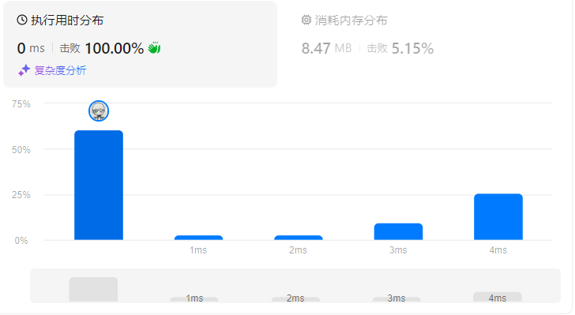

# 刷题内置好用的函数

> 以下是刚刚提到的 C++ 函数和类及其对应的头文件：
>
> ### 数学相关
>
> - **`std::gcd`**: `<numeric>`
> - **`std::lcm`**: `<numeric>`
> - **`std::pow`**: `<cmath>`
> - **`std::sqrt`**: `<cmath>`
>
> ### 排序与查找
>
> - **`std::sort`**: `<algorithm>`
> - **`std::binary_search`**: `<algorithm>`
> - **`std::lower_bound`**: `<algorithm>`
> - **`std::upper_bound`**: `<algorithm>`
>
> ### 容器相关
>
> - **`std::vector`**: `<vector>`
> - **`std::set`**: `<set>`
> - **`std::map`**: `<map>`
> - **`std::unordered_set`**: `<unordered_set>`
> - **`std::unordered_map`**: `<unordered_map>`
>
> ### 字符串相关
>
> - **`std::string`**: `<string>`
> - **`std::to_string`**: `<string>`
> - **`std::stoi`**: `<string>`
>
> ### 位运算
>
> - **`std::bitset`**: `<bitset>`
>
> ### 组合数学
>
> - **`std::next_permutation`**: `<algorithm>`
> - **`std::prev_permutation`**: `<algorithm>`
> - **`std::accumulate`**: `<numeric>`
>
> ### 随机数生成
>
> - **`<random>`**
>
> ### 输入输出
>
> - **`std::cin`** and **`std::cout`**: `<iostream>`
> - **`std::getline`**: `<string>`


# 哈希

### 1. 两数之和

AC

```c
class Solution {
public:
    vector<int> twoSum(vector<int>& nums, int target) {
        unordered_map<int,int> mp;
        for(int i=0;i<nums.size();i++) 
        {
            int x = nums[i];
            if(mp.count(target - x)) return {i,mp[target-x]};
            else mp[x] = i;
        }
        return {};
    }
};
```

### 49. 字母异位词分组

中等

```c
class Solution {
public:
    vector<vector<string>> groupAnagrams(vector<string>& strs) {
        unordered_map<string,vector<string>> mp;
        for(auto s:strs)
        {
            string  ts = s;
            ranges::sort(ts);
            mp[ts].push_back(s);
        }
        vector<vector<string>>  res;
        for(auto ss:mp)
        {
            res.push_back(ss.second);
        }
        return res;
    }
};
```

AC


### \128. ==最长连续序列==

中等

```c
class Solution {
public:
    int longestConsecutive(vector<int>& nums) {
        unordered_set<int> mp;
        for(auto x:nums)
        {
            mp.insert(x);
        }
        int res=0;
        for(auto x:mp)
        {
            int l = x,r =x;
            while(mp.count(l)) l--;
            while(mp.count(r)) r++;
            res = max(res,r-l-1);
        }
        return res;
    }
};
```

超时

改成只判断最左侧的数字作为起点的长度就不超时了，去除重复判断

```c
class Solution {
public:
    int longestConsecutive(vector<int>& nums) {
        unordered_set<int> mp;
        for(auto x:nums)
        {
            mp.insert(x);
        }
        int res=0;
        for(auto x:mp)
        {
            int l = x,r =x;
            if(mp.count(l-1)) continue;
            while(mp.count(r)) r++;
            res = max(res,r-l);
        }
        return res;
    }
};
```


<<<<<<< HEAD
并查集又做了一遍

```c
class Solution {
public:
    int res=1;
    vector<int> cnt;
    vector<int> p;

    int parent(int x)
    {
        if(p[x]!=x) p[x] = parent(p[x]);
        return p[x];
    }

    void merge(int x,int y)
    {
        int px =  parent(x);
        int py =  parent(y);
        p[px] = py;
        cnt[py]+=cnt[px];
        res = max(res,cnt[py]);
    }

    int longestConsecutive(vector<int>& nums) {
        unordered_map<int,int> mp;
        set<int> f;
        int n = nums.size();
        if(n==0) return 0;
        p.resize(n,0);
        cnt.resize(n,0);
        for(int i=0;i<n;i++)
        {
            if(f.count(nums[i])) continue;
            f.insert(nums[i]);
            p[i] = i;
            mp[nums[i]]=i;
            cnt[i] = 1;
        }
        f.clear();
        for(int i=0;i<n;i++)
        {
            if(f.count(nums[i])) continue;
            f.insert(nums[i]);
            if(mp.count(nums[i]-1))
            {
                merge(mp[nums[i]-1],i);
            }
        }
        return res;
    }
};
```


=======
>>>>>>> 638bb1003b52d0f219d6ffe21e0f5e6d7813e6c5
# 双指针


<<<<<<< HEAD
### \283. ==移动零==

简单

```c
class Solution {
public:
    void moveZeroes(vector<int>& nums) {
        int l=0;
        for(int i=0;i<nums.size();i++)
        {
            if(nums[i]!=0)
            {
                swap(nums[i],nums[l++]);
            }
        }
        return;
    }
};
```

AC,但是还是觉得很巧妙

=======
\283. 移动零

简单

>>>>>>> 638bb1003b52d0f219d6ffe21e0f5e6d7813e6c5


### 11. 盛最多水的容器

中等

```c
class Solution {
public:
    int maxArea(vector<int>& height) {
        
        int n =height.size();
       int l = 0, r = n -1,res = 0;
       while(l<r)
       {
            res = max(res,(r-l)*min(height[r],height[l]));
            if(height[l]<height[r]) l++;
            else r--;
       }
       return res;
    }
};
```

一开始看出接雨水那题了，后面想起来是双指针了

### 15. ==三数之和==

中等

```c
class Solution {
public:
    vector<vector<int>> threeSum(vector<int>& nums) {
        sort(nums.begin(),nums.end());
        vector<vector<int>>res;
        int n = nums.size();
       
        for(int i=0;i<n;i++)
        {
            if(i > 0 && nums[i] == nums[i-1]) continue;
            int j=i+1,k = n-1;
            while(j<k)
            {
                if(nums[i]+nums[j]+nums[k]==0)
                {
                     res.push_back({nums[i],nums[j],nums[k]});
                     int t = nums[j];
                     while(t==nums[j]&&j<k) j++;
                }
                else if(nums[i]+nums[j]+nums[k]<0) j++;
                else k--;
            }
        }

        return res;
    }
};

```

想到三指针，但是没写对，一直for i ,  for j ,   k--

其实应该 for  i ，j++ ,k--


<<<<<<< HEAD
### \42. 接雨水

困难

```c
class Solution {
public:
    int trap(vector<int>& height) {
        int n = height.size();
        vector<int> left(n),right(n);
        int mx = 0,res=0;
        for(int i=0;i<n;i++)
        {
            left[i] = mx;
            mx = max(mx,height[i]);
        }
        mx = 0;
        for(int i=n-1;i>=0;i--)
        {
            right[i] = mx;
            mx = max(mx,height[i]);
            res+=max(0,min(left[i],right[i]) - height[i]);
        }
        return res;
    }
};
```


# 滑动窗口
=======
\42. 接雨水

困难

滑动窗口
>>>>>>> 638bb1003b52d0f219d6ffe21e0f5e6d7813e6c5


### 3. 无重复字符的最长子串

中等

```c
class Solution {
public:
    int lengthOfLongestSubstring(string s) {
        int n=s.size(),res=0,last=0;
        unordered_map<char,int> f;
        for(int i=0;i<n;i++)
        {
            char c = s[i];
            if(f.count(c))
            {
                last = max(last,f[c]+1);
            }
            res = max(res,i-last+1);
            f[c] = i;
            
        }
        return res;
    }
};
```

AC


<<<<<<< HEAD
### \438. 找到字符串中所有字母异位词

中等

哈希加滑动窗口

# 子串


### \560. ==和为 K 的子数组==

中等

```c
class Solution {
public:
    int subarraySum(vector<int>& nums, int k) {
       int l=0,r=0,sum=0,res=0,n = nums.size();
        for(int i=0;i<n;i++)
        {
                sum+=nums[i];
                while(sum>k) sum-=nums[l++];
                if(sum==k&&l<=i) res++;
        }
        return res;
    }
};


```

这是错的！应该不是全是正数

```c
class Solution {
public:
    int subarraySum(vector<int>& nums, int k) {
        vector<int> su;
        int n=nums.size(),res=0,sum=0;
        for(int i=0;i<n;i++)
        {
            sum+=nums[i];
            su.push_back(sum);
        }
        for(int i=0;i<n;i++)
        {
            if(su[i]==k) res++;
            for(int j=0;j<i;j++)
            {
                if(su[i]- su[j]==k) res++;
            }
        }
        return res;
    }
};


//关键在于没有想到 前缀和 ！！
//看答案
```


=======
\438. 找到字符串中所有字母异位词

中等

子串


\560. 和为 K 的子数组

中等

>>>>>>> 638bb1003b52d0f219d6ffe21e0f5e6d7813e6c5


### \239. 滑动窗口最大值

困难

```c
class Solution {
public:
    typedef pair<int,int> PII;
    deque<PII> q;
    vector<int> maxSlidingWindow(vector<int>& nums, int k) {
        int n= nums.size();
        vector<int> res;
        for(int i=0;i<n;i++)
        {
           
            int x = nums[i];
            
            while(!q.empty())
            {
                
                auto b = q.back();
                if(b.second<x) q.pop_back();
                else break;
            }
            if(!q.empty())
            {
                auto f = q.front();
                if(f.first<=i-k) q.pop_front();
            } 
            q.push_back({i,x});

            if(i>=k-1)
            {
                res.push_back(q.front().second);
            }
           
        }
        return res;
    }
};
```

AC

### 76. 最小覆盖子串

困难

```c
class Solution {
public:
    string minWindow(string s, string t) {
        unordered_map<char,int> mp;
        for(auto c:t) mp[c]++;
        int type = mp.size();
        int n = s.size();
        int resl=0,resr=0;
        int l = 0;
        int res = INT_MAX;
        for(int i=0;i<n;i++)
        {
            char c = s[i];
            if(mp.count(c))
            {
                if(--mp[c]==0)
                {
                    type--;
                    while(type==0) 
                    {
                        if(i-l+1<res)
                        {
                            // if(l<n-1&&s[l+1]==s[l]&&mp[l]<0) 
                            // {
                            //     l++;
                            //     continue;
                            // }
                            res = i-l+1;
                            resl = l;
                        }
                                               
                        if(mp.count(s[l])&&++mp[s[l]]>0)
                        {
                            type++;
                        }
                        l++;
                        
                    }
                } 
            }
            
        }
        if(res == INT_MAX) return "";
        return  s.substr(resl,res);
    }
};
```

稍微调了一下自己做出了，思路不难，就是双指针

但是必须只存l,len,最后返回substr不然超内存不知道为什么


<<<<<<< HEAD
### 53. 最大子数组和

中等

```c
class Solution {
public:
    int maxSubArray(vector<int>& nums) {
       int res=INT_MIN,sum=0;
       for(auto x:nums)
       {
            sum = max(x,sum+x);
            res = max(res,sum);
       }
        return res;
    }
};
```

=======
\53. 最大子数组和

中等

>>>>>>> 638bb1003b52d0f219d6ffe21e0f5e6d7813e6c5


### \56. 合并区间

中等

```c
class Solution {
public:
    vector<vector<int>> merge(vector<vector<int>>& intervals) {
        vector<vector<int>> res;
        sort(intervals.begin(),intervals.end());
        int ll=INT_MAX,lr=INT_MIN;
        for(auto v:intervals)
        {
            int l  = v[0], r = v[1];
            if(lr==INT_MIN||l<=lr)
            {
                lr = max(lr,r);
                ll = min(ll,l);
            }
            else
            {
                res.push_back({ll,lr});
                lr = r;
                ll = l;
            }
            //cout << l << r<< ll << lr <<endl;
        }
        res.push_back({ll,lr});
        return res;
    }
};
```

AC

<<<<<<< HEAD
分治想到没写

```c
class Solution {
public:
    struct Status {
        int lSum, rSum, mSum, iSum;
    };

    Status pushUp(Status l, Status r) {
        int iSum = l.iSum + r.iSum;
        int lSum = max(l.lSum, l.iSum + r.lSum);
        int rSum = max(r.rSum, r.iSum + l.rSum);
        int mSum = max(max(l.mSum, r.mSum), l.rSum + r.lSum);
        return (Status) {lSum, rSum, mSum, iSum};
    };

    Status get(vector<int> &a, int l, int r) {
        if (l == r) {
            return (Status) {a[l], a[l], a[l], a[l]};
        }
        int m = (l + r) >> 1;
        Status lSub = get(a, l, m);
        Status rSub = get(a, m + 1, r);
        return pushUp(lSub, rSub);
    }

    int maxSubArray(vector<int>& nums) {
        return get(nums, 0, nums.size() - 1).mSum;
    }
};

作者：力扣官方题解
链接：https://leetcode.cn/problems/maximum-subarray/solutions/
来源：力扣（LeetCode）
著作权归作者所有。商业转载请联系作者获得授权，非商业转载请注明出处。
```


### \189. 轮转数组

中等

要三种方法

- 创建新数组

- n次移动1位

```c
class Solution {
public:
    void rotate(vector<int>& nums, int k) {
        while(k--)
        {
            int f = 0,last=nums[0],n = nums.size();
            int i=0,j,temp;
            for(int i=0;i<n;i++)
            {
                j = (i+1)%n;
                temp = nums[j];
                nums[j] =last;
                last = temp;
            }
        }
        return;
    }
};
```

超时

- 一次移动k位

```c
class Solution {
public:
    void rotate(vector<int>& nums, int k) {
        int f = 0,n = nums.size(),cnt=0;
        if(k==0||n==0) return;
        while(1)
        {
           
            int last=nums[f];
            int i=f,j;
            while(1)
            {
                int j = (i+k)%n;
                int temp = nums[j];
                nums[j] =last;
                last = temp;
                cnt++;
                i = j;
                if(i==f) break;
            }
            if(cnt==n) break;
            f++;
        }
       
        return;
    }
};
```

难点是用cnt计数来结束循环


### \238. 除自身以外数组的乘积

中等

前后分解


### \41. 缺失的第一个正数

困难

```c
class Solution {
public:
    int firstMissingPositive(vector<int>& nums) {
        int n = nums.size(),l,r=nums[0];
        bool h1 = false,hn = false;
        for(int i=0;i<n;i++)
        {
            if(nums[i]==1) h1 = true;
            if(nums[i]==n) hn = true;
            if(nums[i]<0) nums[i] = 0;
        }
        for(int i=0;i<n;i++)
        {
            int j = abs(nums[i]);
            if(j>=n) continue;
            if(nums[j]>0) nums[j] = -nums[j];
            if(nums[j]==0) nums[j] = -1;
        }
        if(!h1) return 1;
        for(int i=1;i<n;i++)
        {
            if(nums[i]>=0) return i;
        }
        if(!hn) return n;
        return n+1;
    }
};
```

花了一点点时间想到了原地哈希

```c
class Solution {
public:
    int firstMissingPositive(vector<int>& nums) {
        int n = nums.size(),l,r=nums[0];
        bool h1 = false,hn = false;
        for(int i=0;i<n;i++)
        {
            if(nums[i]==1) h1 = true;
            if(nums[i]==n) hn = true;
            if(nums[i]<0) nums[i] = 0;
        }
        for(int i=0;i<n;i++)
        {
            int j = abs(nums[i]);
            if(j>=n) continue;
            if(nums[j]>0) nums[j] = -nums[j];
            if(nums[j]==0) nums[j] = -1;
        }
        if(!h1) return 1;
        for(int i=1;i<n;i++)
        {
            if(nums[i]>=0) return i;
        }
        if(!hn) return n;
        return n+1;
    }
};
```

但是我的取负有一些复杂

答案是把数字和对应位置的数交换

```c
// author:rmokerone
#include <iostream>
#include <vector>

using namespace std;

class Solution {
public:
    int firstMissingPositive(vector<int> &nums) {
        for (int i = 0; i < nums.size(); i++) {
            while (nums[i] != i + 1) {
                if (nums[i] <= 0 || nums[i] > nums.size() || nums[i] == nums[nums[i] - 1])
                    break;
                // 将nums[i] 放置到对应位置上[1,2,3...]
                int idx = nums[i] - 1;
                nums[i] = nums[idx];
                nums[idx] = idx + 1;
            }
        }
        for (int i = 0; i < nums.size(); i++) {
            if (nums[i] != (i + 1)) {
                return (i + 1);
            }
        }
        return (nums.size() + 1);
    }
};

作者：liweiwei1419
链接：https://leetcode.cn/problems/first-missing-positive/solutions/
来源：力扣（LeetCode）
著作权归作者所有。商业转载请联系作者获得授权，非商业转载请注明出处。
```


# 矩阵


### 73. 矩阵置零

中等

```c
class Solution {
public:
    typedef pair<int,int> PII;
   
    void setZeroes(vector<vector<int>>& matrix) {
       int n = matrix.size(), m = matrix[0].size();
       bool lastrow = false,nowrow = false;
       for(int j=0;j<m;j++)
        {
            if(matrix[0][j]==0) lastrow=true;
        }
       for(int i=1;i<n;i++)
       {

            for(int j=0;j<m;j++)
            {
                if(matrix[i][j]==0)
                {
                    nowrow = true;
                    int row = i;
                    while(row--)
                    {
                        matrix[row][j] =0;
                    }
                }
                if(matrix[i-1][j]==0) matrix[i][j]=0;
            }

            for(int j=0;j<m;j++)
            {
                if(lastrow) matrix[i-1][j]=0;
            }
            lastrow = nowrow;
            nowrow = false;
       }
       for(int j=0;j<m;j++)
       {
            if(lastrow) matrix[n-1][j]=0;
       }
           
        return;
    }
};
```

OC,但是看了题解，感觉题目很狗shi


### 54. 螺旋矩阵

中等

```c
class Solution {
public:
    vector<int> spiralOrder(vector<vector<int>>& matrix) {
        vector<vector<int>> dir = {{0,1},{1,0},{0,-1},{-1,0}};
        int n = matrix.size(),m = matrix[0].size();
        bool f[n][m];
        memset(f,0,sizeof f);
        int i=0;
        int x = 0,y=0,cnt=1;
        vector<int> res;
        res.push_back(matrix[0][0]);
        f[0][0] = true;
        if(cnt==n*m) return res;
        while(1)
        {
            i%=4;
            auto dx = dir[i][0],dy = dir[i][1];
            while(x+dx>=0&&x+dx<n&&y+dy>=0&&y+dy<m&&!f[x+dx][y+dy])
            {
                x = x+dx;
                y = y+dy;
                res.push_back(matrix[x][y]);
                //cout << matrix[x][y] << endl;
                f[x][y] = true;
                if(++cnt==n*m) return res;
            }
            i++;
        }
        return res;
        
    }
};
```

AC 时间



### 48. 旋转图像

中等

```c
class Solution {
public:
    void rotate(vector<vector<int>>& matrix) {
        int n = matrix.size();
        // 水平翻转
        for (int i = 0; i < n / 2; ++i) {
            for (int j = 0; j < n; ++j) {
                swap(matrix[i][j], matrix[n - i - 1][j]);
            }
        }
        // 主对角线翻转
        for (int i = 0; i < n; ++i) {
            for (int j = 0; j < i; ++j) {
                swap(matrix[i][j], matrix[j][i]);
            }
        }
    }
};

作者：力扣官方题解
链接：https://leetcode.cn/problems/rotate-image/solutions/526980/xuan-zhuan-tu-xiang-by-leetcode-solution-vu3m/
来源：力扣（LeetCode）
著作权归作者所有。商业转载请联系作者获得授权，非商业转载请注明出处。
```

记得就不做了


### 240. 搜索二维矩阵 II

中等

```c
class Solution {
public:
    bool searchMatrix(vector<vector<int>>& matrix, int target) {
        int l =0,r = matrix[0].size()-1;
        for(int i=0;i<matrix.size()&&r>=0;)
        {
            if(target==matrix[i][r]) return true;
            if(target>matrix[i][r]) i++;
            else r--;
           
        }
        return false;
    }
};
```


=======


\189. 轮转数组

中等


\238. 除自身以外数组的乘积

中等


\41. 缺失的第一个正数

困难

矩阵


\73. 矩阵置零

中等


\54. 螺旋矩阵

中等


\48. 旋转图像

中等


\240. 搜索二维矩阵 II

中等

>>>>>>> 638bb1003b52d0f219d6ffe21e0f5e6d7813e6c5
# 链表


### 160. ==相交链表==

简单

```c
class Solution {
public:
    ListNode *getIntersectionNode(ListNode *headA, ListNode *headB) {
        ListNode *a = headA, *b = headB;
        while(1)
        {
            if(a==b) return a;
            if(!a&&!b) return nullptr;
            if(a==nullptr) a = headB;
            else   a = a->next;
            if(b==nullptr) b = headA;
            else  b = b ->next;
          
            
        }
        return nullptr;
    }
};
```

看了思路才时间复杂度内AC


<<<<<<< HEAD
### 206. 反转链表

简单

```c
/**
 * Definition for singly-linked list.
 * struct ListNode {
 *     int val;
 *     ListNode *next;
 *     ListNode() : val(0), next(nullptr) {}
 *     ListNode(int x) : val(x), next(nullptr) {}
 *     ListNode(int x, ListNode *next) : val(x), next(next) {}
 * };
 */
class Solution {
public:
    ListNode* reverseList(ListNode* head) {
        //  ListNode* dumy = new  ListNode(-1);
        //  dumy->next = head;
         ListNode* pre = nullptr,*hd = head,*ne;
        while(hd!=nullptr)
        {
            //cout<< hd->val <<endl;
            ne = hd->next;
            hd->next = pre;
            pre = hd;
            hd = ne;
        }
        return pre;
    }
};


```

=======
\206. 反转链表

简单

>>>>>>> 638bb1003b52d0f219d6ffe21e0f5e6d7813e6c5


### 234. ==回文链表==

简单

```c
/**
 * Definition for singly-linked list.
 * struct ListNode {
 *     int val;
 *     ListNode *next;
 *     ListNode() : val(0), next(nullptr) {}
 *     ListNode(int x) : val(x), next(nullptr) {}
 *     ListNode(int x, ListNode *next) : val(x), next(next) {}
 * };
 */
class Solution {
public:
    ListNode* rev(ListNode* head)
    {
        ListNode* pre = new ListNode(-1),* t;
        while(head!=nullptr)
        {
            t = head->next;
            head->next = pre;
            pre = head;
            head = t;
        }
        return pre;
    }

    bool isPalindrome(ListNode* head) {
        ListNode* fast = head,*low = head;
        while(fast->next!=nullptr&&fast->next->next!=nullptr)
        {
            fast = fast->next->next;
            low = low->next;
        }
        fast = rev(low);
        // cout << low->val <<endl;
        // cout << fast->val <<endl;
        ListNode* l = head;
        while(l!=low->next)
        {
            if(l->val!=fast->val) return false;
            l=l->next;
            fast =fast->next;
        }
        return true;
        
    }
};

//快慢加反转链表
```

完全没有想到快慢指针然后反转一半链表


### 141.==环形链表==

简单

一眼哈希表，但是O1没想到快慢指针，龟兔赛跑


<<<<<<< HEAD
### 142. 环形链表 II

中等

```c
/**
 * Definition for singly-linked list.
 * struct ListNode {
 *     int val;
 *     ListNode *next;
 *     ListNode(int x) : val(x), next(NULL) {}
 * };
 */
class Solution {
public:
    ListNode *detectCycle(ListNode *head) {
        ListNode * fast=head,*low = head;
        if(head==nullptr||  head->next==nullptr) return nullptr;
        while(fast!=nullptr&&fast->next!=nullptr)
        {
            fast=fast->next->next;
            low = low->next;
            if(fast==low) break;
        }

        if(fast!=low) return nullptr;
        fast = head;
        while(fast!=low)
        {
            fast=fast->next;
            low = low->next;
        }
        return fast;
    }
};

```

AC

### \21. 合并两个有序链表

简单

```c
/**
 * Definition for singly-linked list.
 * struct ListNode {
 *     int val;
 *     ListNode *next;
 *     ListNode() : val(0), next(nullptr) {}
 *     ListNode(int x) : val(x), next(nullptr) {}
 *     ListNode(int x, ListNode *next) : val(x), next(next) {}
 * };
 */
class Solution {
public:
    ListNode* mergeTwoLists(ListNode* list1, ListNode* list2) {
        ListNode* dumy = new ListNode(-1);
        ListNode* hd = dumy;
        while(list1!=nullptr&&list2!=nullptr)
        {
            if(list1->val<=list2->val)
            {
                hd->next = list1;
                list1=list1->next;
               
            }
            else
            {
                hd->next = list2;
                list2=list2->next;
            }
            hd = hd->next;
        }
        if(list1!=nullptr) hd->next = list1;
        if(list2!=nullptr) hd->next = list2;
        return dumy->next;
    }
};
```

AC


### \2. 两数相加

中等

```c
/**
 * Definition for singly-linked list.
 * struct ListNode {
 *     int val;
 *     ListNode *next;
 *     ListNode() : val(0), next(nullptr) {}
 *     ListNode(int x) : val(x), next(nullptr) {}
 *     ListNode(int x, ListNode *next) : val(x), next(next) {}
 * };
 */
class Solution {
public:

    ListNode* nadd(ListNode* &l1,ListNode*& l2,int f=0)
    {
        if(f==0&&l1==nullptr) return l2;
        if(f==0&&l2==nullptr) return l1;
        int val = f;
        if(l1!=nullptr) val+= l1->val;
        if(l2!=nullptr) val+= l2->val;
        ListNode* nd = new ListNode(val%10);
        f = val/10;
        l1 =   l1==nullptr? l1 : l1->next;
        l2 =   l2==nullptr? l2 : l2->next;
        nd->next = nadd(l1,l2,f);
        return nd;

    }

    ListNode* addTwoNumbers(ListNode* l1, ListNode* l2) {
        return nadd(l1,l2);
    }
};
```

AC

答案更条件判断更简洁

```c
class Solution {
public:
    // l1 和 l2 为当前遍历的节点，carry 为进位
    ListNode* addTwoNumbers(ListNode* l1, ListNode* l2, int carry = 0) {
        if (l1 == nullptr && l2 == nullptr) { // 递归边界：l1 和 l2 都是空节点
            return carry ? new ListNode(carry) : nullptr; // 如果进位了，就额外创建一个节点
        }
        if (l1 == nullptr) { // 如果 l1 是空的，那么此时 l2 一定不是空节点
            swap(l1, l2); // 交换 l1 与 l2，保证 l1 非空，从而简化代码
        }
        int sum = carry + l1->val + (l2 ? l2->val : 0); // 节点值和进位加在一起
        l1->val = sum % 10; // 每个节点保存一个数位
        l1->next = addTwoNumbers(l1->next, (l2 ? l2->next : nullptr), sum / 10); // 进位
        return l1;
    }
};
```


### 19. 删除链表的倒数第 N 个结点

中等

```
/**
 * Definition for singly-linked list.
 * struct ListNode {
 *     int val;
 *     ListNode *next;
 *     ListNode() : val(0), next(nullptr) {}
 *     ListNode(int x) : val(x), next(nullptr) {}
 *     ListNode(int x, ListNode *next) : val(x), next(next) {}
 * };
 */
class Solution {
public:
    ListNode* removeNthFromEnd(ListNode* head, int n) {
        ListNode* dumy = new ListNode(-1);
        dumy->next = head;
        ListNode* pre = dumy,*nd = head,*ne=head->next;
        int len=0;
         while(nd!=nullptr)
        {
            nd=nd->next;
            len++;
        }

        int idx = len - n;
        nd = head;
        while(idx--)
        {
            pre = nd;
            nd=nd->next;
        }
        pre->next = nd->next;
        return dumy->next;
    }
};
```

OC然后看到要一遍扫描，那就只有vector存，开额外的空间

答案很NB

```c
class Solution {
public:
    ListNode* removeNthFromEnd(ListNode* head, int n) {
        // 由于可能会删除链表头部，用哨兵节点简化代码
        ListNode dummy{0, head};
        auto left = &dummy;
        auto right = &dummy;
        while (n--) {
            right = right->next; // 右指针先向右走 n 步
        }
        while (right->next) {
            left = left->next;
            right = right->next; // 左右指针一起走
        }
        // 左指针的下一个节点就是倒数第 n 个节点
        auto nxt = left->next;
        left->next = left->next->next;
        delete nxt;
        return dummy.next;
    }
};

作者：灵茶山艾府
链接：https://leetcode.cn/problems/remove-nth-node-from-end-of-list/solutions/2004057/ru-he-shan-chu-jie-dian-liu-fen-zhong-ga-xpfs/
来源：力扣（LeetCode）
著作权归作者所有。商业转载请联系作者获得授权，非商业转载请注明出处。
```

快指针走n步，然后一起走


### 24. 两两交换链表中的节点

中等

```c
/**
 * Definition for singly-linked list.
 * struct ListNode {
 *     int val;
 *     ListNode *next;
 *     ListNode() : val(0), next(nullptr) {}
 *     ListNode(int x) : val(x), next(nullptr) {}
 *     ListNode(int x, ListNode *next) : val(x), next(next) {}
 * };
 */
class Solution {
public:


    ListNode* swapPairs(ListNode* head) {
        ListNode* dumy = new ListNode(-1);
        dumy->next = head;
        ListNode* pre = dumy,*n1 = head,*n3,*nd = dumy;
        int cnt = 0;
        while(nd!=nullptr)
        {
            nd =nd->next;
            cnt++;
            if(cnt==1) n1 = nd;
            if(cnt==2)
            {
                cnt=0;
                if(nd==nullptr) break;
                n3 = nd->next;
                pre->next = n1->next;
                n1->next->next = n1;
                n1->next = n3;
                
                pre = n1;
                cnt=0;
                nd = n1;
            }

        }
        return dumy->next;
    }
};
```

AC

### 25. K 个一组翻转链表

困难

```c
/**
 * Definition for singly-linked list.
 * struct ListNode {
 *     int val;
 *     ListNode *next;
 *     ListNode() : val(0), next(nullptr) {}
 *     ListNode(int x) : val(x), next(nullptr) {}
 *     ListNode(int x, ListNode *next) : val(x), next(next) {}
 * };
 */
class Solution {
public:
    pair<ListNode*,ListNode*>  reversenode(ListNode*pre,int k)
    {
        ListNode* nd = pre->next,* ne;
        ListNode* s = pre->next;
        while(k)
        {
            //cout << pre->val << nd->val << k <<endl;
            ne = nd->next;
            nd->next=pre;
            pre = nd;
            nd = ne;
            k--;
        }
        
        return {pre,nd};
    } 
    ListNode* reverseKGroup(ListNode* head, int k) {
       
       ListNode* drum =new ListNode(-1);
       ListNode* hd = head;
       int n=0,cnt=0;
       while(hd!=nullptr)
       {
            cnt++;
            hd=hd->next;
       }
       drum->next = head;
       hd = drum;
       ListNode* ne;
        while(k<=cnt)
       {
            //cout << "rev"<< hd->val <<endl;
           auto rs = reversenode(hd,k);
            //cout << "rev"<< hd->val <<endl;
            hd->next->next = rs.second;
           hd->next =  rs.first;
           int idx = k;
           while(idx--) 
           {
                hd=hd->next;
                //cout <<  hd->val <<endl;
           }
           
           cnt-=k;
       }
       return drum->next;
    }
};
```

AC，做了比较久，思路没问题


=======
\142. 环形链表 II

中等


\21. 合并两个有序链表

简单


\2. 两数相加

中等


\19. 删除链表的倒数第 N 个结点

中等


\24. 两两交换链表中的节点

中等


\25. K 个一组翻转链表

困难

>>>>>>> 638bb1003b52d0f219d6ffe21e0f5e6d7813e6c5


### 138. 随机链表的复制

中等

```c
/*
// Definition for a Node.
class Node {
public:
    int val;
    Node* next;
    Node* random;
    
    Node(int _val) {
        val = _val;
        next = NULL;
        random = NULL;
    }
};
*/

class Solution {
public:
    unordered_map<Node*,Node*> mp;
    Node* copyRandomList(Node* head) {
        Node* hd = head;
        Node* pre = new Node(-1);
        Node* t = pre;
        while(hd)
        {
            mp[hd] = new Node(hd->val);
            t->next = mp[hd];
            hd=hd->next;
            t = t->next;
        }

        hd = head;
        t = pre->next;
        while(hd)
        {
            t->random = mp[hd->random];
            hd=hd->next;
            t = t->next;
        }
        return pre->next;
    }
};
```

哈希表加双遍历


<<<<<<< HEAD
### \148. 排序链表

中等

优先队列或者归并


### \23. 合并 K 个升序链表

困难

```c
/**
 * Definition for singly-linked list.
 * struct ListNode {
 *     int val;
 *     ListNode *next;
 *     ListNode() : val(0), next(nullptr) {}
 *     ListNode(int x) : val(x), next(nullptr) {}
 *     ListNode(int x, ListNode *next) : val(x), next(next) {}
 * };
 */
 struct cmp
 {
    bool operator()(ListNode* a,ListNode* b)
    {
        return a->val>b->val;
    }
 };
class Solution {
public:
    ListNode* mergeKLists(vector<ListNode*>& lists) {
        priority_queue<ListNode*,vector<ListNode* >,cmp> q;
        // 将所有非空的链表头节点加入优先队列
        for (ListNode* list : lists) {
            if (list != nullptr) {
                q.push(list);
            }
        }
        
        ListNode* dum = new ListNode(-1);
        ListNode* head = dum;
        while(!q.empty())
        {
            ListNode* now =  q.top();
            head->next =now;
            q.pop();
            if(now==nullptr) continue;
            //cout << now->val <<endl;
            if(now->next!=nullptr) q.push(now->next);
            head = head->next;
        }
        return dum->next;
    }
};
```

优先队列写一个比较函数


### 146. LRU 缓存

中等

```
class Node {
public:
    int key, value;
    Node *prev, *next;

    Node(int k = 0, int v = 0) : key(k), value(v) {}
};

class LRUCache {
private:
    int capacity;
    Node *dummy; // 哨兵节点
    unordered_map<int, Node*> key_to_node;

    // 删除一个节点（抽出一本书）
    void remove(Node *x) {
        x->prev->next = x->next;
        x->next->prev = x->prev;
    }

    // 在链表头添加一个节点（把一本书放在最上面）
    void push_front(Node *x) {
        x->prev = dummy;
        x->next = dummy->next;
        x->prev->next = x;
        x->next->prev = x;
    }

    Node *get_node(int key) {
        auto it = key_to_node.find(key);
        if (it == key_to_node.end()) // 没有这本书
            return nullptr;
        auto node = it->second; // 有这本书
        remove(node); // 把这本书抽出来
        push_front(node); // 放在最上面
        return node;
    }

public:
    LRUCache(int capacity) : capacity(capacity), dummy(new Node()) {
        dummy->prev = dummy;
        dummy->next = dummy;
    }

    int get(int key) {
        auto node = get_node(key);
        return node ? node->value : -1;
    }

    void put(int key, int value) {
        auto node = get_node(key);
        if (node) { // 有这本书
            node->value = value; // 更新 value
            return;
        }
        key_to_node[key] = node = new Node(key, value); // 新书
        push_front(node); // 放在最上面
        if (key_to_node.size() > capacity) { // 书太多了
            auto back_node = dummy->prev;
            key_to_node.erase(back_node->key);
            remove(back_node); // 去掉最后一本书
            delete back_node; // 释放内存
        }
    }
};

作者：灵茶山艾府
链接：https://leetcode.cn/problems/lru-cache/solutions/
来源：力扣（LeetCode）
著作权归作者所有。商业转载请联系作者获得授权，非商业转载请注明出处。
```

记得哈希加双向链表，但是没做了

=======
\148. 排序链表

中等


\23. 合并 K 个升序链表

困难


\146. LRU 缓存

中等

>>>>>>> 638bb1003b52d0f219d6ffe21e0f5e6d7813e6c5
# 二叉树


### \94. 二叉树的中序遍历

简单

```c
class Solution {
public:
    vector<int> res;
    vector<int> inorderTraversal(TreeNode* root) {
        if(root==nullptr) return{};
        inorderTraversal(root->left);
        res.push_back(root->val);
        inorderTraversal(root->right);
        return res;
    }
};
```

AC这样内存占的多

官方答案

```c
class Solution {
public:
    void inorder(TreeNode* root, vector<int>& res) {
        if (!root) {
            return;
        }
        inorder(root->left, res);
        res.push_back(root->val);
        inorder(root->right, res);
    }
    vector<int> inorderTraversal(TreeNode* root) {
        vector<int> res;
        inorder(root, res);
        return res;
    }
};

作者：力扣官方题解
链接：https://leetcode.cn/problems/binary-tree-inorder-traversal/solutions/412886/er-cha-shu-de-zhong-xu-bian-li-by-leetcode-solutio/
来源：力扣（LeetCode）
著作权归作者所有。商业转载请联系作者获得授权，非商业转载请注明出处。
```


<<<<<<< HEAD
### 104. 二叉树的最大深度

简单

```c
/**
 * Definition for a binary tree node.
 * struct TreeNode {
 *     int val;
 *     TreeNode *left;
 *     TreeNode *right;
 *     TreeNode() : val(0), left(nullptr), right(nullptr) {}
 *     TreeNode(int x) : val(x), left(nullptr), right(nullptr) {}
 *     TreeNode(int x, TreeNode *left, TreeNode *right) : val(x), left(left), right(right) {}
 * };
 */
class Solution {
public:
    int maxDepth(TreeNode* root) {
        if(root==nullptr) return 0;
        return max(maxDepth(root->left),maxDepth(root->right))+1;
    }
};
```

AC


### \226. 翻转二叉树

简单

```c
/**
 * Definition for a binary tree node.
 * struct TreeNode {
 *     int val;
 *     TreeNode *left;
 *     TreeNode *right;
 *     TreeNode() : val(0), left(nullptr), right(nullptr) {}
 *     TreeNode(int x) : val(x), left(nullptr), right(nullptr) {}
 *     TreeNode(int x, TreeNode *left, TreeNode *right) : val(x), left(left), right(right) {}
 * };
 */
class Solution {
public:
    TreeNode* invertTree(TreeNode* root) {
            if(root==nullptr) return nullptr;
            TreeNode* t = invertTree(root->right);
            root->right =  invertTree(root->left);
            root->left =  t;
            return root;
    }
};
```


### 101. 对称二叉树

简单

```c
/**
 * Definition for a binary tree node.
 * struct TreeNode {
 *     int val;
 *     TreeNode *left;
 *     TreeNode *right;
 *     TreeNode() : val(0), left(nullptr), right(nullptr) {}
 *     TreeNode(int x) : val(x), left(nullptr), right(nullptr) {}
 *     TreeNode(int x, TreeNode *left, TreeNode *right) : val(x), left(left), right(right) {}
 * };
 */
class Solution {
public:
    bool isbd(TreeNode*a, TreeNode*b)
    {
        if(a==nullptr||b==nullptr)
        {
            if(a==b) return true;
            else return false;
        }
        if(a->val!=b->val) return false;
       return (isbd(a->left,b->right)&&isbd(b->left,a->right));
        
    }

    bool isSymmetric(TreeNode* root) {
        return isbd(root->left,root->right);
    }
};
```

AC

=======
\104. 二叉树的最大深度

简单


\226. 翻转二叉树

简单


\101. 对称二叉树

简单

>>>>>>> 638bb1003b52d0f219d6ffe21e0f5e6d7813e6c5


### \543. 二叉树的直径

简单

```c
/**
 * Definition for a binary tree node.
 * struct TreeNode {
 *     int val;
 *     TreeNode *left;
 *     TreeNode *right;
 *     TreeNode() : val(0), left(nullptr), right(nullptr) {}
 *     TreeNode(int x) : val(x), left(nullptr), right(nullptr) {}
 *     TreeNode(int x, TreeNode *left, TreeNode *right) : val(x), left(left), right(right) {}
 * };
 */
class Solution {
public:
    int res=0;

    int rootmax(TreeNode* root)
    {
        if(!root) return 0;
        int l = rootmax(root->left);
        int r = rootmax(root->right);
        res = max(res,l+r);
        return max(l,r)+1;
    }

    int diameterOfBinaryTree(TreeNode* root) {
        rootmax(root);
        return res;
    }
};
```

AC

<<<<<<< HEAD
### \102. 二叉树的层序遍历

中等

```c
/**
 * Definition for a binary tree node.
 * struct TreeNode {
 *     int val;
 *     TreeNode *left;
 *     TreeNode *right;
 *     TreeNode() : val(0), left(nullptr), right(nullptr) {}
 *     TreeNode(int x) : val(x), left(nullptr), right(nullptr) {}
 *     TreeNode(int x, TreeNode *left, TreeNode *right) : val(x), left(left), right(right) {}
 * };
 */
class Solution {
public:
   
    
    vector<vector<int>> levelOrder(TreeNode* root) {
        if(root==nullptr) return {};
         vector<vector<int>> res;
        int size = 1;
        queue<TreeNode*> q;
        q.push(root);
        vector<int> row;
        while(!q.empty())
        {
            int n = q.front()->val;
            if(q.front()->left!=nullptr) q.push(q.front()->left);
            if(q.front()->right!=nullptr)q.push(q.front()->right);
            q.pop();
            row.push_back(n);
            size--;
            if(size==0)
            {
                size = q.size();
                res.push_back(row);
                row.clear();
            }
        }
        return res;
    }
};
```

AC

=======
\102. 二叉树的层序遍历

中等

>>>>>>> 638bb1003b52d0f219d6ffe21e0f5e6d7813e6c5


### 108. 将有序数组转换为二叉搜索树

简单

卡了一下AC,痴呆了，L写成0

```c
class Solution {
public:
    TreeNode* ToBST(vector<int>& nums,int l,int r,int parent)
    {
        if(l>r) return nullptr;
        int mid = (l+r)/2;
       
        TreeNode* root= new TreeNode(nums[mid]);
        if(l == r) return root;

        root->left = ToBST(nums,l,mid-1,mid);
        root->right = ToBST(nums,mid+1,r,mid);
        return root;
    }
    TreeNode* sortedArrayToBST(vector<int>& nums) {
        return ToBST(nums,0,nums.size()-1,-1);
    }
};
```

\98. 验证二叉搜索树

中等


### 230. 二叉搜索树中第 K 小的元素

中等

```c

class Solution {
public:

    int dfs(TreeNode* root)
    {
        if(root==nullptr) return 0;
        int res=0;
        if(root->left) res+=dfs(root->left);
        if(root->right) res+=dfs(root->right);
        return res+1;
    }

    int kthSmallest(TreeNode* root, int k) {
        int l = dfs(root->left);
        if(l>k-1) return kthSmallest(root->left,k);
        else if(l==k-1) return root->val;
        else return kthSmallest(root->right, k-l-1); 
    }
};
```

<<<<<<< HEAD
答案

```c
class Solution {
public:
    int kthSmallest(TreeNode* root, int k) {
        stack<TreeNode *> stack;
        while (root != nullptr || stack.size() > 0) {
            while (root != nullptr) {
                stack.push(root);
                root = root->left;
            }
            root = stack.top();
            stack.pop();
            --k;
            if (k == 0) {
                break;
            }
            root = root->right;
        }
        return root->val;
    }
};

作者：力扣官方题解
链接：https://leetcode.cn/problems/kth-smallest-element-in-a-bst/solutions/1050055/er-cha-sou-suo-shu-zhong-di-kxiao-de-yua-8o07/
来源：力扣（LeetCode）
著作权归作者所有。商业转载请联系作者获得授权，非商业转载请注明出处。
```

没做**进阶：**如果二叉搜索树经常被修改（插入/删除操作）并且你需要频繁地查找第 `k` 小的值，你将如何优化算法？

**进阶：**需要把每个节点的子树大小给存下来 unordered_map<TreeNode *, int> nodeNum;

```c
class Solution {
public:
    unordered_map<TreeNode*, int> hash;
    int dfs(TreeNode* root) {
      if (!root) return 0;
      hash[root] = dfs(root->left) + dfs(root->right) + 1;
      return hash[root];
    }
    int get(TreeNode*root, int k) {
      if (!root) return 0;
      if (hash[root->left] < k - 1) return get(root->right, k - hash[root->left] -1);
      if (hash[root->left] > k - 1) return get(root->left, k);
      return root->val;
    }
    int kthSmallest(TreeNode* root, int k) {
      dfs(root);
      return get(root, k);
    }
};
```


### \199. 二叉树的右视图

中等

```c
/**
 * Definition for a binary tree node.
 * struct TreeNode {
 *     int val;
 *     TreeNode *left;
 *     TreeNode *right;
 *     TreeNode() : val(0), left(nullptr), right(nullptr) {}
 *     TreeNode(int x) : val(x), left(nullptr), right(nullptr) {}
 *     TreeNode(int x, TreeNode *left, TreeNode *right) : val(x), left(left), right(right) {}
 * };
 */
class Solution {
public:
    
    vector<int> rightSideView(TreeNode* root) {
        queue<TreeNode*> q;
        if(!root) return {};
        q.push(root);
        vector<int> res;
        int ncnt=1,cnt=0;
        while(!q.empty())
        {
           
            cnt++;
            auto f = q.front();
            
            if(f->left!=nullptr)
            {
                q.push(f->left);

            }
            if(f->right!=nullptr)
            {
                q.push(f->right);
            }
            q.pop();
            if(cnt==ncnt)
            {
                res.push_back(f->val);
                ncnt = q.size();
                cnt=0;
            }
            
        }
        return res;
    }
};
```

AC

=======
没做**进阶：**如果二叉搜索树经常被修改（插入/删除操作）并且你需要频繁地查找第 `k` 小的值，你将如何优化算法？

需要把每个节点的子树大小给存下来 unordered_map<TreeNode *, int> nodeNum;


\199. 二叉树的右视图

中等

>>>>>>> 638bb1003b52d0f219d6ffe21e0f5e6d7813e6c5


### \114. 二叉树展开为链表

中等

```c
/**
 * Definition for a binary tree node.
 * struct TreeNode {
 *     int val;
 *     TreeNode *left;
 *     TreeNode *right;
 *     TreeNode() : val(0), left(nullptr), right(nullptr) {}
 *     TreeNode(int x) : val(x), left(nullptr), right(nullptr) {}
 *     TreeNode(int x, TreeNode *left, TreeNode *right) : val(x), left(left), right(right) {}
 * };
 */
class Solution {
public:
    void f(TreeNode* root)
    {
        
        if(root==nullptr) return;
        f(root->left);
        f(root->right);
        TreeNode* r = root->right;
        root->right = root->left;
        
        while(root->right!=nullptr) 
        {
            root = root->right;
        }
        root->right = r;
        
        return;
    }
    void flatten(TreeNode* root) {
        f(root);
        while(root!=nullptr&&root->right!=nullptr)
        {
                root->left = nullptr;
                root = root->right; 
                cout << root->val <<endl;
        }
        if(root!=nullptr)root->left = nullptr;
        return;
    }
};
```

报了半天错结果是没有把left置空


<<<<<<< HEAD
### \105. 从前序与中序遍历序列构造二叉树

中等

```c
/**
 * Definition for a binary tree node.
 * struct TreeNode {
 *     int val;
 *     TreeNode *left;
 *     TreeNode *right;
 *     TreeNode() : val(0), left(nullptr), right(nullptr) {}
 *     TreeNode(int x) : val(x), left(nullptr), right(nullptr) {}
 *     TreeNode(int x, TreeNode *left, TreeNode *right) : val(x), left(left), right(right) {}
 * };
 */
class Solution {
public:
    int n;
    TreeNode* build(vector<int>& preorder, vector<int>& inorder,int pl,int pr,int il,int ir)
    {
        
        if(pl>pr||il>ir) return nullptr;
        //cout << pl<< ' '<< pr<< ' '<< il<< ' '<< ir<< ' ' << endl;
        int rval = preorder[pl];
        TreeNode* root =new TreeNode(rval);
        if(pl==pr) return root;
        auto idx =  find(inorder.begin()+il,inorder.begin()+ir,rval) - inorder.begin();
        int l = idx - il;
        int r =  ir  - idx;
        //cout << l << r <<endl;
        TreeNode* ltree,*rtree;
        ltree = build(preorder,inorder,pl+1,pl+l,il,il+l-1);
        rtree = build(preorder,inorder,pl+l+1,pr,il+l+1,ir);
        root->left = ltree;
        root->right = rtree;
        return root;
    }
    TreeNode* buildTree(vector<int>& preorder, vector<int>& inorder) {
        n = preorder.size();
        return build(preorder,inorder,0,n-1,0,n-1);
    }
};
```

AC，一眼知道怎么做，调了有点久 。。。。。


=======
\105. 从前序与中序遍历序列构造二叉树

中等

>>>>>>> 638bb1003b52d0f219d6ffe21e0f5e6d7813e6c5


### 437. 路径总和 III

中等

```c
/**
 * Definition for a binary tree node.
 * struct TreeNode {
 *     int val;
 *     TreeNode *left;
 *     TreeNode *right;
 *     TreeNode() : val(0), left(nullptr), right(nullptr) {}
 *     TreeNode(int x) : val(x), left(nullptr), right(nullptr) {}
 *     TreeNode(int x, TreeNode *left, TreeNode *right) : val(x), left(left), right(right) {}
 * };
 */
class Solution {
public:
    typedef long long LL;
    LL rpath(TreeNode* root, LL targetSum)
    {
        if(root==nullptr) return 0;
        LL l =  rpath(root->left,targetSum-root->val);
        LL r = rpath(root->right,targetSum-root->val);
        LL res=l+r;
        if(root->val == targetSum) res++;
        //cout << root->val <<targetSum  << res <<endl;
        return res;
    }
   

    int pathSum(TreeNode* root, LL targetSum) {
        LL res = 0;
        if(root==nullptr) return 0;
        res = pathSum(root->left,targetSum) +  pathSum(root->right,targetSum);
        res += rpath(root->left,targetSum-root->val);
        res += rpath(root->right,targetSum-root->val);
        if(root->val == targetSum) res++;
        return res;
    }
};
```

想了一下OC


<<<<<<< HEAD
### \236. ==二叉树的最近公共祖先==

中等

```c
/**
 * Definition for a binary tree node.
 * struct TreeNode {
 *     int val;
 *     TreeNode *left;
 *     TreeNode *right;
 *     TreeNode(int x) : val(x), left(NULL), right(NULL) {}
 * };
 */
class Solution {
public:
    TreeNode* lowestCommonAncestor(TreeNode* root, TreeNode* p, TreeNode* q) {
        if(root==nullptr) return nullptr;
        if(root==p) return p;
        if(root==q) return q;
        TreeNode* l = lowestCommonAncestor(root->left,p,q);
        TreeNode* r = lowestCommonAncestor(root->right,p,q);
        if(l!=nullptr&&r!=nullptr) return root;
        if(r==nullptr) return l;
        if(l==nullptr) return r;
        
        return nullptr;
    }
};
```

AC了，但是比较容易紧张想不到，所以标一下


### \124. 二叉树中的最大路径和

困难

```c
/**
 * Definition for a binary tree node.
 * struct TreeNode {
 *     int val;
 *     TreeNode *left;
 *     TreeNode *right;
 *     TreeNode() : val(0), left(nullptr), right(nullptr) {}
 *     TreeNode(int x) : val(x), left(nullptr), right(nullptr) {}
 *     TreeNode(int x, TreeNode *left, TreeNode *right) : val(x), left(left), right(right) {}
 * };
 */
class Solution {
public:

    int res=-1e9;

    int maxroot(TreeNode* root)
    {
        if(root==nullptr) return 0;
        int v = root->val;
        int r=maxroot(root->right);
        int l=maxroot(root->left);
        res=max(res,v+max(0,r)+max(0,l));
        return max(v,v+max(r,l));
    }

    int maxPathSum(TreeNode* root) {
        maxroot(root);
        return res;
    }
};
```

AC感觉没有困难


# 图论


### 200. 岛屿数量

中等

```c
class Solution {
private:
    void dfs(vector<vector<char>>& grid, int r, int c) {
        int nr = grid.size();
        int nc = grid[0].size();

        grid[r][c] = '0';
        if (r - 1 >= 0 && grid[r-1][c] == '1') dfs(grid, r - 1, c);
        if (r + 1 < nr && grid[r+1][c] == '1') dfs(grid, r + 1, c);
        if (c - 1 >= 0 && grid[r][c-1] == '1') dfs(grid, r, c - 1);
        if (c + 1 < nc && grid[r][c+1] == '1') dfs(grid, r, c + 1);
    }

public:
    int numIslands(vector<vector<char>>& grid) {
        int nr = grid.size();
        if (!nr) return 0;
        int nc = grid[0].size();

        int num_islands = 0;
        for (int r = 0; r < nr; ++r) {
            for (int c = 0; c < nc; ++c) {
                if (grid[r][c] == '1') {
                    ++num_islands;
                    dfs(grid, r, c);
                }
            }
        }

        return num_islands;
    }
};

作者：LeetCode
链接：https://leetcode.cn/problems/number-of-islands/solutions/13103/dao-yu-shu-liang-by-leetcode/
来源：力扣（LeetCode）
著作权归作者所有。商业转载请联系作者获得授权，非商业转载请注明出处。
```

如果用并查集会很难写，问题转化为dfs搜索的次数


### \994. 腐烂的橘子

中等

```c
class Solution {
public:
    int orangesRotting(vector<vector<int>>& grid) {
        typedef pair<int,int> PII;
        vector<PII> dir = {{1,0},{-1,0},{0,1},{0,-1}};
        int m = grid.size(),n = grid[0].size(),size=0,cnt=0,res=0;
        queue<PII> q;
        for(int i=0;i<m;i++)
        {
            for(int j=0;j<n;j++)
            {
                if(grid[i][j]==2) q.push({i,j});
                if(grid[i][j]==1) cnt++;
            }
        }
        if(cnt==0) return 0;
        size = q.size();
        while(!q.empty())
        {
            size--;
            int x = q.front().first, y = q.front().second;
            q.pop();
            //cout << x << y << endl;
            for(auto d:dir)
            {
                int px =x+ d.first, py=y +d.second;
                if(px>=0&&px<m&&py>=0&&py<n&&grid[px][py]==1) 
                {
                    grid[px][py]=2;
                    cnt --;
                    //cout << px << py <<grid[px][py] << endl;
                    q.push({px,py});
                }
            }
            if(size==0)
            {
                size = q.size();
                res++;
            } 
        }
        //cout<< cnt << endl;
        if(cnt==0) return res-1;
        return -1;
    }
};
```

看下思路没做了BFS,加统计个数

=======
\236. 二叉树的最近公共祖先

中等


\124. 二叉树中的最大路径和

困难

### 图论


\200. 岛屿数量

中等


\994. 腐烂的橘子

中等

>>>>>>> 638bb1003b52d0f219d6ffe21e0f5e6d7813e6c5


### \207. 课程表

中等

```c
class Solution {
public:
    
    bool canFinish(int numCourses, vector<vector<int>>& prerequisites) {
        vector<int> degree(numCourses);
        vector<vector<int>> edges(numCourses);
        for(auto v:prerequisites)    
        {
            degree[v[0]]++;
            edges[v[1]].push_back(v[0]);
        }
        queue<int> q;
        int cnt =0;
        for(int i=0;i<numCourses;i++)    
        {
            if(degree[i]==0) 
            {
                 q.push(i);
                 cnt++;
            }
        }
        while(!q.empty())
        {
                int c = q.front();
                q.pop();
                for(auto o:edges[c])
                {
                    degree[o]--;
                    if(degree[o]==0)
                    {
                         q.push(o);
                         cnt++;
                    }
                }
        }
        if(cnt==numCourses) return true;
        return false;

    }
};
//拓扑排序
```

AC


<<<<<<< HEAD
### 208. 实现 Trie (前缀树)

中等

```c
class Trie {
private:
    vector<Trie*> children;
    bool isEnd;

    Trie* searchPrefix(string prefix) {
        Trie* node = this;
        for (char ch : prefix) {
            ch -= 'a';
            if (node->children[ch] == nullptr) {
                return nullptr;
            }
            node = node->children[ch];
        }
        return node;
    }

public:
    Trie() : children(26), isEnd(false) {}

    void insert(string word) {
        Trie* node = this;
        for (char ch : word) {
            ch -= 'a';
            if (node->children[ch] == nullptr) {
                node->children[ch] = new Trie();
            }
            node = node->children[ch];
        }
        node->isEnd = true;
    }

    bool search(string word) {
        Trie* node = this->searchPrefix(word);
        return node != nullptr && node->isEnd;
    }

    bool startsWith(string prefix) {
        return this->searchPrefix(prefix) != nullptr;
    }
};

作者：力扣官方题解
链接：https://leetcode.cn/problems/implement-trie-prefix-tree/solutions/717239/shi-xian-trie-qian-zhui-shu-by-leetcode-ti500/
来源：力扣（LeetCode）
著作权归作者所有。商业转载请联系作者获得授权，非商业转载请注明出处。
```

其实就是一个26叉树


=======
\208. 实现 Trie (前缀树)

中等

>>>>>>> 638bb1003b52d0f219d6ffe21e0f5e6d7813e6c5
# 回溯


### 46. 全排列

中等

```c
class Solution {
public:
    unordered_map<int,bool> flag;
    vector<vector<int>> res;
    int n=0;
    void dfs(vector<int>& nums,vector<int>& temp)
    {
        if(temp.size()==n)
        {
            res.push_back(temp);
            return;
        }
        for(auto x:nums)
        {
            if(flag[x]==true) continue;
            temp.push_back(x);
            flag[x] = true;
            dfs(nums,temp);
            temp.pop_back();
            flag[x] = false;
        }
    }
    vector<vector<int>> permute(vector<int>& nums) {
        n = nums.size();
        vector<int> temp;
        dfs(nums,temp);
        return res;
    }
};
```

OC一眼回溯


<<<<<<< HEAD
### 78. 子集
=======
### \78. 子集
>>>>>>> 638bb1003b52d0f219d6ffe21e0f5e6d7813e6c5

中等

```c
class Solution {
public:
    vector<vector<int>> res;
    vector<int> temp;
    void dfs(vector<int>& nums,int idx)
    {
        
        if(idx==nums.size())
        {
            res.push_back(temp);
            return;
        } 
        dfs(nums,idx+1);
        temp.push_back(nums[idx]);
        dfs(nums,idx+1);
        temp.pop_back();
        return;
    }
    vector<vector<int>> subsets(vector<int>& nums) {
        dfs(nums,0);
        
        return res;
    }
};

//感觉又是回溯
```


### 17. 电话号码的字母组合

中等

```c
class Solution {
public:
    vector<string> res;
    vector<string> ch = {"","","abc","def","ghi","jkl","mno","pqrs","tuv","wxyz"};
    void dfs(string& digits,string& temp,int idx)
    {
        if(digits.size()==0) return;
        if(idx>=digits.size()) 
        {
            res.push_back(temp);
            return;
        }
        else
        {
            for(auto c:ch[digits[idx]-'0'])
            {
                temp.push_back(c);
                idx++;
                dfs(digits,temp,idx);
                idx--;
                temp.pop_back();
            }
        }
        return;
    }
    vector<string> letterCombinations(string digits) {
        string t = "";
        dfs(digits,t,0);
        return res;
    }
};
```

<<<<<<< HEAD
AC 如果多次查询怎么优化？

### 39. 组合总和

中等

```c
class Solution {
public:
    vector<vector<int>> combinationSum(vector<int>& candidates, int target) {
        vector<int> dp(target+1,0);
        dp[0] = 1;
        for(int j=1;j<=candidates.size();j++)
        {
            int k = candidates[j];
            for(int i=1;i<=target-k;i++)
            {
                dp[i+k] += dp[i];
            }
        }
        return dp[target];
    }
};
```

一开始看错题目了，以为是组合数

只能回溯了

```c
class Solution {
public:
    vector<vector<int>> res;
    vector<int> temp;

    void dfs(vector<int>& candidates, int target,int sum,int l)
    {
        if(sum==target)
        {
            res.push_back(temp);
            return;
        }

        for(int j=l;j<candidates.size();j++)
        {   
           
            int k = candidates[j];
            if(sum+k>target) continue;
            temp.push_back(k);
            dfs(candidates,target,sum+k,j);
           temp.pop_back();
        }
    }

    vector<vector<int>> combinationSum(vector<int>& candidates, int target) {
       dfs(candidates,target,0,0);
        return res;
    }
};

//背包DP问题
```

AC


### \22. 括号生成

中等

```c
class Solution {
public:
    string temp;
    stack<char> st;
    vector<string> res;
    void dfs(int l,int r,int n,int cnt)
    {
        if(cnt==n)
        {
            res.push_back(temp);
            return;
        }
        if(l>r) 
        {
            temp.push_back(')');
            dfs(l,r+1,n,cnt+1);
            temp.pop_back();
        }
        if(l<n)
        {
            temp.push_back('(');
            dfs(l+1,r,n,cnt);
            temp.pop_back();
        }
        return;
    }

    vector<string> generateParenthesis(int n) {
        dfs(0,0,n,0);
        return res;
    }   
};
```


### \79. ==单词搜索==

中等

```c
class Solution {
public:
    vector<vector<int>> dir = {{0,1},{0,-1},{1,0},{-1,0}};
    bool exist(vector<vector<char>>& board, string word) {
        int n = board.size(), m = board[0].size();
        queue<tuple<int,int,int>> q;
        bool f[n][m];
        
        for(int i=0;i<n;i++)
        {
            for(int j=0;j<m;j++)
            {
                memset(f,0,sizeof f);
                if(board[i][j]==word[0])
                {
                     q.push({i,j,1});
                    f[i][j] = true;
                }
                while(!q.empty())
                {
                    auto [x,y,idx] = q.front();
                    cout <<i<< j << x << y <<idx << endl;
                    if(idx==word.size()) return true;
                    q.pop();
                    for(auto d:dir)
                    {
                        int nx=x+d[0],ny = y+d[1];
                        if(nx>=0&&nx<n&&ny>=0&&ny<m&&board[nx][ny]==word[idx]&&!f[nx][ny])
                        {
                            q.push({nx,ny,idx+1});
                            f[nx][ny] = true;
                        }
                    }
                }
            }
        }
        return false;
    }
};

// [["A","B","C","E"],
// ["S","F","E","S"],
// ["A","D","E","E"]]
```

发现问题了，搜索时候占用了flag，这题得回溯做，

但是不想写了

看了下[灵茶山艾府]的题解无敌，原地图回溯

```c
class Solution {
    static constexpr int DIRS[4][2] = {{0, 1}, {0, -1}, {1, 0}, {-1, 0}};
public:
    bool exist(vector<vector<char>>& board, string word) {
        int m = board.size(), n = board[0].size();
        auto dfs = [&](auto&& dfs, int i, int j, int k) -> bool {
            if (board[i][j] != word[k]) { // 匹配失败
                return false;
            }
            if (k + 1 == word.length()) { // 匹配成功！
                return true;
            }
            board[i][j] = 0; // 标记访问过
            for (auto& [dx, dy] : DIRS) {
                int x = i + dx, y = j + dy; // 相邻格子
                if (0 <= x && x < m && 0 <= y && y < n && dfs(dfs, x, y, k + 1)) {
                    return true; // 搜到了！
                }
            }
            board[i][j] = word[k]; // 恢复现场
            return false; // 没搜到
        };
        for (int i = 0; i < m; i++) {
            for (int j = 0; j < n; j++) {
                if (dfs(dfs, i, j, 0)) {
                    return true; // 搜到了！
                }
            }
        }
        return false; // 没搜到
    }
};

作者：灵茶山艾府
链接：https://leetcode.cn/problems/word-search/solutions/2927294/liang-ge-you-hua-rang-dai-ma-ji-bai-jie-g3mmm/
来源：力扣（LeetCode）
著作权归作者所有。商业转载请联系作者获得授权，非商业转载请注明出处。
```


### 131. 分割回文串
=======
AC 如果多次查询怎么优化？\39. 组合总和

中等


\22. 括号生成

中等


\79. 单词搜索

中等


### \131. 分割回文串
>>>>>>> 638bb1003b52d0f219d6ffe21e0f5e6d7813e6c5

中等


```c
class Solution {
public:
    vector<vector<string>> res;
    vector<string> rest;

    bool ispart(string &s)
    {
        int l=0,r =s.size()-1;
        while(l<r)
        {
            if(s[l++]!=s[r--]) return false;
        }
        return true;
    }

    void dfs(string& s,string& t,int i,int n)
    {
        if(i==n) 
        {
            if(t.size()==0)res.emplace_back(rest);
            return;
        }
        // if(t.size()==0)
        // {
        //     string c ={s[i]};
        //     rest.push_back(c);
        //     dfs(s,t,i+1,n);
        //     rest.pop_back();
        // }

        t.push_back(s[i]);
        dfs(s,t,i+1,n);
        if(ispart(t))
        {
            rest.push_back(t);
            string o;
            dfs(s,o,i+1,n);
            rest.pop_back();
        }  
        t.pop_back();  
    }
    vector<vector<string>> partition(string s) {
        string t;
        dfs(s,t,0,s.size());
        return res;
    }
};

//回溯加判断回文把
```

AC不知道为啥占用空间比较大


<<<<<<< HEAD
### 51. ==N 皇后==
=======
### \51. ==N 皇后==
>>>>>>> 638bb1003b52d0f219d6ffe21e0f5e6d7813e6c5

困难

```c
class Solution {
public:
    vector<vector<string>> solveNQueens(int n) {
        vector<vector<string>> ans;
        vector<int> col(n), on_path(n), diag1(n * 2 - 1), diag2(n * 2 - 1);
        function<void(int)> dfs = [&](int r) {
            if (r == n) {
                vector<string> board(n);
                for (int i = 0; i < n; i++) {
                    board[i] = string(col[i], '.') + 'Q' + string(n - 1 - col[i], '.');
                }
                ans.emplace_back(board);
                return;
            }
            for (int c = 0; c < n; c++) {
                int rc = r - c + n - 1;
                if (!on_path[c] && !diag1[r + c] && !diag2[rc]) {
                    col[r] = c;
                    on_path[c] = diag1[r + c] = diag2[rc] = true;
                    dfs(r + 1);
                    on_path[c] = diag1[r + c] = diag2[rc] = false; // 恢复现场
                }
            }
        };
        dfs(0);
        return ans;
    }
};

```

回溯一眼想到，关键是传参和   ==判断对角的思路==

```
if (!on_path[c] && !diag1[r + c] && !diag2[rc]) {
```


# 二分查找


### 35. 搜索插入位置

简单

```c
class Solution {
public:
    int searchInsert(vector<int>& nums, int target) {
        auto it = lower_bound(nums.begin(),nums.end(),target);
        return it - nums.begin();
    }
};
```

```c
class Solution {
public:
    int searchInsert(vector<int>& nums, int target) {
        int n = nums.size(), l = 0, r = n-1,mid = (l+r)>>1;
        if(target>nums.back()) return n;
        while(l<r)
        {
            mid = (l+r)>>1;
            if(nums[mid]>=target) r = mid;
            else l = mid+1;
        }
       
        return r;
    }
};
```

AC


<<<<<<< HEAD
### 74. 搜索二维矩阵
=======
### \74. 搜索二维矩阵
>>>>>>> 638bb1003b52d0f219d6ffe21e0f5e6d7813e6c5

中等

```c
class Solution {
public:
    bool searchMatrix(vector<vector<int>>& matrix, int target) {
        int n = matrix.size(), m = matrix[0].size();
        int j= m-1,i=0;
        while(i<n&&j>=0)
        {
            if(matrix[i][j]==target) return true;
            if(matrix[i][j]>target) j--;
            else i++;
        }
        return false;
    }
};
```

AC

### 34. 在排序数组中查找元素的第一个和最后一个位置

中等

```c
class Solution {
public:
    vector<int> searchRange(vector<int>& nums, int target) {
        int l,r;
        auto liter = lower_bound(nums.begin(),nums.end(),target);
        auto rliter= upper_bound(nums.begin(),nums.end(),target);
        l = liter - nums.begin();
        r = rliter - nums.begin();
        if(l>=r) return {-1,-1};
        return {l,r-1};
    }
};
//左右二分法
```

```c
class Solution {
public:
    

    vector<int> searchRange(vector<int>& nums, int target) {
        int n = nums.size();
        int ll=0,rr=n-1;
        if(rr==-1) return  {-1,-1};
        int l=0,r=nums.size()-1;
        while(l<r)
        {
            int mid = (l+r)>>1;
            if(nums[mid]<target) l = mid+1;
            else r = mid;
        }
        ll = l;
        l=0,r=nums.size()-1;
        while(l<r)
        {
            int mid = (l+r+1)>>1;
            if(nums[mid]<=target) l = mid;
            else r = mid-1;
        }
        rr = l;

        if(ll>rr||rr==0&&nums[0]!=target||rr==n-1&&nums[n-1]!=target) return {-1,-1};
        return {ll,rr};
    }
};
//左右二分法
```

都AC,男左女右的判断后面是不加减的


<<<<<<< HEAD
### 33. 搜索旋转排序数组

中等

```c
class Solution {
public:
    int search(vector<int>& nums, int target) {
        //先找到旋转点
        
        int l =0, n = nums.size(), r = n-1,mid;
        if(n==1)
        {
            if(nums[0]!=target) return -1;
            return 0;
        }
        if(nums[0]>nums[n-1])
        {
            while(l<r)
            {
                mid = (l+r+1)>>1;
                if(nums[mid]>nums[l])  l = mid;
                else r = mid-1;
            }
            int idx = l;
            cout << idx <<endl;
            if(target>=nums[0])   l =0,  r = idx;
            else   l =idx+1,  r = n-1;
        }
       
        while(l<r)
        {
            mid = (l+r+1)>>1;
            if(nums[mid]<=target)  l = mid;
            else r = mid-1;
        }
        if(nums[l]!=target) return -1;
        return l;
    }
};
```

一次二分找旋转点，一次二分找值的位置

### 153. 寻找旋转排序数组中的最小值
=======
\33. 搜索旋转排序数组

中等


### \153. 寻找旋转排序数组中的最小值
>>>>>>> 638bb1003b52d0f219d6ffe21e0f5e6d7813e6c5

中等

```c
class Solution {
public:
    int findMin(vector<int>& nums) {
        int  n = nums.size(), l =0, r = n-1,mid;
        while(l<r)
        {
            mid= (l+r)>>1;
            if(nums[mid]<=nums[r]) r = mid;
            else l = mid + 1;
        }
        return nums[r];
    }
};
```

AC二分，神奇的过了


<<<<<<< HEAD
### \4. 寻找两个正序数组的中位数

困难

```c
class Solution {
public:
    double findMedianSortedArrays(vector<int>& nums1, vector<int>& nums2) {
        int len1 = nums1.size();
        int len2 = nums2.size();
        int totalLength = len1 + len2;
        int midIndex = totalLength / 2;
        
        int i = 0, j = 0; // 双指针分别指向 nums1 和 nums2
        int current = 0, previous = 0; // 用于记录当前值和前一个值
        
        for (int k = 0; k <= midIndex; k++) {
            previous = current; // 保存前一个值
            
            if (i < len1 && (j >= len2 || nums1[i] <= nums2[j])) {
                current = nums1[i];
                i++;
            } else {
                current = nums2[j];
                j++;
            }
        }
        
        // 如果总长度是奇数，直接返回当前值；如果是偶数，返回中间两个数的平均值
        if (totalLength % 2 == 1) {
            return current;
        } else {
            return (previous + current) / 2.0;
        }
    }
};

作者：墨舞＆残阳
链接：https://leetcode.cn/problems/median-of-two-sorted-arrays/solutions/2945838/shuang-zhi-zhen-jie-jue-mei-you-na-mei-d-vgmi/
来源：力扣（LeetCode）
著作权归作者所有。商业转载请联系作者获得授权，非商业转载请注明出处。
```

暴力就双指针


longm+n要二分去除

> 我们比较两个数组的第 k/2 个数字，如果 k 是奇数，向下取整。也就是比较第 3 个数字，上边数组中的 4 和下边数组中的 3，如果哪个小，就表明该数组的前 k/2 个数字都不是第 k 小数字，所以可以排除。也就是 1，2，3 这三个数字不可能是第 7 小的数字，我们可以把它排除掉。将 1349 和 45678910 两个数组作为新的数组进行比较。
>
> 作者：windliang
> 链接：https://leetcode.cn/problems/median-of-two-sorted-arrays/solutions/8999/xiang-xi-tong-su-de-si-lu-fen-xi-duo-jie-fa-by-w-2/
> 来源：力扣（LeetCode）
> 著作权归作者所有。商业转载请联系作者获得授权，非商业转载请注明出处。

=======
\4. 寻找两个正序数组的中位数

困难

>>>>>>> 638bb1003b52d0f219d6ffe21e0f5e6d7813e6c5
# 栈


<<<<<<< HEAD
### 20. 有效的括号

简单

```c
class Solution {
public:
    stack<char> st;
    bool isValid(string s) {
        for(auto c:s)
        {
            if(!st.empty())
            {
                if(c==']'&&st.top()=='[') st.pop();
                else if(c==')'&&st.top()=='(') st.pop();
                else if(c=='}'&&st.top()=='{') st.pop();
                else st.push(c);
            }
            else st.push(c);
        }
        return st.empty();
    }
};
```

AC


### 155. 最小栈
=======
\20. 有效的括号

简单


### \155. 最小栈
>>>>>>> 638bb1003b52d0f219d6ffe21e0f5e6d7813e6c5

中等

```c
class MinStack {
public:
    stack<int> sm;
    stack<int> st;
    MinStack() {

    }
    
    void push(int val) {
        if(sm.empty()||val<=sm.top()) sm.push(val);
        else sm.push(sm.top());
        
        st.push(val);
    }
    
    void pop() {
        sm.pop();
        st.pop();
    }
    
    int top() {
        return st.top();
    }
    
    int getMin() {
        return sm.top();
    }
};

/**
 * Your MinStack object will be instantiated and called as such:
 * MinStack* obj = new MinStack();
 * obj->push(val);
 * obj->pop();
 * int param_3 = obj->top();
 * int param_4 = obj->getMin();
 */
```


<<<<<<< HEAD
### 394. 字符串解码

中等

```c
class Solution {
public:
    string decodeString(string s) {
       string temp;
       string res;
       int cnt=0,n = s.size();
       for(int i=0;i<n;i++)
       {
            if(s[i]!='['&&!isdigit(s[i])) res.push_back(s[i]);
            else
            {
                cnt=0;
                while(s[i]!='[')
                {
                    
                    cnt=cnt*10 +( s[i++]-'0');
                    cout<< cnt << s[i] << i<<endl;
                }
                i++;
                while(s[i]!=']')
                {
                    temp.push_back(s[i++]);
                }
                while(cnt--)
                {
                    res+=temp;
                }
                temp.clear();
            }
       } 
       return res;
    }
};
```

结果没发现还有嵌套

```c
class Solution {
public:
    string decodeString(string s) {
       string temp;
       string res;
        stack<char> st;
        int n =s.size();
        for(int i=0;i<n;i++)
        {
            char c = s[i];
            st.push(c);
            if(c==']') 
            {
                st.pop();
                char tp = st.top();
                temp.clear();
                while(tp!='[')
                {
                    temp.push_back(tp);
                    st.pop();
                    tp = st.top();
                }
                st.pop();
                int cnt = 0;
                tp = st.top();
                int x=1;
                while(isdigit(tp))
                {
                   
                    cnt += x* (tp- '0');
                     x*=10;
                    st.pop();
                    if(st.empty()) break;
                    tp = st.top();
                }
                reverse(temp.begin(),temp.end());
                //cout << temp << cnt <<endl;
                while(cnt--)
                {
                    for(auto c:temp) st.push(c);
                }
            }
        }
        while(!st.empty()) 
        {
            res.push_back(st.top());
            st.pop();
        }
        reverse(res.begin(),res.end());
       return res;
    }
};

//感觉可以栈
```

AC调了比较久，想到比较快


### 739. 每日温度

中等

```c
class Solution {
public:
    vector<int> dailyTemperatures(vector<int> &temperatures) {
        int n = temperatures.size();
        vector<int> ans(n);
        stack<int> st;
        for (int i = n - 1; i >= 0; i--) {
            int t = temperatures[i];
            while (!st.empty() && t >= temperatures[st.top()]) {
                st.pop();
            }
            if (!st.empty()) {
                ans[i] = st.top() - i;
            }
            st.push(i);
        }
        return ans;
    }
};

作者：灵茶山艾府
链接：https://leetcode.cn/problems/daily-temperatures/solutions/2470179/shi-pin-jiang-qing-chu-wei-shi-yao-yao-y-k0ks/
来源：力扣（LeetCode）
著作权归作者所有。商业转载请联系作者获得授权，非商业转载请注明出处。
```


### 84. 柱状图中最大的矩形

困难

```c
class Solution {
public:
    typedef pair<int,int> PII;
    int largestRectangleArea(vector<int>& heights) {
        int n = heights.size();
        vector<int> l(n,0),r(n,n);
        stack<PII> st;
        st.push({-1,-1});
        for(int i=0;i<n;i++)
        {
            int h = heights[i];
            while(st.top().second>=h)
            {
                r[st.top().first] = i;
                st.pop();
            }
            l[i] = st.top().first;
            st.push({i,h});
        }
        int res=0;
        for(int i=0;i<n;i++)
        {
            res= max(res,heights[i]*(r[i]-l[i]-1));
            //cout << l[i] << r[i] <<endl;
        }
        return res;
    }
};
//维护第一个单增的栈
```

AC

# 堆
=======
\394. 字符串解码

中等


\739. 每日温度

中等


\84. 柱状图中最大的矩形

困难

堆
>>>>>>> 638bb1003b52d0f219d6ffe21e0f5e6d7813e6c5


### 215. 数组中的第K个最大元素

中等

有难度，想到了快排但是没想到快排平均是logn

想到了归并的那题了，逆序对数

```c
class Solution {
public:
    int quiksort(vector<int>& nums,int l,int r, int k) 
    {
        if(l>=r) return nums[k];
        int i = l-1,j=r+1,target = nums[l];
        while(i<j)
        {
            do(i++); while(nums[i]>target);
            do(j--); while(nums[j]<target);
            if(i<j) swap(nums[i],nums[j]);
        }
        quiksort(nums,l,j,k);
        if(j>=k) return nums[k];
        else return quiksort(nums,j+1,r,k);
    }

    int findKthLargest(vector<int>& nums, int k) {
        
        //for(auto x:nums) cout << x <<endl;
        return quiksort(nums,0,nums.size()-1,k-1);
    }
};
```


### 347. 前 K 个高频元素

中等

```c
class Solution {
public:
    typedef pair<int,int> PII;
    vector<int> topKFrequent(vector<int>& nums, int k) {
        unordered_map<int,int> mp;
        for(auto x:nums) mp[x]++;
        priority_queue<PII> p;
        for(auto [k,v]:mp)
        {
            p.push({v,k});
        }
        vector<int> res;
        while(k--) 
        {
            int x = p.top().second;
            p.pop();
            res.push_back(x);
        }
        return res;
    }
};
```

AC


<<<<<<< HEAD
### 295. 数据流的中位数

困难

做过，一眼优先队列

```c
class MedianFinder {
public:
    priority_queue<int> big;
    priority_queue<int,vector<int>,greater<int>> small;
    MedianFinder() {

    }
    
//小根堆存比较大的数

    void addNum(int num) {
        if(big.size()==small.size())
        {
            big.push(num);
            small.push( big.top());
            big.pop();
        }
        else
        {
            small.push(num);
            big.push(small.top());
            small.pop();
        }
    }
    
    double findMedian() {
        if(big.size()==small.size()) return double(big.top()+small.top())/2;
        else return small.top();
    }
};

/**
 * Your MedianFinder object will be instantiated and called as such:
 * MedianFinder* obj = new MedianFinder();
 * obj->addNum(num);
 * double param_2 = obj->findMedian();
 */

//7     4
//9 8    3 2   5
 //大根堆和小根堆优先队列
```

AC


# 贪心算法


### \121. 买卖股票的最佳时机

简单

```c
class Solution {
public:
    int maxProfit(vector<int>& prices) {
        int mx = -1e9,mi = 1e9, res = 0, n =prices.size();
        for(int i=0;i<n;i++)
        {
            if(prices[i] > mi) res = max(res, prices[i]- mi);
           
            mi = min(mi,prices[i]);
        }
        return res;
    }
};
```


### 55. 跳跃游戏
=======
\295. 数据流的中位数

困难

### 贪心算法


\121. 买卖股票的最佳时机

简单


### \55. 跳跃游戏
>>>>>>> 638bb1003b52d0f219d6ffe21e0f5e6d7813e6c5

中等

```c
class Solution {
public:
    bool canJump(vector<int>& nums) {
        int n = nums.size();
        //vector<bool> dp(n+1);
        int mx = 1;
        for(int i=1;i<=n;i++)
        {
            int step = nums[i-1];
            if(mx>=i)
            {
                mx = max(mx,i+step);
            }
        }   
        if(mx>=n) return true;
        return false;
    }
};
```

AC


<<<<<<< HEAD
### 45. 跳跃游戏 II
=======
### \45. 跳跃游戏 II
>>>>>>> 638bb1003b52d0f219d6ffe21e0f5e6d7813e6c5

中等

```c
class Solution {
public:
    int jump(vector<int>& nums) {
        int n = nums.size();
        vector<int> dp(n+1,INT_MAX);\
        dp[0] = 0;
        for(int i=0;i<n;i++)
        {
            for(int j=1;j<=nums[i];j++)
            {
                if(i+j>=n) break;
                dp[i+j] = min(dp[i]+1,dp[i+j]);
            }
        }
        return dp[n-1];
    }
};
```

我的时间复杂度是 n*m

==答案有n复杂度的==

```c
class Solution {
public:
    int jump(vector<int>& nums) {
        int ans = 0;
        int cur_right = 0; // 已建造的桥的右端点
        int next_right = 0; // 下一座桥的右端点的最大值
        for (int i = 0; i + 1 < nums.size(); i++) {
            next_right = max(next_right, i + nums[i]);
            if (i == cur_right) { // 到达已建造的桥的右端点
                cur_right = next_right; // 造一座桥
                ans++;
            }
        }
        return ans;
    }
};

作者：灵茶山艾府
链接：https://leetcode.cn/problems/jump-game-ii/solutions/2926993/tu-jie-yi-zhang-tu-miao-dong-tiao-yue-yo-h2d4/
来源：力扣（LeetCode）
著作权归作者所有。商业转载请联系作者获得授权，非商业转载请注明出处。
```

<<<<<<< HEAD
### [198. 打家劫舍](https://leetcode.cn/problems/house-robber/)

```c
class Solution {
public:
    int rob(vector<int>& nums) {
        int n = nums.size();
        int dp[n+1][2];
        memset(dp,0,sizeof dp);
        for(int i=1;i<=n;i++)
        {
            dp[i][0] = max(dp[i-1][1],dp[i-1][0]);
            dp[i][1] = max(dp[i-1][0]+nums[i-1],dp[i][1]);
            //cout << dp[i][0] << dp[i][1]<<endl;
        }
        return max(dp[n][0],dp[n][1]);
    }   
};
```

AC


# 贪心的算法
=======
贪心的算法
>>>>>>> 638bb1003b52d0f219d6ffe21e0f5e6d7813e6c5


### \763. 划分字母区间

中等

```c
class Solution {
public:
    vector<vector<int>> merge(vector<vector<int>>& qj)
    {
        vector<vector<int>>res;
        int ll = INT_MAX,lr = INT_MIN;
        for(auto v:qj)
        {
            int l = v[0],r = v[1];
            if(l<=lr||lr == INT_MIN) 
            {
                ll = min(ll,l);
                lr = max(lr,r);
            }
            else
            {
                res.push_back({ll,lr});
                ll = l;
                lr = r;
            }
        }
        res.push_back({ll,lr});
        return res;
    }

    vector<int> partitionLabels(string s) {
        unordered_map<char,int> l;
        unordered_map<char,int> r;
        for(int i=0;i<s.size();i++)
        {
            char c = s[i];
            if(!l.count(c)) l[c] = i;
            r[c] = i;
        }
        vector<vector<int>> qj;
        for(auto &[k,v]:l)
        {
            qj.push_back({v,r[k]});
            //cout << v<<r[k]<<endl;
        }
        sort(qj.begin(),qj.end());
        qj = merge(qj);
        vector<int> res;
        for(auto v:qj)
        res.push_back(v[1]-v[0]+1);
        return res;
    }
};

//保存每个字母的最左最右然后再合并区间
```

AC但是写复杂了，应该只存每个字母最后出现的位置，然后更新end的最大值来合并区间就好

```c
class Solution {
public:
    vector<int> partitionLabels(string s) {
        int n = s.length();
        int last[26];
        for (int i = 0; i < n; i++) {
            last[s[i] - 'a'] = i; // 每个字母最后出现的下标
        }

        vector<int> ans;
        int start = 0, end = 0;
        for (int i = 0; i < n; i++) {
            end = max(end, last[s[i] - 'a']); // 更新当前区间右端点的最大值
            if (end == i) { // 当前区间合并完毕
                ans.push_back(end - start + 1); // 区间长度加入答案
                start = i + 1; // 下一个区间的左端点
            }
        }
        return ans;
    }
};

作者：灵茶山艾府
链接：https://leetcode.cn/problems/partition-labels/solutions/2806706/ben-zhi-shi-he-bing-qu-jian-jian-ji-xie-ygsn8/
来源：力扣（LeetCode）
著作权归作者所有。商业转载请联系作者获得授权，非商业转载请注明出处。
```


# 动态规划


### 70. 爬楼梯

简单

```c
class Solution {
public:
    int climbStairs(int n) {
        int dp[n+1];
        if(n<=1) return 1;
        memset(dp,1,sizeof dp);
        dp[1] = 1;
        dp[2] = 2;
        for(int i=3;i<=n;i++)
        {
            dp[i] = dp[i-1] + dp[i-2];
        }
        return dp[n];
    }
};
```


<<<<<<< HEAD
### 118. 杨辉三角

简单

```c
class Solution {
public:
    vector<vector<int>> generate(int numRows) {
        vector<vector<int>> res;
        vector<int> row{1};
        res.push_back(row);
        int cnt=1;
        while(--numRows)
        {
            cnt++;
            row.push_back(0);
            int l = 0;
            for(int i=0;i<cnt;i++)
            {
                
                int t = row[i] + l;
                l = row[i];
                row[i] = t;
            }
            res.push_back(row);
        }
        return res;
    }
};
```


### 198. 打家劫舍

中等

```
class Solution {
public:
    int rob(vector<int>& nums) {
        int n = nums.size();
        int dp[n+1][2];
        memset(dp,0,sizeof dp);
        for(int i=1;i<=n;i++)
        {
            dp[i][0] = max(dp[i-1][1],dp[i-1][0]);
            dp[i][1] = max(dp[i-1][0]+nums[i-1],dp[i][1]);
            //cout << dp[i][0] << dp[i][1]<<endl;
        }
        return max(dp[n][0],dp[n][1]);
    }   
};
```

=======
\118. 杨辉三角

简单


\198. 打家劫舍

中等

>>>>>>> 638bb1003b52d0f219d6ffe21e0f5e6d7813e6c5


### 279. 完全平方数

中等

```c
class Solution {
public:
    int numSquares(int n) {
        vector<int> dp(n+1,INT_MAX);
        dp[0] = 0;
        for(int i=1;i<=n;i++)
        {
            int x = 1;
            while(x*x<=i)
            {
                dp[i] = min(dp[i],dp[i -x*x] +1);
                x++;
            }
        }
        return dp[n];
    }
};


//动态规划dp 12  = dp 9 + dp 3 || dp 4 + dp 8

```

稍微冷静思考一下 AC

冷静！思考！


<<<<<<< HEAD
### 322. 零钱兑换

中等

```c
class Solution {
public:
    int coinChange(vector<int>& coins, int amount) {
        int n = coins.size();
        int dp[amount+1];
        memset(dp,0x3f,sizeof dp);
        dp[0] = 0;
        for(int i=0;i<n;i++)
        {
            int val = coins[i];
            for(int j=1;j<=amount;j++)
            {
                if(j-val>=0&&dp[j-val]<1e9) dp[j] = min(dp[j],dp[j-val] + 1);
            }
        }
        if(dp[amount]>1e9) return -1;
        return dp[amount];
    }
};
```


### 139. 单词拆分
=======
\322. 零钱兑换

中等


### \139. 单词拆分
>>>>>>> 638bb1003b52d0f219d6ffe21e0f5e6d7813e6c5

中等

```c
class Solution {
public:
    bool wordBreak(string s, vector<string>& wordDict) {
        int n = s.size(), m = wordDict.size();
        vector<bool> dp(n+1,0);
        dp[0] = true;
        for(int i=1;i<=n;i++)
        {
            for(int j=1;j<=m;j++)
            {
                string w = wordDict[j-1];
                int len = w.size();
                if(i-len<0) continue;
                bool flag = true;
                for(int k=0;k<len;k++)
                {
                    if(s[i-len+k]==w[k]) continue;
                    else
                    {
                        flag = false;
                        break;
                    }
                }
                if(flag == true)
                {
                    cout << i << endl;
                     dp[i] = dp[i-len]|dp[i];
                }
            }
        }
        return dp[n];
    }
};
```

AC


<<<<<<< HEAD
### 300. ==最长递增子序列==

中等

```c
class Solution {
public:
    int lengthOfLIS(vector<int>& nums) {
        int n = nums.size();
        int dp[n],res=0;
        for(int i=0;i<n;i++)
        {
            dp[i] = 1;
            for(int j=0;j<i;j++)
            {
                if(nums[j]<nums[i])dp[i] = max(dp[i],dp[j]+1);
            }
            res = max(res,dp[i]);
        }
        return res;
    }
};
```

nlogn算法

> 最后整个算法流程为：
>
> 设当前已求出的最长上升子序列的长度为 len（初始时为 1），从前往后遍历数组 nums，在遍历到 nums[i] 时：
>
> 如果 nums[i]>d[len] ，则直接加入到 d 数组末尾，并更新 len=len+1；
>
> 否则，在 d 数组中二分查找，找到第一个比 nums[i] 小的数 d[k] ，并更新 d[k+1]=nums[i]。
>

维护递增数组，然后二分找到第一个比 *nums*[*i*] 小的数 *d*[*k*] ，并更新 *d*[*k*+1]=*nums*[*i*]。

=======
\300. 最长递增子序列

中等

>>>>>>> 638bb1003b52d0f219d6ffe21e0f5e6d7813e6c5


### 152. ==乘积最大子数组==

中等

```c
class Solution {
public:
    int maxProduct(vector<int>& nums) {
         int n = nums.size();
        if(n == 0){
            return 0;
        } else if(n == 1) {
            return nums[0];
        }
        int p = nums[0];
        int maxP = nums[0];
        int minP = nums[0];
        for(int i =1;i<n;i++)
        {
            int t = maxP;
            maxP = max( max(nums[i],maxP*nums[i]),minP*nums[i]);
            minP = min( min(nums[i],t*nums[i]),minP*nums[i]);
            p =max(p,maxP);
        }
        return p;
    }
};
//[2,3,-2,4 2,3,2,3,2,3,   -4]
```

没做出来，知道用dp，但是怎么没想到dpi表示以i结尾的最大值和最小值呢


<<<<<<< HEAD
### \416. 分割等和子集

中等

```
class Solution {
public:
    bool canPartition(vector<int>& nums) {
        int n =  nums.size();
        int target = accumulate(nums.begin(), nums.end(), 0);
        if(target%2==1) return false;
        else target/= 2;
        bool dp[target+1];
        memset(dp,0,sizeof dp);
        dp[0] = true;
        for(int i=0;i<n;i++)
        {
            for(int j=target;j>=nums[i];--j)
            {
                dp[j] |= dp[j- nums[i]];
            }
        }
        return dp[target];
    }
};
```

难在把问题转化为背包问题

=======
\416. 分割等和子集

中等

>>>>>>> 638bb1003b52d0f219d6ffe21e0f5e6d7813e6c5


### 32. 最长有效括号

困难

AC

```c
class Solution {
public:
    typedef pair<int,int> PII;
    int longestValidParentheses(string s) {
        const int n = s.size();
        if(!n) return 0;
        int dp[n+1];
        memset(dp,0,sizeof dp);
        stack<PII> st;
        int res = 0;
        for(int i=1;i<=n;i++)
        {
            char c = s[i-1];
            if(!st.empty()&&st.top().first=='('&&c==')') 
            {
                int l = st.top().second;
                dp[i] = dp[l-1]+(i-l+1);
                res = max(res,dp[i]);
                st.pop();
                //cout << res <<endl;
            }
            else
            {
                st.push({c,i});
            }
        }
        return res;
    }
};

//dp加上栈啊感觉
```


# 多维动态规划


<<<<<<< HEAD
### 62. 不同路径

中等

```c
class Solution {
public:
    int uniquePaths(int m, int n) {
        int dp[n+1];
        memset(dp,0,sizeof dp);
        dp[1] = 1;
        for (int i = 0; i < m; i++) {
            for (int j = 1; j <= n; j++) {
                
                    dp[j] = dp[j] + dp[j - 1];
                
            }
        }
        return dp[n];
    }
};
```

=======
\62. 不同路径

中等

>>>>>>> 638bb1003b52d0f219d6ffe21e0f5e6d7813e6c5


### \64. 最小路径和

中等

```c
class Solution {
public:
    int minPathSum(vector<vector<int>>& grid) {
        int n = grid.size(),m = grid[0].size();
        vector<int> dp(m+1,1e9);
        dp[0] = 1e9;
        dp[1] = 0;
        for(int i=1;i<=n;i++)
        {
            for(int j=1;j<=m;j++)
            {
                //int val = grid[i-1][j-1];
                dp[j] = min(dp[j-1]+grid[i-1][j-1],dp[j]+grid[i-1][j-1]);
               // cout << dp[j];
            }
        }
        return dp[m];
    }
};
```

AC


<<<<<<< HEAD
### \5. 最长回文子串

中等

暴力或者动态规划

=======
\5. 最长回文子串

中等

>>>>>>> 638bb1003b52d0f219d6ffe21e0f5e6d7813e6c5


### 1143. 最长公共子序列

中等

AC

```c
class Solution {
public:
    int longestCommonSubsequence(string text1, string text2) {
        const int n = text1.size(), m = text2.size();
        int dp[n+1][m+1];
        memset(dp,0,sizeof dp);
        text1.insert(text1.begin(),' ');
        text2.insert(text2.begin(),' ');
        int res = 0;
        for(int i=1;i<=n;i++)
        {
            for(int j=1;j<=m;j++)
            {
                if(text1[i]==text2[j]) dp[i][j] = max(dp[i][j],dp[i-1][j-1] +1);
                dp[i][j] = max(dp[i][j],dp[i-1][j-1]);
                dp[i][j] = max(dp[i][j],dp[i-1][j]);
                dp[i][j] = max(dp[i][j],dp[i][j-1]);
                res= max(res,dp[i][j]);
            }
        }
        return res;
    }
};

//dp
```


### \72. 编辑距离

中等

```c
class Solution {
public:
//    int t = 0;
//    int tt[t];
    int minDistance(string word1, string word2) {
        int n = word1.size(),m = word2.size();
        if(n==0||m==0) return max(n,m);
        vector< vector<int>> dp(n+1,vector<int>(m+1,INT_MAX-1));
        dp[0][0] = 0;
         // 边界状态初始化
        for (int i = 0; i < n + 1; i++) {
            dp[i][0] = i;
        }
        for (int j = 0; j < m + 1; j++) {
            dp[0][j] = j;
        }

        for(int i = 1;i<=n;++i)
        {
            for(int j = 1;j<=m;++j)
            {
                if(word1[i-1]==word2[j-1])  dp[i][j] = min(dp[i][j],dp[i-1][j-1]);
                dp[i][j] = min(dp[i][j],dp[i-1][j]+1);
                dp[i][j] = min(dp[i][j],dp[i][j-1]+1);
                dp[i][j] = min(dp[i][j],dp[i-1][j-1]+1);
                //cout << i << j << dp[i][j] <<endl;
            }
        }

        return dp[n][m];
    }
};
```

其实都写对了，但是忘记了初始化边界，

```c
  for (int i = 0; i < n + 1; i++) {
        dp[i][0] = i;
    }
    for (int j = 0; j < m + 1; j++) {
        dp[0][j] = j;
    }
```

> **多次查询**：如果问题是针对同一组输入多次调用，可以考虑在类的构造函数中进行初始化和结果缓存。


# 技巧


<<<<<<< HEAD
### 136. 只出现一次的数字

简单

```c
class Solution {
public:
    int singleNumber(vector<int>& nums) {
        int res=0;
        for(auto x: nums) res^=x;
        return res;

    }
};
```

记得，没做了


### 169. 多数元素
=======
\136. 只出现一次的数字

简单


### \169. 多数元素
>>>>>>> 638bb1003b52d0f219d6ffe21e0f5e6d7813e6c5

简单

```c
class Solution {
public:
    int majorityElement(vector<int>& nums) {
        //摩尔投票
        int cnt = 0,mx=-1;
        for(auto x:nums)
        {
            if(x!=mx) cnt--;
            else cnt++;
            if(cnt<=0)
            {
                cnt = 1;
                mx = x;
            }
        }
        return mx;
    }
};

//31112222111
```

AC


### 75. ==颜色分类==

中等

```C
class Solution {
public:
    void sortColors(vector<int>& nums) {
        int p0=0,p1=0;
        for(int i=0;i<nums.size();i++)
        {
            if(nums[i]==1)
            {
                 swap(nums[p1],nums[i]);
                 p1++;
            }
            else if(nums[i]==0)
            {
                swap(nums[p0],nums[i]);
                if(p0<p1)
                {
                    swap(nums[p1],nums[i]);
                }
                p1++;
                p0++;
                
            }
        }
        return;
    }
};


<<<<<<< HEAD
我改进的解法1
class Solution {
public:
    void sortColors(vector<int>& nums) {
        int p0=0,p1=0;
        for(int i=0;i<nums.size();i++)
        {
            if(nums[i]==1)
            {
                 swap(nums[p1],nums[i]);
                 p1++;
            }
            else if(nums[i]==0)
            {
                swap(nums[p1],nums[i]);
                swap(nums[p1],nums[p0]);
                p1++;
                p0++;
                
            }
        }
        return;
    }
};  


=======
>>>>>>> 638bb1003b52d0f219d6ffe21e0f5e6d7813e6c5
//2011010

class Solution {
public:
    void sortColors(vector<int>& nums) {
        int n = nums.size();
        int p0 = 0, p2 = n - 1;
        for (int i = 0; i <= p2; ++i) {
            while (i <= p2 && nums[i] == 2) {
                swap(nums[i], nums[p2]);
                --p2;
            }
            if (nums[i] == 0) {
                swap(nums[i], nums[p0]);
                ++p0;
            }
        }
    }
};
```

一遍  遍历  想不太到   ==双指针==


### 31. ==下一个排列==

中等

```c
class Solution {
public:
    void nextPermutation(vector<int>& nums) {
        int i = nums.size()-2;
        while(i>=0&& nums[i] >= nums[i + 1])
        {
            i--;
        }
       
        if(i>=0)
        {
            int j =  nums.size() -1;
            while(j>=0&& nums[i] >= nums[j])
            {
                j--;
            }
            swap(nums[i], nums[j]);
        }
        reverse(nums.begin()+i+1,nums.end());
        return;
    }
};

//16548959876432

```

一看算法就想到了但是特殊情况的最左最右总是找不对，样例能过 提交总有过不了


<<<<<<< HEAD
### 287. ==寻找重复数==
=======
### \287. ==寻找重复数==
>>>>>>> 638bb1003b52d0f219d6ffe21e0f5e6d7813e6c5

中等

三个解法都很巧

<<<<<<< HEAD
- 自己改模板的解法一！！

```c
=======
- 解法一

```
>>>>>>> 638bb1003b52d0f219d6ffe21e0f5e6d7813e6c5
class Solution {
public:
    int findDuplicate(vector<int>& nums) {
        int n = nums.size();
        int l = 1, r = n - 1, ans = -1;
<<<<<<< HEAD
        while (l < r) {
=======
        while (l <= r) {
>>>>>>> 638bb1003b52d0f219d6ffe21e0f5e6d7813e6c5
            int mid = (l + r) >> 1;
            int cnt = 0;
            for (int i = 0; i < n; ++i) {
                cnt += nums[i] <= mid;
            }
<<<<<<< HEAD
            if (cnt > mid) {
                r = mid;
            } else {
               l = mid + 1;
            }
        }
        return r;
=======
            if (cnt <= mid) {
                l = mid + 1;
            } else {
                r = mid - 1;
                ans = mid;
            }
        }
        return ans;
>>>>>>> 638bb1003b52d0f219d6ffe21e0f5e6d7813e6c5
    }
};

作者：力扣官方题解
链接：https://leetcode.cn/problems/find-the-duplicate-number/solutions/261119/xun-zhao-zhong-fu-shu-by-leetcode-solution/

```

二分判断小于mid的数字个数>mid的第一个数

- 解法二

```c
class Solution {
public:
    int findDuplicate(vector<int>& nums) {
        int n = nums.size(), ans = 0;
        // 确定二进制下最高位是多少
        int bit_max = 31;
        while (!((n - 1) >> bit_max)) {
            bit_max -= 1;
        }
        for (int bit = 0; bit <= bit_max; ++bit) {
            int x = 0, y = 0;
            for (int i = 0; i < n; ++i) {
                if (nums[i] & (1 << bit)) {
                    x += 1;
                }
                if (i >= 1 && (i & (1 << bit))) {
                    y += 1;
                }
            }
            if (x > y) {
                ans |= 1 << bit;
            }
        }
        return ans;
    }
};

作者：力扣官方题解
链接：https://leetcode.cn/problems/find-the-duplicate-number/solutions/261119/xun-zhao-zhong-fu-shu-by-leetcode-solution/
来源：力扣（LeetCode）
著作权归作者所有。商业转载请联系作者获得授权，非商业转载请注明出处。
```

计算i-n的每一位应该有多少个1，以及nums内的数字有多少个1，

如果后者大于前者，则target这一位为1

- 解法三

```c
class Solution {
public:
    int findDuplicate(vector<int>& nums) {
        int slow = 0, fast = 0;
        do {
            slow = nums[slow];
            fast = nums[nums[fast]];
        } while (slow != fast);
        slow = 0;
        while (slow != fast) {
            slow = nums[slow];
            fast = nums[fast];
        }
        return slow;
    }
};

作者：力扣官方题解
链接：https://leetcode.cn/problems/find-the-duplicate-number/solutions/261119/xun-zhao-zhong-fu-shu-by-leetcode-solution/
来源：力扣（LeetCode）
著作权归作者所有。商业转载请联系作者获得授权，非商业转载请注明出处。
```

<<<<<<< HEAD
「Floyd 判圈算法」时间复杂度为线性的==时间复杂度 On==

关键在于如果nums[i] = i;   那么这个数也一点不在环内，除非有其他的也指向i
=======
「Floyd 判圈算法」时间复杂度为线性的时间复杂度 On


>>>>>>> 638bb1003b52d0f219d6ffe21e0f5e6d7813e6c5

