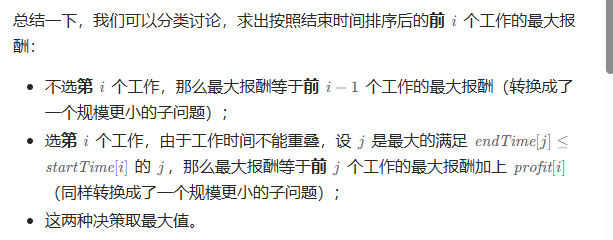
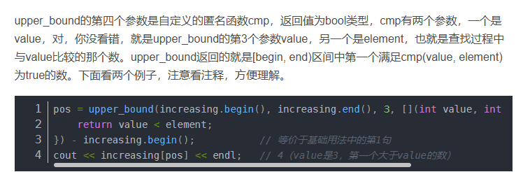

不全记了，只记一下比价好的

https://leetcode.cn/studyplan/top-interview-150/

https://leetcode.cn/problems/lru-cache-lcci/description/


# 经典150

## 数组和字符串

### [合并两个有序数组](https://leetcode.cn/problems/merge-sorted-array/)

```c
class Solution {
public:
    void merge(vector<int>& nums1, int m, vector<int>& nums2, int n) {
        for(int i=m;i<m+n;i++)
        {
            int j = i-1;
            int x = nums2[i-m];
            for(;j>=0;--j)
            {
                if(nums1[j]>x)
                {
                    swap(nums1[j],nums1[j+1]);
                }
                else
                {
                    break;
                }
            }
            nums1[j+1] = x;
        }
        return;
    }
};
```

**进阶：**你可以设计实现一个时间复杂度为 `O(m + n)` 的算法解决此问题吗？

> 基于插入排序，复杂度高，一个j写成i找半天
>

应该

==双指针==

### [删除有序数组中的重复项 II](https://leetcode.cn/problems/remove-duplicates-from-sorted-array-ii/)

```
class Solution {
public:
    int removeDuplicates(vector<int>& nums) {
        int n = nums.size();
        if (n <= 2) {
            return n;
        }
        int slow = 2, fast = 2;
        while (fast < n) {
            if (nums[slow - 2] != nums[fast]) {
                nums[slow] = nums[fast];
                ++slow;
            }
            ++fast;
        }
        return slow;
    }
};


```

必须在 **[原地 ](https://baike.baidu.com/item/原地算法)修改输入数组** 并在使用 O(1) 额外空间的条件下完成。

> ==双指针==


### [多数元素](https://leetcode.cn/problems/majority-element/)

```c

class Solution {
public:
    int majorityElement(vector<int>& nums) {
        int res=nums[0],vote = 1;
        for(int i=1;i<nums.size();i++)
        {
            if(nums[i]!=res) 
            {
                if(--vote==0)
                {
                    vote =1;
                    res = nums[i];
                }
            }
            else vote++;
        }
        return res;
    }
};

```

**进阶：**尝试设计时间复杂度为 O(n)、空间复杂度为 O(1) 的算法解决此问题。

> ==摩尔投票==


### [轮转数组](https://leetcode.cn/problems/rotate-array/)

```c
class Solution {
public:
    void rotate(vector<int>& nums, int k) {
        int n = nums.size();
        if(nums.size()==1||k==0) return;
        while(k--)
        {
            int next,temp = nums[0];
            for(int i=0;i<n-1;i++)
            {
                next = nums[i+1];
                nums[i+1] = temp;
                temp=next;
            }
            nums[0] = next;
        }
        return;
    }
};
```

==k次轮换，超时了==，


> 1. 优化点while，迭起结束？
>
>    ==记下swap的次数==。
>
>    ```c
>    class Solution {
>    public:
>        void rotate(vector<int>& nums, int k) {
>            int n = nums.size(),cnt=0;
>            if(nums.size()==1||k==0) return;
>                                         
>            for(int i=0;i<n;i++)
>            {
>                int next,temp = nums[i], j=i+k;
>                while((j-k==i)||((j-k)%n!=i))
>                {
>                    //cout<< i << " "<< j%n << temp <<endl;
>                    next = nums[j%n];
>                    nums[j%n] = temp;
>                    if(++cnt>=n) return;
>                    temp=next;
>                    j=j+k;
>                }
>            }
>            return;
>        }
>    };
>    ```
>
>    边界问题麻了

> 2. ==整个数组翻转，再反转前k个和后面==


### [O(1) 时间插入、删除和获取随机元素](https://leetcode.cn/problems/insert-delete-getrandom-o1/)

```c
class RandomizedSet {
public:
    vector<int> nums;
    unordered_map<int, int> indices;

    RandomizedSet() {

    }
    
    bool insert(int val) {
        if (indices.count(val)) {
            return false;
        }
        int idx = nums.size();
        indices[val] = idx;
        nums.push_back(val);
        return true;
    }
    
    bool remove(int val) {
        if (!indices.count(val)) {
            return false;
        }
        int idx = indices[val];
        int last = nums.back();
        nums[idx] = last;
        indices[last] = idx;
        nums.pop_back();
        indices.erase(val);
        return true;

    }
    
    int getRandom() {
        int randomIndex = rand()%nums.size();
        return nums[randomIndex];
    }
};

/**
 * Your RandomizedSet object will be instantiated and called as such:
 * RandomizedSet* obj = new RandomizedSet();
 * bool param_1 = obj->insert(val);
 * bool param_2 = obj->remove(val);
 * int param_3 = obj->getRandom();
 */
```


### [加油站](https://leetcode.cn/problems/gas-station/)

一句话概括：如果x到达不了y+1，那么x-y之间的点也不可能到达y+1，因为中间任何一点的油都是拥有前面的余量的，所以下次遍历直接从y+1开始

> 在一条环路上有 `n` 个加油站，其中第 `i` 个加油站有汽油 `gas[i]` 升。
>
> 你有一辆油箱容量无限的的汽车，从第 `i` 个加油站开往第 `i+1` 个加油站需要消耗汽油 `cost[i]` 升。你从其中的一个加油站出发，开始时油箱为空。
>
> 给定两个整数数组 `gas` 和 `cost` ，如果你可以按顺序绕环路行驶一周，则返回出发时加油站的编号，否则返回 `-1` 。如果存在解，则 **保证** 它是 **唯一** 的。
>
> 
>
> **示例 1:**
>
> ```
> 输入: gas = [1,2,3,4,5], cost = [3,4,5,1,2]
> 输出: 3
> 解释:
> 从 3 号加油站(索引为 3 处)出发，可获得 4 升汽油。此时油箱有 = 0 + 4 = 4 升汽油
> 开往 4 号加油站，此时油箱有 4 - 1 + 5 = 8 升汽油
> 开往 0 号加油站，此时油箱有 8 - 2 + 1 = 7 升汽油
> 开往 1 号加油站，此时油箱有 7 - 3 + 2 = 6 升汽油
> 开往 2 号加油站，此时油箱有 6 - 4 + 3 = 5 升汽油
> 开往 3 号加油站，你需要消耗 5 升汽油，正好足够你返回到 3 号加油站。
> 因此，3 可为起始索引。
> ```
>

```c
class Solution {
public:
    int canCompleteCircuit(vector<int>& gas, vector<int>& cost) {
        int n = gas.size();
        int i = 0;
        while (i < n) {
            int sumOfGas = 0, sumOfCost = 0;
            int cnt = 0;
            while (cnt < n) {
                int j = (i + cnt) % n;
                sumOfGas += gas[j];
                sumOfCost += cost[j];
                if (sumOfCost > sumOfGas) {
                    break;
                }
                cnt++;
            }
            if (cnt == n) {
                return i;
            } else {
                i = i + cnt + 1;
            }
        }
        return -1;
    }
};

作者：力扣官方题解
链接：https://leetcode.cn/problems/gas-station/solutions/488357/jia-you-zhan-by-leetcode-solution/
来源：力扣（LeetCode）
著作权归作者所有。商业转载请联系作者获得授权，非商业转载请注明出处。
```

### [接雨水](https://leetcode.cn/problems/trapping-rain-water/)

```c
class Solution {
public:
    int trap(vector<int>& height) {
        int n = height.size();
        vector<int> left(n),right(n);
        int mx = 0,res=0;
        for(int i=0;i<n;i++)
        {
            left[i] = mx;
            mx = max(mx,height[i]);
        }
        mx = 0;
        for(int i=n-1;i>=0;i--)
        {
            right[i] = mx;
            mx = max(mx,height[i]);
            res+=max(0,min(left[i],right[i]) - height[i]);
        }
        return res;
    }
};
```

## 字符串

### [整数转罗马数字](https://leetcode.cn/problems/integer-to-roman/)

```c
class Solution {
public:
    string intToRoman(int num) {
        int values[]={1000,900,500,400,100,90,50,40,10,9,5,4,1};
        string reps[]={"M","CM","D","CD","C","XC","L","XL","X","IX","V","IV","I"};
        
        string res;
        for(int i=0; i<13; i++){
            while(num>=values[i]){
                num -= values[i];
                res += reps[i];
            }
        }
        return res;
    }
};
```


## 动态规划

### [跳跃游戏 II](https://leetcode.cn/problems/jump-game-ii/)

```
public int jump(int[] nums) {
    int end = 0;
    int maxPosition = 0; 
    int steps = 0;
    for(int i = 0; i < nums.length - 1; i++){
        //找能跳的最远的
        maxPosition = Math.max(maxPosition, nums[i] + i); 
        if( i == end){ //遇到边界，就更新边界，并且步数加一
            end = maxPosition;
            steps++;
        }
    }
    return steps;
}

```


## 链表

### [两数相加](https://leetcode.cn/problems/add-two-numbers/)

> 
>
> 给你两个 **非空** 的链表，表示两个非负的整数。它们每位数字都是按照 **逆序** 的方式存储的，并且每个节点只能存储 **一位** 数字。
>
> 请你将两个数相加，并以相同形式返回一个表示和的链表。
>
> 你可以假设除了数字 0 之外，这两个数都不会以 0 开头。
>
>  
>
> **示例 1：**
>
> 
>
> ```
> 输入：l1 = [2,4,3], l2 = [5,6,4]
> 输出：[7,0,8]
> 解释：342 + 465 = 807
> ```

```c
/**
 * Definition for singly-linked list.
 * struct ListNode {
 *     int val;
 *     ListNode *next;
 *     ListNode() : val(0), next(nullptr) {}
 *     ListNode(int x) : val(x), next(nullptr) {}
 *     ListNode(int x, ListNode *next) : val(x), next(next) {}
 * };
 */
class Solution {
public:
    ListNode* addTwoNumbers(ListNode* l1, ListNode* l2) {
        int f=0,num=0;
        ListNode* t = new ListNode(-1);
        ListNode* res = t;
        while(l1!=nullptr||l2!=nullptr||f!=0)
        {
            num =f;
            if(l1!=nullptr)
            {
                num += l1->val ;
                l1 = l1->next;
            }
            if(l2!=nullptr)
            {
                num += l2->val ;
                l2 = l2->next;
            }
            f = num/10;
            num %= 10;
            t->next = new ListNode(num);
            t = t->next;
            if(num==0&&l1==nullptr&&l2==nullptr&&f==0) break;
        }
        return res->next;
    }
};
```

答案代码就是存在l1的链表基础上进行加，而我是从头到尾创建新节点

```c
class Solution {
public:
    // l1 和 l2 为当前遍历的节点，carry 为进位
    ListNode* addTwoNumbers(ListNode* l1, ListNode* l2, int carry = 0) {
        if (l1 == nullptr && l2 == nullptr) { // 递归边界：l1 和 l2 都是空节点
            return carry ? new ListNode(carry) : nullptr; // 如果进位了，就额外创建一个节点
        }
        if (l1 == nullptr) { // 如果 l1 是空的，那么此时 l2 一定不是空节点
            swap(l1, l2); // 交换 l1 与 l2，保证 l1 非空，从而简化代码
        }
        int sum = carry + l1->val + (l2 ? l2->val : 0); // 节点值和进位加在一起
        l1->val = sum % 10; // 每个节点保存一个数位
        l1->next = addTwoNumbers(l1->next, (l2 ? l2->next : nullptr), sum / 10); // 进位
        return l1;
    }
};

作者：灵茶山艾府
链接：https://leetcode.cn/problems/add-two-numbers/solutions/2327008/dong-hua-jian-ji-xie-fa-cong-di-gui-dao-oe0di/
来源：力扣（LeetCode）
著作权归作者所有。商业转载请联系作者获得授权，非商业转载请注明出处。
```


# 技巧


## 二叉树层次遍历


### [二叉树的层平均值](https://leetcode.cn/problems/average-of-levels-in-binary-tree/)

> 给定一个非空二叉树的根节点 `root` , 以数组的形式返回每一层节点的平均值。与实际答案相差 `10-5` 以内的答案可以被接受。
>
> 
>
> **示例 1：**
>
> 
>
> ```
> 输入：root = [3,9,20,null,null,15,7]
> 输出：[3.00000,14.50000,11.00000]
> 解释：第 0 层的平均值为 3,第 1 层的平均值为 14.5,第 2 层的平均值为 11 。
> 因此返回 [3, 14.5, 11] 。
> 
> ```

#### auto [a,b,c]解包结构体

```
auto [val, left, right] = *q.front();
```


#### queue推导类型

```
queue q{deque{root}};
```

deque做底层的queue适配器 c++17支持类模板参数推导

> [shira_yuki](https://leetcode.cn/u/shira_yuki/)
>
> C++简洁代码
>
> ```cpp
> /**
>  * Definition for a binary tree node.
>  * struct TreeNode {
>  *     int val;
>  *     TreeNode *left;
>  *     TreeNode *right;
>  *     TreeNode() : val(0), left(nullptr), right(nullptr) {}
>  *     TreeNode(int x) : val(x), left(nullptr), right(nullptr) {}
>  *     TreeNode(int x, TreeNode *left, TreeNode *right) : val(x), left(left), right(right) {}
>  * };
>  */
> class Solution {
> public:
> vector<double> averageOfLevels(TreeNode* root) {
>   vector<double> ret;
>   if (!root) return {};
>   queue q{deque{root}};
>   while(!empty(q)) {
>       //=======================================
>       int sz = size(q);
>       double sum = 0;
>       for (int i = 0; i != sz; ++i) {
>       //=======================================
>           auto [val, left, right] = *q.front();
>           q.pop();
>           sum += val;
>           if (left)  q.push( left);
>           if (right) q.push(right);
>       }
>       ret.push_back(sum / sz);
>   }
>   return ret;
> }
> };
> ```
>
> 
>
> [@shira_yuki](https://leetcode.cn/u/shira_yuki) 你这个deque为啥能被解包啊
>
> 
>
> [@shira_yuki](https://leetcode.cn/u/shira_yuki) c++ 新标准的牛逼写法，大兄弟掌握的炉火纯青啊， queue q{deque{root}}; 和 auto [val, left, right] = *q.front(); 都是怎么操作的啊。 我写个 queue<TreeNode*> que{root} 都没这种构造方法。。。
>
> 
>
> [@dylanethan](https://leetcode-cn.com/u/dylanethan/)
> queue是容器适配器，必须从底层容器构造 `queue<TreeNode*> q {deque<TreeNode*>{root}}`是用deque做底层的queue适配器 c++17支持类模板参数推导。在可以推导成功的前提下，可以省略模板参数，模板参数自动推导成root的类型 也可以不用deque做底层容器写list也可以 *用于存储元素的底层容器。容器必须满足序列容器 (SequenceContainer) 的要求。另外，它必须提供带通常语义的下列函数：* *back() front() push_back() pop_front()* 顺带一提stack也是类似这样的容器 `auto [val,left,right]`可以从简单的类中按照声明顺序取出所有元素。`*q.front()`是对`TreeNode*`的解引用。


## 其他

### [*规划兼职工作](https://leetcode.cn/problems/maximum-profit-in-job-scheduling/)

> 你打算利用空闲时间来做兼职工作赚些零花钱。
>
> 这里有 `n` 份兼职工作，每份工作预计从 `startTime[i]` 开始到 `endTime[i]` 结束，报酬为 `profit[i]`。
>
> 给你一份兼职工作表，包含开始时间 `startTime`，结束时间 `endTime` 和预计报酬 `profit` 三个数组，请你计算并返回可以获得的最大报酬。
>
> 注意，时间上出现重叠的 2 份工作不能同时进行。
>
> 如果你选择的工作在时间 `X` 结束，那么你可以立刻进行在时间 `X` 开始的下一份工作。
>
> 
>
> **示例 1：**
>
> ****
>
> ```
> 输入：startTime = [1,2,3,3], endTime = [3,4,5,6], profit = [50,10,40,70]
> 输出：120
> 解释：
> 我们选出第 1 份和第 4 份工作， 
> 时间范围是 [1-3]+[3-6]，共获得报酬 120 = 50 + 70。
> ```
>
> 


#### 优先队列解

```c
class Solution {
public:
    int jobScheduling(vector<int>& startTime, vector<int>& endTime, vector<int>& profit) {
        typedef pair<int,int> PII;
        priority_queue<PII,vector<PII>,greater<PII>> q;
        int n = startTime.size(),earn[2][int(1e9)], pre = 0;
        vector<array<int, 3>> jobs(n);
        for (int i = 0; i < n; i++) {
            jobs[i] = {endTime[i], startTime[i], profit[i]};
        }
        ranges::sort(jobs, [](auto &a, auto &b) { return a[1] < b[1]; }); 
        q.push({jobs[0][0],jobs[0][2]});
        for(int i =1;i<n;i++)
        {
            int ed=jobs[i][0],st=jobs[i][1],pf=jobs[i][2];
            while(!q.empty()&&q.top().first<=st)
            {
                pre = max(pre,q.top().second);
                q.pop();
            }
            q.push({ed,pre+pf});
            //cout << i <<  ed << pre+pf <<endl;
        }
        int res = 0;
        while(!q.empty())
        {
            res = max(res,q.top().second);
            q.pop();
            //cout << res <<endl;
        }
        return res;
    }
};

//1-3 20  2-5 20  
```

优先队列，要获得小于start的end的利润的最大值需要pop进行遍历，但是pop的数据还有用，没想到存一个preprofit 最大利润


第二遍   vector，从头遍历,但是 pushb_back结束时间没法排序，应该先对结束时间排序的

#### upper_bound解

[upperbound用法-CSDN博客](https://blog.csdn.net/weixin_43967256/article/details/127462617)




> 所以upperbound是返回比较函数cmp(==target==,element)第一个true
>
> 比如递增序列upperbound(begin,end,target)就是返回一个low(target,element) ==true就是第一个大于的
>
> 比如递增序列lowerbound(begin,end,target)就是返回一个满足low(target,element) ==false就是第一个大于等于的

==第一要想到按结尾时间排序==

```c
class Solution {
public:
    int jobScheduling(vector<int> &startTime, vector<int> &endTime, vector<int> &profit) {
        int n = startTime.size();
        vector<array<int, 3>> jobs(n);
        for (int i = 0; i < n; i++) {
            jobs[i] = {endTime[i], startTime[i], profit[i]};
        }
        ranges::sort(jobs, [](auto &a, auto &b) { return a[0] < b[0]; }); // 按照结束时间排序

        vector<int> f(n + 1);
        for (int i = 0; i < n; i++) {
            int j = upper_bound(jobs.begin(), jobs.begin() + i, array<int, 3>{jobs[i][1], INT_MAX}) - jobs.begin();
            // 状态转移中，为什么是 j 不是 j+1：上面算的是 > 开始时间，-1 后得到 <= 开始时间，但由于还要 +1，抵消了
            f[i + 1] = max(f[i], f[j] + jobs[i][2]);
        }
        return f[n];
    }
};

```

按结尾时间排序
按j动态规划
按二分找到哪个j的结束时间在左侧

#### pair换成array有内置比较函数


