[基础算法 —— 常用代码模板1](#基础算法--常用代码模板1)

- [排序](#排序)
  - [scanf和cin的速度和区别](#scanf和cin的速度和区别)
  - [冒泡排序？](#冒泡排序)
  - [快速排序](#快速排序)
  - [归并排序](#归并排序)
- [二分](#二分)
- [高精度](#高精度)
- [前缀和与差分](#前缀和与差分)
- [双指针算法](#双指针算法)
- [位运算](#位运算)
- [离散化](#离散化)
- [区间合并](#区间合并)


- [数据结构 —— 常用代码模板2](#数据结构--常用代码模板2)
  - [链表与邻接表：树与图的存储](#链表与邻接表树与图的存储)
  - [栈与队列：单调队列、单调栈](#栈与队列单调队列单调栈)
  - [kmp](#kmp)
  - [Trie](#trie)
  - [并查集](#并查集)
  - [堆](#堆)
  - [Hash表](#hash表)
- [搜索与图论 —— 常用代码模板3](#搜索与图论--常用代码模板3)
  - [DFS与BFS](#dfs与bfs)
  - [树与图的遍历：拓扑排序](#树与图的遍历拓扑排序)
  - [最短路](#最短路)
  - [最小生成树](#最小生成树)
  - [二分图：染色法、匈牙利算法](#二分图染色法匈牙利算法)
- [数学知识 —— 常用代码模板4](#数学知识--常用代码模板4)
  - [质数](#质数)
  - [约数](#约数)
  - [欧拉函数](#欧拉函数)
  - [快速幂](#快速幂)
  - [扩展欧几里得算法](#扩展欧几里得算法)
  - [中国剩余定理](#中国剩余定理)
  - [高斯消元](#高斯消元)
  - [组合计数](#组合计数)
  - [容斥原理](#容斥原理)
  - [简单博弈论](#简单博弈论)
- [动态规划](#动态规划)
  - [背包问题](#背包问题)
  - [线性DP](#线性dp)
  - [区间DP](#区间dp)
  - [计数类DP](#计数类dp)
  - [数位统计DP](#数位统计dp)
  - [状态压缩DP](#状态压缩dp)
  - [树形DP](#树形dp)
  - [记忆化搜索](#记忆化搜索)
  - [贪心](#贪心)
    - [1](#1)
- [时空复杂度分析](#时空复杂度分析)


# 其他


### [scanf和cin的速度和区别](https://blog.csdn.net/weixin_49697516/article/details/107831875)

### [堆和栈的区别](https://blog.csdn.net/qq_27825451/article/details/102572636)

[b站视频](https://www.bilibili.com/video/BV1AF411G7cA/?spm_id_from=333.337.search-card.all.click&vd_source=eef102f4fb053709a57c96d0c876628a)

### debug有的变量没有数值，是编译器的O2优化

### [二叉树类型](https://blog.csdn.net/shyjhyp11/article/details/114434370)

### [Cplusplus](https://cplusplus.com/reference/)

### Codeforces


# 基础算法 —— 常用代码模板1

## 排序


#### 冒泡排序？
### 【快速排序】

- 用第一个数来分为两个数组，一个是大于这个数，一个是小于这个数，然后再对这两个数组同样做  
- 先交换分类，再递归
```c++
#include <iostream>
using namespace std;

const int N = 1e6 * +10;

int n;
int q[N];

void quick_sorkt(int q[], int l, int r)
{
    if (l >= r)
        return;
    int x = q[r], i = l - 1, j = r + 1; //数组【2，4】，两个指针i，j都会指idx=1，边界在右
    while (i < j)
    {
        do
            i++;
        while (q[i] < x);
        do
            j--;
        while (q[j] > x);
        if (i < j)
            swap(q[i], q[j]);
    }
    quick_sorkt(q, l, i - 1);//不能quick_sorkt(q, l, j)这样写，否则j=1，死循环quick_sorkt(q, 0, 1);
    						
    quick_sorkt(q, i, r); //为什么不是quick_sorkt(q, i+1, r) ， i+1可能超出边界
    						//i不可能等于l，因为x = q[r]所以j--第一次必停止，i++一但等于l时候停止肯定触发swap
}

int main(int argc, char *argv[])
{
    // 49156832687
    // 42156839687
    // 42136859687
    scanf("%d", &n);
    for (int i = 0; i < n; i++)
        scanf("%d", &q[i]);

    quick_sorkt(q, 0, n - 1);

    for (int i = 0; i < n; i++)
        printf("%d ", q[i]);
}
```

### 【归并排序】

- 先递归，再排序
```c++
#include <iostream>
using namespace std;

const int N = 1e6 * +10;

int n = 10;
int q[10] = { 1, 5, 6, 8, 9, 5, 11, 5, 63, 15 }, temp[N];

void merge_sorkt(int q[], int l, int r)
{
    if (l >= r)
        return;

    int mid = (l + r) >> 1;// 向左取整，左边界 如果是l=0,r=1,mid=0      merge_sorkt(q, 0, 1);死循环
    merge_sorkt(q, l, mid);
    merge_sorkt(q, mid + 1, r);
    int k = 0, i = l, j = mid + 1;
    while (i <= mid && j <= r)
    {
        if (q[i] <= q[j])
        {
            temp[k++] = q[i++];
        }
        else
        {
            temp[k++] = q[j++];
        }
    }
    while (i <= mid)
    {
        temp[k++] = q[i++];
    }
    while (j <= r)
    {
        temp[k++] = q[j++];
    }
    for (i = l, j = 0; i <= r; i++, j++)
    {
        q[i] = temp[j];
        printf("%d ", q[i]);
    }
    printf("\n");
    return;
}

int main(int argc, char *argv[])
{
    // 49156832687
    // 42156839687
    // 42136859687
    // scanf("%d", &n);
    // for (int i = 0; i < n; i++)
    //     scanf("%d", &q[i]);

    merge_sorkt(q, 0, n - 1);

    for (int i = 0; i < n; i++)
        printf("%d ", q[i]);
    return 0;
}
  
```
### 【归并和快排自己的】

```c
class Solution {
public:
    void quicksort(int l,int r,vector<int>& nums)
    {
        if(l>=r ) return; //要返回
        int i=l-1,j = r +1;
        int mid =(l+r)>>1;
        int x = nums[mid];
        while(i<j)
        {
            do i++;while(i<r&&nums[i]<x); //不能加=
            do j--;while(j>l&&nums[j]>x);
            if(i<j) swap(nums[i],nums[j]);
        }
        quicksort(l,j,nums);//必须返回j
        quicksort(j+1,r,nums);
    }
    vector<int> sortArray(vector<int>& nums) {
        int l = 0, r = nums.size()-1;
        quicksort(l,r,nums);
        return nums;
    }
};
```


```c
class Solution {
public:
    void merge_sort(int l,int r,vector<int>& nums)
    {
        vector<int> temp;
        if(l>=r) return;
        int i=l,k=0,mid = (l+r)>>1,j = mid+1;//这里j必须要mid+1，不能mid
        merge_sort(l,mid,nums);
        merge_sort(mid+1,r,nums);
        while(i<=mid&&j<=r)
        {
           if(nums[i]<nums[j]) temp.push_back(nums[i++]);
           else temp.push_back(nums[j++]);
        }
        while(i<=mid) temp.push_back(nums[i++]);
        while(j<=r) temp.push_back(nums[j++]);
        i = l;
        for(auto x:temp) nums[i++] = x;
    }
    vector<int> sortArray(vector<int>& nums) {
        int l = 0, r = nums.size()-1;
        merge_sort(l,r,nums);
        return nums;
    }
};
```


## 二分

有序，查找，用二分


两种模版，一个是判断红色的右边界，一种是判断绿色的左边界

### [整数查找]

```c++
#include <iostream>
using namespace std;

const int N = 1e6 * +10;

int n = 10;
int q[10] = {1, 2, 2, 2, 3, 3, 4, 5, 5, 5}, temp[N];
int x = 5;
int main(int argc, char *argv[])
{
    // 49156832687
    // 42156839687
    // 42136859687
    // scanf("%d", &n);
    // for (int i = 0; i < n; i++)
    //     scanf("%d", &q[i]);
    int l = 0, r = n - 1, mid = 0;
    while (r > l)
    {
        mid = l + r >> 1;
        if (q[mid] >= x)
        {
            r = mid;//不能向上取整
        }
        else
        {
            l = mid + 1; // q[mid] < x肯定不是mid，所以mid + 1
        }
    }
    if (q[l] != x)
    {
        printf("no find ");
        return 0;
    }
    printf("%d ", l);

    l = 0, r = n - 1, mid = 0;
    while (r > l)
    {
        mid = l + r + 1 >> 1; //向上取整
        if (q[mid] <= x)
        {
            l = mid; // mid = l，mid就不能下取整，否则死循环
        }
        else
        {
            r = mid - 1; // q[mid] > x肯定不是mid
        }
    }
    printf("%d \n", r);

    for (int i = 0; i < n; i++)
        printf("%d ", q[i]);
    return 0;
}

```
### [浮点数求根号]

```c++
#include <iostream>
using namespace std;

double x = 79.12;
int main(int argc, char *argv[])
{
    double l = 0, r = x, mid = 0;
    while (r -l > 1e-5)
    {
		printf("%f ", mid);
		mid = (l+r)/2;
        if(mid*mid<x)
			l = mid;
		else
			r =mid;
    }

	printf("%f ", mid);
    return 0;
}

```

## 高精度

### 【高精度加法】

```c++
#include <iostream>
#include <vector>
using namespace std;

vector<int> Myadd(vector<int> A, vector<int> B)
{
    vector<int> C;
    int t = 0;
    for (int i = 0; i < A.size() || i < B.size(); i++)
    {
        if (i < A.size())
            t += A[i];
        if (i < B.size())
            t += B[i];
        C.push_back(t % 10);
        t = t / 10;
    }
    if(t) C.push_back(1);
    for (int i = 0; i < C.size(); i++)
    cout <<C[i];
    return C;
}

int main(int argc, char *argv[])
{
    string a, b;
    // cin >> a >> b;
    a = "1214135";
    b = "78457";
    vector<int> A, B;
    for (int i = a.size() - 1; i >= 0; i--)
        A.push_back(a[i] - '0');
    for (int i = b.size() - 1; i >= 0; i--)
        B.push_back(b[i] - '0');

    for (int i = 0; i < A.size(); i++)
        cout << A[i];
    cout << "\n";
    for (int i = 0; i < B.size(); i++)
        cout << B[i];
    cout << "\n";
    Myadd(A, B);

}

```


### 【高精度减法】

> A - B

```c++
 #include <iostream>
 #include <vector>
 using namespace std;


bool compare(vector<int> &A,vector<int> &B)
{
	//判断是不是A大于等于B
	if(A.size()!=B.size())
		return A.size()>B.size();
	for(int i=A.size()-1;i>=0;i--)
		if(A[i]>B[i])
			return true;
	return true;
}


vector<int> Mysub(vector<int> &A,vector<int> &B)
{
	vector<int> C;
	int t=0;
	int i=0;
	for(i;i<B.size();i++)
	{
		t = A[i]-B[i] -t;
		if(t<0)
		{
			t+=10;
			C.push_back(t);
			t=1;
		}
		else
		{
			C.push_back(t);
			t=0;
		}
	}
	A[i]-=t;
	for(i;i<A.size();i++)
		C.push_back(A[i]);
	for(int i=C.size()-1;i>=0;i--)
	{
		cout << C[i];
	}
	return C;

}
//Y总的模版
// vector<int> Mysub(vector<int> &A,vector<int> &B)
// {
// 	vector<int> C;

// 	for(int i,t=0;i<A.size();i++)
// 	{
// 		t = A[i] - t;
// 		if(i<B.size())
// 		 	t-=B[i];
// 		C.push_back((t+10)%10); //这里很妙
// 		if(t<0) t =1;
// 		else t=0;
// 	}
// 	while (C.size()>1&&C.back()==0)
// 	{
// 		C.pop_back();
// 	}
// 	for(int i=C.size()-1;i>=0;i--)
// 	{
// 		cout << C[i];
// 	}
// 	return C;
// }

 int main()
 {
	string a,b;
	a = "174973879";
	b = "9457";
	vector<int> A,B;
	//cin >> a >> b;
	for(int i=a.size()-1;i>=0;i--)
	{
		A.push_back(a[i]-'0');
		cout << a[i]-'0';
	}
	cout << '\n';
	for(int i=b.size()-1;i>=0;i--)
	{
		B.push_back(b[i]-'0');
		cout << b[i]-'0';
	}
	cout << '\n';
	if (compare(A,B))
		Mysub(A,B);
	else
		Mysub(B,A);
 }
```

### 【高精度乘法】

```c++
#include <iostream>
#include <vector>
using namespace std;

vector<int> Mymult(vector<int> A, int b)
{
    vector<int> C;
    int t = 0;
    for (int i = 0; i < A.size(); i++)
    {
        t = A[i] * b + t;
        C.push_back(t % 10);
        t = t / 10;
    }

    while (t)
    {
        C.push_back(t % 10);
        t /= 10;
    }

    for (int i = C.size() - 1; i >= 0; i--)
        cout << C[i];
    return C;
}

//Y总写法
// vector<int> Mydiv(vector<int> A, int b)
// {
//     vector<int> C;
//     int t = 0;
//     for (int i = 0; i < A.size() || t; i++)  //这里写的秒
//     {
//         if (i < A.size())
//             t = A[i] * b + t;
//         C.push_back(t % 10);
//         t = t / 10;
//     }

//     for (int i = C.size() - 1; i >= 0; i--)
//         cout << C[i];
//     return C;
// }

int main(int argc, char *argv[])
{
    string a;
    int b;
    // cin >> a >> b;
    a = "1214135";
    b = 78;
    vector<int> A;
    for (int i = a.size() - 1; i >= 0; i--)
        A.push_back(a[i] - '0');
    for (int i = 0; i < A.size(); i++)
        cout << A[i];
    cout << "\n";
    cout << b;
    cout << "\n";
    Mymult(A, b);
}

```

### 【高精度除法】

> 给定两个非负整数（不含前导 00） A，B，，请你计算 A/B 的商和余数

```c++
#include <iostream>
#include <vector>
#include <algorithm>
using namespace std;

vector<int> Mydiv(vector<int> A, int b)
{
    vector<int> C;
    int t = 0;
    for (int i = A.size() - 1; i >= 0; i--)
    {
        t = A[i] + t * 10;
        C.push_back(t / b);
        t = t % b;
    }
    reverse(C.begin(), C.end());
    while (C.size() > 1 && C.back() == 0) C.pop_back();

    for (int i = C.size()-1; i >=0; i--)
        cout << C[i];
    cout <<endl;
    cout << t <<endl;
    return C;
}

int main(int argc, char *argv[])
{
    string a;
    int b;
    cin >> a >> b;
    // a = "1214135";
    // b = 78;
    vector<int> A;
    for (int i = a.size() - 1; i >= 0; i--)
        A.push_back(a[i] - '0');
    // for (int i = A.size() - 1; i >= 0; i--)
    //     cout << A[i];
    // cout << "\n";
    // cout << b;
    // cout << "\n";
    Mydiv(A, b);
    
}

```


## 前缀和与差分

### 【前缀和】

输入一个长度为 nn 的整数序列。

接下来再输入 mm 个询问，每个询问输入一对 l,rl,r。

对于每个询问，输出原序列中从第 ll 个数到第 rr 个数的和

```c++
#include <iostream>
using namespace std;
const int N = 100010;

int n = 11, m=1;
int a[N] = {12,63,8,12,7,9,124,8,6,1,15}, s[N];

int main()
{
    printf("%d\n", s[0]); //初始化是0
    for (int i = 1; i <= n; i ++ ) s[i] = s[i - 1] + a[i]; // 前缀和的初始化

    while (m -- )
    {
        int l=3, r=6;
        printf("%d\n", s[r] - s[l - 1]); // 区间和的计算
    }
    return 0;
}

```

### 【二维前缀和】

```c++
#include <iostream>
using namespace std;
const int N = 1010;//二维数组不能开太大

int n = 6, m = 6, q = 1;
int a[N][N] = {{12, 63, 8, 12, 7, 9},
               {12, 63, 8, 12, 7, 9},
               {12, 63, 8, 12, 7, 9},
               {12, 63, 8, 12, 7, 9},
               {12, 63, 8, 12, 7, 9},
               {12, 63, 8, 12, 7, 9}},
    s[N][N];

int main()
{
    for (int i = 1; i <= n; i++)
    {
        for (int j = 1; j <= m; j++)
        {
            s[i][j] = s[i][j - 1] + s[i - 1][j] - s[i - 1][j - 1] + a[i-1][j-1]; // 前缀和的初始化
        }
    }
    int l, r;
    scanf("%d", &l);
    scanf("%d", &r);
    printf("%d\n", s[l][r]); // 区间和的计算

    return 0;
}

```

### 【差分】

输入一个长度为 nn 的整数序列。

接下来输入 mm 个操作，每个操作包含三个整数 l,r,cl,r,c，表示将序列中 [l,r][l,r] 之间的每个数加上 cc。

请你输出进行完所有操作后的序列。

```c++
 #include <iostream>
 #include <vector>

using namespace std;
int n ;
int m=1 ;
const int N=100010;
int a[N],b[N];

void insert(int l,int r,int c)
{
	b[l] +=c;
	b[r+1] -=c;
}

 int main()
 {
	scanf("%d",&n);
	cout << "输入个数：" <<n << endl;
	for(int i=0;i<n;i++) scanf("%d",&a[i]);

	for(int i=0;i<n;i++) insert(i,i,a[i]);

	while (m--)
	{
		int l, r, c;
		cout << "输入l，r，c" << endl;
		scanf("%d%d%d",&l, &r, &c);
		insert(l,r,c);
	}
	

	for(int i=1;i<n;i++) b[i]+=b[i-1];

	for(int i=0;i<n;i++) cout << b[i] << " ";


}
```

### 【二维差分】

```c++
#include <iostream>

using namespace std;

const int N = 1010;

int n, m, q;
int a[N][N], b[N][N];

void insert(int x1, int y1, int x2, int y2, int c)
{
    b[x1][y1] += c;
    b[x2 + 1][y1] -= c;
    b[x1][y2 + 1] -= c;
    b[x2 + 1][y2 + 1] += c;
}

int main()
{
    scanf("%d%d%d", &n, &m, &q);

    for (int i = 1; i <= n; i ++ )
        for (int j = 1; j <= m; j ++ )
            scanf("%d", &a[i][j]);

    for (int i = 1; i <= n; i ++ )
        for (int j = 1; j <= m; j ++ )
            insert(i, j, i, j, a[i][j]);

    while (q -- )
    {
        int x1, y1, x2, y2, c;
        cin >> x1 >> y1 >> x2 >> y2 >> c;
        insert(x1, y1, x2, y2, c);
    }

    for (int i = 1; i <= n; i ++ )
        for (int j = 1; j <= m; j ++ )
            b[i][j] += b[i - 1][j] + b[i][j - 1] - b[i - 1][j - 1];

    for (int i = 1; i <= n; i ++ )
    {
        for (int j = 1; j <= m; j ++ ) printf("%d ", b[i][j]);
        puts("");
    }

    return 0;
}

```


## 双指针算法

### 【输出单词】

```c++
#include <iostream>
#include <vector>
#include <string.h>
#include <stdio.h>
using namespace std;
int n=200;


 int main()
 {
	char str[n];
	char temp[20];
	// scanf("%s",&str);
	// 无法读取空格
	
	fgets(str, sizeof (str), stdin);//\n结尾
	for(int i=0;i<n;i++) 
	{
		int j=i;
		while(j<n&&str[j]!='  '&&str[j]!='\n')   j++;
		for(int k=i;k<j;k++)
			cout << str[k] << " ";
		cout <<endl;
		i = j;	
		if(str[i]=='\n') return 0;
		
	}

			
}
```

### 【最长不重复子串】

```c++
#include <iostream>
#include <vector>
#include <string.h>
#include <stdio.h>
using namespace std;

const int N=10010;
int a[N],h[N];

int main()
{
	int n;
	scanf("%d",&n);
	for(int i=0;i<n;i++) 
	{
		scanf("%d",&a[i]);
	}

	int res=0;
	for(int i=0,j=0;i<n;i++)
	{
		h[a[i]]++; //hash表+1
		while(h[a[i]]>1)
		{
			h[a[j]]--;//前移到hash表加入的元素被移除
			j++;
		}
		res = max(res,i-j+1);
	}
	cout << "res:" << res <<endl;
		
}
```


## 位运算

### 【统计输入数字的二级制1的个数】

```c++
#include <iostream>
#include <vector>
#include <string.h>
#include <stdio.h>
using namespace std;
//统计输入数字的二级制1的个数
const int N=10010;
int n;

int lowbit(int n)
{
	return n&(~n+1);
}

int main()
{
	int res=0;
	scanf("%d",&n);
	while(n)
	{
		n-=lowbit(n);
		res++;
	}

	cout << "res:" << res <<endl;
		
}
```


## 离散化

和hashmap的区别是==保序离散化==

感觉小难

> 在无限长的数组离散位置+c，求任意一段内所有位置的数值和
>

```c++
#include <iostream>
#include <vector>
#include <string.h>
#include <stdio.h>
#include <algorithm>
using namespace std;
const int N=10010;
int n,m;
int a[N],s[N];//离散化的数组和前缀和
typedef pair<int,int> PII;
vector<int> alls;//所有需要离散话的数
vector<PII> adds,query;//要加的数和查询的结果


int find(int x)
{
	int l=0,r = alls.size()-1;
	cout << "alls.size()" << alls.size() << endl;
	while (l<r)
	{
		int mid = l+r>>1;
		if(alls[mid]>=x) r = mid;//这里是求alls的x位置
		else l = mid +1;
	}
	return r + 1;
}

int main()
{
	cout <<"输入n,m" <<endl;
	scanf("%d%d",&n,&m);
	cout <<"输入adds" <<endl;
	for(int i=0;i<n;i++) 
	{
		int x,c;
		//scanf("%d%d",&x,&c); 错误写法
		cin >> x >> c;
		adds.push_back({x,c});
		alls.push_back(x);
	}
	cout <<"querys" <<endl;
	for(int i=0;i<m;i++) 
	{
		int l,r;
		//scanf("%d%d",&l,&r);
		cin >> l >> r;
		query.push_back({l,r});
		alls.push_back(l);
		alls.push_back(r);
	}
	sort(alls.begin(),alls.end());
	alls.erase(unique(alls.begin(),alls.end()),alls.end());//unique(alls.begin(),alls.end())会返回排序后的最后一个索引位置
	

	//初始化a[n];
	for(auto item: adds)
	{

		int x = find(item.first);
		a[x] += item.second;

	}
	for(int i=1;i<=alls.size();i++) s[i] = s[i-1] + a[i];//alls.size()就是用到的最大的坐标
	for(int i=0;i<m;i++) cout << s[find(query[i].second)] - s[find(query[i].first)-1] <<endl;//find离散化从1开始，所以find(query[i].first)-1不会有边界问题
	return 0;
}
```


## 区间合并

> 给定 n 个区间 [li,ri][��,��]，要求合并所有有交集的区间。
>
> 注意如果在端点处相交，也算有交集。
>
> 输出合并完成后的区间个数。
>
> 例如：[1,3][1,3] 和 [2,6][2,6] 可以合并为一个区间 [1,6][1,6]。

```c++
#include <iostream>
#include <vector>
#include <string.h>
#include <stdio.h>
#include <algorithm>
using namespace std;
const int N=10010;
int n,m;
int a[N],s[N];
typedef pair<int,int> PII;
vector<PII>  regions;
PII temp_region;

void merge(vector<PII> &regins)
{
	vector<PII>  res;
	sort(regions.begin(),regins.end());
	temp_region = regions[0];//初始化区间怎么设？y总是初始的temp_regin
	//为负无穷，res.push_back(temp_region);判断不为初始的区间
	for(auto regin:regins)
	{
		if(regin.first>temp_region.second)
		{
			res.push_back(temp_region);
			temp_region = regin;
		}
		else if(regin.second>temp_region.second)
		{
			temp_region.second = regin.second;
		}
        //这个else if Y总 用max（temp_region.second，regin.second）替换
	}
	res.push_back(temp_region);
	for(auto regin:res)
		cout << regin.first << " " <<  regin.second <<endl;

}

int main()
{
	cout <<"输入n" <<endl;
	scanf("%d",&n);
	for(int i=0;i<n;i++) 
	{
		cout <<"输入regions" <<endl;
		cin >> temp_region.first >> temp_region.second;
		regions.push_back(temp_region);
	}
	
	merge(regions);	
	return 0;
}
```


# 数据结构 —— 常用代码模板2

## 链表与邻接表：树与图的存储

### 【静态单向】

> 实现一个单链表，链表初始为空，支持三种操作：
>
> 1. 向链表头插入一个数；
> 2. 删除第 k个插入的数后面的数；
> 3. 在第 k 个插入的数后插入一个数。
>
> 现在要对该链表进行 M 次操作，进行完所有操作后，从头到尾输出整个链表。
>
> **注意**:题目中第 k 个插入的数并不是指当前链表的第 k 个数。例如操作过程中一共插入了 n 个数，则按照插入的时间顺序，这 n 个数依次为：第 11 个插入的数，第 22 个插入的数，…第 n 个插入的数。

不是结构体动态链表。因为动态链表每个node都需要new出来，非常的耗时

```c++
#include <iostream>
#include <vector>
#include <string.h>
#include <stdio.h>
#include <algorithm>
using namespace std;
const int N=10010;
int n,idx,head,e[N],ne[N];
//比指针链表快
void init()
{
	head = -1;
	idx = 0;
}

void add(int val)
{
	e[idx] = val;
	ne[idx] = head;
	head = idx;
	idx++;
	
}

void insert(int k,int val)
{
	e[idx] = val;
	ne[idx] = ne[k];
	ne[k] = idx;
	idx++;
}

void del(int k)//第k个插入点的next的点删除
{
	ne[k] = ne[ne[k]];
}

int main()
{
	cout <<"输入n" <<endl;
	scanf("%d",&n);
	init();
	for(int i=0;i<n;i++) 
	{
		char op;
		int val;
		int k;
		cin >> op;
		cout << "op==" << op << endl;
		if (op == 'a')
		{
			cin >> val;
			add(val);
			cout << "add" << val << endl;
		}
		else if (op =='i')
		{
			cin >> k >> val;
			insert(k,val);
		}
		else if (op=='d')
		{
			cin >> k;
			del(k);
		}
	}
	for(int i=head;i!=-1;i=ne[i])
	{
		cout << "i="<<  i << " "<< e[i]<<endl;;
	}
	return 0;
}
/*输入n
5
a 1
a 2
a 3
i 1 9
i 2 8
输出：
i=2 3
i=4 8
i=1 2
i=3 9
i=0 1*/
```

### 【静态双向链表】

> 实现一个双链表，双链表初始为空，支持 55 种操作：
>
> 1. 在最左侧插入一个数；
> 2. 在最右侧插入一个数；
> 3. 将第 k 个插入的数删除；
> 4. 在第 k 个插入的数左侧插入一个数；
> 5. 在第 k 个插入的数右侧插入一个数
>
> 现在要对该链表进行 M 次操作，进行完所有操作后，从左到右输出整个链表。
>
> **注意**:题目中第 k 个插入的数并不是指当前链表的第 k 个数。例如操作过程中一共插入了 n 个数，则按照插入的时间顺序，这 n 个数依次为：第 11 个插入的数，第 22 个插入的数，…第 n 个插入的数。

```c++
#include <iostream>
#include <vector>
#include <string.h>
#include <stdio.h>
#include <algorithm>
using namespace std;
const int N=10010;
int n,idx,head,ed,e[N],le[N],re[N];
//l是head， r是end
void init()
{
	head = 0;
	le[head]=-1,re[head]=1;
	ed = 1;
	le[ed]=0,re[ed]=-1;
	idx = 2;
}

void addl(int val)
{
	e[idx] = val;
	le[idx] = head;
	re[idx] = re[head];

	le[re[head]] = idx;
	re[head] = idx;
	idx++;
	
}

void addr(int val)
{
	e[idx] = val;
	le[idx] = le[ed];
	re[idx] = ed;

	re[le[ed]] = idx;
	le[ed] = idx;
	idx++;
}


int main()
{
	cout <<"输入n" <<endl;
	scanf("%d",&n);
	init();
	for(int i=0;i<n;i++) 
	{
		char op;
		int val;
		int k;
		cin >> op;
		cout << "op==" << op << endl;
		if (op == 'l')
		{
			cin >> val;
			addl(val);
			cout << "add" << val << endl;
		}
		else if (op =='r')
		{
			cin >> val;
			addr(val);
			cout << "add" << val << endl;
		}
	}
	for(int i=head;i!=-1;i=re[i])//先i=re[i]再判断i!=-1
	{
		cout << "i="<<  i << " "<< e[i]<<endl;;
	}
	return 0;
}

```

### 【临接表】

说是就是n个单向链表

## 栈与队列：单调队列、单调栈

### 【前面最近的比它小的元素】

> 给定一个长度为 N 的整数数列，输出每个数左边第一个比它小的数，如果不存在则输出 −1−1。
>

```c++
#include <iostream>
#include <vector>
#include <stack>
#include <string.h>
#include <stdio.h>
#include <algorithm>
using namespace std;
const int N=10010;
int n,stk[N],stt;
//求一个数组的每一个元素的前面最近的比它小的元素

int main()
{
	cout <<"输入n" <<endl;
	scanf("%d",&n);
	int a[n];
	vector<int> res;
	for(int i=0;i<n;i++) 
	{
		cin >> a[i];
	}	
	res.push_back(-1);
	stk[stt++] = a[0];
	for(int i=1;i<n;i++)
	{	/*错误写法
		for(int j=stt-1;j>=0;j--)
		{
			if(j==-1) res.push_back(-1);
			if(stk[j]<a[i]) 
			{
				res.push_back(stk[j]);
				break;
			}			
		}
        
		if(a[i]>stk[stt-1]) stk[stt++] = a[i]; //入栈一个更小的数，是要把栈顶大的数全部移除，而不是只加入更大的数
		*/
        for(int j=stt-1;j>=0;j--)
		{
			if(j==-1) res.push_back(-1);
			if(stk[j]<a[i]) 
			{
				res.push_back(stk[j]);
				stk[stt++] = a[i];
				break;
			}
			stt--;		//入栈一个更小的数，是要把栈顶大的数全部移除	
		}
	}

	for(int x:res)
	{
		cout << x << endl;
	}

	return 0;
}

```

y总答案

```c++
#include <iostream>

using namespace std;

const int N = 100010;

int stk[N], tt;

int main()
{
    int n;
    cin >> n;
    while (n -- )
    {
        int x;
        scanf("%d", &x);
        while (tt && stk[tt] >= x) tt -- ;
        if (!tt) printf("-1 ");
        else printf("%d ", stk[tt]);
        stk[ ++ tt] = x;
    }

    return 0;
}

```

### 【滑动窗口3内最小的数】


```c++
#include <iostream>
#include <vector>
#include <stack>
#include <string.h>
#include <stdio.h>
#include <algorithm>
using namespace std;
const int N=10010;
int n,a[N],q[N],head,ed;
vector<int> res;
//都是先想暴力算法，然后优化没用的元素

int main()
{
	cout <<"输入n" <<endl;
	scanf("%d",&n);

	for(int i=0;i<n;i++) 
	{
		cin >> a[i];
	}	
	
	q[ed++] = a[0];
	res.push_back(a[0]);
	for(int i=1;i<n;i++)
	{
		q[ed++] = a[i];
		while(q[head]>a[i]||ed-head>3) head++;
//end指的始终是空的
//错误写法！队尾插入和队头开始比较大小无法 维持单调递增
//应该是从队尾开始删除比a[i]大的元素，但是有问题，如果ed--，就不知道窗口head和ed的数在a中的下表差是否超出窗口长度
//所以要从队尾删除元素，而且原数组a[]中的下表也需要保存，所以 维持单调递增q[head]不应该是对应的值而是应该存储a数组的下表
		res.push_back(q[head]);
	}
	cout << "res" << endl;
	for(int x:res)
	{
		cout << x << endl;
	}

	return 0;
}

```

### y总答案

这里q[N]存的是元素在a中的下表索引这个要记得

本质其实是用一个单调队列来维护一个双指针

q队列维护单增，最小就始终是队头的第一个

```c++
#include <iostream>
#include <vector>
#include <stack>
#include <string.h>
#include <stdio.h>
#include <algorithm>
using namespace std;
const int N=10010;
int n=12,a[N]={1,3,16,41,7,31,6,8,45,6,56,12},q[N];//这里q[N]存储的不是a 数组元素的值而是对应的下标！！！！
vector<int> res;
//都是先想暴力算法，然后优化没用的元素

int main()
{
	int front=0,tail=-1;
	for(int i=0;i<n;i++)
	{
		if(i - q[front]>=3) front++;//判断当前的i和q[front]距离有没有超出3
		while(front<=tail&&a[i]<=a[q[tail]]) //从队尾剔除
		{
			tail--;
		}

		q[++tail] = i;
		cout << tail << front << endl;
		res.push_back(a[q[front]]);
	}
	cout << "res" << endl;
	for(int x:res)
	{
		cout << x << endl;
	}

	return 0;
}

```


## kmp

### 【字符串匹配】==难==

> 给定一个字符串 S，以及一个模式串 P，所有字符串中只包含大小写英文字母以及阿拉伯数字。
>
> 模式串 P 在字符串 S 中多次作为子串出现。
>
> 求出模式串 P 在字符串 S中所有出现的位置的起始下标。


1. 1.已经匹配的部分有一样的前后缀部分，直接移动到后缀部分

2. [为什么直接移到那个位置，这直接没有解了么？如果有那么最大前后缀就求错了，矛盾 4:00](https://www.bilibili.com/video/BV1jb411V78H/?spm_id_from=333.337.search-card.all.click&vd_source=eef102f4fb053709a57c96d0c876628a)

3. 整个过程主串的指针是不动的,i就一直加

4. next[j]等于j位置最长公共前缀长度+1

5. j是已经成功匹配的位置，正在匹配的是j+1,所以初始化的时候j=0,从j+1匹配

6. 求next数组的时候为什么while(j&&p[i]!=p[j+1]) ==j=nex[j]==;

   举例子 ababa ，最长前缀是aba，

   再加一个A,变 ababaa, abaa不等于 abab,则直接尝试j=nex[j]

   
   
   [next数组怎么求 24：00](https://www.acwing.com/video/259/)：
   
   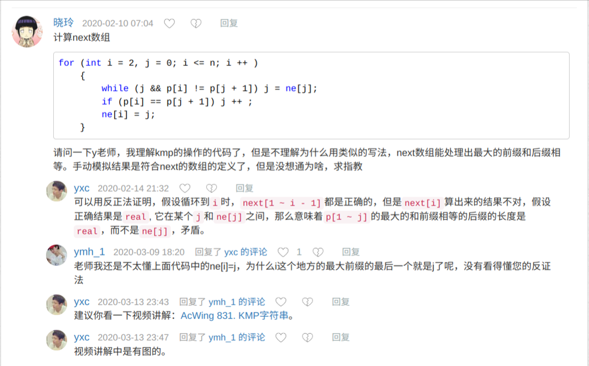
   
   

```c++
#include <iostream>
#include <vector>
#include <stack>
#include <string.h>
#include <stdio.h>
#include <algorithm>
using namespace std;
//BMP算法
//1.已经匹配的部分有一样的前后缀部分，直接移动到后缀部分
//2.为什么直接移到那个位置，这直接没有解了么？如果有那么最大前后缀就求错了，矛盾https://www.bilibili.com/video/BV1jb411V78H/?spm_id_from=333.337.search-card.all.click&vd_source=eef102f4fb053709a57c96d0c876628a
//3.整个过程主串的指针是不动的

//next[j]等于j位置最长公共前缀长度+1
//
const int M=10010,N=100;
int n=12,m=19;
int nex[N];
char s[M],p[N]; //M>N


int main()
{
	cin >> s >> p+1;


	for(int i=2,j=0;i<=n;i++)//<=因为p从1开始
	{
		while(j&&p[i]!=p[j+1]) j=nex[j];//j是已经成功匹配的位置，正在匹配的是j+1   j&&防止退到头都不匹配
		if(p[i]==p[j+1]) j++;//如果找到了相同的，j++，
		nex[i] = j;
	}
	cout << "nex:";
	for(int i=0;i<n;i++) cout << nex[i] << " ";
	cout <<	endl << "res:";


	for(int i=0,j=0;i<m;i++)
	{
		while(j&&s[i]!=p[j+1]) j=nex[j];//j是已经成功匹配的位置，正在匹配的是j+1,所以初始化的时候j=0,从j+1匹配
		//如果不匹配则退一步到j=nex[j]，再看下一步匹不匹配
		//退都头也不匹配或者找到匹配的j跳出循环
		if(s[i]=p[j+1]) j++;//如果匹配j++，i++，否则只有i++
		if(j==n)
		{
			printf("%d",i-n+1);//输出
			j = nex[j];//检测下一个结果
		}
	}
	return 0;
}

```

二刷，不加第一个哨兵使得i从1开始

==idx必须表示是包括第i个字符的公共前后缀长度==

j表示已经匹配的位置

```c
class Solution {
public:
    int strStr(string haystack, string needle) {
        int n = haystack.size(), m = needle.size();
        vector<int> idx(m,-1);//存的是包括第i个字符的公共前后缀长度
        idx[0] = -1;
        int j =-1;
        for(int i=1;i<m;i++)
        {
            while(j!=-1&&needle[i]!=needle[j+1])
            {
                j = idx[j];
            }
            if(needle[i]==needle[j+1]) j++;
            idx[i]=j;
        }
        j=-1;
        for(auto x:idx) cout <<x<<endl;
        for(int i=0;i<n;i++)
        {
            if(haystack[i]==needle[j+1]) 
            {
                if(++j==m-1) return i-m+1;
            }
            else
            {
                while(j!=-1&&haystack[i]!=needle[j+1]) j = idx[j];
                if(haystack[i]==needle[j+1]) j++;
            }
        }
       
        return -1;
    }
};
```

j表示待匹配的位置

```c
class Solution {
public:
    int strStr(string haystack, string needle) {
        int n = haystack.size(), m = needle.size();
        vector<int> idx(m,0);//存的是包括第i个字符的公共前后缀长度
        idx[0] = 0;
        int j =0;
        for(int i=1;i<m;i++)
        {
           
            while(j>=1&&needle[i]!=needle[j])
            {
                j = idx[j-1];
            }
            if(needle[i]==needle[j]) idx[i] = ++j;
            else  idx[i] = j;
            
        }
        j=0;
        for(auto x:idx) cout << x <<endl;
        for(int i=0;i<n;i++)
        {
            cout << i << j<<endl;
            if(haystack[i]==needle[j]) 
            {
                if(++j==m) return i-m+1;
            }
            else
            {
                while(j>=1&&haystack[i]!=needle[j]) j = idx[j-1];
                if(haystack[i]==needle[j]) ++j;
            }
        }
       
        return -1;
    }
};
```


## Trie

### 高效存储多个字符串

> 维护一个字符串集合，支持两种操作：
>
> 1. `I x` 向集合中插入一个字符串 x；
> 2. `Q x` 询问一个字符串在集合中出现了多少次。
>
> 共有 N 个操作，所有输入的字符串总长度不超过 105105，字符串仅包含小写英文字母。

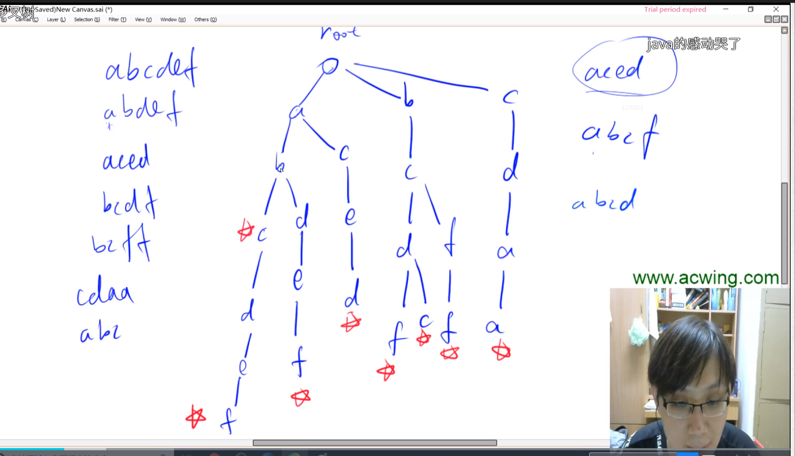

```c++
#include <iostream>
#include <vector>
#include <stack>
#include <string.h>
#include <stdio.h>
#include <algorithm>
using namespace std;

const int N = 10010;
int n=5,m=19;
int son[N][26], cnt[N], idx;//idx创建了多少个节点son[i][j] i号节点的j字母分支是几号节点，类似26个分支的单向链表
string s;

void insert(string x)
{
	int p =0;
	for(auto ch:x)
	{
		cout << ch <<endl;
		if(!son[p][ch-'a']) son[p][ch-'a']=++idx;
		p = son[p][ch-'a'];
	}
	cnt[p] ++;
}

int query(string x)
{
	int p =0;
	for(auto ch:x)
	{
		if(!son[p][ch-'a']) return 0;
		p = son[p][ch-'a'];
	}
	return cnt[p] ++;
}

int main()
{
	while(n--) 
	{
		cin >> s ;
		insert(s);
	}

	cout << "query:" <<endl;
	cin >> s ;
	cout << query(s) <<endl;
	
	return 0;
}

```


## 并查集(多)

==有点像反的trie==，并查集的树的每个节点p[x]存储父节点的编号

### 【合并集合】

> 一共有 nn 个数，编号是 1∼n1∼n，最开始每个数各自在一个集合中。
>
> 现在要进行 mm 个操作，操作共有两种：
>
> 1. `M a b`，将编号为 aa 和 bb 的两个数所在的集合合并，如果两个数已经在同一个集合中，则忽略这个操作；
>
> 2. `Q a b`，询问编号为 aa 和 bb 的两个数是否在同一个集合中

```c++
#include <iostream>
#include <vector>
#include <stack>
#include <string.h>
#include <stdio.h>
#include <algorithm>
using namespace std;

const int N = 10010;
int n=100,m=5;
int p[N],idx,a,b;
char op[2];

int find(int x)
{
	//while(p[x]!=x) x=p[x];  //!!!!!!!!!!!!这里没有优化回溯 x=p[x]
	//return x;
    p[x]= find[p[x]];
    return p[x];   
}

int main()
{
	for(int i=0;i<n;i++) p[i] = i;
	while(m--)
	{
		scanf("%s%d%d",op,&a,&b);
		if(op[0]=='m') p[find(a)] = find(b); //所在集合合并

		else if (op[0]=='q')
		{
			if(find(a)==find(b)) printf("yes\n");
			else printf("no\n");
		}
	}
	return 0;
}

```

### [联通块中点的数量]

其实就是上一题的trie但是需要维护根节点的size就是联通的数量，一但联通就把size加起来

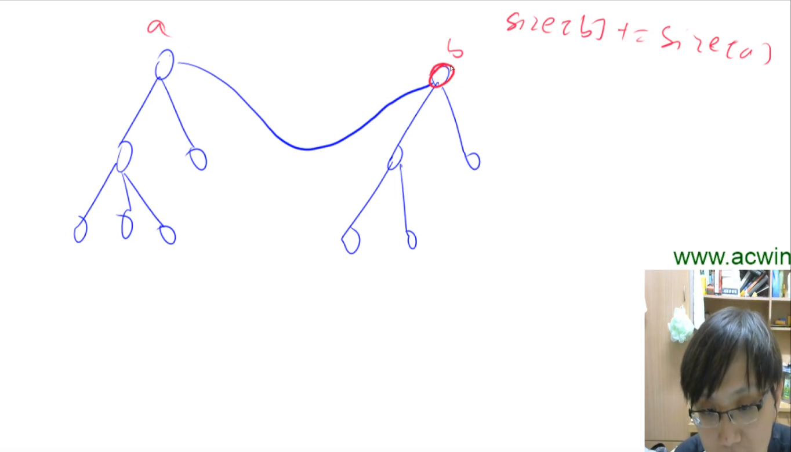

### [食物链]

## 堆

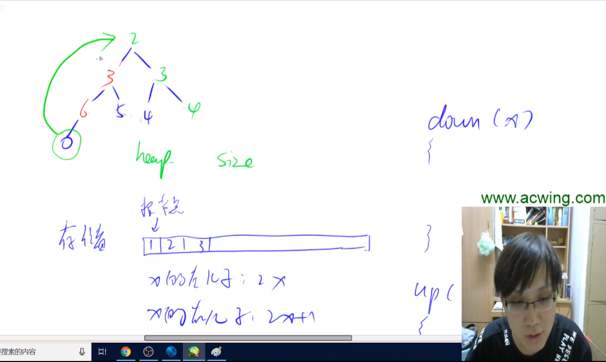

### 【模拟堆-小根堆】

- Y总原题还需要实现修改第K个插入的元素    这就需要开两个数组存储第K个插入的元素的下标是几，

  以及下标i的元素是第几个插入的

```c++
#include <iostream>
#include <vector>
#include <stack>
#include <string.h>
#include <stdio.h>
#include <algorithm>
using namespace std;

const int N=10001;
int h[N],siz=0,n=5,m=2;


void down(int k)
{
	int swap;
	if (h[2*k] <h[2*k+1]&&h[k]>h[2*k]) swap = 2*k;
	else if(h[2*k] > h[2*k+1]&&h[k]>h[2*k+1]) swap = 2*k+1;
	else return;
	int temp= h[swap];
	h[swap] = h[k];
	h[k] = temp;
	down(swap);
}


void up(int k)
{
	if (h[k] < h[k/2])
	{
		int temp= h[k];
		h[k] = h[k/2];
		h[k/2] = temp;
		down(k/2);
	}
	else return;
}

int main()
{
	int x;
	for(int i=0;i<n;i++)
	{
		scanf("%d",&x);
		h[++siz] = x;
	}
	
	for(int i=0;i<m;i++)
	{
		char op[2];
		int k;
		scanf("%s%d",op,&k);
		if(op[0]=='d') down(k);
		if(op[0]=='u') up(k);
	}
	
	for(int i=1;i<=n;i++)
	{ cout << h[i] << " ";}

}
/*
1
6
0
5
3
d 2
u 3
*/


```

### 【堆排序】

> 输入n个数，输出前m小的数
>

```c++
#include <iostream>
#include <vector>
#include <stack>
#include <string.h>
#include <stdio.h>
#include <algorithm>
using namespace std;

const int N=10001;
int h[N],siz=0,n=10,m=5;


void down(int k)
{
	int swap;
	if (h[2*k] <h[2*k+1]&&h[k]>h[2*k]&&2*k<=siz) swap = 2*k;
	else if(h[2*k] > h[2*k+1]&&h[k]>h[2*k+1]&&2*k+1<=siz) swap = 2*k+1;
	else return;
	int temp= h[swap];
	h[swap] = h[k];
	h[k] = temp;
	down(swap);
}

int main()
{
	int x;
	for(int i=0;i<n;i++)
	{
		scanf("%d",&x);
		h[++siz] = x;
	}
	
	for(int i=n/2;i;i--) 
		down(i);//后n/2不需要down，没有子节点

	for(int i=1;i<=m;i++)
	{ 
		cout << h[1] << endl;
		h[1] = h[siz--];//最后一个替换第一个，再把1down一遍,1就还是最小的
		down(1);
	}
}

```


## Hash表

### 【拉链法】

> 维护一个集合，支持如下几种操作：
>
> 1. `I x`，插入一个数 xx；
> 2. `Q x`，询问数 xx 是否在集合中出现过
>

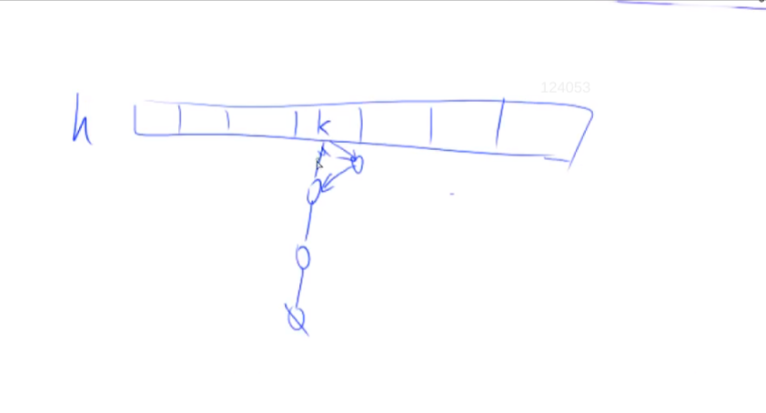

临接表    (多个单向列表)，这里要求的是有没有出现过，所以搜h[10004]，h[200004]的hash值hash[10004]和hash[20004]都是1，但是没关系，hash列表元素是一个个链表，再判断h[1]链表里有没有10004就行了。


如果是统计个数的题目需要h[hash[1]]++；？？？？==这种h里存不仅有10004本来的值以外，还需要一个int存cnt，所以说h是要存原来的值的，在hash冲突的时候，判断哪一个位置是要找的原值的位置==

==开发寻址法好用==

```c++
#include <cstring>
#include <iostream>

using namespace std;

const int N = 100003;

int h[N], e[N], ne[N], idx;

void insert(int x)
{
    int k = (x % N + N) % N;
    e[idx] = x;
    ne[idx] = h[k];
    h[k] = idx ++ ;
}

bool find(int x)
{
    int k = (x % N + N) % N;
    for (int i = h[k]; i != -1; i = ne[i])
        if (e[i] == x)
            return true;

    return false;
}

int main()
{
    int n;
    scanf("%d", &n);

    memset(h, -1, sizeof h);

    while (n -- )
    {
        char op[2];
        int x;
        scanf("%s%d", op, &x);

        if (*op == 'I') insert(x);
        else
        {
            if (find(x)) puts("Yes");
            else puts("No");
        }
    }

    return 0;
}

```

### 【开放寻址法】

坑位有元素就存到下一个位置，所以也需要存hash之前的原值，在hash冲突时候来确实是不是要找的值

```c++
#include <iostream>
#include <string.h>
using namespace std;
const int N = 20001; // 二维数组不能开太大
int h[N], m = 2, n = 6, idx, null=0x3f3f3f3f;//int是4字节，memset是一个字节
// 开放区间法

void insert(int x)
{
    int k = (x % N + N) % N;
    while (h[k] != null)
    {
        k++;
    }
    h[k] = x;
}

bool find(int x)
{
    int k = (x % N + N) % N;
    while (h[k] != null)
    {
        if (h[k] == x)
            return true;
    }
    return false;
}

int main()
{
    memset(h, 0x3f, sizeof h); 
    for (int i = 1; i <= n; i++)
    {
        cout << "insert:" << endl;
        ;
        int x;
        scanf("%d", &x);
        insert(x);
    }

    for (int i = 1; i <= m; i++)
    {
        cout << "find:" << endl;
        ;
        int x;
        scanf("%d", &x);
        if (find(x))
            cout << "yes" << endl;
        else
            cout << "no" << endl;
    }
    return 0;
}

```

### 【字符串哈希】

==除了 循环节 优于KMP==


映射成前缀的hash好处是可以求任意一段子串的hash


> 给定一个长度为 n 的字符串，再给定 m 个询问，每个询问包含四个整数 l1,r1,l2,r2 请你判断 [l1,r1][�1,�1] 和 [l2,r2][�2,�2] 这两个区间所包含的字符串子串是否完全相同。
>
> 字符串中只包含大小写英文字母和数字。
>

```c++
#include <iostream>
#include <string.h>
using namespace std;
const int N = 10010, P = 131;
typedef unsigned long long ULL;
ULL h[N], p[N];
char s[N];
// 字符串哈希

int search(int l, int r)
{
    return h[r] - h[l - 1] * p[r - l + 1];//r - l + 1
}

int main()
{
    cout << "输入str" << endl;
    scanf("%s", s + 1);
    int i = 1;
    p[0] = 1;
    while (s[i] != '\0')
    {
        cout << s[i];
        p[i] = p[i - 1] * P;
        h[i] = P * h[i - 1] + s[i];
        cout << h[i] << endl;
        i++;
    }

    while (1)
    {
        int l1, l2, r1, r2;
        scanf("%d%d%d%d", &l1, &r1, &l2, &r2);
        if (search(l1, r1) == search(l2, r2))
            cout << "yesp" << endl;
        else
            cout << "no" << endl;
    }

    return 0;
}

```


## STL简介

```
vector, 变长数组，倍增的思想
    size()  返回元素个数
    empty()  返回是否为空
    clear()  清空
    front()/back()
    push_back()/pop_back()
    begin()/end()
    []
    支持比较运算，按字典序

pair<int, int>
    first, 第一个元素
    second, 第二个元素
    支持比较运算，以first为第一关键字，以second为第二关键字（字典序）

string，字符串
    size()/length()  返回字符串长度
    empty()
    clear()
    substr(起始下标，(子串长度))  返回子串
    c_str()  返回字符串所在字符数组的起始地址

queue, 队列
    size()
    empty()
    push()  向队尾插入一个元素
    front()  返回队头元素
    back()  返回队尾元素
    pop()  弹出队头元素

priority_queue, 优先队列，默认是大根堆
    size()
    empty()
    push()  插入一个元素
    top()  返回堆顶元素
    pop()  弹出堆顶元素
    定义成小根堆的方式：priority_queue<int, vector<int>, greater<int>> q;

stack, 栈
    size()
    empty()
    push()  向栈顶插入一个元素
    top()  返回栈顶元素
    pop()  弹出栈顶元素

deque, 双端队列
    size()
    empty()
    clear()
    front()/back()
    push_back()/pop_back()
    push_front()/pop_front()
    begin()/end()
    []

set, map, multiset, multimap, 基于平衡二叉树（红黑树），动态维护有序序列
    size()
    empty()
    clear()
    begin()/end()
    ++, -- 返回前驱和后继，时间复杂度 O(logn)

    set/multiset
        insert()  插入一个数
        find()  查找一个数
        count()  返回某一个数的个数
        erase()
            (1) 输入是一个数x，删除所有x   O(k + logn)
            (2) 输入一个迭代器，删除这个迭代器
        lower_bound()/upper_bound()
            lower_bound(x)  返回大于等于x的最小的数的迭代器
            upper_bound(x)  返回大于x的最小的数的迭代器
    map/multimap
        insert()  插入的数是一个pair
        erase()  输入的参数是pair或者迭代器
        find()
        []  注意multimap不支持此操作。 时间复杂度是 O(logn)
        lower_bound()/upper_bound()

unordered_set, unordered_map, unordered_multiset, unordered_multimap, 哈希表
    和上面类似，增删改查的时间复杂度是 O(1)
    不支持 lower_bound()/upper_bound()， 迭代器的++，--

bitset, 圧位
    bitset<10000> s;
    ~, &, |, ^
    >>, <<
    ==, !=
    []

    count()  返回有多少个1

    any()  判断是否至少有一个1
    none()  判断是否全为0

    set()  把所有位置成1
    set(k, v)  将第k位变成v
    reset()  把所有位变成0
    flip()  等价于~
    flip(k) 把第k位取反
```


# 搜索与图论 —— 常用代码模板3

## DFS与BFS

[占用空间的不同](https://blog.csdn.net/qq_62763927/article/details/130007825)

[二叉树的前中后向遍历](https://www.bilibili.com/video/BV1Ub4y147Zv/?spm_id_from=333.1007.top_right_bar_window_custom_collection.content.click&vd_source=eef102f4fb053709a57c96d0c876628a)

BFS:最短路

DFS：奇怪的思路

### 【全排列组合-DFS】

> 给定一个整数 n，将数字 1∼n 排成一排，将会有很多种排列方法。
>
> 现在，请你按照字典序将所有的排列方法输出。

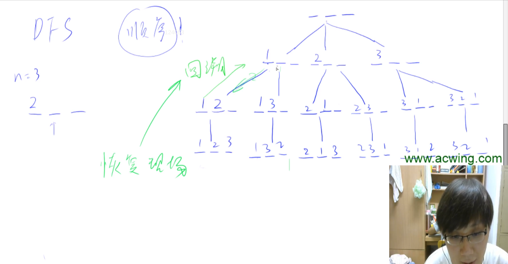

```c++
#include <iostream>
#include <vector>
#include <stack>
#include <string.h>
#include <stdio.h>
#include <algorithm>
using namespace std;

const int N = 10001;
int path[N], a[N], n = 4, m = 5;
bool st[N];

void dfs(int h)
{
	if (h == n)
	{
		for (int i = 0; i < n; i++)
			printf("%d", path[i]);
		printf("\n");
		return;
	}

	for (int i = 0; i < n; i++)
	{
		if (!st[i])
		{
			path[h] = a[i];
			st[i] = true;
			dfs(h + 1);
			st[i] = false;//回溯以下
		}
	}
}

int main()
{
	for (int i = 0; i < n; i++)
		scanf("%d", &a[i]);

	for (int i = 0; i < n; i++)
		printf("%d", a[i]);

	dfs(0);
	return 0;
}

```

### 【n皇后-DFS】


```c++
#include <iostream>
#include <vector>
#include <stack>
#include <string.h>
#include <stdio.h>
#include <algorithm>
using namespace std;

const int N = 10001;
int  n=4;
bool col[N],dl[N],ndl[N];
char g[N][N];

void dfs(int h)
{
	if (h == n)
	{
		for (int i = 0; i < n; i++)
			puts(g[i]);
		printf("\n");
		return;
	}

	for (int i = 0; i < n; i++)
	{
		if (!col[i]&&!dl[h+i]&&!ndl[n-h+i])//对角线和反对角线
		{
			g[h][i] = 'Q';
			col[i]=dl[h+i]=ndl[n-h+i] = true;
			dfs(h + 1);
			col[i]=dl[h+i]=ndl[n-h+i] = false;//恢复现场
			g[h][i] = '.';//恢复现场
		}
	}
}

int main()
{
	for (int i = 0; i < n; i++)
	{
		for (int j = 0; j < n; j++)
			g[j][i] = '.';
	}
	
	dfs(0);
	return 0;
}

```

### 【迷宫的找最短路径-BFS】

> 给定一个 n×m 的二维整数数组，用来表示一个迷宫，数组中只包含 00 或 11，其中 00 表示可以走的路，11 表示不可通过的墙壁。
>
> 最初，有一个人位于左上角 (1,1)(1,1) 处，已知该人每次可以向上、下、左、右任意一个方向移动一个位置。
>
> 请问，该人从左上角移动至右下角 (n,m)处，至少需要移动多少次。
>
> 数据保证 (1,1)(1,1) 处和 (n,m)处的数字为 00，且一定至少存在一条通路。

```c++
#include <iostream>
#include <vector>
#include <stack>
#include <string.h>
#include <stdio.h>
#include <algorithm>
#include <queue>
using namespace std;

const int N = 10001;
int  n=5;
typedef pair<int,int> PII;
queue<PII> q;//类似open表
pair<int,int> p;
int g[N][N]={
	{0,1,0,0,0},
	{0,1,0,1,0},
	{0,1,0,0,0},
	{0,1,0,0,0},
	{0,0,0,1,0}
},past[N][N];//类似close表
PII father[N][N];//存储父节点

void bfs()
{
	if(p.first==4&&p.second==4)
	{
		while(p.first!=0||p.second!=0)
		{
			cout << p.first << p.second << endl;
			p = father[p.first][p.second];	
		}

		return;
	}
	int dx[4] = {0,1,0,-1},dy[4] = {1,0,-1,0};

	for(int i=0;i<4;i++)
	{
		int x=p.first+dx[i],y=p.second+dy[i];
		if(x>=0&&y>=0&&x<=n&&y<=n&&past[x][y]==0&&g[x][y]==0)
		{
			q.push(make_pair(x,y));
			past[x][y]= 1;
			father[x][y] = p;
		}
	}
	p = q.front();
	q.pop();
	bfs();
}

int main()
{
	
	bfs();
	return 0;
}

```


### 【A*】

是需要维护open表和close表以及每一个遍历点的父节点，最后通过header找父节点回溯路径

## 树与图的遍历：

### 【树的重心】==难==

> 给定一颗树，树中包含 nn 个结点（编号 1∼n1∼n）和 n−1n−1 条无向边。
>
> 请你找到树的重心，并输出将重心删除后，剩余各个连通块中点数的最大值。
>
> 重心定义：重心是指树中的一个结点，如果将这个点删除后，剩余各个连通块中点数的最大值最小，那么这个节点被称为树的重心。
>

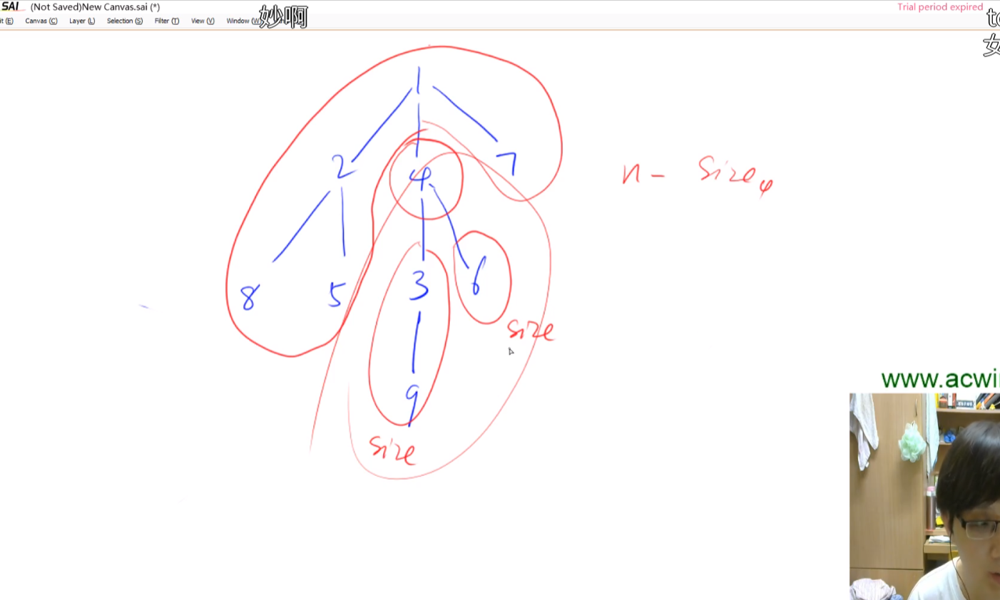

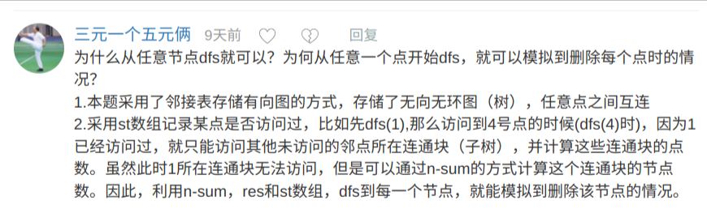

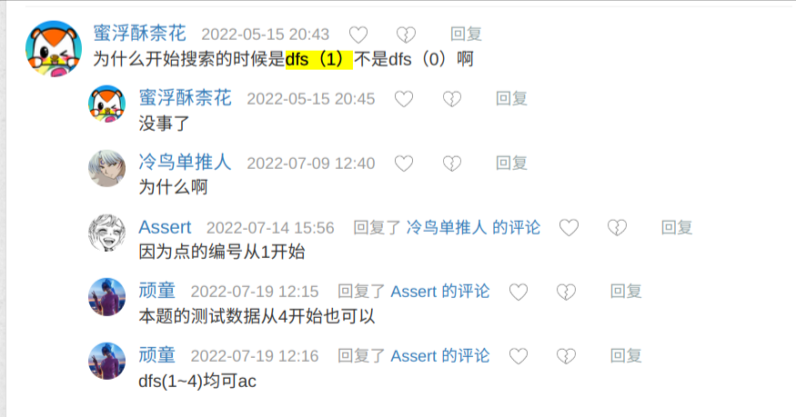

巧妙在通过st[u] = true;阻值遍历子树的时候不会返回根节点，这样可以求出所有子树的和，也可以n-1-sum求根节点过来的部分的连通域大小

```c++
#include <iostream>
#include <vector>
#include <stack>
#include <string.h>
#include <stdio.h>
#include <algorithm>
#include <queue>
using namespace std;
//难 树的遍历 计算子树连通块的大小
//无向图的 深度优先遍历
const int N=10010,M=2*N;
int st[N],h[N],e[M],ne[M],n=9,idx;//nd是节点链表头，e[M],ne[M]都是存的nd的下标
int res = 10e5;
//添加a到b点
void add(int a,int b)
{
	ne[idx] = h[a];//下一个点的e和ne的索引
	e[idx] = b;  //e[idx] = 点的序号
	h[a] = idx++; //头指向的是e和ne的索引
}

		
int dfs(int u)
{
	st[u] = true;
	int s_max=1,sum=0;//s_max = 当前节点子树联通个数的最大值,sum是已经计算了的子树总和，
	//后面求根来下的连通域部分需要，而且这个dfs返回的应该是子树的总节点个数
	//遍历所有子树
	for(int i=h[u];i!=-1;i = ne[i])
	{
		if(!st[e[i]])
		{
			u = e[i];//子节点
			int s = dfs(u);//可以返回u节点所有子树总和
			s_max = max(s_max,s);
			sum+=s;
		}
	}
	s_max = max(n - 1 - sum,s_max);//要和从根来下的连通域部分max
	res = min(s_max,res);
	return sum+1;
}

int main()
{
	memset(h,-1,sizeof h);
	for(int i=0;i<n-1;i++)
	{
		int a,b;
		scanf("%d%d",&a,&b);
		add(a,b);
		add(b,a);
	}
	dfs(1);
	cout << res;
	return 0;
}
/*
1 2
1 7
1 4
2 8
2 5
4 3
3 9
4 6
*/
```

### 【图中点的层次】

> 给定一个 nn 个点 mm 条边的有向图，图中可能存在重边和自环。
>
> 所有边的长度都是 11，点的编号为 1∼n1∼n。
>
> 请你求出 11 号点到 nn 号点的最短距离，如果从 11 号点无法走到 nn 号点，输出 −1−1。
>

```c++
#include <iostream>
#include <vector>
#include <stack>
#include <string.h>
#include <stdio.h>
#include <algorithm>
#include <queue>
using namespace std;
const int N = 100010;
int h[N],e[N],ne[N],idx,n=5,m=7;
bool st[N];
queue<pair<int,int>> q;
int cn;
//连接a->b
void add(int a,int b)
{
	e[idx]= b;ne[idx] = h[a]; h[a] = idx++;
}

void bfs(int u,int cn)
{
	cn++;
	if(!st[u])
	{
		for(int i=h[u];i!=-1;i=ne[i])
		{
			if(e[i]==n) 
			{
			    if(cn==1&&n==1)  
			        cout << 0 << endl;
			    else
				    cout << cn << endl;
				return;
			}
			
			q.push(make_pair(e[i],cn));
		}
	}
	st[u] =true;//这个应该提前，可能在push时候就设置为true比较好
    if(q.empty()) 
	{
		cout << -1;
		return;
	}
	pair<int,int> p = q.front();
	cout << p.first << p.second << endl;
	q.pop();
	bfs(p.first,p.second);
}

int main()
{
    scanf("%d%d",&n,&m);
	memset(h,-1,sizeof h);
	for(int i=0;i<m;i++)
	{
		int a,b;
		scanf("%d%d",&a,&b);
		add(a,b);
	}
	bfs(1,0);
	return 0;
}
/*
7 10
1 5
1 1
3 2
3 5
5 4
4 5
4 3
1 2
3 7
1 5
*/
```

Y总答案是用一个d[]数组把到每一个点的最短距离存下来，而我是存在一个pair的second里

Y总这里是while一直拿队列，确实，不该用递归，其实就是应该while

```c++
#include<bits/stdc++.h>

using namespace std;

const int N=1e5+10; //数据范围为1e5
int e[N],ne[N],idx,h[N]; //邻接表基操
int d[N],n,m; //d[i]表示头结点到i结点的最短距离
              //n表示有向图中结点的数量,m表示边的数量
void add(int k,int x) //使用邻接表来存储图
{
    e[idx]=x;
    ne[idx]=h[k];
    h[k]=idx++;
}

int bfs()
{
    memset(d,-1,sizeof d); //将d数组初始化为空，-1

    queue<int> q; //宽度优先搜素队列
    d[1]=0; //将结点1的初始化为0
    q.push(1); //将结点1入队

    while(q.size()) //循环终止条件为队列为空
    {
        int t=q.front(); //将队列中的首元素赋值给t
        q.pop(); //弹出队列元素

        for(int i=h[t];i!=-1;i=ne[i]) //遍历以t为头结点
        {
            int j=e[i]; //e[i]表示存在一条边由i指向e[i],通过j来将其存储
            if(d[j]==-1) //如果没有遍历过j结点
            {
                d[j]=d[t]+1; //j是t的下一个结点距离加一
                q.push(j); //将j入队
            }
        }
    }

    return d[n]; //返回头结点到结点n的最短距离
}

int main()
{
    cin>>n>>m; //输入n,m

    memset(h,-1,sizeof h); //初始化邻接表为-1，表示未存储

    for(int i=0;i<m;i++) //构造有向图
    {
        int a,b;
        cin>>a>>b;
        add(a,b);
    }

    cout<<bfs()<<endl; //输出宽度优先搜素遍历的值

    return 0;
}

作者：yxc
链接：https://www.acwing.com/activity/content/code/content/47104/
来源：AcWing
著作权归作者所有。商业转载请联系作者获得授权，非商业转载请注明出处。
```


## 拓扑排序

### 【拓扑序】

> 给定一个 n 个点 m 条边的有向图，点的编号是 11 到 n，图中可能存在重边和自环。
>
> 请输出任意一个该有向图的拓扑序列，如果拓扑序列不存在，则输出 −1−1。
>
> 若一个由图中所有点构成的序列 A 满足：对于图中的每条边 (x,y)，x 在 A 中都出现在 y 之前，则称 A 是该图的一个拓扑序列。


无环有向图：

入度为0入度，然后出边的点全部入度减1，再把入度减为0的点入队

无环有向图就一定可以全部突破

```c++
#include <iostream>
#include <string.h>
#include <queue>
using namespace std;
const int N = 100010;
int h[N], e[N], ne[N], n,m, in[N],idx,cnt,out[N];
queue<int> q;
// 字符串哈希

//a->b
void add(int a,int b)
{
    e[idx] = b; ne[idx]= h[a];h[a]=idx++;
}

int topsort()
{
	for(int i=1;i<=n;i++)
	{
		if(!in[i])
		{
			q.push(i);
		}
	}

	while(!q.empty())
	{
		out[cnt++] = q.front();
		for(int i=h[q.front()];i!=-1;i=ne[i])
		{
			int j = e[i];
			in[j]--;
			if(in[j]==0) q.push(j);
		}
		q.pop();
	}
	return n==cnt;
}

int main()
{
    int a, b;
	scanf("%d%d", &n, &m);
	memset(h,-1,sizeof h);
    for(int i = 0; i < m; i++)
    {
        scanf("%d%d", &a, &b);
		add(a,b);
        in[b]++;
    }

	if (!topsort()) puts("-1");
    else
    {
        for (int i = 0; i < n; i ++ ) printf("%d ", out[i]);
        puts("");
    }

    return 0;
}
/*
5 5
1 4
4 3
3 2
2 5
4 2
*/
```


## 最短路

搜索是一步步的操作，我自己觉得是没有边权的

但是最短路就是说是每一步都是有代价的 A*貌似也可以求最短路但是都是Dijkstra

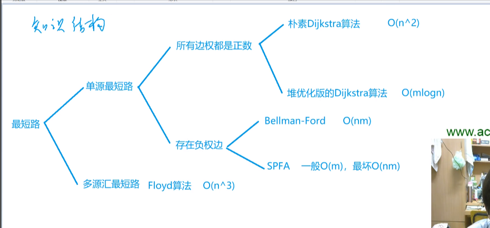

### 【Dijkstra】

> 给定一个 n 个点 m 条边的有向图，图中可能存在重边和自环，所有边权均为正值。
>
> 请你求出 11 号点到 n 号点的最短距离，如果无法从 11 号点走到 n 号点，则输出 −1−1。
>
> #### 输入格式
>
> 第一行包含整数 n 和 m。
>
> 接下来 m 行每行包含三个整数 x,y,z，表示存在一条从点 x 到点 y 的有向边，边长为 z。

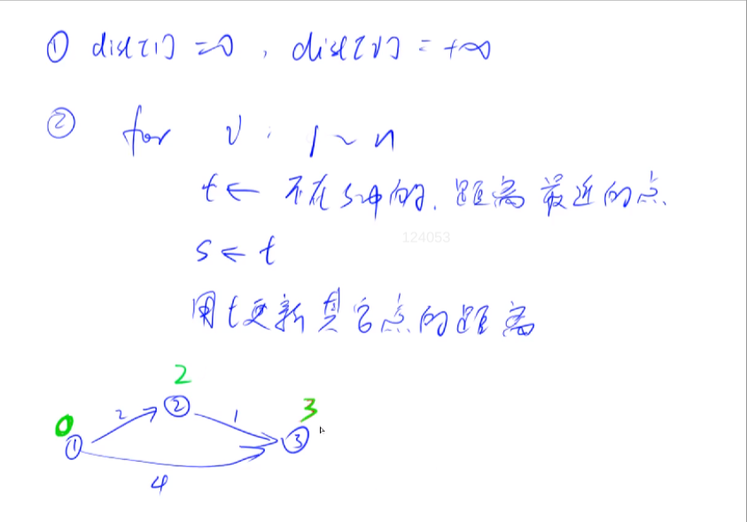

- 深搜是临接表
- 宽搜是queue
- dijkstra是临接矩阵

```c++
#include <iostream>
#include <string.h>
#include <queue>
using namespace std;
const int N = 510;
int path[N][N],n,m,s[N],dist[N];
bool sta[N];
//深搜是临接表
//宽搜是queue
//dijkstra是临接矩阵

//寻找不在sta里距离原点最近的点
//遍历他连接的点更新到原点的距离


int dijkstra()
{
	memset(dist,0x3f,sizeof(dist));//存储每一个点到源点的距离	
	dist[1]=0;
	for(int i=1;i<=n;i++)
	{
		int t=-1;
		for(int j=1;j<=n;j++)
			if(!sta[j]&&(t==-1||dist[t]>dist[j])) t = j;
			//这一个操作就是找到未确定最小值的 `点集`中的最小点,t==-1是当第一次遇到未确定~的点时能够被初始化
	
		//现在找到t了，遍历一遍所有点，有一下几种情况
		for(int j=1;j<=n;j++)
		{
			if(!sta[j])
				dist[j] = min(dist[t]+path[t][j],dist[j]);
		}
			
		//1.j点和t点之间无连接，那么g[t][j]=0x3f3f3f3f,特别大，会被pass
		//2.dist[j]<=dist[t]+g[t][j],源点到j点的距离，如果经过t后距离更长了，那么不考虑
		//3.dist[j]<=dist[t]+g[t][j],，~~，经过t点距离更短了，那么修改dist[j]的值
		sta[t]=true;
	}
	for(int i=1;i<=n;i++) cout << dist[i] << ' ';
	if(dist[n]==0x3f3f3f3f)
	{//当前点n没被修改，说明到不了点n，输出-1
        return -1;
    }
	else
	{
        return dist[n];//易证
    }
}

int main()
{
	scanf("%d%d", &n, &m);
	memset(path,0x3f,sizeof path);
    for(int i = 0; i < m; i++)
    {
		int a,b,c;
        scanf("%d%d%d", &a, &b, &c);
		path[a][b] = min(path[a][b], c);
    }
	cout << "res" << dijkstra() << endl;;

    return 0;
}
/*
3 3
1 2 2
2 3 1
1 3 4
*/
```

### 【优化的dijkstra】

```c++
#include <iostream>
#include <string.h>
#include <queue>
using namespace std;
const int N = 510;
typedef pair<int,int> PII;
int n,m,dist[N],e[N],ne[N],h[N],w[N],idx;
bool sta[N];
//深搜是临接表
//宽搜是queue
//dijkstra是临接矩阵
//优化dijkstra是对于N很大的稀疏表，临接表优化path[N][N]来存权重
//然后priority_queue把原来查找最近的未确定的点从ON优化到O1

//寻找不在sta里距离原点最近的点
//遍历他连接的点更新到原点的距离
void add(int a,int b,int c)
{
	e[idx] = b;w[idx] = c;ne[idx] = h[a];h[a] = idx++;
}

int dijkstra()
{
	memset(dist,0x3f,sizeof(dist));//存储每一个点到源点的距离
	dist[1] = 0;	
	priority_queue<PII, vector<PII>, greater<PII>> heap;
	heap.push({0,1});
	while(!heap.empty())
	{
		PII t = heap.top();
		int ver = t.second, distance = t.first;
		heap.pop();
		if(sta[ver]) continue;
		sta[ver] = true;
		//更新后面的点的距离
		for(int i=h[ver];i!=-1;i = ne[i])
		{
			int j = e[i];//j是dist的下标
			if(!sta[j]&&(dist[j]>distance + w[i]))//不是w[j] i才是e,w,ne的下标
			{
				dist[j] = distance + w[i];
                heap.push({dist[j], j});
			}
		}
	}
	

	if(dist[n]==0x3f3f3f3f)
	{//当前点n没被修改，说明到不了点n，输出-1
        return -1;
    }
	else
	{
        return dist[n];//易证
    }
}

int main()
{
	scanf("%d%d", &n, &m);
	memset(h,-1,sizeof h);
    for(int i = 0; i < m; i++)
    {
		int a,b,c;
        scanf("%d%d%d", &a, &b, &c);
		add(a,b,c);
    }
	cout << "res" << dijkstra() << endl;;

    return 0;
}
/*
3 3
1 2 2
2 3 1
1 3 4
*/


```

### 【bellman-ford】


> #### 【有边数限制的最短路】
>
> 给定一个 n个点 m 条边的有向图，图中可能存在重边和自环， **边权可能为负数**。
>
> 请你求出从 11 号点到 n 号点的最多经过 k条边的最短距离，如果无法从 11 号点走到 n 号点，输出 `impossible`
>
> 注意：图中可能 **存在负权回路** 。
>
> #### 输入格式
>
> 第一行包含三个整数 n,m,k。
>
> 接下来 m 行，每行包含三个整数 x,y,z，表示存在一条从点 x 到点 y 的有向边，边长为 z。
>
> 点的编号为 1∼n1。
>
> #### 输出格式
>
> 输出一个整数，表示从 11 号点到 n 号点的最多经过 k 条边的最短距离。
>
> 如果不存在满足条件的路径，则输出 `impossible`。

```c++
#include <iostream>
#include <string.h>
#include <queue>
using namespace std;
const int N = 510;
typedef pair<int, int> PII;
int n, m, k, dist[N], cpdisk[N];

struct edge
{
	int a, b, w; /* data */
} edge[N];

int bellman()
{
	int a, b, w;
	for (int i = 0; i < k; i++)
	{
		memcpy(cpdisk, dist, sizeof dist);
		for (int j = 0; j < m; j++)
		{
			a = edge[j].a;
			b = edge[j].b;
			w = edge[j].w;
			dist[b] = min(cpdisk[b], cpdisk[a] + w);
		}
	}

	if (dist[n] > 0x3f3f3f3f / 2)
		return -1;
	else
		return dist[n];
}

int main()
{
	memset(dist, 0x3f, sizeof(dist)); // 存储每一个点到源点的距离
	dist[1] = 0;

	scanf("%d%d%d", &n, &m, &k);

	for (int i = 0; i < m; i++)
	{
		int a, b, w;
		scanf("%d%d%d", &a, &b, &w);
		edge[i].a = a;
		edge[i].b = b;
		edge[i].w = w;
	}
	cout << "res" << bellman() << endl;
	return 0;
}
/*
3 3 1
1 2 1
2 3 1
1 3 3
*/
```

### 【spfa求最短路】

> 给定一个 n 个点 m 条边的有向图，图中可能存在重边和自环， **边权可能为负数**。
>
> 请你求出 11 号点到 n 号点的最短距离，如果无法从 11 号点走到 n 号点，则输出 `impossible`。
>
> 数据保证不存在负权回路。
>
> #### 输入格式
>
> 第一行包含整数 n 和 m。
>
> 接下来 m 行每行包含三个整数 x,y,z，表示存在一条从点 x 到点 y 的有向边，边长为 z。

```c++
#include <iostream>
#include <string.h>
#include <queue>
using namespace std;
const int N = 100010;
typedef pair<int, int> PII;
int n, m, k, dist[N], e[N], h[N], ne[N], idx, w[N];
bool st[N]; // 这里的st是点是不是已经在队列里，为了不加入重复的点，和之前的确定是最短距离不一样

void add(int a, int b, int c)
{
	e[idx] = b;
	w[idx] = c;
	ne[idx] = h[a];
	h[a] = idx++;
}

int spfa()
{
	memset(dist, 0x3f, sizeof(dist)); // 存储每一个点到源点的距离
	dist[1] = 0;
	
	st[1] = true;
	queue<int> q;
	q.push(1);
	
	while (q.size())
	{
		int t = q.front();
		q.pop();
		
		st[t] = false;
		
		for (int i = h[t]; i != -1; i = ne[i])
		{
			int j = e[i];
			if (dist[j] > dist[t] + w[i])
			{
				dist[j] = dist[t] + w[i];
				if (!st[j])
				{
					q.push(j);
					st[j] = true;
				}
			}
		}
	}
	
	return dist[n];

}

int main()
{
	memset(h, -1, sizeof(h));
	scanf("%d%d", &n, &m);
	for (int i = 0; i < m; i++)
	{
		int a, b, w;
		scanf("%d%d%d", &a, &b, &w);
		add(a, b, w);
	}

	int t = spfa();

    if (t == 0x3f3f3f3f) puts("impossible");
    else printf("%d\n", t);
	return 0;
}
```

### 【spfa判断负环】

> 给定一个 n
>  个点 m
>  条边的有向图，图中可能存在重边和自环， 边权可能为负数。
>
> 请你判断图中是否存在负权回路。
>

在spfa算法的基础上加上一个cnt数组                

dist[j] = dist[t] + w[i];
cnt[j] = cnt[t] + 1;

==当cnt[n] > n 的时候存在负环==

```c++
#include <cstring>
#include <iostream>
#include <algorithm>
#include <queue>

using namespace std;

const int N = 2010, M = 10010;

int n, m;
int h[N], w[M], e[M], ne[M], idx;
int dist[N], cnt[N];
bool st[N];

void add(int a, int b, int c)
{
    e[idx] = b, w[idx] = c, ne[idx] = h[a], h[a] = idx ++ ;
}

bool spfa()
{
    queue<int> q;

    for (int i = 1; i <= n; i ++ )
    {
        st[i] = true;
        q.push(i);
    }

    while (q.size())
    {
        int t = q.front();
        q.pop();

        st[t] = false;

        for (int i = h[t]; i != -1; i = ne[i])
        {
            int j = e[i];
            if (dist[j] > dist[t] + w[i])
            {
                dist[j] = dist[t] + w[i];
                cnt[j] = cnt[t] + 1;

                if (cnt[j] >= n) return true;
                if (!st[j])
                {
                    q.push(j);
                    st[j] = true;
                }
            }
        }
    }

    return false;
}

int main()
{
    scanf("%d%d", &n, &m);

    memset(h, -1, sizeof h);

    while (m -- )
    {
        int a, b, c;
        scanf("%d%d%d", &a, &b, &c);
        add(a, b, c);
    }

    if (spfa()) puts("Yes");
    else puts("No");

    return 0;
}

```

### 【floyd求多个最短路】

> 给定一个 n 个点 m 条边的有向图，图中可能存在重边和自环，边权可能为负数。再给定 k 个询问，每个询问包含两个整数 x 和 y，表示查询从点 x 到点 y 的最短距离，如果路径不存在则输出 `impossible`。
>
> 数据保证图中不存在负权回路


```c++
#include <cstring>
#include <iostream>
#include <algorithm>
#  三重循环                                           d[k][i][j] = d[k-1] [i][k] + d[k-1] [k][j];
using namespace std;

const int N = 210, INF = 1e9;

int n, m, Q;
int d[N][N];

void floyd()
{
    for (int k = 1; k <= n; k ++ )
        for (int i = 1; i <= n; i ++ )
            for (int j = 1; j <= n; j ++ )
                d[i][j] = min(d[i][j], d[i][k] + d[k][j]);
}

int main()
{
    scanf("%d%d%d", &n, &m, &Q);

    for (int i = 1; i <= n; i ++ )
        for (int j = 1; j <= n; j ++ )
            if (i == j) d[i][j] = 0;
            else d[i][j] = INF;

    while (m -- )
    {
        int a, b, c;
        scanf("%d%d%d", &a, &b, &c);
        d[a][b] = min(d[a][b], c);
    }

    floyd();

    while (Q -- )
    {
        int a, b;
        scanf("%d%d", &a, &b);

        int t = d[a][b];
        if (t > INF / 2) puts("impossible");
        else printf("%d\n", t);
    }

    return 0;
}

```


### 【prim求最小生成树】


#### 

==联通所有点的最小边的集合-不能含有环的==

> 给定一个 n 个点 m 条边的无向图，图中可能存在重边和自环，边权可能为负数。
>
> 求最小生成树的树边权重之和，如果最小生成树不存在则输出 `impossible`。
>
> 给定一张边带权的无向图 G=(V,E)，其中 V 表示图中点的集合，E 表示图中边的集合，n=|V|，m=|E|。
>
> 由 V 中的全部 n 个顶点和 E 中 n−1 条边构成的无向连通子图被称为 G 的一棵生成树，其中边的权值之和最小的生成树被称为无向图 G 的最小生成树。

```c++
#include <iostream>
#include <string.h>
#include <queue>
using namespace std;
const int N = 510;
int n, m, dist[N], p[N][N],INFO = 0x3f3f3f3f;
bool st[N];

int prim()
{
    int res=0;
    memset(dist,0x3f,sizeof dist);//记得初始化
    dist[1] = 0;
	for(int i=1;i<=n;i++)
	{
	    int t = -1;
		for(int j = 1; j <= n;j++)
		{
			if(!st[j] && (t==-1 || dist[j]<dist[t])) t = j;
		}
	
		if(i&&dist[t]>INFO/2) return INFO;
		res += dist[t];
		for (int j = 1; j <= n; j ++ ) dist[j] = min(dist[j], p[t][j]);
		st[t] = true;
	}
	return res;
}

int main()
{
	 memset(p,0x3f,sizeof p);//记得初始化
	scanf("%d%d", &n, &m);
	for (int i = 0; i < m; i++)
	{
		int a, b, w;
		scanf("%d%d%d", &a, &b, &w);
		p[b][a] = p[a][b] = min(p[a][b], w);
	}

	int t = prim();

	if (t == 0x3f3f3f3f)
 		  puts("impossible");
	else
		printf("%d\n", t);
	return 0;
}
```

### 【Kruskal算法求最小生成树】


> 给定一个 n 个点 m 条边的无向图，图中可能存在重边和自环，边权可能为负数。
>
> 求最小生成树的树边权重之和，如果最小生成树不存在则输出 `impossible`。
>
> 给定一张边带权的无向图 G=(V,E)，其中 V 表示图中点的集合，E 表示图中边的集合，n=|V|，m=|E|。
>
> 由 V 中的全部 n 个顶点和 E 中 n−1 条边构成的无向连通子图被称为 G 的一棵生成树，其中边的权值之和最小的生成树被称为无向图 G 的最小生成树。
>
> #### 输入格式
>
> 第一行包含两个整数 n 和 m。
>
> 接下来 m 行，每行包含三个整数 u,v,w，表示点 u 和点 v 之间存在一条权值为 w 的边

```c++
#include <iostream>
#include <string.h>
#include <algorithm>
#include <queue>
using namespace std;
const int N = 2*10e5;
int n, m, dist[N], INF = 0x3f3f3f3f,p[N];
bool st[N];

struct Edge
{
	int a, b, w;

	bool operator<(const Edge &e) const
	{
		return w < e.w;
	}
} edge[N];

int find(int a)
{
	if(a!=p[a]) p[a] = find(p[a]);
	return p[a];
}

int Kruskal()
{
	int res=0,cnt=0;
	sort(edge, edge + m);   //sork利用重载和加法运算，sort
	for(int i=0;i<m;i++)
	{
		int a = edge[i].a; int b = edge[i].b;
		a = find(a);
		b = find(b);
		if(a!=b)
		{
			p[a] = b;
			res +=  edge[i].w;
			//cout << res << " " << a << " "<< b << endl;
			cnt ++;
		} 
	}
	if (cnt < n - 1) return INF;
    return res;

}

int main()
{

	scanf("%d%d", &n, &m);
	
	for(int i=1;i<=n;i++)
	{
	    p[i] = i;
	}
	
	for (int i = 0; i < m; i++)
	{
		int a, b, w;
		scanf("%d%d%d", &a, &b, &w);
		edge[i] = {a, b, w};
	}

	int t = Kruskal();

	if (t == 0x3f3f3f3f)
		puts("impossible");
	else
		printf("%d\n", t);
	return 0;
}
```

## 二分图：染色法

==二分图把点分为两个集合并且集合内部没有边==

现在才知道，这个题的图包含连通图和非连通图两种情况，若是连通图便不需要主函数里的for循环了，但是这里只需处理非联通图即可，主函数使用for循环枚举所有图，就把两种情况都包含进去了


> 给定一个 n 个点 m 条边的无向图，图中可能存在重边和自环。
>
> 请你判断这个图是否是二分图。
>
> #### 输入格式
>
> 第一行包含两个整数 n 和 m。
>
> 接下来 m 行，每行包含两个整数 u 和 v，表示点 u 和点 v之间存在一条边。
>
> #### 输出格式
>
> 如果给定图是二分图，则输出 `Yes`，否则输出 `No`。

```c++
#include <string>
#include <algorithm>
#include <iostream>
#include <string.h>
using namespace std;

const int  N = 100010, M = 200010;
int n,m,e[M],ne[M],h[N],idx;
int color[N];

void add(int a, int b)
{
    e[idx] = b, ne[idx] = h[a], h[a] = idx ++ ;
}


bool dfs(int u, int c)
{
    color[u] = c;
    for(int i=h[u];i!=-1;i=ne[i])
    {
        int j = e[i];
        if(color[j])
        {
            if(c==color[j]) return false;
        }
        else if(!dfs(j,3-c)) return false;
        
    }
    
    return true;
    
}

int main()
{
    memset(h,-1,sizeof h);
    scanf("%d%d",&n,&m);
    while(m--)
    {
        int a,b;
        scanf("%d%d",&a,&b);
        add(a,b);
        add(b,a);
    }
    
    bool flag = true;
    for(int i=1;i<=n;i++)
    {
        if (!color[i])
        {
            if(!dfs(i,1))
            {
                flag = false;
                break;
            }
        }
    }
    if (flag) puts("Yes");
    else puts("No");

}

```


## 匈牙利算法


### 【求最大匹配】

> 给定一个二分图，其中左半部包含 n1个点（编号 1∼n1），右半部包含 n2 个点（编号 1∼n2），二分图共包含 m 条边。
>
> 数据保证任意一条边的两个端点都不可能在同一部分中。
>
> 请你求出二分图的最大匹配数。
>
> > 二分图的匹配：给定一个二分图 G，在 G 的一个子图 M 中，M 的边集 {E} 中的任意两条边都不依附于同一个顶点，则称 M 是一个匹配。
> >
> > 二分图的最大匹配：所有匹配中包含边数最多的一组匹配被称为二分图的最大匹配，其边数即为最大匹配数。
>
> #### 输入格式
>
> 第一行包含三个整数 n1、 n2 和 m。
>
> 接下来 m 行，每行包含两个整数 u 和 v，表示左半部点集中的点 u 和右半部点集中的点 v 之间存在一条边。

```c++
#include <cstring>
#include <iostream>
#include <algorithm>
using namespace std;


const int N = 510, M = 100010;

int n1, n2, m;
int h[N], e[M], ne[M], idx;
int match[N];
bool st[N];

void add(int a, int b)
{
    e[idx] = b; ne[idx] = h[a]; h[a] = idx++;
}


bool find(int x)
{
     for (int i = h[x]; i != -1; i = ne[i])
    {
        int j = e[i];
        if(!st[j]) 
        {
            st[j] = true;
            if(match[j]==0||find(match[j]))  //重点是这里，女生没有匹配或者match[j]再去find   
                					//后面的时候可能会经常交换匹配的女生所以最坏理论时间复杂度是o(nm)
            {
                match[j] = x;
                return true;
            }

        }
    }
    return false;
}

int main()
{
    int res =0;
    scanf("%d%d%d",&n1,&n2,&m);
    memset(h,-1,sizeof h);
    while(m--)
    {
        int a,b;
        scanf("%d%d",&a,&b);
        add(a,b);
    }
    
    for(int i=1;i<=n1;i++)
    {
        memset(st,false,sizeof st);
        if(find(i)) res++;
    }
    
    cout << res << endl;
  
}
```


# 数学知识 —— 常用代码模板4

## 质数

相反是合数

### 【判断是不是质数】

$$
只需要枚举到 \sqrt[2]{n}
$$

```c++
#include <iostream>
#include <algorithm>

using namespace std;

bool is_prime(int x)
{
    if (x < 2) return false;
    for (int i = 2; i <= x / i; i ++ )
        if (x % i == 0)
            return false;
    return true;
}

int main()
{
    int n;
    cin >> n;

    while (n -- )
    {
        int x;
        cin >> x;
        if (is_prime(x)) puts("Yes");
        else puts("No");
    }

    return 0;
}

```

### 【质因子】

> 给定 n 个正整数 ai，将每个数分解质因数，并按照质因数从小到大的顺序输出每个质因数的底数和指数。
>
> #### 输入格式
>
> 第一行包含整数 n。
>
> 接下来 n 行，每行包含一个正整数 ai。

1. [一个数最小的因数就是质因数](https://zhidao.baidu.com/question/1373199364828150499.html)
   同理把这个最小质因数除干净了之后得到一个新的数，这个新的数的最小质因数肯定比之前的大，因为比之前小的都被除干净了，同理新的数最小的因数又是质因数。

2. n最多只包含一个大于根号n的质因子

   X的m个因子相乘等于X，一定可以分解成n个（>m）质因子相乘，如果有两个，则相乘大于X

   

```c++
#include <cstring>
#include <iostream>
#include <algorithm>
using namespace std;

int x,n;

void divide(int a)
{
    for(int i=2;i<=a/i;i++)
    {   
        if (x % i == 0)
        {
            int s=0;
            while(a%i==0)
            {
                a/=i;
                s++;
            }
            if(s!=0) cout << i << " " << s<<endl;
        }
    }
    if(a>1) cout << a << " " << 1<<endl;   //n最多只包含一个大于根号n的质因子
}

int main()
{
    scanf("%d",&n);
    while(n--){
        scanf("%d",&x);
        divide(x);
        cout << endl;
    }
   
}
```

### 【筛质数】

> 给定一个正整数 n，请你求出 1∼n 中质数的个数。
>
> ##### 输入格式
>
> 共一行，包含整数 n。
>
> 

==线性筛很绕==

[博客](https://blog.csdn.net/m0_51111980/article/details/117715139)


```c++
#include <iostream>
#include <algorithm>

using namespace std;

const int N= 1000010;

int primes[N], cnt;
bool st[N];
//埃及筛
void get_primes(int n)//大于根号n的质数不止一个所以要遍历到n
{
    for(int i=2;i<=n;i++)
    {
        if(!st[i])
        {
            cnt++;
            for(int j=i+i;j<=n;j+=i) st[j] = true;
        }
    }
}

//线性筛
void get_primes1(int n)
{
    for (int i = 2; i <= n; i ++ )
    {
        if (!st[i]) primes[cnt ++ ] = i;//不是前面的数的倍数则一定是质数
        for (int j = 0; primes[j] <= n / i; j ++ )//质数大于n / i则不是最小质数break
        {
            st[primes[j] * i] = true; 
            if (i % primes[j] == 0) break;//不break，不能保证第2点，pj小于i的最小质因子，只有满足pj小于i的最小质因子才能保证pj是pj*i的最小质因子
            // n =12   4%2 ==0,如果不break，到了下一个质数，4*3 = 12，就不是被最小质因子筛
        }
    }
}

int main()
{
    int n;
    cin >> n;

    get_primes(n);

    cout << cnt << endl;

    return 0;
}


```


## 约数

整因数，1和本身是约数，但不是质数


### 【枚举-试除】

### 【约数个数】

```c++
 #include<cstring>
 #include<algorithm>
 #include<unordered_map>
 #include<iostream>
 using namespace std;
 const int N= 1e9+7;
 
 int n;
 long long res;
 
 int main()
 {
     unordered_map<int,int> primes;
     cin >> n;
     while(n--)
     {
        int x=0;
        cin >> x;
        //cout << a << endl;
        for(int i=2;i<=x/i;i++)  //记得除i不是2
        {
            while(x%i==0) 
            {
                x/=i;
                primes[i] ++;
            }
        }
        if(x>1) primes[x] ++;
         
     }
    res = 1;
    for(auto prime:primes)   
        res =res * (prime.second+1)%N;
        //cout << prim.first << " " <<prim.second << endl;
     cout << res;
 }
```

### 【约数求和】

```c++
 #include<cstring>
 #include<algorithm>
 #include<unordered_map>
 #include<iostream>
 using namespace std;
 
 typedef long long LL;
 const int N= 1e9+7;
 int n;
 LL res;
 
 int main()
 {
     unordered_map<int,int> primes;
     cin >> n;
     while(n--)
     {
        int x=0;
        cin >> x;
        //cout << a << endl;
        for(int i=2;i<=x/i;i++)
        {
            while(x%i==0) 
            {
                x/=i;
                primes[i] ++;
            }
        }
        if(x>1) primes[x] ++;
         
     }
    res = 1;
    for(auto prime:primes){
        LL t=1;
        int a = prime.first, b = prime.second;
        while(b--) t = (t*a+1) %N;
        res = res* t %N;
    } 
     cout << res;
 }

```

### 【辗转相除法求最大公约数】

欧几里德

```c++
#include <iostream>
#include <algorithm>

using namespace std;


int gcd(int a, int b)
{
    return b ? gcd(b, a % b) : a;
}


int main()
{
    int n;
    cin >> n;
    while (n -- )
    {
        int a, b;
        scanf("%d%d", &a, &b);
        printf("%d\n", gcd(a, b));
    }

    return 0;
}
```


## 欧拉函数


$$
\phi(N)= N-（p1倍数的数的个数-p2倍数的数的个数 ..........） + （p1p2倍数的数的个数 ..........）- （p1p2p3倍数的数的个数......）.
$$


> 给定 n 个正整数 ai，请你求出每个数的欧拉函数。
> $$
> \phi(N)=N \times \frac{p_{1}-1}{p_{1}} \times \frac{p_{2}-1}{p_{2}} \times \ldots \times \frac{p_{m}-1}{p_{m}}
> $$
> 

```c++
#include<iostream>
using namespace std;
int main()
{
    int n,a;
    scanf("%d",&n);
    while(n--)
    {
        scanf("%d",&a);
        int res = a;
        for(int i=2;i<=a/i;i++)
        {
            if(a%i==0)
            {
                //cout <<"a" << a<<"i" << i << endl;
                while(a%i==0)  a/=i;
                res = res/i*(i-1); //注意不能变成小数
            }
        }
        if(a>1) res = res/a*(a-1); //
        
        cout << res << endl;
    }
    
}
```

### 【线性筛法求欧拉函数】

互质是公因数只有1

> 给定一个正整数 n，求 1∼n 中每个数的欧拉函数之和。
>
> #### 输入格式
>
> 共一行，包含一个整数 n。


```c++
# include <iostream>

using namespace std;

typedef long long LL;

const int N = 1000010;

LL res=0;
int prime[N],cnt;
int euler[N];
bool st[N];

void get_ola(int a)
{
    for(int i=2;i<=a;i++)
    {
        if(!st[i])
        {
            prime[cnt++] = i;
            euler[i] =i-1; //如果是质数，则有n-1个数与n互质。互质是公因数只有1
        }    
        for(int j=0;j<=a/prime[j];j++)
        {
            st[prime[j]*i] = true;
            
            if(i%prime[j]==0)
            {
                euler[prime[j]*i]= euler[i] *(prime[j]-1);
                  /*这里求i * prime[j]的欧拉函数，根据欧拉公式推导如下:
                    1.euler[     i      ]  =      i        * (1 - 1 / p1) * (1 - 1 / p2) * (1 - 1 / p3) * ... * (1 - 1 / pk)
                    2.euler[i * prime[j]] = (i * prime[j]) * (1 - 1 / p1) * (1 - 1 / p2) * (1 - 1 / p3) * ... * (1 - 1 / pk)
                由此可得euler[i * prime[j]] = prime[j] * euler[i]*/
                break; 
            }
             /*此时prime[j]不是i的质因子，则推导如下：
                1.euler[     i      ]  =      i        * (1 - 1 / p1) * (1 - 1 / p2) * (1 - 1 / p3) * ... * (1 - 1 / pk)
                2.euler[i * prime[j]] = (i * prime[j]) * (1 - 1 / p1) * (1 - 1 / p2) * (1 - 1 / p3) * ... * (1 - 1 / pk) * (1 - 1 / prime[j])
            由此可得euler[i * prime[j]] = euler[i] * (prime[j] - 1);*/

            euler[prime[j]*i] = euler[i] *(prime[j]);
        }
        
    }
}


int main()
{
    int n;
    cin >> n;
    get_ola(n);
    
    for(int i=1;i<=n;i++)
    {
        res += euler[i];
    }
    cout << res << endl;
    
}
```

### 【欧拉公式用途欧拉定理】


## 快速幂

### 【幂的二进制的方法】


> 给定 n 组 ai,bi,pi，对于每组数据，求出 
> $$
> a^{b_i} \ mod \  p_i
> $$


```c++
#include <cstring>
#include <iostream>

using namespace std;
typedef long long LL;

LL a,b,p,res;

int main()
{
    int n;
    cin >> n;
    while(n--)
    {
        cin >>a>> b>> p;
        res = 1;
        while(b)
        {
            if(b%2!=0)  res = (LL)res*a %p;   //如果b末尾是1说明指数二进制在这是1怎么结果乘     一直平方的a
            a = (LL)a*a %p;  //a一直平方
            b>>=1; //指数一直移位
            // cout << "res" << res << "b" << b<< endl;
                
        }
        cout << res << endl;
    } 
}

//20mod13=7   14mod13=1    2800mod13=5
```

### 【底数的方法】

我的代码

```c++
#include <cstring>
#include <iostream>

using namespace std;
typedef long long LL;

LL a,b,p,res;

LL qsm(LL a,LL b,LL p)
{
    if(b==0) return 1;
    if(b&1) return a*qsm(a,b-1,p)%p;
    LL t = qsm(a,b>>1,p)%p;
    return  t*t%p;
}

int main()
{
    int n;
    cin >> n;
    while(n--)
    {
        cin >>a>> b>> p;
        cout << qsm(a, b, p)<< endl;
    }  
}
```

### 【逆元-快速幂求逆元】


> 给定 n 组 ai,pi，其中 pi 是质数，求 ai 模 pi 的乘法逆元，若逆元不存在则输出 `impossible`。
>
> **注意**：请返回在 0∼p−1 之间的逆元。
>
> ##### 乘法逆元的定义
>
> > 若整数 b，m 互质，并且对于任意的整数 a，如果满足 b|a，则存在一个整数 x，使得 
> >
> > ​																	a/b≡a×x (mod  m)
> >
> > 则称 x 为 b 的模 m乘法逆元，记为 $b^{−1}$  mod  m。
>
> 
>
> 当x=$b^{−1}$,时b*x mod m =1 则 x是b的逆


[逆元](https://blog.csdn.net/m0_37611893/article/details/80464515?spm=1001.2101.3001.6650.3&utm_medium=distribute.pc_relevant.none-task-blog-2%7Edefault%7EBlogCommendFromBaidu%7ERate-3-80464515-blog-100011381.235%5Ev38%5Epc_relevant_sort_base2&depth_1-utm_source=distribute.pc_relevant.none-task-blog-2%7Edefault%7EBlogCommendFromBaidu%7ERate-3-80464515-blog-100011381.235%5Ev38%5Epc_relevant_sort_base2&utm_relevant_index=6)：==方程b*x≡1(mod m),的解称为b关于模m的逆，当gcd(b,m)=1（即b，m互质）时，方程有唯一解，否则无解。==


又因为欧拉定理（费马定理）若b和m互质，则

- $b^{\phi(m)} ≡$  1 (mod m)

- $b^{m-1} ≡$  1 (mod m)

- $b * b^{m-2} ≡$  1 (mod m)

- 得b模m的逆元等于 $b^{m-2}$  (mod m)

  

```c++
#include <iostream>
#include <algorithm>

using namespace std;

typedef long long LL;


LL qmi(int a,int n,int p)
{
    LL res = 1;
    while(n)
    {
        if(n&1) res = (LL)res *a % p;
        a = (LL)a*a % p;
        n>>=1;
    }
    return res;
}

int main()
{
    int n,a,p;
    cin >> n;
    
    while(n--)
    {
        scanf("%d%d",&a,&p);
        if (a%p)  printf("%lld\n",qmi(a,p-2,p));
        else  puts("impossible");
    }
   return 0;
}
```


## 扩展欧几里得算法

### 【ax+by = a和b最大公约数的倍数】

> 给定 n 对正整数 ai,bi对于每对数，求出一组 xi,yi，使其满足 ai×xi+bi×yi=gcd(ai,bi)。
>
> #### 输入格式
>
> 第一行包含整数 n。
>
> 接下来 n 行，每行包含两个整数 ai,bi

裴蜀定理

对于任意的正整数a,b，一定存在非零==整数==x,y  

​															 ax+by = a和b最大公约数的倍数

所以 min(ax+by) 就是最大公约数


```c++
#include <iostream>
#include <cstring>
using namespace std;

int n;
int exgcd(int a,int b,int &x,int &y)
{
    if(!b)
    {
        x = 1, y=0;
    }
    else
    {
        exgcd(b,a%b,y,x);
        y = y - a/b * x;
    }
}


int main()
{
    scanf("%d",&n);
    while(n--)
    {
        int a,b;
        scanf("%d%d",&a,&b); 
        int x,y;
        exgcd(a,b,x,y);
        cout << x << " "<< y <<  endl;
       
    }
}
```

### 【线性同余方程】

> 给定 n 组数据 ai,bi,mi，对于每组数求出一个 xi，使其满足 ai×xi≡bi(modmi)，如果无解则输出 `impossible`。
>
> #### 输入格式
>
> 第一行包含整数 n。
>
> 接下来 n 行，每行包含一组数据 ai,bi,mi。


```c++
#include <iostream>
#include <cstring>
using namespace std;

int n;
int exgcd(int a,int b,int &x,int &y)
{
    if(!b)
    {
        x = 1, y=0;
        return a;
    }
    else
    {
        int d = exgcd(b,a%b,y,x);
        y = y - a/b * x;
        return d;
    }
}


int main()
{
    scanf("%d",&n);
    while(n--)
    {
        int a,b,m;
        scanf("%d%d%d",&a,&b,&m); 
        int x,y;
        int d = exgcd(a,m,x,y);
        // cout << b << " " << d << endl;
        if(b%d==0) cout << (long long) b/d * x % m<< endl;
        else puts("impossible");
    }
}
```


## 中国剩余定理

### 【表达整数的奇怪方式==难==】

> 给定 2n 个整数 a1,a2,…,an 和 m1,m2,…,mn，求一个最小的非负整数 x，满足 ∀i∈[1,n],x≡mi(mod ai)。
>
> #### 输入格式
>
> 第 11 行包含整数 n。
>
> 第 2…n+1行：每 i+1 行包含两个整数 ai 和 mi，数之间用空格隔开。

#### 解法1 逆元公式解

[逆元](https://blog.csdn.net/m0_37611893/article/details/80464515?spm=1001.2101.3001.6650.3&utm_medium=distribute.pc_relevant.none-task-blog-2%7Edefault%7EBlogCommendFromBaidu%7ERate-3-80464515-blog-100011381.235%5Ev38%5Epc_relevant_sort_base2&depth_1-utm_source=distribute.pc_relevant.none-task-blog-2%7Edefault%7EBlogCommendFromBaidu%7ERate-3-80464515-blog-100011381.235%5Ev38%5Epc_relevant_sort_base2&utm_relevant_index=6)：==方程bx≡1(mod m),的解称为b关于模m的逆，当gcd(b,m)=1（即b，m互质）时，方程有唯一解，否则无解。==


$M1^{-1}$的M1模m1逆元，

∴ 任何数a  a/M1 ≡ a* $M1^{-1}$     (mod m1) 

∴  M1*$M1^{-1}$ (mod m1) ≡ 1

前面求逆元是用快速幂  $M1^{-1}$ = $M1^{m1-2}$ 


==然后就没说了==

#### 解法2 两两通解合并到一个方程解

[方程通解两两合并-19：00开始看](https://www.acwing.com/video/273/)

[高赞解析](https://www.acwing.com/solution/content/3539/)


```c++
#include <iostream>
#include <algorithm>

using namespace std;

typedef long long LL;

LL exgcd(LL a,LL b,LL &x,LL &y){
    if(!b){
        x=1,y=0;
        return a;
    }

    LL d=exgcd(b,a%b,y,x);
    y-=a/b*x;
    return d;
}

int main()
{
    int n;
    cin>>n;
    LL x=0,m1,a1;
    cin>>a1>>m1;
    for(int i=0;i<n-1;i++){
        LL m2,a2;
        cin>>a2>>m2;
        LL k1,k2;
        LL d=exgcd(a1,a2,k1,k2);
        if((m2-m1)%d){
            x=-1;
            break;
        }

        //更新状态
        k1*=(m2-m1)/d;
        LL t=a2/d;
        //将解变成一个最小的正整数解
        k1=(k1%t+t)%t;

        x=k1*a1+m1;
        //更新a和m，k只是个变量，不用管，取余的时候会自动消失
        m1=k1*a1+m1;
        a1=abs(a1/d*a2);
    }

    if(x!=-1) x=(m1%a1+a1)%a1;

    cout<<x<<endl;
    return 0;
}
```


## 高斯消元

### 【解多元一次方程】

==就是线代行变换==

> 输入一个包含 n 个方程 n 个未知数的线性方程组。
>
> 方程组中的系数为实数。
>
> 求解这个方程组。
>
> 下图为一个包含 m 个方程 n 个未知数的线性方程组示例：
>
> 
>
> #### 输入格式
>
> 第一行包含整数 n。
>
> 接下来 n 行，每行包含 n+1个实数，表示一个方程的 n 个系数以及等号右侧的常数。

```c++
#include <iostream>
#include <cstring>
#include <algorithm>
#include <cmath>

using namespace std;

const int N = 110;
const double eps = 1e-8;

int n;
double a[N][N];

int gauss()  // 高斯消元，答案存于a[i][n]中，0 <= i < n
{
    int r,c;
   for(c=0,r=0;c<n;c++)
   {
       //寻找当前列绝对值最大的行
        int t=r;
        for(int i=r;i<n;i++) 
        {
           if(fabs(a[i][c])>fabs(a[t][c])) t = i;
        }
        if(fabs(a[t][c]) < eps) continue;
        
        for(int i=0;i<=n;i++) swap(a[r][i],a[t][i]);
        for (int i = n; i >= c; i -- ) a[r][i] /= a[r][c]; //行首置为1
        // 把当前行下面的该列数据都置0
        for(int i=r+1;i<n;i++)
        {
            if (fabs(a[i][c]) > eps)
            {
                 for (int j = n; j >= c; j -- )
                    a[i][j] -= a[r][j] * a[i][c];
            }
                
        }
       r++;//遍历结束一定是c到n，r不一定
   }
   
    if (r < n)
    {
        for (int i = r; i < n; i ++ )
            if (fabs(a[i][n]) > eps)
                return 2; // 无解
        return 1; // 有无穷多组解
    }


    for (int i = n-1; i >= 0; i -- )
        for (int j = i + 1; j < n; j ++ )
            a[i][n] -= a[i][j] * a[j][n];

    return 0; // 有唯一解
   
}


int main()
{
    scanf("%d", &n);
    for (int i = 0; i < n; i ++ )
        for (int j = 0; j <= n; j ++ )
            scanf("%lf", &a[i][j]);

    int t = gauss();
    if (t == 2) puts("No solution");
    else if (t == 1) puts("Infinite group solutions");
    else
    {
        for (int i = 0; i < n; i ++ )
            printf("%.2lf\n", a[i][n]);
    }

    


    return 0;
}

```


## 组合数

### 【求组合数 I】

> 给定 n 组询问，每组询问给定两个整数 a，b，请你输出   $C^b_a\quad mod(10^9+7)$    的值。
>
> #### 输入格式
>
> 第一行包含整数 n。
>
> 接下来 n 行，每行包含一组 a 和 b。
>
> #### 输出格式
>
> 共 n 行，每行输出一个询问的解。
>
> #### 数据范围
>
> 1≤n≤10000
> 1≤b≤a≤2000


```c++
#include<iostream>

using namespace std;
const int N = 2001;
int c[N][N];
int mod = 1e9+7;


void init()
{
    for(int i=1;i<N;i++) c[i][i] = 1;
    for(int i=1;i<N;i++) c[i][1] = i;

    for(int i=0;i<N;i++)
    for(int j=2;j<i;j++)
    {
        c[i][j] = (c[i-1][j] + c[i-1][j-1])%mod;
    }
             
}


void init_asw()
{
    for(int i=0;i<N;i++)
        for(int j=0;j<=i;j++)
        {
            if(!j) c[i][j] = 1;
            else c[i][j] = (c[i-1][j] + c[i-1][j-1])%mod;
        }
             
}

int main()
{
    int n;
    cin >> n;
    init();
    while(n--)
    {
        int a,b;
        scanf("%d%d",&a,&b);
        cout << c[a][b] << endl;
    }
}
```

### 【求组合数Ⅱ】

> 给定 n 组询问，每组询问给定两个整数 a，b，请你输出   $C^b_a\quad mod(10^9+7)$    的值。
>
> #### 输入格式
>
> 第一行包含整数 n。
>
> 接下来 n 行，每行包含一组 a 和 b。
>
> #### 输出格式
>
> 共 n 行，每行输出一个询问的解。
>
> #### 数据范围
>
> 1≤n≤10000
> 1≤b≤a≤$10^{5}$


预处理出数据范围的阶乘和阶乘 mod 1e + 7 的逆元

这样可以把除法变成乘法 mod就相等了


可以用欧拉定理（费马定理）

∵1e9+7是一个质数所以1e9+7肯定和 任何数 mod 1e9+7 互质

```c++
#include<iostream>
#include<cstring>
using namespace std;

typedef long long LL;
const int N = 1e5 + 1, mod = 1e9 + 7;
int fact[N], infact[N];

int qmi(int a,int k)
{
    LL res = 1;
    while(k)
    {
        if(k&1) res = (LL)res*a % mod;
        a =(LL)a*a% mod;
        k>>=1;
    }
    return res;
}

int main()
{
    fact[0] = 1;
    infact[0] = 1;
    //预处理阶乘和快速幂求逆元
    for(int i=1;i<N;i++)
    {
        fact[i] = (LL)fact[i-1] * i % mod;
        infact[i] = (LL)infact[i-1] * qmi(i,mod-2) % mod;
        // cout << fact[i] << " ";
    }
    
    int n;
    cin >> n;
    while(n--)
    {
        int a,b;
        scanf("%d%d",&a,&b);
        int res = (LL)fact[a]* infact[b] % mod * infact[a-b]% mod; //两步乘法需要两次mod
        //cout << fact[a]  << endl;
        cout << res << endl;
    }
    //cout << qmi(2,10);
}
```

### 【求组合数Ⅱ】

[卢卡斯定理证明 ](https://blog.csdn.net/Qiuker_jl/article/details/109528164)    n/p是小数？   最后一步？ 比较繁琐

 ==了解==   ==背== 


$x^b$ 的系数$C^b_a$ =右上的式子  （ 把b换成展开式，又因为p是质数，不包含质因子，所以$p^k$的系数一定是$C^{b_{k}}_{a_{k}}$）
$$
C_{m}^{n} \equiv  C_{m \quad \bmod p}^{n \quad \bmod p} * C_{\left\lfloor\frac{m}{p}\right\rfloor}^{\left\lfloor\frac{n}{p}\right\rfloor} \bmod p
$$

> 给定 n 组询问，每组询问给定三个整数 a,b,p其中 p是质数，请你输出 $C^b_a\quad mod(p)$   的值。
>
> #### 输入格式
>
> 第一行包含整数 n。
>
> 接下来 n 行，每行包含一组 a,b,p。
>
> #### 输出格式
>
> 共 n 行，每行输出一个询问的解。
>
> #### 数据范围
>
> 1≤n≤20
> 1≤b≤a≤$10^{18}$
> 1≤p≤$10^5$

注意：

else return (LL)C(a%p,b%p,p)*lucas(a/p,b/p,p) %p; 
不能else return (LL)C(a%p,b%p,p)*C(a/p,b/p,p) %p; 

```c++
#include <iostream>
#include <algorithm>

using namespace std;

typedef long long LL;

int qmi(int a,int k,int mod)
{
    int res=1;
    while(k)
    {
        if(k&1) res = (LL)res *a %mod;
        a = (LL)a*a%mod;
        k>>=1;

    }
    return res;
}

int C(int a,int b,int p)
//不能从除，要用快速幂求逆元
{
    int res=1;
    if (b > a) return 0;
    for(int i=a,j=1;j<=b;i--,j++)
    {
        res = (LL)res * i * qmi(j,p-2,p) %p;
    }
    return res;
}


int lucas(LL a, LL b, int p)
{
    if(a<p&&b<p) return C(a,b,p);
    else return (LL)C(a%p,b%p,p)*lucas(a/p,b/p,p) %p; 
    //这里p是质数，求C用到费马定理，a,b必须小于P
    //不能else return (LL)C(a%p,b%p,p)*C(a/p,b/p,p) %p; 
    //a/p有可能>p就有可能和p不互质计算错误
    //10 10 3 就会计算 C33,qmi(3,p-2,3)就出错了，3和3不互质
}


int main()
{
    int n;
    cin >> n;

    while (n -- )
    {
        LL a, b;
        int p;
        cin >> a >> b >> p;
        cout << lucas(a, b, p) << endl;
    }

    return 0;
}

```

### 【求组合数Ⅳ】

计算一次但是结果很大，涉及高精度乘除法

不想看了

### 【卡特兰数-满足条件的01序列】

> ### 卡特兰数
>
> [折线法](https://www.bilibili.com/video/BV1UE411G7pR/?spm_id_from=333.788.recommend_more_video.-1&vd_source=eef102f4fb053709a57c96d0c876628a)
>
> - `f(n) = C(2n,n) / (n+1)`
> - [计算用途](https://blog.csdn.net/baidu_39514357/article/details/128378536)：二叉树形态数，出栈序列数

比深搜简单

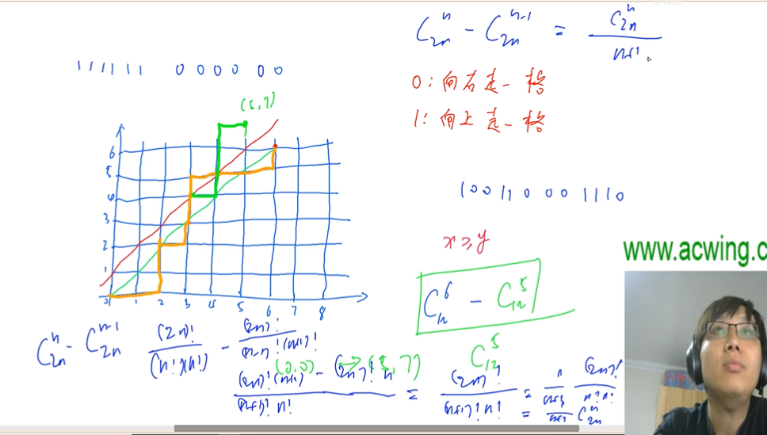

所有到6，6的非法路径有一条对于走到5，7的路径

> 给定 n 个 0 和 n 个 1，它们将按照某种顺序排成长度为 2n 的序列，求它们能排列成的所有序列中，能够满足任意前缀序列中 0 的个数都不少于 1 的个数的序列有多少个。
>
> 输出的答案对 109+71 取模。

```c++
#include<iostream>
using namespace std;

int mod = 1e9 +7;
typedef long long LL;
//需要做mod还是需要qmi

int qmi(int a, int k, int mod)
{
    int res=1;
    while(k)
    {
        if(k&1) res = (LL)res*a %mod;
        a =(LL)a*a %mod;
        k>>=1;
    }
    return res;
}

int main()
{
    int n;
    int res =1;
    cin >> n;
    for(int i=2*n;i>n;i--)
    {
        res = (LL)res * i %  mod;
    }
    for(int i=1;i<=n;i++)
    {
        res = (LL)res * qmi(i,mod-2,mod) %  mod;
    }
    res = (LL)res  * qmi(n+1,mod-2,mod) %  mod;
    
    
    cout << res << endl;
}
```


## 容斥原理

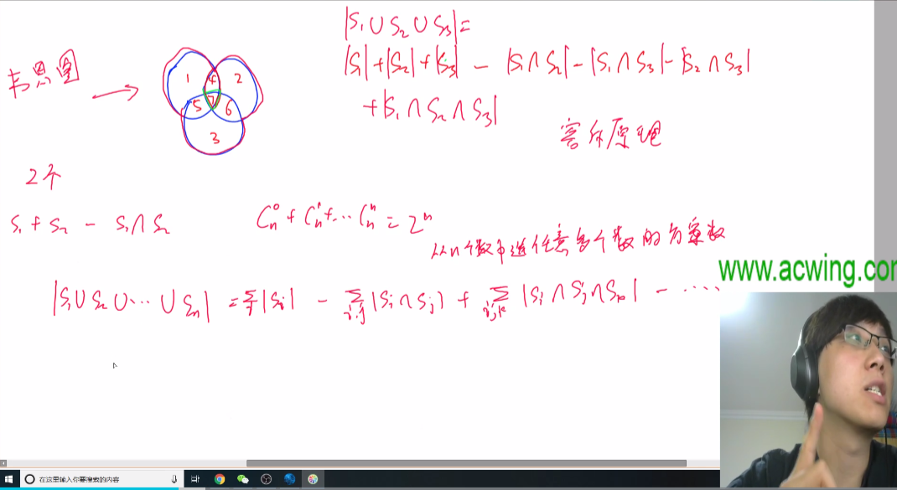

> ### 【能被整除的数】
>
> 给定一个整数 nn 和 mm 个不同的质数 p1,p2,…,pm
>
> 请你求出 1∼n中能被 p1,p2,…,pm中的至少一个数整除的整数有多少个。
>
> #### 输入格式
>
> 第一行包含整数 n 和 m。
>
> 第二行包含 m 个质数。
>
> #### 输出格式
>
> 输出一个整数，表示满足条件的整数的个数。


要想到==都是质数，能同时被2，3，5整除就是被2*3*5整除==
//是不质数就要用最小公倍数
不是一个个去试除，而是看==通过位运算选哪几个质数的乘积是否大于n==

```c++

#include <iostream>
#include <algorithm>

using namespace std;

typedef long long LL;

const int N = 20;

int p[N];


int main()
{
    int n, m;
    cin >> n >> m;

    for (int i = 0; i < m; i ++ ) cin >> p[i];

    LL res = 0;
    
    for (int i = 1; i < 1 << m; i ++ )
    {
        LL cnt=0,t=1;
        for (int j = 0; j < m; j ++ )
        if(i>>j&1)
        {
            cnt ++;
            t = (LL)t*p[j];
            if(t>n)
            {
                 t = -1;
                 break;
            }
             
        }
        //cout << cnt << t << endl;
        
        if(t!=-1)
        {
            if(cnt %2 ) res += n/t ;  //注意要考虑这个质数的e倍
            else res -=  n/t ;
        }
    }
    
    cout << res << endl;
    
}
```


## 简单博弈论

单独一个邻域

### 【拿石头】

是==公平组合ICG游戏==，因为任意时刻无论是谁的回合都可以无差别的对当前的石头堆进行拿，但是棋类不行，自己的回合是不能动对方的棋子而改变对局状态的

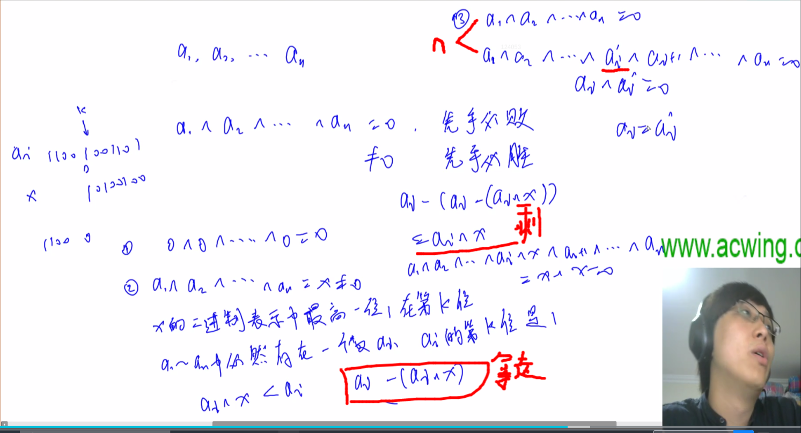

证明了异或等于和不等于0一定在拿一次后改变，而最后的失败态是等于0

```c++
#include <iostream>
#include <algorithm>

using namespace std;

const int N = 100010;


int main()
{
    int n;
    scanf("%d", &n);

    int res = 0;
    while (n -- )
    {
        int x;
        scanf("%d", &x);
        res ^= x;
    }

    if (res) puts("Yes");
    else puts("No");

    return 0;
}

```

max函数 不在当前集合最小的自然数


### 【集合-nim游戏】

#### SG函数 

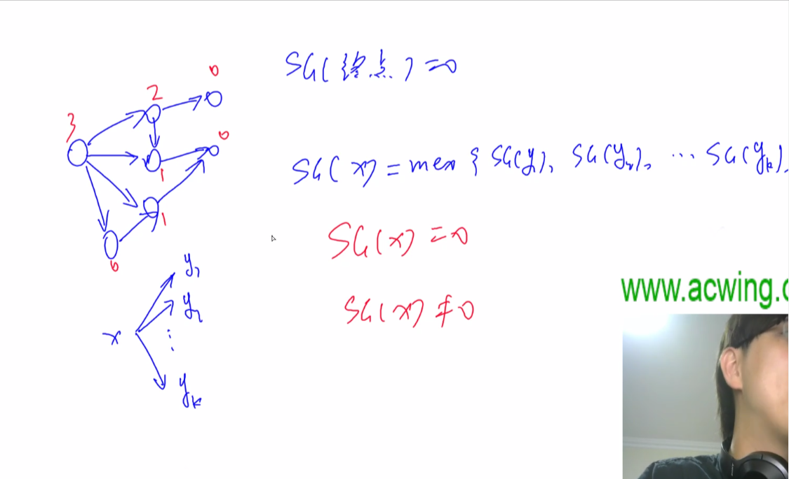

> 给定 n 堆石子以及一个由 k 个不同正整数构成的数字集合 S。
>
> 现在有两位玩家轮流操作，每次操作可以从任意一堆石子中拿取石子，每次拿取的石子数量必须包含于集合 S，最后无法进行操作的人视为失败。
>
> 问如果两人都采用最优策略，先手是否必胜。
>
> #### 输入格式
>
> 第一行包含整数 k，表示数字集合 S 中数字的个数。
>
> 第二行包含 k 个整数，其中第 i 个整数表示数字集合 S 中的第 i 个数 si。
>
> 第三行包含整数 n。
>
> 第四行包含 n 个整数，其中第 i 个整数表示第 i 堆石子的数量 hi。

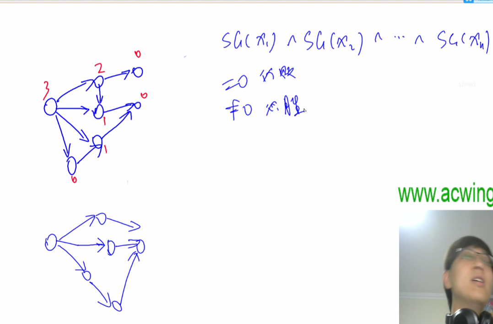

第一题随便拿几个石子，所以sg就等于n，sg等于3表示能到0，1，2所有状态

上面的石头问题就是n个图，每一堆石子对应一个图i，SG(xi)=石子个数

==记住sg和异或结论，容易写错==

```c++
#include <cstring>
#include <iostream>
#include <algorithm>
#include <unordered_set>

using namespace std;
const int N = 110, M = 10010;
int n, m;
int step[N];
int f[M];
//第一次做没有想到记忆化搜索否则超时
//count来确定最小非0的自然数，就是没想到用unordered_set
int sg(int x)
{
    if(x==0) return 0;
    if (f[x] != -1) return f[x];
    unordered_set<int> S;
    for (int i = 0;i< m; i ++ )
    { 
        int t = x-step[i];
        if(t>=0)
        {
            f[t] = sg(t);
            S.insert(f[t]);
        }
    }
   for (int i = 0; ; i ++ )
   {
       if(!S.count(i))
       {
           return i;
       }
   }
       
}

int main()
{
    scanf("%d", &m);
    memset(f,-1,sizeof f);
    for(int i=0;i<m;i++)
    {
        scanf("%d", &step[i]);
    }

    
    scanf("%d", &n);
    int res = 0;
    for(int i=0;i<n;i++)
    {
        int x;
        scanf("%d", &x);
        x = sg(x);
        //cout <<  x << endl;
        res ^= x;
    }
    if(res) puts("Yes");
    else puts("No");

    return 0;
}
```


# 动态规划

NP    非确定性多项式类问题 Nondeterministic Polynomially，

DP    动态规划 Dynamic programming

TSP  行旅商 Travelling salesman problem

> **总的来说DP的题目比较灵活，类型多。**
>
> **核心是构建 $f[i,j]$ 函数和状态转移的计算**

## 背包问题

### 【01背包】

应该是可以用深搜做出来的

动态规划的BP:

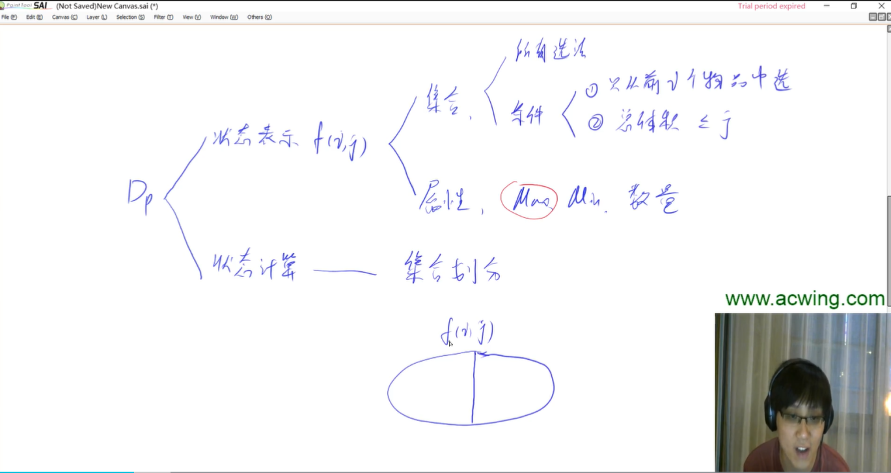
$$
F(i,j) = F(i-1,j) + F(i-1,j-a[i])
$$
[二维优化到一维](https://www.acwing.com/activity/content/code/content/625657/)

> 有 N 件物品和一个容量是 V 的背包。每件物品只能使用一次。
>
> 第 i 件物品的体积是 vi，价值是 wi。
>
> 求解将哪些物品装入背包，可使这些物品的总体积不超过背包容量，且总价值最大。
> 输出最大价值。
>
> #### 输入格式
>
> 第一行两个整数，N，V，用空格隔开，分别表示物品数量和背包容积。
>
> 接下来有 N 行，每行两个整数 vi,wi，用空格隔开，分别表示第 i 件物品的体积和价值。
>
> #### 输出格式
>
> 输出一个整数，表示最大价值。

```c++
#include<iostream>
#include<cstring>
#include<algorithm>
using namespace std;
const int N =  1010;
int n,m,f[N],v[N],w[N];


int main() //优化前
{
    cin >> n >> m;
    for (int i = 1; i <= n; i++) cin >> v[i] >> w[i];

    for (int i = 1; i <= n; i++) {
        for (int j = 1; j <= m; j++) {
            f[i][j] = f[i - 1][j];
            if (j >= v[i]) f[i][j] = max(f[i][j], f[i - 1][j - v[i]] + w[i]);
        }
    }
    cout << f[n][m] << endl;
}

int main()
{
    cin >> n >> m;

    for (int i = 1; i <= n; i ++ ) cin >> v[i] >> w[i];

    for (int i = 1; i <= n; i ++ )
        for (int j = m; j >= v[i]; j -- )
            f[j] = max(f[j], f[j - v[i]] + w[i]);

    cout << f[m] << endl;

    return 0;
}
```

### 【完全背包】

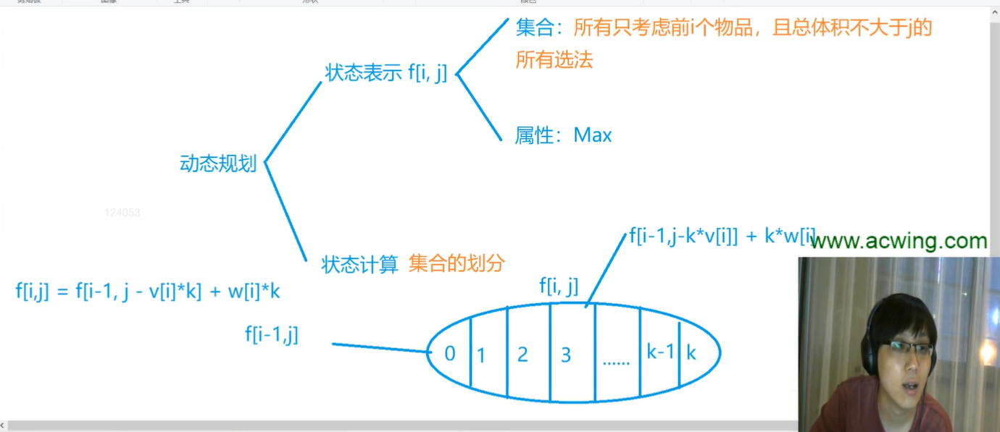

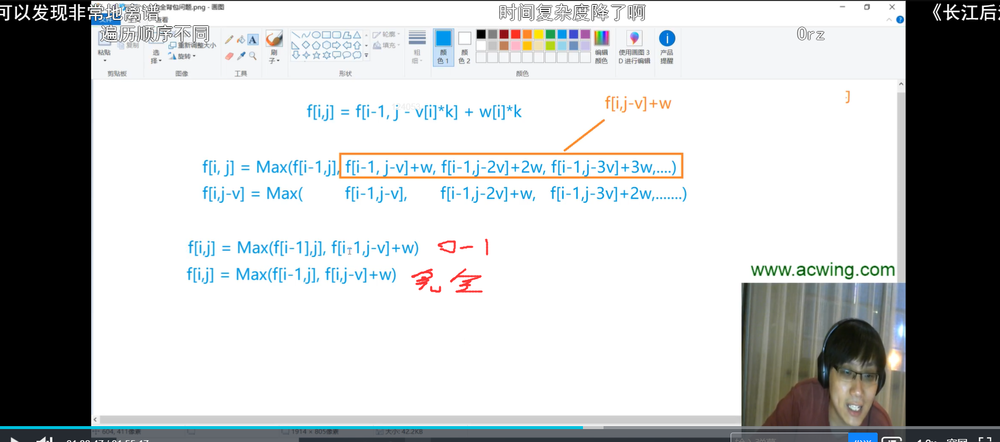

> 有 N 种物品和一个容量是 V 的背包，每种物品都有无限件可用。
>
> 第 i 种物品的体积是 vi，价值是 wi。
>
> 求解将哪些物品装入背包，可使这些物品的总体积不超过背包容量，且总价值最大。
> 输出最大价值。
>
> #### 输入格式
>
> 第一行两个整数，N，V，用空格隔开，分别表示物品种数和背包容积。
>
> 接下来有 N 行，每行两个整数 vi,wi，用空格隔开，分别表示第 i 种物品的体积和价值。
>
> #### 输出格式
>
> 输出一个整数，表示最大价值。

```C++
#include<iostream>
#include<cstring>
#include<algorithm>
using namespace std;
const int N =  1010;
int n,m,f[N],v[N],w[N];


int main()   //优化前
{
    cin>>n>>m;

    for(int i=1;i<=n;i++) cin>>v[i]>>w[i];

    for(int i=1;i<=n;i++)
    {
        for(int j=0;j<=m;j++)
        {
            for(int k=0;k*v[i]<=j;k++)
            {
                f[i][j]=max(f[i][j],f[i-1][j-k*v[i]]+k*w[i]);
            }
        }
    }

    cout<<f[n][m];

    return 0;
}


int main()
{
    cin >> n >> m;

    for (int i = 1; i <= n; i ++ ) cin >> v[i] >> w[i];

    for (int i = 1; i <= n; i ++ )
        for (int j = v[i]; j <=m ; j ++ )
            f[j] = max(f[j], f[j - v[i]] + w[i]);

    cout << f[m] << endl;

    return 0;
}
```

### 【多重背包问题】

> 有 N 种物品和一个容量是 V 的背包。
>
> 第 i 种物品最多有 si 件，每件体积是 vi，价值是 wi。
>
> 求解将哪些物品装入背包，可使物品体积总和不超过背包容量，且价值总和最大。
> 输出最大价值。
>
> #### 输入格式
>
> 第一行两个整数，N，V用空格隔开，分别表示物品种数和背包容积。
>
> 接下来有 N 行，每行三个整数 vi,wi,si，用空格隔开，分别表示第 i 种物品的体积、价值和数量。
>
> #### 输出格式
>
> 输出一个整数，表示最大价值。


```c++
#include<algorithm>
#include<cstring>
#include<iostream>
using namespace std;

const int N = 101;
int n,m,s[N],v[N],w[N],f[N][N];


int main()
{
    cin >> n>> m;
    for (int i = 1; i <= n; i ++ ) cin >> v[i] >> w[i] >> s[i];
    
    for(int i=1;i<=n;i++)
        for(int j=0;j<=m;j++)
            for(int k=0;k*v[i]<=j&&k<=s[i];k++)
                f[i][j] = max(f[i][j],f[i-1][j-k*v[i]] + k*w[i]);
    cout <<  f[n][m];
}

```

### 【多重背包问题Ⅱ】

当数量级别很大

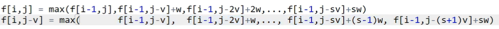

不能像完全背包一样优化，因为$f[i,j-v]+w$比$f[i,j]$ 的max多出来一项

思路：==si个物品i可以用二进制表示，就想数据包一样，用二进制个数打包，然后用01背包问题来解决==

```c++
#include <iostream>
#include <algorithm>

using namespace std;

const int N = 12010, M = 2010;

int n, m;
int v[N], w[N];
int f[M];

int main()
{
    cin >> n >> m;

    int cnt = 0;
    for (int i = 1; i <= n; i ++ )
    {
        int a, b, s;
        cin >> a >> b >> s;
        int k = 1;
        while (k <= s)
        {
            cnt ++ ;
            v[cnt] = a * k;
            w[cnt] = b * k;
            s -= k;
            k *= 2;
        }
        if (s > 0)
        {
            cnt ++ ;
            v[cnt] = a * s;
            w[cnt] = b * s;
        }
    }

    n = cnt;

    for (int i = 1; i <= n; i ++ )
        for (int j = m; j >= v[i]; j -- )
            f[j] = max(f[j], f[j - v[i]] + w[i]);

    cout << f[m] << endl;

    return 0;
}

```

### 【分组背包问题】

```c++
#include <iostream>
#include <algorithm>

using namespace std;

const int N = 110;

int n, m;
int v[N][N], w[N][N], s[N];
int f[N];

int main()
{
    cin >> n >> m;

    for (int i = 1; i <= n; i ++ )
    {
        cin >> s[i];
        for (int j = 0; j < s[i]; j ++ )
            cin >> v[i][j] >> w[i][j];
    }

    for (int i = 1; i <= n; i ++ )
        for (int j = m; j >= 0; j -- )//因为倒序的 f[i][j] = max(f[i-1][j], f[i-1][j - v[i][k]] + w[i][k]);
            for (int k = 0; k < s[i]; k ++ )
                if (v[i][k] <= j)
                    f[j] = max(f[j], f[j - v[i][k]] + w[i][k]);

    cout << f[m] << endl;

    return 0;
}

```


## 线性DP

### 【数字三角形】

> 给定一个如下图所示的数字三角形，从顶部出发，在每一结点可以选择移动至其左下方的结点或移动至其右下方的结点，一直走到底层，要求找出一条路径，使路径上的数字的和最大。
>
> ```
>         7
>       3   8
>     8   1   0
>   2   7   4   4
> 4   5   2   6   5
> ```
>
> #### 输入格式
>
> 第一行包含整数 n，表示数字三角形的层数。
>
> 接下来 n 行，每行包含若干整数，其中第 i 行表示数字三角形第 i 层包含的整数。

```c++
#include<cstring>
#include<iostream>
#include<algorithm>
using namespace std;
const int N=501;
int a[N],n,f[N];

int main()
{
    cin >> n;
    memset(f, 0xbf, sizeof(f));
    
    cin >> f[1];
    for(int i=2;i<=n;i++)
    {
        for(int j=i;j>=1;j--)
        {
            cin >> a[j];
            f[j] = max(f[j]+a[j],f[j-1]+ a[j]);
            //cout << a[j] << " " << f[j] << endl;
            
        }
    }
    int res;
    for(int i=1;i<=n;i++)
    {
        res = max(res,f[i]);
    }
    cout << res;
}

```

### 【最长上升子序列】

> 给定一个长度为 N 的数列，求数值严格单调递增的子序列的长度最长是多少。
>
> #### 输入格式
>
> 第一行包含整数 N。
>
> 第二行包含 N 个整数，表示完整序列。
>
> #### 输出格式
>
> 输出一个整数，表示最大长度。
>
> #### 数据范围
>
> 1≤N≤10001
> −109≤数列中的数≤109

如果需要==输出序列==需要在

if(a[j]<a[i]) f[i] = max(f[i],f[j]+ 1); 

后面保存一下从哪一个状态转移过来的

```c++
#include<cstring>
#include<iostream>
#include<algorithm>
using namespace std;
const int N=1001;
int a[N],n,f[N]; 

int main()
{
    cin >> n;
    memset(f, 0xbf, sizeof(f));
    
    for(int i=1;i<=n;i++)
    {
        f[i] = 1;
        cin >> a[i];
        for(int j=1;j<i;j++)
        {
            if(a[j]<a[i]) f[i] = max(f[i],f[j]+ 1);
            //cout << a[j] << " " << f[j] << endl;
            
        }
    }
    int res;
    for(int i=1;i<=n;i++)
    {
        res = max(res,f[i]);
    }
    cout << res;
}

```

### 【最长上升子序列-[二分边界分析](https://www.acwing.com/video/328/)】

n数量级更大,优化：每个长度的递增子序列，只考虑结尾的数字最小的


并且数组q[n]（存的是长度n结尾数字）是单调递增的

所以只需把i-1<=a<=i更新到q[i]

```c++
//我的
#include<cstring>
#include<iostream>
#include<algorithm>
using namespace std;
const int N=1e5+1;
int a[N],n,q[N];

int main()
{
    cin >> n;
    memset(q, 0xbf, sizeof(q));
    int len=0;
    for(int i=1;i<=n;i++)
    {
       cin >> a[i];
       int l=0,r = len, mid;//l要0，有可能加入的点，比之前的值都小
       while(l<r)
       {
           mid = (l+r+1) >> 1; //l = mid;所以上取整
           if(q[mid] < a[i]) l = mid;///if (q[mid] < a[i])要求的一定在mid右边
           else r = mid -1;
       }
       q[r+1] = a[i];
       len = max(len,r+1);
    }
    cout << len;
}

```


```c++
//Y总
#include <iostream>
#include <algorithm>

using namespace std;

const int N = 100010;

int n;
int a[N];
int q[N];

int main()
{
    scanf("%d", &n);
    for (int i = 0; i < n; i ++ ) scanf("%d", &a[i]);

    int len = 0;
    for (int i = 0; i < n; i ++ )
    {
        int l = 0, r = len;
        while (l < r)
        {
            int mid = l + r + 1 >> 1; //l = mid;所以上取整
            if (q[mid] < a[i]) l = mid; ///if (q[mid] < a[i])要求的一定在mid右边
            else r = mid - 1;
        }
        len = max(len, r + 1); //len是结果
        q[r + 1] = a[i];
    }

    printf("%d\n", len);

    return 0;
}
```

### 【最长公共子序列】


四个子集合是有重复的（01是表示不选a[i]且选b[j]的最大值，但是f[i-1,j]是前j个字母，不一定选了j，是所有前j个字母的情况，包含前者），但是求max重复是没有关系的

```c++
#include <iostream>
#include <algorithm>

using namespace std;

const int N = 1010;

int n, m;
char a[N], b[N];//不能写成int，字节对不上判等出错
int f[N][N];

int main()
{
    scanf("%d%d", &n, &m);
    scanf("%s%s", a + 1, b + 1);

   for(int i=1;i<=n;i++)
    {
        for(int j=1;j<=m;j++)
        {
            f[i][j] = max(f[i-1][j],f[i][j-1]);  //这里应该是包含了00，01，10的情况的
            if(a[i]==b[j]) f[i][j] = max(f[i][j],f[i-1][j-1]+1);
        }
    }
   
    printf("%d\n", f[n][m]);

    return 0;
}

```

### 【编辑距离-习题未做】

## 区间DP

### 【合并石子 -前缀和 】

> 设有 N 堆石子排成一排，其编号为 1,2,3,…,N。
>
> 每堆石子有一定的质量，可以用一个整数来描述，现在要将这 NN 堆石子合并成为一堆。
>
> 每次只能合并相邻的两堆，合并的代价为这两堆石子的质量之和，合并后与这两堆石子相邻的石子将和新堆相邻，合并时由于选择的顺序不同，合并的总代价也不相同。
>
> 例如有 4 堆石子分别为 `1 3 5 2`， 我们可以先合并 1、2堆，代价为 4，得到 `4 5 2`， 又合并 1、2堆，代价为 9，得到 `9 2` ，再合并得到 11，总代价为 4+9+11=244
>
> 如果第二步是先合并 2、3堆，则代价为 7，得到 `4 7`，最后一次合并代价为 1111，总代价为 4+7+11=22
>
> 问题是：找出一种合理的方法，使总的代价最小，输出最小代价。
>
> #### 输入格式
>
> 第一行一个数 N 表示石子的堆数 N。
>
> 第二行 N 个数，表示每堆石子的质量(均不超过 1000)。
>
> #### 输出格式
>
> 输出一个整数，表示最小代价。
>
> #### 数据范围
>
> 1≤N≤300

我的写法

```c++
#include <iostream>
#include <algorithm>
#include <cstring>
using namespace std;

const int N = 310;

int n;
int s[N];
int f[N][N];


int main()
{
    cin >> n;
    int sum = 0;
    memset(f,0x3f,sizeof f);
    for(int i=1;i<=n;i++)
    {
        int x;
        cin >> x;
        sum += x;
        s[i] = sum;
    }
    for(int i=1;i<=n;i++) f[i][i] = 0;
    //这个遍历应该是需要先遍历出长度小的
     for(int len=1;len<=n;len++) //长度
    {
        for(int i=1;i<=n-len+1;i++)//起点
        {
            int j = i+ len - 1;//终点
            for(int k=1;k<len;k++)//左区间堆的个数
            {
                //printf("%d%d%d\n",i,j,k);
                f[i][j] = min(f[i][j],f[i][i+k-1]+f[i+k][j] + s[j] - s[i-1]);
                //cout << f[i][j] << endl;
            }

        }
    }
    cout << f[1][n];
}
```

Y总

```c++
#include <iostream>
#include <algorithm>

using namespace std;

const int N = 310;

int n;
int s[N];
int f[N][N];

int main()
{
    scanf("%d", &n);
    for (int i = 1; i <= n; i ++ ) scanf("%d", &s[i]);

    for (int i = 1; i <= n; i ++ ) s[i] += s[i - 1];

    for (int len = 2; len <= n; len ++ )
        for (int i = 1; i + len - 1 <= n; i ++ )
        {
            int l = i, r = i + len - 1;
            f[l][r] = 1e8;
            for (int k = l; k < r; k ++ )
                f[l][r] = min(f[l][r], f[l][k] + f[k + 1][r] + s[r] - s[l - 1]);
        }

    printf("%d\n", f[1][n]);
    return 0;
}
```


## 计数类DP


## 数位统计DP

### 【计数问题】

主要就是==分类讨论==     统计1~n之间的数字一共有多少个位1

感觉就是==恶心，感觉和dp没什么关系==


```c++
#include<iostream>
#include<cstdio>
#include<algorithm>
#include<vector>

using namespace std;

const int N = 1e8;

int a, b;
//返回第l到第r位的数字 比如原数字是12345  那么从1到3位的数字就是123
int getnum(vector<int> num, int l, int r) 
{
    int n = num.size();
    int res = 0;
    for(int i = n - l; i >= n - r; i --)
        res = res*10 + num[i];
    return res;
}

int power10(int x) //返回10的x次方
{
    int res = 1;
    while(x--) res *= 10;
    return res;
}

int count(int n, int x)//统计1~n之间的数字一共有多少个x
{
    int res = 0; //返回的答案

    if(n==0) return res;//边界

    vector<int> num;//存储n的每一位数字 12345存入后顺序是54321
    while(n)
    {
        num.push_back(n%10);
        n/=10;
    }

    n = num.size();// 重新赋值n等于n这个数字的位数

    // 12345 记第一位数字是1   x=0的时候从第二位开始
    for(int i = 1 + (x==0); i <= n ; i ++)
    {
        //情况1
        if(i != 1) //枚举的数字在最高位的时候没有情况1
        {
            res += getnum(num,1,i-1)*power10(n-i);
            if(x==0) res -= power10(n-i);
        }
        //情况2的三个小分类
        int d = num[n-i];
        if(d<x) res = res;//0个
        else if(d==x) res += getnum(num,i+1,n)+1;
        else if(d>x) res += power10(n-i);
    }
    //调试printf("x=%d res=%d\n", x, res );
    return res;
}

int main()
{
    while(cin >> a >> b && a && b)
    {
        if(a > b) swap(a,b); //保证小数在前
        for(int i = 0; i < 10 ; i ++) printf("%d ", count(b,i) - count(a-1,i));

        puts("");
    }

    return 0;
}

```


## 状态压缩DP

### 【划分长方形-蒙德里安梦想】

[50：00左右](https://www.acwing.com/file_system/file/content/whole/index/content/4817/)


```c++
#include<iostream>
#include<cstring>
#include<algorithm>
using namespace std;
const int N = 12, M = 1 << N;

int n, m;
long long f[N][M];
bool st[M];

int main()
{
    while (cin >> n >> m, n || m)
    {
        //预处理出 j每个数值是否会有连续奇数个零
        for(int i=0;i<1<<n;i++)
        {
            int cnt=0;
            st[i] = true;
            for(int j=0;j<n;j++)
            {
                if(i>>j&1) //这里主要位运算&
                {
                    if (cnt & 1) st[i] = false;
                    cnt = 0;
                }
                else cnt++;
            }
            if (cnt & 1) st[i] = false;
        }
        
        memset(f, 0, sizeof f); //没有运算到的初始化为0
        f[0][0] = 1; //第一列并且前面有0捅出来
        for(int i=1;i<=m;i++)
            for(int j=0;j<1<<n;j++)
                for(int k=0;k<1<<n;k++)
                    if ((j & k) == 0 && st[j | k])
                            f[i][j] += f[i - 1][k];
        //第i列并且前面有j捅出来 += [i - 1]列 k捅出来方案数，枚举所有的((j & k) == 0 && st[j | k])求和
        //所以当i枚举到i，其实是在放置第i-1列的方法
    cout << f[m][0] <<endl;//求f[m][0] += f[m-1][k];累加时候抽象出来其实就是放置最后一行（m-1行）不放置横块只填充竖块
    }
}

```

### 【最短Hamilton路径】

> 给定一张 n 个点的带权无向图，点从 0∼n−1标号，求起点 0 到终点 n−1的最短 Hamilton 路径。
>
> Hamilton 路径的定义是从 0到 n−1不重不漏地经过每个点恰好一次。
>
> #### 输入格式
>
> 第一行输入整数 n。
>
> 接下来 n行每行 n 个整数，其中第 i 行第 j个整数表示点 i 到 j 的距离（记为 a[i,j]）。


```c++
#include <cstring>
#include <iostream>
#include <algorithm>

using namespace std;

const int N = 20, M = 1 << N;

int n;
int w[N][N];
int f[M][N];

int main()
{
    cin >> n;
    for (int i = 0; i < n; i ++ )
        for (int j = 0; j < n; j ++ )
            cin >> w[i][j];

    memset(f, 0x3f, sizeof f);
    f[1][0] = 0;

    for (int i = 0; i < 1 << n; i ++ )
        for (int j = 0; j < n; j ++ ) 
            if (i >> j & 1) //状态到过j
                for (int k = 0; k < n; k ++ )
                    if (i >> k & 1)//如果 i和j的遍历顺序调换，则j=0,但i已经枚举到后面，会出现K>j但是i >> k & 1为true，f[i - (1 << j)][k]就没有被计算过
                        //但是i - (1 << j)一定是小于i的，所以优先把j都遍历了
                        f[i][j] = min(f[i][j], f[i - (1 << j)][k] + w[k][j]);

    cout << f[(1 << n) - 1][n - 1];

    return 0;
}

```


## 树形DP

### 【没有上司的舞会】

> Ural 大学有 N 名职员，编号为 1∼N。
>
> 他们的关系就像一棵以校长为根的树，父节点就是子节点的直接上司。
>
> 每个职员有一个快乐指数，用整数 HiHi 给出，其中 1≤i≤N。
>
> 现在要召开一场周年庆宴会，不过，没有职员愿意和直接上司一起参会。
>
> 在满足这个条件的前提下，主办方希望邀请一部分职员参会，使得所有参会职员的快乐指数总和最大，求这个最大值。
>
> #### 输入格式
>
> 第一行一个整数 N。
>
> 接下来 N 行，第 i 行表示 i 号职员的快乐指数Hi。
>
> 接下来 N−1行，每行输入一对整数 L,K，表示 K 是 L 的直接上司。（注意一下，后一个数是前一个数的**父节点**，不要搞反）。


```c++
#include<iostream>
#include<cstring>
const int N = 6010;
using namespace std;
int h[N],ne[N],e[N],happy[N];
int n,idx;
int f[N][2];
bool has_fa[N];

void add(int a,int b)
{
    e[idx] = b; ne[idx] = h[a]; h[a] = idx++;
}

int dfs(int u)
{

    for(int i=h[u];i!=-1;i=ne[i])
    {
        int j = e[i];
        dfs(j);
        f[u][0] += max(f[j][1],f[j][0]);
        f[u][1] += f[j][0];
        
    }
    f[u][1] += happy[u];
    
    //printf("u:%d %d %d\n",u,f[u][0],f[u][1]);
}

int main()
{
    
    scanf("%d", &n);
    memset(h, -1 ,sizeof h);
    for(int i=1;i<=n;i++) scanf("%d", &happy[i]);
    for(int i=1;i<=n-1;i++)
    {
        int a,b;
        scanf("%d%d", &a, &b);
        add(b,a);
        has_fa[a] = true;
    }

    int root = 1;
    while(has_fa[root]) root++;
    //printf("%d\n",root);
    dfs(root);
    cout << max(f[root][1],f[root][0]);  
    
} 
```


## 记忆化搜索

### 【滑雪】

> 给定一个 R 行 C 列的矩阵，表示一个矩形网格滑雪场。
>
> 矩阵中第 i 行第 j 列的点表示滑雪场的第 i行第 j 列区域的高度。
>
> 一个人从滑雪场中的某个区域内出发，每次可以向上下左右任意一个方向滑动一个单位距离。
>
> 当然，一个人能够滑动到某相邻区域的前提是该区域的高度低于自己目前所在区域的高度。
>
> 下面给出一个矩阵作为例子：
>
> ```
>  1  2  3  4 5
> 
> 16 17 18 19 6
> 
> 15 24 25 20 7
> 
> 14 23 22 21 8
> 
> 13 12 11 10 9
> ```
>
> 在给定矩阵中，一条可行的滑行轨迹为 24−17−2−1
>
> 在给定矩阵中，最长的滑行轨迹为 25−24−23−…−3−2−125−24−23−…−3−2−1，沿途共经过 25 个区域。
>
> 现在给定你一个二维矩阵表示滑雪场各区域的高度，请你找出在该滑雪场中能够完成的最长滑雪轨迹，并输出其长度(可经过最大区域数)。
>
> #### 输入格式
>
> 第一行包含两个整数 R 和 C。
>
> 接下来 R 行，每行包含 C 个整数，表示完整的二维矩阵。


```c++
#include <iostream>
#include <cstring>
using namespace std;
const int N = 310;
int h[N][N],f[N][N];
int n,m;
int dx[4] = {-1, 0, 1, 0}, dy[4] = {0, 1, 0, -1};

int dp(int r,int cl)
{
    if(f[r][cl]) return f[r][cl];
    int res=1;
    for(int i=0;i<4;i++)
    {
        int x = r+dx[i],y = cl+dy[i];
        if(x>=0&&y>=0&&x<n&&y<m)
            if(h[r][cl]>h[x][y]) 
                res = max(res,dp(x,y) + 1 );
    }
    f[r][cl] = res;
    return res;
}

int main()
{
    cin >> n >> m;
    for(int i=0;i<n;i++)
      for(int j=0;j<m;j++)
      {
          cin >> h[i][j];
      }
      
     int res=0;
     for(int i=0;i<n;i++)
      for(int j=0;j<m;j++)
      {
          
          res = max(res, dp(i,j));
      }
      
    //   for(int i=0;i<n;i++)
    //   {
    //       for(int j=0;j<m;j++)
    //       {
    //           cout << f[i][j] << " ";
    //       }
    //       cout << "" << endl;
    //   }
          
      cout << res;
        
}

```


# 贪心
# 时空复杂度分析