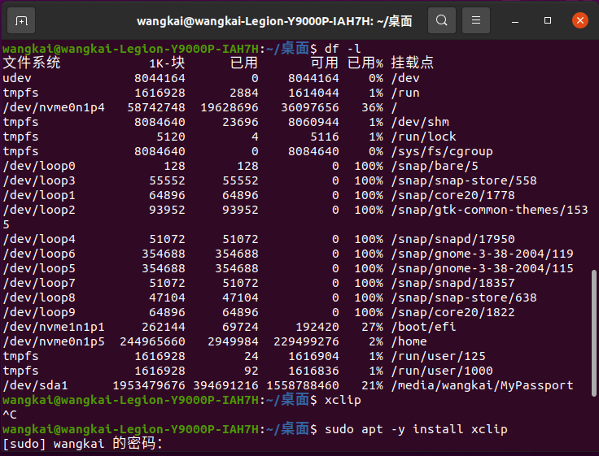
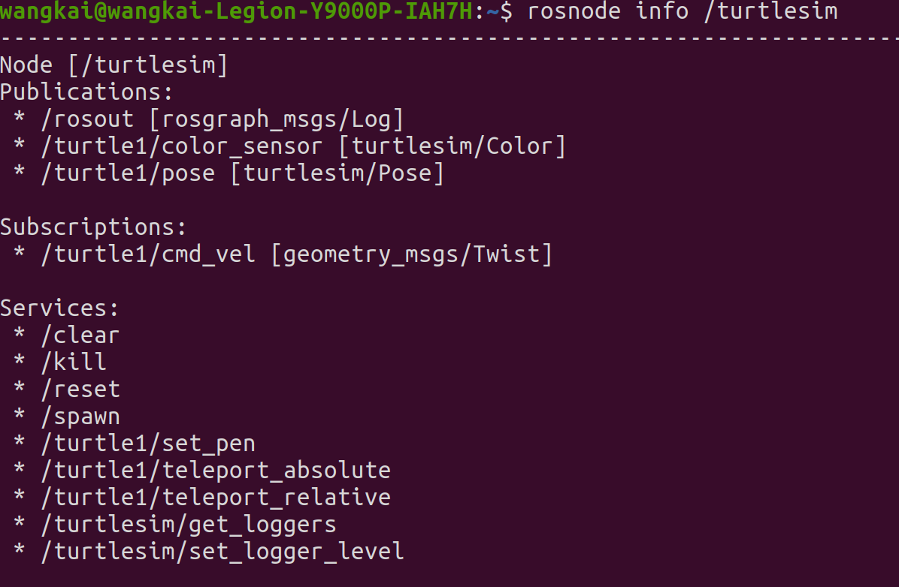
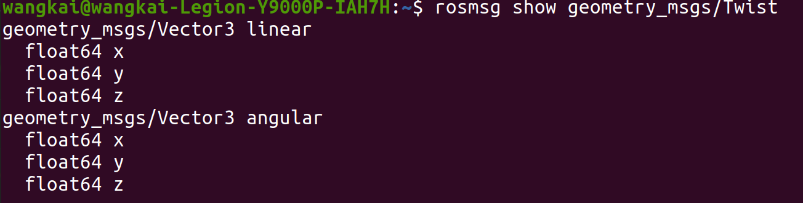

- [THU安装](#thu安装)
  - [zivid 安装](#zivid-安装)
    - [SDK安装](#sdk安装)
    - [安装python库](#安装python库)
    - [Compiler with C++17 support](#compiler-with-c17-support)
- [tensorflow-gpu安装](#tensorflow-gpu安装)
- [服务器配置环境](#服务器配置环境)
    - [pip list地址不对](#pip-list地址不对)
    - [服务器conda创建路径](#服务器conda创建路径)
- [git上传](#git上传)
- [conda](#conda)
    - [删除环境](#删除环境)
    - [添加源](#添加源)
    - [pip添加源](#pip添加源)
    - [删除anaconda](#删除anaconda)
- [ubuntu安装20.4好用](#ubuntu安装204好用)
  - [磁盘分配](#磁盘分配)
  - [启动速度慢](#启动速度慢)
  - [亮度问题](#亮度问题)
  - [谷歌输入法](#谷歌输入法)
  - [clashy](#clashy)
  - [pycharm](#pycharm)
- [ubuntu系统备份](#ubuntu系统备份)
  - [timeshift](#timeshift)
  - [system back](#system-back)
- [ROS](#ros)
  - [基础](#基础)
  - [命令](#命令)
    - [查看模型](#查看模型)
    - [发布topic](#发布topic)
    - [查看数据类型](#查看数据类型)
    - [service](#service)
    - [rosbag](#rosbag)
    - [创建工作空间](#创建工作空间)
    - [创建包](#创建包)
    - [发布者publisher](#发布者publisher)
    - [订阅subscriber](#订阅subscriber)
    - [话题消息类型的定义和使用](#话题消息类型的定义和使用)
    - [客户端和服务端](#客户端和服务端)
    - [参数](#参数)
    - [坐标系](#坐标系)
  - [launch文件](#launch文件)
- [vscode jupyter C++](#vscode-jupyter-c)
  - [jupyternote](#jupyternote)
  - [jupyter lab](#jupyter-lab)
  - [markdown的粘贴](#markdown的粘贴)
  - [use](#use)
  - [无法包含头文件,配置c++插件json](#无法包含头文件配置c插件json)
- [Cmake和配置文件](#cmake和配置文件)
  - [ubuntu](#ubuntu)
  - [windows](#windows)
- [docker](#docker)

# THU安装

```
conda create -n THU python==3.7
```
```
pip install -r requirements.txt
```
```
pip install .\torch-1.8.0+cu111-cp37-cp37m-win_amd64.whl
```
```
pip install --no-deps  torchvision==0.14.0
```

修改mydetect，py文件的  
weights='../yolov7/yolov7.pt',  # 训练好的模型路径   （必改）
会下载别的版本但是没关系
<br/><br/><br/>


## zivid 安装
### SDK安装
[github]（https://github.com/zivid/zivid-python）  
安装Zivid SDK version 2.8.1 (see here for help)
<br/><br/><br/>


### 安装python库
```
pip install zivid
```
Successfully installed numpy-1.21.6 zivid-2.7.0.2.8.1   
<br/><br/><br/>


### Compiler with C++17 support
https://www.cnblogs.com/XieSir/articles/11921800.html
https://blog.csdn.net/honeysuckle_luo/article/details/128009794
<br/><br/><br/>


# tensorflow-gpu安装
```
pip install tensorflow-gpu
```
还需要安装一个cudnn把安装的文件夹的几个文件夹放到对应的位置
https://blog.csdn.net/qq_43215538/article/details/123852028

https://blog.csdn.net/qq_44898938/article/details/118341219
<br/><br/><br/>


# 服务器配置环境
### pip list地址不对
https://www.jb51.net/article/256189.htm

`python -m site`  查看路径在哪  
`python -m site -help`查看site文件的路径


<br/><br/>

 ```
 vim /home/vip417/.conda/envs/tensorwk/lib/python3.7/site.py
 ```
 <br/>
第87行修改  
USER_SITE = None  
USER_BASE = None  
为  
USER_SITE = "/home/vip417/.conda/envs/tensorwk/lib/python3.7/site-packages"    
USER_BASE = "/home/vip417/.conda/envs/tensorwk/Scripts"（无路径）

USER_SITE = "/home/vip417/.conda/envs/wkmmdet"
USER_BASE = "/home/vip417/.conda/envs/wkmmdet/lib/python3.8/site-packages"

<br/><br/>
### 服务器conda创建路径
有时候可能conda装在sudo -i root环境下，创建环境可以指定目录
```
 sudo conda create -p /home/vip417/anaconda3/envs/wktensor python=3.7
```
没有环境名称

<br/><br/><br/>


# [git上传](https://blog.csdn.net/zhuguanlin121/article/details/118415704)


# conda
### 删除环境
```
conda env remove -n 环境名称
```
### 添加源  
https://blog.csdn.net/YPP0229/article/details/105630429/  
```
conda config --show channels
conda config --add channels https://mirrors.tuna.tsinghua.edu.cn/anaconda/pkgs/main
conda config --add channels https://mirrors.tuna.tsinghua.edu.cn/anaconda/pkgs/free
conda config --add channels https://mirrors.tuna.tsinghua.edu.cn/anaconda/pkgs/r
conda config --add channels https://mirrors.tuna.tsinghua.edu.cn/anaconda/pkgs/pro
conda config --add channels https://mirrors.tuna.tsinghua.edu.cn/anaconda/pkgs/msys2

conda config --set show_channel_urls yes
```
### pip添加源
1、临时使用
1 pip install -i https://pypi.tuna.tsinghua.edu.cn/simple some-package

2、永久更改pip源
升级 pip 到最新的版本 (>=10.0.0) 后进行配置：
1 pip install pip -U
2 pip config set global.index-url https://pypi.tuna.tsinghua.edu.cn/simple

直接写入配置文件：

vim ~/.pip/pip.conf

将配置文件写入:

[global]
index-url = https://pypi.tuna.tsinghua.edu.cn/simple
[install]
trusted-host = pypi.tuna.tsinghua.edu.cn
<br/><br/><br/>

### 删除anaconda
https://blog.csdn.net/qq_45866081/article/details/126965792
再删除.conda等隐藏文件


# ubuntu安装20.4好用
## 磁盘分配

|  分区   |     大小     |  类型  |
|:-----:|:----------:|:----:|
|  系统   |    400M    | 逻辑分区 |
| swap  | 电脑物理内存的2倍  | 逻辑分区 |
|   /   |    30G     | 逻辑分区 |
| /home |    200+    | 逻辑分区 |    


  
软件安装在了/

<br/><br/>

<br/><br/><br/>


## 启动速度慢
[卸载snap](https://blog.csdn.net/a985588764/article/details/127636363)

## 亮度问题
https://blog.csdn.net/weixin_44120025/article/details/118875998
应该是bois独显和混显修改的问题
<br/><br/><br/>


## 谷歌输入法
https://blog.csdn.net/qq_24649627/article/details/125657625

## clashy
复制托管链接，下载txt
/home/wangkai/.config/Clashy
新建一个yaml把txt文件复制进去

## pycharm 
复制解压文件,sh bin文件下的sh文件，tool栏创建快捷方式


# ubuntu系统备份
## timeshift
## system back

# ROS
[更新软件源](https://blog.csdn.net/qq_44339029/article/details/108916820)  
<br/>
[安装ROS](https://mp.weixin.qq.com/s?__biz=MzU1NjEwMTY0Mw==&mid=2247562322&idx=1&sn=b8d6d08a2f55bae4dbb532ede6e3d314&chksm=fbc98d36ccbe042000b03ba0ba9ff31c3bd8d97c8c2926bcb55e6d6dc3b9dc702d7609c968dd&scene=27)   
<br/>
[基础教学资源](https://www.bilibili.com/read/cv12059277 )   

[b站故月居ppt](https://github.com/guyuehome/ros_21_tutorials  ) 
<br/><br/><br/>

## 基础
  


节点： 类似进程
<br/>
  

话题：数据管道  ，一段是Node publisher,一段是Node subscriber  
消息：数据格式
<br/>
同步：发布阻塞后立马收到  
异步：不阻塞，其他任务去get  
<br/>


<br/><br/>


## 命令
  
常用命令


• rostopic  
• rosservice  
• rosnode 
• rosparam   
• rosmsg  
• rossrv 

• sudo rosdep init 

• roscore  启动rosmaster  
• rosrun turtlesim turtlesim_node     
• rosrun turtlesim turtle_teleop_key    
turtlesim包名，turtle_teleop_key**节点名**，src下的cpp名和节点名一致(好像可以不一致)，两次tab列出node，
<br/><br/>
 

### 查看模型
rqt_graph  
rosnode list  
rosnode info  

<br/><br/>


### 发布topic
rostopic pub -r 10 /turtle1/cmd_vel geometry_msgs/Twist   
给/turtle1/cmd_vel这个话题发送数据  
频率   topic  数据格式  数据内容

<br/><br/>


### 查看数据类型

<br/><br/>


### service

<br/><br/>


### rosbag
  
记录的topic的message  

<br/><br/>


### 创建工作空间

<br/><br/>


### 创建包
```
catkin_create_pkg learning_topic  roscpp rospy std_msgs geometry_msgs turtlesim
```


检查环境变量：

<br/><br/>

### 发布者publisher


  
+ catkin_make 到根目录编译
+ source 添加环境变量
python不用编译生成可执行文件和链接到ros     
直接改成rosrun learning_topic velocity_publisher.py  

### 订阅subscriber
### 话题消息类型的定义和使用
### 客户端和服务端
### 参数
### 坐标系


## launch文件
  
一个功能包一个节点，但可以有多个topic   
[type：节点本来的名称，这个名称和节点初始化所在.cpp源文件的文件名一致，也就是编译生成的exe文件名一致](https://blog.csdn.net/weixin_45590473/article/details/122647788)  

```
roslaunch learning_topic simple.launch
```
```xml
<launch>
    <node pkg="turtlesim" type="turtlesim_node" name="turtle" output="screen" />
    <node pkg="learning_topic" type="pose_subscriber" name="talker" output="screen" />
    
</launch>
```


# vscode jupyter C++

## jupyternote
https://zhuanlan.zhihu.com/p/561182221?utm_id=0  

## jupyter lab
https://blog.csdn.net/shelgi/article/details/125131135
 安装慢要等，如果网页打不开，要把

/home/wangkai/miniconda3/envs/cpp/share/jupyter/lab
复制到
/home/wangkai/miniconda3/envs/cpp/lib/python3.7/site-packages/share/jupyter/lab

## markdown的粘贴
[markdown的粘贴](http://www.aqpower.cn/2022/08/18/VScode%E4%B9%9F%E5%8F%AF%E4%BB%A5%E5%BE%88%E5%A5%BD%E7%9A%84%E7%BC%96%E5%86%99markdown%E6%96%87%E4%BB%B6/)  
要修改快捷键
[有的是保存在文件在中](https://blog.csdn.net/mighty13/article/details/120695373) ！！不好用，易丢失
  
ubuntu需要安装xclip 

亲测，markdown image, 修改ctrl 下下，修改Local Path，和第一个配置为
`${path}/img/img_${YY}${MM}${DD}-${HH}${mm}${ss}${mss}`
<br/><br/>


## use
sudo -i  
echo 3 > /proc/sys/vm/drop_caches  
conda activate cpp
jupyter notebook --allow-root
```
(cpp) root@wangkai-Legion-Y9000P-IAH7H:/home/wangkai/codenotes/markdown# jupyter lab --allow-root -i ./
```
<br/><br/>


## 无法包含头文件,配置c++插件json
https://www.bilibili.com/read/cv18556963
改task.json的-g
```
"args": [
				"-fdiagnostics-color=always",
				"-g",
				"${fileDirname}/*.cpp",
				"-o",
				"${fileDirname}/${fileBasenameNoExtension}"
			],
```
这种方法还是只能运行一个文件夹的多个cpp
<br/><br/>


# Cmake和配置文件
## ubuntu
[基于VSCode和CMake实现C/C++开发 | Linux篇](https://www.bilibili.com/video/BV1fy4y1b7TC/?p=17&spm_id_from=pageDriver&vd_source=eef102f4fb053709a57c96d0c876628a)

gcc：c语言编译器
g++：c++编译器
GDB：调试器

gcc --v
g++ --v
gdb --version
cmake --version


CMakeLists.txt

```
project(Myproject)
cmake_minimum_required (VERSION 3.0)

set(CMAKE_CXX_STANDARD 17)
set(CMAKE_C_STANDARD 11)

# debug
set(CMAKE_CXX_FLAGS "${CMAKE_CXX_FLAGS} -g -O2 -Wall")
set(CMAKE_BUILD_TYPE Debug)

include_directories(include) # 头文件目录

if (!WIN32)
    link_libraries(pthread rt m)
endif (!WIN32)

AUX_SOURCE_DIRECTORY(./src src) # 原文件目录

ADD_EXECUTABLE(main ${src})
```


c_cpp_properties.json
```json
{
  "configurations": [
    {
      "name": "linux-gcc-x64",
      "includePath": [
        "${workspaceFolder}/**"
      ],
      "compilerPath": "/usr/bin/gcc", //解释器路径
      "cStandard": "${default}",
      "cppStandard": "${default}",
      "intelliSenseMode": "linux-gcc-x64",
      "compilerArgs": [
        ""
      ]
    }
  ],
  "version": 4
}
```

launch.json:
```json
{
    
    // 使用 IntelliSense 了解相关属性。 
    // 悬停以查看现有属性的描述。
    // 欲了解更多信息，请访问: https://go.microsoft.com/fwlink/?linkid=830387
    "version": "0.2.0",
    "configurations": [

        /*{
            "name": "(gdb) 启动",
            "type": "cppdbg",
            "request": "attach",
            "program": "${workspaceFolder}/build/main",
            "args": [],
            "stopAtEntry": false,
            "cwd": "${fileDirname}",
            "environment": [],
            "externalConsole": false,
            "MIMode": "gdb",
            "preLaunchTask": "Build",
            "setupCommands": [
                {
                    "description": "为 gdb 启用整齐打印",
                    "text": "-enable-pretty-printing",
                    "ignoreFailures": true
                },
                {
                    "description": "将反汇编风格设置为 Intel",
                    "text": "-gdb-set disassembly-flavor intel",
                    "ignoreFailures": true
                }
            ]
        },*/
        {
            "name": "(gdb) 启动",
            "type": "cppdbg",
            "request": "launch",
            "program": "${workspaceFolder}/build/main", //可执行文件
            "args": [],
            "stopAtEntry": false,
            "cwd": "${fileDirname}",
            "environment": [],
            "externalConsole": false,
            "MIMode": "gdb",
            "preLaunchTask": "Build",
            "setupCommands": [
                {
                    "description": "为 gdb 启用整齐打印",
                    "text": "-enable-pretty-printing",
                    "ignoreFailures": true
                },
                {
                    "description": "将反汇编风格设置为 Intel",
                    "text": "-gdb-set disassembly-flavor intel",
                    "ignoreFailures": true
                }
            ]
        },
        {
            "type": "lldb",
            "request": "launch",
            "name": "Debug",
            "program": "${workspaceFolder}/build/main", //可执行文件路径
            "args": [],
            "cwd": "${workspaceFolder}",
            "preLaunchTask": "Build" //执行执行preLaunchTask去执行camke和make，配置在task.json
        }
    ]
}
```
tasks.json:
```json
{   
    "version": "2.0.0",
    "options": {
        "cwd": "${workspaceFolder}/build"
    },
    "tasks": [
        {
            "type": "shell",
            "label": "cmake", //等同在${workspaceFolder}/build"路径下执行cmake ..
            "command": "cmake",
            "args": [
                ".."
            ]
        },
        {
            "label": "make", //等同在${workspaceFolder}/build"路径下执行cmake ..
            "group": {
                "kind": "build",
                "isDefault": true
            },
            "command": "make",
            "args": [

            ]
        },
        {
            "label": "Build", //按顺序执行子任务"cmake","make"
			"dependsOrder": "sequence", // 按列出的顺序执行任务依赖项
            "dependsOn":[
                "cmake",
                "make"
            ]
        }
    ]

}
```
settings.json
```json
{
    "C_Cpp.errorSquiggles": "enabled",
    "files.associations": {
        "cctype": "cpp",
        "clocale": "cpp",
        "cmath": "cpp",
        "cstdarg": "cpp",
        "cstddef": "cpp",
        "cstdio": "cpp",
        "cstdlib": "cpp",
        "cstring": "cpp",
        "ctime": "cpp",
        "cwchar": "cpp",
        "cwctype": "cpp",
        "array": "cpp",
        "atomic": "cpp",
        "bit": "cpp",
        "*.tcc": "cpp",
        "bitset": "cpp",
        "chrono": "cpp",
        "complex": "cpp",
        "condition_variable": "cpp",
        "cstdint": "cpp",
        "deque": "cpp",
        "map": "cpp",
        "set": "cpp",
        "unordered_map": "cpp",
        "vector": "cpp",
        "exception": "cpp",
        "algorithm": "cpp",
        "functional": "cpp",
        "iterator": "cpp",
        "memory": "cpp",
        "memory_resource": "cpp",
        "numeric": "cpp",
        "optional": "cpp",
        "random": "cpp",
        "ratio": "cpp",
        "string": "cpp",
        "string_view": "cpp",
        "system_error": "cpp",
        "tuple": "cpp",
        "type_traits": "cpp",
        "utility": "cpp",
        "fstream": "cpp",
        "initializer_list": "cpp",
        "iomanip": "cpp",
        "iosfwd": "cpp",
        "iostream": "cpp",
        "istream": "cpp",
        "limits": "cpp",
        "mutex": "cpp",
        "new": "cpp",
        "ostream": "cpp",
        "sstream": "cpp",
        "stdexcept": "cpp",
        "streambuf": "cpp",
        "thread": "cpp",
        "cinttypes": "cpp",
        "typeinfo": "cpp",
        "hash_map": "cpp",
        "hash_set": "cpp",
        "unordered_set": "cpp",
        "*.txx": "cpp"
    }
}
```
## windows


[手把手教会VSCode的C++环境搭建，多文件编译，Cmake，json调试配置（ Windows](https://www.bilibili.com/video/BV13K411M78v/?p=2&spm_id_from=pageDriver&vd_source=eef102f4fb053709a57c96d0c876628a)

[【c++】VSCode配置 c++ 环境（小白教程）](https://huaweicloud.csdn.net/63a567dbb878a54545946876.html?spm=1001.2101.3001.6650.4&utm_medium=distribute.pc_relevant.none-task-blog-2~default~CTRLIST~activity-4-115014059-blog-127642738.235^v36^pc_relevant_default_base3&depth_1-utm_source=distribute.pc_relevant.none-task-blog-2~default~CTRLIST~activity-4-115014059-blog-127642738.235^v36^pc_relevant_default_base3&utm_relevant_index=9#devmenu3)

***注意：***
- C/C++ Project Generator可以用，安装完可能需要重启，不然incloud报错
- [引用报错](https://www.cnblogs.com/tao10203/p/13870172.html)
- 运行得用Debug

c_cpp_properties.json
```json
{
    "configurations": [
        {
            "name": "Win32",
            "includePath": [
                "${workspaceFolder}/**"
                ],
            "defines": [
                "_DEBUG",
                "UNICODE",
                "_UNICODE"
            ],
            
            "compilerPath": "D:/rar/x86_64-8.1.0-release-posix-sjlj-rt_v6-rev0/mingw64/bin/g++.exe",  
            //修改"cl.exe",为mingw64/bin/g++.exe（g++ -v -E -x c++ -   可以查看）
            "cStandard": "c17",
            "cppStandard": "c++17",
            "intelliSenseMode": "windows-msvc-x64"
        }
    ],
    "version": 4
}
```

launch.json
```json
{
    "version": "0.2.0",
    "configurations": [
        {
            "name": "Debug",
            "type": "cppdbg",
            "request": "launch",
            "args": [],
            "stopAtEntry": false,
            "cwd": "${workspaceFolder}",
            "environment": [],
            "externalConsole": false,
            "linux": {
                "MIMode": "gdb",
                "miDebuggerPath": "gdb",
                "program": "${workspaceFolder}/output/main"
            },
            "osx": {
                "MIMode": "lldb",
                "miDebuggerPath": "lldb-mi",
                "program": "${workspaceFolder}/output/main"
            },
            "windows": {
                "MIMode": "gdb",
                "miDebuggerPath": "gdb.exe",
                "program": "${workspaceFolder}/output/main.exe"
            },
            "preLaunchTask": "build"
        }
    ]
}


```

task.json
```json
{
    "version": "2.0.0",
    "tasks": [
        {
            "label": "build",
            "type": "shell",
            "group": {
                "kind": "build",
                "isDefault": true
            },
            "windows": {
                "command": "powershell",
                "args": [
                    "-c",
                    "mingw32-make"
                ]
            },
            "linux": {
                "command": "bash",
                "args": [
                    "-c",
                    "make"
                ]
            },
            "osx": {
                "command": "bash",
                "args": [
                    "-c",
                    "make"
                ]
            }
        },
        {
            "label": "build & run",
            "type": "shell",
            "windows": {
                "command": "powershell",
                "args": [
                    "-c",
                    "'mingw32-make run'"
                ]
            },
            "linux": {
                "command": "bash",
                "args": [
                    "-c",
                    "'make run'"
                ]
            },
            "osx": {
                "command": "bash",
                "args": [
                    "-c",
                    "'make run'"
                ]
            }
        },
        {
            "label": "clean",
            "type": "shell",
            "windows": {
                "command": "powershell",
                "args": [
                    "-c",
                    "'mingw32-make clean'"
                ]
            },
            "linux": {
                "command": "bash",
                "args": [
                    "-c",
                    "'make clean'"
                ]
            },
            "osx": {
                "command": "bash",
                "args": [
                    "-c",
                    "'make clean'"
                ]
            }
        }
    ]
}
```

# [docker](https://www.bilibili.com/video/BV1s54y1n7Ev/?spm_id_from=333.337.search-card.all.click&vd_source=eef102f4fb053709a57c96d0c876628a)


