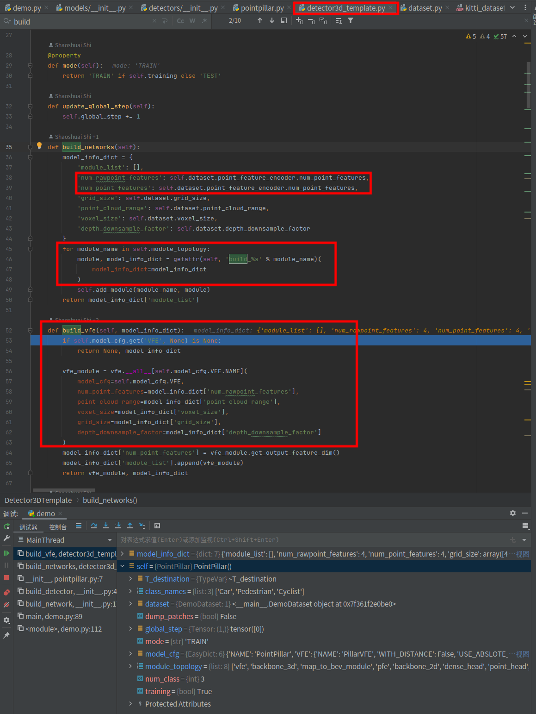

# 研究方向讨论 2023.1.9

### Q: 1.点云超分辨效果目前看来不如伪点云，点云超分辨还有没利用价值？  
 RE:原论文的超分辨结构简单，模型有可以改进的地方，比如原本超64线，先超到32线。  
原本的残差结构简单，后面可以尝试用gan，diffusion model进行超分辨以及超分辨策略的改进。  

### Q: 2.深度补全方向的论文和MVP的代码有没有必要了解？  
 RE:深度补全和MVP与伪雷达不冲突，深度补全也是用到点云+图像通过稀疏深度生成逐像素的深度信息，具体效果和pseudo lidar相比有没有优势，需要比较检测性能。  
### Q: 3.伪雷达和超分辨点云两套点云怎么结合？  
 RE: 而且超分辨虽然效果不如伪雷达，但是优势在于拥有360°，而伪雷达只有前视。  
此外原本的pseudo lidar++用的4线激光雷达进行伪雷达点云的矫正，需要做实验去尝试，16线，超分辨32线相比于4线到底能不能获得更好的效果和性能。  

### Q: 4.目前眼下工作不知道从哪里开始了
 RE:先得验证64线，16线，超分辨点云的检测性能，验证超分辨点云相对于16线点云确实有提升，然后去尝试pseudo lidar++融合伪雷达点云，之后再去考虑超分辨模型的改进等。  

补充：  
验证超分辨的可行性后，先搭建点云超分辨+前向点云融合+目标检测模块的全通路，然后调优  

深度估计500ms  深度估计转点云100ms  伪点云稀疏到64 50ms   
生成4Line点云50-100ms  矫正后的估计转点云2-3s  

# 动机
别人只用在虚拟场景，角度投影存在困难，稀疏，列补全，行补全暂时不能用，但后面实验只需要1线deepmap，训练用的虚拟的数据集

修改了图像超分辨的模型，不再是unet不再fpn，mit只是一个思路，gt16和输出在一起用反射率区分

分割边缘的优化

分类错误

==欺骗3d检测头==


# 后续

1. 统计2d分割到但是3d检测不到的结果
2. 什么样的点数和分布3d检测到的概率高，扔一个点云模型去抽样做实验，什么样的分布能欺骗到3d检查头
3. 怎么生成和防止虚拟的点云，深度补全，大模型深度估计和丢近距离的车点集合
4. 对比32线的检测指标
5. 关键就是怎么替换掉mvp的深度从近邻获得这个问题


# 研一下开学讨论
1. 师兄论文的了解翻译和完善，smartiot（2023.5）

2. 项目软件的基本框架的完成（2023.10.1） 

3. 研究方向思路还是不变，突破第一个点 

4. 下周去清华弄好结构光相机

   # 

# 总结
+ 心态上的改变，完成任务的心态变成找到最好的方法解决一个技术困难的问题    
+ 时间分配更加合理，能更加合理的安排每一天的时间，不会拖到很晚，在焦急的情况下是没有办法完成好任务的  
+ 对知识的系统性补充，比如操作系统，高并发处理，数据传输，数据结构等等支持的完善和补充  
+ 看论文更加有目的性  
+ 灵活变通的解决问题，一个方法解决不了问题不能死磕，多尝试其他方法  
+ 更高效的看论文和代码，知道哪些是值得细究的  
+ 方向思路清晰了
+ 框架的学习和模型的理解openpcd paddle cmake
+ 陌生词汇越来越少，经常在摘要看到看过的论文
+ 一段工作后的代码整理

# 工具
+ Cloudcompare  
+ 小绿鲸  
+ Deeplearning翻译  
+ 翻译deepl美式好一点
+ newbeing

# 资源备份图
  


# 提高性能，创新和改进，
## point2deepmap的问题
用周期计算行 
列漏掉的点暂时用周围的点补充

## Unet的超分辨 
超分辨网络有个缺点就是不管近远都是1024个点，所以远处就会稀疏  
水平分辨率比实际低了，去噪也使得水平分辨率变低 

点云去噪去离散的算法

训练参数在cuda:1,迁移时候在加载模型的时候加上map_location=‘cuda:0’  

## 别的超分辨网络
1. unet-pytorch  unet改的失败了
[unet](https://blog.csdn.net/qq_32545287/article/details/117228826?app_version=5.14.3&csdn_share_tail=%7B%22type%22%3A%22blog%22%2C%22rType%22%3A%22article%22%2C%22rId%22%3A%22117228826%22%2C%22source%22%3A%22weixin_52613221%22%7D&utm_source=app)
2. [超分辨综述](https://zhuanlan.zhihu.com/p/558561628) 
3. Fast, accurate, and lightweight super-resolution with cascading residual network（CARN）
4. ***CARN很成功***


## 3D目标检测中点云的稀疏性问题及解决方案
[3D目标检测中点云的稀疏性问题及解决方案](https://mp.weixin.qq.com/s?__biz=MzU2NjU3OTc5NA==&mid=2247562187&idx=2&sn=0e0d137b5fbf4b0808d8d459b1c22b17&chksm=fca9f4f6cbde7de097e1ad435fefec0ac00d45fe5f4befed2c3d4390fd8363e61704f5780312&scene=27)

# 未来部分

## ***【核心思想】***

> 是用2d的先验结果去进行下游分割和深度估计，想办法生成点云来欺骗（引导）3d检查模型来检测到一些底线束激光雷达原本不可能或者难以检测到的点

## 综述

### [三篇！2D+3D数据融合的目标检测算法近年代表作](https://mp.weixin.qq.com/s/zcaaLKJye80r5CyHdWpojQ)

### [当我们在讨论多模态融合时？我们究竟在讨论什么？最新多源融合综述！](https://mp.weixin.qq.com/s/scJktYpPPn90d5volDG1hA)

## 深度补全

### 收藏了两个底线束深度补全的论文思路，但是不开源

### [CompletionFormer](https://youmi-zym.github.io/projects/CompletionFormer/)

###   **[PENet_ICRA2021](https://github.com/JUGGHM/PENet_ICRA2021)**

## Faker

**直接置放近距离结构化很好的点云结构到远处（那都直接知道3d目标位置了**

伪雷达的结果并不能满足补充点给3d检

×  那个位置上，但是不知道方向啊 

 ×局部视差估计（Disp R-CNN）

 √ 车效果足够，先解决人，不考虑方向

## 朝向问题

### 遥遥领先！华为SOTA！无监督自适应3D目标检测！即将开源！

[高质量样本替换伪标签](https://mp.weixin.qq.com/s/FS93Hq7zTCxIWo1oHNazsg)

### Deep3DBox

[论文精度](https://blog.csdn.net/unbekannten/article/details/127992082)

[论文详解](https://zhuanlan.zhihu.com/p/414275118)

[github](https://github.com/skhadem/3D-BoundingBox)

### 利用单摄像机系统进行航向估计的车辆跟踪

[博客](https://blog.csdn.net/weixin_42825609/article/details/85984191) 

[论文](https://liu.diva-portal.org/smash/get/diva2:1216798/FULLTEXT01.pdf)


### [SMOKE](https://browse.arxiv.org/pdf/2002.10111.pdf)

### [EgoNet](https://github.com/Nicholasli1995/EgoNet)

### [部件估计航向角](https://www.mdpi.com/1424-8220/22/20/8027)


# pytorch部分
## 训练策略 OneCycleLR
[训练策略pytorch函数](https://blog.csdn.net/weiman1/article/details/125647517)
```python
scheduler = torch.optim.lr_scheduler.OneCycleLR(optimizer_nn, max_lr=0.1, pct_start=0.3, total_steps=121 * len(train_loader), div_factor=10, final_div_factor=1000)
```


## 模型的学习
### unet

```python
class UNet(nn.Module):
    def __init__(self, n_channels, n_classes, bilinear=False):
        super(UNet, self).__init__()
        self.n_channels = n_channels
        self.n_classes = n_classes
        self.bilinear = bilinear

        self.inc = DoubleConv(64, 64)

        self.up_1 = UP_h(n_channels, 64)
        self.up_2 = UP_h(64, 64)

        self.dbconv = DoubleConv(64, 64)

        self.down1 = Down(64, 128)
        self.down2 = Down(128, 256)
        self.down3 = Down(256, 512)
        factor = 2 if bilinear else 1
        self.down4 = Down(512, 1024 // factor)

        self.up1 = Up(1024, 512 // factor, bilinear)
        self.drop1 = nn.Dropout(dropout_rate)
        self.up2 = Up(512, 256 // factor, bilinear)
        self.drop2 = nn.Dropout(dropout_rate)
        self.up3 = Up(256, 128 // factor, bilinear)
        self.drop3 = nn.Dropout(dropout_rate)
        self.up4 = Up(128, 64, bilinear)
        self.outc = OutConv(64, n_classes)

    def forward(self, x):
        # 两次卷积,第一次卷积,第一次3维到64维,第二次64到64
        # x1 = self.inc(x)
        x = self.up_1(x) # 高度*2
        x1 = self.up_2(x) # 高度*2

        x1 = self.dbconv(x1) #  DoubleConv(64, 64)

        # 连续三次下采样 ，每次下采样都采取了maxpool和两次卷积，缩小了特征图宽高为1/2
        x2 = self.down1(x1)
        x3 = self.down2(x2)
        x4 = self.down3(x3)
        x5 = self.down4(x4)
        # 先把传入的特征图x上采样
        # 上采样使用blinear或者转置卷积扩大特征图宽高为两倍。
        # 然后把x和之前的图concat，最后再进行两次卷积。
        # 这样即可在逐步把特征图大小变回原图的同时，逐步缩小通道数为64。
        x = self.up1(x5, x4)
        self.drop1(x)
        x = self.up2(x, x3)
        self.drop2(x)
        x = self.up3(x, x2)
        self.drop3(x)
        x = self.up4(x, x1)
        # 1*1卷积，通道由64转为类别数，即每一个类别对应一个mask
        logits = self.outc(x)
        return logits
```
### MIT
```python

class UNet(nn.Module):
    # input的维度b*1*16*1024
    def __init__(self):
        super(UNet, self).__init__()

        self.upscaling = nn.Sequential(
            Up_Block(1, 64, strides=(2, 1)),
            Up_Block(64, 64, strides=(2, 1)),
        )
        # b*64_best*64_best*1024
        self.conv1 = Conv_Block(filters, filters)
        # b*64_best*64_best*1024
        self.conv2 = nn.Sequential(
            nn.AvgPool2d(2, 2),
            Conv_Block(filters, filters * 2)
        )
        self.conv3 = nn.Sequential(
            nn.AvgPool2d(2, 2),
            nn.Dropout(dropout_rate),
            Conv_Block(filters * 2, filters * 4)
        )
        self.conv4 = nn.Sequential(
            nn.AvgPool2d(2, 2),
            nn.Dropout(dropout_rate),
            Conv_Block(filters * 4, filters * 8)
        )
        self.center = nn.Sequential(
            nn.AvgPool2d(2, 2),
            nn.Dropout(dropout_rate),
            Conv_Block(filters * 8, filters * 16),
            nn.Dropout(dropout_rate),
            Up_Block(filters * 16, filters * 8, strides=(2, 2)),
        )
        # b* 64_best/8 * 1024/8 * 64_best * 8 concatenate  b* 64_best/8 * 1024/8 * 64_best * 8 = b* 64_best/8 * 1024/8 * 64_best * 16
        self.upblk3 = nn.Sequential(
            Conv_Block(filters * 16, filters * 8),
            nn.Dropout(dropout_rate),
            Up_Block(filters * 8, filters * 4, strides=(2, 2)),
        )

        self.upblk2 = nn.Sequential(
            Conv_Block(filters * 8, filters * 4),
            nn.Dropout(dropout_rate),
            Up_Block(filters * 4, filters * 2, strides=(2, 2)),
        )

        self.upblk1 = nn.Sequential(
            Conv_Block(filters * 4, filters * 2),
            Up_Block(filters * 2, filters, strides=(2, 2)),
        )

        self.end = nn.Sequential(
            Conv_Block(filters, filters),
            nn.Conv2d(filters, 1, (1, 1)),
        )

    def forward(self, x):
        x0 = self.upscaling(x)
        x1 = self.conv1(x0)
        x2 = self.conv2(x1)
        x3 = self.conv3(x2)
        x4 = self.conv4(x3)
        y4 = self.center(x4)

        y4 = torch.cat((x4, y4), dim=1)
        y3 = self.upblk3(y4)

        y3 = torch.cat((x3, y3), dim=1)
        y2 = self.upblk2(y3)

        y2 = torch.cat((x2, y2), dim=1)
        y1 = self.upblk1(y2)

        out = F.leaky_relu(self.end(y1))

        return out
```
### CARN图像超分辨
[上采样用的诸多方法的介绍](https://blog.csdn.net/djfjkj52/article/details/123829282)

### FasterRcnn


### Pointpiller
mmdet.ppt

### PVRCNN
[PVRCNN详解(个人阅读心得并总结其他人的结论得出的文章)](https://blog.csdn.net/qq_36380978/article/details/119940262)

### YOLOV7

### VirConv
https://github.com/hailanyi/VirConv

### persuade lidar

### MVP

### 稀疏卷积


# CARN2000+piller实验

## 角度计算线束和周期的不一致
角度不稳定所以不能用64线深度抽出16线

直接生成只有16行深度图才对，但是从最下面start0开始的周期和ang_2000_16line计算的比较一致  
这个ang16计算深度图时候用4倍角分辨率
```
def bag2np_ang2000(points_array, show_deep=False, show_point=False):
    """
    0.41 * (64 / 16)作为角度分辨率计算深度图
    Args:
        points_array:
        show_deep:
        show_point:

    Returns:

    """

    image_cols = 2000
    image_rows_high = 64
    ang_res_x = 360.0 / float(image_cols)  # horizontal resolution
    ang_res_y = 0.41 * (64 / 16)  # vertical resolution

    range_image = np.zeros((1, image_rows_full * image_cols, 1), dtype=np.float32)
    x = points_array[:, 0]
    y = points_array[:, 1]
    z = points_array[:, 2]

    print(z.shape)

    # find row id
    vertical_angle = np.arctan2(z, np.sqrt(x * x + y * y)) * 180.0 / np.pi
    relative_vertical_angle = vertical_angle - ang_start_y
    rowId = np.int_(np.round_(relative_vertical_angle / (ang_res_y)))  # ang_res_y是超分辨结果的分辨率所以要除以2
    print(rowId)

    # find column id
    horitontal_angle = np.arctan2(x, y) * 180.0 / np.pi
    colId = -np.int_((horitontal_angle - 90.0) / ang_res_x) + image_cols / 2
    shift_ids = np.where(colId >= image_cols)
    colId[shift_ids] = colId[shift_ids] - image_cols

    # filter range
    # thisRange = points_array[:, 3]
    thisRange = np.sqrt(x * x + y * y + z * z)
    # thisRange[thisRange > max_range] = 0
    # thisRange[thisRange < min_range] = 0

    # save full resolution image array
    for i in range(0, len(thisRange)):
        if rowId[i] < 0 or rowId[i] >= image_rows_full or colId[i] < 0 or colId[i] >= image_cols:
            continue
        range_image[0, int(rowId[i]) * image_cols + int(colId[i]), 0] = thisRange[i]

    # for i in range(0, image_rows_full * image_cols - 1):
    #     if (range_image[0, i, 0] == 0 and range_image[0, i + 1, 0] != 0):
    #         range_image[0, i, 0] = range_image[0, i + 1, 0]

    # append range image to array
    img64 = range_image.reshape(64, 2000)
    img16 = img64[0:16]
    if show_deep:
        plt.figure(figsize=(10, 20))
        plt.subplot(211), plt.imshow(img64), plt.title('depthmap0 ')
        plt.subplot(212), plt.imshow(img16), plt.title('depthmap0 ')
        plt.show()
    if show_point:
        result = np.zeros([32, image_cols, 2], dtype=np.float32)
        result[:, :, 0] = img64[::2]
        input = img16.reshape(16, 2000, 1)
        P = PointCloudProcessor_result(360.0 / float(image_cols), 0.41 * (64 / 32), ang_start_y)
        point = P.np2point(result, input, "000123.bin", height=-0, show_input=False, show_result=False, show_64=False)
    return img16
```


## CARN2000最好一次62,行周期计算
point-pillar:

```
predImagesNoiseReduced[noiseLabels > predImagesNoiseReduced * 0.005] = 0  # after noise removal
```


## 直接转换不超分辨也会降
用到了反射率和体素化，反射率都是0可能有影响，地面不一样高可能影响收敛，体素化可能使得超分辨只在视觉上得到提升，检测上提升一般

## 反射率影响
point-pillar:
 

反射率影响好像并不大，16线把反射率去掉了都没再训也有75,再训79.63


## 周期计算行影响
point-pillar:
  
周期计算行转换回来的点云2000直接送到gt16line训练的模型，只有24.4
  
高度差


  
角度计算行转换回来的点云1024直接送到gt16line训练的模型，有57.7  
原gt16line训练是行2000，按理周期计算应该高，结果低很多，说明角度计算比周期好很多

  
```
----------- AP40 Results ------------

Pedestrian AP40@0.50, 0.50, 0.50:
bbox AP40:54.9652, 50.4270, 46.8532
bev  AP40:58.9301, 52.6865, 48.2289
3d   AP40:51.5317, 45.6432, 41.4388
aos  AP40:28.36, 26.17, 24.35
Pedestrian AP40@0.50, 0.25, 0.25:
bbox AP40:54.9652, 50.4270, 46.8532
bev  AP40:68.9110, 63.6307, 58.4726
3d   AP40:68.8451, 62.7682, 58.2342
aos  AP40:28.36, 26.17, 24.35
Cyclist AP40@0.50, 0.50, 0.50:
bbox AP40:55.8868, 35.2096, 33.6444
bev  AP40:54.4287, 33.3619, 31.5689
3d   AP40:50.4376, 30.3831, 28.8137
aos  AP40:50.05, 31.31, 29.69
Cyclist AP40@0.50, 0.25, 0.25:
bbox AP40:55.8868, 35.2096, 33.6444
bev  AP40:56.9992, 35.7350, 34.3673
3d   AP40:56.9992, 35.7350, 34.3673
aos  AP40:50.05, 31.31, 29.69
Car AP40@0.70, 0.70, 0.70:
bbox AP40:93.9307, 80.5702, 78.3077
bev  AP40:88.4406, 76.6214, 72.8499
3d   AP40:79.3737, 62.1623, 59.4346
aos  AP40:93.18, 78.97, 76.11
Car AP40@0.70, 0.50, 0.50:
bbox AP40:93.9307, 80.5702, 78.3077
bev  AP40:94.8112, 86.0363, 83.8320
3d   AP40:94.7938, 85.4724, 81.5884
aos  AP40:93.18, 78.97, 76.11

Overall AP40@easy, moderate, hard:
bbox AP40:68.2609, 55.4023, 52.9351
bev  AP40:67.2665, 54.2233, 50.8826
3d   AP40:60.4477, 46.0629, 43.2290
aos  AP40:57.20, 45.48, 43.39
```
  
ang-2000-16line

##  原16线加入
point-pillar:


## 统计垂直角分辨率信息
无法统计，每一线的垂直角度波动很大，不是准确的0.41


## 16线和深度图对齐
16线点云从最低的一线开始每隔4线取一线
深度图
ang_res_y = 0.41 * (64 / image_rows_high)  # vertical resolution
ang_start_y = -23.8  # bottom beam angle
也比较准所以能对上
！！！！如果不是按照这样取，转换的深度图的ang_start_y = -23.8和16线的第一线就对不上，
因为16线的最低的一线必须要是64线的最低的一线，这样才能对的上


## 去除地面点云超分的点云-置信度跳到0.005，替换点云
  
保留16线原始的gt，添加点云效果比较好

## 保留原始地面16线，限制距离，添加点云
point-pillar:


# 半径滤波
半径滤波去掉异常点
[半径滤波](https://blog.csdn.net/sinounuo/article/details/126753848)
  

# MVP

## 电脑 mvp_kitti环境

```
(mvp_kitti) wangkai@wangkai-Legion-Y9000P-IAH7H:~$ pip list
Package                   Version
------------------------- ------------
absl-py                   1.4.0
addict                    2.4.0
angles                    1.9.13
ansi2html                 1.8.0
apptools                  5.2.1
argcomplete               3.1.1
asttokens                 2.2.1
attrs                     23.1.0
av                        10.0.0
av2                       0.2.1
backcall                  0.2.0
cachetools                5.3.1
catkin                    0.8.10
ccimport                  0.3.7
certifi                   2023.5.7
charset-normalizer        3.1.0
click                     8.1.4
colorlog                  6.7.0
comm                      0.1.3
ConfigArgParse            1.5.5
configobj                 5.0.8
contourpy                 1.1.0
cumm-cu111                0.2.9
cycler                    0.11.0
dash                      2.11.1
dash-core-components      2.0.0
dash-html-components      2.0.0
dash-table                5.0.0
debugpy                   1.6.7
decorator                 5.1.1
distlib                   0.3.6
easydict                  1.10
envisage                  7.0.3
executing                 1.2.0
fastjsonschema            2.17.1
filelock                  3.12.2
fire                      0.5.0
Flask                     2.2.5
fonttools                 4.40.0
gencpp                    0.7.0
geneus                    3.0.0
genlisp                   0.4.18
genmsg                    0.6.0
gennodejs                 2.0.2
genpy                     0.6.15
google-auth               2.22.0
google-auth-oauthlib      1.0.0
grpcio                    1.56.0
idna                      3.4
imageio                   2.31.1
importlib-metadata        6.7.0
importlib-resources       5.12.0
ipykernel                 6.24.0
ipython                   8.12.2
ipywidgets                8.0.7
itsdangerous              2.1.2
jedi                      0.18.2
Jinja2                    3.1.2
joblib                    1.3.1
jsonschema                4.18.0
jsonschema-specifications 2023.6.1
jupyter_client            8.3.0
jupyter_core              5.3.1
jupyterlab-widgets        3.0.8
kiwisolver                1.4.4
kornia                    0.6.1
lark                      1.1.5
lazy_loader               0.3
llvmlite                  0.40.1
Markdown                  3.4.3
markdown-it-py            3.0.0
MarkupSafe                2.1.3
matplotlib                3.7.2
matplotlib-inline         0.1.6
mayavi                    4.8.1
mdurl                     0.1.2
nbformat                  5.7.0
nest-asyncio              1.5.6
networkx                  3.1
ninja                     1.11.1
nox                       2023.4.22
numba                     0.57.1
numpy                     1.24.4
oauthlib                  3.2.2
open3d                    0.17.0           
opencv-python             4.1.2.30
packaging                 23.1
pandas                    2.0.3
parso                     0.8.3
pccm                      0.3.4
pexpect                   4.8.0
pickleshare               0.7.5
Pillow                    10.0.0
pip                       23.1.2
pkgutil_resolve_name      1.3.10
platformdirs              3.8.1
plotly                    5.15.0
portalocker               2.7.0
prompt-toolkit            3.0.39
protobuf                  4.23.4
psutil                    5.9.5
ptyprocess                0.7.0
pure-eval                 0.2.2
pyarrow                   12.0.1
pyasn1                    0.5.0
pyasn1-modules            0.3.0
pybind11                  2.10.4
pyface                    8.0.0
Pygments                  2.15.1
pyparsing                 3.0.9
pyproj                    3.5.0
pyquaternion              0.9.9
PySide2                   5.15.2.1
python-dateutil           2.8.2
python-qt-binding         0.4.4
pytz                      2023.3
PyWavelets                1.4.1
PyYAML                    6.0
pyzmq                     25.1.0
qt-dotgraph               0.4.2
qt-gui                    0.4.2
qt-gui-py-common          0.4.2
referencing               0.29.1
requests                  2.31.0
requests-oauthlib         1.3.1
retrying                  1.3.4
rich                      13.4.2
rosboost-cfg              1.15.8
rosclean                  1.15.8
rosgraph                  1.16.0
roslaunch                 1.16.0
roslib                    1.15.8
roslint                   0.12.0
roslz4                    1.16.0
rosmake                   1.15.8
rosmaster                 1.16.0
rosparam                  1.16.0
rosunit                   1.15.8
rpds-py                   0.8.8
rsa                       4.9
scikit-image              0.21.0
scikit-learn              1.3.0
scipy                     1.10.1
seaborn                   0.12.2
setuptools                59.5.0
SharedArray               3.2.2
shiboken2                 5.15.2.1
six                       1.16.0
smach                     2.5.2
smclib                    1.8.6
some-package              0.1
spconv-cu111              2.1.25
stack-data                0.6.2
tenacity                  8.2.2
tensorboard               2.13.0
tensorboard-data-server   0.7.1
tensorboardX              2.6.1
termcolor                 2.3.0
threadpoolctl             3.1.0
tifffile                  2023.7.4
torch                     1.9.0+cu111
torchvision               0.10.0+cu111
tornado                   6.3.2
tqdm                      4.65.0
traitlets                 5.9.0
traits                    6.4.1
traitsui                  8.0.0
typing_extensions         4.7.1
tzdata                    2023.3
urllib3                   1.26.16
virtualenv                20.23.1
vtk                       9.2.6
wcwidth                   0.2.6
Werkzeug                  2.2.3
wheel                     0.38.4
widgetsnbextension        4.0.8
zipp                      3.15.0

```


## 417 MVP 环境

```
Package                  Version            Editable project location
------------------------ ------------------ ----------------------------------
absl-py                  1.4.0
addict                   2.4.0
antlr4-python3-runtime   4.9.3
anyio                    3.6.2
appdirs                  1.4.4
argon2-cffi              21.3.0
argon2-cffi-bindings     21.2.0
arrow                    1.2.3
asttokens                2.2.1
attrs                    23.1.0
backcall                 0.2.0
beautifulsoup4           4.12.2
black                    21.4b2
bleach                   6.0.0
cachetools               5.3.0
ccimport                 0.4.2
certifi                  2023.5.7
cffi                     1.15.1
charset-normalizer       3.1.0
click                    8.1.3
cloudpickle              2.2.1
comm                     0.1.3
contourpy                1.0.7
cumm                     0.4.9
cycler                   0.11.0
debugpy                  1.6.7
decorator                5.1.1
defusedxml               0.7.1
descartes                1.1.0
detectron2               0.6+cu111
easydict                 1.10
executing                1.2.0
fastjsonschema           2.16.3
fire                     0.5.0
fonttools                4.39.4
fqdn                     1.5.1
future                   0.18.3
fvcore                   0.1.5.post20221221
google-auth              2.18.1
google-auth-oauthlib     1.0.0
graphviz                 0.20.1
grpcio                   1.54.2
hydra-core               1.3.2
idna                     3.4
imagecorruptions         1.1.2
imageio                  2.9.0
importlib-metadata       6.6.0
importlib-resources      5.12.0
iopath                   0.1.9
ipykernel                6.23.1
ipython                  8.12.2
ipython-genutils         0.2.0
ipywidgets               8.0.6
isoduration              20.11.0
jedi                     0.18.2
Jinja2                   3.1.2
joblib                   1.2.0
jsonpointer              2.3
jsonschema               4.17.3
jupyter                  1.0.0
jupyter_client           8.2.0
jupyter-console          6.6.3
jupyter_core             5.3.0
jupyter-events           0.6.3
jupyter_server           2.5.0
jupyter_server_terminals 0.4.4
jupyterlab-pygments      0.2.2
jupyterlab-widgets       3.0.7
kiwisolver               1.4.4
lark                     1.1.5
llvmlite                 0.40.0
Markdown                 3.4.3
MarkupSafe               2.1.2
matplotlib               3.7.1
matplotlib-inline        0.1.6
mistune                  2.0.5
motmetrics               1.1.3
mypy-extensions          1.0.0
nbclassic                1.0.0
nbclient                 0.7.4
nbconvert                7.4.0
nbformat                 5.8.0
nest-asyncio             1.5.6
networkx                 3.1
ninja                    1.11.1
notebook                 6.5.4
notebook_shim            0.2.3
numba                    0.57.0
numpy                    1.24.3
nuscenes-devkit          1.0.5
oauthlib                 3.2.2
objgraph                 3.5.0
omegaconf                2.3.0
open3d-python            0.3.0.0
opencv-contrib-python    4.7.0.72
opencv-python            4.7.0.72
packaging                23.1
pandas                   2.0.1
pandocfilters            1.5.0
parso                    0.8.3
pathspec                 0.11.1
pccm                     0.4.7
pcdet                    0.5.2+def78d7      /mnt/data02/WK/MVP_kitti/OpenPCDet
pexpect                  4.8.0
pickleshare              0.7.5
Pillow                   7.1.2
pip                      22.3.1
pkgutil_resolve_name     1.3.10
platformdirs             3.5.1
portalocker              2.7.0
prometheus-client        0.16.0
prompt-toolkit           3.0.38
protobuf                 3.20.3
psutil                   5.9.5
ptyprocess               0.7.0
pure-eval                0.2.2
pyasn1                   0.5.0
pyasn1-modules           0.3.0
pybind11                 2.10.4
pycocotools              2.0.6
pycparser                2.21
pydot                    1.4.2
Pygments                 2.15.1
pyparsing                3.0.9
pyquaternion             0.9.9
pyrsistent               0.19.3
pytest-runner            6.0.0
python-dateutil          2.8.2
python-json-logger       2.0.7
pytz                     2023.3
PyWavelets               1.4.1
PyYAML                   6.0
pyzmq                    25.0.2
qtconsole                5.4.3
QtPy                     2.3.1
regex                    2023.5.5
requests                 2.30.0
requests-oauthlib        1.3.1
rfc3339-validator        0.1.4
rfc3986-validator        0.1.1
rsa                      4.9
scikit-image             0.19.3
scikit-learn             1.2.2
scipy                    1.10.1
Send2Trash               1.8.2
setproctitle             1.3.3
setuptools               65.5.1
shapely                  2.0.1
SharedArray              3.2.2
six                      1.16.0
sniffio                  1.3.0
soupsieve                2.4.1
spconv                   2.3.6
stack-data               0.6.2
tabulate                 0.9.0
tensorboard              2.13.0
tensorboard-data-server  0.7.0
tensorboardX             2.6
termcolor                2.3.0
terminado                0.17.1
terminaltables           3.1.10
threadpoolctl            3.1.0
tifffile                 2023.4.12
tinycss2                 1.2.1
toml                     0.10.2
torch                    1.9.0+cu111
torchvision              0.10.0+cu111
tornado                  6.3.1
tqdm                     4.65.0
traitlets                5.9.0
typing_extensions        4.5.0
tzdata                   2023.3
uri-template             1.2.0
urllib3                  1.26.15
wcwidth                  0.2.6
webcolors                1.13
webencodings             0.5.1
websocket-client         1.5.1
Werkzeug                 2.3.4
wheel                    0.38.4
widgetsnbextension       4.0.7
yacs                     0.1.8
zipp                     3.15.0
```

```
(mvp) vip417@vip417-System-Product-Name:/mnt/data02/WK/MVP_kitti/OpenPCDet/tools$ pip list
Package                  Version            Editable project location
------------------------ ------------------ ----------------------------------
absl-py                  1.4.0
addict                   2.4.0
antlr4-python3-runtime   4.9.3
anyio                    3.6.2
appdirs                  1.4.4
argon2-cffi              21.3.0
argon2-cffi-bindings     21.2.0
arrow                    1.2.3
asttokens                2.2.1
attrs                    23.1.0
backcall                 0.2.0
beautifulsoup4           4.12.2
black                    21.4b2
bleach                   6.0.0
cachetools               5.3.0
ccimport                 0.4.2
certifi                  2023.5.7
cffi                     1.15.1
charset-normalizer       3.1.0
click                    8.1.3
cloudpickle              2.2.1
comm                     0.1.3
contourpy                1.0.7
cumm                     0.4.9
cumm-cu113               0.4.11
cycler                   0.11.0
debugpy                  1.6.7
decorator                5.1.1
defusedxml               0.7.1
descartes                1.1.0
detectron2               0.6+cu111
easydict                 1.10
executing                1.2.0
fastjsonschema           2.16.3
filelock                 3.13.1
fire                     0.5.0
fonttools                4.39.4
fqdn                     1.5.1
fsspec                   2024.2.0
future                   0.18.3
fvcore                   0.1.5.post20221221
google-auth              2.18.1
google-auth-oauthlib     1.0.0
graphviz                 0.20.1
grpcio                   1.54.2
huggingface-hub          0.20.3
hydra-core               1.3.2
idna                     3.4
imagecorruptions         1.1.2
imageio                  2.9.0
importlib-metadata       6.6.0
importlib-resources      5.12.0
iopath                   0.1.9
ipykernel                6.23.1
ipython                  8.12.2
ipython-genutils         0.2.0
ipywidgets               8.0.6
isoduration              20.11.0
jedi                     0.18.2
Jinja2                   3.1.2
joblib                   1.2.0
jsonpointer              2.3
jsonschema               4.17.3
jupyter                  1.0.0
jupyter_client           8.2.0
jupyter-console          6.6.3
jupyter_core             5.3.0
jupyter-events           0.6.3
jupyter_server           2.5.0
jupyter_server_terminals 0.4.4
jupyterlab-pygments      0.2.2
jupyterlab-widgets       3.0.7
kiwisolver               1.4.4
lark                     1.1.5
llvmlite                 0.40.0
Markdown                 3.4.3
MarkupSafe               2.1.2
matplotlib               3.7.1
matplotlib-inline        0.1.6
mistune                  2.0.5
motmetrics               1.1.3
mypy-extensions          1.0.0
nbclassic                1.0.0
nbclient                 0.7.4
nbconvert                7.4.0
nbformat                 5.8.0
nest-asyncio             1.5.6
networkx                 3.1
ninja                    1.11.1
notebook                 6.5.4
notebook_shim            0.2.3
numba                    0.57.0
numpy                    1.24.4
nuscenes-devkit          1.0.5
oauthlib                 3.2.2
objgraph                 3.5.0
omegaconf                2.3.0
open3d-python            0.3.0.0
opencv-contrib-python    4.7.0.72
opencv-python            4.7.0.72
packaging                23.1
pandas                   2.0.1
pandocfilters            1.5.0
parso                    0.8.3
pathspec                 0.11.1
pccm                     0.4.7
pcdet                    0.5.2+def78d7      /mnt/data02/WK/MVP_kitti/OpenPCDet
pexpect                  4.8.0
pickleshare              0.7.5
Pillow                   7.1.2
pip                      22.3.1
pkgutil_resolve_name     1.3.10
platformdirs             3.5.1
portalocker              2.7.0
prometheus-client        0.16.0
prompt-toolkit           3.0.38
protobuf                 3.20.3
psutil                   5.9.5
ptyprocess               0.7.0
pure-eval                0.2.2
pyasn1                   0.5.0
pyasn1-modules           0.3.0
pybind11                 2.10.4
pycocotools              2.0.6
pycparser                2.21
pydot                    1.4.2
Pygments                 2.15.1
pyparsing                3.0.9
pyquaternion             0.9.9
pyrsistent               0.19.3
pytest-runner            6.0.0
python-dateutil          2.8.2
python-json-logger       2.0.7
pytz                     2023.3
PyWavelets               1.4.1
PyYAML                   6.0
pyzmq                    25.0.2
qtconsole                5.4.3
QtPy                     2.3.1
regex                    2023.5.5
requests                 2.30.0
requests-oauthlib        1.3.1
rfc3339-validator        0.1.4
rfc3986-validator        0.1.1
rsa                      4.9
safetensors              0.4.2
scikit-image             0.19.3
scikit-learn             1.2.2
scipy                    1.10.1
Send2Trash               1.8.2
setproctitle             1.3.3
setuptools               65.5.1
shapely                  2.0.1
SharedArray              3.2.2
six                      1.16.0
sniffio                  1.3.0
soupsieve                2.4.1
spconv                   2.3.6
spconv-cu113             2.3.6
stack-data               0.6.2
tabulate                 0.9.0
tensorboard              2.13.0
tensorboard-data-server  0.7.0
tensorboardX             2.6
termcolor                2.3.0
terminado                0.17.1
terminaltables           3.1.10
threadpoolctl            3.1.0
tifffile                 2023.4.12
timm                     0.9.16
tinycss2                 1.2.1
toml                     0.10.2
torch                    1.9.0+cu111
torchvision              0.10.0+cu111
tornado                  6.3.1
tqdm                     4.65.0
traitlets                5.9.0
typing_extensions        4.5.0
tzdata                   2023.3
uri-template             1.2.0
urllib3                  1.26.15
wcwidth                  0.2.6
webcolors                1.13
webencodings             0.5.1
websocket-client         1.5.1
Werkzeug                 2.3.4
wheel                    0.38.4
widgetsnbextension       4.0.7
yacs                     0.1.8
zipp                     3.15.0
```

这个为什么占用那么大的显存

## 安装环境

- [先安装torch,需要1.9.0,1.8.0报错](https://blog.csdn.net/qq_55068938/article/details/121270986)


- [install detectron2](https://github.com/facebookresearch/detectron2/blob/main/INSTALL.md)
  


- [install centerpoint](https://github.com/tianweiy/CenterPoint/blob/master/docs/INSTALL.md)


- python virtual_gen.py

```
import sys
sys.path.append('/home/wangkai/mvp/')
sys.path.append('/home/wangkai/mvp/detectron2/')
sys.path.append('/home/wangkai/mvp/CenterNet2/')
sys.path
```

- 要按照cudnn再安装稀疏卷积
[install cudnn](https://blog.csdn.net/baobao135/article/details/126915105)

- [报错Failed to compute shorthash for libnvrtc.so](https://blog.csdn.net/xzq1207105685/article/details/117400187)

- [检查third_party/pybind11包中是否为空](https://blog.csdn.net/qq_38701106/article/details/120280777)

- 弄了半天还是不行, pip install spconv暂时没出问题

- [添加python路径](https://github.com/tianweiy/CenterPoint/blob/master/docs/INSTALL.md)
```
export PYTHONPATH=$PYTHONPATH:/mnt/data02/WK/CenterNet2
sys.path.append()√
```

- 生成info和pkl
```
python tools/create_data.py nuscenes_data_prep --root_path=data/nuScenes --version="v1.0-trainval" --nsweeps=10 --virtual False
```

.bashrc最后有一段改的有问题导致conda环境的python版本不对为3.6

编译openpcd

```
Using /home/vip417/.conda/envs/mvp/lib/python3.8/site-packages
Finished processing dependencies for pcdet==0.5.2+def78d7
(mvp) vip417@vip417-System-Product-Name:/mnt/data02/WK/MVP_kitti/OpenPCDet$ sudo python  setup.py develop
```


## [kitti+pillar环境配置](https://github.com/tianweiy/OpenPCDet/blob/master/VIRTUAL_KITTI.md)


安装openpcdet运行 ==python setup develop== 报错 ==RuntimeError: Error compiling objects for extension==
  

- **md权限问题！！** 
  sudo su
  ln -s /mnt/data01/WK/object_pcd kitti 

```
/home/vip417/.conda/envs/mvp_kitti/lib/python3.8
```


- **作者的MaskFormer缺少data文件夹,和configs**

```
(mvp_kitti) vip417@vip417-System-Product-Name:/mnt/data02/WK/MVP_kitti/OpenPCDet/MaskFormer1$ python demo/demo.py   --input ../data/kitti/training/image_2  --output ../data/kitti/training/seg_2/   MODEL.WEIGHTS model_final_7505c4.pkl
/mnt/data02/WK/MVP_kitti/OpenPCDet/MaskFormer1/demo/..
Traceback (most recent call last):
  File "demo/demo.py", line 27, in <module>
    from mask_former import add_mask_former_config
  File "/mnt/data02/WK/MVP_kitti/OpenPCDet/MaskFormer1/demo/../mask_former/__init__.py", line 2, in <module>
    from . import data  # register all new datasets
ImportError: cannot import name 'data' from partially initialized module 'mask_former' (most likely due to a circular import) (/mnt/data02/WK/MVP_kitti/OpenPCDet/MaskFormer1/demo/../mask_former/__init__.py)
```
[这里copy](https://github.com/facebookresearch/MaskFormer/tree/main/mask_former
)

- **命令错误**
```
python  demo/demo.py --config-file ./configs/ade20k-150/maskformer_R50_bs16_160k.yaml   --input ../data/kitti/training/image_2  --output ../data/kitti/training/seg_2/  --opts  MODEL.WEIGHTS model_final_7505c4.pkl

```


- **numpy版本报错**
AttributeError: module 'numpy' has no attribute 'bool'.  
python -m pip install numpy==1.23.1


- [类别写的不对](https://github.com/nightrome/cocostuff/blob/master/labels.md)
不是123，其实应该是012
  
0 行人    1 自行车    2 car
demo 需要保存的类别改为 if instance['category_id'] in [0, 1, 2, 3, 4]:

virtual_point.py也需要改类别判断这一块
```
ln -s /mnt/data01/WK/object_mit/training/16line/velodyne   /mnt/data01/WK/object_pcd/training/velodyne
```

- spconv和cumm版本冲突就全部卸掉装spconv

- scipy装低一点，报错python>=3.9

## cyclelist
```python

def create_cyclist(self, augmented_lidar):
    bike_idx = np.where(augmented_lidar[:, 5] >= 0.2)[0]  # 0, 1(bike), 2, 3(person)
    bike_points = augmented_lidar[bike_idx]

    cyclist_mask_total = np.zeros(augmented_lidar.shape[0], dtype=bool)
    # cyclist_mask_total 是一个所有点是不是cyclist的mask
    for i in range(bike_idx.shape[0]):
        cyclist_mask = (np.linalg.norm(augmented_lidar[:, :3] - bike_points[i, :3], axis=1) < 1) & (np.argmax(augmented_lidar[:, -4:], axis=1) == 3)
        # 对每个自行车点，判断所有点是人且距离改自行车点距离小于1的点为cyclist
        if np.sum(cyclist_mask) > 0:
            cyclist_mask_total |= cyclist_mask
            # 如果这个自行车点1米范围内有人，就增加cyclist_mask_total
        else:
            augmented_lidar[bike_idx[i], 4], augmented_lidar[bike_idx[i], 5] = augmented_lidar[bike_idx[i], 5], 0
            # 如果没有就剔除这个这个自行车点
    augmented_lidar[cyclist_mask_total, 7], augmented_lidar[cyclist_mask_total, 5] = 0, augmented_lidar[cyclist_mask_total, 7]
    # 最后把所有cyclist点变成bike点，这样附近没有人的bike变成了背景4，有车的person变成了bike
    return augmented_lidar

```

# openpcd + pillar学习和实验

## [数据预处理](https://blog.csdn.net/weixin_51021488/article/details/138211233)


## [openpcd训练和测试可视化命令](https://blog.csdn.net/AaaA00000001/article/details/127021967)


```
python test.py --cfg_file cfgs/kitti_models/virtual_pp.yaml --batch_size 4 --eval_all
```

```
python test.py --cfg_file cfgs/kitti_models/virtual_pp.yaml  --batch_size 8 --ckpt /mnt/data02/WK/MVP_kitti/OpenPCDet/output/kitti_models/virtual_pp/default/ckpt/checkpoint_epoch_80.pth
```

```
python test.py --cfg_file cfgs/kitti_models/virtual_pp.yaml  --batch_size 8 --ckpt /mnt/data02/WK/MVP_kitti/OpenPCDet/output/kitti_models/virtual_pp/default/ckpt/checkpoint_epoch_80.pth
```

```
python demo.py --cfg_file ./cfgs/kitti_models/pointpillar.yaml --ckpt      ../pth/pointpillar_7728.pth  --data_path /media/wangkai/MyPassport/dataset/kitti/object/training/velodyne/000008.bin
```

```
python  train.py --cfg_file cfgs/kitti_models/virtual_nopp.yaml
```


## 如何修改数据集

### [数据集处理](https://github.com/tianweiy/OpenPCDet/blob/master/VIRTUAL_KITTI.md)
  应该看python virtual_point.py，就是存在virtual文件夹里的npy文件

[Generate GT Database](http://www.wtld.cn/a/524318.html)用的==kitti_dataset_virtual.yaml==
就是==加了一个VIRTUAL: True== ，然后就用加载到了virtual里的np

  
[所以每次不用重新生成，只需要增加一个gt_database_super](https://blog.csdn.net/weixin_51021488/article/details/138211233),因为info只有点云的维度信息，但是dbinfo含有每个object内的点的信息

训练时候用的是virtual_pp.yaml,这里写了特征维度

```
python -m pcdet.datasets.kitti.kitti_dataset create_kitti_infos tools/cfgs/dataset_configs/kitti_dataset.yaml  

python -m pcdet.datasets.kitti.kitti_dataset_16line create_kitti_infos tools/cfgs/dataset_configs/kitti_dataset_.yaml  

 python -m pcdet.datasets.kitti.kitti_dataset_painting create_kitti_infos tools/cfgs/dataset_configs/kitti_dataset_virtual.yaml 
```


```

    def create_groundtruth_database(self, info_path=None, used_classes=None, split='train'):
        import torch
        if self.super_point and self.virtual_point:
            database_save_path = Path(self.root_path) / (
                'gt_database_faker_three_types' if split == 'train' else ('gt_database_faker_three_types_%s' % split))
            db_info_save_path = Path(self.root_path) / ('kitti_dbinfos_faker_three_types_%s.pkl' % split)
        elif self.virtual_point:
            database_save_path = Path(self.root_path) / (
                'gt_database_virtual' if split == 'train' else ('gt_database_virtual_%s' % split))
            db_info_save_path = Path(self.root_path) / ('kitti_dbinfos_virtual_%s.pkl' % split)
        elif self.super_point:
            database_save_path = Path(self.root_path) / (
                'gt_database_super' if split == 'train' else ('gt_database_super_%s' % split))
            db_info_save_path = Path(self.root_path) / ('kitti_dbinfos_super_%s.pkl' % split)
        else:
            database_save_path = Path(self.root_path) / (
                'gt_database' if split == 'train' else ('gt_database_%s' % split))
            db_info_save_path = Path(self.root_path) / ('kitti_dbinfos_%s.pkl' % split)

        database_save_path.mkdir(parents=True, exist_ok=True)
        all_db_infos = {}

        with open(info_path, 'rb') as f:
            infos = pickle.load(f)

        for k in range(len(infos)):
            print('gt_database sample: %d/%d' % (k + 1, len(infos)))
            info = infos[k]
            sample_idx = info['point_cloud']['lidar_idx']
            points = self.get_lidar(sample_idx)
            annos = info['annos']
            names = annos['name']
            difficulty = annos['difficulty']
            bbox = annos['bbox']
            gt_boxes = annos['gt_boxes_lidar']

            num_obj = gt_boxes.shape[0]
            point_indices = roiaware_pool3d_utils.points_in_boxes_cpu(
                torch.from_numpy(points[:, 0:3]), torch.from_numpy(gt_boxes)
            ).numpy()  # (nboxes, npoints)

            for i in range(num_obj):
                filename = '%s_%s_%d.bin' % (sample_idx, names[i], i)
                filepath = database_save_path / filename
                gt_points = points[point_indices[i] > 0]

                gt_points[:, :3] -= gt_boxes[i, :3]
                with open(filepath, 'w') as f:
                    gt_points.astype(np.float32).tofile(f)

                if (used_classes is None) or names[i] in used_classes:
                    db_path = str(filepath.relative_to(self.root_path))  # gt_database/xxxxx.bin
                    db_info = {'name': names[i], 'path': db_path, 'image_idx': sample_idx, 'gt_idx': i,
                               'box3d_lidar': gt_boxes[i], 'num_points_in_gt': gt_points.shape[0],
                               'difficulty': difficulty[i], 'bbox': bbox[i], 'score': annos['score'][i]}
                    if names[i] in all_db_infos:
                        all_db_infos[names[i]].append(db_info)
                    else:
                        all_db_infos[names[i]] = [db_info]
        for k, v in all_db_infos.items():
            print('Database %s: %d' % (k, len(v)))

        with open(db_info_save_path, 'wb') as f:
            pickle.dump(all_db_infos, f)
```


```python
def create_kitti_infos(dataset_cfg, class_names, data_path, save_path, workers=4):
    dataset = KittiDataset(dataset_cfg=dataset_cfg, class_names=class_names, root_path=data_path, training=False)
    train_split, val_split = 'train', 'val'

    train_filename = save_path / ('kitti_infos_%s.pkl' % train_split)
    val_filename = save_path / ('kitti_infos_%s.pkl' % val_split)
    trainval_filename = save_path / 'kitti_infos_trainval.pkl'
    test_filename = save_path / 'kitti_infos_test.pkl'

    print('---------------Start to generate data infos---------------')

    # dataset.set_split(train_split)
    # kitti_infos_train = dataset.get_infos(num_workers=workers, has_label=True, count_inside_pts=True)
    # with open(train_filename, 'wb') as f:
    #     pickle.dump(kitti_infos_train, f)
    # print('Kitti info train file is saved to %s' % train_filename)

    # dataset.set_split(val_split)
    # kitti_infos_val = dataset.get_infos(num_workers=workers, has_label=True, count_inside_pts=True)
    # with open(val_filename, 'wb') as f:
    #     pickle.dump(kitti_infos_val, f)
    # print('Kitti info val file is saved to %s' % val_filename)

    # with open(trainval_filename, 'wb') as f:
    #     pickle.dump(kitti_infos_train + kitti_infos_val, f)
    # print('Kitti info trainval file is saved to %s' % trainval_filename)

    # dataset.set_split('test')
    # kitti_infos_test = dataset.get_infos(num_workers=workers, has_label=False, count_inside_pts=False)
    # with open(test_filename, 'wb') as f:
    #     pickle.dump(kitti_infos_test, f)
    # print('Kitti info test file is saved to %s' % test_filename)

    print('---------------Start create groundtruth database for data augmentation---------------')
    dataset.set_split(train_split)
    dataset.create_groundtruth_database(train_filename, split=train_split)

    print('---------------Data preparation Done---------------')

# python -m pcdet.datasets.kitti.kitti_dataset create_kitti_infos tools/cfgs/dataset_configs/kitti_dataset_super.yaml
```


### pcdet.datasets.kitti.kitti_dataset_virtual在generate gt base 的时候判断了vitrual，

  
判断是否是virtual采取不同的generate gt base，加载的点是分为

- points :不在mask内的点
- painted_points： mask内的点
- virtual_points： mask内生成的虚拟点


### 为什么只改kitti_dataset.yaml，不改model,怎么影响的VFE的输入通道
build_networks(self)里会传入datesets，
  


### 修改模型cfgs.kitti_models.pointpillar.yaml 里的DATA_CONFIG

  
</p></p>


### build_dataloader:怎么读的

训练时候用的build_dataloader和demo的DemoDataset(DatasetTemplate)应该不太一样，
==DemoDataset(DatasetTemplate)是直接读文件==
    

- 默认ext='.bin'
- input_dict = 
      {
          'points': points,
          'frame_id': index,
      }

- __getitem__还有一个prepare_data(self, data_dict):

==build_dataloader也用的kitti_dataset_virtual==
==修改from .kitti.kitti_dataset_virtual import KittiDataset==
  

# getattr函数   可以通过字符串获得属性和函数地址！


# MVP基础加入super


## 实验对比
### kitti原始64 + virtual
```
bbox AP:90.6905, 89.2534, 87.8968
bev  AP:89.7958, 86.2837, 83.6992
3d   AP:85.6585, 75.8901, 72.2938
aos  AP:90.67, 89.04, 87.51
Car AP_R40@0.70, 0.70, 0.70:
bbox AP:95.3288, 91.7341, 89.0578
bev  AP:92.1399, 87.7432, 85.0293
3d   AP:87.3420, 75.8324, 72.5677  ************
aos  AP:95.30, 91.50, 88.66
Car AP@0.70, 0.50, 0.50:
bbox AP:90.6905, 89.2534, 87.8968
bev  AP:90.7325, 89.9729, 89.1419
3d   AP:90.7291, 89.8804, 88.9123
aos  AP:90.67, 89.04, 87.51
Car AP_R40@0.70, 0.50, 0.50:
bbox AP:95.3288, 91.7341, 89.0578
bev  AP:95.4914, 94.5827, 93.6327
3d   AP:95.4451, 94.3205, 91.7040
aos  AP:95.30, 91.50, 88.66
Pedestrian AP@0.50, 0.50, 0.50:
bbox AP:68.0529, 61.2444, 59.5083
bev  AP:57.5126, 51.2780, 48.2355
3d   AP:53.0278, 46.0313, 42.3331
aos  AP:47.50, 43.01, 41.67
Pedestrian AP_R40@0.50, 0.50, 0.50:
bbox AP:68.1809, 61.4434, 58.5954
bev  AP:56.5863, 49.8425, 46.4585
3d   AP:51.1130, 44.3708, 40.1632 ************
aos  AP:44.93, 40.28, 38.25
Pedestrian AP@0.50, 0.25, 0.25:
bbox AP:68.0529, 61.2444, 59.5083
bev  AP:72.7961, 67.0863, 64.6185
3d   AP:72.7756, 66.9351, 64.3635
aos  AP:47.50, 43.01, 41.67
Pedestrian AP_R40@0.50, 0.25, 0.25:
bbox AP:68.1809, 61.4434, 58.5954
bev  AP:74.2367, 67.4557, 64.9048
3d   AP:74.2131, 67.2184, 64.3955
aos  AP:44.93, 40.28, 38.25
Cyclist AP@0.50, 0.50, 0.50:
bbox AP:82.3312, 69.8227, 65.7825
bev  AP:77.8677, 63.4685, 60.0145
3d   AP:75.8039, 60.1043, 56.6438
aos  AP:80.06, 62.81, 58.83
Cyclist AP_R40@0.50, 0.50, 0.50:
bbox AP:84.9182, 69.9721, 66.3646
bev  AP:79.0493, 63.5037, 59.6666
3d   AP:76.3536, 59.8991, 55.8068 ************
aos  AP:82.33, 62.06, 58.69
Cyclist AP@0.50, 0.25, 0.25:
bbox AP:82.3312, 69.8227, 65.7825
bev  AP:82.6588, 68.3457, 64.8437
3d   AP:82.6582, 68.3428, 64.7657
aos  AP:80.06, 62.81, 58.83
Cyclist AP_R40@0.50, 0.25, 0.25:
bbox AP:84.9182, 69.9721, 66.3646
bev  AP:85.2944, 68.8181, 65.0646
3d   AP:85.2901, 68.8137, 64.8847
aos  AP:82.33, 62.06, 58.69
```

### kitti原始64


### kitti原始16+rfilp+virtual
```
Car AP@0.70, 0.70, 0.70:
bbox AP:90.3996, 82.6193, 78.7000
bev  AP:88.9541, 77.5602, 73.0596
3d   AP:79.1604, 63.9850, 58.2734
aos  AP:89.84, 80.85, 76.58
Car AP_R40@0.70, 0.70, 0.70:
bbox AP:94.6761, 84.4726, 80.1437
bev  AP:90.9981, 78.4279, 74.0563
3d   AP:80.4217, 63.5226, 58.7789 ************
aos  AP:94.01, 82.54, 77.82
Car AP@0.70, 0.50, 0.50:
bbox AP:90.3996, 82.6193, 78.7000
bev  AP:90.6296, 87.8011, 83.5943
3d   AP:90.5987, 86.4058, 80.0468
aos  AP:89.84, 80.85, 76.58
Car AP_R40@0.70, 0.50, 0.50:
bbox AP:94.6761, 84.4726, 80.1437
bev  AP:95.2432, 88.7005, 85.6668
3d   AP:95.1594, 88.0129, 83.3920
aos  AP:94.01, 82.54, 77.82
Pedestrian AP@0.50, 0.50, 0.50:
bbox AP:67.1344, 59.9344, 56.6046
bev  AP:59.2003, 51.5405, 47.7387
3d   AP:50.6916, 43.7126, 40.3336
aos  AP:42.61, 39.05, 37.06
Pedestrian AP_R40@0.50, 0.50, 0.50:
bbox AP:67.5681, 59.8542, 56.1512
bev  AP:58.4409, 49.8543, 45.7333
3d   AP:49.7188, 41.9031, 37.5513 ************
aos  AP:39.18, 35.48, 33.22
Pedestrian AP@0.50, 0.25, 0.25:
bbox AP:67.1344, 59.9344, 56.6046
bev  AP:75.3479, 68.0149, 64.6071
3d   AP:75.2930, 67.6442, 64.2388
aos  AP:42.61, 39.05, 37.06
Pedestrian AP_R40@0.50, 0.25, 0.25:
bbox AP:67.5681, 59.8542, 56.1512
bev  AP:76.6042, 68.7363, 64.6829
3d   AP:76.5023, 68.4180, 64.3112
aos  AP:39.18, 35.48, 33.22
Cyclist AP@0.50, 0.50, 0.50:
bbox AP:72.2789, 55.4302, 52.9118
bev  AP:62.4349, 46.2741, 43.4798
3d   AP:57.3318, 38.9882, 37.1904
aos  AP:65.87, 46.56, 44.46
Cyclist AP_R40@0.50, 0.50, 0.50:
bbox AP:73.0370, 55.0273, 51.5513
bev  AP:62.4911, 44.3902, 41.1309
3d   AP:56.4964, 36.5934, 34.0861 ************
aos  AP:66.18, 44.73, 41.99
Cyclist AP@0.50, 0.25, 0.25:
bbox AP:72.2789, 55.4302, 52.9118
bev  AP:71.9371, 54.6554, 51.8317
3d   AP:71.9371, 54.6554, 51.7844
aos  AP:65.87, 46.56, 44.46
Cyclist AP_R40@0.50, 0.25, 0.25:
bbox AP:73.0370, 55.0273, 51.5513
bev  AP:73.0957, 53.9778, 50.8561
3d   AP:73.0957, 53.9773, 50.8426
aos  AP:66.18, 44.73, 41.99

```

### kitti原始16+rfilp
```
Car AP@0.70, 0.70, 0.70:
bbox AP:89.6292, 77.6680, 73.4923
bev  AP:88.4435, 76.9706, 72.3083
3d   AP:76.2803, 60.3018, 56.8495
aos  AP:88.97, 76.36, 71.96
Car AP_R40@0.70, 0.70, 0.70:
bbox AP:91.6308, 78.3814, 75.1513
bev  AP:90.0847, 77.5918, 73.5142
3d   AP:78.1654, 59.8451, 55.6553 ************
aos  AP:90.94, 77.00, 73.44
Car AP@0.70, 0.50, 0.50:
bbox AP:89.6292, 77.6680, 73.4923
bev  AP:90.3945, 85.2291, 82.2168
3d   AP:90.3251, 82.1819, 78.9448
aos  AP:88.97, 76.36, 71.96
Car AP_R40@0.70, 0.50, 0.50:
bbox AP:91.6308, 78.3814, 75.1513
bev  AP:94.4648, 86.9591, 84.0629
3d   AP:94.2295, 84.5617, 81.4931
aos  AP:90.94, 77.00, 73.44
Pedestrian AP@0.50, 0.50, 0.50:
bbox AP:54.7077, 50.8819, 47.8641
bev  AP:49.7276, 45.2151, 41.8345
3d   AP:40.9646, 37.6603, 34.2208
aos  AP:34.20, 31.81, 29.55
Pedestrian AP_R40@0.50, 0.50, 0.50:
bbox AP:54.0656, 49.5850, 46.4600
bev  AP:48.3966, 43.4495, 39.7598
3d   AP:39.1153, 35.2051, 30.9113 ************
aos  AP:33.26, 30.28, 28.07
Pedestrian AP@0.50, 0.25, 0.25:
bbox AP:54.7077, 50.8819, 47.8641 
bev  AP:61.1623, 57.5896, 54.5882
3d   AP:61.0690, 57.3283, 54.3335
aos  AP:34.20, 31.81, 29.55
Pedestrian AP_R40@0.50, 0.25, 0.25:
bbox AP:54.0656, 49.5850, 46.4600
bev  AP:61.3350, 57.0615, 53.8937
3d   AP:61.2221, 56.8114, 53.6194
aos  AP:33.26, 30.28, 28.07
Cyclist AP@0.50, 0.50, 0.50:
bbox AP:64.7971, 46.1762, 43.3140
bev  AP:58.4276, 41.3437, 38.2616
3d   AP:55.4779, 37.4403, 34.7981
aos  AP:62.12, 43.07, 40.40
Cyclist AP_R40@0.50, 0.50, 0.50:
bbox AP:65.1395, 44.6145, 41.6402
bev  AP:58.3030, 39.1393, 36.3549
3d   AP:54.5327, 34.7622, 32.1868 ************
aos  AP:62.21, 41.28, 38.45
Cyclist AP@0.50, 0.25, 0.25:
bbox AP:64.7971, 46.1762, 43.3140
bev  AP:64.5428, 46.1677, 42.9811
3d   AP:64.5428, 46.1677, 42.9811
aos  AP:62.12, 43.07, 40.40
Cyclist AP_R40@0.50, 0.25, 0.25:
bbox AP:65.1395, 44.6145, 41.6402
bev  AP:64.7173, 44.4832, 41.2421
3d   AP:64.7173, 44.4589, 41.2419
aos  AP:62.21, 41.28, 38.45
```

### kitti原始32

```
  warn(NumbaPerformanceWarning(msg))
2023-12-29 14:26:25,596   INFO  Car AP@0.70, 0.70, 0.70:
bbox AP:90.5615, 85.5939, 83.1282
bev  AP:89.7673, 82.2739, 78.9670
3d   AP:81.8761, 68.2466, 66.5795
aos  AP:90.36, 84.81, 82.11
Car AP_R40@0.70, 0.70, 0.70:
bbox AP:95.2184, 87.5757, 85.0571
bev  AP:92.2048, 84.8515, 82.0334
3d   AP:84.1134, 69.9920, 66.6408    ************
aos  AP:94.98, 86.72, 83.95
Car AP@0.70, 0.50, 0.50:
bbox AP:90.5615, 85.5939, 83.1282
bev  AP:90.6631, 89.1545, 88.1592
3d   AP:90.6598, 88.8759, 87.5608
aos  AP:90.36, 84.81, 82.11
Car AP_R40@0.70, 0.50, 0.50:
bbox AP:95.2184, 87.5757, 85.0571
bev  AP:95.4857, 92.5625, 90.5280
3d   AP:95.4447, 91.0543, 88.4607
aos  AP:94.98, 86.72, 83.95
Pedestrian AP@0.50, 0.50, 0.50:
bbox AP:60.3755, 55.6453, 52.6635
bev  AP:55.5366, 49.6441, 45.5428
3d   AP:48.3161, 42.8533, 38.4960
aos  AP:42.29, 39.27, 37.15
Pedestrian AP_R40@0.50, 0.50, 0.50:
bbox AP:59.6682, 55.2628, 51.7502
bev  AP:54.7867, 47.9203, 43.6505
3d   AP:46.6211, 40.3363, 35.8638    ************
aos  AP:39.05, 36.04, 33.30
Pedestrian AP@0.50, 0.25, 0.25:
bbox AP:60.3755, 55.6453, 52.6635
bev  AP:67.2656, 63.8193, 60.2769
3d   AP:67.2257, 63.2354, 60.1474
aos  AP:42.29, 39.27, 37.15
Pedestrian AP_R40@0.50, 0.25, 0.25:
bbox AP:59.6682, 55.2628, 51.7502
bev  AP:68.3687, 63.8166, 59.9923
3d   AP:68.3292, 63.4648, 59.6476
aos  AP:39.05, 36.04, 33.30
Cyclist AP@0.50, 0.50, 0.50:
bbox AP:77.1073, 61.1952, 58.3693
bev  AP:74.3868, 56.5221, 52.5496
3d   AP:69.4034, 52.0021, 49.0856
aos  AP:74.18, 57.63, 54.75
Cyclist AP_R40@0.50, 0.50, 0.50:
bbox AP:78.5627, 61.6062, 58.1465
bev  AP:75.6095, 55.9115, 51.8616
3d   AP:70.6937, 51.1830, 47.5463    ************
aos  AP:75.39, 57.50, 54.18
Cyclist AP@0.50, 0.25, 0.25:
bbox AP:77.1073, 61.1952, 58.3693
bev  AP:77.9465, 60.9946, 57.3640
3d   AP:77.9369, 60.9863, 57.2889
aos  AP:74.18, 57.63, 54.75
Cyclist AP_R40@0.50, 0.25, 0.25:
bbox AP:78.5627, 61.6062, 58.1465
bev  AP:79.6291, 60.9236, 57.3264
3d   AP:79.6245, 60.9180, 57.2035
aos  AP:75.39, 57.50, 54.18

2023-12-29 14:26:25,604   INFO  Result is save to /mnt/data02/WK/MVP_kitti/OpenPCDet/output/kitti_models/pointpillar/32line/eval/eval_with_train/epoch_60/val
```


### kitti原始16

```
Car AP@0.70, 0.70, 0.70:
bbox AP:89.7860, 78.1916, 75.3280
bev  AP:88.8109, 77.1720, 72.5140
3d   AP:76.4228, 60.4817, 57.2593
aos  AP:89.14, 76.86, 73.62
Car AP_R40@0.70, 0.70, 0.70:
bbox AP:92.5429, 79.1238, 76.1377
bev  AP:90.6017, 77.9045, 74.0014
3d   AP:77.8157, 60.3544, 56.1630     ************
aos  AP:91.85, 77.69, 74.32
Car AP@0.70, 0.50, 0.50:
bbox AP:89.7860, 78.1916, 75.3280
bev  AP:90.4057, 85.5350, 82.4617
3d   AP:90.3146, 82.3021, 79.2095
aos  AP:89.14, 76.86, 73.62
Car AP_R40@0.70, 0.50, 0.50:
bbox AP:92.5429, 79.1238, 76.1377
bev  AP:94.6279, 87.1291, 84.4293
3d   AP:94.4628, 84.8444, 81.9479
aos  AP:91.85, 77.69, 74.32
Pedestrian AP@0.50, 0.50, 0.50:
bbox AP:56.4000, 51.0259, 47.7765
bev  AP:51.5145, 45.7446, 41.7889
3d   AP:41.7408, 37.4778, 34.1247
aos  AP:32.73, 29.59, 27.79
Pedestrian AP_R40@0.50, 0.50, 0.50:
bbox AP:55.4268, 49.5492, 46.2776
bev  AP:50.2293, 43.5608, 39.3852
3d   AP:39.5884, 34.3200, 30.7191 ************
aos  AP:32.27, 28.83, 26.91
Pedestrian AP@0.50, 0.25, 0.25:
bbox AP:56.4000, 51.0259, 47.7765
bev  AP:62.5601, 57.6745, 54.7044
3d   AP:62.5097, 57.3391, 54.4997
aos  AP:32.73, 29.59, 27.79
Pedestrian AP_R40@0.50, 0.25, 0.25:
bbox AP:55.4268, 49.5492, 46.2776
bev  AP:62.3600, 57.1327, 53.7009
3d   AP:62.3081, 56.7274, 53.4189
aos  AP:32.27, 28.83, 26.91
Cyclist AP@0.50, 0.50, 0.50:
bbox AP:62.2239, 46.0399, 42.9187
bev  AP:58.3314, 42.1378, 39.7718
3d   AP:54.7629, 38.5709, 35.2036
aos  AP:58.95, 41.75, 38.97
Cyclist AP_R40@0.50, 0.50, 0.50:
bbox AP:62.0038, 44.2289, 40.9524
bev  AP:58.3023, 40.4404, 37.2508
3d   AP:54.2331, 35.6607, 32.8664 ************
aos  AP:58.69, 39.42, 36.52
Cyclist AP@0.50, 0.25, 0.25:
bbox AP:62.2239, 46.0399, 42.9187
bev  AP:62.1927, 46.3467, 43.3485
3d   AP:62.1909, 46.3294, 43.3283
aos  AP:58.95, 41.75, 38.97
Cyclist AP_R40@0.50, 0.25, 0.25:
bbox AP:62.0038, 44.2289, 40.9524
bev  AP:61.9022, 44.8511, 41.2842
3d   AP:61.8997, 44.7851, 41.2494
aos  AP:58.69, 39.42, 36.52


```

### kitti原始16-2

```
Car AP@0.70, 0.70, 0.70:
bbox AP:89.8764, 78.3315, 75.1384
bev  AP:88.0538, 77.2009, 72.4352
3d   AP:75.7144, 58.5193, 56.7099
aos  AP:89.23, 77.00, 73.54
Car AP_R40@0.70, 0.70, 0.70:
bbox AP:91.8763, 79.2404, 76.1455
bev  AP:89.4547, 78.0033, 73.8773
3d   AP:76.4769, 59.0749, 55.4050************
aos  AP:91.18, 77.82, 74.43
Car AP@0.70, 0.50, 0.50:
bbox AP:89.8764, 78.3315, 75.1384
bev  AP:90.4393, 85.1445, 82.4036
3d   AP:90.3951, 82.2101, 79.1610
aos  AP:89.23, 77.00, 73.54
Car AP_R40@0.70, 0.50, 0.50:
bbox AP:91.8763, 79.2404, 76.1455
bev  AP:94.5267, 86.8974, 84.1902
3d   AP:94.3563, 84.6366, 81.7611 
aos  AP:91.18, 77.82, 74.43
Pedestrian AP@0.50, 0.50, 0.50:
bbox AP:56.4387, 51.4438, 48.4790
bev  AP:51.1760, 45.7126, 42.2634
3d   AP:42.2988, 37.4763, 33.9319
aos  AP:35.65, 32.52, 30.26
Pedestrian AP_R40@0.50, 0.50, 0.50:
bbox AP:55.9991, 50.3990, 47.0465
bev  AP:50.4035, 44.1459, 39.9375
3d   AP:39.9286, 34.6955, 30.8529 ************
aos  AP:35.04, 31.49, 29.23
Pedestrian AP@0.50, 0.25, 0.25:
bbox AP:56.4387, 51.4438, 48.4790
bev  AP:62.8878, 58.5034, 54.8059
3d   AP:62.7990, 58.2511, 54.5621
aos  AP:35.65, 32.52, 30.26
Pedestrian AP_R40@0.50, 0.25, 0.25:
bbox AP:55.9991, 50.3990, 47.0465
bev  AP:63.1002, 57.7396, 54.1590
3d   AP:63.0103, 57.4793, 53.8779
aos  AP:35.04, 31.49, 29.23
Cyclist AP@0.50, 0.50, 0.50:
bbox AP:61.6969, 45.0189, 42.2039
bev  AP:56.3537, 39.7284, 37.4462
3d   AP:52.7276, 36.2461, 34.0424
aos  AP:58.90, 41.23, 38.57
Cyclist AP_R40@0.50, 0.50, 0.50: 
bbox AP:61.2639, 43.2717, 40.1832
bev  AP:55.2513, 37.4170, 34.7807
3d   AP:50.8057, 33.2026, 30.7891************
aos  AP:58.26, 38.89, 36.08
Cyclist AP@0.50, 0.25, 0.25:
bbox AP:61.6969, 45.0189, 42.2039
bev  AP:61.3595, 45.1105, 42.1742
3d   AP:61.3589, 45.0716, 42.1728
aos  AP:58.90, 41.23, 38.57
Cyclist AP_R40@0.50, 0.25, 0.25:
bbox AP:61.2639, 43.2717, 40.1832
bev  AP:60.9626, 43.4146, 40.2259
3d   AP:60.9615, 43.3083, 40.1695
aos  AP:58.26, 38.89, 36.08
```


### kitti原始16+virtual

```
Car AP@0.70, 0.70, 0.70:
bbox AP:90.3233, 82.6479, 78.6543
bev  AP:89.0964, 78.2936, 73.2440
3d   AP:77.3680, 61.6291, 58.1955
aos  AP:89.49, 80.80, 76.42
Car AP_R40@0.70, 0.70, 0.70:
bbox AP:94.4849, 84.4728, 80.1118
bev  AP:91.0001, 79.3703, 74.5600
3d   AP:79.9252, 62.3676, 58.1970  ************
aos  AP:93.53, 82.46, 77.66
Car AP@0.70, 0.50, 0.50:
bbox AP:90.3233, 82.6479, 78.6543
bev  AP:90.6378, 87.9820, 83.6968
3d   AP:90.6277, 86.7719, 83.3604
aos  AP:89.49, 80.80, 76.42
Car AP_R40@0.70, 0.50, 0.50:
bbox AP:94.4849, 84.4728, 80.1118
bev  AP:95.1172, 89.5656, 85.7651
3d   AP:95.0674, 88.2031, 84.8187
aos  AP:93.53, 82.46, 77.66
Pedestrian AP@0.50, 0.50, 0.50:
bbox AP:65.4171, 58.9011, 55.6024
bev  AP:58.3085, 51.5175, 48.0005
3d   AP:49.5224, 42.6133, 39.7695
aos  AP:38.60, 35.08, 32.85
Pedestrian AP_R40@0.50, 0.50, 0.50:
bbox AP:65.7086, 58.5387, 55.0050
bev  AP:57.3959, 50.3036, 46.0609
3d   AP:48.1353, 40.8633, 36.5068 ************
aos  AP:38.36, 34.43, 32.13
Pedestrian AP@0.50, 0.25, 0.25:
bbox AP:65.4171, 58.9011, 55.6024
bev  AP:74.5190, 67.7597, 63.9301
3d   AP:74.4765, 67.5908, 63.7371
aos  AP:38.60, 35.08, 32.85
Pedestrian AP_R40@0.50, 0.25, 0.25:
bbox AP:65.7086, 58.5387, 55.0050
bev  AP:76.1510, 68.2378, 64.0849
3d   AP:76.0644, 68.0461, 63.9115
aos  AP:38.36, 34.43, 32.13
Cyclist AP@0.50, 0.50, 0.50:
bbox AP:70.7033, 54.6067, 51.1343
bev  AP:61.7419, 46.1079, 42.6753
3d   AP:58.0304, 40.7406, 38.1256
aos  AP:66.10, 48.00, 44.99
Cyclist AP_R40@0.50, 0.50, 0.50:
bbox AP:71.5418, 53.5893, 50.1642
bev  AP:61.9554, 44.6355, 41.4418
3d   AP:58.0857, 39.0053, 36.0244 ************
aos  AP:66.32, 46.26, 43.42
Cyclist AP@0.50, 0.25, 0.25:
bbox AP:70.7033, 54.6067, 51.1343
bev  AP:70.3538, 53.6720, 50.7279
3d   AP:70.3525, 53.6715, 50.7077
aos  AP:66.10, 48.00, 44.99
Cyclist AP_R40@0.50, 0.25, 0.25:
bbox AP:71.5418, 53.5893, 50.1642
bev  AP:71.0936, 52.5400, 49.3052
3d   AP:71.0907, 52.5374, 49.2711
aos  AP:66.32, 46.26, 43.42
```

### kitti原始16+virtual+super+分成三类+ 边缘溢出优化和分类优化

__version__ = "0.5.2+def78d7"

```
Car AP@0.70, 0.70, 0.70:
bbox AP:90.3230, 86.1801, 79.4029
bev  AP:87.9530, 77.6018, 75.6879
3d   AP:77.3605, 66.0662, 58.9443
aos  AP:89.53, 84.07, 77.20
Car AP_R40@0.70, 0.70, 0.70:
bbox AP:95.3735, 86.3380, 81.7108
bev  AP:90.5345, 77.8773, 74.8265
3d   AP:80.7951, 65.4050, 60.5762      ************
aos  AP:94.43, 84.20, 79.23
Car AP@0.70, 0.50, 0.50:
bbox AP:90.3230, 86.1801, 79.4029
bev  AP:90.5067, 87.9899, 80.4906
3d   AP:90.4656, 86.8179, 80.2647
aos  AP:89.53, 84.07, 77.20
Car AP_R40@0.70, 0.50, 0.50:
bbox AP:95.3735, 86.3380, 81.7108
bev  AP:95.8421, 89.7285, 85.0259
3d   AP:95.7328, 87.4987, 84.6022
aos  AP:94.43, 84.20, 79.23
Pedestrian AP@0.50, 0.50, 0.50:
bbox AP:68.2657, 61.1883, 55.1214
bev  AP:60.7940, 53.1434, 49.7575
3d   AP:55.2514, 48.5223, 42.7496
aos  AP:45.22, 40.75, 37.16
Pedestrian AP_R40@0.50, 0.50, 0.50:
bbox AP:67.9899, 60.6385, 55.6965
bev  AP:61.3193, 52.8754, 47.9600
3d   AP:54.3167, 46.4744, 40.6277     ************
aos  AP:42.31, 37.63, 34.38
Pedestrian AP@0.50, 0.25, 0.25:
bbox AP:68.2657, 61.1883, 55.1214
bev  AP:75.4803, 70.2571, 63.9810
3d   AP:75.4634, 70.0924, 63.8508
aos  AP:45.22, 40.75, 37.16
Pedestrian AP_R40@0.50, 0.25, 0.25:
bbox AP:67.9899, 60.6385, 55.6965
bev  AP:77.9275, 70.6327, 65.4639
3d   AP:77.9076, 70.5128, 64.3367
aos  AP:42.31, 37.63, 34.38
Cyclist AP@0.50, 0.50, 0.50:
bbox AP:70.5164, 53.5801, 51.7776
bev  AP:66.5879, 49.2697, 44.1611
3d   AP:59.0032, 41.6207, 39.7577
aos  AP:60.34, 43.17, 42.05
Cyclist AP_R40@0.50, 0.50, 0.50:
bbox AP:71.9860, 53.5601, 50.8719
bev  AP:66.1128, 47.1145, 43.3779
3d   AP:60.0284, 39.3984, 37.1330     ************
aos  AP:60.01, 41.30, 39.44
Cyclist AP@0.50, 0.25, 0.25:
bbox AP:70.5164, 53.5801, 51.7776
bev  AP:70.2893, 55.1194, 50.7839
3d   AP:70.2893, 54.8733, 50.6167
aos  AP:60.34, 43.17, 42.05
Cyclist AP_R40@0.50, 0.25, 0.25:
bbox AP:71.9860, 53.5601, 50.8719
bev  AP:71.9985, 53.2712, 49.5419
3d   AP:71.9985, 53.0885, 49.4097
aos  AP:60.01, 41.30, 39.44
```


## 关于数据集问题


> rflip是超分辨的半径优化，但是超分辨和MVP点云是一类点云
>
> 后面的three_types和边缘优化是一起加的才有的边缘优化
>
> Myvirtul_faker文件才加的边缘优化和faker


### 伪雷达+ mvp

### bev + mvp


# FAKER


## mayavi报错 Could not load the Qt platform plugin "xcb"

或者mayavi QObject::moveToThread: Current thread (0x55b0993b90b0) is not the object's thread (0x55b0993be6b0).
Cannot move to target thread (0x55b0993b90b0)

卸载opencv，ubuntu下opencv会因为qt和mayavi冲突


## 常用命令

screen 

数据预处理     gt_database

```sh
python -m pcdet.datasets.kitti.kitti_dataset_super create_kitti_infos tools/cfgs/dataset_configs/kitti_dataset_three_types.yaml  


python -m pcdet.datasets.kitti.kitti_dataset_faker create_kitti_infos tools/cfgs/dataset_configs/kitti_dataset_three_types.yaml  


```

生成mask     Generate segmentation masks at MaskFormer root folder

```sh
python demo/demo.py   --input ../data/kitti/training/image_2  --output ../data/kitti/training/seg_2/   MODEL.WEIGHTS model_final_7505c4.pkl
```

生成虚拟点     Generate Virtual Points

```sh
python virtual_point.py
```

训练    Train a Model

```sh
python train.py --cfg_file cfgs/kitti_models/virtual_pp.yaml
python train.py --cfg_file cfgs/kitti_models/tree_types_pp.yaml --extra_tag ?

```

运行实例


```
python demo.py --cfg_file cfgs/kitti_models/pointpillar.yaml --ckpt ../pth/pointpillar_7728.pth
```

修改的可视化

```sh
python demo_show.py --cfg_file cfgs/kitti_models/virtual_pp.yaml --ckpt ../output/kitti_models/virtual_pp/virtual_pp_16x_rflip/ckpt/checkpoint_epoch_80.pth
```

测试

```sh
python test.py --cfg_file cfgs/kitti_models/virtual_pp.yaml --batch_size 2 --ckpt ./pth/pointpillar_7728.pth
```

软连接

```
ln -s /mnt/data01/WK/object_mit/testing/velodyne   /mnt/data01/WK/object_pcd/testing/velodyne
unlink
```

压缩项目

```
zip -r 文件名.zip  文件夹  -x 排除文件夹/\*
```


## 可视化改进和兼容

```python
def main():
    args, cfg = parse_config()
    logger = common_utils.create_logger()
    logger.info('-----------------Quick Demo of OpenPCDet-------------------------')
    # demo_dataset = DemoDataset(
    #     dataset_cfg=cfg.DATA_CONFIG, class_names=cfg.CLASS_NAMES, training=False,
    #     root_path=Path(args.data_path), ext=args.ext, logger=logger
    # )

    dist_test = False
    batch_size = 1
    test_set, test_loader, sampler = build_dataloader(
        dataset_cfg=cfg.DATA_CONFIG,
        class_names=cfg.CLASS_NAMES,
        batch_size=batch_size,
        dist=dist_test, workers=2, logger=logger, training=False
    )

    logger.info(f'Total number of samples: \t{len(test_set)}')

    model = build_network(model_cfg=cfg.MODEL, num_class=len(cfg.CLASS_NAMES), dataset=test_set)
    model.load_params_from_file(filename=args.ckpt, logger=logger, to_cpu=True)
    model.cuda()
    model.eval()
    with torch.no_grad():
        for idx, data_dict in enumerate(test_set):
            logger.info(f'Visualized sample index: \t{idx + 1}')
            data_dict = test_set.collate_batch([data_dict])
            load_data_to_gpu(data_dict)
            pred_dicts, _ = model.forward(data_dict)

            V.draw_scenes(
                points=data_dict['points'][:, 1:], ref_boxes=pred_dicts[0]['pred_boxes'],
                ref_scores=pred_dicts[0]['pred_scores'], ref_labels=pred_dicts[0]['pred_labels']
            )

            gt_pred_boxes = data_dict['gt_boxes'][0][:, 0:-1]
            gt_pred_labels = data_dict['gt_boxes'][0][:, -1].int()
            gt_pred_scores = torch.ones_like(gt_pred_labels)

            V.draw_scenes(
                points=data_dict['points'][:, 1:], ref_boxes=gt_pred_boxes,
                ref_scores=gt_pred_scores, ref_labels=gt_pred_labels
            )

            if not OPEN3D_FLAG:
                mlab.show(stop=True)

    logger.info('Demo done.')

```

## 欺骗检查实验-加入密集的先验点云faker模型

### [ICCV 2023 | 通向3D感知大模型的必由之路！UniTR：统一多模态Transformer Encoder](https://mp.weixin.qq.com/s/du0Xtla0Wu-6-9qvhBiYPQ)

首先，我们在3D space 采样生成一些伪点， 然后将所有虚拟伪点投影到2D image space生成它们相应的虚拟图像坐标。

### 替换Veloyne点云bin


这dataset use old是超分辨点云直接替换Veloyne数据集的


three_types_points改进了单独保存super的点云，并且用于mask上，而且改进了分割边缘和分类类别

### three_types_points


把加入密集的先验点云faker模型加入分割标签(real_points)和类别标签

### 批量生成faker点云数据


### 替换veloyne后的检测结果


[[0, 0, 0, 75, 28, 5, 4, 0, 2, 0], [0, 0, 0, 3, 4, 1, 0, 0, 0, 0], [0, 0, 0, 13, 5, 3, 1, 0, 0, 0]]

### 加入到real点标签

远距离骗不到，而且竟然之前直接super替换Veloyne的模型效果更好，所以说点个个数是有说法的，不同距离的点的生成策略不能一样，远距离就是要点比近距离少一些才能骗到==所以说，新模型的velodyne不应该添加faker,three_types标签也要赋值==


行人和骑行者欺骗成功的概率非常高，汽车还不行，计划投影到图像再取离原点近的点


侧重屁股


[[0, 0, 0, 60, 26, 8, 7, 10, 6, 3], [0, 0, 0, 17, 14, 12, 9, 3, 0, 0], [0, 0, 0, 34, 34, 14, 9, 11, 3, 0]]

### 投影到图像再取同像素近的点


投影到图像再取同像素近的点，就可以做到近密远疏而且和MVP的介质比较接近

[[0, 0, 0, 63, 35, 14, 15, 19, 28, 19], [0, 0, 0, 15, 17, 11, 16, 4, 2, 0], [0, 0, 0, 31, 36, 32, 22, 25, 4, 0]]

### faker点给的所有属性


faker点给的所有属性

行人置信度好像又下降了

tensor([0.9054, 0.8976, 0.8074, 0.7324, 0.6878, 0.6625, 0.6586, 0.5382, 0.4112,0.3842, 0.3281, 0.3257],device='cuda:0')

[[0, 0, 0, 70, 27, 12, 18, 26, 51, 12], [0, 0, 0, 14, 18, 19, 23, 19, 6, 0], [0, 0, 0, 25, 16, 17, 23, 33, 44, 17]]

car per cyc

## faker难点

1. 是否需要加入faker点的判决问题

2. 中心点估计不准

3. 角度估计问题

4. 如果给faker的时候，位置不是很准确可能会影响训练和最后模型的结果

Pointpillars使用了和SECOND相同的损失函数。每个三维目标检测框可以用7个变量来描述，( x , y , z , w , l , h , θ ) ，其中 ( x , y , z )表示中心， ( w , l , h ) 表示三维框的尺度， ( θ ) 表示框的朝向信息。那么检测框回归任务中要学习的参数为这7个变量的偏移量


## 应用到kitti数据集


### 分析检测检测到和检查不到的目标

​	**所有**


**骑行**


**人**


**车**


### 不好区分,暂定25外的人放置faker

**加入了faker反投影在mask内**

踩了很久的坑就是pts和label添加faker vstack没有对齐


修改pts和label添加faker vstack没有对齐错误后，对三类点云添加和只对virtual添加FAKER点云都做了实验


### 三类都添加点云

```
2023-10-26 15:46:30,759   
INFO  Car AP@0.70, 0.70, 0.70:
bbox AP:90.4166, 86.2826, 79.5645
bev  AP:88.9165, 78.4551, 76.2628
3d   AP:77.9235, 66.7336, 59.3164
aos  AP:89.67, 84.27, 77.49
Car AP_R40@0.70, 0.70, 0.70:
bbox AP:95.4963, 86.5899, 81.8904
bev  AP:91.4571, 80.3245, 75.5415
3d   AP:81.3233, 67.0740, 60.9881     ***********************************
aos  AP:94.61, 84.53, 79.52
Car AP@0.70, 0.50, 0.50:
bbox AP:90.4166, 86.2826, 79.5645
bev  AP:90.6263, 87.9563, 80.5710
3d   AP:90.5958, 86.8589, 80.3061
aos  AP:89.67, 84.27, 77.49
Car AP_R40@0.70, 0.50, 0.50:
bbox AP:95.4963, 86.5899, 81.8904
bev  AP:95.9818, 89.7747, 85.0742
3d   AP:95.8430, 87.5949, 84.6407
aos  AP:94.61, 84.53, 79.52
Pedestrian AP@0.50, 0.50, 0.50:
bbox AP:67.6907, 61.0873, 55.1946
bev  AP:62.3314, 53.8742, 50.5853
3d   AP:54.1816, 47.5813, 42.4345
aos  AP:41.51, 37.49, 33.78
Pedestrian AP_R40@0.50, 0.50, 0.50:
bbox AP:67.5938, 60.3346, 55.6891
bev  AP:63.2924, 54.0342, 48.8358
3d   AP:52.8639, 45.7499, 40.1973     ***********************************
aos  AP:41.44, 36.92, 34.01
Pedestrian AP@0.50, 0.25, 0.25:
bbox AP:67.6907, 61.0873, 55.1946
bev  AP:75.4725, 69.8807, 64.1403
3d   AP:75.3950, 69.6177, 63.9440
aos  AP:41.51, 37.49, 33.78
Pedestrian AP_R40@0.50, 0.25, 0.25:
bbox AP:67.5938, 60.3346, 55.6891
bev  AP:78.0426, 70.6521, 64.5740
3d   AP:77.9887, 69.4728, 64.3118
aos  AP:41.44, 36.92, 34.01
Cyclist AP@0.50, 0.50, 0.50:
bbox AP:71.4071, 55.1518, 51.2184
bev  AP:66.6263, 48.5624, 45.9473
3d   AP:62.1135, 43.2789, 41.2195
aos  AP:63.30, 46.33, 43.30
Cyclist AP_R40@0.50, 0.50, 0.50:
bbox AP:73.0152, 53.8481, 50.2844
bev  AP:66.8278, 46.8010, 43.7190
3d   AP:61.7374, 41.5089, 38.9111     ***********************************
aos  AP:64.31, 44.36, 41.42
Cyclist AP@0.50, 0.25, 0.25:
bbox AP:71.4071, 55.1518, 51.2184
bev  AP:71.8667, 54.4125, 50.5983
3d   AP:71.8667, 54.4125, 50.5983
aos  AP:63.30, 46.33, 43.30
Cyclist AP_R40@0.50, 0.25, 0.25:
bbox AP:73.0152, 53.8481, 50.2844
bev  AP:73.1920, 53.0263, 49.3982
3d   AP:73.1920, 53.0263, 49.3982
aos  AP:64.31, 44.36, 41.42
```


### 只对virtual添加点云

```
2023-10-26 17:59:53,523   
INFO  Car AP@0.70, 0.70, 0.70:
bbox AP:90.3225, 86.1994, 79.3803
bev  AP:88.7729, 78.2045, 76.2129
3d   AP:77.8903, 66.3429, 59.1846
aos  AP:89.59, 84.21, 77.32
Car AP_R40@0.70, 0.70, 0.70:
bbox AP:95.3318, 86.3857, 81.7340
bev  AP:91.1768, 80.0199, 75.3788
3d   AP:81.2520, 65.6532, 60.8203     **************
aos  AP:94.45, 84.37, 79.41
Car AP@0.70, 0.50, 0.50:
bbox AP:90.3225, 86.1994, 79.3803
bev  AP:90.5953, 87.9027, 80.5731
3d   AP:90.5684, 86.9598, 80.3226
aos  AP:89.59, 84.21, 77.32
Car AP_R40@0.70, 0.50, 0.50:
bbox AP:95.3318, 86.3857, 81.7340
bev  AP:95.9287, 89.7801, 85.0830
3d   AP:95.7931, 89.2812, 84.6420
aos  AP:94.45, 84.37, 79.41
Pedestrian AP@0.50, 0.50, 0.50:
bbox AP:69.1967, 61.8042, 55.2929
bev  AP:60.8713, 52.7788, 49.1861
3d   AP:53.3270, 46.0816, 41.1226
aos  AP:44.42, 40.65, 36.62
Pedestrian AP_R40@0.50, 0.50, 0.50:
bbox AP:69.5996, 61.8212, 56.0529
bev  AP:62.0923, 53.2319, 48.1975
3d   AP:52.7444, 44.5958, 39.7387   **************
aos  AP:41.00, 37.07, 33.50
Pedestrian AP@0.50, 0.25, 0.25:
bbox AP:69.1967, 61.8042, 55.2929
bev  AP:75.5379, 69.8019, 64.0599
3d   AP:75.4088, 69.6084, 63.8855
aos  AP:44.42, 40.65, 36.62
Pedestrian AP_R40@0.50, 0.25, 0.25:
bbox AP:69.5996, 61.8212, 56.0529
bev  AP:78.0332, 70.5202, 64.4277
3d   AP:77.9040, 69.3524, 64.2290
aos  AP:41.00, 37.07, 33.50
Cyclist AP@0.50, 0.50, 0.50:
bbox AP:71.9696, 56.4930, 52.4952
bev  AP:66.8836, 48.9260, 45.8750
3d   AP:63.1667, 44.7088, 40.7039
aos  AP:65.06, 47.70, 43.96
Cyclist AP_R40@0.50, 0.50, 0.50:
bbox AP:73.9996, 55.2912, 52.2947
bev  AP:67.5149, 47.1795, 43.6874
3d   AP:62.9091, 42.0558, 38.7334   *************
aos  AP:66.24, 45.78, 43.15
Cyclist AP@0.50, 0.25, 0.25:
bbox AP:71.9696, 56.4930, 52.4952
bev  AP:73.6782, 55.1929, 51.3554
3d   AP:73.6782, 55.1929, 51.3554
aos  AP:65.06, 47.70, 43.96
Cyclist AP_R40@0.50, 0.25, 0.25:
bbox AP:73.9996, 55.2912, 52.2947
bev  AP:74.2897, 53.9464, 50.6169
3d   AP:74.2897, 53.9464, 50.6169
aos  AP:66.24, 45.78, 43.15
```


## 考虑2D目标检查筛选高质量mask

很多时候mask的不太好，一些草丛柱子和海报误分割成人

分割的准确率一定是不如2d检查的

**所以考虑加入2d box和mask相与，和用上2d检查的置信度**

yolo 检查文件夹命令

```
python detect.py  --source /media/wangkai/MyPassport/dataset/kitti/object/training/image_2
```

# ONCE

## 运行Once demo

```
python  train.py --cfg_file  ./cfgs/once_models/pointpillar.yaml   --extra_tag rawpts-60epk-40line
```

```
python -m pcdet.datasets.once.once_dataset --func create_once_infos  --cfg_file tools/cfgs/dataset_configs/once_dataset.yaml

修改
427 dataset_cfg = EasyDict(yaml.load(open(args.cfg_file),Loader=yaml.FullLoader))

```


## 流程

### 下采样

```
angel_down 下的sparsify.py
```


```
--cfg_file
./cfgs/once_models/pointpillar.yaml
--W
1024
--H
64
--line_spec
1
5
9
13
17
21
25
29
33
37
41
45
49
53
57
61
```


### 分割

```
python  demo/demo.py --config-file ./configs/ade20k-150/maskformer_R50_bs16_160k.yaml   --input ../data/once/data/000027  --output .../data/once/data/000027/middle_database/seg/000027  --opts  MODEL.WEIGHTS model_final_7505c4.pkl
```

```

(mvp_kitti) vip417@vip417-System-Product-Name:/mnt/data02/WK/MVP_kitti/OpenPCDet/MaskFormer$ python  demo/demo.py    --input ./demo/000028 ./demo/000076 ./demo/000080 ./demo/000092 ./demo/0000104 ./demo/0000112   --output ./demo/seg/000028 ./demo/seg/000076 ./demo/seg/000080 ./demo/seg/000092 ./demo/seg/000104 ./demo/seg/000112 --opts  MODEL.WEIGHTS model_final_7505c4.pkl

```

```
(mvp_kitti) vip417@vip417-System-Product-Name:/mnt/data02/WK/MVP_kitti/OpenPCDet/MaskFormer$ pip list
Package                 Version
----------------------- ------------------
absl-py                 1.4.0
antlr4-python3-runtime  4.9.3
appdirs                 1.4.4
black                   21.4b2
cachetools              5.3.0
certifi                 2023.5.7
charset-normalizer      3.1.0
click                   8.1.3
cloudpickle             2.2.1
contourpy               1.0.7
cycler                  0.11.0
Cython                  0.29.34
detectron2              0.6+cu111
filelock                3.12.0
fonttools               4.39.4
fsspec                  2023.5.0
future                  0.18.3
fvcore                  0.1.5.post20221221
google-auth             2.18.1
google-auth-oauthlib    1.0.0
grpcio                  1.54.2
h5py                    3.8.0
huggingface-hub         0.14.1
hydra-core              1.3.2
idna                    3.4
imageio                 2.31.1
importlib-metadata      6.6.0
importlib-resources     5.12.0
iopath                  0.1.9
kiwisolver              1.4.4
lazy_loader             0.2
Markdown                3.4.3
MarkupSafe              2.1.2
matplotlib              3.7.1
mypy-extensions         1.0.0
networkx                3.1
numpy                   1.23.1
oauthlib                3.2.2
omegaconf               2.3.0
opencv-python           4.7.0.72
packaging               23.1
pathspec                0.11.1
Pillow                  9.5.0
pip                     22.3.1
portalocker             2.7.0
protobuf                3.20.3
pyasn1                  0.5.0
pyasn1-modules          0.3.0
pycocotools             2.0.6
pydot                   1.4.2
pyparsing               3.0.9
python-dateutil         2.8.2
PyWavelets              1.4.1
PyYAML                  6.0
regex                   2023.5.5
requests                2.30.0
requests-oauthlib       1.3.1
rsa                     4.9
safetensors             0.3.1
scikit-image            0.21.0
scipy                   1.10.1
setuptools              65.5.1
shapely                 2.0.1
SharedArray             3.2.2
six                     1.16.0
tabulate                0.9.0
tensorboard             2.13.0
tensorboard-data-server 0.7.0
tensorboardX            2.6
termcolor               2.3.0
tifffile                2023.4.12
timm                    0.9.2
toml                    0.10.2
torch                   1.9.0+cu111
torchvision             0.10.0+cu111
tqdm                    4.65.0
typing_extensions       4.5.0
urllib3                 1.26.15
Werkzeug                2.3.4
wheel                   0.38.4
yacs                    0.1.8
zipp                    3.15.0


# Copyright (c) Facebook, Inc. and its affiliates.
# Modified by Bowen Cheng from: https://github.com/facebookresearch/detectron2/blob/master/demo/demo.py
import argparse
import glob
import multiprocessing as mp
import os

# fmt: off
import sys
print( os.path.join(sys.path[0], '..'))
sys.path.insert(1, os.path.join(sys.path[0], '..'))
# fmt: on

import tempfile
import time
import warnings

import cv2
import numpy as np
import tqdm

from detectron2.config import get_cfg
from detectron2.data.detection_utils import read_image
from detectron2.projects.deeplab import add_deeplab_config
from detectron2.utils.logger import setup_logger

from mask_former import add_mask_former_config
from predictor import VisualizationDemo
import predictor
import torch 

# constants
WINDOW_NAME = "MaskFormer demo"


def setup_cfg(args):
    # load config from file and command-line arguments
    cfg = get_cfg()
    add_deeplab_config(cfg)
    add_mask_former_config(cfg)
    cfg.merge_from_file(args.config_file)
    cfg.merge_from_list(args.opts)
    cfg.freeze()
    return cfg


def get_parser():
    parser = argparse.ArgumentParser(description="Detectron2 demo for builtin configs")
    parser.add_argument(
        "--config-file",
        default="configs/coco-panoptic/swin/maskformer_panoptic_swin_large_IN21k_384_bs64_554k.yaml",
        metavar="FILE",
        help="path to config file",
    )
    parser.add_argument("--webcam", action="store_true", help="Take inputs from webcam.")
    parser.add_argument("--video-input", help="Path to video file.")
    parser.add_argument(
        "--input",
        nargs="+",
        help="A list of space separated input images; "
        "or a single glob pattern such as 'directory/*.jpg'",
    )
    parser.add_argument(
        "--output",
        help="A file or directory to save output visualizations. "
        "If not given, will show output in an OpenCV window.",
    )

    parser.add_argument(
        "--confidence-threshold",
        type=float,
        default=0.5,
        help="Minimum score for instance predictions to be shown",
    )
    parser.add_argument(
        "--opts",
        help="Modify config options using the command-line 'KEY VALUE' pairs",
        default=[],
        nargs=argparse.REMAINDER,
    )
    return parser

if __name__ == "__main__":
    mp.set_start_method("spawn", force=True)
    args = get_parser().parse_args()
    setup_logger(name="fvcore")
    logger = setup_logger()
    logger.info("Arguments: " + str(args))

    cfg = setup_cfg(args)

    demo = VisualizationDemo(cfg)

    if args.input:
        for i in range(len(args.input)):
            cams = os.listdir(args.input[i])
            for j in range(len(cams)):
                if (cams[j][:3] != 'cam'): continue
                if (cams[j][:5] in  ['cam01','cam03','cam05']): continue
                rpath = os.path.join(args.input[i], cams[j])
                filenames = os.listdir(rpath)
                for filename in tqdm.tqdm(filenames):
                    # use PIL, to be consistent with evaluation
                    path = os.path.join(rpath, filename)
                    img = read_image(path, format="BGR")

                    output_path = os.path.join(args.output, cams[j])
                    if not os.path.exists(output_path):
                        os.mkdir(output_path)
                    output_path = os.path.join(output_path, filename[:-4] + '.npy')
                    print(output_path)
                    if os.path.exists(output_path): continue

                    predictions, visualized_output = demo.run_on_image(img)

                    combined_mask, instance_list = predictions['panoptic_seg']

                    masks = []
                    labels = []

                    for instance in instance_list:
                        if instance['category_id'] in [0, 1, 2, 3, 4, 5, 6, 7]:
                            assert instance['isthing']

                            mask = combined_mask == instance['id']

                            masks.append(mask)
                            labels.append(instance['category_id'])

                    if len(masks) > 0:
                        masks = torch.stack(masks).cpu().numpy()
                    else:
                        masks = None
                   
                    seg_obj = {
                        'masks': masks,
                        'labels': np.array(labels),
                        # 'scores': scores.cpu().numpy()
                    }
                    np.save(output_path, seg_obj)
```

### 虚拟点生成

```
                 filter_by_min_points: ['Car:5', 'Cyclist:5'],
                 filter_by_difficulty: [-1],
              }

              SAMPLE_GROUPS: ['Car:15', 'Cyclist:15']
              NUM_POINT_FEATURES: 8
              DATABASE_WITH_FAKELIDAR: False
              REMOVE_EXTRA_WIDTH: [0.0, 0.0, 0.0]
              LIMIT_WHOLE_SCENE: False

            - NAME: random_world_flip
              ALONG_AXIS_LIST: ['x']

            - NAME: random_world_rotation
              WORLD_ROT_ANGLE: [-0.78539816, 0.78539816]

            - NAME: random_world_scaling
              WORLD_SCALE_RANGE: [0.95, 1.05]
    POINT_FEATURE_ENCODING: {
        encoding_type: absolute_coordinates_encoding,
        used_feature_list: ['x', 'y', 'z', 'intensity', 'person', 'bicycle', 'car', 'flag'],
        src_feature_list: ['x', 'y', 'z', 'intensity', 'person', 'bicycle', 'car', 'flag'],
```

注意virtual生成的py文件类别是['Car:15', 'Cyclist:15']和yaml一样的


```
car_model sparsify
```


### 输出yolo标签

```
  #========================================== 添加的存储下来label——box========================================

                save_mask = True
                for *xyxy, conf, cls in reversed(det):
                    if save_txt:  # Write to file
                        xywh = (xyxy2xywh(torch.tensor(xyxy).view(1, 4)) / gn).view(-1).tolist()  # normalized xywh
                        line = (cls, *xywh, conf) if opt.save_conf else (cls, *xywh)  # label format
                        with open(txt_path + '.txt', 'a') as f:
                            f.write(('%g ' * len(line)).rstrip() % line + '\n')

                    if save_img or view_img:  # Add bbox to image
                        label = f'{names[int(cls)]} {conf:.2f}'
                        plot_one_box(xyxy, im0, label=label, color=colors[int(cls)], line_thickness=1)


                np.save(save_path[:-3] + "npy", det.cpu().numpy())
                # ========================================== 添加的存储下来label——box========================================

```

```
python detect.py  --source /media/wangkai/MyPassport/dataset/kitti/object/training/image_2
```


### 融合yolo和seg标签

```
car_model下的fushion_yolo_mask
```


### 训练


[train.py参数含义](https://blog.csdn.net/qq_45701501/article/details/135374168)


```
python -m pcdet.datasets.once.once_dataset --func create_once_infos  --cfg_file tools/cfgs/dataset_configs/once_dataset.yaml

```

如果修改了点云 get_infos不需要重新运行

```
里面只计算了flag = box_utils.in_hull(points[:, 0:3], corners_lidar[k])
也就是前3维度，其实有一点点不一样

```

但是create_groundtruth_database需要重新运行

> 再接着往下看，到了dataset.create_groundtruth_database方法的调用，该方法的主要作用是生成gtbox的同时还建立一个存储gtbox的数据库。当时看的时候也很迷惑，为什么要生成这样一个gt数据库呢？后来了解到，原来这是借鉴了SECOND论文（PointPillars论文的前身）中的数据增强方法gt-paste，为的是在检测目标较少的时候，将提前建立好的数据库中的gtbox及那一部分点云粘贴到训练集中进行数据增强，适用于数据样本较少的情况，这个的话大家可以根据自身情况取舍。（具体可见pointpillar.yaml中的sample_groups部分）
> 
>
> 原文链接：https://blog.csdn.net/weixin_53776054/article/details/130050400


```
tensorboard --logdir=.
```

```
python test.py --cfg_file cfgs/once_models/pointpillar.yaml --batch_size 1  --ckpt /media/wangkai/ROG/Direction_code_once/OpenPCDet/output/cfgs/once_models/pointpillar/1-3ed-raw/ckpt/checkpoint_epoch_31.pth

```

```
|AP@50       |overall     |0-30m       |30-50m      |50m-inf     |
|Vehicle     |53.28       |71.78       |41.58       |24.20       |
|Pedestrian  |13.63       |15.29       |11.69       |9.36        |
|Cyclist     |35.63       |47.23       |28.88       |16.46       |
|mAP         |34.18       |44.77       |27.38       |16.67       |

2024-04-12 10:21:18,950   INFO  Result is saved to /media/wangkai/ROG/Direction_code_once/OpenPCDet/output/once_models/pointpillar/default/eval/1-3ed-raw/val/default


2024-04-12 10:34:53,932   INFO  
|AP@50       |overall     |0-30m       |30-50m      |50m-inf     |
|Vehicle     |62.01       |78.72       |53.18       |34.31       |
|Pedestrian  |14.83       |17.48       |10.12       |10.93       |
|Cyclist     |23.99       |30.26       |19.89       |12.21       |
|mAP         |33.61       |42.15       |27.73       |19.15       |
Cyclist大幅度下降
2024-04-12 10:34:54,033   INFO  Result is saved to /media/wangkai/ROG/Direction_code_once/OpenPCDet/output/once_models/pointpillar_faker/default/eval/epoch_13/val/1/1-3ed-13w-sam

```


# 其他点

## CLOCS的图像2D检测


## CLOCS的一致性思想


## SAM

### Segment Anything Model

> 可以通过点选和框选获得mask，配合yolo使用，


```
(sam) wangkai@wangkai-Legion-Y9000P-IAH7H:~/project/Depth-Anything$ conda list
# packages in environment at /home/wangkai/anaconda3/envs/sam:
#
# Name                    Version                   Build  Channel
_libgcc_mutex             0.1                        main    defaults
_openmp_mutex             5.1                       1_gnu    defaults
absl-py                   2.0.0                    pypi_0    pypi
actionlib                 1.14.0                   pypi_0    pypi
addict                    2.4.0                    pypi_0    pypi
aiofiles                  23.2.1                   pypi_0    pypi
altair                    5.2.0                    pypi_0    pypi
angles                    1.9.13                   pypi_0    pypi
annotated-types           0.6.0                    pypi_0    pypi
ansi2html                 1.9.1                    pypi_0    pypi
anyio                     4.3.0                    pypi_0    pypi
asttokens                 2.4.0              pyhd8ed1ab_0    conda-forge
attrs                     23.2.0                   pypi_0    pypi
backcall                  0.2.0              pyh9f0ad1d_0    conda-forge
backports                 1.0                pyhd8ed1ab_3    conda-forge
backports.functools_lru_cache 1.6.5              pyhd8ed1ab_0    conda-forge
blinker                   1.7.0                    pypi_0    pypi
bondpy                    1.8.6                    pypi_0    pypi
ca-certificates           2023.7.22            hbcca054_0    conda-forge
cachetools                5.3.1                    pypi_0    pypi
camera-calibration        1.17.0                   pypi_0    pypi
camera-calibration-parsers 1.12.0                   pypi_0    pypi
catkin                    0.8.10                   pypi_0    pypi
catkin-pkg                1.0.0                    pypi_0    pypi
certifi                   2023.7.22                pypi_0    pypi
chamfer-3d                0.0.0                    pypi_0    pypi
charset-normalizer        3.3.1                    pypi_0    pypi
click                     8.1.7                    pypi_0    pypi
colorama                  0.4.6                    pypi_0    pypi
coloredlogs               15.0.1                   pypi_0    pypi
comm                      0.1.4              pyhd8ed1ab_0    conda-forge
configargparse            1.7                      pypi_0    pypi
contourpy                 1.1.0                    pypi_0    pypi
controller-manager        0.19.6                   pypi_0    pypi
controller-manager-msgs   0.19.6                   pypi_0    pypi
cv-bridge                 1.16.2                   pypi_0    pypi
cycler                    0.11.0                   pypi_0    pypi
dash                      2.14.2                   pypi_0    pypi
dash-core-components      2.0.0                    pypi_0    pypi
dash-html-components      2.0.0                    pypi_0    pypi
dash-table                5.0.0                    pypi_0    pypi
debugpy                   1.6.7            py38h6a678d5_0    defaults
decorator                 5.1.1              pyhd8ed1ab_0    conda-forge
diagnostic-analysis       1.11.0                   pypi_0    pypi
diagnostic-common-diagnostics 1.11.0                   pypi_0    pypi
diagnostic-updater        1.11.0                   pypi_0    pypi
distro                    1.8.0                    pypi_0    pypi
docutils                  0.20.1                   pypi_0    pypi
dynamic-reconfigure       1.7.3                    pypi_0    pypi
einops                    0.7.0                    pypi_0    pypi
entrypoints               0.4                pyhd8ed1ab_0    conda-forge
exceptiongroup            1.2.0                    pypi_0    pypi
executing                 1.2.0              pyhd8ed1ab_0    conda-forge
fastapi                   0.110.0                  pypi_0    pypi
fastjsonschema            2.19.1                   pypi_0    pypi
ffmpy                     0.3.2                    pypi_0    pypi
filelock                  3.13.1                   pypi_0    pypi
flask                     3.0.0                    pypi_0    pypi
flatbuffers               23.5.26                  pypi_0    pypi
fonttools                 4.42.1                   pypi_0    pypi
fsspec                    2024.2.0                 pypi_0    pypi
gazebo-plugins            2.9.2                    pypi_0    pypi
gazebo-ros                2.9.2                    pypi_0    pypi
gencpp                    0.7.0                    pypi_0    pypi
geneus                    3.0.0                    pypi_0    pypi
genlisp                   0.4.18                   pypi_0    pypi
genmsg                    0.6.0                    pypi_0    pypi
gennodejs                 2.0.2                    pypi_0    pypi
genpy                     0.6.15                   pypi_0    pypi
gnupg                     2.3.1                    pypi_0    pypi
google-auth               2.23.3                   pypi_0    pypi
google-auth-oauthlib      1.0.0                    pypi_0    pypi
gradio                    4.14.0                   pypi_0    pypi
gradio-client             0.8.0                    pypi_0    pypi
gradio-imageslider        0.0.18                   pypi_0    pypi
grpcio                    1.59.0                   pypi_0    pypi
h11                       0.14.0                   pypi_0    pypi
h5py                      3.1.0                    pypi_0    pypi
httpcore                  1.0.4                    pypi_0    pypi
httpx                     0.27.0                   pypi_0    pypi
huggingface-hub           0.20.3                   pypi_0    pypi
humanfriendly             10.0                     pypi_0    pypi
idna                      3.4                      pypi_0    pypi
image-geometry            1.16.2                   pypi_0    pypi
importlib-metadata        6.8.0                    pypi_0    pypi
importlib-resources       6.0.1                    pypi_0    pypi
interactive-markers       1.12.0                   pypi_0    pypi
ipykernel                 6.25.2             pyh2140261_0    conda-forge
ipython                   8.12.0             pyh41d4057_0    conda-forge
ipywidgets                8.1.1                    pypi_0    pypi
itsdangerous              2.1.2                    pypi_0    pypi
jedi                      0.19.0             pyhd8ed1ab_0    conda-forge
jinja2                    3.1.3                    pypi_0    pypi
joblib                    1.3.2                    pypi_0    pypi
joint-state-publisher     1.15.1                   pypi_0    pypi
joint-state-publisher-gui 1.15.1                   pypi_0    pypi
jsonschema                4.20.0                   pypi_0    pypi
jsonschema-specifications 2023.12.1                pypi_0    pypi
jupyter_client            7.3.4              pyhd8ed1ab_0    conda-forge
jupyter_core              4.12.0           py38h578d9bd_0    conda-forge
jupyterlab-widgets        3.0.9                    pypi_0    pypi
kiwisolver                1.4.5                    pypi_0    pypi
laser-geometry            1.6.7                    pypi_0    pypi
libedit                   3.1.20221030         h5eee18b_0    defaults
libffi                    3.2.1             hf484d3e_1007    defaults
libgcc-ng                 11.2.0               h1234567_1    defaults
libgomp                   11.2.0               h1234567_1    defaults
libsodium                 1.0.18               h36c2ea0_1    conda-forge
libstdcxx-ng              11.2.0               h1234567_1    defaults
markdown                  3.5                      pypi_0    pypi
markdown-it-py            3.0.0                    pypi_0    pypi
markupsafe                2.1.3                    pypi_0    pypi
matplotlib                3.7.3                    pypi_0    pypi
matplotlib-inline         0.1.6              pyhd8ed1ab_0    conda-forge
mdurl                     0.1.2                    pypi_0    pypi
message-filters           1.16.0                   pypi_0    pypi
mpmath                    1.3.0                    pypi_0    pypi
nbformat                  5.9.2                    pypi_0    pypi
ncurses                   6.4                  h6a678d5_0    defaults
nest-asyncio              1.5.6              pyhd8ed1ab_0    conda-forge
numpy                     1.23.5                   pypi_0    pypi
oauthlib                  3.2.2                    pypi_0    pypi
onnx                      1.14.1                   pypi_0    pypi
onnxruntime               1.15.1                   pypi_0    pypi
open3d                    0.18.0                   pypi_0    pypi
opencv-python             4.8.0.76                 pypi_0    pypi
openssl                   1.1.1l               h7f98852_0    conda-forge
orjson                    3.9.15                   pypi_0    pypi
packaging                 23.1               pyhd8ed1ab_0    conda-forge
pandas                    2.0.3                    pypi_0    pypi
parso                     0.8.3              pyhd8ed1ab_0    conda-forge
pexpect                   4.8.0              pyh1a96a4e_2    conda-forge
pickleshare               0.7.5                   py_1003    conda-forge
pillow                    10.0.0                   pypi_0    pypi
pip                       23.2.1           py38h06a4308_0    defaults
pkgutil-resolve-name      1.3.10                   pypi_0    pypi
plotly                    5.18.0                   pypi_0    pypi
pointops                  0.0.0                    pypi_0    pypi
prompt-toolkit            3.0.39             pyha770c72_0    conda-forge
prompt_toolkit            3.0.39               hd8ed1ab_0    conda-forge
protobuf                  4.21.2                   pypi_0    pypi
psutil                    5.9.0            py38h5eee18b_0    defaults
ptyprocess                0.7.0              pyhd3deb0d_0    conda-forge
pure_eval                 0.2.2              pyhd8ed1ab_0    conda-forge
pyasn1                    0.5.0                    pypi_0    pypi
pyasn1-modules            0.3.0                    pypi_0    pypi
pycocotools               2.0.7                    pypi_0    pypi
pycryptodomex             3.19.0                   pypi_0    pypi
pydantic                  2.6.2                    pypi_0    pypi
pydantic-core             2.16.3                   pypi_0    pypi
pydub                     0.25.1                   pypi_0    pypi
pygments                  2.16.1             pyhd8ed1ab_0    conda-forge
pyparsing                 3.1.1                    pypi_0    pypi
pyquaternion              0.9.9                    pypi_0    pypi
python                    3.8.0                h0371630_2    defaults
python-dateutil           2.8.2              pyhd8ed1ab_0    conda-forge
python-multipart          0.0.9                    pypi_0    pypi
python-qt-binding         0.4.4                    pypi_0    pypi
python_abi                3.8                      2_cp38    conda-forge
pytz                      2023.3.post1             pypi_0    pypi
pyyaml                    6.0.1                    pypi_0    pypi
pyzmq                     25.1.0           py38h6a678d5_0    defaults
qt-dotgraph               0.4.2                    pypi_0    pypi
qt-gui                    0.4.2                    pypi_0    pypi
qt-gui-cpp                0.4.2                    pypi_0    pypi
qt-gui-py-common          0.4.2                    pypi_0    pypi
readline                  7.0                  h7b6447c_5    defaults
referencing               0.32.1                   pypi_0    pypi
requests                  2.31.0                   pypi_0    pypi
requests-oauthlib         1.3.1                    pypi_0    pypi
resource-retriever        1.12.7                   pypi_0    pypi
retrying                  1.3.4                    pypi_0    pypi
rich                      13.7.0                   pypi_0    pypi
rosbag                    1.16.0                   pypi_0    pypi
rosboost-cfg              1.15.8                   pypi_0    pypi
rosclean                  1.15.8                   pypi_0    pypi
roscreate                 1.15.8                   pypi_0    pypi
rosgraph                  1.16.0                   pypi_0    pypi
roslaunch                 1.16.0                   pypi_0    pypi
roslib                    1.15.8                   pypi_0    pypi
roslint                   0.12.0                   pypi_0    pypi
roslz4                    1.16.0                   pypi_0    pypi
rosmake                   1.15.8                   pypi_0    pypi
rosmaster                 1.16.0                   pypi_0    pypi
rosmsg                    1.16.0                   pypi_0    pypi
rosnode                   1.16.0                   pypi_0    pypi
rosparam                  1.16.0                   pypi_0    pypi
rospkg                    1.5.0                    pypi_0    pypi
rospy                     1.16.0                   pypi_0    pypi
rosservice                1.16.0                   pypi_0    pypi
rostest                   1.16.0                   pypi_0    pypi
rostopic                  1.16.0                   pypi_0    pypi
rosunit                   1.15.8                   pypi_0    pypi
roswtf                    1.16.0                   pypi_0    pypi
rpds-py                   0.16.2                   pypi_0    pypi
rqt-action                0.4.9                    pypi_0    pypi
rqt-bag                   0.5.1                    pypi_0    pypi
rqt-bag-plugins           0.5.1                    pypi_0    pypi
rqt-console               0.4.12                   pypi_0    pypi
rqt-dep                   0.4.12                   pypi_0    pypi
rqt-graph                 0.4.14                   pypi_0    pypi
rqt-gui                   0.5.3                    pypi_0    pypi
rqt-gui-py                0.5.3                    pypi_0    pypi
rqt-image-view            0.4.17                   pypi_0    pypi
rqt-launch                0.4.9                    pypi_0    pypi
rqt-logger-level          0.4.12                   pypi_0    pypi
rqt-moveit                0.5.11                   pypi_0    pypi
rqt-msg                   0.4.10                   pypi_0    pypi
rqt-nav-view              0.5.7                    pypi_0    pypi
rqt-plot                  0.4.13                   pypi_0    pypi
rqt-pose-view             0.5.11                   pypi_0    pypi
rqt-publisher             0.4.10                   pypi_0    pypi
rqt-py-common             0.5.3                    pypi_0    pypi
rqt-py-console            0.4.10                   pypi_0    pypi
rqt-reconfigure           0.5.5                    pypi_0    pypi
rqt-robot-dashboard       0.5.8                    pypi_0    pypi
rqt-robot-monitor         0.5.15                   pypi_0    pypi
rqt-robot-steering        0.5.12                   pypi_0    pypi
rqt-runtime-monitor       0.5.10                   pypi_0    pypi
rqt-rviz                  0.7.0                    pypi_0    pypi
rqt-service-caller        0.4.10                   pypi_0    pypi
rqt-shell                 0.4.11                   pypi_0    pypi
rqt-srv                   0.4.9                    pypi_0    pypi
rqt-tf-tree               0.6.4                    pypi_0    pypi
rqt-top                   0.4.10                   pypi_0    pypi
rqt-topic                 0.4.13                   pypi_0    pypi
rqt-web                   0.4.10                   pypi_0    pypi
rsa                       4.9                      pypi_0    pypi
rviz                      1.14.20                  pypi_0    pypi
scikit-learn              1.3.2                    pypi_0    pypi
scipy                     1.10.1                   pypi_0    pypi
seaborn                   0.13.0                   pypi_0    pypi
segment-anything          1.0                      pypi_0    pypi
semantic-version          2.10.0                   pypi_0    pypi
sensor-msgs               1.13.1                   pypi_0    pypi
setuptools                68.0.0           py38h06a4308_0    defaults
shellingham               1.5.4                    pypi_0    pypi
six                       1.16.0             pyh6c4a22f_0    conda-forge
smach                     2.5.2                    pypi_0    pypi
smach-ros                 2.5.2                    pypi_0    pypi
smclib                    1.8.6                    pypi_0    pypi
sniffio                   1.3.1                    pypi_0    pypi
sqlite                    3.33.0               h62c20be_0    defaults
stack_data                0.6.2              pyhd8ed1ab_0    conda-forge
starlette                 0.36.3                   pypi_0    pypi
sympy                     1.12                     pypi_0    pypi
tenacity                  8.2.3                    pypi_0    pypi
tensorboard               2.14.0                   pypi_0    pypi
tensorboard-data-server   0.7.1                    pypi_0    pypi
tf                        1.13.2                   pypi_0    pypi
tf-conversions            1.13.2                   pypi_0    pypi
tf2-geometry-msgs         0.7.7                    pypi_0    pypi
tf2-kdl                   0.7.7                    pypi_0    pypi
tf2-py                    0.7.7                    pypi_0    pypi
tf2-ros                   0.7.7                    pypi_0    pypi
thop                      0.1.1-2209072238          pypi_0    pypi
threadpoolctl             3.2.0                    pypi_0    pypi
tk                        8.6.12               h1ccaba5_0    defaults
tomlkit                   0.12.0                   pypi_0    pypi
toolz                     0.12.1                   pypi_0    pypi
topic-tools               1.16.0                   pypi_0    pypi
torch                     1.9.0+cu111              pypi_0    pypi
torchvision               0.10.0+cu111             pypi_0    pypi
tornado                   6.1              py38h0a891b7_3    conda-forge
tqdm                      4.66.1                   pypi_0    pypi
traitlets                 5.9.0              pyhd8ed1ab_0    conda-forge
typer                     0.9.0                    pypi_0    pypi
typing-extensions         4.10.0                   pypi_0    pypi
tzdata                    2023.3                   pypi_0    pypi
urllib3                   2.0.7                    pypi_0    pypi
uvicorn                   0.27.1                   pypi_0    pypi
wcwidth                   0.2.6              pyhd8ed1ab_0    conda-forge
websockets                11.0.3                   pypi_0    pypi
werkzeug                  3.0.0                    pypi_0    pypi
wheel                     0.38.4           py38h06a4308_0    defaults
widgetsnbextension        4.0.9                    pypi_0    pypi
xacro                     1.14.16                  pypi_0    pypi
xz                        5.4.2                h5eee18b_0    defaults
zeromq                    4.3.4                h9c3ff4c_1    conda-forge
zipp                      3.16.2                   pypi_0    pypi
zlib                      1.2.13               h5eee18b_0    defaults


(sam) wangkai@wangkai-Legion-Y9000P-IAH7H:~/project/Depth-Anything$ python run.py --encoder vitl --img-path /media/wangkai/ROG/object_threetypes/testing/image_2 --outdir kitti

```

## 用yolo就可以不用全景分割了，可以普通分割

## [3D目标检测中点云的稀疏性问题及解决方案](https://mp.weixin.qq.com/s?__biz=MzU2NjU3OTc5NA==&mid=2247562187&idx=2&sn=0e0d137b5fbf4b0808d8d459b1c22b17&chksm=fca9f4f6cbde7de097e1ad435fefec0ac00d45fe5f4befed2c3d4390fd8363e61704f5780312&scene=27)

https://developer.aliyun.com/article/1165539

## 深度估计

# 方向预测


## 单张图像估计物体在3D空间中的位姿估计

[CVPR 2022 最佳学生论文：单张图像估计物体在3D空间中的位姿估计](https://mp.weixin.qq.com/s?__biz=MzAxMzc2NDAxOQ==&mid=2650431554&idx=2&sn=98711023e67aa6ccdc1eac48b8ff4c73&chksm=8393549eb4e4dd885f3a078f4b6c0149c1b0b4cb5cd470c9ab8f494834fe7b8eeaa99c69d1c8&scene=27)

https://github.com/tjiiv-cprg/EPro-PnP/tree/main


## [RCBi_centernet](https://github.com/YixinChen-AI/RCBi_centernet/tree/main)


## [Neural Mesh Refiner for 6-DoF Pose Estimation](https://arxiv.org/pdf/2003.07561.pdf)

## Kaggle

### [数据](https://www.kaggle.com/c/pku-autonomous-driving/data)


https://www.kaggle.com/code/alvaroibrain/car-position-estimation-full-pipeline/notebook


> [Predicting Car Position and Yaw]
>
> In this kernel I will make use of the work made on my previous ones. I link them if you want further details.
>
> 1. https://www.kaggle.com/alvaroibrain/predicting-world-position-using-2d-features
> 2. https://www.kaggle.com/alvaroibrain/car-yaw-prediction-from-images-baseline


## [CenterPoint](https://www.kaggle.com/code/hocop1/centernet-baseline/notebook)


复现了结果不满意，一般般，有的检查目标找不到，感觉还是得布局


## [car-yaw-prediction-from-images-baseline](https://github.com/pallavimitra/Vision-based-absolute-Pose-estimation-of-Autonomous-Vehicle?tab=readme-ov-file)


### 复现结果


### 换kitti数据集

[tracking devkit中的rotation_y和alpha角](https://blog.csdn.net/explorer9607/article/details/107906808)

[Deep3Dbox 复现笔记【附部分code】](https://zhuanlan.zhihu.com/p/61592567)


https://blog.csdn.net/qq_16137569/article/details/118873033


truncated: 当前样本中对应的检测目标的截断系数数组。 系数越大，截断越多 	  

occluded: 遮挡系数 0，1，2 越大遮挡越大

# virPNet

> 激光雷达和摄像头是自动驾驶中感知道路场景最常用的传感器。 目前的方法试图融合这两种互补信息来增强三维物体检测。 然而，多模态三维物体检测仍存在两个棘手问题。 一个是稀疏点云的物体检测问题。 另一个问题是固定物理位置造成的不同传感器之间的错位。 因此，本文认为，在多模态三维物体检测中，将两种模态的信息与物理错位明确地融合在一起是次优选择本文提出了一种新型虚拟点生成网络 VirPNet，以克服多模态融合难题。 一方面，它**从图像源中补全稀疏点云对象**，提高最终检测精度。 另一方面，它直接从原始点云中检测三维目标，**避免了激光雷达和相机传感器之间的物理错位**。 与以往的点云补全方法不同，VirPNet 充分利用了像素和点云的几何信息，**通过虚拟平面将三维点云回归简化为二维距离回归问题**。 在 KITTI 3D 物体检测数据集和 nuScenes 数据集上的实验结果表明，VirPNet 借助**生成的虚拟点提高了检测精度**。
>
> 
>
> 1) 稀疏点云的物体检测具有挑战性。 受限于激光雷达传感器的物理特性，扫描到的点云通常比较稀疏，对实例的上下文信息量较小，尤其是对于小而远的物体。 因此，现有的三维物体检测方法几乎无法检测到稀疏点云中的物体。
> 2)  2) 不同模态的不对齐给多模态信息融合带来困难


> 对于同一物体，相机和激光雷达不可避免地会产生不可忽略的透视偏差。 透视偏差会带来一个问题：被遮挡的物体可能部分出现在一种模式中，而几乎不会出现在另一种模式中。 如图 1 所示，汽车后面的行人在激光雷达视角中出现，而在摄像头视角中却没有，反之亦然。 在这种情况下，我们认为明确地将两种模态的数据或提取的特征与透视偏差融合在一起会给模型带来不匹配的信息，这是三维物体检测中多模态融合的次优策略
>
> 在融合两种模式的数据时，相机和激光雷达之间的物理错位不容忽视。 基于图像的深度估计技术 [13]、[14]、[15] 和伪激光雷达方法 [16]、[17] 似乎是第一个问题的解决方案。 例如，Pseudo-LiDAR[14]通过视觉深度估计增强点云，MVP[17]通过二维分割实例创建虚拟点。 然而，基于图像的深度估算技术受到时间消耗和精度低的限制，这是由从二维平面回归到三维空间的困难造成的。 伪激光雷达方法在很大程度上依赖于二维图像和实例的质量。
