# 总时序图

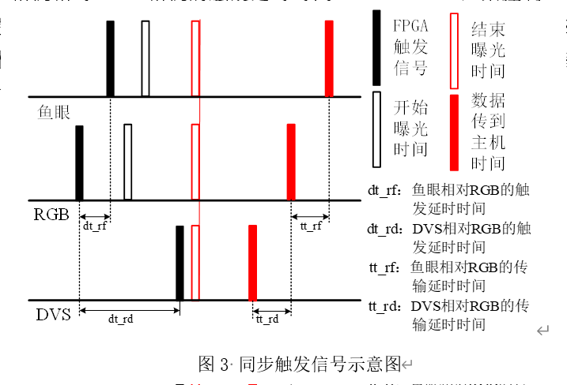  

##  autoware勾选

autoware.ai文件夹下

source install/setup.bash
roslaunch runtima_manager runtima_manager.launch

# RGB+鱼眼

## 重新编译  
```sh
cd ~/catkin_ws
source devel/setup.sh
catkin build
```

## 触发延时归零
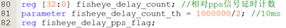  

## 打开相机
roslaunch usb_cam FisheyeCamera.launch
roslaunch usb_cam RGBCamera.launch


### 录包解析
sh rosbag.sh
sh deal_image.sh  (python2 deal_image.py)

```sh
rm -rf ./result/left_fish_img/* ./result/front_fish_img/* 
 ./result/right_fish_img/*  ./result/back_fish_img/* ./result/left_rgb_img/* 
./result/right_rgb_img/* ./result/left_dvs_img/* ./result/right_dvs_img/*
python2 deal_image.py
```


### 找同一帧数
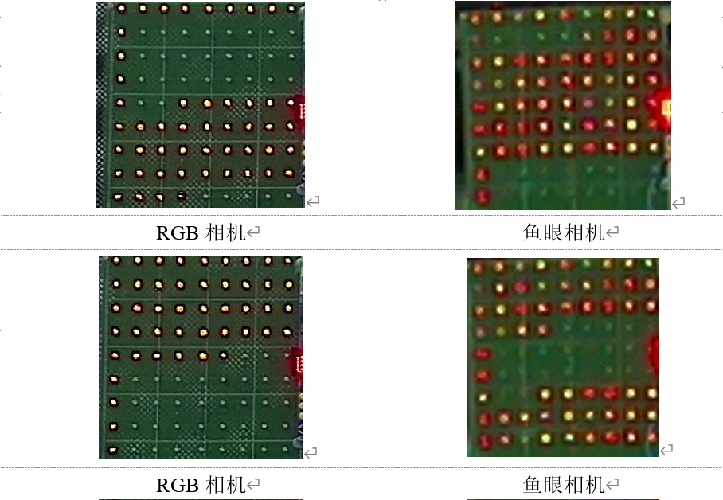  
RGB相机时间戳==整数秒+77ms左右==的图像和鱼眼相机时间戳==整数秒+86ms==左右的图像是同一时间曝光的。因为RGB相机从开始触发到图像数据传输结束大概77ms左右、对于鱼眼相机则是86ms左右，pps信号会在整数秒来到，所以相机的起始触发时间是整数秒，整数秒加上开始触发到图像数据传输结束的时间差值就是图像的系统时间戳。
==整数秒时间可以通过打印激光雷达时间戳获得==，激光雷达接入了pps信号，会在整数秒附近获得数据，但需要考虑激光雷达相位锁定角度和分帧角度。

相位锁定30°，分帧角度0°

激光雷达时间戳命令：==rostopic echo /points_raw/header.==
tips：有时候结果不对，把autoware重新打开，或者launch文件把rgb和dvs重新运行


> 这里摸索的方法就是把fpga的频率降低一倍，然后看rgb流动位置，找鱼眼去对齐，这个其实鱼眼的哪一帧对齐是一样的，只要保证时空确实是同一时刻就行。rgb比较好看，因为曝光时间短一点。
>
> 找最近的是曝光结束鱼眼比rgb时间戳大16ms，这个应该就是一个固定值了，开光灯我看曝光时间是一样的。
>
> 灯差7-10个


### 调整fpga触发延时
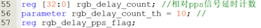  
调整为
 


### 调整鱼眼时间戳
获得这两张图像的时间戳差值（RGB相机-鱼眼相机），即为输延时时间tt_rf。对于30Hz的RGB相机和20Hz的鱼眼相机测得时间戳差值大约为-26ms。
1683208466.146154-1683208466.172014≈-0.026
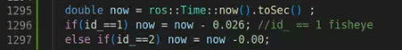  

在usb_cam驱动程序调整两者的时间戳。在~/catkin_ws/src/usb_cam/src/usb_cam.cpp grab_image函数中；其中id_=1表示为鱼眼相机，则鱼眼相机时间则需要加上-0.026，获得调整后的时间戳。

==改完后需要重新编译，命令为：catkin build.==

# RGB相机与DVS相机

## 打开RGB相机
```sh
cd ~/catkin_ws
source devel/setup.bash
roslaunch usb_cam RGBCamera.launch
```
## 打开DVS相机
```sh
cd ~/metavision_ros_driver_ws
source devel/setup.bash
roslaunch metavision_ros_driver LeftDVS.launch
roslaunch metavision_ros_driver RightDVS.launch
```
## 录制包
新打开终端，在ubuntu终端运行：
```sh
source devel/setup.bash
sh rosbag.sh
```
其中，rosbag.sh中为
`
rosbag record /left_fish/image_raw /front_fish/image_raw /back_fish/image_raw /right_fish/image_raw /left_rgb/image_raw /right_rgb/image_raw /event_cam_left/events /event_cam_left/trigger /event_cam_right/events /event_cam_right/trigger /points_raw /up_cam/image_raw /ipm_image -b 40960.
`
## 解析包
新打开终端，在ubuntu终端运行：
```sh
source devel/setup.bash
sh deal_image.sh  (python2 deal_image.py)
sh deal_left_dvs.sh  (roslaunch deal_data deal_left_dvs.launch)
sh deal_right_dvs.sh  (roslaunch deal_data deal_right_dvs.launch)
```
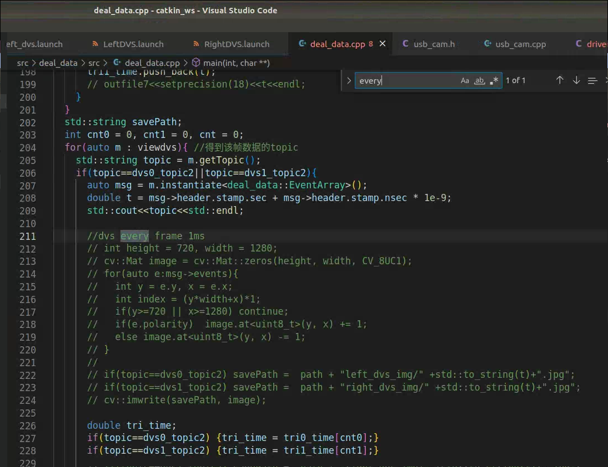  
解析每一帧的代码

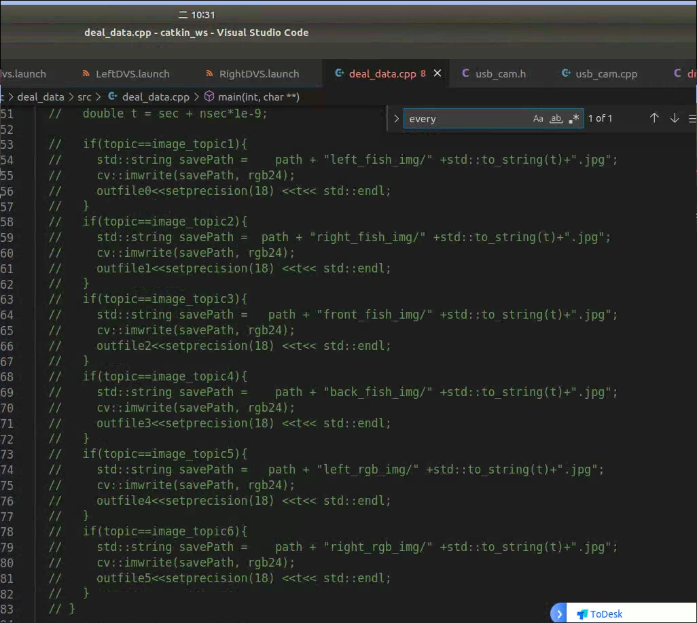  
解析其他图片的代码

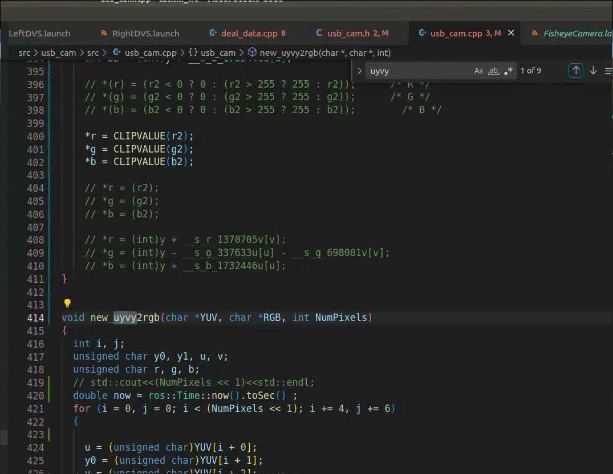  
格数转换代码

## 调整触发延时时间
- 首先找到DVS和RGB相机的同一时间曝光的图像
找到时间戳最接近且最后亮的灯一致的RGB和DVS图像img0（1ms累积的），==找的不一定是触发的那一帧，任意一帧==

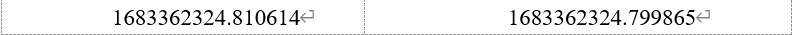  
- ==txt时间戳找第一个上升沿！DVS曝光结束时间距离pps和想的不一样！比理论长，大概同一pps触发，最后时间戳只比rgb小10ms== 对的

- 找到RGB相机触发时间
利用rgb时间戳为，减掉70ms左右（触发到传输结束时间），找到最近的触发信号时间戳（解析dvs图像时，终端会打印出来）。img0时间戳（dvs）-触发信号时间戳≈dt_rd。

- 获得触发延时时间
  img0时间戳-触发信号时间戳为触发延时时间dt_rd：
  ==1683362324.799865-1683362324.738415(触发信号)≈-0.061==

  ==看下图时间戳==

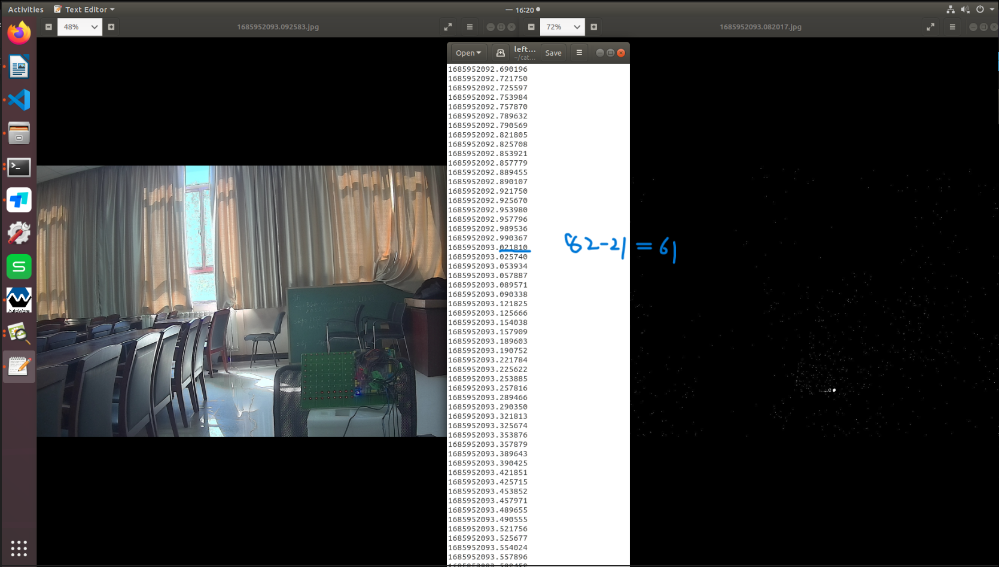  
我过得那一次结果

  
改为
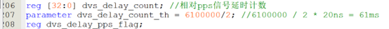  

这里调整之后相当于pps触发信号累计的那1ms就是1683362324.799865这张图像，也就是82的那个图像， fpga延时后对上的图像就是应该是差10ms左右


## 获得输延时时间（tt_rd）
获得这两张图像的时间戳差值（RGB相机-DVS相机），即为输延时时间tt_rd。对于30Hz的RGB相机和30Hz的DVS相机测得时间戳差值为1683362643.576998-1683362643.563761≈0.013。
==fpga触发延时61ms后相当于现在pps触发时刻的那一帧就在先前找的对齐的dvs图像==
但是反复调整发现输延时时间0.0115比较合适。


## 调整传输延时时间（tt_rd）
在dvs驱动程序调整dvs相机的时间戳。在`~/catkin_ws/metavision_ros_driver/src/metavision_ros_driver/include/metavision_ros_driver/driver_ros1.h` 

`~/catkin_ws/src/metavision_ros_driver/include/metavision_ros_driver/driver_ros1.h` 

的sendMessageIfComplete函数中更改dvs事件消息的时间戳，state->msg->header.stamp，如下图所示，在原有基础上加上传输延时时间（0.0115）。
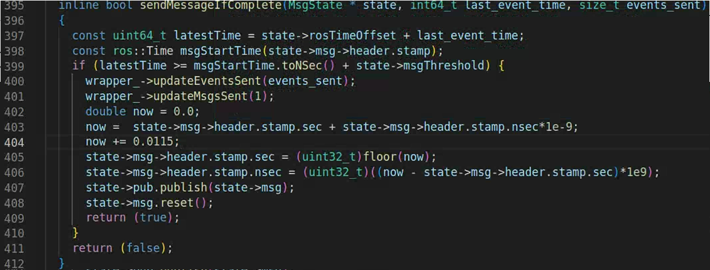  
==改完后需要重新编译，命令为：catkin_make.==


# 激光雷达与RGB相机

首先将GPS的GPRMC+PPS信号接入到激光雷达的Interface BOX上，使得激光雷达与PPS信号同步；==然后调整激光雷达的相位锁定控制PPS信号来到的时刻激光束转到那个角度==；调整激光雷达的分帧角度，确定一帧数据开始和结束角度；通过调整相位锁定角度保证相机曝光时刻激光束正好转到相机视野
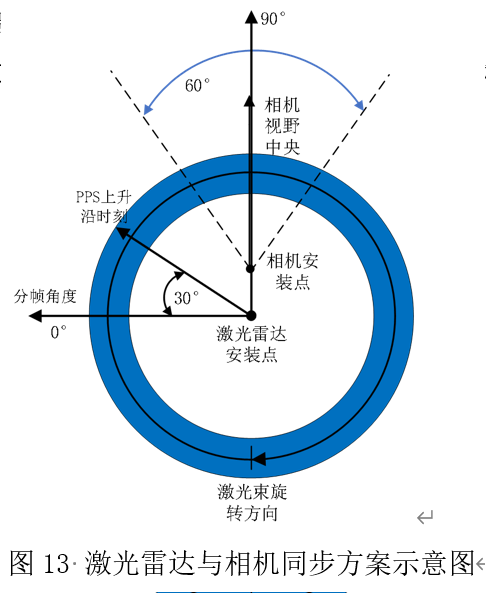  

## 相位锁定角度设置

设备按照要求连接及正确配置完成后，使用连接雷达的电脑浏览器访问设备 IP 地址（默认Device IP“192.168.1.200”）进入雷达 Web 首页，点击网页端“Setting”栏，在Phase Lock Setting中调整相位锁定:
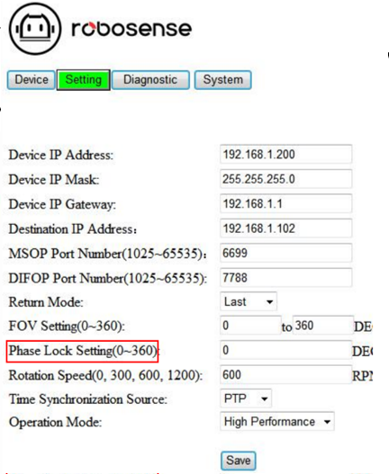  


## 分帧角度设置
在~/catkin_ws/src/rslidar_sdk/src/rs_driver/ src/rs_driver/driver/driver_param.h中调整，参数为cut_angle。
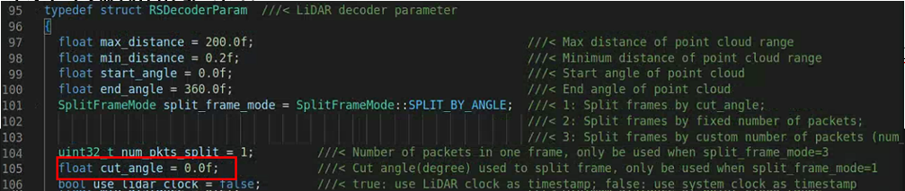  
==激光雷达时间戳是在旋转一圈之后！==

改完后需要重新编译，命令为：catkin_make.

## 打开RGB相机
在ubuntu终端运行：
cd ~/catkin_ws
source devel/setup.bash
roslaunch usb_cam RGBCamera.launch

## 打开激光雷达
新打开终端，在ubuntu终端运行：
source devel/setup.bash
roslaunch rslidar_sdk start.launch

## 录制包
新打开终端，在ubuntu终端运行：
source devel/setup.bash
sh rosbag.sh

## 输出的所有时间戳
都在 sh deal_image.sh  (python2 deal_image.py)


找到时间戳最相近（相机时间戳比激光雷达小）的相机与激光雷达数据。这时相机与激光雷达时间戳有个差值为dt_rl，在激光雷达时间戳上加上这个差值就能保证两者时间戳同步。

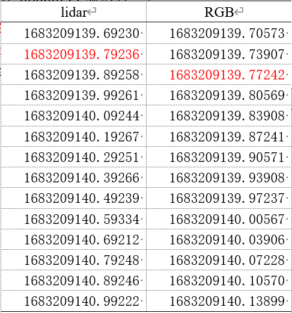  

如表格所示，dt_rl=1683209139.77242-1683209139.79236≈-0.02。
则需要在~/catkin_ws/src/rslidar_sdk/src/rs_driver/ src/rs_driver/driver/ lidar_driver_impl.hpp中调整激光雷达时间戳，参数为msg.timestamp:

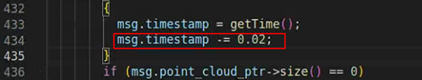  


## 激光雷达与相机标定板IoU
方法：[通过matlab中的激光雷达与相机的联合标定工具箱实现](https://ww2.mathworks.cn/help/lidar/ug/lidar-and-camera-calibration.html)。首先检测相机和激光雷达标定板角点；其次将激光雷达四个角点投影到相机平面；然后四个相机角点和四个激光雷达角度分别填充为一个背景为白色且黑色四边形的图像，并保存；最后利用两个填充的图像计算IoU。

## 解析包（获得图像和激光雷达pcd文件）
新打开终端，在ubuntu终端运行：  
source devel/setup.bash  
sh deal_image.sh  
sh deal_lidar.sh  
其中deal_lidar.sh中为rosrun pcl_ros bag_to_pcd 1.bag /points_raw ./pcd_frames，保存解析包文件与其中的包文件一致。

## 图像与激光雷达数据对齐
因为相机与激光雷达帧率不一致，所以需要将多余的图像去除。
命令：python duiqi.py
获得同样数据的图像和pcd文件。

## 获得填充图像
打开Matlab命令行窗口
命令：LidarCameraCorners


## 计算IoU
打开Matlab命令行窗口
命令：LidarCameraIoU
获得每对图像与激光雷达IoU，和平均IoU。

</br></br>


## 配完成后的一系列操作-最常用的命令


```shell
roscore

rviz

roslaunch metavision_ros_driver LeftDVS.launch

roslaunch metavision_ros_driver RightDVS.launch

roslaunch rslidar_sdk start.launch

roslaunch usb_cam FisheyeCamera.launch

roslaunch usb_cam RGBCamera.launch

激光雷达时间戳命令 rostopic echo /points_raw/header

解析图像！！注释掉解析图像，不然会很慢 
source devel/setup.bash
sh deal_image.sh  (python2 deal_image.py)
sh deal_left_dvs.sh  (roslaunch deal_data deal_left_dvs.launch)
sh deal_right_dvs.sh  (roslaunch deal_data deal_right_dvs.launch)
```

# 测试记录

## 9.18

1. 左鱼眼打不开好几次，插拔12v电源插头就好了
2. 掉帧 其他都正常，时间戳和灯都差得很小


# 之前的记的

## bash run.sh  
开启相机
run.sh内容
```
roslaunch usb_cam usb_cam-01.launch 
```
usb_cam-01.launch内容
```xml
<launch>
  <node name="usb_cam00" pkg="usb_cam" type="usb_cam_node" output="screen" >
    <param name="video_device" value="/dev/video0" />
    <param name="image_width" value="1920" />
    <param name="image_height" value="1080" />
    <param name="pixel_format" value="uyvy" />
    <param name="camera_frame_id" value="usb_cam" />
    <param name="use_our_stamp" value="true"/>
    <param name="io_method" value="mmap"/>
    <param name="id" value="2"/>
  </node>
```

usb_cam功能包名，usb_cam_node 节点初始化所在cpp文件名 
[type：节点本来的名称，这个名称和节点初始化所在.cpp源文件的文件名一致，也就是编译生成的exe文件名一致](https://blog.csdn.net/weixin_45590473/article/details/122647788)  

- usb_cam_01.launch 鱼眼
- usb_cam_02.launch RGB
- scr/usb_cam.cpp 鱼眼和rgb都是这个驱动节点，dvs不是
- value="2"说明是一个rgb


## roslaunch rslidar_sdk_start.launch
开启激光雷达
```xml
<launch>
  <node pkg="rslidar_sdk" name="rslidar_sdk_node" type="rslidar_sdk_node" output="screen">
  </node>
  <!-- rviz -->
  <node pkg="rviz" name="rviz" type="rviz" args="-d $(find rslidar_sdk)/rviz/rviz.rviz" />
</launch>
```

## sh rosbag.sh
录包
rosbag.sh内容
```
rosbag record /usb_cam00/image_raw /usb_cam01/image_raw /usb_cam02/image_raw /usb_cam03/image_raw /usb_cam04/image_raw /usb_cam05/image_raw
```


## python2 deal_image.py
录下来离线解析
之前的python版  
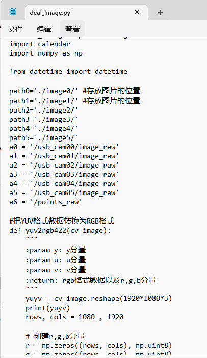  


## rviz
可视化软件 velodyne 


## ls /dev
查看设备


## 其他
### roslaunch torosbag to_rosbag.launch
录下来离线解析  
to_rosbag.launch内容
```xml
<launch>
  <node name="to_rosbag00" pkg="to_rosbag" type="to_rosbag" output="screen" >
  </node>
</launch>
```
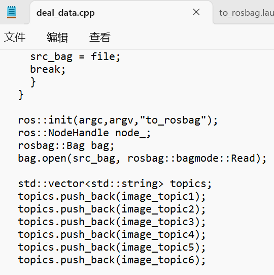  
c++版,写了节点类型to_rosbag,还有打开包bag.open


### deal_image_pub_sub 
在线，订阅图像处理图像发布
```xml
<launch>
  <node name="deal_image_pub00" pkg="deal_image_pub_sub" type="deal_image_pub_sub" output="screen" >
  <param name="pub_name" value="deal_image_pub00/image" />
  <param name="sub_name" value="/usb_cam00/image_raw" />
  </node>
</launch>
```

# 项目传感器信息


## DVS相机
dvs是是一个个点作为事件，可是设定一定范围内的事件组合成一帧图像  
dvs几乎没有传输延时，和rgb一样在线解析时间慢，有离线解析

## 鱼眼
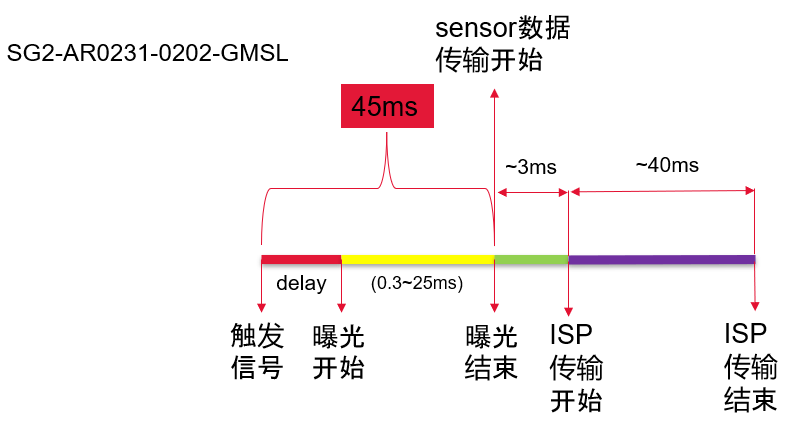

## rgb
传输延时30左右

## 激光雷达
要设ip，关防火墙

##  RGB对齐鱼眼

| 设备  | 延时触发时间 | PPS-时间戳时间       |     |
|-----|--------|-----------------|-----|
| RGB | 0      | 75.7（理论70-73）   |     |
| 鱼眼  | 6ms    | 86.95 （理论86-89） |     |
| DVS |        |                 |     |
通过测的75.7和86.95理论不加触发最后时间戳鱼眼大于RGB11.25，实测16
减完时间戳大概一致，比灯鱼眼少6个，延时6ms，鱼眼时间戳再减6，共减22

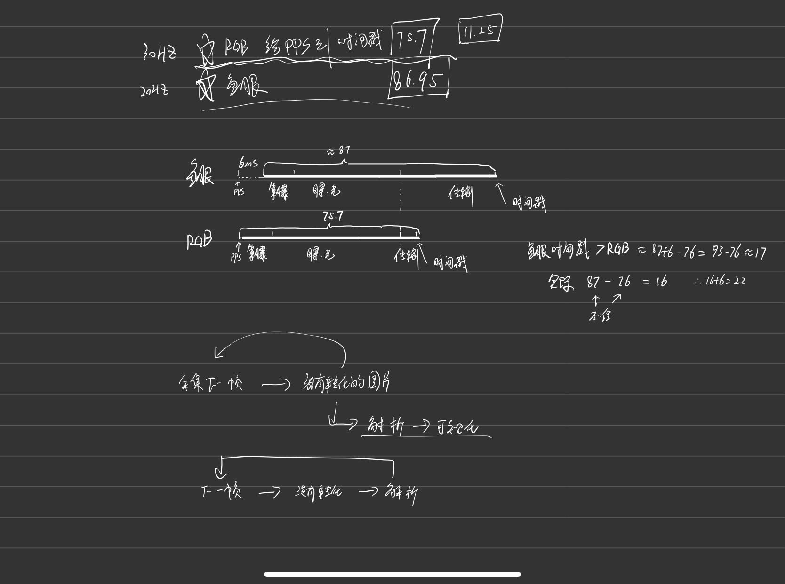


## FPGA
pps是GPS给的触发信号

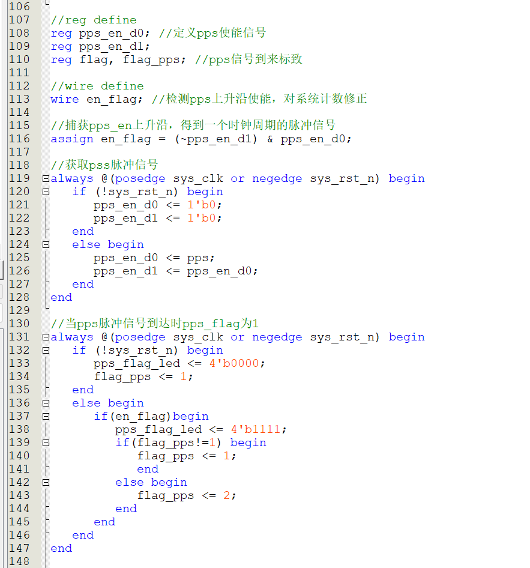  
检测pps信号的一个脉冲就是一个上升沿，assign en_flag = (~pps_en_d1) & pps_en_d0;然后使能为1

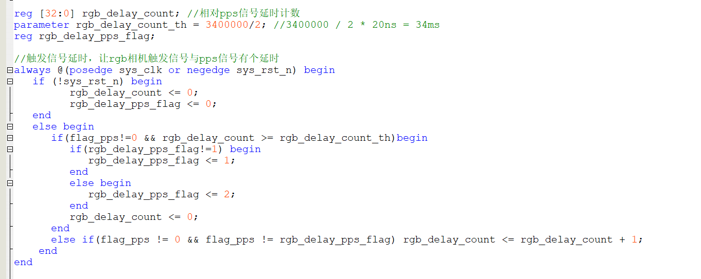  
RGB延时计数

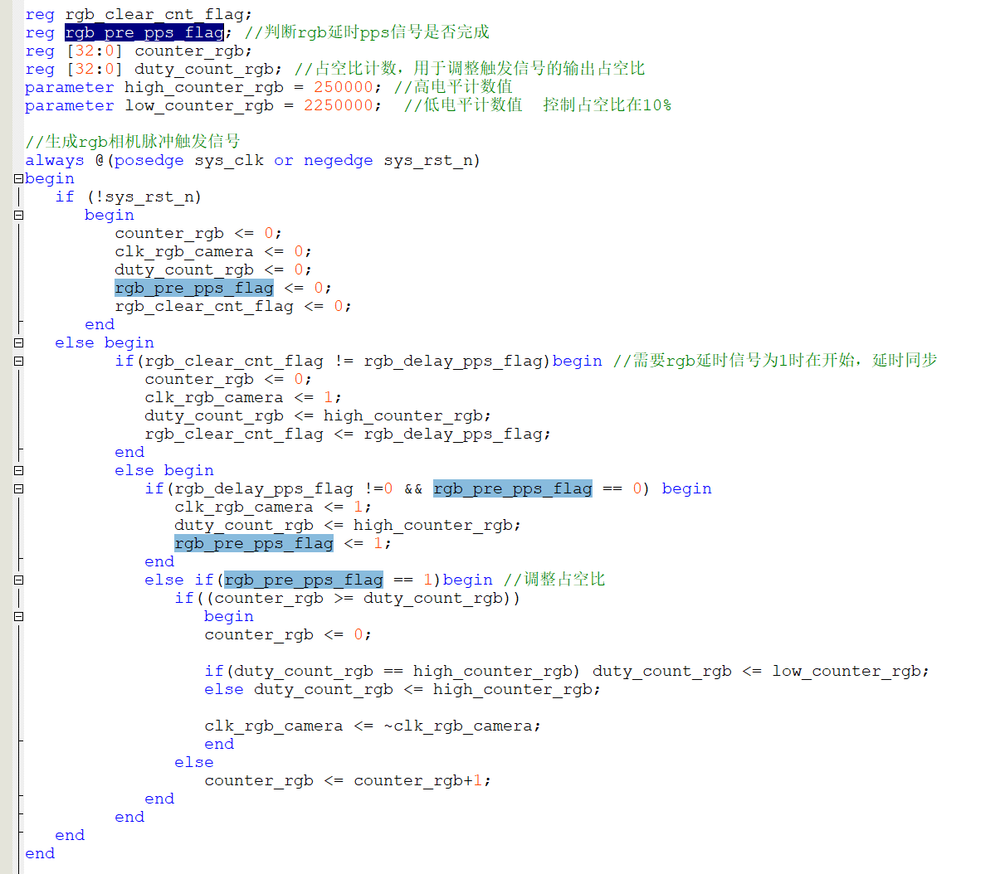
延时结束生成RGB触发脉冲信号

pps信号是直接给激光雷达的，fpga生成延时再触发相机去对齐激光雷达


## GNSS

触发盒的32接口不要接

ls -l /dev/tty*

在autoware修改设备名 dev/xxxx

chmod 777 /dev/ttyACM0

echo fix


# 清除参数


# 遇到问题

## dvs时间戳对标定影响


注释的ts换了

## left_rgb打不开

重开12v

重插usb

## rgb变成20fps

电脑状态不对，又是在师兄测完之后，之前赵倩重启就好的

50ms了变成

而且重启都点了好好几下

=。=pps没信号，初始化fpga给的触发信号没初始化就是20hz导致的

## 感觉对齐思路有问题

触发信号的延迟错帧应该是没有关系的，对于某一帧它的触发信号没有错帧的概念，只要在对应的位置产生的触发信号就可以

触发信号到传到电脑时间是固定的，所以时间戳不能错帧就行了

==可以把fpga灯调到3ms，保证对齐的图片没有错过一轮==

### 比如RGB和鱼眼


> 两种对齐方式应该是都可以的，两帧鱼眼对齐那一个都可以。
>
> 
>
> 找最近的是曝光结束鱼眼比rgb时间戳大16ms，这个应该就是一个固定值了，开光灯我看曝光时间是一样的。
>
> 鱼眼灯少7-10个（那么触发信号就延时10ms），鱼眼本来就大16ms,那时间戳就要减去16+10=26ms。
>
> 其实找任意一个鱼眼灯比rgb少然后保证没有错过一轮，那么就可以fgpa延迟少的灯数，然后时间戳减去本来的差值+增加的延时


## 比如dvs和RGB

> 找到保证没有错过一轮的dvs(169999.593)和RGB(169999.609)灯数一样的图片，
>
> 那么时间戳就是加609 - 593 = 16，就是对齐时间戳，对于dvs来说触发信号只是区别哪些帧保留下来，其实pps信号到主机接受到数据延迟是固定的，比rgb早10-16ms左右，对齐等的方法就是时间戳+10-16ms，让时间戳一样
>
> 找到小的最近的触发信号时间 169999.565 (所以延时593-565=28ms，其实之前的61=28+33，fpga错帧结果一样的，对应位置有触发信号就可以了)，这样169999.593这个图会被标为tri保存下来。时间戳也加的和rgb一样，就都对齐了。


## 改队列大小之后的测试


3155开始打开的RGB和4鱼眼，一直没丢，然后3469过了5.6分钟开始录包，打开录包那一下丢帧了

然后期间


一直到4080录了快8.9分钟都没丢


# 合同


# 保留原始时间戳


