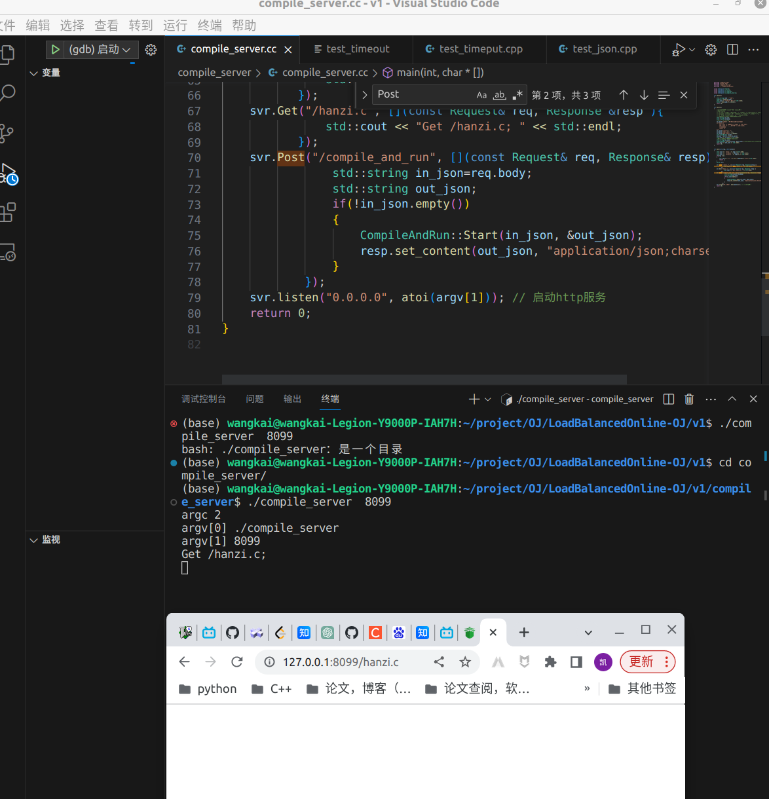

# LoadBalancedOnline-OJ项目

## 一、项目简介

 + 开发技术
 + 开发环境
 + 项目结构

[项目介绍具体文档](https://atong.run/posts/2085396799/)

## 二、编译模块

+ 具体编译功能
+ 工具类
+ 日志

[编译模块具体文档](https://atong.run/posts/1188400450/)

## 三、运行模块

+ 运行可执行程序
+ 资源限制

[运行模块具体文档](https://atong.run/posts/3304561254/)

## 四、编译运行

+ 反序列化in_json
+ 编译运行
+ 错误处理
+ 构造out_json

[编译运行具体文档](https://atong.run/posts/2587007324/)


## 五、编译运行网络服务

> 待更新

+ httplib
+ postman测试

## 六、OJ_Server

> 待更新

+ 路由转发

+ 负载均衡

+ 文件版本

+ Mysql

  

  

```

compile_server:compile_server.cc
	g++ -g -o $@ $^ -std=c++11 -ljsoncpp -lpthread          
.PHONY:clean
clean:
	rm -f compile_server


```


# MyOJ项目


## 环境部署报错

[ctemplate](https://blog.csdn.net/weixin_43691984/article/details/131873107)

[autoreconf: command not found](https://blog.csdn.net/weixin_42736510/article/details/126485716)

[boost](https://blog.csdn.net/challenglistic/article/details/129097988)

[jsoncpp](https://blog.csdn.net/qing310820/article/details/84283650?spm=1001.2101.3001.6650.1&utm_medium=distribute.pc_relevant.none-task-blog-2%7Edefault%7ECTRLIST%7ERate-1-84283650-blog-132423076.235%5Ev38%5Epc_relevant_sort_base3&depth_1-utm_source=distribute.pc_relevant.none-task-blog-2%7Edefault%7ECTRLIST%7ERate-1-84283650-blog-132423076.235%5Ev38%5Epc_relevant_sort_base3&utm_relevant_index=2)


## 解析和拓展-博客

[解析](https://blog.csdn.net/HBINen/article/details/131711231)


[加了登录,和数据库](https://blog.csdn.net/weixin_61508423/article/details/130799512)

https://gitee.com/lu-code-xiaomiao/load-balancing-online---oj

https://gitee.com/liu-lingy/c-project/tree/master/OnlineJudge


# 运行

```
./oj_server 

./compile_server 8081

```

oj_server默认端口8080

compile_server端口是conf文件里的port


# 创建

## temp

[默认会有3个文件描述符存在(0、１、2)，0与进程的标准输入相关联，１与进程的标准输出相关联，2与进程的标准错误输出相关联](https://blog.csdn.net/qq_20817327/article/details/117517160)

stdout  运行时候的输出

compile_err  编译时候输出的错误

stderr    运行的时候的错误

## makefile

```
compile_server:compile_server.cc
	g++ -o $@ $^ -std=c++11 -g -O0 -Wall
.PHONY:clean
clean:
	rm -f compile_server

```

```
g++ test_json.cpp -o test_json -std=c++11 -g -O0 -Wall -ljsoncpp -lpthread 
```

# CompileService.h

## 为什么要另启动一个进程：

这段代码中为什么使用了另一个进程（子进程）进行编译，而不是在当前进程中进行编译，可能有以下原因：

1. **隔离性和安全性：** 编译器操作可能会引入错误，崩溃或导致程序异常终止。通过在子进程中进行编译，可以隔离编译器可能引发的问题，以确保主程序的稳定性。如果编译器进程崩溃或导致错误，主程序不会受到影响。
2. **多任务并行处理：** 在子进程中执行编译可以允许主程序继续执行其他任务，例如响应用户请求或并行处理其他编译任务。这提高了程序的并发性能，因为编译可能是一个相对较慢的操作。
3. **错误处理：** 在子进程中执行编译后，主程序可以捕获子进程的退出状态，以便根据编译的成功或失败状态进行适当的错误处理。这使得能够更好地了解编译的结果并采取相应的措施。
4. **资源控制：** 子进程可以在编译期间使用的资源（例如文件句柄、内存等）进行更好的控制和清理。如果编译器进程在编译完成后没有正确关闭资源，它可能会导致资源泄漏。

限制cpp资源和时间，获得进程结束signal和异常


## fork

因此，`pid_t` 变量 `pid` 在调用 `fork()` 后将包含不同的值，具体取决于当前是父进程还是子进程：

- 在父进程中，`pid` 的值将是子进程的进程ID。
- 在子进程中，`pid` 的值将是0。

## dup2

`dup2(_stderr, 2)` 是一个用于文件描述符重定向的系统调用。在你提供的代码片段中，它用于将标准错误流（文件描述符2）重新定向到 `_stderr` 指向的文件。


## 判断文件是否存在

你的代码使用 `stat` 函数来判断文件是否存在是一个常见的方法。`stat` 函数用于获取文件的信息，如果文件存在，则返回0，否则返回-1。所以你的代码是正确的。

在你的代码中，首先定义一个 `struct stat` 类型的变量 `buf` 用来存储文件信息，然后使用 `stat` 函数检查文件是否存在。如果 `stat` 函数返回0，说明文件存在，然后返回 `true`；如果返回-1，说明文件不存在，然后返回 `false`。

## [资源限制](https://blog.csdn.net/wgl307293845/article/details/106897131)

cpu时间是活跃时间，sleep不行

超过限制，子进程会结束，singal 17


## 文件操作

[ofstream C++ 文件读写，清空文件内容](https://blog.csdn.net/weixin_48721345/article/details/131851796)


## umask

>  umask的值为0002
>
> ​                创建文件的权限为：0666-0002=0664 （-rw-rw-r–）
>
> ​                创建文件夹的权限为：0777-0002=0775（drwxrwxr-x）
>
> ​                用户 组 其他人

## 宏 字符串参数

#define LOG(level) log(#level,__FILE__,__LINE__);

[负载均衡在线OJ系统](https://blog.csdn.net/zhu_pi_xx/article/details/130681826)

# Vision 3


## [cjson](https://blog.csdn.net/qq_43441284/article/details/130983076)


## waitpid进程退出码和终止信号

[进程退出、进程等待(waitpid函数)](https://blog.csdn.net/challenglistic/article/details/123882574)

[进程等待 | wait/waitpid 的 status 参数 | 获取退出码与退出信号 | 初识核心转储](https://blog.csdn.net/weixin_50502862/article/details/129218749)


```c++
 static std::string CodeToDesc(int code, const std::string& file_name)
        {
            //进程退出状态码 
            std::string desc;
            switch(code)
            {
            case 0:
                desc="编译运行成功";
                break;
            case -1:
                desc="提交的代码为空";
                break;
            case -2:
                desc="未知错误";
                break;
            case -3:
                //代码编译时出错
                FileUtil::ReadFile(PathUtil::CompilerError(file_name), &desc, true);
                break;
            case SIGABRT: //6
                desc="内存超过范围";
                break;
            case SIGXCPU: //24
                desc="CPU使用超时";
                break;
            case SIGFPE: //8
                desc="浮点数溢出";
                break;
            default:
                desc="未知"+std::to_string(code);
                break;
            }
            return desc;
        }
```

## [unlink](https://www.xjx100.cn/news/574600.html?action=onClick)

# vison4

## httplib库

[一篇搞懂tcp，http，socket，socket连接池之间的关系](https://zhuanlan.zhihu.com/p/504486694)


### [github](github.com/yhirose/cpp-httplib)

httplib库直接复制头文件无需安装

### [使用](https://blog.csdn.net/sjp11/article/details/127990377)

```c++
 
class Server {
        //Handler一个函数指针名称，它的参数是Request，和Response
        using Handler = std::function<void(const Request &, Response &)>;
        //Handlers是一个映射表，它映射对应的请求资源和处理函数映射在一起
        using Handlers = std::vector<std::pair<std::regex, Handler>>;
        //将Get方法的请求资源与处理函数加载到Handlers表中
        Server &Get(const std::string &pattern, Handler handler);
        Server &Post(const std::string &pattern, Handler handler);
        Server &Put(const std::string &pattern, Handler handler);
        Server &Patch(const std::string &pattern, Handler handler);  
        Server &Delete(const std::string &pattern, Handler handler);
        Server &Options(const std::string &pattern, Handler handler);
        //线程池
        std::function<TaskQueue *(void)> new_task_queue;
 
        //搭建并启动http
        bool listen(const char *host, int port, int socket_flags = 0);
 };
```


```c++
  if(argc !=2 )
    {
        std::cerr<<"使用: "<<"\n\t"<<argv[0]<<" port"<<std::endl;
        return 1;
    }
    Server svr;

    //svr.Get("/hello", [](const Request& req, Response &resp ){
    //            resp.set_content("hello1223", "content-type: text/plain; charset=utf-8");
    //        });
    svr.Post("/compile_and_run", [](const Request& req, Response& resp){
                std::string in_json=req.body;
                std::string out_json;
                if(!in_json.empty())
                {
                    CompileAndRun::Start(in_json, &out_json);
                    resp.set_content(out_json, "application/json;charset=utf-8");
                }
            });
    svr.listen("0.0.0.0", atoi(argv[1])); // 启动http服务
    return 0;
```

```
[](const Request& req, Response& resp) 匿名函数做handler回调处理函数
```


## [inline](https://zhuanlan.zhihu.com/p/145443787)

使用inline修饰带来的好处我们表面看不出来，其实，在内部的工作就是在每个for循环的内部任何调用dbtest(i)的地方都换成了

```
(i%2>0)?”奇”:”偶”
```

这样就**避免了频繁调用函数对栈内存重复开辟所带来的消耗**。

## arg

```
std::cout <<  "argc " << argc <<std::endl;
std::cout <<  "argv[0] "<< argv[0]  << std::endl;
std::cout <<  "argv[1] " << argv[1] << std::endl;
    
(base) wangkai@wangkai-Legion-Y9000P-IAH7H:~/project/OJ/LoadBalancedOnline-OJ/v1/compile_server$ ./compile_server 8081

stdout:
argc 2
argv[0] ./compile_server
argv[1] 8081

```

## [0.0.0.0 和127.1](https://blog.51cto.com/u_12182769/6115686)

0.0.0.0确实是收到的所有ip 

127.1是回环



## [split](https://www.python100.com/html/85925.html)

```
 boost::split((*target), str, boost::is_any_of(sep), boost::algorithm::token_compress_on);//boost::token_compress_on:将连续多个分隔符当一个
```

## [ctemplate](https://blog.csdn.net/cckluv/article/details/112848266)

```
<html>
<head>
<title>ctemplate示例模板</title>
</head>
 
<body>
    {{table1_name}}
    <table>
        {{#TABLE1}}
        <tr>
            <td>{{field1}}</td>
            <td>{{field2}}</td>
            <td>{{field3}}</td>
        </tr>
        {{/TABLE1}}
    </table>
</body>
</html>
```

```
#include <ctemplate/template.h>
#include <stdio.h>
#include < string>
int main()
{
    ctemplate::TemplateDictionary dict("example");
    dict.SetValue("table1_name", "example");
    
   for (int i=0; i<2; ++i)
    {
        ctemplate::TemplateDictionary* table1_dict;
        table1_dict = dict.AddSectionDictionary("TABLE1");
        table1_dict->SetValue("field1", "1");
        table1_dict->SetValue("field2", "2");
        table1_dict->SetFormattedValue("field3", "%d", i);
    }
  	std::string output;
    ctemplate::Template* tpl;
    tpl = ctemplate::Template::GetTemplate("example.htm", ctemplate::DO_NOT_STRIP);
    tpl->Expand(&output, &dict);
    printf("%s\n", output.c_str());
    return 0;
}
```

```
<html>
<head>
<title>ctemplate示例模板</title>
</head>
 
<body>
    example
    <table>
        
        <tr>
            <td>1</td>
            <td>2</td>
            <td>0</td>
        </tr>
        
        <tr>
            <td>1</td>
            <td>2</td>
            <td>1</td>
        </tr>
        
    </table>
</body>
</html>
```


## mtx

为什么要加锁不是很懂++ --应该不会冲突

> 因为一旦连接我，拼接完之后就要对主机进行选择，所以这里是要加锁包的，为了负载均衡，我们维护的有load，我们要选择load最小的去进行服务。
>
> 加锁也可以用系统当中的pthread_mutex_xxx等（pthread库中的内容）
> 也可以用C++当中的mutex库，需要注意的是，C++当中所有的锁都是防拷贝的。
> 因为创建出来的Machine对象，要管理到某个容器当中，所以一定会发生拷贝，所以我们直接定义mutex对象是会报错的，我们这里需要用指针的方式去用锁
> ————————————————
> 版权声明：本文为CSDN博主「猪皮兄弟」的原创文章，遵循CC 4.0 BY-SA版权协议，转载请附上原文出处链接及本声明。
> 原文链接：https://blog.csdn.net/zhu_pi_xx/article/details/130681826
>
> 

## 为什么smartchoice用Machine *m

```c++
int id = 0;
Machine *m = nullptr;
if (!load_blance_.SmartChoice(&id, &m))
//Machine m，传入load_blance_.SmartChoice(&id, &m)的就是一个对象的引用
{
	break;
}

// 选择成功，发起http请求，得到结果
Client cli(m->ip, m->port);
m->IncLoad();//那么在调用SmartChoice的外层后面对m操作其实是对新的对象操作，而不是原来容器里的对象
```

避免创建一个新的对象？

想通了，是因为若是Machine m，传入load_blance_.SmartChoice(&id, &m)的就是一个对象的引用。

```c++
bool SmartChoice(int *id, Machine **m)
{
    ...........
    *m = &machines[online[0]];
    //拷贝构造
    ..........
```

SmartChoice里面就是*m = machines[online[0]];这是拷贝构造，那么在调用SmartChoice的外层后面对m操作其实是对新的对象操作，而不是原来容器里的对象.

==所以类指针传出来可以保证后续操作是对容器里的对象操作==

## 为什么id用size

online.push_back(machines.size())

Control类创建的时候会把conf的每个port用machines.size()递增赋予id

这个id映射就是固定不变的了，不重复就行


## 怎么判断机器服务端是否在线的     

RecoveryMachine 所有离线添加到在线  (没调用)

判题的时候尝试连接，连不上会下线

所以重连是不行的，只要所有的端口都掉线了，那么重连也没用了

https://blog.51cto.com/byte/7427307)


# 改版

装7788的包

运行.sql建立数据库

使用的是后台进程

vscode调试： makefile 要加-g


> `modelLayer`、`session` 和 `viewLayer` 这些术语属于软件工程中的分层架构概念。它们用于组织代码，使得应用程序更易于维护、扩展和测试。下面是对这些概念的解释：
>
> ### 1. Model Layer（模型层）
>
> `modelLayer` 负责处理与数据相关的逻辑，包括数据的存储、检索、更新和删除。它通常包含数据库交互代码和业务逻辑。模型层的职责包括：
>
> - 定义数据结构和对象模型。
> - 实现数据持久化（与数据库进行交互）。
> - 执行业务规则和逻辑。
>
> 例如，在一个电子商务应用中，模型层可能包括 `Product`、`Order` 和 `User` 等类，这些类负责处理与这些实体相关的所有数据操作。
>
> ```
> cpp复制代码class Product {
> public:
>     void save();
>     void update();
>     void delete();
>     static Product find(int id);
>     // Other product-related methods
> };
> ```
>
> ### 2. Session Layer（会话层）
>
> `session` 层管理用户会话和状态。它通常处理用户身份验证、授权和跟踪用户的活动。会话层的职责包括：
>
> - 维护用户登录状态。
> - 管理用户会话数据（例如购物车内容）。
> - 执行会话相关的安全检查。
>
> 在 Web 应用中，会话层可能涉及管理用户的登录状态和会话数据，通常通过 cookies 或会话存储来实现。
>
> ```
> cpp复制代码class Session {
> public:
>     void login(const std::string& username, const std::string& password);
>     void logout();
>     bool isAuthenticated();
>     // Other session-related methods
> private:
>     bool authenticated;
>     std::string currentUser;
> };
> ```
>
> ### 3. View Layer（视图层）
>
> `viewLayer` 负责呈现数据给用户，并处理用户交互。它通常包含用户界面（UI）和用户体验（UX）相关的代码。视图层的职责包括：
>
> - 生成用户界面。
> - 处理用户输入和事件。
> - 显示数据和反馈给用户。
>
> 在 Web 应用中，视图层可能包含 HTML、CSS 和 JavaScript，或使用模板引擎生成动态内容。
>
> Make UI
>
> ```
> html复制代码<!DOCTYPE html>
> <html>
> <head>
>     <title>Product List</title>
> </head>
> <body>
>     <h1>Products</h1>
>     <ul id="product-list">
>         <!-- Product items will be dynamically inserted here -->
>     </ul>
>     <script>
>         // JavaScript to handle user interactions
>     </script>
> </body>
> </html>
> ```
>
> ### 4. 总结
>
> 通过将应用程序划分为模型层、会话层和视图层，可以实现以下目标：
>
> - **分离关注点**：每一层负责不同的职责，使代码更加模块化和易于维护。
> - **提高可测试性**：独立测试每一层的功能，而不依赖其他层的实现。
> - **增强可扩展性**：可以独立扩展或修改每一层，而不会影响其他层。
