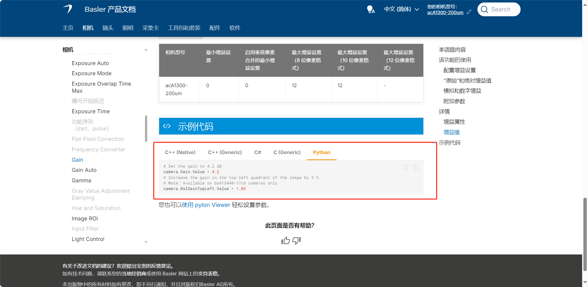
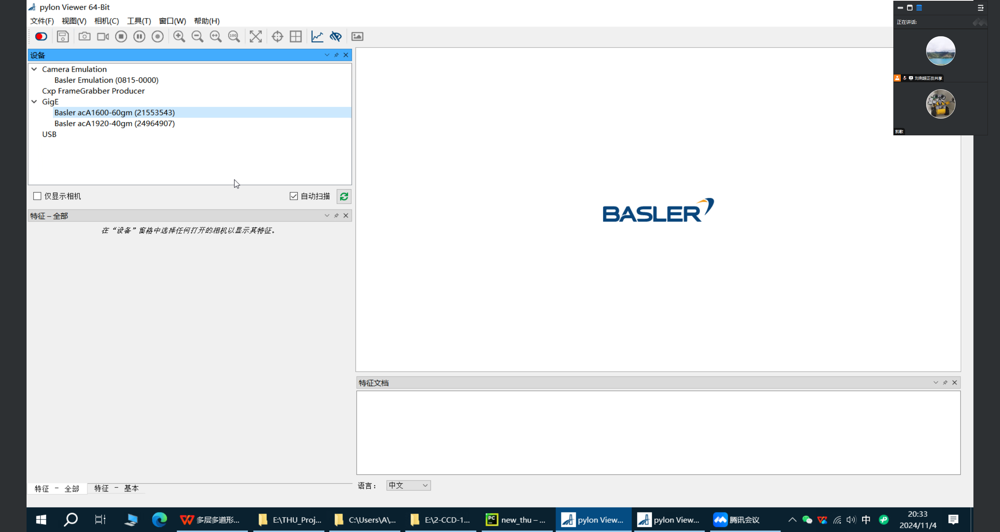

https://github.com/basler/pypylon-samples


https://zh.docs.baslerweb.com/gain



# CCD

pylon和相机型号




```

from pypylon import pylon
import cv2
from datetime import datetime
import threading


# 连接相机
camera = pylon.InstantCamera(pylon.TlFactory.GetInstance().CreateFirstDevice())
camera.Open()

# Set the "raw" gain value to 400
# If you want to know the resulting gain in dB, use the formula given in this topic
camera.GainRaw.Value = 3


camera.TriggerSelector.SetValue("FrameStart")  # 设置触发选择器为FrameStart
camera.TriggerMode.SetValue("Off")  # 打开触发模式
camera.TriggerSource.SetValue("Software")  # 设置触发源为软件触发

def save_image():
    cv2.imwrite( path, image)

t = threading.Thread(target=save_image)
t.start()  # 开始线程


camera.StartGrabbing(pylon.GrabStrategy_LatestImageOnly)
count = 0
# 获取当前时间
start_time = datetime.now()
while camera.IsGrabbing():
    # 获取结束时间
    end_time = datetime.now()

    # 计算时间间隔
    time_interval = end_time - start_time
    #framerate = 1 / float(str(time_interval))
    print(time_interval)
    # 获取当前时间
    start_time = datetime.now()

    grabResult = camera.RetrieveResult(5000, pylon.TimeoutHandling_ThrowException)
    #print(camera.IsGrabbing())
    if grabResult.GrabSucceeded():
        count = count + 1
        print(count)
        # 获取图像数据
        image = grabResult.Array

        
     
        # 保存图像
        #cv2.imwrite("D://Image.png", image)
        #cv2.imwrite("D://Image.bmp", image)
        path = "D:\\mPython\\BaslerCamera\\Image\\" + str(count) + ".jpg"
        print(path)
        cv2.imwrite( path, image)

        

        # 显示图像
        #text = "test"
        #cv2.putText(image, text, (50, 50), cv2.FONT_HERSHEY_SIMPLEX,
        #                1, (255, 255, 0), 2)
        #cv2.imshow("SaveImage", image)

        
    grabResult.Release()

    # 检测窗口关闭事件，按'q'键退出循环
    if cv2.waitKey(1) & 0xFF == ord('q'):
        break

# 关闭相机和窗口
camera.StopGrabbing()
camera.Close()
cv2.destroyAllWindows()


```

技术支持


```c
import pypylon.pylon as py
import numpy as np
import cv2

# this sample has been tested with a Basler acA1920-155uc
# type 'q' or 'ESC' in the window to close it

# the camera is configured to run at high framerate with only two lines hight
# the acquired rows are concatenated as a virtual frame and this frame is displayed


tlf = py.TlFactory.GetInstance()
print(tlf.EnumerateDevices())

# cam = py.InstantCamera(tlf.CreateFirstDevice())
cam = py.InstantCamera(tlf.CreateDevice(tlf.EnumerateDevices()[1]))
cam.Open()

# setup center scan line
cam.Height = cam.Height.Max
cam.Width = cam.Width.Max
cam.CenterX = True
cam.CenterY = True

# setup for
cam.PixelFormat = "Mono8"
# cam.GainSelector.SetValue()

cam.GainRaw.SetValue(360)
# cam.GainAuto = "Continuous"
# cam.ExposureAuto = "Continuous"
cam.ExposureAuto.SetValue("Off")
# cam.ExposureTimeRaw.SetValue(550000)


# print("Resulting framerate:", cam.ResultingFrameRate.Value)

cam.StartGrabbing()


missing_line = np.ones(
    (cam.Height.Value, cam.Width.Value), dtype=np.uint8)*255
image_idx = 0
while True:
    # for idx in range(VIRTUAL_FRAME_HEIGHT // SCANLINE_HEIGHT):
    #     with cam.RetrieveResult(2000) as result:
    #         if result.GrabSucceeded():
    #             with result.GetArrayZeroCopy() as out_array:
    #                 img[idx * SCANLINE_HEIGHT:idx *
    #                     SCANLINE_HEIGHT + SCANLINE_HEIGHT] = out_array
    #         else:
    #             img[idx * SCANLINE_HEIGHT:idx * SCANLINE_HEIGHT +
    #                 SCANLINE_HEIGHT] = missing_line
    #             print(idx)
    with cam.RetrieveResult(5000) as result:
        if result.GrabSucceeded():
            img_rgb = result.Array
        else:
            continue

    # Display the resulting frame
    show_img = cv2.resize(img_rgb, (img_rgb.shape[0], img_rgb.shape[1]))
    cv2.imshow('Linescan View', img_rgb)
    cv2.imwrite("1.png",img_rgb)

    image_idx += 1
    if cv2.waitKey(1) & 0xFF in (ord('q'), 27):
        break

# When everything done, release the capture
cam.StopGrabbing()
cv2.destroyAllWindows()

cam.Close()

```

