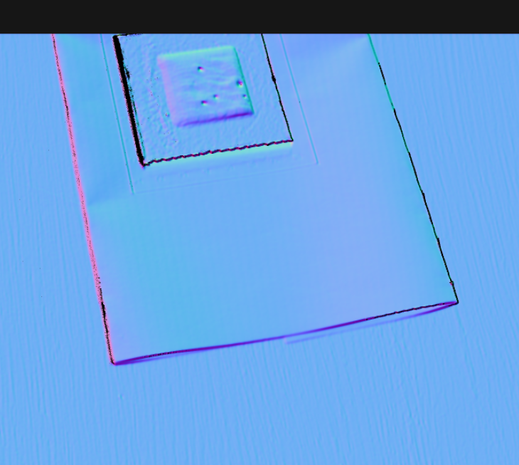
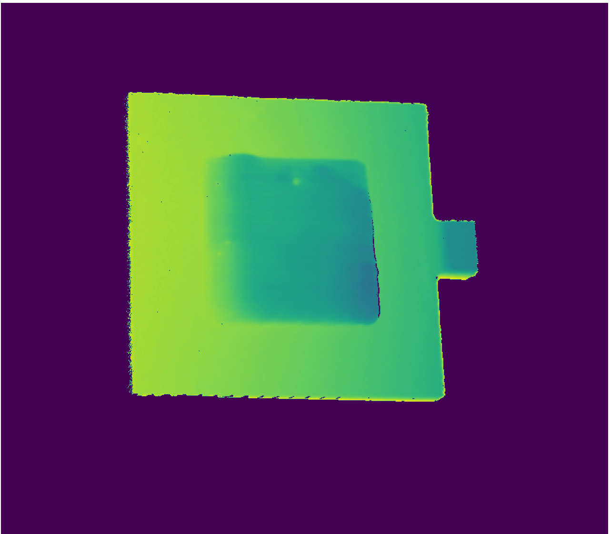
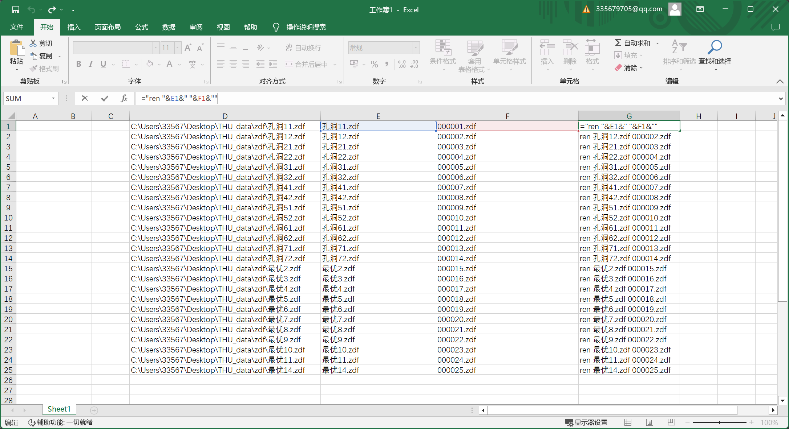

# 软件集成
## 大概框图


要注意随时能加入进程不能写死
注意硬件配置，内存占用等等

## 界面修改
默认设置修改，最好是修改保存
主页面要按操作流程来
一些结果的观测在一个界面
保存在一个文件夹下，保存为视频
## 工控机环境 


## 制作dll

```cpp
#include "print.h"
#include <iostream>
using namespace std;


void Print::print_int(int x)
{
	cout << "C++打印输出：" << x << endl;
}

Print print;

void print_int(int x)
{	

	print.print_int(x);
}
```

```h
#pragma once
#define MATHLIBRARY_API __declspec(dllexport)

 class  Print
{
public:
	void print_int(int x);
};

extern "C" void  MATHLIBRARY_API print_int(int x);
```

```python
import ctypes  
import time
dll = ctypes.WinDLL(r"D:\工作重要文件\c\mydll\Dll2_easy\x64\Debug\Dll2_easy.dll")  # 调用了这个dll
print("加载dll成功")

print_int = dll.print_int
print_int(5)

print("over")
```

## pythond调用dll

### ctype

python调用c++结构体时候python的定义

```
# \~chinese 枚举类型值    \~english Enumeration Value
class _MVCC_ENUMVALUE_T(Structure):
    pass
_MVCC_ENUMVALUE_T._fields_ = [
    ('nCurValue', c_uint),                               
    ('nSupportedNum', c_uint),              
    ('nSupportValue', c_uint * MV_MAX_XML_SYMBOLIC_NUM), 
    ('nReserved', c_uint * 4),    
]
MVCC_ENUMVALUE = _MVCC_ENUMVALUE_T
```

```
auto_mode = MVCC_ENUMVALUE()
memset(byref(auto_mode), 0, sizeof(MVCC_ENUMVALUE))
ret = self.obj_cam.MV_CC_GetEnumValue("ExposureAuto", auto_mode)
auto_mode.nCurValue
```
### pybind11


## 打包

[Nuitka打包教程](https://blog.csdn.net/wenxingchen/article/details/128112544)  
编码错误    `set PYTHONIOENCODING=utf-8`  
[第三方不编译--b站](https://www.bilibili.com/video/BV1fT411u7gx/?spm_id_from=333.337.search-card.all.click&vd_source=eef102f4fb053709a57c96d0c876628a
)
[第三方不编译](https://mp.weixin.qq.com/s?__biz=MzA4MjEyNTA5Mw==&mid=2652596403&idx=1&sn=4f80c0bc191c732f77eda7eb5ce13b43&chksm=846540f9b312c9efd505013aa3a53441e3d75b4be4995a778ba864fef0766a2453d761f93016&scene=27)

### 增量编译
要使用 Nuitka 的增量编译功能，请使用 --follow-imports 或 -f 选项运行 Nuitka，并在每次更改代码后运行增量编译命令。增量编译命令只会重新编译发生更改的文件及其相关的导入文件。

例如，可以使用以下命令进行增量编译：

nuitka --nofollow-imports your_script.py  (没试过会不会删)

### 软件打包
```
set PYTHONIOENCODING=utf-8
```
```
nuitka --mingw64 --standalone --show-progress --show-memory --output-dir=installer --enable-plugin=pyside2 --include-qt-plugins=sensible,styles --nofollow-import-to=QTui,src main.py
```
把site_pack全部copy进去，lib一个个copy
就不会缺plugin
cv2是拷贝的py37的环境
  

### 采集卡demo打包
```
nuitka --mingw64 --standalone --show-progress --show-memory --output-dir=out  main.py
```
```
D:\\soft\\Anaconda\\envs\\py37\\Scripts\\pyside2-uic -o  E:\Work\THU\code\ZIVID_HIK\QTui\module\ui_main.py E:\Work\THU\code\ZIVID_HIK\QTui\main.ui
```


# ZIVID软件
## 参数功能
### 曝光时间


### 光圈大小越大越暗


### 曝光越大越亮


### 亮度（发出结构光的光的亮度）

### 两组正常

### 两组都很烂


商家说了手动的多个参数是最后合成出来的结果
自动模式是多个建议的参数，最后一个不是最优的参数


## SDK
### guithub
[Point Cloud Tutorial](https://github.com/zivid/zivid-python-samples/blob/b66ba234bbddbc48bd2a089792a2ad375d9d459a/source/applications/point_cloud_tutorial.md)
[Samples list](https://github.com/zivid/zivid-python-samples/tree/b66ba234bbddbc48bd2a089792a2ad375d9d459a)
[文档](https://support.zivid.com/en/latest/academy/applications/normals.html)
安装SDK必须要管理员权限
### mayavi API
[mayavi API](https://blog.csdn.net/surtol/article/details/118682566)
### 显示
[display](https://github.com/zivid/zivid-python-samples/blob/b66ba234bbddbc48bd2a089792a2ad375d9d459a/source/sample_utils/display.py)


解方程
```python
import numpy as np
from scipy.linalg import solve
#输出系数矩阵
a=np.array([[3,1,-2],[1,-1,4],[2,0,3]])
#值
b=np.array([1,1,1])
#计算
x=solve(a,b)
#打印结果
print(x)
```


# 设备架设
排风扇水平 14度
34
  
相机还是仰头更清楚，放在上方，左右角度大已经试了好几次了，不明显，

# 数据处理
## zivid数据
xyz的基坐标就是在相机原点，由于相机是斜的而且有噪点，所以用高度过滤无法滤除

点云和kitti数据集一样是有规律的
（2304000，3）个点云
1920*1200 像素格式w,h


所以还是一样的点云格式是由上到下行扫描的
只有图像检测矩阵填充蒙版，然后计算点云index进行过滤(图像方法不靠谱，其他物体和检测不准)
找到斜面去切割或者点云的旋转和平移√（每一次假设输入三个点坐标标定一次，找到平面方程，应该不复杂）


## 其他数据格式的图片
### SNR 信噪比图  
### Normal  法线贴图


```python
def save_img(id) -> None:

        data_file = r"C:\Users\33567\Desktop\THU_data\zdf/" + str(id) + ".zdf"
        frame = zivid.Frame(data_file)

        print("Getting point cloud from frame")
        point_cloud = frame.point_cloud()
        xyz = point_cloud.copy_data("xyz")
        rgba = point_cloud.copy_data("rgba")
        # snr = frame.point_cloud().copy_data("snr")
        normals = frame.point_cloud().copy_data("normals")
        print(normals.shape)
        height = frame.point_cloud().height
        width = frame.point_cloud().width

        # normals[normals < 0.] = 0.  # 即将小于1.0的数全都变成0
        normals = np.abs(normals)

        normals = normals * 255.  # [0,1]->[0,255]
        normals = np.uint8(normals)

        plt.imshow(normals)
        plt.axis('off')
        normals = normals[:, :, (2, 0, 1)]
        cv2.imwrite(r"C:\Users\33567\Desktop\THU_data\normal/" + str(id) + ".png", normals)
```

### 压缩后的深度
```python
def view_deepmap(points):
    """
    输入点云
    输出深度图
    """
    img = points[:, 2].reshape((1200, 1920))
    mask = (./img/img != 0)
    mean = (./img/img[mask].mean())
    h = mean + 10
    l = mean - 10
    img = (./img/img-l)/20
    mask0 = img > 1
    mask1 = img < 0
    img[mask0] = np.array([0])
    img[mask1] = np.array([0])

    plt.imshow(./img/img)
    plt.axis('off')
    plt.show()
```


## 图像显示和保存格式
[保存图必须放到0-255不然0-1就是全黑的](https://blog.csdn.net/qq_40682833/article/details/124049695)  

[亮度、饱和度、对比度、灰度](https://blog.csdn.net/suixinger_lmh/article/details/125314512)

[注意：（对超出范围的像素值进行舍弃的操作）只针对多通道图像（RGB、RGBA），单通道图像有负数也不会舍弃](https://blog.csdn.net/weixin_42899627/article/details/111829102)

它会按照数值的大小映射到颜色序列上（参考下面的例子像素值-100对应紫色，100对应黄色）

cv2保存的是BGR的R都是负值全部裁掉了  
PIL显示是RGB的B都被裁掉了

## 批量重命名


ctrl+e
="ren "&E1&" "&F1&""  
修改bat ANSI

## 数据增强

[yolov7数据增强,很好用](https://blog.csdn.net/qq_40481270/article/details/128462694)   

[yolov7自带数据增强参数说明](https://blog.csdn.net/Hoshea_sun/article/details/129352251)

## 打标签
[数据集制作，很好用，labelimg](https://blog.csdn.net/m0_61438337/article/details/128019914  )

# 检测
## YoloV7
### 输入参数
[输入命令参数](https://blog.csdn.net/m0_67089871/article/details/128686711)
数据会内部resize成640*640
```
python train.py --workers 2 --device 0 --batch-size 2 --data data/hole.yaml --img 1920 1920 --cfg cfg/training/yolov7.yaml 

(py37wk) vip416@vip416-System-Product-Name:/mnt/data02/wk/THU_datasets/yolov7$ python train_aux.py --workers 1 --device 0 --batch-size 4 --data data/hole.yaml --img 800 800 --cfg cfg/training/yolov7e6e.yaml --weights '' --name yolov7e6e --hyp data/hyp.scratch.p5.yaml
```
On video:
```
python detect.py --weights yolov7.pt --conf 0.25 --img-size 640 --source yourvideo.mp4
# python detect.py --weights yolov7.pt --conf 0.25 --img-size 640 --source inference/images/2.mp4
```
On image:
```
python detect.py --weights ./runs/train/exp42/weights/best.pt --conf 0.3 --img-size 1280 --source /mnt/data02/wk/THU_datasets/dataset6/images/val2007
```
***!!!!!train_aug的标签不能为空***

### dataset0未数据增强
  

### dataset1代码增强未裁切
  


1. 改进yolo的resize640到更大
2. 图片预处理剪裁出来关键部分
3. 把一些不明显的洞表defect，明显的洞标hole
yolov7的img_size的大小设的不同可以用同一个训练的权重pt进行推理，  
但是结果不一样，  
送入检测的大小也不一样,不是越大越好，要和训练类似  
检测速度也不一样    


### dataset2手动裁切

**但训练集和验证集的板子混在了一起**

  

### dataset3分开后效果一般

**下一次需要yolo数据增强**

### dataset4用yolo里面的dataloader进行增强

直接复制20多分

[yolo dataloader数据增强](https://blog.csdn.net/Hoshea_sun/article/details/129352251)

训练用1280效果应该是要好一点的但是慢一点

### deepdatasets

0.45面积的放缩255，弃了，面积不好控制


-6 7.5 0.15


-7 7.5 0.15
### dataset5-1 改善的深度图和rgb在一起

**拍摄角度在中间正上方，多角度拍摄 800**

### dataset6-1 海康相机 1280 倒数2，3作为验证集
  
1280*1280置信度又出现比较低


### dataset5-2 
和dataset5-1的改动：
改为1280 倒数2，3作为验证集再和6对比
==调整数据增强==
```
mosaic: 1.0  # image mosaic (probability)
mixup: 0  # image mixup (probability)
copy_paste: 1 # image copy paste (probability)
paste_in: 0.15  # image copy paste (probability), use 0 for faster training
loss_ota: 1 # use ComputeLossOTA, use 0 for faster training
```

### dataset6-2 海康相机 数据增强调整之后 1920
置信度低

### dataset6-3 海康相机  数据增强调整之后 1280
置信度高

### dataset7 结构光相机rgb不打光 1280

### rgb检测不太需要aux，缺少同轴光源
感觉其实不太需要aux
  
反光的工件需要，缺少同轴光源


### train_aux踩坑(最后还是不知道为什么会nan)
**ComputeLossAuxOTA就不能用，ComputeLossOTA会listout of range**

train_aux 360a行修改为如下，跳过没有目标的target
```
with amp.autocast(enabled=cuda):
                pred = model(imgs)  # forward
                # print(pred, targets.to(device))
                if targets.to(device).size()[0]==0:
                    loss, loss_items = torch.Tensor([0.0]).to(device), torch.Tensor([0.0, 0.0, 0.0, 0.0]).to(device)
                    continue
                else:  
                    loss, loss_items = compute_loss_ota(pred, targets.to(device), imgs)  # loss scaled by batch_size
                if rank != -1:
                    loss *= opt.world_size  # gradient averaged between devices in DDP mode
                if opt.quad:
                    loss *= 4.
```

ComputeLossAuxOTA的__call__的build_targets和build_targets2的最后改为==try==
```
            for i in range(nl):
                layer_idx = from_which_layer == i
                matching_bs[i].append(all_b[layer_idx])
                matching_as[i].append(all_a[layer_idx])
                matching_gjs[i].append(all_gj[layer_idx])
                matching_gis[i].append(all_gi[layer_idx])
                matching_targets[i].append(this_target[layer_idx])
                matching_anchs[i].append(all_anch[layer_idx])

        for i in range(nl):
            try:
                matching_bs[i] = torch.cat(matching_bs[i], dim=0)
                matching_as[i] = torch.cat(matching_as[i], dim=0)
                matching_gjs[i] = torch.cat(matching_gjs[i], dim=0)
                matching_gis[i] = torch.cat(matching_gis[i], dim=0)
                matching_targets[i] = torch.cat(matching_targets[i], dim=0)
                matching_anchs[i] = torch.cat(matching_anchs[i], dim=0)
            except:
                pass

        return matching_bs, matching_as, matching_gjs, matching_gis, matching_targets, matching_anchs
```

后面__call__加上  ==if len(b)!=0:==
```
# Losses
        for i in range(self.nl):  # layer index, layer predictions
            pi = p[i]
            pi_aux = p[i+self.nl]
            b, a, gj, gi = bs[i], as_[i], gjs[i], gis[i]  # image, anchor, gridy, gridx
            b_aux, a_aux, gj_aux, gi_aux = bs_aux[i], as_aux_[i], gjs_aux[i], gis_aux[i]  # image, anchor, gridy, gridx
            tobj = torch.zeros_like(pi[..., 0], device=device)  # target obj
            tobj_aux = torch.zeros_like(pi_aux[..., 0], device=device)  # target obj
            
            if len(b)!=0:
                n = b.shape[0]  # number of targets
                n_aux = b_aux.shape[0]  # number of targets
                ps = pi[b, a, gj, gi]  # prediction subset corresponding to targets
                ps_aux = pi_aux[b_aux, a_aux, gj_aux, gi_aux]  # prediction subset corresponding to targets

                # Regression
```


## 多视角配准
### 图像仿射变换
[Python+Opencv4点仿射变换](https://blog.csdn.net/WZZ18191171661/article/details/99174861)
[函数](https://blog.csdn.net/darren_ying0803/article/details/126994020)

  
反射变换要去同一平面，不是一个平面结果有视差的
图像匹配矫正也是太黑特征点不足

### 图像配准
[书的矫正](https://moonapi.com/news/14289.html )
[四个图示意的](https://www.zhuxianfei.com/python/44928.html)

### 点云匹配旋转
[open3d文档](http://www.open3d.org/docs/release/)
```
diff = ang / 90
source_indices = np.array([0, 1, 2, 3])
target_indices = np.array([(0 + diff) % 4, (1 + diff) % 4, (2 + diff) % 4, (3 + diff) % 4])

# 创建Vector2iVector对象并填充数据
correspondence = o3d.utility.Vector2iVector()
for i in range(len(source_indices)):
    correspondence.append([source_indices[i], target_indices[i]])

registration = o3d.pipelines.registration.TransformationEstimationPointToPoint(True)
matrix = registration.compute_transformation(source_pcd, target_pcd, correspondence)
```

左右角度大没有用，还是得仰头拍
  

## 标定方法

[怎么计算一个相机图片的像素位置对应的另一个相机的对应相同位置](https://blog.csdn.net/qq_31112205/article/details/129047100)

[标定示意图](https://blog.csdn.net/qq_39448233/article/details/116785480)
  
  

### [立体匹配](https://blog.csdn.net/liulina603/article/details/53302168?spm=1001.2101.3001.6650.2&utm_medium=distribute.pc_relevant.none-task-blog-2%7Edefault%7ECTRLIST%7ERate-2-53302168-blog-124352648.235%5Ev38%5Epc_relevant_sort_base2&depth_1-utm_source=distribute.pc_relevant.none-task-blog-2%7Edefault%7ECTRLIST%7ERate-2-53302168-blog-124352648.235%5Ev38%5Epc_relevant_sort_base2&utm_relevant_index=5)

应该没有实验过

```python
# chatgpt
import cv2
import numpy as np

# 加载相机标定参数
# 你需要事先进行相机标定并获取相机的内参和外参
# 左相机内参
left_camera_matrix = np.array([[fx_l, 0, cx_l],
                               [0, fy_l, cy_l],
                               [0, 0, 1]], dtype=np.float64)
left_dist_coeffs = np.array([k1_l, k2_l, p1_l, p2_l, k3_l], dtype=np.float64)
# 右相机内参
right_camera_matrix = np.array([[fx_r, 0, cx_r],
                                [0, fy_r, cy_r],
                                [0, 0, 1]], dtype=np.float64)
right_dist_coeffs = np.array([k1_r, k2_r, p1_r, p2_r, k3_r], dtype=np.float64)
# 双目相机的旋转矩阵和平移向量
rotation_matrix = np.array([[r11, r12, r13],
                            [r21, r22, r23],
                            [r31, r32, r33]], dtype=np.float64)
translation_vector = np.array([[t1], [t2], [t3]], dtype=np.float64)

# 创建立体校正映射
image_size = (image_width, image_height)  # 图像大小
# 根据标定参数计算立体校正映射
left_map1, left_map2, right_map1, right_map2, _, _ = cv2.stereoRectify(
    left_camera_matrix, left_dist_coeffs,
    right_camera_matrix, right_dist_coeffs,
    image_size, rotation_matrix, translation_vector)

# 加载左相机图像
left_image = cv2.imread('left_image.jpg', 0)  # 灰度图像

# 使用立体校正映射将左相机图像校正为视差图
rectified_left_image = cv2.remap(left_image, left_map1, left_map2, cv2.INTER_LINEAR)

# 加载右相机图像
right_image = cv2.imread('right_image.jpg', 0)  # 灰度图像

# 使用立体校正映射将右相机图像校正为视差图
rectified_right_image = cv2.remap(right_image, right_map1, right_map2, cv2.INTER_LINEAR)

# 计算视差图
# 可以使用不同的立体匹配算法，如SAD、SSD、NCC等
# 这里使用了BM（块匹配）算法作为示例
block_size = 15  # 块大小
min_disparity = 0  # 最小视差值
num_disparities = 16  # 视差值的范围
stereo_bm = cv2.StereoBM_create(numDisparities=num_disparities, blockSize=block_size)
disparity_map = stereo_bm.compute(rectified_left_image, rectified_right_image)

# 根据视差图计算像素位置对应关系
# 假设要计算左相机中像素位置(x_l, y_l)在右相机中的对应位置

x_l = 100  # 左相机中的像素横坐标
y_l = 200  # 左相机中的像素纵坐标

# 获取视差值
disparity = disparity_map[y_l, x_l]

# 计算对应的右相机像素位置
x_r = x_l - disparity

# 打印结果
print("在左相机中的像素位置 (", x_l, ",", y_l, ") 对应的右相机像素位置为 (", x_r, ",", y_l, ")")
```

### 联合标定√

```python
import cv2
import numpy as np
import open3d as o3d
from mayavi import mlab

# 标定板内点个数
(grows, gcols) = (11, 8)


def show_img(img):
    """
    显示图片
    :param img:
    :return:
    """
    cv2.imshow("img", img)
    # 等待用户按下任意键，然后关闭窗口
    cv2.waitKey(0)
    cv2.destroyAllWindows()


def show_project_res(projected_points, img):
    """
    显示投影结果
    :param projected_points: 投影到图像的像素位置
    :param img: img
    :return:
    """
    # 指定圆的颜色（BGR 格式，红色为 (0, 0, 255)）
    color = (0, 0, 255)
    # 指定线条宽度（如果为-1，则填充圆）
    thickness = 1
    # 遍历像素坐标列表并在每个位置绘制圆圈
    for (x, y) in np.squeeze(projected_points, axis=1):
        center = (int(x), int(y))
        radius = 2  # 圆的半径，根据需要调整
        cv2.circle(img, center, radius, color, thickness)
    show_img(img)
    return


def show_point(*points_list):
    """
    显示点云
    :param points_list:
    :return:
    """
    fig = mlab.figure("point", bgcolor=(0, 0, 0), size=(1650, 1500))

    for i, points in enumerate(points_list):
        x = points[:, 0]  # x position of point
        y = points[:, 1]  # y position of point
        z = points[:, 2] + i * 0.01  # z position of point
        colors = [(1, 0, 0), (0, 1, 0), (0, 0, 1)]

        mlab.points3d(x, y, z,
                      scale_factor=0.1 + 0.2 * i,
                      # z,
                      color=colors[i],  # Values used for Color
                      # mode="point",
                      mode="sphere",
                      colormap='spectral',  # 'bone', 'copper', 'gnuplot'
                      # color=(0, 1, 0),   # Used a fixed (r,g,b) instead
                      figure=fig,
                      )

    mlab.show()


def get_datas(hik_path, zivid_rgb_path, point_path):
    """
    读取获得一组数据
    :param hik_path:
    :param zivid_rgb_path:
    :param point_path:
    :return:
    """
    hik_img = cv2.imread(hik_path)
    # hik_img = cv2.resize(hik_img, (hik_img.shape[1] // 2, hik_img.shape[0] // 2))
    hik_img = cv2.resize(hik_img, (hik_img.shape[1], hik_img.shape[0]))
    zivid_rgb = cv2.imread(zivid_rgb_path)
    # 读取PLY文件
    pts = o3d.io.read_point_cloud(point_path)
    # 访问PLY数据
    _ = np.asarray(pts.points)
    pts = _.copy()
    # 点云resize和点云rgb一样的shape
    pts = np.resize(pts, (zivid_rgb.shape[0], zivid_rgb.shape[1], 3))
    return hik_img, zivid_rgb, pts


def detect_corner(img):
    """
    标定板检测角点
    :param img:
    :return: 角点np数组
    """

    # 查找标定板角点
    gray = cv2.cvtColor(img, cv2.COLOR_BGR2GRAY)
    found, corners = cv2.findChessboardCorners(gray, (gcols, grows), None)

    # 如果找到了角点
    if found:
        # 绘制角点并显示图像
        cv2.drawChessboardCorners(img, (grows, gcols), corners, found)
        # show_img(img)
        return np.squeeze(corners, axis=1)  # 去除第二个维度
    else:
        print("未找到标定板角点。")
        return False


# 定义一个函数来执行相机标定
def calibrate_camera(object_points, image_points, img):
    """

    :param object_points: xyz点
    :param image_points: 图像点
    :param img: 图像
    :return: camera_matrix, dist_coeffs
    """
    # 进行相机标定
    gray = cv2.cvtColor(img, cv2.COLOR_BGR2GRAY)
    # 创建一个初始的相机内部矩阵
    # 初始内部矩阵（您应该用实际的相机参数替换这些值）
    fx = 1000.0  # 像素的焦距（x轴）
    fy = 1000.0  # 像素的焦距（y轴）
    cx = 640.0  # 像素的主点（x轴）
    cy = 480.0  # 像素的主点（y轴）

    # 创建初始内部矩阵
    camera_matrix = np.array([[fx, 0, cx],
                              [0, fy, cy],
                              [0, 0, 1]])

    # 畸变系数（您应该用实际的值替换这些值）
    dist_coeffs = np.zeros((4, 1))

    retval, camera_matrix, dist_coeffs, rvecs, tvecs = cv2.calibrateCamera(
        objectPoints=object_points,
        imagePoints=image_points,
        imageSize=gray.shape[::-1],  # 图片尺寸
        cameraMatrix=camera_matrix,  # 如果已知内参，可以在这里提供
        distCoeffs=dist_coeffs,  # 如果已知畸变参数，可以在这里提供
        # flags=cv2.CALIB_RATIONAL_MODEL  # 可以选择使用更高级的标定模型
        flags=(cv2.CALIB_USE_INTRINSIC_GUESS + cv2.CALIB_FIX_PRINCIPAL_POINT)
        # ！！！opencv版本  3.4.2.16和flag不同会报错
    )

    return camera_matrix, dist_coeffs


# 定义一个函数来估计相机的外部参数
def estimate_camera_pose(points_3d, points_2d, camera_matrix, dist_coeffs):
    """

    :param points_3d: xyz角点
    :param points_2d: 角度像素位置
    :param camera_matrix:
    :param dist_coeffs:
    :return: rvec, tvec
    """
    # 使用solvePnP函数估计相机的外部参数
    retval, rvec, tvec = cv2.solvePnP(points_3d, points_2d, camera_matrix, dist_coeffs)
    # https://blog.csdn.net/qq_36187544/article/details/102626629
    return rvec, tvec


def test_run_calib(show=False):
    hik_imgs, zivid_points, zivid_rgbs = [], [], []
    for i in range(1, 5):
        # hik被投影的图像
        hik_imgs.append(r"C:\Users\33567\Desktop\calib/hik/%06d.jpg" % i)
        # 点云路径
        zivid_points.append(r"C:\Users\33567\Desktop\calib/point/%06d.ply" % i)
        # 点云rgb路径
        zivid_rgbs.append(r"C:\Users\33567\Desktop\calib/zivid_rgb/%06d.jpg" % i)
    rvec, tvec, camera_matrix, dist_coeffs = run_calib(hik_imgs, zivid_points, zivid_rgbs, show=show)
    return rvec, tvec, camera_matrix, dist_coeffs

def run_calib(hik_imgs, zivid_points, zivid_rgbs, show=False):
    all_point_corners = []
    all_img_corners = []

    for i in range(0, len(hik_imgs)):
        print("%06d" % i)
        point_corners = []

        hik_img, zivid_rgb, pts = get_datas(hik_imgs[i], zivid_rgbs[i], zivid_points[i])  # pts[1200,1920]
        zivid_rgb_corners = detect_corner(zivid_rgb)
        hik_img_corners = detect_corner(hik_img)

        # zivid_rgb_corners像素点转对应的xyz点point_corners
        if zivid_rgb_corners is not False:
            for i in range(zivid_rgb_corners.shape[0]):
                w = int(zivid_rgb_corners[i][0])
                h = int(zivid_rgb_corners[i][1])
                # print(w, h)
                while np.isnan(pts[int(h)][int(w)][0]):
                    h += 1
                    w += 1
                point_corners.append(pts[int(h)][int(w)])

        all_point_corners.append(point_corners)
        all_img_corners.append(hik_img_corners)
        # show_point(pts[::5, ::5].reshape((-1, 3)), corner_points)

    all_point_corners = np.asarray(all_point_corners, dtype=np.float32)
    all_img_corners = np.asarray(all_img_corners, dtype=np.float32)

    camera_matrix, dist_coeffs = calibrate_camera(all_point_corners, all_img_corners, hik_img)
    # 打印相机内参和畸变参数
    print("Camera Matrix (Intrinsic Parameters):")
    print(camera_matrix)
    print("\nDistortion Coefficients:")
    print(dist_coeffs)

    rvec, tvec = estimate_camera_pose(all_point_corners[0], all_img_corners[0], camera_matrix, dist_coeffs)
    # 打印外部参数
    print("Rotation Vector (rvec):")
    print(rvec)
    print("Translation Vector (tvec):")
    print(tvec)

    # 现在你已经有了相机的内参和畸变参数，可以使用它们将点云坐标投影到像素坐标

    for i in range(0, len(hik_imgs)):
        new_element = np.array([20.81854, -17.99710, 398.91553])
        cloud_point = all_point_corners[i]
        cloud_point = np.append(cloud_point, [new_element], axis=0)
        # 使用solvePnP估计的外部参数（rvec和tvec）和相机内参将3D点投影到像素坐标
        projected_points, _ = cv2.projectPoints(cloud_point.reshape(1, -1, 3), rvec, tvec, camera_matrix, dist_coeffs)
        # projected_points是投影后的2D像素坐标
        print("Projected 2D Pixel Coordinates:")

        hik_img, zivid_rgb, pts = get_datas(hik_imgs[i], zivid_rgbs[i], zivid_points[i])
        if show:
            show_project_res(projected_points, hik_img)
    return rvec, tvec, camera_matrix, dist_coeffs


if __name__ == "__main__":
    test_run_calib(show=True)
```

## PINN
  

# 环境
MVS 4.1/4.0
  

```
(THU) E:\Work\THU\code\ZIVID_HIK>conda list
# packages in environment at D:\Soft\Anaconda\envs\THU:
#
# Name                    Version                   Build  Channel
absl-py                   1.4.0                    pypi_0    pypi
apptools                  5.2.0                    pypi_0    pypi
astor                     0.8.1                    pypi_0    pypi
attrs                     22.2.0                   pypi_0    pypi
backcall                  0.2.0                    pypi_0    pypi
cachetools                5.3.0                    pypi_0    pypi
certifi                   2022.12.7        py37haa95532_0    http://mirrors.tuna.tsinghua.edu.cn/anaconda/pkgs/main
chardet                   5.1.0                    pypi_0    pypi
charset-normalizer        3.0.1                    pypi_0    pypi
click                     8.1.3                    pypi_0    pypi
colorama                  0.4.6                    pypi_0    pypi
configargparse            1.5.3                    pypi_0    pypi
configobj                 5.0.8                    pypi_0    pypi
cycler                    0.11.0                   pypi_0    pypi
dash                      2.8.1                    pypi_0    pypi
dash-core-components      2.0.0                    pypi_0    pypi
dash-html-components      2.0.0                    pypi_0    pypi
dash-table                5.0.0                    pypi_0    pypi
debugpy                   1.6.6                    pypi_0    pypi
decorator                 5.1.1                    pypi_0    pypi
deepxde                   1.8.3                    pypi_0    pypi
entrypoints               0.4                      pypi_0    pypi
envisage                  6.1.1                    pypi_0    pypi
et-xmlfile                1.1.0                    pypi_0    pypi
fastjsonschema            2.16.2                   pypi_0    pypi
flask                     2.2.3                    pypi_0    pypi
fonttools                 4.38.0                   pypi_0    pypi
future                    0.18.3                   pypi_0    pypi
google-auth               2.16.0                   pypi_0    pypi
google-auth-oauthlib      0.4.6                    pypi_0    pypi
grpcio                    1.51.1                   pypi_0    pypi
idna                      3.4                      pypi_0    pypi
importlib-metadata        6.0.0                    pypi_0    pypi
importlib-resources       5.10.2                   pypi_0    pypi
ipykernel                 6.16.2                   pypi_0    pypi
ipython                   7.34.0                   pypi_0    pypi
ipywidgets                8.0.4                    pypi_0    pypi
iso8601                   1.1.0                    pypi_0    pypi
itsdangerous              2.1.2                    pypi_0    pypi
jedi                      0.18.2                   pypi_0    pypi
jinja2                    3.1.2                    pypi_0    pypi
joblib                    1.3.1                    pypi_0    pypi
jsonschema                4.17.3                   pypi_0    pypi
jupyter-client            7.4.9                    pypi_0    pypi
jupyter-core              4.12.0                   pypi_0    pypi
jupyterlab-widgets        3.0.5                    pypi_0    pypi
kiwisolver                1.4.4                    pypi_0    pypi
markdown                  3.4.1                    pypi_0    pypi
markupsafe                2.1.2                    pypi_0    pypi
matplotlib                3.5.3                    pypi_0    pypi
matplotlib-inline         0.1.6                    pypi_0    pypi
mayavi                    4.8.1                    pypi_0    pypi
mouseinfo                 0.1.3                    pypi_0    pypi
mss                       7.0.1                    pypi_0    pypi
nbformat                  5.5.0                    pypi_0    pypi
nest-asyncio              1.5.6                    pypi_0    pypi
nuitka                    1.0.6                    pypi_0    pypi
numpy                     1.21.6                   pypi_0    pypi
oauthlib                  3.2.2                    pypi_0    pypi
open3d                    0.16.0                   pypi_0    pypi
opencv-contrib-python     4.5.1.48                 pypi_0    pypi
opencv-python             3.4.2.16                 pypi_0    pypi
openpyxl                  3.1.1                    pypi_0    pypi
opt-einsum                3.3.0                    pypi_0    pypi
ordered-set               4.1.0                    pypi_0    pypi
packaging                 23.0                     pypi_0    pypi
paddle-bfloat             0.1.7                    pypi_0    pypi
paddlepaddle-gpu          0.0.0.post111            pypi_0    pypi
pandas                    1.1.5                    pypi_0    pypi
parso                     0.8.3                    pypi_0    pypi
pickleshare               0.7.5                    pypi_0    pypi
pillow                    9.4.0                    pypi_0    pypi
pip                       22.3.1           py37haa95532_0    http://mirrors.tuna.tsinghua.edu.cn/anaconda/pkgs/main
pkgutil-resolve-name      1.3.10                   pypi_0    pypi
plotly                    5.13.0                   pypi_0    pypi
ply                       3.11                     pypi_0    pypi
plyfile                   0.7.4                    pypi_0    pypi
prompt-toolkit            3.0.36                   pypi_0    pypi
protobuf                  3.20.2                   pypi_0    pypi
psutil                    5.9.4                    pypi_0    pypi
pyaml                     23.5.8                   pypi_0    pypi
pyasn1                    0.4.8                    pypi_0    pypi
pyasn1-modules            0.2.8                    pypi_0    pypi
pyautogui                 0.9.53                   pypi_0    pypi
pyface                    7.4.4                    pypi_0    pypi
pyflann                   1.6.14                   pypi_0    pypi
pyflann-py3               0.1.0                    pypi_0    pypi
pygetwindow               0.0.9                    pypi_0    pypi
pygments                  2.14.0                   pypi_0    pypi
pymsgbox                  1.0.9                    pypi_0    pypi
pyopengl                  3.1.6                    pypi_0    pypi
pyparsing                 3.0.9                    pypi_0    pypi
pyperclip                 1.8.2                    pypi_0    pypi
pyqtgraph                 0.11.1                   pypi_0    pypi
pyqtguilib                2.2.17.8                 pypi_0    pypi
pyrect                    0.2.0                    pypi_0    pypi
pyrsistent                0.19.3                   pypi_0    pypi
pyscreeze                 0.1.28                   pypi_0    pypi
pyside2                   5.15.2.1                 pypi_0    pypi
python                    3.7.0                hea74fb7_0    http://mirrors.tuna.tsinghua.edu.cn/anaconda/pkgs/main
python-dateutil           2.8.2                    pypi_0    pypi
python-imagesearch        1.2.2                    pypi_0    pypi
python3-xlib              0.15                     pypi_0    pypi
pytweening                1.0.5                    pypi_0    pypi
pytz                      2022.7.1                 pypi_0    pypi
pywin32                   305                      pypi_0    pypi
pyyaml                    6.0                      pypi_0    pypi
pyzmq                     25.0.0                   pypi_0    pypi
requests                  2.28.2                   pypi_0    pypi
requests-oauthlib         1.3.1                    pypi_0    pypi
rsa                       4.9                      pypi_0    pypi
scikit-learn              1.0.2                    pypi_0    pypi
scikit-optimize           0.9.0                    pypi_0    pypi
scipy                     1.7.3                    pypi_0    pypi
seaborn                   0.12.2                   pypi_0    pypi
serial                    0.0.97                   pypi_0    pypi
setuptools                65.6.3           py37haa95532_0    http://mirrors.tuna.tsinghua.edu.cn/anaconda/pkgs/main
shiboken2                 5.15.2.1                 pypi_0    pypi
sip                       6.7.7                    pypi_0    pypi
six                       1.16.0                   pypi_0    pypi
tenacity                  8.2.1                    pypi_0    pypi
tensorboard               2.11.2                   pypi_0    pypi
tensorboard-data-server   0.6.1                    pypi_0    pypi
tensorboard-plugin-wit    1.8.1                    pypi_0    pypi
thop                      0.1.1-2209072238          pypi_0    pypi
threadpoolctl             3.1.0                    pypi_0    pypi
toml                      0.10.2                   pypi_0    pypi
torch                     1.9.0+cu111              pypi_0    pypi
torchvision               0.10.0+cu111             pypi_0    pypi
tornado                   6.2                      pypi_0    pypi
tqdm                      4.64.1                   pypi_0    pypi
traitlets                 5.9.0                    pypi_0    pypi
traits                    6.4.1                    pypi_0    pypi
traitsui                  7.4.3                    pypi_0    pypi
typing-extensions         4.4.0                    pypi_0    pypi
urllib3                   1.26.14                  pypi_0    pypi
vc                        14                            0    http://mirrors.tuna.tsinghua.edu.cn/anaconda/pkgs/free
vs2015_runtime            14.0.25420                    0    http://mirrors.tuna.tsinghua.edu.cn/anaconda/pkgs/free
vtk                       9.2.5                    pypi_0    pypi
wcwidth                   0.2.6                    pypi_0    pypi
werkzeug                  2.2.2                    pypi_0    pypi
wheel                     0.37.1             pyhd3eb1b0_0    http://mirrors.tuna.tsinghua.edu.cn/anaconda/pkgs/main
widgetsnbextension        4.0.5                    pypi_0    pypi
wincertstore              0.2              py37haa95532_2    http://mirrors.tuna.tsinghua.edu.cn/anaconda/pkgs/main
zipp                      3.12.1                   pypi_0    pypi
zivid                     2.8.0.2.9.0              pypi_0    pypi
```
  
  
拍摄参数，训练时候1280，高度比zivid高度低一点，30cm不到


# 新采集卡DAM8888

- 注意模块上标的引脚是错位的，电源是最左边的

  

- AP热点模式   电脑连接采集卡热点信号

  > 热点名称：JY_4cbb55
  >
  > 默认IP：192.168.10.1
  >
  > 默认端口：10000

  

  Wifi 模式配置网址： 192.168.10.1

  账户:admin

  password: admin


通信指令见文档：JY-DAM8888.pdf

```
# !/usr/bin/env python
# -*- coding: utf-8 -*-
# @Time    : 2023/10/31 13:11
# @Author  : mihudan~
# @File    : DAM8888_dll
# @Description :
import time

# !/usr/bin/env python
# -*- coding: utf-8 -*-
# @Time    : 2023/6/27 15:05
# @Author  : mihudan~
# @File    : AC_dll.py
# @Description : 采集卡动态连接调用
# @ c_uint
# nuitka --mingw64 --standalone --show-progress --show-memory --enable-plugin=pyside2 --include-qt-plugins=sensible,styles  --nofollow-imports --output-dir=out  AC_dll.py
# D:\\soft\\Anaconda\\envs\\py37\\Scripts\\pyside2-uic -o  .\DAM8888_widget.py .\DAM8888_widget.ui
# pyside2-rcc ./icon/icon.qrc -o icon_rc.py
from PySide2.QtCore import *
from PySide2.QtGui import *
from PySide2.QtWidgets import *
from QplotWidget import RealTimePlotWidget
from DAM8888_widget import Ui_Form
from DAM8888_dll import *
import sys
import socket
import numpy as np

DEBUG = False
global PlotBuffer
PlotBuffer = np.zeros(5000)


class DIDOINThread(QThread):

    def __init__(self, Mainwindows, DIDO_updatetime):
        super().__init__()
        self.window = Mainwindows
        self.is_running = False
        self.DIDO_updatetime = DIDO_updatetime

    def run(self):
        # self.window.widgets.textBrowser.append("DIDOINThread Open!")
        self.is_running = True
        while self.is_running:
            time.sleep(self.DIDO_updatetime * 0.001)
            self.window.read_DI_state()
            self.window.read_DO_state()

    def stop(self):
        self.is_running = False


class AIINThread(QThread):

    def __init__(self, Mainwindows, AI_updatetime):
        super().__init__()
        self.window = Mainwindows
        self.is_running = False
        self.AI_updatetime = AI_updatetime

    def run(self):
        # self.window.widgets.textBrowser.append("DIDOINThread Open!")
        self.is_running = True
        while self.is_running:
            time.sleep(self.AI_updatetime * 0.001)
            self.window.read_AI_state()

    def stop(self):
        self.is_running = False


class QWidget_Card(QWidget):

    def __init__(self):
        super().__init__()
        # 从文件中加载UI定义
        # 从 UI 定义中动态 创建一个相应的窗口对象
        # 注意：里面的控件对象也成为窗口对象的属性了
        # 比如 self.ui.button , self.ui.textEdit
        # self.ui = QUiLoader().load('windows.ui')
        self.SampleNumber = None
        self.AD_channe_number = None

        self.ui = Ui_Form()
        self.ui.setupUi(self)
        self.widgets = self.ui
        global Card_widgts
        Card_widgts = self.widgets
        self.widgets
        self.show()

        # 悬浮显示提醒
        self.widgets.DO0.setToolTip("采集卡D1，<b>送粉电压确认输出</b>")
        self.widgets.DO1.setToolTip("采集卡D2，<b>激光器电压确认输出</b>")
        self.widgets.DO2.setToolTip("采集卡D3，<b>NULL</b>")
        self.widgets.DO3.setToolTip("采集卡D4，<b>NULL</b>")
        self.widgets.DO4.setToolTip("采集卡D5，<b>NULL</b>")
        self.widgets.DO5.setToolTip("采集卡D6，<b>开始停止取流的ACK信号，发送给kuka</b>")
        self.widgets.DO6.setToolTip("采集卡D7，<b>该信号需要kuka给出，拉高开始取流，拉低停止取流！开始停止取流的ACK信号是D6端</b>")
        self.widgets.DO7.setToolTip("采集卡D8，<b>NULL</b>")
        self.widgets.doubleSpinBox_DCout1.setToolTip("激光器模拟量")
        self.widgets.doubleSpinBox_DCout1.setToolTip("送分电压模拟量")

        # self.widgets.pushButton_startin
        # self.widgets.pushButton_startout

        self.widgets.DO0.toggled.connect(lambda: self.change_DO(0))
        self.widgets.DO1.toggled.connect(lambda: self.change_DO(1))
        self.widgets.DO2.toggled.connect(lambda: self.change_DO(2))
        self.widgets.DO3.toggled.connect(lambda: self.change_DO(3))
        self.widgets.DO4.toggled.connect(lambda: self.change_DO(4))
        self.widgets.DO5.toggled.connect(lambda: self.change_DO(5))
        self.widgets.DO6.toggled.connect(lambda: self.change_DO(6))
        self.widgets.DO7.toggled.connect(lambda: self.change_DO(7))
        self.IP = None
        self.port = None
        self.s = None
        self.widgets.checkBox_openport.stateChanged.connect(self.open_port)
        self.widgets.textBrowser.append(f"{self.s}")
        self.widgets.btn_readDO.clicked.connect(self.read_DO_state)
        self.widgets.btn_readDI.clicked.connect(self.read_DI_state)
        self.widgets.btn_readAI.clicked.connect(self.read_AI_state)

        # 绘图控件
        self.widgets.waveview = RealTimePlotWidget()
        self.widgets.Layout_wave = QVBoxLayout(self.widgets.groupBox_waveview)
        self.widgets.Layout_wave.addWidget(self.widgets.waveview)

        self.is_startin = False

    def startin(self):
        """
        开始读取数据，修改读线程的falg
        :return:
        """
        if not self.is_startin:
            self.is_startin = True
            self.t_in.start()
        else:
            self.is_startin = False
            self.t_in.stop()

    def open_port(self):

        if self.widgets.checkBox_openport.isChecked():
            self.IP = self.widgets.lineEdit_IP.text()
            self.port = self.widgets.spinBox_port.value()
            self.widgets.textBrowser.append(f"IP:{self.IP}")
            self.widgets.textBrowser.append(f"port:{self.port}")
            self.s = socket.socket()
            self.s.connect((self.IP, self.port))
            self.in_thread_DIDO = DIDOINThread(self, self.widgets.spinBox_DIDO_updatetime.value())
            self.in_thread_DIDO.start()

            self.in_thread_AI = AIINThread(self, self.widgets.spinBox_AI_updatetime.value())
            self.in_thread_AI.start()
        else:
            self.in_thread_DIDO.stop()
            self.in_thread_DIDO.quit()
            self.widgets.textBrowser.append("等待in_thread_DIDO线程退出")

            self.in_thread_AI.stop()
            self.in_thread_AI.quit()
            self.widgets.textBrowser.append("等待in_thread_DIDO线程退出")

        # 开始不间断采集

    def change_DO(self, channel):
        DO = getattr(self.widgets, f"DO{channel}")
        if DO.isChecked():
            SetOnRelay(channel, self.s)
            self.widgets.textBrowser.append(f"DO{channel} open!")
        else:
            SetOffRelay(channel, self.s)
            self.widgets.textBrowser.append(f"DO{channel} close!")

    def read_DO_state(self):
        """
        查询继电器状态fe 01 01 21 a184
        21
        高位2   L8L7L6L5第二个灯亮就是L6
        低位1   L4L3L2L1第一个灯亮就是L1
        :return:
        """
        rev = ReadRelay(self.s)
        self.widgets.textBrowser.append(f"查询继电器状态{rev}")
        rev = int(rev, 16)
        for i in range(8):  # 因为 "fe" 表示16个电平，所以有8位
            radio_btn = getattr(self.widgets, f"DO{i}")
            if (rev >> i) & 1:
                radio_btn.setChecked(True)
            else:
                radio_btn.setChecked(False)

    def read_DI_state(self):
        """
        查询DI状态
        :return:
        """
        rev = ReadDI(self.s)
        self.widgets.textBrowser.append(f"查询光耦DI状态{rev}")  # 如果位为1，表示高电平
        rev = int(rev, 16)

        for i in range(8):  # 因为 "fe" 表示16个电平，所以有8位
            radio_btn = getattr(self.widgets, f"DI{i}")
            if (rev >> i) & 1:
                radio_btn.setChecked(True)
            else:
                radio_btn.setChecked(False)

    def read_AI_state(self):
        rev = ReadAI(self.s)
        self.widgets.textBrowser.append(f"查询AI状态{rev}")  # 如果位为1，表示高电平
        bytes = int(rev[4:6], 16)
        ais = []
        for i in range(6, 6 + bytes * 2, 2):
            ai = int(rev[i:i + 2], 16)
            ais.append(ai)
        global PlotBuffer
        PlotBuffer = np.append(PlotBuffer, ais)[len(ais):]
        self.widgets.waveview.update_data(PlotBuffer, self.widgets.comboBox_plotcannel.currentIndex())

    # def set_AI(self):


def boot_windows():
    app = QApplication.instance()
    if app is None:
        app = QApplication(sys.argv)
    window = QWidget_Card()
    sys.exit(app.exec_())


if __name__ == "__main__":
    boot_windows()

```

```
#!/usr/bin/env python
# -*- coding: utf-8 -*-
# @Time    : 2023/10/31 12:35
# @Author  : mihudan~
# @File    : DAM8888
# @Description :

import time
import socket

orders = {
    "SetOnRelay": {
        "0": "fe050000ff009835",
        "1": "fe050001ff00c9f5",
        "2": "fe050002ff0039f5",
        "3": "fe050003ff006835",
        "4": "fe050004ff00d9f4",
        "5": "fe050005ff008834",
        "6": "fe050006ff007834",
        "7": "fe050007ff0029f4",
        "8": "fe050008ff0019f7",
        "9": "fe050009ff004837",
        "10": "fe05000aff00b837",
        "11": "fe05000bff00e9f7",
        "12": "fe05000cff005836",
        "13": "fe05000dff0009f6",
        "14": "fe05000eff00f9f6",
        "15": "fe05000fff00a836"

    },
    "SetOffRelay": {
        "0": "fe0500000000d9c5",
        "1": "fe05000100008805",
        "2": "fe05000200007805",
        "3": "fe050003000029c5",
        "4": "fe05000400009804",
        "5": "fe0500050000c9c4",
        "6": "fe050006000039c4",
        "7": "fe05000700006804",
        "8": "fe05000800005807",
        "9": "fe050009000009c7",
        "10": "fe05000a0000f9c7",
        "11": "fe05000b0000a807",
        "12": "fe05000c000019c6",
        "13": "fe05000d00004806",
        "14": "fe05000e0000b806",
        "15": "fe05000f0000e9c6"
    },
    "ReadRelay": "fe010000000829c3",
    "ReadDI": "fe02000000086dc3",
    "ReadAI": "fe0400000008e5c3",
}


def callPower(s, order):
    # s = socket.socket()
    # s.connect((ip, port))
    Modbus_16 = ""
    for x in range(0, len(order), 2):
        Modbus_16 += chr(int(order[x:x + 2], 16))

    s.send(Modbus_16.encode('ISO-8859-1'))
    reply_16 = s.recv(50)

    reply_temp = ""
    for i in reply_16.decode('ISO-8859-1'):
        reply_temp += "0x%02x" % ord(i)
    reply_temp = reply_temp[2:]
    mb = ""
    while reply_temp:
        mb += reply_temp[0:2]
        reply_temp = reply_temp[4:]
    return mb


# IP = "192.168.10.1"
# port = 10000
# roads = 8

def SetOnRelay(cannel, s):
    order = orders["SetOnRelay"][str(cannel)]
    print("发：", order)
    for i in range(25):
        mb = callPower(s, order)
        print("收：", mb)
        if mb != order:
            continue
        break
    print("第" + str(cannel + 1) + "路打开指令已发送")


def SetOffRelay(cannel, s):
    order = orders["SetOffRelay"][str(cannel)]
    print("发：", order)
    for t in range(25):
        mb = callPower(s, order)
        print("收：", mb)
        if mb != order:
            time.sleep(0.3)
            continue
        break
    print("第" + str(cannel + 1) + "路关闭指令已发送")


def ReadRelay(s):
    order = orders["ReadRelay"]
    print("发：", order)
    for t in range(25):
        mb = callPower(s, order)
        print("收：", mb)
        if mb[0:4] != "fe01":
            time.sleep(0.3)
            continue
        break
    print(f"查询继电器状态{mb}")
    return mb[6:8]


def ReadDI(s):
    order = orders["ReadDI"]
    print("发：", order)
    for t in range(25):
        mb = callPower(s, order)
        print("收：", mb)
        if mb[0:4] != "fe02":
            time.sleep(0.3)
            continue
        break
    print(f"查询光耦DI状态{mb}")
    return mb[6:8]

def ReadAI(s):
    order = orders["ReadAI"]
    print("发：", order)
    for t in range(25):
        mb = callPower(s, order)
        print("收：", mb)
        if mb[0:4] != "fe04":
            time.sleep(0.3)
            continue
        break
    print(f"查询AI状态{mb}")
    return mb

```

# 熔池检测

> 激光熔覆过程中熔池图像的实时检测
> 于 栋，钟敏霖，刘文今，张红军，朱晓峰，何金江
> (清华大学机械工程系先进成形与制造教育部重点实验室，北京100084)
>
> 过程分析：255 阈值   sobel算子 腐蚀 膨胀 


> 粉末激光熔覆熔池行为的视觉监测与特征提取
>
> Vision detection and feature extraction 
>
> of molten pool behavior in powder 
>
> laser cladding
>
> 中值滤波在去除随机噪声   
>
> 董方煜，陈永雄，孔令超， 梁秀兵，王开心 
>
> 军事科学院国防科技创新研究院 ， 长沙理工大学汽车与机械工程学院

> 


## 标定

### 旁轴


左下角程序输出的是：估计的最右边标定板5个格子宽度 40mm = 5*0.8 ,是准确的

### 同轴标定


标定完通过矩阵参数计算，坐下右下两个绿点一共6*0.8 = 4.8mm，准确的


高光区域二值化


高光区域右侧边缘拟合


熔池（热影响）区域二值化


熔池（热影响）区域右侧边缘


椭圆拟合和W计算和估计

## 拟合算法问题

给了108组数据但是很多的熔池的形态，图像整体亮度都有很大的差异

之前的算法可以处理那一组但是无法兼容108组，算法需要优化

1. 椭圆拟合算法不能加约束估计出来的和先验不一致问题
2. 添加先验mask，右侧的弧线难以提取问题


# 同步开发

## SourceTree

[安装](https://blog.csdn.net/qq_43278558/article/details/139946850)


# 极小洞


#1


#2


#2-2


#3-  -1


#3-1


#3-1-2


#3-3


#4


## 

