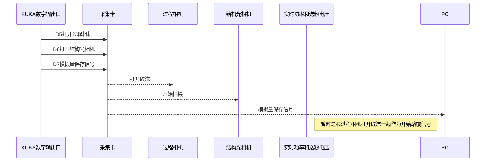
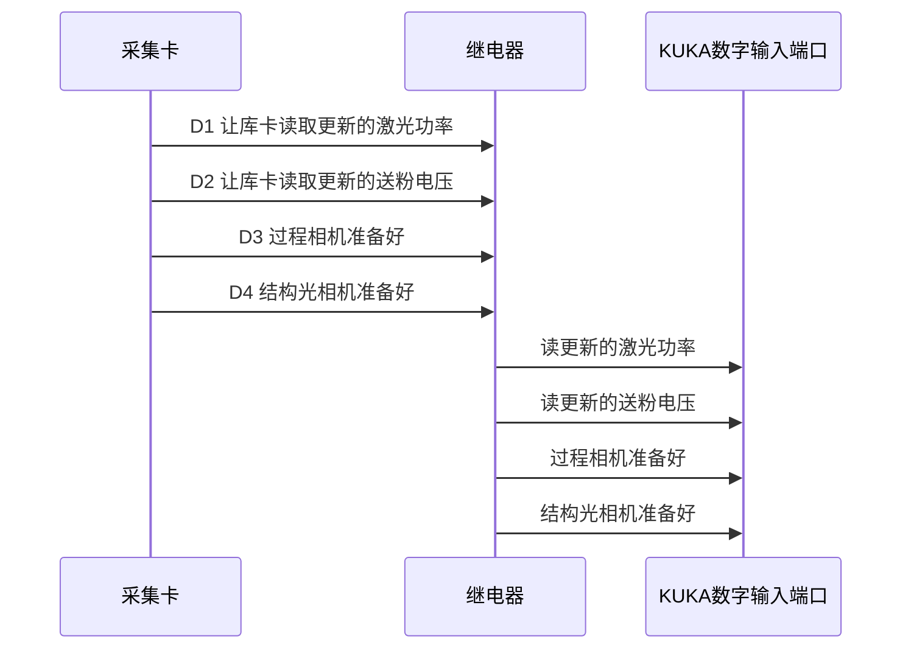

## kuka数字量输出-----接线----采集卡输入端口----功能对应关系


<style>
    td {
        text-align: center; /* 居中水平对齐 */
        vertical-align: middle; /* 居中垂直对齐 */
    }
</style>
<table>
    <th>KUKA数字输出口</th><th>数字量 </th><th>线色</th><th>24V继电器模块</th><th>线色</th><th>采集卡端口</th><th>所控设备或功能</th>
    <tr>
        <td>9</td>
        <td>Process_Camera</td>
        <td>白</td>
        <td>IN 1</td>
        <td>白</td>
        <td>D5</td>
        <td>过程相机(工业/红外/高速)</td>
	<tr>
    <tr>
        <td>10</td>
        <td>3D_Camera</td>
        <td>红</td>
        <td>IN 2</td>
        <td>红</td>
        <td>D6</td>
        <td>结构光相机</td>
	<tr>    
	<tr>
		<td>11</td>
        <td>Power_Powder_Collection</td>
        <td>黑</td>
        <td>IN 3</td>
        <td>黑</td>
        <td>D7</td>
        <td>实时功率和送粉电压保存开关</td>
	<tr>
	<tr>
		<td>12</td>
        <td>Displacement_Collection</td>
        <td>绿</td>
        <td>IN 4</td>
        <td>绿</td>
        <td>D8</td>
        <td>实时位移保存开关</td>
	</tr>
    	<td>地线</td>
    	<td colspan="5">共地，黄绿</td>
    	<td>  </td>
	</tr>
</table>



## kuka数字量输入-----接线----采集卡输出端口----功能对应关系

<style>
    td {
        text-align: center; /* 居中水平对齐 */
        vertical-align: middle; /* 居中垂直对齐 */
    }
</style>
<table>
    <th>采集卡端口</th>
    <th>线色</th>
    <th>5V继电器模块</th>
    <th>线色</th>
    <th>KUKA数字输入端口</th>
    <th>数字量</th>
    <tr>
        <td>D1</td>
        <td>棕</td>
        <td>IN 1</td>
        <td>棕</td>
        <td>9</td>
        <td>Laser_Power_Update</td>
    <tr>
    <tr>
        <td>D2</td>
        <td>黄</td>
        <td>IN 2</td>
        <td>黄</td>
        <td>10</td>
        <td>Powder_V_Update</td>  
    <tr>
    <tr>
        <td>D3</td>
        <td>橙</td>
        <td>IN 3</td>
        <td>橙</td>
        <td>11</td>
        <td>Process_Camera_Ready</td>
    <tr>
    <tr>
        <td>D4</td>
        <td>紫</td>
        <td>IN 4</td>
        <td>紫</td>
        <td>12</td>
        <td>3D_Camera_Ready</td>
    <tr>
    <tr>
        <td>地线</td>
        <td colspan="5">共地，蓝</td>
    <tr>
</table>




## 采集卡模拟输出端口-----接线-----kuka模拟量输入---功能对应关系

<style>
    td {
        text-align: center; /* 居中水平对齐 */
        vertical-align: middle; /* 居中垂直对齐 */
    }
</style>
<table>
    <th>采集卡模拟输出端口</th>
    <th>线色</th>
    <th>KUKA模拟输入端口</th>
    <th>KUKA模拟输入量</th>
    <th>功能</th>
     <tr>
         <td>DA1</td>
        <td>白(+)  绿（地）</td>
        <td>1</td>
        <td>New_Laser_Power</td>
        <td>更新后的激光功率</td>
    <tr>
    <tr>
        <td>DA2</td>
        <td>蓝(+)  蓝（地）</td>
        <td>2</td>
        <td>New_Powder_V</td>
        <td>更新后的送粉电压</td>
    <tr>
</table>

> 注意采集卡模拟量输出把交流选项给关掉


## 采集卡模拟输入端口-----接线-----kuka模拟量输入---功能对应关系

<style>
    td {
        text-align: center; /* 居中水平对齐 */
        vertical-align: middle; /* 居中垂直对齐 */
    }
</style>
<table>
    <th>设备</th>
    <th>线色</th>
    <th>采集卡模拟输入端口</th> 
    <tr>
        <td>粉筒1电压</td>
        <td>棕(+)黑（地）</td>
        <td>AD6</td>
    <tr>
   <tr>
    <td>粉筒2电压</td>
    <td>  </td>
    <td>AD7</td> <tr>
<tr>
    <td>粉筒2电压</td>
    <td>  </td>
    <td>AD8</td>
<tr>


    ```mermaid
     sequenceDiagram
     
    participant 采集卡
    participant KUKA模拟输入端口
    participant 送粉器
    participant 激光器
    
    采集卡->>KUKA模拟输入端口: DA1 让库卡读取更新的激光功率
    采集卡->>KUKA模拟输入端口: DA2 让库卡读取更新的送粉电压
    KUKA模拟输入端口->>激光器: 设置送粉电压
    
    KUKA模拟输入端口->>送粉器: 设置激光功率
    
    
    送粉器->>采集卡: AD6 读送粉电压
    送粉器->>采集卡: AD7 读送粉电压
    送粉器->>采集卡: AD8 读送粉电压
    Note left of 送粉器: ↓模拟量反馈（烧掉了采集卡）↓
    
    
    ```


## 已测试可实现的功能

1. **采集卡数字量的输出**，采集卡输出高电平给继电器就可以

2. **采集卡数字量的读取**，一开始沟通有误，采集卡需要读取电磁继电器的通断，不能读高低电平，电磁继电器输出不了电压信号

   所以在初始化默认读入模式并且拉高，读取与地的接通和断开

3. 采集卡模拟量的输出，正常输出一个模拟量，设置好模拟量后，再拉高对应功能的数字量，让kuka去去读模拟量

4. 触发过程相机（海康相机）采集和数据保存


## 几天的测试遇到的卡住的一些问题，原因，和解决

1. 采集卡输出的数字量被分压，最多只能同时接通2个电磁继电器

   A:不能用一个耦合直流电源供两个直流电压，被分压了

2. 采集卡读取送分电压，设备烧损

   A：采集卡读取的电压其实很小，原因猜测设备不共地，输出电压小，电流大。

   

## 界面优化

1. 界面需要一个主菜单，从上到下最好按照操作的流程排列，不要按传感器分
2. 菜单不需要弹窗和隐藏
3. 过程相机需要和一些采集卡通道的实时采集的模拟量一起显示
4. 结构光相机需要和位移传感器信息一个页面显示
5. 数据保存，按一次采集的数据保存在一个文件夹，也不要要按传感器分
6. 相机需要保存成一个视频，不要保存一帧帧的图片


## 配环境的一些问题

1. zivid==2.8.0.2.9.0 需要装SDK2.9.0，装SDK必须要管理员

2. 点云显示空间的版本固定

   traits==6.4.2
   traitsui==7.4.3
   mayavi==4.8.1
   pyface==7.4.4

3. PINN环境版本

   DeepXDE==1.8.3

   torch==1.9.0+cu111
   torchvision==0.10.0+cu111

4. CUDA11.1

5. PYTHON3.7.0

6. pyface, traitsui, DeepXDE缺少模块需要手动下载放到文件夹

7. 采集卡连不上驱动需要更新 

   


