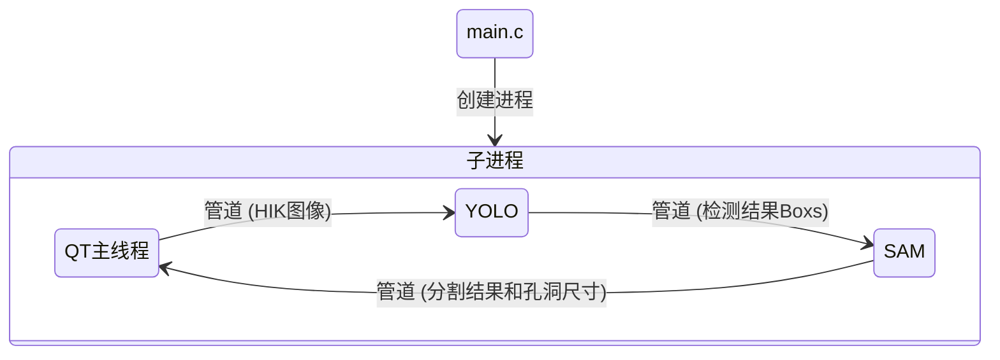
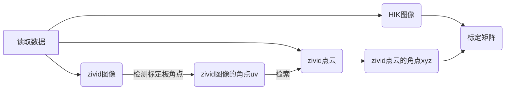
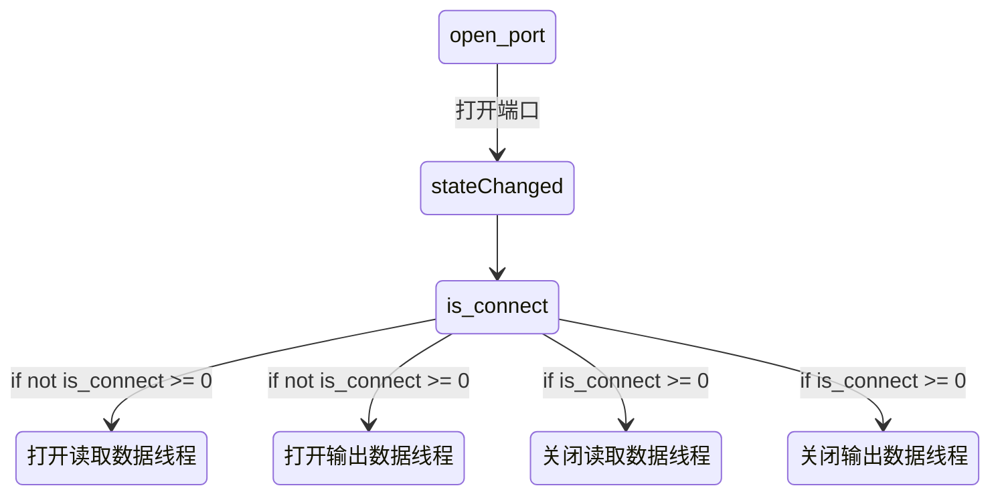
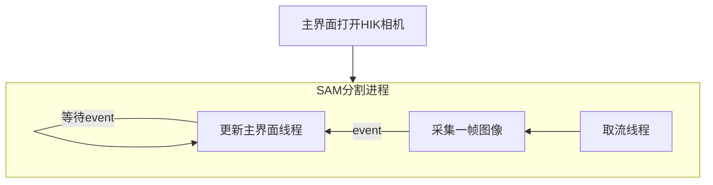
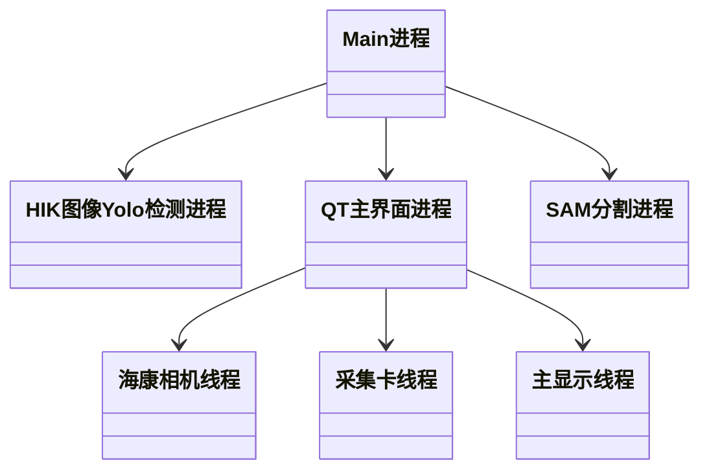
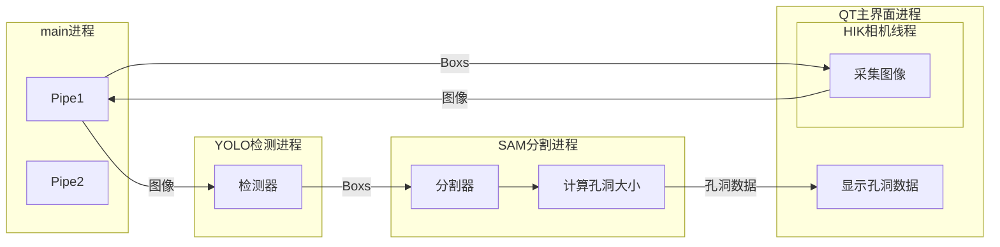
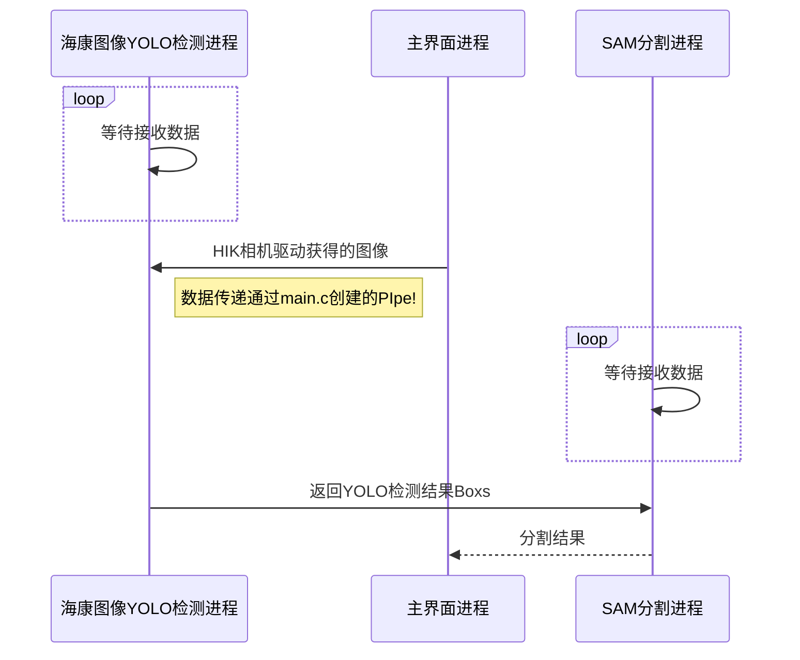
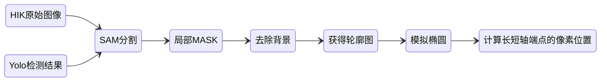
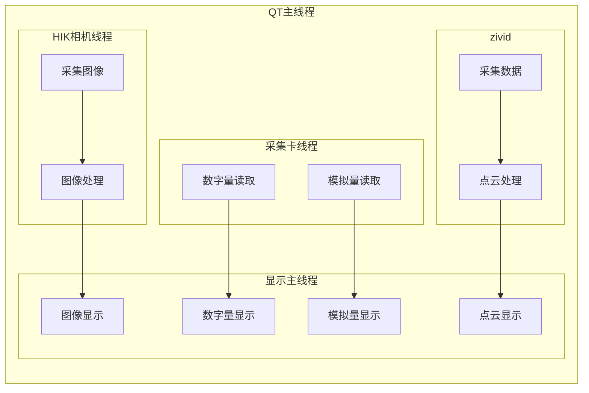

[TOC]

> 说明目录结构部分是按项目工程文件夹划分的，小括号内的内容是文件夹名称，前面为功能说明


# 项目结构

## 目录结构

```

THU_Project_project

│  FileCameraZividOne.zfc
│  list.txt
│  main.py
│  │       
├─data
│  ├─csv   
│  ├─data_hole_size_pts             
│  ├─hik_img
│  │    │  ├─matrix
│  │      camera_matrix1.npy
│  │      dist_coeffs1.npy
│  │      rvec1.npy
│  │      tvec1.npy
│  │      
│  ├─zivid_deepmap     
│  ├─zivid_labels     
│  ├─zivid_points
│  ├─zivid_rgb
│  ├─zivid_ROI_rgb     
│  └─zivid_ROI_rgb_high_ios
├─QTui
│  │  boot_mainwindow.py
│  │  main.ui
│  │  resources.qrc
│  │  resources_rc.py
│  │  setup.py
│  │  工具路径.txt       
│  ├─mywidgets
│  │  │  Imgview.py
│  │  │  parabox.py
│  │  │  parabox.ui
│  │  │  QDoubleSlider.py
│  │  │  QToolBox.py
│  │  │  QToolpage.py
│  │  │  toolpage_ui.py
│  │  │  VisualPointWidget.py
│  │  │  ZividParabox.py
│  │  │  __init__.py
│  ├─QSplashScreen
│  │  │  findwindows.py
│  │  │  GifSplashScreen.py
│  ├─themes
│  │      py_dracula_dark.qss
│  │      py_dracula_light.qss
│  │      py_dracula_light0.qss  
├─src
│  │  __init__.py
│  ├─app
│  │  │  openexe.py
│  │  │  __init__.py
│  │  │  
│  │  └─__pycache__
│  │          openexe.cpython-37.pyc
│  │          __init__.cpython-37.pyc        
│  ├─calib
│  │  │  camera_matrix.npy
│  │  │  camera_matrix1.npy
│  │  │  dist_coeffs.npy
│  │  │  dist_coeffs1.npy
│  │  │  point2rgb.py
│  │  │  project.py
│  │  │  rvec.npy
│  │  │  rvec1.npy
│  │  │  tvec.npy
│  │  │  tvec1.npy      
│  ├─card
│  │  │  0.csv
│  │  │  1693484741.9412816.csv
│  │  │  1693485022.5332139.csv
│  │  │  AC_dll_maltplot.py
│  │  │  AC_dll_pyplot.py
│  │  │  AC_widget.py
│  │  │  AC_widget.ui
│  │  │  load_csv.py
│  │  │  MyQplotWidget.py
│  │  │  MyRealTimePlotWidget.py
│  │  │  QCheckCombox.py
│  │  │  __init__.py         
│  │  ├─DLL_LIB_H
│  ├─db
│  │  │  db.ui
│  │  │  db_ui.py
│  │  │  MysqlViewer.py
│  │  │  sql.py
│  │  │  __init__.py
│  │          
│  ├─dde_temp_torch
│  │  │  Cuboid_temp-25000.pt
│  │  │  loss_Adam_Cuboid_temp.dat
│  │  │  matplot_PINN.py
│  │  │  test.dat
│  │  │  torch_dde_predict.py
│  │  │  torch_dde_temp.py
│  │  │  torch_dde_tmp.ipynb
│  │  │  train_Adam_Cuboid_temp.dat     
│  ├─HIK
│  │  │  BasicDemo.py
│  │  │  CameraParams_const.py
│  │  │  CameraParams_header.py
│  │  │  CamOperation_class.py
│  │  │  MvCameraControl_class.py
│  │  │  MvErrorDefine_const.py
│  │  │  PixelType_header.py
│  │  │  PyUICBasicDemo.py
│  │  │  __init__.py       
│  ├─src_zivid
│  │  │  capture_frame.py
│  │  │  pick_pts.py
│  │  │  __init__.py
│  ├─yolov7
│  │  │  deep_best.pt
│  │  │  detect.py
│  │  │  hik_best.pt
│  │  │  hubconf.py
│  │  │  LICENSE.md
│  │  │  mydetect.py
│  │  │  normal_best.pt
│  │  │  README.md
│  │  │  requirements.txt
│  │  │  test.py
│  │  │  traced_model.pt
│  │  │  train.py
│  │  │  train_aux.py
│  │  │  __init__.py    
├─tool
│      get_hole_pts.py
│      load_pkl.py
│      showply.py
│      show_points.py
│      test_load_zivid.py
│      

```


### main.c

所有程序的入口，创建所有进程和传入Pipe管道用于进程间数据传输




### 保存数据 (data)

存储运行中采集的数据的文件夹

| 子目录        | 说明                             |
| ------------- | -------------------------------- |
| csv           | 存储采集卡模拟量数据             |
| hik_img       | 存储HIK相机采集的图像            |
| matrix        | 存储标定结果矩阵                 |
| zivid_deepmap | 存储深度图                       |
| zivid_labels  | 存储YOLO检测boxs结果             |
| zivid_normal  | 存储ZIVID相机采集的法向量贴图    |
| zivid_points  | 存储ZIVID相机采集的点云          |
| zivid_rgb     | 存储ZIVID相机采集的图像          |
| 工具路径.txt  | ui导出的py文件等qtdegner工具路径 |


### 界面 (QTui)

QT主界面进程的代码都在这部分

#### 自定义控件（mywidgets）

* QToolBox.py

​	由于控制参数控件太多，所以单独弄了一个可以滑动的控件，这个直接写的py文件没有ui文件


* parabox.py												

  由parabox.ui	导出

  

* parabox.ui									

  QTdesigner文件，为结构光相机的n个参数控制Box


* QDoubleSlider.py										

  QT原控件不支持浮点数的spinbox和slider的组合

  


* VisualPointWidget.py

​	点云显示控件部分的代码，是qt嵌入mayavi实现的控件

```python
from traits.api import HasTraits, Instance, on_trait_change
from traitsui.api import View, Item
from mayavi.core.ui.api import MayaviScene, MlabSceneModel, \
    SceneEditor
```

自带点云的可视化和放缩，旋转，彩色和点云大小等显示，和mayavi一样使用

例如boot_mainwindow.py

```python
    def show_points_inbox(self, idx):
        """
        显示点击列表选择的缺陷idx的点云
        Args:
            idx(int): 索引

        Returns:

        """

        points = zivid_camera.datas.get_points_inbox(idx)
        # np.save(f"./data/points/points_{hole_save_idx}.npy", points)

        widgets.mayavi.visualization.scene.mlab.clf()
        x = points[:, 0]  # x position of point
        y = points[:, 1]  # y position of point
        z = points[:, 2]  # z position of point

        widgets.mayavi.visualization.scene.mlab.clf()
        points_mlab = widgets.mayavi.visualization.scene.mlab.points3d(x, y, z,
                                                                       # z,
                                                                       scale_factor=0.2,
                                                                       # color=(r, g, b),  # Values used for Color
                                                                       colormap='spectral',
                                                                       # 'bone', 'copper', 'gnuplot'
                                                                       mode="sphere",
                                                                       # color=(0, 1, 0),   # Used a fixed (r,g,b) instead
                                                                       )
```


* ZividParabox.py

继承自parabox，主要添加了一些信号和限制数值范围


#### 加载界面（QSplashScreen）

其中是显示加载界面的代码部分，是一个wight显示gif，原因是代码调用的库比较多，耗时长，所以弄了一个加载界面

后续有条件应该优化一下其中使用的深度学习模型 导出为onnx格式，这样可以去除一大部分yolo等部分代码，并且加速


#### 主题界面（themes）

其中存放的是界面的风格qss代码部分，有两个风格light和dark，优化的比较美观的是py_dracula_light.qss


boot_mainwindow.py

```
        widgets.settingsTopBtn.clicked.connect(openCloseRightBox)

        # SHOW APP
        # ///////////////////////////////////////////////////////////////

        # SET CUSTOM THEME
        # ///////////////////////////////////////////////////////////////
        useCustomTheme = True
        themeFile = r".\QTui\themes\py_dracula_light.qss"            <-----------------------------------------------------------这里修改使用的风格

        # SET THEME AND HACKS
        if useCustomTheme:
            # LOAD AND APPLY STYLE
            UIFunctions.theme(self, themeFile, True)

            # SET HACKS
            AppFunctions.setThemeHack(self)
```


#### 启动界面文件（boot_mainwindow.py）

QT主界面进程代码和启动入口，还包括启动其中的子线程，包括HIK相机，ZIVID相机，采集卡等子线程的启动和调用

，详细放在后面介绍

#### main.ui


> 可用python版本的 QTdesign打开和编辑
>
> 保存后用   工具路径.txt      中的工具导出到module目录下的ui_main.py文件
>
> 后续在boot_mainwindow.py启动界面主进程的初始化时候导入


### tool

测试或可视化脚本文件

### FileCameraZividOne.zfc

ZIVID虚拟相机文件，调试时候为了方便，使用改文件加载虚拟相机，数据直接从保存的数据读取

### src目录

分目录保存的是一些深度学习模块和相机，采集卡等设备的驱动

#### 第三方软件调用 （app ）

openexe.py

实现打开第三方应用，作为button的信号槽

#### 标定流程（calib ）

核心代码 points2rgb.py

核心代码是通过选择的N组数据实现标定，获取坐标转换矩阵

```python
def run_calib(hik_imgs, zivid_points, zivid_rgbs, down_rate=2, show=False):
    """

    Parameters
    ----------
    hik_imgs 标定使用的HIK图像路径
    zivid_points 标定使用的Zivid点云路径
    zivid_rgbs 标定使用的ZividRGB路径
    down_rate 标定的下采样倍率，如果设置1图像过大结果反而不好
    show 是否显示中间结果
    Returns 坐标转换需要的矩阵
    -------

    """
```



从路径加载所有数据

```
hik_img, zivid_rgb, pts = get_datas(hik_imgs[i], zivid_rgbs[i], zivid_points[i], down_rate)  # pts[1200,1920]
```

检测ZIVID图像上的标定板角度坐标

```

zivid_rgb_corners = detect_corner(zivid_rgb)
```


获得像素对应点云的xyz


检测HIK图像上的标定板角度坐标

```
hik_img_corners = detect_corner(hik_img)
```


然后是用类似激光雷达和相机标定的方法获得 转换矩阵

```python
 # 使用所有的点云和图像角点进行相机标定
    camera_matrix, dist_coeffs = calibrate_camera(all_point_corners, all_img_corners, hik_img)
    # 打印相机内参和畸变参数
    print("Camera Matrix (Intrinsic Parameters):")
    print(camera_matrix)
    print("\nDistortion Coefficients:")
    print(dist_coeffs)

    rvec, tvec = estimate_camera_pose(all_point_corners[0], all_img_corners[0], camera_matrix, dist_coeffs)
```

```python
load_rvec: [[0.19368125]
 [0.0694033 ]
 [0.06721855]]
load_tvec: [[-44.33018445]
 [ 46.93888828]
 [-31.0406001 ]]
load_camera_matrix: [[3.91199119e+03 0.00000000e+00 6.40000000e+02]
 [0.00000000e+00 3.91026020e+03 4.80000000e+02]
 [0.00000000e+00 0.00000000e+00 1.00000000e+00]]
load_dist_coeffs: [[-1.24773595e-01]
 [ 1.13793804e+01]
 [ 6.74136432e-04]
 [ 1.80747657e-03]
 [-2.79380404e+02]]
```

用得到的矩阵把点云投到HIK图像上验证

```python
projected_points, _ = cv2.projectPoints(cloud_point.reshape(1, -1, 3), rvec, tvec, camera_matrix, dist_coeffs)
```


红色为ZIVID相机图像检测到的标定板像素对应点云投影到HIK相机的位置


#### 采集卡驱动（card） 

更换为DAM8888但是还为添加到大框架里


其中会开启两个线程

```python
class DIDOINThread(threading.Thread):
    def __init__(self, DIDO_updatetime):
        threading.Thread.__init__(self)
        self.threadStop = False
        self.DIDO_updatetime = DIDO_updatetime

    def do_run(self):
        global Card_widgts
        while not self.threadStop:
            time.sleep(self.DIDO_updatetime * 0.001)
            Card_widgts.read_DI_state()


class AIINThread(threading.Thread):
    def __init__(self, AI_updatetime):
        threading.Thread.__init__(self)
        self.threadStop = False
        self.AI_updatetime = AI_updatetime

    def do_run(self):
        global Card_widgts
        while not self.threadStop:
            time.sleep(self.AI_updatetime * 0.001)
            AOshow_channel = Card_widgts.widgets.comboBox_plotcannel.currentIndex()
            Card_widgts.read_AI_state()
            print(f"PlotBuffer[{AOshow_channel}]:{PlotBuffer[AOshow_channel]}")
            Card_widgts.widgets.waveview.update_data(PlotBuffer[AOshow_channel], AOshow_channel)

```



#### 数据库驱动（db  ）

### 

| 子目录         | 说明             |
| -------------- | ---------------- |
| db.ui          | qtdesigner文件   |
| db_ui.py       | ui导出的py文件   |
| MysqlViewer.py | 存储标定结果矩阵 |
| sql.py         | 实现SQL类        |

##### sql.py

```python
class SQL(object):
    def __init__(self):
        # 创建connection连接  连接对象
        self.conn = connect(host="localhost", port=3306, user='root', password="root", database='thu', charset='utf8')
        # 获取Cursor对象  游标对象
        self.cursor = self.conn.cursor()

    def __del__(self):
        # 关闭cursor对象
        self.cursor.close()
        self.conn.close()

    def execute_sql(self, sql):
        self.cursor.execute(sql)
        fetchall = self.cursor.fetchall()
        for temp in fetchall:
            print(temp)
        return fetchall

    def show_all_items(self):
        sql = "select * from frame;"
        return self.execute_sql(sql)

    def show_column(self):
        tag = input("input column tag:")
        sql = "select %s from frame;" % tag
        self.execute_sql(sql)

    def add_frame(self, data_list):
        """
        data_list:
            data_path = "/path/to/your/rgb/image.jpg"
            timestemp = datetime.now().strftime('%Y-%m-%d %H:%M:%S')
            exposure = 0.5
            gain = 1.0
            rgb_h = 1080
            rgb_w = 1920
            points_num = 10000
            defect_num = 5
            n0x = 1.0
            n0y = 1080.0
            n0z = 1920.0
        """
```

主要实现

```
__init__       		链接数据库
__del__			断开数据库
execute_sql		执行sqk语句
show_all_items	显示所有数据	
show_column	    显示一列信息
add_frame         添加一行
get_info_by_id	通过输入要查询的frame_id输出一行信息
```

##### MySQLViewer


```
initUI  		加载控件
updateshow	刷新显示
add_frame	添加数据
on_item_double_clicked	双击打印输出
```


#### PINN驱动（dde_temp_torch  ）

PINN_predict模型预测

#### 相机驱动（HIK ）

海康相机驱动程序，提供的接口

详细信息可以看安装MVS后，MVS\Development\Documentations目录下的开发指南





主要修改

```python
def updata_show_hik(mainWindow, Event):
    global obj_cam_operation
    global nSelCamIndex
    while True:
        Event.wait()
        mainWindow.hik_img = np.ascontiguousarray(obj_cam_operation[nSelCamIndex].img_np)
        img = mainWindow.hik_img
        img_Qimage = QImage(img, img.shape[1], img.shape[0], QImage.Format_BGR888)
        img_pix = QPixmap.fromImage(img_Qimage)
        mainWindow.ui.label_hikimg.setScaledContents(True)  # 调用setScaledContents将图像比例化显示在QLabel上
        img_pix = img_pix.scaled(mainWindow.ui.label_hikimg.size(), Qt.KeepAspectRatio)
        mainWindow.ui.label_hikimg.clear()
        mainWindow.ui.label_hikimg.setPixmap(img_pix)  # 调用setPixmap函数设置显示Pixmap
        Event.clear()
```

刷新QT主界面显示


BasicDemo.py

```python
# ch:开始取流 | en:Start grab image
def start_grabbing(mainWindow):
    global obj_cam_operation
    global isGrabbing
    global nSelCamIndex

    # 创建更新图像线程
    hik_event = threading.Event()
    updata_show_hik_thread = threading.Thread(target=updata_show_hik, args=(mainWindow, hik_event))
    updata_show_hik_thread.daemon = True
    updata_show_hik_thread.start()

    ret = obj_cam_operation[nSelCamIndex].Start_grabbing(mainWindow.ui.widgetDisplay.winId(), hik_event)
    if ret != 0:
        strError = "Start grabbing failed ret:" + ToHexStr(ret)
        QMessageBox.warning(mainWindow, "Error", strError, QMessageBox.Ok)
    else:
        # 开启动取流DIO6拉高
        mainWindow.ui.qwidget_card.widgets.DI6.setChecked(True)
        isGrabbing = True
        enable_controls(mainWindow)
        
        
        
# ch:存图 | en:save image
def Save_jpg(mainWindow):
    global nSelCamIndex
    ret = obj_cam_operation[nSelCamIndex].Save_jpg()
    if ret != MV_OK:
        strError = "Save_jpg failed ret:" + ToHexStr(ret)
        QMessageBox.warning(mainWindow, "Error", strError, QMessageBox.Ok)
    else:
        print("Save image success")

    
```

开始取流时


CamOperation.py

```python
 global trigger_once
            if trigger_once:

                if Is_color_data(self.st_frame_info.enPixelType):
                    # 转换像素格数
                    # PixelType_Gvsp_YUV422_YUYV_Packed 是YUYV格式
                    stConvertParam = MV_CC_PIXEL_CONVERT_PARAM()
                    stConvertParam.nWidth = self.st_frame_info.nWidth
                    stConvertParam.nHeight = self.st_frame_info.nHeight
                    stConvertParam.enSrcPixelType = self.st_frame_info.enPixelType
                    stConvertParam.pSrcData = self.buf_save_image
                    stConvertParam.nSrcDataLen = self.st_frame_info.nFrameLen
                    stConvertParam.enDstPixelType = PixelType_Gvsp_RGB8_Packed
                    nConvertSize = self.st_frame_info.nWidth * self.st_frame_info.nHeight * 3
                    stConvertParam.pDstBuffer = (c_ubyte * nConvertSize)()
                    stConvertParam.nDstBufferSize = nConvertSize

                    ret = self.obj_cam.MV_CC_ConvertPixelType(stConvertParam)
                    if ret != 0:
                        continue
                    if img_buff is None:
                        self.n_save_image_size = self.st_frame_info.nWidth * self.st_frame_info.nHeight * 3 + 2048
                        img_buff = (c_ubyte * self.n_save_image_size)()
                    cdll.msvcrt.memcpy(byref(img_buff), stConvertParam.pDstBuffer, nConvertSize)
                    self.img_np = Color_numpy(img_buff, self.st_frame_info.nWidth, self.st_frame_info.nHeight)
                    self.img_np = self.img_np[:, :, [2, 0, 1]]
                    event.set()
                self.Save_np_jpg(self.timestamp)
                trigger_once = False

            else:
                print(f"hik frame time with window:{time.time() - frame_time}")
                # D_file.write(f"frame time with window:{time.time() - frame_time} \n")

                frame_time = time.time()

                # 使用Display接口显示图像
                stDisplayParam = MV_DISPLAY_FRAME_INFO()
                memset(byref(stDisplayParam), 0, sizeof(stDisplayParam))
                stDisplayParam.hWnd = int(winHandle)
                stDisplayParam.nWidth = self.st_frame_info.nWidth
                stDisplayParam.nHeight = self.st_frame_info.nHeight
                stDisplayParam.enPixelType = self.st_frame_info.enPixelType
                stDisplayParam.pData = self.buf_save_image
                stDisplayParam.nDataLen = self.st_frame_info.nFrameLen
                self.obj_cam.MV_CC_DisplayOneFrame(stDisplayParam)  # 从缓存取和display不能同时使用
                # self.Save_jpg()

```

修改了连续取流和软触发的显示方法，使用不同的显示方法

软触发会   更新self.img_np  并且发送 event.set()，updata_show_hik就会更新主界面显示的图片


#### 结构光相机驱动（src_zivid   ）

#### 缺陷检测模型（yolov7 ）

## 整体框架




### 检测流程和进程间数据通信



> 整个程序入口main.c中
>
> ```python
> # 双向管道用于在进程间传输图像和检测结果
>     pipe_normal = mp.Pipe(duplex=True)
>     
>     
> p_yolo_hik = mp.Process(target=img2yolo, args=(pipe_hik[1], cfg_hik), name='yolo_hik')
> p_window = mp.Process(target=window_process, args=(pipe_normal[0], pipe_hik[0]), name='windows') 
> 
> pipe_hik[1]和pipe_hik[0]管道两端分别在创建进程时分别传入QT主界面进程和YOLO检测进程，SAM进程类似
> ```
>
> 

### 孔洞检测和计算尺寸流程



#### YOLO


#### SAM

> 原项目地址https://github.com/facebookresearch/segment-anything
>
> 使用的是导出的ONNX格式

##### 计算孔洞长短轴流程



**局部mask**


**去除背景**


**获得轮廓**


**模拟椭圆**


#### 标定单应性矩阵

本身孔洞尺寸就很小，长短轴的端点位置定义也比较模糊，这里计算长短轴的实际尺寸是用单应性矩阵估计

#### 孔洞深度检测

**一、 ** **原理及流程说明**

孔洞深度检测核心思想为，首先拟合孔洞平面并求其“中间”平面，然后计算孔洞内最低点到达拟合平面的距离，该距离即为孔洞深度。以下将对原理和具体步骤依次介绍：

**1 ** **孔洞平面拟合**

由于工件本身存在倾斜，表面凹凸不平，并且孔洞形变时存在凹凸面。为了减少以上影响，我们提取孔洞附近点云，并使用最小二乘法拟合并求得介于孔洞凹凸面的“中间”平面。

（1）提取孔洞附近点云，旋转矫正。已知孔洞检测框信息，由此可截取点云。如图1中黄色为工件点云数据，绿色点云为截取的孔洞附近点云。


​																						图1 工件点云数据可视化

（2）最小二乘法拟合孔洞平面。

最小二乘法原理为通过找到一个平面（），使这平面到各个点的“距离”最近，即满足公式（1)。
$$
min⁡ S=∑〖(ax_i+by_i+c-z_i )^2 〗
$$


通过求解超定方程求解：
$$
S=J(θ)=|(|Xθ-Y|)|^2=(Xθ-Y)^T (Xθ-Y)
$$

$$
(∂J(θ))/∂θ=2X^T Xθ-2X^T Y=0
$$

$$
θ=(X^T X)^(-1) X^T Y
$$


其中点云数据的x、y坐标构成矩阵X，z坐标构成矩阵Y，如公式（5）、（6），为求解的平面参数a、b、c。


$$
Xθ=Y
$$


如图x为拟合的孔洞平面，红色为工件点云数据，蓝色网格为拟合的孔洞平面，绿色五角为孔洞深度最低的点。

|  |  |  |
| ------------------------------- | ------------------------------- | ------------------------------- |
|                                 |                                 |                                 |

​																						图2 拟合孔洞平面

2、生成“中间”平面

首先需要计算孔洞框内四边形的中心点得到中间平面，而后通过点法式求得“中间”平面。

具体计算公式如下：


中心点

已知、两点为孔洞框内四边形的两个顶点，则中心点如式（7），如图3（a）和（b）中所示。
$$
(x_0,y_0,z_0 )=((x_1+x_2)/2,(y_1+y_2)/2,(z_1+z_2)/2)
$$
“中间”平面

已知为“中间”平面法向量，设为平面上任意一点。则通过式（8）可以求得平面方程为式（9），如图3（c）所示的黄色网格即为“中间”平面，蓝色网格为拟合的孔洞平面。


$$
n⋅(M_0 M) ⃗=0
$$

$$
z=z_0
$$


|  |  |
| ------------------------------- | ------------------------------- |
| （a）                           | （b）                           |
|  |  |
| （c）                           | （d）                           |

​																							图3“中间”平面

 

**3 ** **计算孔洞最低点到平面距离**

由于步骤（1）旋转矫正了点云数据，因而孔洞最低点即为z值最大的点，如图3（d）孔洞深度为最低点到“中间”平面的距离。其计算公式如下：


$$
d'=(|ax_3+by_3+cz_3+d|)/√(a^2+b^2+c^2 )
$$


### QT主界面进程




## 资源占用

开启yolo

```
+-----------------------------------------------------------------------------+
| NVIDIA-SMI 517.00       Driver Version: 517.00       CUDA Version: 11.7     |
|-------------------------------+----------------------+----------------------+
| GPU  Name            TCC/WDDM | Bus-Id        Disp.A | Volatile Uncorr. ECC |
| Fan  Temp  Perf  Pwr:Usage/Cap|         Memory-Usage | GPU-Util  Compute M. |
|                               |                      |               MIG M. |
|===============================+======================+======================|
|   0  NVIDIA GeForce ... WDDM  | 00000000:01:00.0  On |                  N/A |
| N/A   63C    P8    12W /  N/A |   2917MiB /  6144MiB |      2%      Default |
|                               |                      |                  N/A |
+-------------------------------+----------------------+----------------------+

```

内存占用2.6个G


开启SAM

```
(base) PS C:\Users\33567> nvidia-smi
Fri May 17 10:46:00 2024
+-----------------------------------------------------------------------------+
| NVIDIA-SMI 517.00       Driver Version: 517.00       CUDA Version: 11.7     |
|-------------------------------+----------------------+----------------------+
| GPU  Name            TCC/WDDM | Bus-Id        Disp.A | Volatile Uncorr. ECC |
| Fan  Temp  Perf  Pwr:Usage/Cap|         Memory-Usage | GPU-Util  Compute M. |
|                               |                      |               MIG M. |
|===============================+======================+======================|
|   0  NVIDIA GeForce ... WDDM  | 00000000:01:00.0  On |                  N/A |
| N/A   68C    P8    14W /  N/A |   4835MiB /  6144MiB |     17%      Default |
|                               |                      |                  N/A |
+-------------------------------+----------------------+----------------------+

```


# 环境

## requirements

```
# Usage: pip install -r requirements.txt
# Python 3.7.0 
# Base ----------------------------------------
# 点云显示必須是固定版本，
# torch和deepxde是固定版本
# zivid管理员安装

matplotlib>=3.2.2
numpy>=1.18.5
opencv-python>=4.1.1
Pillow>=7.1.2
PyYAML>=5.3.1
requests>=2.23.0
scipy>=1.4.1
tqdm>=4.41.0
protobuf<4.21.3

tensorboard>=2.4.1

pandas>=1.1.4
seaborn>=0.11.0
pyside2
serial
zivid==2.8.0.2.9.0
traits==6.4.2
traitsui==7.4.3
mayavi==4.8.1
pyface==7.4.4
opencv
open3d
plyfile
tqdm
deepxde
pandas

ipython  # interactive notebook
psutil  # system utilization
thop  # FLOPs computation


# Export --------------------------------------
# coremltools>=4.1  # CoreML export
# onnx>=1.9.0  # ONNX export
# onnx-simplifier>=0.3.6  # ONNX simplifier
# scikit-learn==0.19.2  # CoreML quantization
# tensorflow>=2.4.1  # TFLite export
# tensorflowjs>=3.9.0  # TF.js export
# openvino-dev  # OpenVINO export


```

## 环境版本

> (THU) PS E:\project\deeplearning\THU seg> pip list
> Package                 Version
>
> ----------------------- --------------------
> absl-py                 1.4.0
> apptools                5.2.0
> astor                   0.8.1
> attrs                   22.2.0
> backcall                0.2.0
> cachetools              5.3.0
> certifi                 2022.12.7
> chardet                 5.1.0
> charset-normalizer      3.0.1
> click                   8.1.3
> colorama                0.4.6
> ConfigArgParse          1.5.3
> configobj               5.0.8
> crcmod                  1.7
> cycler                  0.11.0
> dash                    2.8.1
> dash-core-components    2.0.0
> dash-html-components    2.0.0
> dash-table              5.0.0
> debugpy                 1.6.6
> decorator               5.1.1
> DeepXDE                 1.8.3
> entrypoints             0.4
> envisage                6.1.1
> et-xmlfile              1.1.0
> fastjsonschema          2.16.2
> Flask                   2.2.3
> fonttools               4.38.0
> future                  0.18.3
> google-auth             2.16.0
> google-auth-oauthlib    0.4.6
> grpcio                  1.51.1
> idna                    3.4
> importlib-metadata      6.0.0
> importlib-resources     5.10.2
> ipykernel               6.16.2
> ipython                 7.34.0
> ipywidgets              8.0.4
> iso8601                 1.1.0
> itsdangerous            2.1.2
> jedi                    0.18.2
> Jinja2                  3.1.2
> joblib                  1.3.1
> jsonschema              4.17.3
> jupyter_client          7.4.9
> jupyter_core            4.12.0
> jupyterlab-widgets      3.0.5
> kiwisolver              1.4.4
> Markdown                3.4.1
> MarkupSafe              2.1.2
> matplotlib              3.5.3
> matplotlib-inline       0.1.6
> mayavi                  4.8.1
> MouseInfo               0.1.3
> mss                     7.0.1
> nbformat                5.5.0
> nest-asyncio            1.5.6
> Nuitka                  1.0.6
> numpy                   1.21.6
> oauthlib                3.2.2
> onnx                    1.14.1
> open3d                  0.16.0
> opencv-contrib-python   3.4.2.16
> opencv-python           3.4.2.16
> openpyxl                3.1.1
> opt-einsum              3.3.0
> ordered-set             4.1.0
> packaging               23.0
> paddle-bfloat           0.1.7
> paddlepaddle-gpu        0.0.0.post111
> pandas                  1.1.5
> parso                   0.8.3
> pickleshare             0.7.5
> Pillow                  9.4.0
> pip                     22.3.1
> pkgutil_resolve_name    1.3.10
> plotly                  5.13.0
> ply                     3.11
> plyfile                 0.7.4
> prompt-toolkit          3.0.36
> protobuf                3.20.2
> psutil                  5.9.4
> pyaml                   23.5.8
> pyasn1                  0.4.8
> pyasn1-modules          0.2.8
> PyAutoGUI               0.9.53
> pyface                  7.4.4
> pyflann                 1.6.14
> pyflann-py3             0.1.0
> PyGetWindow             0.0.9
> Pygments                2.14.0
> PyMsgBox                1.0.9
> PyMySQL                 1.1.0
> PyOpenGL                3.1.6
> pyparsing               3.0.9
> pyperclip               1.8.2
> PyQt5                   5.15.9
> PyQt5-Qt5               5.15.2
> PyQt5-sip               12.12.2
> pyqtgraph               0.11.1
> PyQtGuiLib              2.2.17.8
> PyRect                  0.2.0
> pyrsistent              0.19.3
> PyScreeze               0.1.28
> PySide2                 5.15.2.1
> python-dateutil         2.8.2
> python-imagesearch      1.2.2
> python3-xlib            0.15
> pytweening              1.0.5
> pytz                    2022.7.1
> pywin32                 305
> PyYAML                  6.0
> pyzmq                   25.0.0
> qtbox                   1.2.0
> requests                2.28.2
> requests-oauthlib       1.3.1
> rsa                     4.9
> scikit-learn            1.0.2
> scikit-optimize         0.9.0
> scipy                   1.7.3
> seaborn                 0.12.2
> serial                  0.0.97
> setuptools              65.6.3
> shiboken2               5.15.2.1
> sip                     6.7.7
> six                     1.16.0
> tenacity                8.2.1
> tensorboard             2.11.2
> tensorboard-data-server 0.6.1
> tensorboard-plugin-wit  1.8.1
> thop                    0.1.1.post2209072238
> threadpoolctl           3.1.0
> toml                    0.10.2
> torch                   1.9.0+cu111
> torchvision             0.10.0+cu111
> tornado                 6.2
> tqdm                    4.64.1
> traitlets               5.9.0
> traits                  6.4.1
> traitsui                7.4.3
> typing_extensions       4.4.0
> urllib3                 1.26.14
> vtk                     9.2.5
> wcwidth                 0.2.6
> Werkzeug                2.2.2
> wheel                   0.37.1
> widgetsnbextension      4.0.5
> wincertstore            0.2
> zipp                    3.12.1
> zivid                   2.8.0.2.9.0
> WARNING: There was an error checking the latest version of pip.
> (THU) PS E:\project\deeplearning\THU seg>


## 线程状态

