# 绘图指南

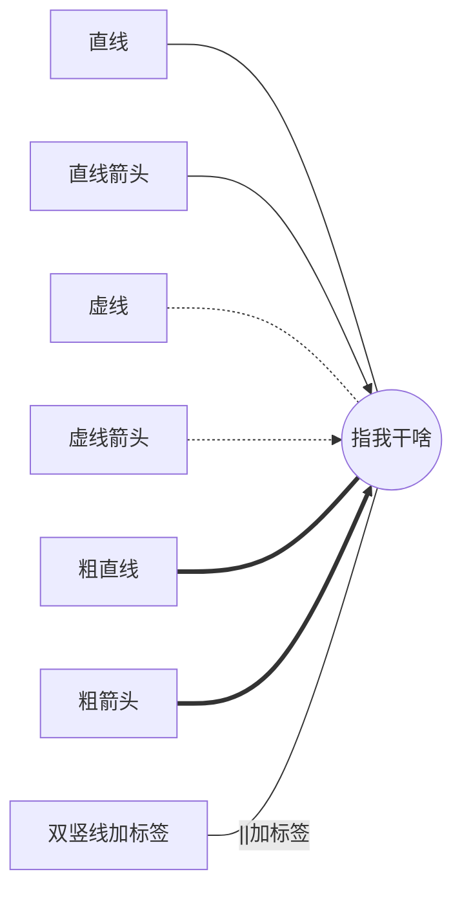
```mermaid
flowchart LR;
	test((指我干啥))
	直线---test
	直线箭头-->test
	虚线-.-test
	虚线箭头-.->test;
	粗直线===test;
	粗箭头==>test;
	双竖线加标签---|"||加标签"| test;
```

1. **多个连接关系：**

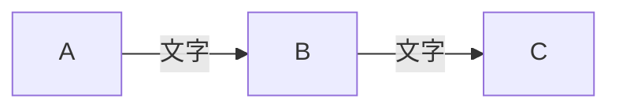
```mermaid
flowchart LR
   A -- 文字 --> B -- 文字 --> C
```

2. **多个节点连接：**

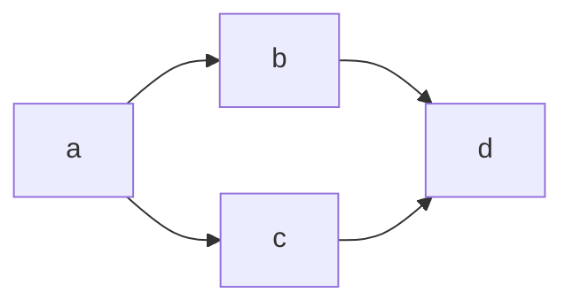
```mermaid
flowchart LR
   a --> b & c--> d
```

3. **简洁的依赖关系声明：**

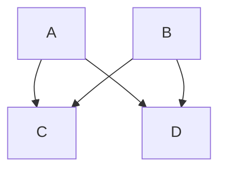
```mermaid
flowchart TB
    A & B--> C & D
```

```mermaid
flowchart TB
    A --> C
    A --> D
    B --> C
    B --> D
```

**子图**

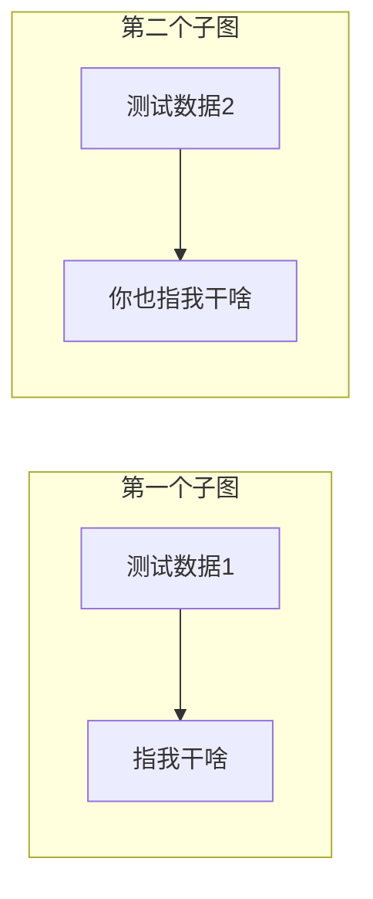
```mermaid
flowchart LR;
	subgraph 第一个子图
	测试数据1 --> 指我干啥
	end

	subgraph 第二个子图
	测试数据2 --> 你也指我干啥
	end
```

**多子图流转**
在多个子图中，可以在子图之间设置连接线，如下面的例子所示：

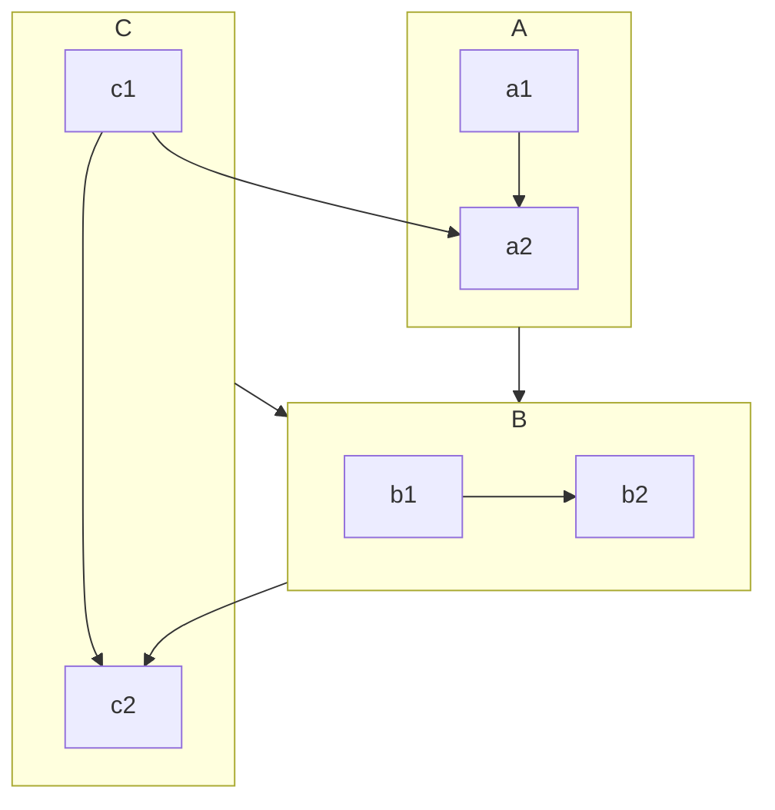
```mermaid
flowchart TB
    c1-->a2
    subgraph A
    a1-->a2
    end
    subgraph B
    b1-->b2
    end
    subgraph C
    c1-->c2
    end
    A --> B
    C --> B
    B --> c2
```

**子图的方向**
在多个流程图中，您可以使用方向语句来设置子图将呈现的方向，就像下面的例子所示：

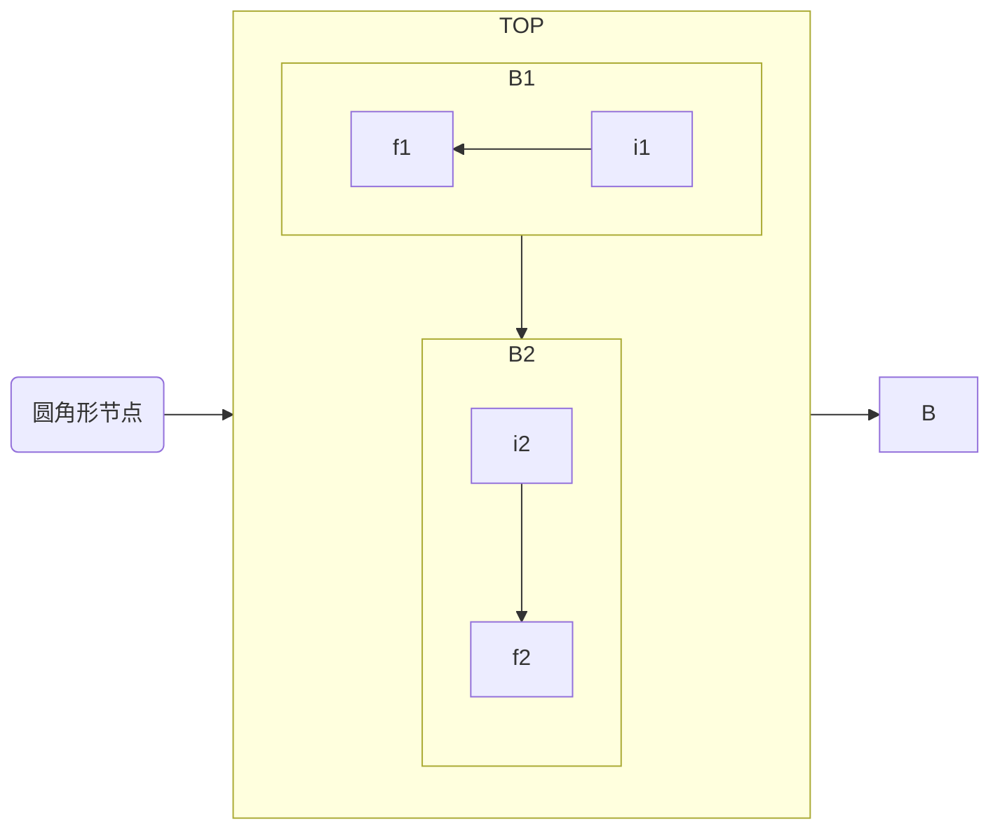
```mermaid
flowchart LR
A(圆角形节点)
  subgraph TOP
    direction TB
    subgraph B1
        direction RL
        i1 -->f1
    end
    subgraph B2
        direction TB
        i2 -->f2
    end
  end
  A --> TOP --> B
  B1 --> B2
```

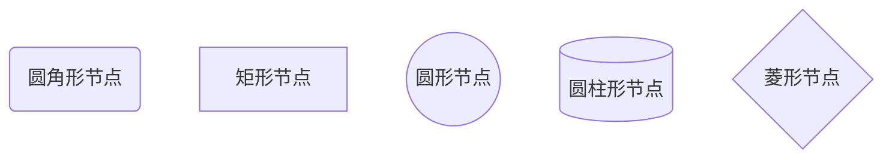
```mermaid
flowchart TB;
	A(圆角形节点)
	B[矩形节点]
	C((圆形节点))
	D[(圆柱形节点)]
	E{菱形节点}
```

```mermaid
flowchart TB;
	F([跑道形节点])
	G{{六角形节点}}
	H[[子程序形状]]
	I>非对称形节点]
```

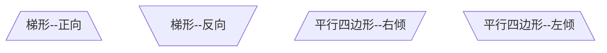
```mermaid
flowchart TB;
	J[/梯形--正向\]
	K[\梯形--反向/]
	L[/平行四边形--右倾/]
	M[\平行四边形--左倾\]
```

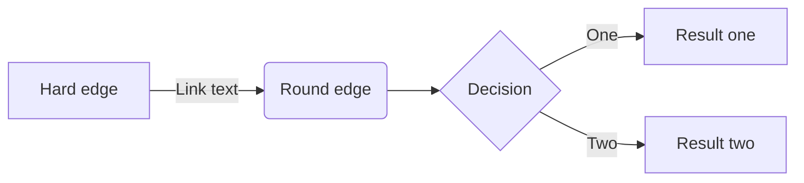
```mermaid
flowchart LR
    A[Hard edge] -->|Link text| B(Round edge)
    B --> C{Decision}
    C -->|One| D[Result one]
    C -->|Two| E[Result two]

```

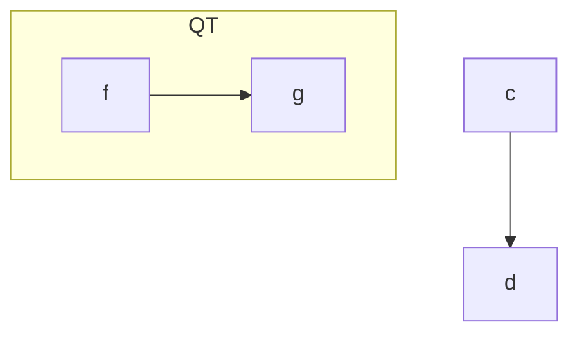
```mermaid
 graph TB
 	c --> d
     subgraph QT
    	f-->g
    end
```

