# 李述桐

## 环境

### vscode插件


### [汇编无法断点](https://blog.csdn.net/qq_61585528/article/details/136107955)

设置里设置可以在任意文本打断点

### gdb调试

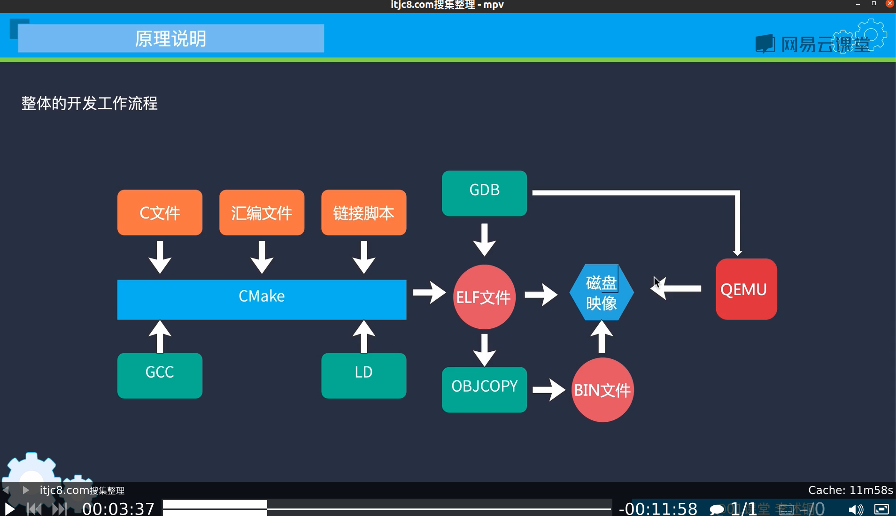


```
"postRemoteConnectCommands": [
                {
                    "description": "加载boot符号文件",
                    "text": "-file-symbol-file ./build/source/boot/boot.elf",
                    "ignoreFailures": false
                },
```

.elf->gdb


```shell
# 写boot区，定位到磁盘开头，写1个块：512字节
dd if=boot.bin of=$DISK1_NAME bs=512 conv=notrunc count=1

# 写loader区，定位到磁盘第2个块，写1个块：512字节
dd if=loader.bin of=$DISK1_NAME bs=512 conv=notrunc seek=1

# 写kernel区，定位到磁盘第100个块
# dd if=kernel.elf of=$DISK1_NAME bs=512 conv=notrunc seek=100

# 写应用程序init，临时使用
# dd if=init.elf of=$DISK1_NAME bs=512 conv=notrunc seek=5000
# dd if=shell.elf of=$DISK1_NAME bs=512 conv=notrunc seek=5000
```

.bin->img


### launch.json


```json
"postRemoteConnectCommands": [
                {
                    "description": "加载boot符号文件",
                    "text": "-file-symbol-file ./build/source/boot/boot.elf",
                    "ignoreFailures": false
                },
```

这段配置用于告诉 GDB 使用指定的 ELF 文件加载符号信息。符号信息包含调试器所需的符号和地址映射，从而能够更有效地调试程序。

## BOIS如何判断是引导程序


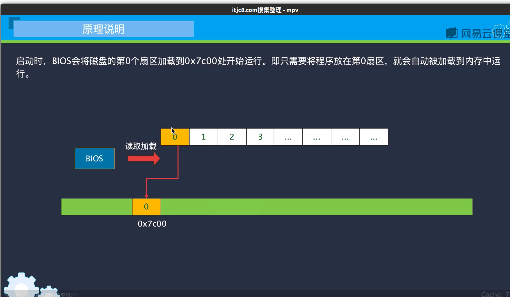

```
	// 引导结束段
	.section boot_end, "ax"
boot_sig: .byte 0x55, 0xaa
```

之后设在boot_end=0x7dfe

## 内存映射

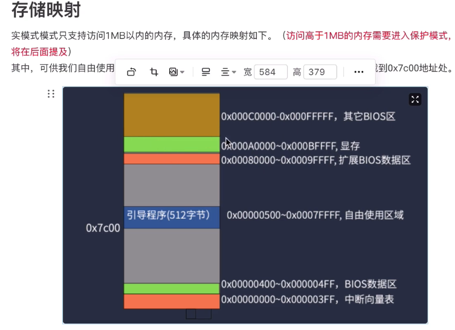

## 0x7c00 0x7def

```
set(CMAKE_EXE_LINKER_FLAGS "-m elf_i386  -Ttext=0x7c00  --section-start boot_end=0x7dfe")
```


## cpu怎么知道磁盘的代码应该加载到内存的什么位置

> ChatGPT
>
> 在操作系统开发和引导加载过程中，CPU 如何知道磁盘上的代码应该加载到内存的什么位置是一个复杂的过程，通常涉及引导加载程序、段描述符、以及 ELF 文件头等多方面的协调。以下是这个过程的详细解释。
>
> ### 引导加载过程
>
> 1. **BIOS/UEFI 阶段**：
>    - **启动顺序**：计算机启动时，BIOS（或 UEFI）会按照预定的启动顺序寻找引导设备（如硬盘、光盘、USB）。
>    - **引导扇区**：BIOS 会加载引导设备的第一个扇区（引导扇区）到内存中的特定地址（通常是 0x7C00）。
>    - **跳转执行**：BIOS 将控制权转交给这个引导扇区的代码。
> 2. **第一阶段引导加载程序（如 MBR）**：
>    - **引导代码**：MBR（主引导记录）的引导代码通常被加载到内存中的 0x7C00 地址。
>    - **读取分区表**：MBR 引导代码会读取分区表信息，找到活动分区，并加载该分区的引导扇区（VBR，卷引导记录）。
>    - **加载第二阶段引导程序**：VBR 通常会加载并执行第二阶段引导程序（如 GRUB）。
> 3. **第二阶段引导加载程序（如 GRUB）**：
>    - **读取文件系统**：第二阶段引导程序具有更强的功能，可以读取文件系统，找到内核文件或其他可执行文件（如 ELF 格式）。
>    - **解析 ELF 文件**：引导程序会解析 ELF 文件头，找到段的加载地址和大小等信息。
>    - **加载内核**：根据 ELF 文件头中的信息，将内核加载到指定的内存地址，并准备好启动参数。
>    - **跳转到内核**：引导程序将控制权转交给内核的入口地址，开始执行内核代码

==后面应该会说怎么加载efl文件头==

> ELF 文件头中包含了段的信息，包括每个段在内存中的加载地址。这些信息指示引导程序如何将文件中的代码和数据段映射到内存。如果内存地址已经有进程占用会怎么处理？
>
> 
>
> 当操作系统加载一个 ELF 文件（可执行和链接格式文件）时，它会依据 ELF 文件头中的段信息将代码和数据段映射到内存中。如果内存地址已经被其他进程占用，会有以下几种处理方法：
>
> 1. **地址重定位**：
>    - 当可执行文件被加载时，操作系统可以进行地址重定位，将需要映射的段重新映射到其他可用的内存区域。
>    - 动态链接器在加载共享库时也会进行类似的重定位操作，确保所有段都映射到可用的内存地址。
> 2. **虚拟内存管理**：
>    - 现代操作系统使用虚拟内存管理技术，每个进程都有自己的虚拟地址空间。虚拟地址空间是一个抽象层，可以映射到不同的物理内存地址。
>    - 这样，多个进程可以使用

## 和b站的引导代码的不同

> 这两段引导代码实现了系统启动时的不同部分，具体来说，第一个代码片段主要是用来加载和启动内核的二级引导程序，而第二个代码片段是BIOS加载后立即执行的初始引导代码。让我们详细比较这两段代码的不同之处：
>
> 
>
> ### 主要不同点
>
> 1. **目标和角色**：
>    - **第一段代码**：这是一个典型的二级引导程序，它主要负责设置堆栈并调用内核的入口函数。它假设系统已经进入保护模式，并且由一个符合 Multiboot 规范的引导加载器加载。
>    - **第二段代码**：这是一个初级引导程序，存储在磁盘的第一个扇区（MBR），由 BIOS 加载到内存地址 0x7c00 处，并执行初始化工作，然后加载并跳转到二级引导程序。
> 2. **处理模式**：
>    - **第一段代码**：假设运行在保护模式下，用 `.section .text` 和 `.section .bss` 定义不同的段，使用 32 位寄存器和操作。
>    - **第二段代码**：运行在实模式下，使用 `.code16` 指令，设置数据段寄存器，并使用 BIOS 中断（如 `int $0x10` 和 `int $0x13`）进行显示和磁盘读取操作。

因为b站的代码应该是用了grub工具

> ### GRUB 安装位置
>
> GRUB 通常安装在以下两个位置之一：
>
> 1. **主引导记录 (Master Boot Record, MBR)**:
>    - 物理硬盘的第一个扇区，即LBA 0（逻辑块地址0）。
>    - MBR 的大小为 512 字节，包含了 GRUB 的第一阶段引导代码（通常称为 stage1）以及分区表信息。

所以这个代码是省略了物理硬盘的第一个扇区的grub的mutiboot，而是从第一个扇区直接跳转到loader二级引导了

## iso和img

> ChatGPT
>
> ISO和IMG都是光盘镜像文件格式，用于存储光盘的内容，包括文件和目录结构。


## 为什么Load.bin中的_start从0x8000开始

```cmake
project(loader LANGUAGES C)  

# 使用自定义的链接器
set(CMAKE_EXE_LINKER_FLAGS "-m elf_i386 -Ttext=0x8000")
set(CMAKE_C_LINK_EXECUTABLE "${LINKER_TOOL} <OBJECTS> ${CMAKE_EXE_LINKER_FLAGS} -o ${PROJECT_BINARY_DIR}/${PROJECT_NAME}.elf")

# 将所有的汇编、C文件加入工程
# 注意保证start.asm在最前头
file(GLOB C_LIST "*.c" "*.h")
add_executable(${PROJECT_NAME} start.S ${C_LIST})

# lbin文件生成，写入到image目录下
add_custom_command(TARGET ${PROJECT_NAME}
                   POST_BUILD
                   COMMAND ${OBJCOPY_TOOL} -O binary ${PROJECT_NAME}.elf ${CMAKE_SOURCE_DIR}/../../image/${PROJECT_NAME}.bin
                   COMMAND ${OBJDUMP_TOOL} -x -d -S -m i8086 ${PROJECT_BINARY_DIR}/${PROJECT_NAME}.elf > ${PROJECT_NAME}_dis.txt
                   COMMAND ${READELF_TOOL} -a ${PROJECT_BINARY_DIR}/${PROJECT_NAME}.elf > ${PROJECT_NAME}_elf.txt
)
```

 start.asm在最前头

## bios利用中断读磁盘

```asm
read_loader:
	mov $0x8000, %bx	// 读取到的内存地址
	mov $0x2, %cx		// ch:磁道号，cl起始扇区号
	mov $0x2, %ah		// ah: 0x2读磁盘命令
	mov $64, %al		// al: 读取的扇区数量, 必须小于128，暂设置成32KB
	mov $0x0080, %dx	// dh: 磁头号，dl驱动器号0x80(磁盘1)
	int $0x13
	jc read_loader

	// 跳转至c部分执行，再由c部分做一些处理
	jmp boot_entry

	// 原地跳转
	jmp .

	// 引导结束段
	.section boot_end, "ax"
```


## 内联汇编语法

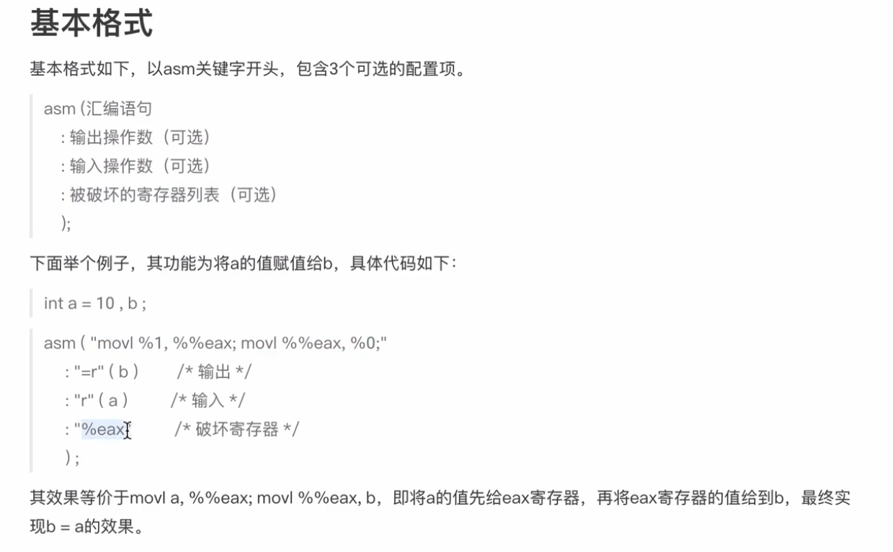


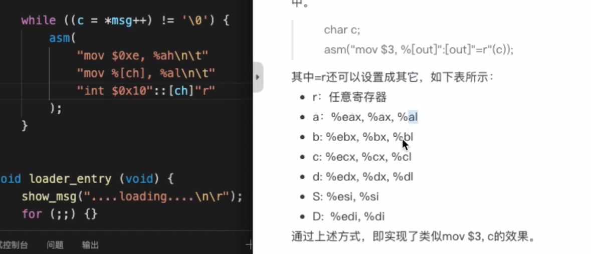

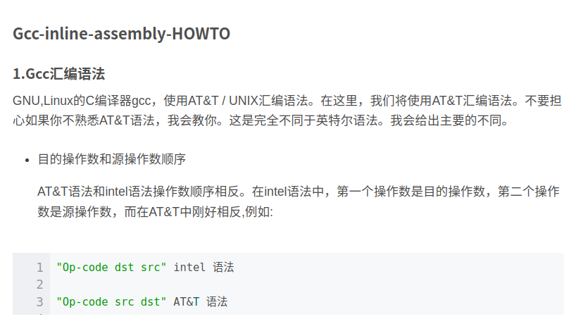

```
AT&T : addl $4,%eax
*Intel: add eax,4
```


## 内存检测


### 寄存器

https://blog.csdn.net/astrotycoon/article/details/8169482


https://www.cnblogs.com/zhaoyl/archive/2012/05/15/2501972.html


> **通用寄存器：**
>
> **AX，BX，CX，DX 称作为数据寄存器：**
>
> AX (Accumulator)：累加寄存器，也称之为累加器；
>
> BX (Base)：基地址寄存器；
>
> CX (Count)：计数器寄存器；
>
> DX (Data)：数据寄存器；
>
> **SP 和 BP 又称作为指针寄存器：**
>
> SP (Stack Pointer)：堆栈指针寄存器；
>
> BP (Base Pointer)：基指针寄存器；
>
> **SI 和 DI 又称作为变址寄存器：**
>
> SI (Source Index)：源变址寄存器；
>
> DI (Destination Index)：目的变址寄存器；
>
> **控制寄存器：**
>
> IP (Instruction Pointer)：指令指针寄存器；
>
> FLAG：标志寄存器；
>
> **段寄存器：**
>
> CS (Code Segment)：代码段寄存器；
>
> DS (Data Segment)：数据段寄存器；
>
> SS (Stack Segment)：堆栈段寄存器；
>
> ES (Extra Segment)：附加段寄存器；


### 段寄存器组合方式

> 1. **CS**
>
>    
>
>    （Code Segment
>
>    Pointer）
>
>    ：指向当前执行的指令地址。
>
>    
>
>    - **CS**：代码段寄存器
>    - **IP（Instruction Pointer）**：指令指针寄存器
>
> 2. **SS**
>
>    
>
>    （Stack Segment
>
>    Pointer）
>
>    ：指向当前栈顶。
>
>    
>
>    - **SS**：堆栈段寄存器
>    - **SP（Stack Pointer）**：堆栈指针寄存器
>    - **BP（Base Pointer）**：基址指针寄存器，常用于基址寻址模式
>
> 3. **DS**
>
>    
>
>    （Data Segment
>
>    Index）
>
>    ：源数据的地址。
>
>    
>
>    - **DS**：数据段寄存器
>    - **SI（Source Index）**：源索引寄存器
>
> 4. **ES**
>
>    
>
>    （Extra Segment
>
>    Index）
>
>    ：目标数据的地址，特别在字符串操作中。
>
>    
>
>    - **ES**：额外段寄存器
>    - **DI（Destination Index）**：目标索引寄存器
>
> 5. **FS和GS**：这两个额外段寄存器通常与通用寄存器组合使用，可以用于访问任意数据段。
>
>    - **FS**：额外段寄存器
>    - **GS**：额外段寄存器


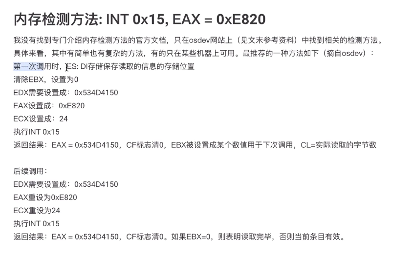

### typedef struct

> 在[C语言](https://www.baidu.com/s?word=C语言&sa=re_dqa_zy)中，使用`typedef struct`与直接使用`struct`的主要区别在于前者为结构体类型定义了一个别名，而后者则直接使用了结构体的关键字。具体来说：
>
> - 使用`typedef struct`时，我们为结构体定义了一个别名，这个别名可以用于声明新的变量，而不需要每次都使用`struct`关键字。例如，如果我们定义了`typedef struct Student { int a; } Stu;`，那么我们可以直接使用`Stu stu1;`来声明一个学生结构的变量，而不需要使用`struct Student stu1;`。这种做法简化了代码，提高了可读性

c语言 创建一个结构体需要加struct关键字

### vlolatile

> 编译器不能对`volatile`变量进行某些优化。因此，只有在确实需要时才应使用`volatile`。
>
> 示例：
>
> ```
> cvolatile int flag = 0; // 一个可能在外部被改变的变量void* thread_function(void* arg) {    while (!flag) {        // 等待flag变为非零值        // 由于flag是volatile的，编译器不会在这里进行优化（如循环展开或删除）    }    // 当flag变为非零值时，执行某些操作...    return NULL;}
> ```
>
> 在这个示例中，`flag`是一个`volatile`变量，它可能在另一个线程或中断服务程序中被设置为非零值。由于`flag`是`volatile`的，编译器不会假设它在循环的每次迭代中都是相同的，因此它会每次都检查`flag`的值。

### 避免内存对齐

```
 __attribute__((packed));
```

### code

```c
static void  detect_memory(void) {
	uint32_t contID = 0;
	SMAP_entry_t smap_entry;
	int signature, bytes;

    show_msg("try to detect memory:");

	// 初次：EDX=0x534D4150,EAX=0xE820,ECX=24,INT 0x15, EBX=0（初次）
	// 后续：EAX=0xE820,ECX=24,
	// 结束判断：EBX=0
	boot_info.ram_region_count = 0;
	for (int i = 0; i < BOOT_RAM_REGION_MAX; i++) {
		SMAP_entry_t * entry = &smap_entry;

		__asm__ __volatile__("int  $0x15"
			: "=a"(signature), "=c"(bytes), "=b"(contID)
			: "a"(0xE820), "b"(contID), "c"(24), "d"(0x534D4150), "D"(entry));
		if (signature != 0x534D4150) {
            show_msg("failed.\r\n");
			return;
		}

		// todo: 20字节
        //判断 bytes > 20 为了SMAP_entry_t 结构体数据完整，并且符合规范
        //entry->ACPI为0表示需要被忽略
		if (bytes > 20 && (entry->ACPI & 0x0001) == 0){
			continue;
		}

        // 保存RAM信息，只取32位，空间有限无需考虑更大容量的情况
        if (entry->Type == 1) {
            //内存可用，后面有的是显存占用啥的不能用
            boot_info.ram_region_cfg[boot_info.ram_region_count].start = entry->BaseL;
            //只要存底32.高32肯定是0
            boot_info.ram_region_cfg[boot_info.ram_region_count].size = entry->LengthL;
            boot_info.ram_region_count++;
        }

		if (contID == 0) {
			break;
		}
	}
    show_msg("ok.\r\n");
}
```

> entry是汇编中断写入的所有信息结构体指针
>
> boot_info是后面有用的信息start size的结构体

## 实模式 保护模式

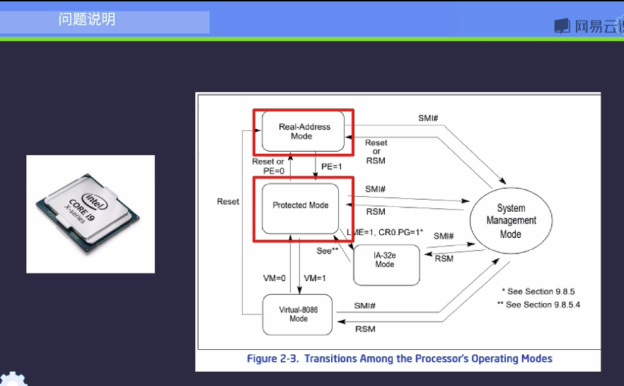

### 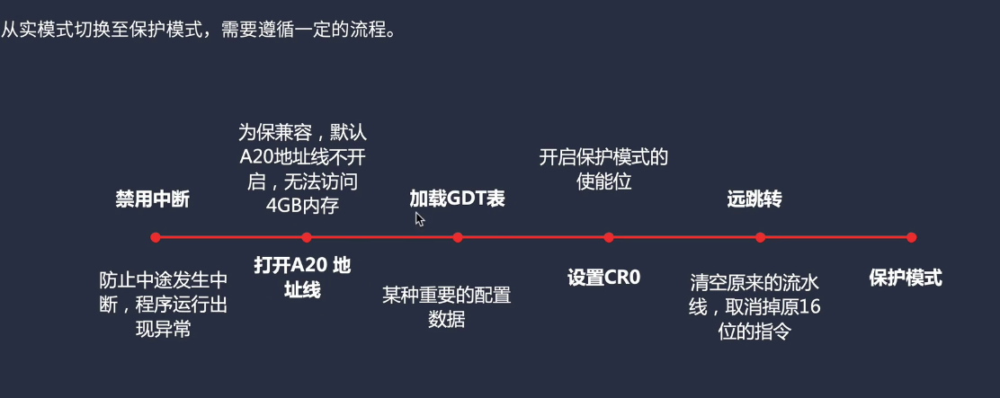 

### static inline

> ### static
>
> 1. **避免命名冲突**：如果在多个文件中定义了同名的函数或变量，使用`static`可以将其作用域限制在文件内部，防止命名冲突。这样，函数在文件内部是唯一的，而不会与其他文件中的同名函数发生冲突。
> 2. **失去了全局可⻅性**:加了static后表⽰该函数失去了全局可⻅性，只在该函数所在的⽂件作⽤域内可⻅ 当函数声明为static以后,编译器在该⽬标编译单元内只含有该函数的⼊⼝地址,没有函数名,其它编译 单元便不能通过该函数名来调⽤该函数，这也是对1的解析与说明
> 3. 这段代码已经有防卫声明为什么还加static避免冲突呢？
>
> 虽然头文件保护可以防止重复包含带来的编译错误，在 C 语言中，一个头文件被多个源文件包含，并且头文件中定义了全局符号（例如函数或变量），这些全局符号仍然会导致链接器错误，因为它们在多个编译单元中被定义了多次。

> ### inline
>
> 关于内联函数 内联函数是在函数的前⾯加“inline”，意思是将这个函数的⼆进制代码直接插到程序中调⽤它的地 ⽅，让编译器不⽤函数名跳转的⽅式来实现（原因是这样跳来跳去⽐较花费时间）。这种做法类似 于宏代替。

### spu_instr.h

```c
/**
 * 汇编指令的封装
 *
 * 作者：李述铜
 * 联系邮箱: 527676163@qq.com
 */
#ifndef CPU_INSTR_H
#define CPU_INSTR_H

#include "types.h"

static inline uint8_t inb(uint16_t  port) {
	uint8_t rv;
	__asm__ __volatile__("inb %[p], %[v]" : [v]"=a" (rv) : [p]"d"(port));
	return rv;
}

static inline void outb(uint16_t port, uint8_t data) {
	__asm__ __volatile__("outb %[v], %[p]" : : [p]"d" (port), [v]"a" (data));
}

static inline void cli() {
	__asm__ __volatile__("cli");
}

static inline void sti() {
	__asm__ __volatile__("sti");
}

static inline void lgdt(uint32_t start, uint32_t size) {
	struct {
		uint16_t limit;
		uint16_t start15_0;    // 视频中这里写成了32位
		uint16_t start31_16;    // 视频中这里写成了32位
	} gdt;

	gdt.start31_16 = start >> 16;
	gdt.start15_0 = start & 0xFFFF;
	gdt.limit = size - 1;

	__asm__ __volatile__("lgdt %[g]"::[g]"m"(gdt));
}

#endif

```

> ### A20 地址线问题
>
> 最初的 x86 处理器在处理地址超过 1MB 时会发生地址线回绕（wrap around），即超过 1MB 的地址会回绕到起始位置。例如，地址 0x100000 实际上会被视为 0x00000。为了兼容旧的软件和系统，这种回绕行为被保留了下来。但在保护模式下，需要能够访问超过 1MB 的内存，因此需要启用 A20 地址线以禁用这种回绕行为。
>
> ### Fast A20 Gate 方式
>
> 有几种方法可以启用 A20 地址线，其中 Fast A20 Gate 是一种快速且简便的方法。这种方法通过访问键盘控制器的 I/O 端口 0x92 来控制 A20 地址线的状态。
>
> ### 代码分析
>
> ```
> c复制代码uint8_t v = inb(0x92);  // 读取端口 0x92 的当前值
> outb(0x92, v | 0x2);    // 设置端口 0x92 的第 1 位（从 0 开始计数）
> ```
>
> 1. `inb(0x92)`：从 I/O 端口 0x92 读取一个字节。端口 0x92 控制键盘和 A20 地址线的状态。
> 2. `outb(0x92, v | 0x2)`：将读到的值 `v` 与 0x2 进行按位或操作，然后写回端口 0x92。0x2 表示将第 1 位（从 0 开始计数）设置为 1。第 1 位是 A20 地址线的开关，所以这一步操作开启了 A20 地址线。

### GDTR

`lgdt` 指令将指定的内存位置的内容加载到 GDTR 中，这样处理器就知道GDT的位置和大小。以下是一个示例


```asm
static inline void far_jump(uint32_t selector, uint32_t offset) {
	uint32_t addr[] = {offset, selector };
	__asm__ __volatile__("ljmpl *(%[a])"::[a]"r"(addr));
}
```

```c
static void  enter_protect_mode() {
    // 关中断
    cli();

    // 开启A20地址线，使得可访问1M以上空间
    // 使用的是Fast A20 Gate方式，见https://wiki.osdev.org/A20#Fast_A20_Gate
    uint8_t v = inb(0x92);
    outb(0x92, v | 0x2);

    // 加载GDT。由于中断已经关掉，IDT不需要加载
    lgdt((uint32_t)gdt_table, sizeof(gdt_table));

    // 打开CR0的保护模式位，进入保持模式
    uint32_t cr0 = read_cr0();
    write_cr0(cr0 | (1 << 0));


    // 长跳转进入到保护模式
    // 使用长跳转，以便清空流水线，将里面的16位代码给清空
    far_jump(8, (uint32_t)protect_mode_entry);
}
```

 far_jump(8, (uint32_t)protect_mode_entry);==的8是段选择子？为什么是8呢？==

> #### GDT (全局描述符表)
>
> 首先，我们看一下 GDT 表的定义：
>
> ```
> c复制代码uint16_t gdt_table[][4] = {
>     {0, 0, 0, 0},                      // Null segment
>     {0xFFFF, 0x0000, 0x9A00, 0x00CF},  // Code segment
>     {0xFFFF, 0x0000, 0x9200, 0x00CF},  // Data segment
> };
> ```
>
> - 第一个描述符是空段（全零）。
> - 第二个描述符是代码段，段选择子为 `0x08`。
> - 第三个描述符是数据段，段选择子为 `0x10`。
>
> #### `far_jump` 函数
>
> 现在我们看一下 `far_jump` 函数：
>
> ```
> c复制代码static inline void far_jump(uint32_t selector, uint32_t offset) {
>     uint32_t addr[] = {offset, selector };
>     __asm__ __volatile__("ljmpl *(%[a])"::[a]"r"(addr));
> }
> ```
>
> - `selector` 是段选择子，表示要跳转到的段。
> - `offset` 是段内偏移，表示要跳转到段内的具体地址。
> - `addr` 数组包含两个元素，第一个是 `offset`，第二个是 `selector`。
>
> #### `ljmpl` 指令
>
> `ljmpl *(%[a])` 使用 `addr` 数组的内容进行长跳转。汇编指令 `ljmpl *(%[a])` 的操作如下：
>
> - `ljmpl` 取 `addr` 数组的内容，将第一个元素 `offset` 加载到 `EIP`，第二个元素 `selector` 加载到 `CS`。
> - 这使得 CPU 跳转到 `selector:offset` 指定的地址

### CS不是段地址么，怎么就自动查找gdt表了

> 你理解得对。在实模式切换到保护模式的过程中，`CS`寄存器的含义确实从段地址变成了段选择子。这种转变主要发生在执行`ljmpl`指令的时候。让我们详细解释一下这个过程。
>
> ### 实模式到保护模式的转换步骤
>
> 1. **关闭中断**:
>
>    ```
>    c
>    复制代码
>    cli();
>    ```
>
> 2. **开启A20地址线**:
>
>    ```
>    c复制代码uint8_t v = inb(0x92);
>    outb(0x92, v | 0x2);
>    ```
>
> 3. **加载GDT**:
>
>    ```
>    c
>    复制代码
>    lgdt((uint32_t)gdt_table, sizeof(gdt_table));
>    ```
>
> 4. **设置CR0寄存器，进入保护模式**:
>
>    ```
>    c复制代码uint32_t cr0 = read_cr0();
>    write_cr0(cr0 | (1 << 0));
>    ```
>
> 5. **长跳转到保护模式**:
>
>    ```
>    c
>    复制代码
>    far_jump(8, (uint32_t)protect_mode_entry);
>    ```
>
> ### `far_jump`函数
>
> ```
> c复制代码static inline void far_jump(uint32_t selector, uint32_t offset) {
>     uint32_t addr[] = {offset, selector};
>     __asm__ __volatile__("ljmpl *(%[a])"::[a]"r"(addr));
> }
> ```
>
> - `selector`是段选择子（在这个例子中是8，对应于GDT中的代码段描述符）。
> - `offset`是段内偏移量（指向保护模式入口的具体地址）。
>
> ### 执行`ljmpl`指令的作用
>
> - 在执行`ljmpl *(%[a])`指令之前，CPU仍然在实模式下运行，此时`CS`寄存器包含段地址。
> - 当`ljmpl`指令执行时，它会加载新的段选择子到`CS`寄存器，并加载新的偏移量到`EIP`寄存器。这是一个关键步骤，它完成了从实模式到保护模式的转变。
>
> ### 转变过程的关键点
>
> 1. **加载GDT**:
>
>    - 使用`lgdt`指令加载GDT（全局描述符表）的基地址和限长到GDTR（全局描述符表寄存器）。
>    - `lgdt`指令本身不会改变`CS`寄存器的内容。
>
> 2. **进入保护模式**:
>
>    - 设置CR0寄存器的保护模式位（PE位），从而启用保护模式：
>
>      ```
>      c复制代码uint32_t cr0 = read_cr0();
>      write_cr0(cr0 | (1 << 0));
>      ```
>
>    - 此时，虽然已经启用了保护模式，但`CS`寄存器的内容还没有改变，仍然是实模式下的段地址。
>
> 3. **执行长跳转**:
>
>    - `ljmpl`指令执行时，`CS`寄存器被加载新的段选择子（在此例中为8），此时`CS`的含义从段地址变为段选择子。
>    - 这个段选择子用于从GDT中索引对应的段描述符。段描述符包含段的基地址、段限长和访问权限等信息。


```asm
protect_mode_entry:
	// 重新加载所有的数据段描述符
	mov $16, %ax		// 16为数据段选择子
	mov %ax, %ds
    mov %ax, %ss
    mov %ax, %es
    mov %ax, %fs
    mov %ax, %gs

    // 长跳转进入到32位内核加载模式中
    jmp $8, $load_kernel

```

==为什么是16和8？==

16是第二个段 数据段，在load_kernel一开始是临时gdt表定义的段

后面更新了表

## 读磁盘

之前的boot把load代码从磁盘读到内存是利用bios的中断

现在在保护模式，bios功能不能使用，包括之前利用中断打印信息

### LBA模式

ATA（Advanced Technology Attachment）接口的寄存器物理上位于连接到主板上的硬盘控制器内，而==不是在 CPU 内部==。硬盘控制器通常是主板上的南桥芯片（Southbridge）的一部分

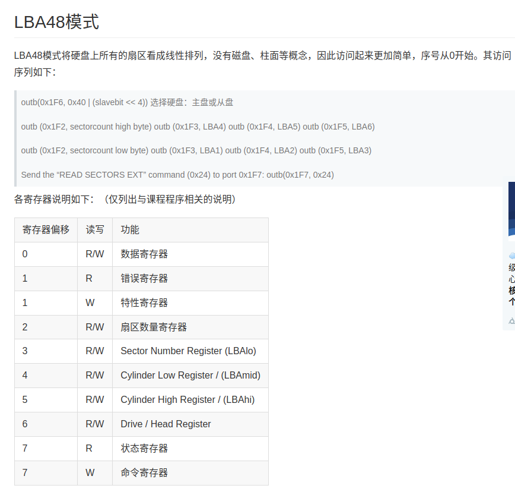

*CPU 主要由运算器、控制器、寄存器组、高速缓冲存储器(Cache)和内部总线构成*


### 独立编址

处理器通过不同的地址线和控制信号来区分 I/O 操作和内存操作。例如，x86 处理器在执行 I/O 指令时会使用 `IO/M` 控制信号来指示操作类型是 I/O 还是内存访问。

## 加载内核

```python
/* 参考文档： https://ftp.gnu.org/old-gnu/Manuals/ld-2.9.1/html_chapter/ld_3.html */
SECTIONS
{
    . = 0x00010000;

	.text : {
		*(.text)
	} 

	.rodata : {
		*(.rodata)
	}

	.data : {
		*(.data)
	}
	.bss : {
		*(.bss)
	}
}

```


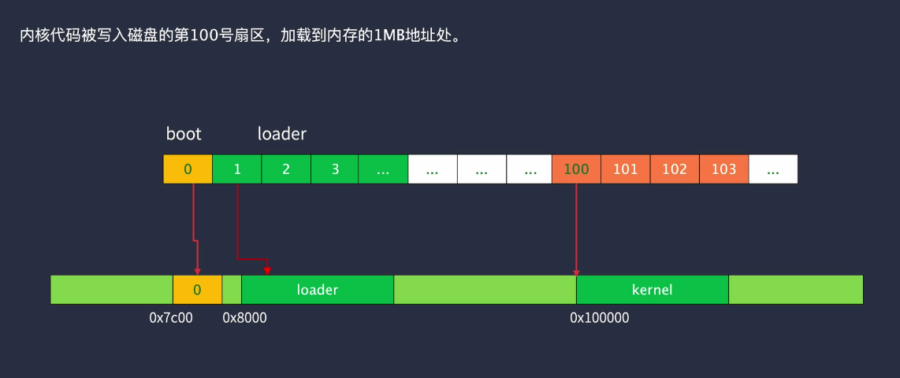

### 传递boot_info


```c
/**
 * 从磁盘上加载内核
 */
void load_kernel(void) {
    // 读取的扇区数一定要大一些，保不准kernel.elf大小会变得很大
    // 我就吃过亏，只读了100个扇区，结果运行后发现kernel的一些初始化的变量值为空，程序也会跑飞
    read_disk(100, 500, (uint8_t *)SYS_KERNEL_LOAD_ADDR);
    ((void (*)(boot_info_t *))SYS_KERNEL_LOAD_ADDR)(&boot_info);
    for (;;) {}
}


```

```
_start:
    # 第一种方法
    # push %ebp
    # mov %esp, %ebp
    # mov 0x8(%ebp), %eax
    # push %eax

    # 第二种方法
    # mov 4(%esp), %eax
    # push %eax

    # 第三种方法
    push 4(%esp)

    # kernel_init(boot_info)
    call kernel_init

	// 重新加载GDT
	jmp $KERNEL_SELECTOR_CS, $gdt_reload

```

图一的直接改连接的内存地址不方便，应该直接用参数传递

### 变量存在哪个段 


```c
/* 参考文档： https://ftp.gnu.org/old-gnu/Manuals/ld-2.9.1/html_chapter/ld_3.html */
SECTIONS
{
    . = 0x000100000;

	.text : {
		*(.text)
	} 

	.rodata : {
		*(.rodata)
	}

	.data : {
		*(.data)
	}
	.bss : {
		*(.bss)
	}
}

```

### 改用加载elf


```
SECTIONS
{
    . = 0x00010000;

	.text : {
		*(.text)
	} 

	.rodata : {
		*(.rodata)
	}

	.data : {
		*(.data)
	}
	.bss : {
		*(.bss)
	}
}

```

```
                {
                    "description": "加载内核符号文件",
                    "text": "add-symbol-file ./build/source/kernel/kernel.elf 0x10000",
                    "ignoreFailures": false
                },
```

### 栈

```asm

gdt_reload:
	mov $KERNEL_SELECTOR_DS, %ax		// 16为数据段选择子
	mov %ax, %ds
    mov %ax, %ss
    mov %ax, %es
    mov %ax, %fs
    mov %ax, %gs

	// 栈设置
	mov $(stack + KERNEL_STACK_SIZE), %esp

	// 栈和段等沿用之前的设置
	jmp init_main

	.bss
.comm stack, KERNEL_STACK_SIZE    // comm 声明未初始化的通用内存区域，以字节计
```


## 创建DGT表项


选择子>>3才是第几个段


```c
 之前 进入保护模式之前的
    lgdt((uint32_t)gdt_table, sizeof(gdt_table));


跳转到内核才初始化gbt表？
```


### 保护模式下的cs段和offset计算线性地址是cpu自己完成的？

是的，在保护模式下，`CS`段选择子和偏移量的组合是由CPU自动完成线性地址的计算的。让我们更详细地探讨这一过程。

在保护模式下，CPU使用段选择子和段内偏移量来计算线性地址。这个过程完全由CPU硬件自动处理。


### 描述符结构


### 重新加载gdt

```c
    # kernel_init(boot_info)
    call kernel_init

	// 重新加载GDT
	jmp $KERNEL_SELECTOR_CS, $gdt_reload

gdt_reload:
	mov $KERNEL_SELECTOR_DS, %ax		// 16为数据段选择子
	mov %ax, %ds
    mov %ax, %ss
    mov %ax, %es
    mov %ax, %fs
    mov %ax, %gs

	// 栈设置
	mov $(stack + KERNEL_STACK_SIZE), %esp

	// 栈和段等沿用之前的设置
	jmp init_main

	.bss
.comm stack, KERNEL_STACK_SIZE    // comm 声明未初始化的通用内存区域，以字节计
```

之后需要重新初始化一下寄存器然后跳转到init_main

==这里不再用0x7c00之前作为栈了，而是用.bss区域的大小为KERNEL_STACK_SIZE的stack作为栈==

###  数据段、代码段、BSS段以及堆和栈

当应用程序运行时（**运行态**），此时需要另外两个域：堆和栈。正在运行的程序：**代码段 + 数据段 + BSS 段 + 堆 + 栈**。

如图所示为可执行应用程序**存储态**和**运行态**的结构对照图。一个正在运行的 C 程序占用的内存区域分为代码段、数据段（初始化数据）、BSS 段（未初始化数据）、堆和栈 5 部分


### [*进程*的*内存映像*](https://www.baidu.com/link?url=bG0WDzIFbXSrNGNsuPmKWFHA1UT3zJPPQKwN08d1ja88sQI60PQP_lFBJQOxciJb-NECpP4vKHlH56NNvQDOGi0kR6_sc0tW_IPNsUF20Gu&wd=&eqid=84a86fd90001d7a100000006669f3536)


操作系统内核区和用户进程的栈应该是不一样的


## 中断


进入32位中断需要重新配置

### 中断描述符表和中断向量表的区别

> ### 中断向量表（Interrupt Vector Table，IVT）
>
> 1. **使用场景**：IVT主要用于早期的x86处理器（如8086和80286），以及一些嵌入式系统。它在实模式（Real Mode）下工作。
> 2. **结构**：IVT是一个固定大小的表，共包含256个表项，每个表项4个字节，因此总大小为1024字节（1KB）。每个表项包含一个段地址和偏移地址，指向中断服务程序（Interrupt Service Routine，ISR）。
> 3. **位置**：IVT通常位于内存的低地址区域，从物理地址0x0000到0x03FF。
> 4. **功能**：IVT用于将中断向量（中断号）映射到对应的ISR。在实模式下，当一个中断发生时，处理器通过查找IVT来找到对应的ISR地址并执行。
>
> ### 中断描述符表（Interrupt Descriptor Table，IDT）
>
> 1. **使用场景**：IDT主要用于现代x86处理器的保护模式（Protected Mode）和长模式（Long Mode），包括从80386及其后续处理器。
> 2. **结构**：IDT也是一个固定大小的表，最多包含256个表项。每个表项8个字节（在x86-64长模式下为16个字节）。每个表项包含一个描述符，描述符包括目标代码段选择子和目标偏移地址等信息，还包含一些控制信息（如中断门、陷阱门、任务门等）。
> 3. **位置**：IDT的位置是由IDTR寄存器指向的，IDTR包含IDT的基地址和大小。操作系统在初始化时会设置IDTR。
> 4. **功能**：IDT用于将中断向量映射到对应的ISR。在保护模式和长模式下，当一个中断或异常发生时，处理器通过查找IDT来找到对应的中断描述符，然后通过描述符信息找到ISR并执行。IDT支持更复杂的控制，如优先级、中断门类型等。


### b站当时的IDT表


### 保护现场

```c

    .text
	.extern do_handler_unknown
	.global exception_handler_unknown
exception_handler_unknown:
	// 保存所有寄存器
	pusha
	push %ds
	push %es
	push %fs
	push %gs

	// 调用中断处理函数
	call do_handler_unknown

	// 恢复保存的寄存器
	pop %gs
	pop %fs
	pop %es
	pop %ds
	popa
	iret

```

中断需要iret，所以必须调用汇报的代码


发生中断，栈中会自动压入一些信息


### 宏定义和压入错误码

```c
	// 下面的代码基本上是对上面代码的重复，只不过换用了宏来处理
	// 注意确定没写错，可对照反汇编来看。另外，下面的代码没有办法调试，原因未知
   .text
.macro exception_handler name num with_error_code
	    .extern do_handler_\name
		.global exception_handler_\name
	exception_handler_\name:
		// 如果没有错误码，压入一个缺省值
		// 这样堆栈就和有错误码的情形一样了
		.if \with_error_code == 0
			push $0
		.endif

		// 压入异常号
		push $\num

		// 保存所有寄存器
		pushal
		push %ds
		push %es
		push %fs
		push %gs

		// 调用中断处理函数
		push %esp
		call do_handler_\name
		add $(1*4), %esp		// 丢掉esp

		// 恢复保存的寄存器
		pop %gs
		pop %fs
		pop %es
		pop %ds
		popal

		// 跳过压入的异常号和错误码
		add $(2*4), %esp
		iret
.endm

exception_handler unknown, -1, 0
exception_handler divider, 0, 0

```

iret不会弹出错误码，只会弹出最开头三个

### 8259初始化

对应B站


> lidt 加载中断向量表
> sti 开中断

```c
static void init_pic(void) {
    // 边缘触发，级联，需要配置icw4, 8086模式
    outb(PIC0_ICW1, PIC_ICW1_ALWAYS_1 | PIC_ICW1_ICW4);

    // 对应的中断号起始序号0x20
    outb(PIC0_ICW2, IRQ_PIC_START);

    // 主片IRQ2有从片
    outb(PIC0_ICW3, 1 << 2);

    // 普通全嵌套、非缓冲、非自动结束、8086模式
    outb(PIC0_ICW4, PIC_ICW4_8086);

    // 边缘触发，级联，需要配置icw4, 8086模式
    outb(PIC1_ICW1, PIC_ICW1_ICW4 | PIC_ICW1_ALWAYS_1);

    // 起始中断序号，要加上8
    outb(PIC1_ICW2, IRQ_PIC_START + 8);

    // 没有从片，连接到主片的IRQ2上
    outb(PIC1_ICW3, 2);

    // 普通全嵌套、非缓冲、非自动结束、8086模式
    outb(PIC1_ICW4, PIC_ICW4_8086);

    // 禁止所有中断, 允许从PIC1传来的中断
    outb(PIC0_IMR, 0xFF & ~(1 << 2));
    outb(PIC1_IMR, 0xFF);
}

```

 异常中断一直是开的，不走8259A，所以不用void irq_enable(int irq_num) 

### 开中断

貌似除0等内部中断是不用开启的


在BIOS数据区

### 软中断

> 软中断和硬中断是两种不同类型的中断，它们的处理方式和用途有所不同。以下是软中断0x15和硬中断0x15的详细区别：
>
> #### 软中断0x15
>
> 软中断是通过软件指令触发的中断，通常使用 `INT` 指令来调用。例如，`int 0x15` 是一个典型的软中断调用，它用于调用BIOS服务，特别是在实模式和保护模式下可以通过BIOS调用接口操作。
>
> - **BIOS系统服务**：软中断0x15提供了一系列BIOS功能，例如内存检测、电源管理等。例如，通过 `AX=E820h` 可以获取系统内存布局。
>
> #### 硬中断0x15的特性：
>
> - **硬件事件触发**：硬中断由硬件设备（如键盘、鼠标、硬盘等）触发，当设备需要CPU的服务时发出。
> - **中断向量表（IVT）和中断描述符表（IDT）**：硬中断会在IVT（实模式）或IDT（保护模式）中查找对应的中断向量，并调用相应的中断服务例程（ISR）。
> - **优先级和中断处理**：硬中断通常具有优先级，并且需要快速响应和处理，以确保硬件设备的正常运行。

### 定时中断

> 0x20是定时器，0x15不确定么？
>
> 
>
> ChatGPT
>
> 是的，你说得对。在标准PC体系结构中，硬中断的中断号是有固定分配的。以下是一些常见的中断号分配：
>
> - **0x20**：系统定时器（Timer），通常由8254 PIT（可编程间隔定时器）产生。
> - **0x21**：键盘（Keyboard）。
> - **0x23**：串行端口（Serial Port）。
> - **0x24**：并行端口（Parallel Port）。
> - **0x2C**：鼠标（Mouse）。
> - **0x2F**：硬盘控制器（Hard Disk Controller）。
>
> 然而，硬中断0x15（IRQ 5）的用途在不同的系统中可能不同。在标准PC中，IRQ 5（中断号0x15）通常默认用于以下设备之一：
>
> 1. **第二个并行端口（LPT2）**：在旧的PC系统中，IRQ 5有时分配给第二个并行端口（LPT2）。
> 2. **声卡**：在一些系统中，IRQ 5也被分配给声卡。


LDT是什么还不知道


### 分页存储相关


## 日志


### RS232串行接口

RS232是一种早期PC机会提供的串行通信接口，其通过两根信号线：发送信号、接收信号，便能实现与外部的数据输入输出通信。


### 换行与回车

课程中提到了换行（\n）和回车（\r），这两个字符的区别总结如下：

- 换行（\n）：将光标移到下一行，列号不变
- 回车（\n）：将光标移到本行的开头

### 经典str操作的手搓

```c
#include<stdio.h>
//#include<string.h>
void my_strcpy(char* dest, char* src) {
	while (*src != '\0'){
		*dest++ = *src++;
	}           
	*dest = *src;   //拷贝\0
}
```


### 可变参数

```c
#include <cstdarg>

void printStrings(int num, ...) {
    va_list args;
    va_start(args, num);

    for (int i = 0; i < num; ++i) {
        const char* str = va_arg(args, const char*);
        std::cout << str << std::endl;
    }

    va_end(args);
}

int main() {
    printStrings(3, "Hello", "world", "!");
    return 0;
}
```

## Intel任务管理的支持


### b站实现的多线程


```c
#include "multitasking.h"

using namespace myos;
using namespace myos::common;

Task::Task(GlobalDescriptorTable* gdt, void entrypoint()) {
    cpustate = (CPUState*)(stack + 4096 - sizeof(CPUState));

    cpustate->eax = 0;
    cpustate->ebx = 0;
    cpustate->ecx = 0;
    cpustate->edx = 0;

    cpustate->esi = 0;
    cpustate->edi = 0;
    cpustate->ebp = 0;

    cpustate->eip = (uint32_t)entrypoint;
    cpustate->cs = gdt->CodeSegmentSelector() << 3;
    cpustate->eflags = 0x202; // 0010 0000 0010
}

TaskManger::TaskManger() 
    : numTasks(0),
      currentTask(-1) {
}

bool TaskManger::AddTask(Task* task) {
    if (numTasks >= 256) {
        return false;
    }

    tasks[numTasks++] = task;
    return true;
}

CPUState* TaskManger::Schedule(CPUState* cpustate) {
    if (numTasks <= 0) return cpustate;

    if (currentTask >= 0) {
        tasks[currentTask]->cpustate = cpustate;
    }

    if (++currentTask >= numTasks) {
        currentTask %= numTasks;
    }
    return tasks[currentTask]->cpustate;
}


    // Task task1(&gdt, taskA);
    // Task task2(&gdt, taskB);
    // taskManger.AddTask(&task1);
    // taskManger.AddTask(&task2);
```


感觉他的做法是内存把状态给存了下来，然后始终中断的时候，直接修改了esp


但是所有的esp初始化为0

```c
CPUState* TaskManger::Schedule(CPUState* cpustate) {
	return tasks[currentTask]->cpustate;
}

if (interruptNumber == hardwareInterruptOffset) {
        esp = (uint32_t)taskManger->Schedule((CPUState*)esp);
    }


可是cpustate应该并没有创建在栈区啊？


namespace myos {
    struct CPUState {
        common::uint32_t eax, ebx, ecx, edx, esi, edi, ebp;

        common::uint32_t error, eip, cs, eflags, esp, ss;
    } __attribute__((packed));

    class Task {
        friend class TaskManger;
    public:
        Task(GlobalDescriptorTable* gdt, void entrypoint());
        ~Task();
    private:
        common::uint8_t stack[4096];
        CPUState* cpustate;
    };

    class TaskManger {
    public:
        TaskManger();
        ~TaskManger();
        bool AddTask(Task* task);
        CPUState* Schedule(CPUState* cpustate);
    private:
        Task* tasks[256];
        int numTasks;
        int currentTask;
    };
}
    
cpustate = (CPUState*)(stack + 4096 - sizeof(CPUState));
  
应该他是把内核的.bss段的一部分定义为了stack栈，但是这样直接esp指向这个小栈，数据多了应该会覆盖到上面的.data段？

```


### tss

==好像还是单核==


x86在硬件上对这种运行状态的保存和恢复提供了相应的支持，既通过TSS（任务状态段）保存有关任务的运行状态。


> SS ESP0是在0特权级下的
>
> 


### JMP切换


CPU 通过 TSS 选择子来识别跳转目标是否是一个 TSS。在 GDT（全局描述符表）或 LDT（局部描述符表）中，每个条目都有一个标志位用来指示这个条目是否是 TSS。具体来说：

1. **任务状态段（TSS）描述符**：在 GDT 或 LDT 中，TSS 描述符有一个特殊的类型字段，用来标识这是一个 TSS 描述符（而不是普通的数据段或代码段描述符）。
2. **选择子**：JMP 指令使用一个选择子来指示跳转的目标。当选择子指向一个 TSS 描述符时，CPU 会识别这是一个任务切换操作。

每次执行 JMP 指令时，CPU 都会检查目标选择子是否指向一个任务状态段（TSS）描述符。

### LTR


```
LTR是一条特权指令,只能当CPL是0时才能执行这条执令。LTR一般是当操作系统初始化过程执行的,用来初始化任务寄存器
```


### Simple switch

```asm
	.text
	.global simple_switch
simple_switch:
	movl 4(%esp), %eax   // 取from->stack
	movl 8(%esp), %edx   // 取to->stack

	// 保存前一任务的状态
	push %ebp
	push %ebx
	push %esi
	push %edi

	// 切换栈
	mov %esp, (%eax)    // from->stack = esp
  	mov %edx, %esp      // esp = to->stack

	// 加载下一任务的栈
	pop %edi
	pop %esi
	pop %ebx
	
	
```

```c
void simple_switch (uint32_t ** from, uint32_t * to);

/**
 * @brief 切换至指定任务
 */
void task_switch_from_to (task_t * from, task_t * to) {
     switch_to_tss(to->tss_sel);
    //simple_switch(&from->stack, to->stack);
}

```

```c
typedef struct _task_t {
	uint32_t * stack;

	tss_t tss;				// 任务的TSS段
	uint16_t tss_sel;		// tss选择子
}task_t;
```

```
task_t.stack 是指向栈的指针，值等于esp

uint32_t ** from指向esp

uint32_t * to就是esp的值


movl 4(%esp), %eax   // 取from->stack
movl 8(%esp), %edx   // 取to->stack
这时候eax值是esp的地址
edx 是新的任务的esp值

mov %esp, (%eax)    // from->stack = esp
mov %edx, %esp      // esp = to->stack

```

> 在 x86 汇编中，`%eax` 和 `(%eax)` 表示不同的含义：
>
> **`%eax`**：表示寄存器 EAX 的内容。它代表 EAX 寄存器中存储的值。
>
> **`(%eax)`**：表示内存地址。它将 EAX 寄存器中的值视为一个内存地址，并从该地址读取或写入数据。


返回到另一个函数是通过

```c
int task_init (task_t *task, uint32_t entry, uint32_t esp) {
    ASSERT(task != (task_t *)0);

    // tss_init(task, entry, esp);
    uint32_t * pesp = (uint32_t *)esp;
    if (pesp) {
        *(--pesp) = entry;
        *(--pesp) = 0;
        *(--pesp) = 0;
        *(--pesp) = 0;
        *(--pesp) = 0;
        task->stack = pesp;
    }
 
    return 0;
}

```

修改栈开头的返回地址实现任务的切换的，这个==simple swtich感觉是和b站一样的，子任务的栈也是从数据段扣出来的==

也是单核


## 链表


### 宏  已知node地址求结构体地址


## 进程切换


```
task_first_init();

void task_first_init (void) {
    task_init(&task_manager.first_task, "first task", 0, 0);

    // 写TR寄存器，指示当前运行的第一个任务
    write_tr(task_manager.first_task.tss_sel);
    task_manager.curr_task = &task_manager.first_task;
}


```


### 使用链表


==切换时间片如果一个进程io频率很高怎么办，大于时间片切换频率==
换到后台io就不读了

### 临界资源


现在是简单的实现方法，==关中断实现的，会出现一个进程占用很久的问题，后面用互斥信号量，==

### 延时


两个进程都sleep有啥问题，因为现在只有两个进程，ready队列为空了

直接执行空闲进程

```c
static task_t * task_next_run (void) {
    // 如果没有任务，则运行空闲任务
    if (list_count(&task_manager.ready_list) == 0) {
        return &task_manager.idle_task;
    }
    
    // 普通任务
    list_node_t * task_node = list_first(&task_manager.ready_list);
    return list_node_parent(task_node, task_t, run_node);
}
```


## 互斥量  

### 信号量


```c

typedef struct _sem_t {
    int count;				// 信号量计数
    list_t wait_list;		// 等待的进程列表
}sem_t;

void sem_init (sem_t * sem, int init_count);


```

每个信号量都有一个等待队列

### 互斥锁


为什么不能用计数为1的信号量

多了一个多重锁的功能，同一个进程可以锁好几次


## 虚拟内存


数组的物理地址可能并不连续

&取地址也是虚拟地址


### 位图


用到boot_info

boot_info获取的其实就是 内存信息啥的

```c
// 16位代码，必须加上放在开头，以便有些io指令生成为32位
__asm__(".code16gcc");

#include "loader.h"

boot_info_t boot_info;			// 启动参数信息

/**
 * BIOS下显示字符串
 */
static void show_msg (const char * msg) {
    char c;

	// 使用bios写显存，持续往下写
	while ((c = *msg++) != '\0') {
		__asm__ __volatile__(
				"mov $0xe, %%ah\n\t"
				"mov %[ch], %%al\n\t"
				"int $0x10"::[ch]"r"(c));
	}
}

// 参考：https://wiki.osdev.org/Memory_Map_(x86)
// 1MB以下比较标准, 在1M以上会有差别
// 检测：https://wiki.osdev.org/Detecting_Memory_(x86)#BIOS_Function:_INT_0x15.2C_AH_.3D_0xC7
static void  detect_memory(void) {
	uint32_t contID = 0;
	SMAP_entry_t smap_entry;
	int signature, bytes;

    show_msg("try to detect memory:");

	// 初次：EDX=0x534D4150,EAX=0xE820,ECX=24,INT 0x15, EBX=0（初次）
	// 后续：EAX=0xE820,ECX=24,
	// 结束判断：EBX=0
	boot_info.ram_region_count = 0;
	for (int i = 0; i < BOOT_RAM_REGION_MAX; i++) {
		SMAP_entry_t * entry = &smap_entry;

		__asm__ __volatile__("int  $0x15"
			: "=a"(signature), "=c"(bytes), "=b"(contID)
			: "a"(0xE820), "b"(contID), "c"(24), "d"(0x534D4150), "D"(entry));
		if (signature != 0x534D4150) {
            show_msg("failed.\r\n");
			return;
		}

		// todo: 20字节
		if (bytes > 20 && (entry->ACPI & 0x0001) == 0){
			continue;
		}

        // 保存RAM信息，只取32位，空间有限无需考虑更大容量的情况
        if (entry->Type == 1) {
            boot_info.ram_region_cfg[boot_info.ram_region_count].start = entry->BaseL;
            boot_info.ram_region_cfg[boot_info.ram_region_count].size = entry->LengthL;
            boot_info.ram_region_count++;
        }

		if (contID == 0) {
			break;
		}
	}
    show_msg("ok.\r\n");
}

```


```c
static void addr_alloc_init (addr_alloc_t * alloc, uint8_t * bits,
                    uint32_t start, uint32_t size, uint32_t page_size) {
    mutex_init(&alloc->mutex);
    alloc->start = start;
    alloc->size = size;
    alloc->page_size = page_size;
    bitmap_init(&alloc->bitmap, bits, alloc->size / page_size, 0);
}

/**
 * @brief 分配多页内存
 */
static uint32_t addr_alloc_page (addr_alloc_t * alloc, int page_count) {
    uint32_t addr = 0;

    mutex_lock(&alloc->mutex);

    int page_index = bitmap_alloc_nbits(&alloc->bitmap, 0, page_count);
    if (page_index >= 0) {
        addr = alloc->start + page_index * alloc->page_size;
    }

    mutex_unlock(&alloc->mutex);
    return addr;
}
```

这里是初始化static addr_alloc_t paddr_alloc;  

和利用位图来分配和控制1M之后的内存

```c
void memory_init (boot_info_t * boot_info) {
    // 1MB内存空间起始，在链接脚本中定义
    extern uint8_t * mem_free_start;

    log_printf("mem init.");
    show_mem_info(boot_info);

    // 在内核数据后面放物理页位图
    uint8_t * mem_free = (uint8_t *)&mem_free_start;   // 2022年-10-1 经同学反馈，发现这里有点bug，改了下

    // 计算1MB以上空间的空闲内存容量，并对齐的页边界
    uint32_t mem_up1MB_free = total_mem_size(boot_info) - MEM_EXT_START;
    mem_up1MB_free = down2(mem_up1MB_free, MEM_PAGE_SIZE);   // 对齐到4KB页
    log_printf("Free memory: 0x%x, size: 0x%x", MEM_EXT_START, mem_up1MB_free);

    // 4GB大小需要总共4*1024*1024*1024/4096/8=128KB的位图, 使用低1MB的RAM空间中足够
    // 该部分的内存仅跟在mem_free_start开始放置
    addr_alloc_init(&paddr_alloc, mem_free, MEM_EXT_START, mem_up1MB_free, MEM_PAGE_SIZE);
    mem_free += bitmap_byte_count(paddr_alloc.size / MEM_PAGE_SIZE);

    // 到这里，mem_free应该比EBDA地址要小
    ASSERT(mem_free < (uint8_t *)MEM_EBDA_START);

    // 创建内核页表并切换过去
    create_kernel_table();
}

```

### [*进程*的*内存映像*](https://www.baidu.com/link?url=bG0WDzIFbXSrNGNsuPmKWFHA1UT3zJPPQKwN08d1ja88sQI60PQP_lFBJQOxciJb-NECpP4vKHlH56NNvQDOGi0kR6_sc0tW_IPNsUF20Gu&wd=&eqid=84a86fd90001d7a100000006669f3536)


操作系统内核区和用户进程的栈应该是不一样的

### malloc

void *malloc(unsigned int size)

> 这个例子分配的内存小于 128 KB，所以是通过 brk() 系统调用向堆空间申请的内存，因此可以看到最右边有 [heap] 的标识。
>
> 可以看到，堆空间的内存地址范围是 00d73000-00d94000，这个范围大小是 132KB，也就说明了 **malloc(1) 实际上预分配 132K 字节的内存**

> malloc() 源码里默认定义了一个阈值：
>
> - 如果用户分配的内存小于 128 KB，则通过 brk() 申请内存；
> - 如果用户分配的内存大于 128 KB，则通过 mmap() 申请内存

### 单级页表

> 当然如果 4GB 的虚拟地址全部都映射到了物理内存上的话，二级分页占用空间确实是更大了，但是，我们往往不会为一个进程分配那么多内存。
>
> 其实我们应该换个角度来看问题，还记得计算机组成原理里面无处不在的**局部性原理**么？
>
> 每个进程都有 4GB 的虚拟地址空间，而显然对于大多数程序来说，其使用到的空间远未达到 4GB，因为会存在部分对应的页表项都是空的，根本没有分配，对于已分配的页表项，如果存在最近一定时间未访问的页表，在物理内存紧张的情况下，操作系统会将页面换出到硬盘，也就是说不会占用物理内存。
>
> 如果使用了二级分页，一级页表就可以覆盖整个 4GB 虚拟地址空间，但**如果某个一级页表的页表项没有被用到，也就不需要创建这个页表项对应的二级页表了，即可以在需要时才创建二级页表**。做个简单的计算，假设只有 20% 的一级页表项被用到了，那么页表占用的内存空间就只有 4KB（一级页表） + 20% * 4MB（二级页表）= `0.804MB`，这对比单级页表的 `4MB` 是不是一个巨大的节约？


MMU单元是按大页(4M)或者页(4K)转换线性地址

**load映射**


```c
    // 使用4MB页块，这样构造页表就简单很多，只需要1个表即可。
    // 以下表为临时使用，用于帮助内核正常运行，在内核运行起来之后，将重新设置
    static uint32_t page_dir[1024] __attribute__((aligned(4096))) = {
        [0] = PDE_P | PDE_PS | PDE_W,			// PDE_PS，开启4MB的页
    };

    // 设置PSE，以便启用4M的页，而不是4KB
    uint32_t cr4 = read_cr4();
    write_cr4(cr4 | CR4_PSE);

    // 设置页表地址
    write_cr3((u int32_t)page_dir);

    // 开启分页机制
    write_cr0(read_cr0() | CR0_PG);
}

```


### 多级页表


> 一级和二级的权限冲突会？
>
> 权限收窄
>
> 而且当前内核工作在特权级模式，设了只读也可以修改


```c
pte_t * find_pte (pde_t * page_dir, uint32_t vaddr, int alloc) {
    pte_t * page_table;

    pde_t *pde = page_dir + pde_index(vaddr);
    if (pde->present) {
        page_table = (pte_t *)pde_paddr(pde);
    } else {
        // 如果不存在，则考虑分配一个
        if (alloc == 0) {
            return (pte_t *)0;
        }

        // 分配一个物理页表
        uint32_t pg_paddr = addr_alloc_page(&paddr_alloc, 1);
        if (pg_paddr == 0) {
            return (pte_t *)0;
        }

        // 设置为用户可读写，将被pte中设置所覆盖
        pde->v = pg_paddr | PTE_P | PTE_W;//把二级页表地址写入大页表条目

        // 为物理页表绑定虚拟地址的映射，这样下面就可以计算出虚拟地址了
        //kernel_pg_last[pde_index(vaddr)].v = pg_paddr | PTE_P | PTE_W;

        // 清空页表，防止出现异常
        // 这里虚拟地址和物理地址一一映射，所以直接写入
        page_table = (pte_t *)(pg_paddr);
        kernel_memset(page_table, 0, MEM_PAGE_SIZE);
    }

    return page_table + pte_index(vaddr);
}

/**
 * @brief 将指定的地址空间进行一页的映射
 */
int memory_create_map (pde_t * page_dir, uint32_t vaddr, uint32_t paddr, int count, uint32_t perm) {
    for (int i = 0; i < count; i++) {
        // log_printf("create map: v-0x%x p-0x%x, perm: 0x%x", vaddr, paddr, perm);

        pte_t * pte = find_pte(page_dir, vaddr, 1);
        if (pte == (pte_t *)0) {
            // log_printf("create pte failed. pte == 0");
            return -1;
        }

        // 创建映射的时候，这条pte应当是不存在的。
        // 如果存在，说明可能有问题
        // log_printf("\tpte addr: 0x%x", (uint32_t)pte);
        ASSERT(pte->present == 0);

        pte->v = paddr | perm | PTE_P;////把物理地址写入二级页表条目

        vaddr += MEM_PAGE_SIZE;
        paddr += MEM_PAGE_SIZE;
    }

    return 0;
}
```

> ```
> pte_t * pte = find_pte(page_dir, vaddr, 1); 如果页表不存在，则创建
> 
>  uint32_t pg_paddr = addr_alloc_page(&paddr_alloc, 1); 
>  (pte_t *)(pg_paddr);
>  分配一个页的空间创建这个二级页表
>  
> 
> // 设置为用户可读写，将被pte中设置所覆盖
>  pde->v = pg_paddr | PTE_P | PTE_W; 把分配的物理地址页写入pde中
> ```
>
> ​	清空二级页表条目
>
>   kernel_memset(page_table, 0, MEM_PAGE_SIZE);

==pde是以及表，pte是二级表==

### MMU

```
虚拟地址到物理地址的查表和转换过程主要是由硬件（MMU）完成的，操作系统的主要任务是设置和管理页表，以及处理页错误和其他内存管理相关的任务。硬件通过TLB缓存来加速转换过程，而操作系统则确保页表的正确性和一致性。
```

### 切换任务时候会发生缺页

怎么区分出来哪部分代码和变量是内核的哪些是进程的？

之前就是一个link文件链接起来的

### 所以为进程开启分页和将进程tss的cr3创建一个pde

```c
* @brief 创建进程的初始页表
 * 主要的工作创建页目录表，然后从内核页表中复制一部分
 */
uint32_t memory_create_uvm (void) {
    pde_t * page_dir = (pde_t *)addr_alloc_page(&paddr_alloc, 1);
    if (page_dir == 0) {
        return 0;
    }
    kernel_memset((void *)page_dir, 0, MEM_PAGE_SIZE);

    // 复制整个内核空间的页目录项，以便与其它进程共享内核空间
    // 用户空间的内存映射暂不处理，等加载程序时创建
    uint32_t user_pde_start = pde_index(MEMORY_TASK_BASE);
    for (int i = 0; i < user_pde_start; i++) {
        page_dir[i].v = kernel_page_dir[i].v;
    }

    return (uint32_t)page_dir;
}

```

内核地址部分0x80000000以下pte直接映射到kernel_page_dir


12章结束时候进程的地址应该和内核地址一样只是建立的表，1M-128M线性地址和物理地址还是一样的


那分配虚拟内存还是不能用物理内存1M-128M啊，在create_kernel_tabel都已经用了 错

```c
void create_kernel_table (void) {
    extern uint8_t s_text[], e_text[], s_data[], e_data[];
    extern uint8_t kernel_base[];

    // 地址映射表, 用于建立内核级的地址映射
    // 地址不变，但是添加了属性
    static memory_map_t kernel_map[] = {
        {kernel_base,   s_text,         0,              PTE_W},         // 内核栈区
        {s_text,        e_text,         s_text,         0},         // 内核代码区
        {s_data,        (void *)(MEM_EBDA_START - 1),   s_data,        PTE_W},      // 内核数据区

        // 扩展存储空间一一映射，方便直接操作
        {(void *)MEM_EXT_START, (void *)MEM_EXT_END,     (void *)MEM_EXT_START, PTE_W},
    };

    // 清空页目录表
    kernel_memset(kernel_page_dir, 0, sizeof(kernel_page_dir));

    // 清空后，然后依次根据映射关系创建映射表
    for (int i = 0; i < sizeof(kernel_map) / sizeof(memory_map_t); i++) {
        memory_map_t * map = kernel_map + i;

        // 可能有多个页，建立多个页的配置
        // 简化起见，不考虑4M的情况
        int vstart = down2((uint32_t)map->vstart, MEM_PAGE_SIZE);
        int vend = up2((uint32_t)map->vend, MEM_PAGE_SIZE);
        int page_count = (vend - vstart) / MEM_PAGE_SIZE;

        memory_create_map(kernel_page_dir, vstart, (uint32_t)map->pstart, page_count, map->perm);
    }
}

/**
 * @brief 创建进程的初始页表
 * 主要的工作创建页目录表，然后从内核页表中复制一部分
 */
uint32_t memory_create_uvm (void) {
    pde_t * page_dir = (pde_t *)addr_alloc_page(&paddr_alloc, 1);
    if (page_dir == 0) {
        return 0;
    }
    kernel_memset((void *)page_dir, 0, MEM_PAGE_SIZE);

    // 复制整个内核空间的页目录项，以便与其它进程共享内核空间
    // 用户空间的内存映射暂不处理，等加载程序时创建
    uint32_t user_pde_start = pde_index(MEMORY_TASK_BASE);
    for (int i = 0; i < user_pde_start; i++) {
        page_dir[i].v = kernel_page_dir[i].v;
    }

    return (uint32_t)page_dir;
}

```

内核进程创建进程时候需要分配一个page_dir

```
  pde_t * page_dir = (pde_t *)addr_alloc_page(&paddr_alloc, 1);
```

> 所以需要把1M-128M建立映射，需要在1M-128M区域分配存表的空间，所以1M-128M的映射就是一一映射，
>
> 但是空间只使用的表的空间，其他的只是建立的映射但是没有使用空间
>
> 
>
> 不同的进程使用的不同的页表，使用的的都是内核态的虚拟地址，而分配内存的bitmap只有内核态的一个，所以分配的物理内存不会冲突，在1M以上，但是虚拟内存各个进程独立的。


而且进程代码还在内核低地址内


==这里是表示进程分配的空间 线性地址0x80000000以上，128M,为什么之前说进程分配空间物理地址1M以上？==这个1M以上经过是给进程其他用途，共享内存啥的？

这里是1M以上的物理内存，8M以上的虚拟内存


## 隔离内核和进程

核心是分割开进程和内核代码


### 进程隔离

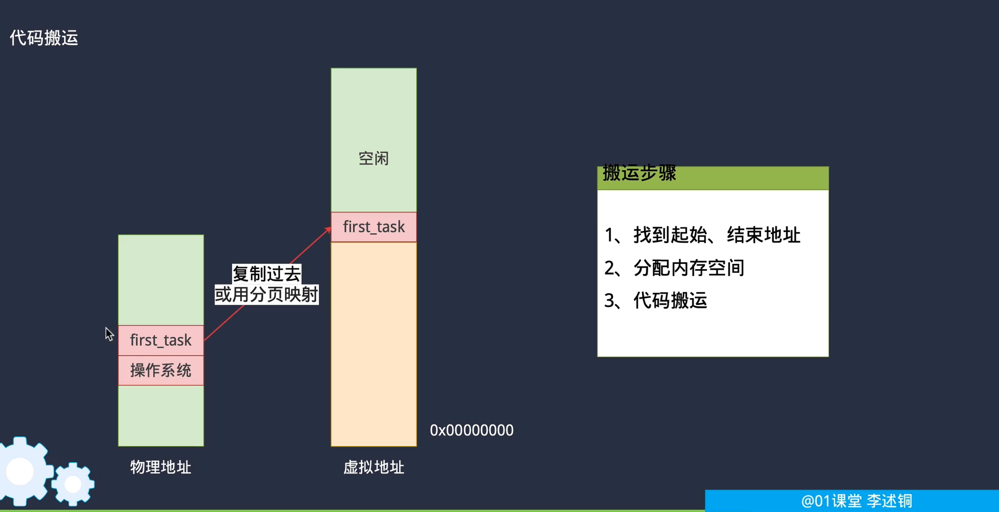

链接脚本设置first一开始的物理地址在内核后，虚拟地址 0x80000000

连接脚本用LOADADDR获得物理地址，并且给虚拟地址分配页空间然后memcpy

## 权限

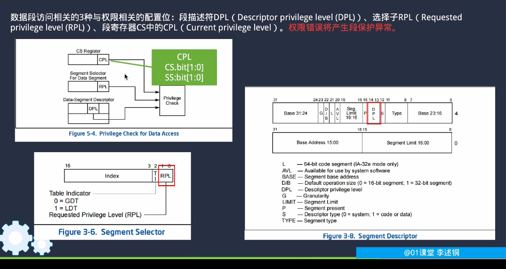

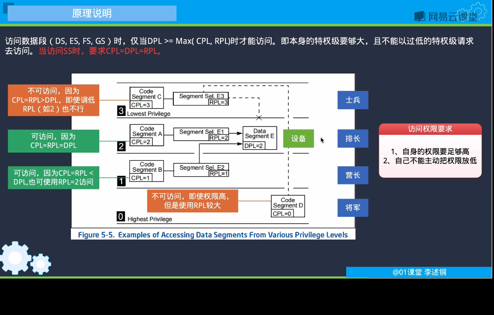

> CPL以RPL身份访问DPL，问题是跳转到Seg之后，CPL不就丢失了？
>
> 汇编跳转时候设置段段寄存器？
>
> 描述符写的是CLP,DPL也就是访问级别  然后tss.cs段选择子写的RPL，也就是身份级别

### 非一致性代码段

CPL==DPL

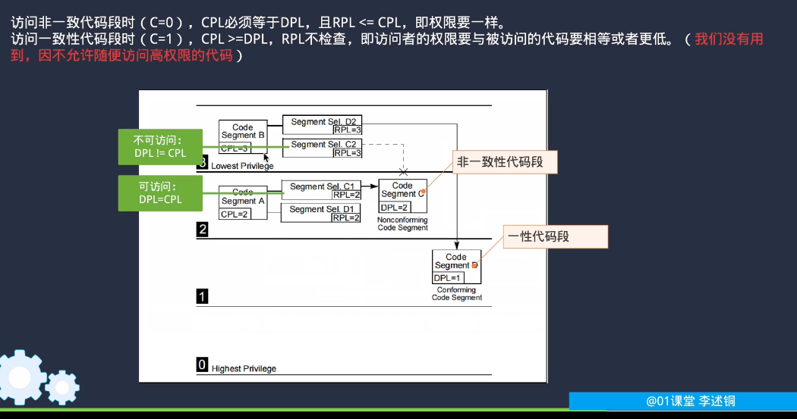

### 平坦模型无法保护

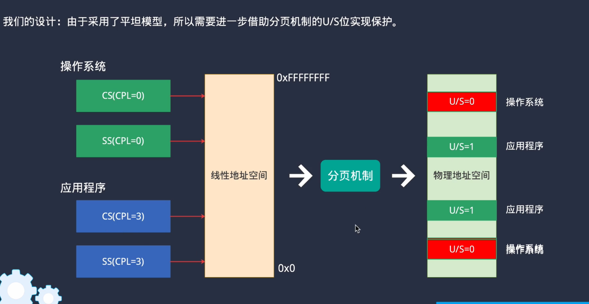

### 分页机制保护

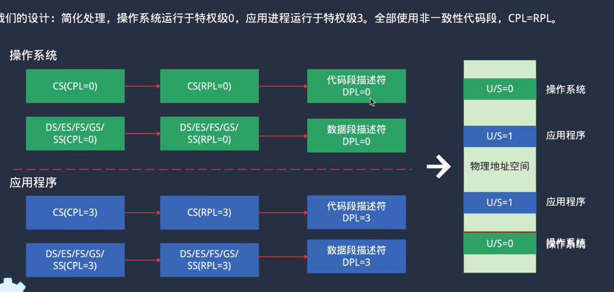


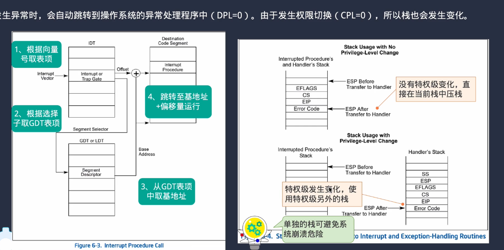

现在进程用的栈还是内核物理空间1M一下init/start.S里.bss里的栈？

但是后面运行first_task用iret和tss切换到进程后运行在特权级3，tss栈初始化是初始化随便写的0（之前0是因为之前first_task是就在内核执行的，切换任务会保存栈）

==而且现在进程特权级3，无法使用特权级0的栈空间==

### 异常

==现在是空闲函数在内核1M以内，tss 段选择子设置的是3，但是设置分页的时候1M以下US=0，==

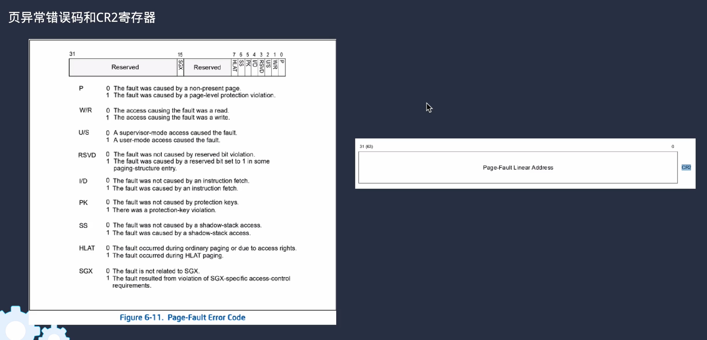


### 给进程创建特权级0和3的栈，

## 系统调用

### 调用门


**内核部分**

```c
/**
 * 初始化GDT
 */
void init_gdt(void) {
	// 全部清空
    for (int i = 0; i < GDT_TABLE_SIZE; i++) {
        segment_desc_set(i << 3, 0, 0, 0);
    }

    //数据段
    segment_desc_set(KERNEL_SELECTOR_DS, 0x00000000, 0xFFFFFFFF,
                     SEG_P_PRESENT | SEG_DPL0 | SEG_S_NORMAL | SEG_TYPE_DATA
                     | SEG_TYPE_RW | SEG_D | SEG_G);

    // 只能用非一致代码段，以便通过调用门更改当前任务的CPL执行关键的资源访问操作
    segment_desc_set(KERNEL_SELECTOR_CS, 0x00000000, 0xFFFFFFFF,
                     SEG_P_PRESENT | SEG_DPL0 | SEG_S_NORMAL | SEG_TYPE_CODE
                     | SEG_TYPE_RW | SEG_D | SEG_G);

    // 调用门
    gate_desc_set((gate_desc_t *)(gdt_table + (SELECTOR_SYSCALL >> 3)),
            KERNEL_SELECTOR_CS,
            (uint32_t)exception_handler_syscall,
            GATE_P_PRESENT | GATE_DPL3 | GATE_TYPE_SYSCALL | SYSCALL_PARAM_COUNT);

    // 加载gdt
    lgdt((uint32_t)gdt_table, sizeof(gdt_table));
}

```

进程lcalll会执行exception_handler_syscall

**进程部分**

```c
typedef struct _syscall_args_t {
    int id;
    int arg0;
    int arg1;
    int arg2;
    int arg3;
}syscall_args_t;

/**
 * 执行系统调用
 */
static inline int sys_call (syscall_args_t * args) {
    // 使用特权级0,其实比3高即可，偏移量不需要，填0即可。类似于far_jump函数的实现
	const unsigned long sys_gate_addr[] = {0, SELECTOR_SYSCALL | 0};
    int ret;

    // 采用调用门, 这里只支持5个参数
    // 用调用门的好处是会自动将参数复制到内核栈中，这样内核代码很好取参数
    // 而如果采用寄存器传递，取参比较困难，需要先压栈再取
    __asm__ __volatile__(
            "push %[arg3]\n\t"
            "push %[arg2]\n\t"
            "push %[arg1]\n\t"
            "push %[arg0]\n\t"
            "push %[id]\n\t"
            "lcalll *(%[gate])\n\n"
    		:"=a"(ret)
            :[arg3]"r"(args->arg3), [arg2]"r"(args->arg2), [arg1]"r"(args->arg1),
            [arg0]"r"(args->arg0), [id]"r"(args->id),
            [gate]"r"(sys_gate_addr));
    return ret;
}

static inline int msleep (int ms) {
    if (ms <= 0) {
        return 0;
    }

    syscall_args_t args;
    args.id = SYS_msleep;
    args.arg0 = ms;
	return sys_call(&args);
}
```

### int80中断方式*

## fork系统调用

```c
int sys_fork (void) {
    task_t * parent_task = task_current();

    // 分配任务结构
    task_t * child_task = alloc_task();
    if (child_task == (task_t *)0) {
        goto fork_failed;
    }

    syscall_frame_t * frame = (syscall_frame_t *)(parent_task->tss.esp0 - sizeof(syscall_frame_t));

    // 对子进程进行初始化，并对必要的字段进行调整
    // 其中esp要减去系统调用的总参数字节大小，因为其是通过正常的ret返回, 而没有走系统调用处理的ret(参数个数返回)
    int err = task_init(child_task,  parent_task->name, 0, frame->eip,
                        frame->esp + sizeof(uint32_t)*SYSCALL_PARAM_COUNT);
    if (err < 0) {
        goto fork_failed;
    }

    // 从父进程的栈中取部分状态，然后写入tss。
    // 注意检查esp, eip等是否在用户空间范围内，不然会造成page_fault
    tss_t * tss = &child_task->tss;
    tss->eax = 0;                       // 子进程返回0
    tss->ebx = frame->ebx;
    tss->ecx = frame->ecx;
    tss->edx = frame->edx;
    tss->esi = frame->esi;
    tss->edi = frame->edi;
    tss->ebp = frame->ebp;

    tss->cs = frame->cs;
    tss->ds = frame->ds;
    tss->es = frame->es;
    tss->fs = frame->fs;
    tss->gs = frame->gs;
    tss->eflags = frame->eflags;

    child_task->parent = parent_task;

    // 复制父进程的内存空间到子进程
    if ((child_task->tss.cr3 = memory_copy_uvm(parent_task->tss.cr3)) < 0) {
        goto fork_failed;
    }

    // 创建成功，返回子进程的pid
    return child_task->pid;
fork_failed:
    if (child_task) {
        task_uninit (child_task);
        free_task(child_task);
    }
    return -1;
}

```


> ```
>  syscall_frame_t * frame = (syscall_frame_t *)(parent_task->tss.esp0 - sizeof(syscall_frame_t));
> ```
>
> 


父进程是从特权级0回到3，但是子进程是tss切换，没有压栈出栈操作

为什么父子进程可以用同一个栈呢？这不是都乱了么？

物理页也不能相同吧？


所以需要拷贝

```c
/**
 * @brief 复制页表及其所有的内存空间
 */
uint32_t memory_copy_uvm (uint32_t page_dir) {
    // 复制基础页表
    uint32_t to_page_dir = memory_create_uvm();
    if (to_page_dir == 0) {
        goto copy_uvm_failed;
    }

    // 再复制用户空间的各项
    uint32_t user_pde_start = pde_index(MEMORY_TASK_BASE);
    pde_t * pde = (pde_t *)page_dir + user_pde_start;

    // 遍历用户空间页目录项
    for (int i = user_pde_start; i < PDE_CNT; i++, pde++) {
        if (!pde->present) {
            continue;
        }

        // 遍历页表
        pte_t * pte = (pte_t *)pde_paddr(pde);
        for (int j = 0; j < PTE_CNT; j++, pte++) {
            if (!pte->present) {
                continue;
            }

            // 分配物理内存
            uint32_t page = addr_alloc_page(&paddr_alloc, 1);
            if (page == 0) {
                goto copy_uvm_failed;
            }

            // 建立映射关系
            uint32_t vaddr = (i << 22) | (j << 12);
            int err = memory_create_map((pde_t *)to_page_dir, vaddr, page, 1, get_pte_perm(pte));
            if (err < 0) {
                goto copy_uvm_failed;
            }

            // 复制内容。
            kernel_memcpy((void *)page, (void *)vaddr, MEM_PAGE_SIZE);
        }
    }
    return to_page_dir;

copy_uvm_failed:
    if (to_page_dir) {
        memory_destroy_uvm(to_page_dir);
    }
    return -1;
}
```

虚拟地址从原页表获取，真实物理地址,然后复制内容。

```
kernel_memcpy((void *)page, (void *)vaddr, MEM_PAGE_SIZE);
```


## exec系统调用

比fork要复杂

### 要解析elf以及加载

```c
static int load_phdr(int file, Elf32_Phdr * phdr, uint32_t page_dir) {
    // 生成的ELF文件要求是页边界对齐的
    ASSERT((phdr->p_vaddr & (MEM_PAGE_SIZE - 1)) == 0);

    // 分配空间
    int err = memory_alloc_for_page_dir(page_dir, phdr->p_vaddr, phdr->p_memsz, PTE_P | PTE_U | PTE_W);
    if (err < 0) {
        log_printf("no memory");
        return -1;
    }

    // 调整当前的读写位置
    if (sys_lseek(file, phdr->p_offset, 0) < 0) {
        log_printf("read file failed");
        return -1;
    }

    // 为段分配所有的内存空间.后续操作如果失败，将在上层释放
    // 简单起见，设置成可写模式，也许可考虑根据phdr->flags设置成只读
    // 因为没有找到该值的详细定义，所以没有加上
    uint32_t vaddr = phdr->p_vaddr;
    uint32_t size = phdr->p_filesz;
    while (size > 0) {
        int curr_size = (size > MEM_PAGE_SIZE) ? MEM_PAGE_SIZE : size;

        uint32_t paddr = memory_get_paddr(page_dir, vaddr);

        // 注意，这里用的页表仍然是当前的
        if (sys_read(file, (char *)paddr, curr_size) <  curr_size) {
            log_printf("read file failed");
            return -1;
        }

        size -= curr_size;
        vaddr += curr_size;
    }

    // bss区考虑由crt0和cstart自行清0，这样更简单一些
    // 如果在上边进行处理，需要考虑到有可能的跨页表填充数据，懒得写代码
    // 或者也可修改memory_alloc_for_page_dir，增加分配时清0页表，但这样开销较大
    // 所以，直接放在cstart哐crt0中直接内存填0，比较简单
    return 0;
}
```

这里虽然分配的新的页表page_dir的空间，但是还没有set切换映射关系，所以需要获得物理地址


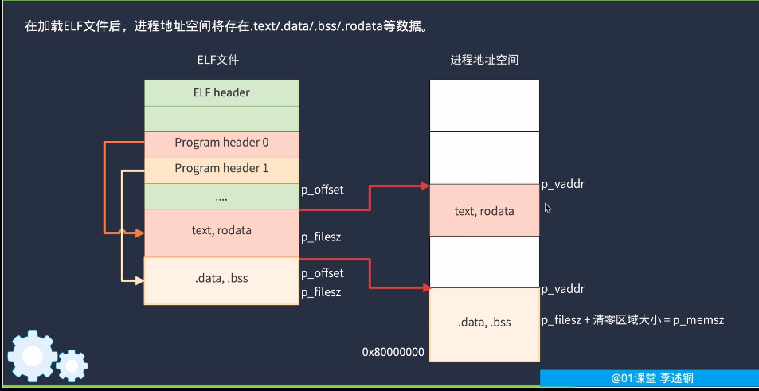

```c
int sys_execve(char *name, char **argv, char **env) {
    task_t * task = task_current();

    // 后面会切换页表，所以先处理需要从进程空间取数据的情况
    kernel_strncpy(task->name, get_file_name(name), TASK_NAME_SIZE);

    // 现在开始加载了，先准备应用页表，由于所有操作均在内核区中进行，所以可以直接先切换到新页表
    uint32_t old_page_dir = task->tss.cr3;
    uint32_t new_page_dir = memory_create_uvm();
    if (!new_page_dir) {
        goto exec_failed;
    }

    // 加载elf文件到内存中。要放在开启新页表之后，这样才能对相应的内存区域写
    uint32_t entry = load_elf_file(task, name, new_page_dir);    // 暂时置用task->name表示
    if (entry == 0) {
        goto exec_failed;
    }
```


> 修改tss? ==应该不需要==


### 分配栈

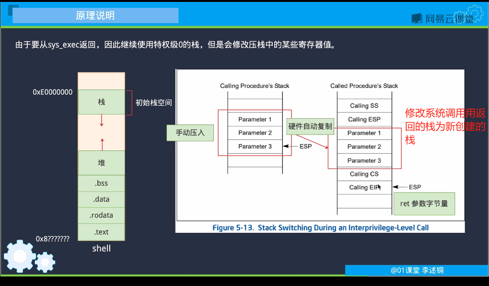

要修改栈内的寄存器

```c
int sys_execve(char *name, char **argv, char **env) {

   	......
   	
   	
    // 加载完毕，为程序的执行做必要准备
    // 注意，exec的作用是替换掉当前进程，所以只要改变当前进程的执行流即可
    // 当该进程恢复运行时，像完全重新运行一样，所以用户栈要设置成初始模式
    // 运行地址要设备成整个程序的入口地址
    syscall_frame_t * frame = (syscall_frame_t *)(task->tss.esp0 - sizeof(syscall_frame_t));
    frame->eip = entry;
    frame->eax = frame->ebx = frame->ecx = frame->edx = 0;
    frame->esi = frame->edi = frame->ebp = 0;
    frame->eflags = EFLAGS_DEFAULT| EFLAGS_IF;  // 段寄存器无需修改

    // 内核栈不用设置，保持不变，后面调用memory_destroy_uvm并不会销毁内核栈的映射。
    // 但用户栈需要更改, 同样要加上调用门的参数压栈空间
    frame->esp = stack_top - sizeof(uint32_t)*SYSCALL_PARAM_COUNT;

    // 切换到新的页表
    task->tss.cr3 = new_page_dir;
    mmu_set_page_dir(new_page_dir);   // 切换至新的页表。由于不用访问原栈及数据，所以并无问题

    // 调整页表，切换成新的，同时释放掉之前的
    // 当前使用的是内核栈，而内核栈并未映射到进程地址空间中，所以下面的释放没有问题
    memory_destroy_uvm(old_page_dir);            // 再释放掉了原进程的内容空间

    // 当从系统调用中返回时，将切换至新进程的入口地址运行，并且进程能够获取参数
    // 注意，如果用户栈设置不当，可能导致返回后运行出现异常。可在gdb中使用nexti单步观察运行流程
    return  0;

exec_failed:    // 必要的资源释放
    if (new_page_dir) {
        // 有页表空间切换，切换至旧页表，销毁新页表
        task->tss.cr3 = old_page_dir;
        mmu_set_page_dir(old_page_dir);
        memory_destroy_uvm(new_page_dir);
    }

    return -1;
}
```

需要释放原来的页表内存

### 给main传递参数

==为什么要在main之前弄个crt0为什么不能直接从main开始执行呢？==

```c
 * @brief 在不同的进程空间中拷贝字符串
 * page_dir为目标页表，当前仍为老页表
 */
int memory_copy_uvm_data(uint32_t to, uint32_t page_dir, uint32_t from, uint32_t size) {
    char *buf, *pa0;

    while(size > 0){
        // 获取目标的物理地址, 也即其另一个虚拟地址
        uint32_t to_paddr = memory_get_paddr(page_dir, to);
        if (to_paddr == 0) {
            return -1;
        }

        // 计算当前可拷贝的大小
        uint32_t offset_in_page = to_paddr & (MEM_PAGE_SIZE - 1);
        uint32_t curr_size = MEM_PAGE_SIZE - offset_in_page;
        if (curr_size > size) {
            curr_size = size;       // 如果比较大，超过页边界，则只拷贝此页内的
        }

        kernel_memcpy((void *)to_paddr, (void *)from, curr_size);

        size -= curr_size;
        to += curr_size;
        from += curr_size;
  }

  return 0;
}
```

```c
memory_get_paddr(page_dir, to);
kernel_memcpy((void *)to_paddr, (void *)from, curr_size);
获得新页物理地址然后系统调用拷贝
 为什么物理地址和虚拟地址一样呢？
```


