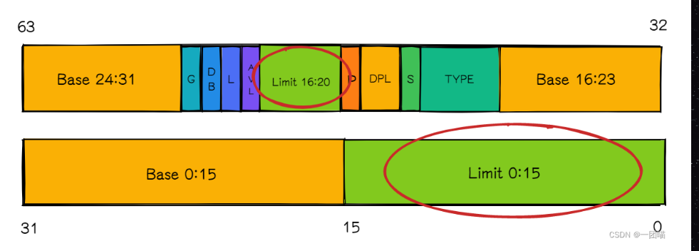

[TOC]


## 视频1

[爱学习的阿噜](https://www.bilibili.com/video/BV1RX4y157CM/?p=23&spm_id_from=333.1007.top_right_bar_window_history.content.click&vd_source=eef102f4fb053709a57c96d0c876628a)

github代码地址：https://github.com/luliyucoordinate/myos

## 视频2

[Write your own Operating System](https://www.bilibili.com/video/BV1Ut411o7VG/?p=1&spm_id_from=pageDriver&vd_source=eef102f4fb053709a57c96d0c876628a)

:https://github.com/AlgorithMan-de/wyoos


## 博客

[==使用C/C++实现一个操作系统 (4)==](https://zhuanlan.zhihu.com/p/390611337)

[C++手写操作系统学习笔记（一）——操作系统引导和安全模式](https://blog.csdn.net/weixin_45919625/article/details/129482406)


- x86架构, 32 位平台中的 86和32是什么意思

x86是指令集    Intel 8086 处理器

64是系统的位数，指针地址的位数

# [Make-a-Computer-Operating-System-form-scratch](https://github.com/zyfjeff/zyfos/tree/master)

## 环境

[vagrant安装](https://www.cnblogs.com/Se7eN-HOU/p/16171456.html)

必须运行在32位的机器，所以必须要虚拟机


### 安装virtualbox

[【环境搭建】ubuntu上安装vagrant](https://blog.csdn.net/weixin_42641395/article/details/82430021)

>  sudo  apt-get install libqt5x11extras5

[历史版本](https://www.virtualbox.org/wiki/Download_Old_Builds_6_1)


### 安装vagrant

[如何在 Ubuntu 20.04 上安装 Vagrant](http://www.manongjc.com/detail/56-rrubbaydvhrrqmu.html)

[vagrant镜像](https://app.vagrantup.com/boxes/search?utf8=%E2%9C%93&sort=downloads&provider=&q=ubuntu)

[历史版本](https://releases.hashicorp.com/vagrant/2.3.7)


### 版本对应

```
(base) wangkai@wangkai-Legion-Y9000P-IAH7H:~$ vagrant -v
Vagrant 2.3.7

```


> 否则试试vagrant up --provider=virtualbox


### 配置文件

```
Vagrant.configure("2") do |config|
  # The most common configuration options are documented and commented below.
  # For a complete reference, please see the online documentation at
  # https://docs.vagrantup.com.

  # Every Vagrant development environment requires a box. You can search for
  # boxes at https://vagrantcloud.com/search.
  config.vm.box = "mrgcastle/ubuntu-lucid32"
  config.vm.box_version = "1.0.0.0"
```

注意要Vagrant up在Vagrant目录下

用户名和密码都是vagrant

### 没有网络

"mrgcastle/ubuntu-lucid32"没有网络但是ubuntu16.04  config.vm.box = "alvaro/ubuntu32bit"就有网络

用的就是nat


### 桌面系统

servers版本是没有桌面系统的,

[好像box都没有图像界面==有用==](https://blog.csdn.net/qq_44641344/article/details/104998915?spm=1001.2101.3001.6650.1&utm_medium=distribute.pc_relevant.none-task-blog-2%7Edefault%7ECTRLIST%7Edefault-1-104998915-blog-80869695.pc_relevant_default&depth_1-utm_source=distribute.pc_relevant.none-task-blog-2%7Edefault%7ECTRLIST%7Edefault-1-104998915-blog-80869695.pc_relevant_default&utm_relevant_index=2%20%E2%80%94%E2%80%94%E2%80%94%E2%80%94%E2%80%94%E2%80%94%E2%80%94%E2%80%94%E2%80%94%E2%80%94%E2%80%94%E2%80%94%E2%80%94%E2%80%94%E2%80%94%E2%80%94%20%E7%89%88%E6%9D%83%E5%A3%B0%E6%98%8E%EF%BC%9A%E6%9C%AC%E6%96%87%E4%B8%BA%E5%8D%9A%E4%B8%BB%E5%8E%9F%E5%88%9B%E6%96%87%E7%AB%A0%EF%BC%8C%E9%81%B5%E5%BE%AA%20CC%204.0%20BY-SA%20%E7%89%88%E6%9D%83%E5%8D%8F%E8%AE%AE%EF%BC%8C%E8%BD%AC%E8%BD%BD%E8%AF%B7%E9%99%84%E4%B8%8A%E5%8E%9F%E6%96%87%E5%87%BA%E5%A4%84%E9%93%BE%E6%8E%A5%E5%92%8C%E6%9C%AC%E5%A3%B0%E6%98%8E%E3%80%82%20%E5%8E%9F%E6%96%87%E9%93%BE%E6%8E%A5%EF%BC%9Ahttps://blog.csdn.net/shaoming314/article/details/124963740)

```
sudo apt-get install ubuntu-desktop #安装桌面软件
```


### [apt源替换](https://blog.csdn.net/weixin_40212662/article/details/134148444)

https://blog.csdn.net/qq_41926119/article/details/135082641

其实可以不用，就像conda或者更像服务器ssh那样用


下图是config.vm.box = "bento/ubuntu-20.04"


https://www.cnblogs.com/yourenbo/p/18049145

```
cat > /etc/apt/sources.list << "EOF"
deb https://mirrors.shanhe.com/ubuntu/ bionic main restricted universe multiverse
deb-src https://mirrors.shanhe.com/ubuntu/ bionic main restricted universe multiverse
deb https://mirrors.shanhe.com/ubuntu/ bionic-security main restricted universe multiverse
deb-src https://mirrors.shanhe.com/ubuntu/ bionic-security main restricted universe multiverse

deb https://mirrors.shanhe.com/ubuntu/ bionic-updates main restricted universe multiverse
deb-src https://mirrors.shanhe.com/ubuntu/ bionic-updates main restricted universe multiverse

deb https://mirrors.shanhe.com/ubuntu/ bionic-backports main restricted universe multiverse
deb-src https://mirrors.shanhe.com/ubuntu/ bionic-backports main restricted universe multiverse

## Not recommended
# deb http://mirrors.shanhe.com/ubuntu/ bionic-proposed main restricted universe multiverse
# deb-src http://mirrors.shanhe.com/ubuntu/ bionic-proposed main restricted universe multiverse
EOF
然后执行以下命令：

bash
apt-get clean all
apt-get update
接着再次使用apt-get安装对应的包即可解决问题：

bash
apt-get install 包名
```


[qemu no command](https://github.com/SamyPesse/How-to-Make-a-Computer-Operating-System/issues/63) 

qemu-system-i386替代

内存不够就512


[Booting from Hard Disk..](https://github.com/SamyPesse/How-to-Make-a-Computer-Operating-System/issues/62).


### 成功卡在boot

然后运行/usr/bin/qemu-system-i386 -m 1024 -s -hda ./c.img  -curses -serial /dev/tty  -redir tcp:2323::23一直卡在 Booting from Hard Disk...

  config.vm.box = "alvaro/ubuntu32bit"

### iso镜像

安装的时候需要跳过自动安装，否则没有终端的情况


# [b站使用c++编写操作系统](https://www.bilibili.com/video/BV1RX4y157CM/?p=2&spm_id_from=pageDriver&vd_source=eef102f4fb053709a57c96d0c876628a)

## 网址

原版 https://github.com/AlgorithMan-de/wyoos

github代码地址：https://github.com/luliyucoordinate/myos

gitee  https://gitee.com/Aax773/alice 

## makefile

> 下面是变量的定义和使用
> foo = abc
> // 定义变量并赋值
> bar = $(foo)
> // 使用变量, $(变量名)
> 定义了两个变量: foo、bar, 其中 bar 的值是 foo 变量值的引用。

> ```
> $@: 表示规则中的目标
> $<: 表示规则中的第一个条件
> $^: 表示规则中的所有条件, 组成一个列表, 以空格隔开, 如果这个列表中有重复的项则
> 消除重复项
> ```

> 至少在规则的目标定义中要包含’%’, ‘%’表示一个或多个, 在依赖条件中同样可以使
> 用’%’, 依赖条件中的’%’的取值取决于其目标:
> 比如: main.o:main.c fun1.o: fun1.c fun2.o:fun2.c, 说的简单点就是: xxx.o:xxx.c

> makefile 中的函数有很多, 在这里给大家介绍两个最常用的。
>
> 1. wildcard – 查找指定目录下的指定类型的文件
>    src=$(wildcard *.c) //找到当前目录下所有后缀为.c 的文件,赋值给 src
> 2. patsubst – 匹配替换
>    obj=$(patsubst %.c,%.o, $(src)) //把 src 变量里所有后缀为.c 的文件替换成.o

## [汇编语法](https://blog.csdn.net/qq_42952079/article/details/121442359)

[VV的操作系统笔记（一）操作系统I](https://cloud.tencent.com/developer/article/1414532)


```
.set MAGIC,0x1badb002
.set FLAGS, (1<<0 | 1<<1)
.set CHECKSUM, -(MAGIC + FLAGS)  

.section .multiboot
    .long MAGIC
    .long FLAGS
    .long CHECKSUM

;grub启动规则:
;一个魔术块：包含了魔法数[0x1BADB002]，是多引导项头结构的定义值。
;一个标志块：我们不关心这个块的内容，我们简单设定为0。
;一个校检块：校检块，魔术块和标志块的数值的总和必须是0。

.section .text                  
.extern _kernelMain               
.extern _callConstructors        ;kernel.cpp中定义的构造函数和操作系统主函数
.global loader 

loader:
    mov $kernel_stack, %esp     ；汇编调用C函数时要使用栈

    call _callConstructors    ；constructor：构造函数 ，是一种特殊的方法。主要用来在创建对
                             ；象时初始化对象， 即为对象成员变量赋初始值，
    push %eax
    push %ebx               ；push接受来自kernelMain的两个参数：multiboot_structrue，magicnumber
    call _kernelMain

_stop:
    cli
    hlt
    jmp _stop

 ;cli :将IF置0，屏蔽掉“可屏蔽中断”，当可屏蔽中断到来时CPU不响应，继续执行原指令
 ;hlt:本指令是处理器“暂停”指令。
 ;jmp _stop : 命令跳转指令
 ;_stop:确保操作系统进入循环不会退出

.section .bss
.space 2*1024*1024         ;留出2M空间给kernel_stack
kernel_stack:              ;定义kernel_stack栈顶位置
```


```
这段汇编代码看起来是一个引导加载程序（bootloader），用于加载操作系统内核。让我来解释一下这段代码的每一部分：

.set MAGIC, 0x1badb002;GRUB魔术块: 这行定义了一个名为 MAGIC 的符号，其值为 0x1badb002，这是 GRUB 魔术块的值。

.set FLAGS, (1<<0 | 1<<1);GRUB标志块: 这行定义了一个名为 FLAGS 的符号，其值为 0b11，这是 GRUB 标志块的值。

.set CHECKSUM, -(MAGIC + FLAGS);校验块: 这行定义了一个名为 CHECKSUM 的符号，其值为 -(MAGIC + FLAGS)，即校验块的值。

.section .multboot: 这行指示汇编器将接下来的代码放入 .multiboot 段中，这是一个特殊的段，用于 GRUB 加载程序。

.long MAGIC: 这行将 MAGIC 的值放入 .multiboot 段中，用于标识 GRUB 魔术块。

.long FLAGS: 这行将 FLAGS 的值放入 .multiboot 段中，用于指定 GRUB 标志。

.long CHECKSUM: 这行将 CHECKSUM 的值放入 .multiboot 段中，用于校验。

.section .text: 这行指示汇编器将接下来的代码放入 .text 段中，这是程序的代码段。

.extern kernel_main: 这行声明了一个外部符号 kernel_main，该符号是操作系统内核的入口点。

.extern system_constructors: 这行声明了一个外部符号 system_constructors，可能是用于初始化系统的一些构造函数。

.global laoder: 这行声明了一个全局符号 loader，这是引导加载程序的入口点。

loader:: 这是 loader 函数的标签，即引导加载程序的入口点。

mov $kernel_stack, %esp: 这行将 kernel_stack 的地址加载到栈指针寄存器 %esp 中，即设置内核栈。

call system_constructors: 这行调用 system_constructors 函数，可能是用于初始化系统的一些构造函数。

push %eax: 这行将 %eax 寄存器的值压入栈中，保存调用 system_constructors 函数的返回值。

push %ebx: 这行将 %ebx 寄存器的值压入栈中，保存调用 system_constructors 函数时 %ebx 寄存器的值。

call kernel_main: 这行调用 kernel_main 函数，即操作系统内核的入口点。

stop:: 这是一个标签，用于定义一个无限循环的停止点。

cli: 这行禁用中断。

hlt: 这行使处理器进入睡眠状态，直到接收到中断或复位。

jmp stop: 这行跳转到 stop 标签处，形成一个无限循环，程序会停留在这里。

.section .bss: 这行指示汇编器将接下来的未初始化的数据放入 .bss 段中，这是一个特殊的段，用于存储未初始化的全局变量和静态变量。

.space 2*1024*1024: 这行分配了一个大小为 2MB 的空间，用于内核栈的定义。
```


# 汇编

## [汇编语法](https://blog.csdn.net/qq_42952079/article/details/121442359)


## 例子

[【汇编】CPU 指令  加法汇报例子](https://blog.csdn.net/oqqHun123/article/details/88749185)

[helloworld例子](https://blog.csdn.net/StayAlive1887/article/details/132216012)

8086

````


```
DATA SEGMENT
  AA DB 0DH, 20H     ;数据段
DATA ENDS

EXTRA SEGMENT 
  BN  DW 3478H       ;附加段
EXTRA ENDS

ASTACK SEGMENT STACK
       DW 256 DUP(0) ;堆栈段
  TOP  LABEL  WORD
ASTACK ENDS

CODE SEGMENT         ;代码段
  ASSUME CS:CODE,DS:DATA,ES:EXTRA,SS:ASTACK;ASSUME 指令用于为这些段寄存器指定与之关联的段名。

START:
    MOV AX, DATA ;初始化DS
    MOV DS, AX
    
    MOV AX, EXTRA ;初始化ES
    MOV ES, AX
    
    MOV AX, ASTACK ;初始化SS
    MOV SS, AX
    LEA SP, TOP ;初始化SP
    
CODE ENDS
     END  START

```

````


## [寄存器的作用](https://blog.csdn.net/gmingzhou/article/details/78118582)

> #### 一般[寄存器](https://so.csdn.net/so/search?q=寄存器&spm=1001.2101.3001.7020):AX、BX、CX、DX
>
> **AX:累积暂存器，BX:基底暂存器，CX:计数暂存器，DX:资料暂存器**
>
> #### 索引暂存器:SI、DI
>
> **SI:来源索引暂存器，DI:目的索引暂存器**
>
> #### 堆叠、基底暂存器:SP、BP
>
> **SP:堆叠指标暂存器，BP:基底指标暂存器**
>
> **EAX、ECX、EDX、EBX：為ax,bx,cx,dx的延伸，各為32位元**
> **ESI、EDI、ESP、EBP：為si,di,sp,bp的延伸，32位元**
>
> **eax, ebx, ecx, edx, esi, edi, ebp, esp**等都是**X86** 汇编语言中CPU上的通用寄存器的名称，是32位的寄存器。如果用C语言来解释，可以把这些寄存器当作变量看待。
>
> 比方说：add eax,-2 ; //可以认为是给变量eax加上-2这样的一个值。
>
> 这些32位寄存器有多种用途，但每一个都有“专长”，有各自的特别之处。
>
> **EAX 是”累加器”(accumulator), 它是很多加法乘法指令的缺省寄存器。**
>
> **EBX 是”基地址”(base)寄存器, 在内存寻址时存放基地址。**
>
> **ECX 是计数器(counter), 是重复(REP)前缀指令和LOOP指令的内定计数器。**
>
> **EDX 则总是被用来放整数除法产生的余数。**
>
> **ESI/EDI分别叫做”源/目标索引寄存器”(source/destination index),因为在很多字符串操作指令中, DS:ESI指向源串,而ES:EDI指向目标串。**

## [函数返回值的传递](https://blog.csdn.net/RUN32875094/article/details/78426442)

除了函数参数的传递之外，函数与调用方的另一个交互方式就是返回值。

在返回不同字节大小的返回值编译器的处理方式不一样：

小于4个字节：

函数将返回值存储在eax寄存器中，返回调用方之后在读取eax寄存器的值

大于4字节小于等于8字节：

函数返回值通过两个寄存器，eax和edx存储返回后读取。


## [段](https://blog.csdn.net/qq_34149335/article/details/122674809)

```
在汇编语言中，.text 和 .bss 是常见的段名，但并不是只能使用这些名字。它们是约定俗成的名称，通常用于指定不同类型的内存段。

.text 段通常用于存放程序的机器码指令，即可执行的代码。
.bss 段通常用于存放未初始化的全局或静态变量，这些变量在程序执行前不需要分配内存，只需要指定它们的大小即可。
尽管 .text 和 .bss 是常用的段名，但实际上你可以使用其他名称来定义段。例如，你可以定义一个名为 .code 的段来存放代码，或者定义一个名为 .data 的段来存放初始化的全局变量。

使用这些常见的段名有助于代码的可读性和可维护性，因为其他人在阅读代码时可以直观地了解到每个段的用途。但从技术上讲，你并不受限于这些名称，可以根据需要自定义段名。
```

### ASSUME数据段的定义

[ASSUME CS:CODE,可以建立段和寄存器的关联](https://blog.csdn.net/qq_60511652/article/details/128729620)

```
.set MAGIC, 0x1badb002 ; GRUB魔术块
.set FLAGS, (1<<0 | 1<<1) ; GRUB标志块
.set CHECKSUM, -(MAGIC + FLAGS) ; 校验块

ASSUME DS:.mybss ; 将 DS 寄存器与 .mybss 段建立关联

.section .multboot
    .long MAGIC
    .long FLAGS
    .long CHECKSUM

.section .text
.extern kernel_main
.extern system_constructors
.global loader

loader:
    mov $kernel_stack, %esp
    call system_constructors
    push %eax
    push %ebx
    call kernel_main

stop:
    cli
    hlt
    jmp stop

.section .mybss
.space 2*1024*1024
kernel_stack:
```


## Loader.s


```
.set MAGIC, 0x1badb002;GRUB魔术块
.set FLAGS, (1<<0 | 1<<1);GRUB标志块
.set CHECKSUM, -(MAGIC + FLAGS);校验块
 
.section .multboot
	.long MAGIC
	.long FLAGS
	.long CHECKSUM

;文本部分通常用来保存代码。这个部分必须以global _start开头，用来告诉内核程序从哪里开始执行。
;声明文本部分语法：

.section .text
.extern kernel_main;导入kernel_main
.extern system_constructors;导入系统构造函数
.global laoder
 
loader:
	mov $kernel_stack, %esp ;%esp寄存器给到 $kernel_stack  $是取地址
	call system_constructors
	push %eax
	push %ebx
	call kernel_main
 
stop:
	cli
	hlt
	jmp stop
 
.section .bss
.space 2*1024*1024
kernel_stack:
```

> 通常情况下，这些参数会通过寄存器或者栈来传递。在 x86 架构上，通常会使用栈来传递参数。在调用函数之前，调用者会将函数的参数依次压入栈中，然后调用函数。被调用的函数在栈中找到这些参数，并在执行过程中使用它们。
>
> 因此，在这段代码中，`multiboot_structure` 和 `magicnumber` 参数可能会被依次压入栈中，然后在调用 `kernel_main` 函数时，函数内部通过栈来获取这两个参数的值。

## linker.ld


```
让我们逐行解释 linker.ld 文件的内容：

ENTRY(boot)：指定程序的入口点为 boot 标签，这意味着程序的执行将从 boot 标签处开始。

OUTPUT_FORMAT(elf32-i386)：指定输出文件的格式为 ELF 格式，32 位的 Intel x86 架构。

OUTPUT_ARCH(i386:i386)：指定输出文件的架构为 i386（Intel 80386）。

SECTIONS {：开始定义段的布局。

. = 0x0100000;：将当前位置设置为内存地址 0x0100000，这是程序的起始地址。

.text :{：开始定义代码段。代码段包含了程序的可执行代码。

*(.muiltboot)：将所有名为 .muiltboot 的段合并到代码段中。
*(.text*)：将所有以 .text 开头的段合并到代码段中。
*(.rodata)：将所有只读数据段合并到代码段中。
}：结束代码段定义。

.data :：开始定义数据段。数据段包含了程序中的初始化数据。

start_ctors = .;：定义一个名为 start_ctors 的符号，其值为当前位置（当前位置即数据段的起始位置）。
KEEP(*(.init_array ))：保留所有名为 .init_array 的段。
KEEP(*(SORT_BY_INIT_PRIORITY( .init_array.* )))：保留所有按初始化优先级排序的 .init_array.* 段。
end_ctors = .;：定义一个名为 end_ctors 的符号，其值为当前位置（当前位置即数据段的末尾位置）。
注：.init_array 是一个数组，它包含了在程序启动时需要执行的初始化函数。

*(.data)：将所有数据段合并到数据段中。

.bss :：开始定义未初始化数据段。未初始化数据段通常用于存储程序中的未初始化的全局变量和静态变量。

*(.bss)：将所有名为 .bss 的段合并到未初始化数据段中。
/DISCARD/ : {：开始定义不需要包含在输出文件中的内容。

*(.fini_array*)：丢弃所有名为 .fini_array 的段。
*(.comment)：丢弃所有注释信息。
}：结束段定义。
```

这段链接脚本的目的是为了将构造函数指针数组（通常是由编译器生成的）放置在 `.data` 段中，并定义了该数组的起始位置和结束位置。

start_ctors

```c
.data :
{
    start_ctors = .;
    KEEP(*(.init_array ));
    KEEP(*(SORT_BY_INIT_PRIORITY( .init_array.* )));
    end_ctors = .;

    *(.data)
}


//操作系统构造函数委托方法
typedef void(*constructor)();
//全局定义构造委托
constructor start_ctors;
//全局定义析构委托
constructor end_ctors;


//轮询函数，并且执行
extern "C" void system_constructors(){
	for(constructor* i=&start_ctors;i!=&end_ctors;i+=1){
		(*i)();
	}
}
```

我也不懂，大概是为了调用kernel_main的时候，把全局的类和变量进行初始化操作

## makefile

```
GCCPARAMS = -m32 -W -fno-use-cxa-atexit -nostdlib -fno-builtin -fno-builtin -fno-rtti -fno-exceptions -fno-leading-underscore
ASPPARAMS = --32
LDPARAMS = -melf_i386
GCC = g++
ASM = as
LINKER = ld -m elf_i386
CFLAGS = -o $@ -c $<
ASMFLAGS = -o $@ $<
LINKERFLAGS = -T $< -o $@ 
 
objects = loader.o kernel.o
 
%.o: %.cpp
	$(GCC) $(GCCPARAMS) $(CFLAGS)
	
%.o: %.s
	$(ASM) $(ASPPARAMS) $(ASMFLAGS)
	
mykernel.bin: linker.ld $(objects)
	$(LINKER) $(LINKERFLAGS) $(objects)
	
	
install: mykernel.bin
	sudo cp $< /boot/mykernel.bin
 
```

> 注意 ： LINKER = ld -m elf_i386

## install

修改grub.cfg

如果virtualbox没有grub修改timeout为-1


# 类定义

## [typedef高阶](https://blog.csdn.net/weixin_56238446/article/details/124646514)

>    1.为数组定义简洁的类型名称
>
> #include<stdio.h>
> typedef int a[100];
> int main() 
> {
> 	a x;
> 	int i=0;
> 	for(i=0;i<100;i++)
> 	{
> 		x[i]=i;
> 	}
> 	for(i=0;i<100;i++)
> 	{
> 		printf("%d\t",x[i]);
> 	}
> }


## uint8_t作用

[typedef的用法及与define的区别](https://blog.csdn.net/m0_64770246/article/details/124209343)

[c语言中用户定义类型（typedef）的作用](https://blog.csdn.net/zy986718042/article/details/72354346)

> 16位平台
>
> char     1个字节8位
> short    2个字节16位
> int      2个字节16位
> long     4个字节32位
> 指针     2个字节
>
> 32位平台
>
> char     1个字节8位
> short    2个字节16位
> int      4个字节32位
> long     4个字节
> long long 8个字节
> 指针     4个字节
>
> 64位平台
>
> char     1个字节
> short    2个字节
> int      4个字节
> long     8个字节（区别）
> long long 8个字节
> 指针    8个字节（区别）
>
> 
>
> 
>
> 在各个不同的平台中，都会定义类似int32_t，int16_t，size_t，time_t这样的数据类型，他们实际都是不同的整型，但是他们的长度是固定的，这是他们被称为可移植性数据类型的原因。
>
> 他们的实现原理简介如下，比如在A平台中int是4字节的，那么A平台的int32_t是这么定义的：
>
> typedef int int32_t;
>
> 在B平台中，long long是4字节的，因此B平台的int32_t就是这么定义的：
>
> typedef long long int32_t;
>
> 这样就保证了不管用户程序在哪个平台运行，只要定义了int32_t的数据类型，就一定是4个字节的了。
> 
>

## [用户和内核态](https://blog.csdn.net/m0_56694518/article/details/131463575)


# GDT


> 保护模式下的段寄存器 由 16位的选择器 与 64位的段描述符寄存器 构成
> 段描述符寄存器： 存储段描述符
> 选择器：存储段描述符的索引
>
> PS：原先实模式下的各个段寄存器作为保护模式下的段选择器，80486中有6个(即CS,SS,DS,ES,FS,GS)80位的段寄存器，同时提供6个段左右机器当前运行的地址空间。由选择器CS对应表示的段仍为代码段，选择器SS对应表示的段仍为堆栈段
> ————————————————
>
> 原文链接：https://blog.csdn.net/billpig/article/details/5833980


## GDTR

GDTR 是全局描述符表寄存器（Global Descriptor Table Register）的缩写。GDTR 是一个48位的寄存器，用于存储全局描述符表（GDT）的地址和大小信息。

```c
GlobalDescriptorTable::GlobalDescriptorTable()
    : nullSegmentDescriptor(0, 0, 0),
    unusedSegmentDescriptor(0, 0, 0),
    codeSegmentDescriptor(0, 64 * 1024 * 1024, 0x9a),
    dataSegmentDescriptor(0, 64 * 1024 * 1024, 0x92) {
    uint32_t i[2];
    i[1] = (uint32_t)this;
    i[0] = sizeof(GlobalDescriptorTable) << 16;
    asm volatile("lgdt (%0)": :"p" (((uint8_t *)i) + 2));
}

```

初始化列表可是使用类的初始化

## 段选择子

> 段选择子由两部分组成：
>
> 1. 段描述符索引（Index）：指定了段描述符在全局描述符表（GDT）或局部描述符表（LDT）中的索引。
> 2. 请求特权级（Request Privilege Level, RPL）：指定了对应段的请求特权级别。x86 架构中有 4 个特权级别（0~3），0 最高，3 最低。
>
> 在 GDT 或 LDT 中，每个段描述符都有一个唯一的索引。在使用一个段时，通过段选择子中的索引字段来指定使用的段描述符。RPL 用于指定段的使用者的特权级别。CPU 会根据 RPL 和当前特权级别（CPL）来决定是否允许访问对应的段。

```
uint16_t GlobalDescriptorTable::DataSegmentSelector() {
    return ((uint8_t*)&dataSegmentDescriptor - (uint8_t*)this) >> 3;
}
```

## >>3？？

>
> 在x86架构中，全局描述符表（GDT）的段选择子由16位的段选择子和3个类型字段组成，总共19位。其中，低3位是类型字段，用于指定段的特性。因此，在计算段选择子时，需要将段描述符的地址偏移量右移3位（相当于除以8），以丢弃类型字段的位。
>
> 函数返回类型是 `uint16_t`，是因为段选择子是16位的值。即使在计算过程中使用了 `uint8_t*` 类型进行地址运算，但最终返回的是 `uint16_t` 类型的值，因为这是段选择子的大小。右移3位是为了从段描述符的地址偏移量中提取出低13位作为段选择子的值。


我觉得gpt和视频说的不对，这个

```

这段代码的目的是为了获取代码段的选择子（Selector）。在 x86 架构下，选择子（Selector）是一个 16 位的值，它包含了段的索引以及一些标志位信息，用于在全局描述符表（GDT）或局部描述符表（LDT）中找到相应的段描述符。

具体解释如下：

DataSegmentSelector() 函数中，((uint8_t*)&dataSegmentDescriptor - (uint8_t*)this) 的计算结果是指向数据段描述符的指针与 this 指针的差值，单位是字节距离。由于一个描述符占用 8 个字节（64 位），因此需要右移 3 位（相当于除以 8），将字节距离转换为描述符索引。

CodeSegment = (gdt->CodeSegmentSelector()) << 3; 这一行代码将代码段的选择子左移 3 位，将描述符索引转换回字节距离，以便在中断描述符表中设置相应的选择子值。

在处理中断时，CPU 需要知道从哪个代码段中执行中断服务程序，因此需要设置中断描述符表中的相应选择子。将选择子左移 3 位的操作就是为了将描述符索引转换为字节距离，以匹配中断描述符表中的格式。
```

段选择器的前13位是索引所以要除以一个描述符占用 的8 个字节

但是好像有没有对齐的问题，但是>>3有没有就起到对齐的作用不确定

## **GDT**

[GDT结构](https://blog.csdn.net/qq_31262473/article/details/113752708)

全称**全局描述符表**，它由64位比特组成




在二进制中，代码段`0x9A` 对应的二进制是 `10011010`

数据段`0x92 对应的二进制是`  对应的二进制  `10010010`

> **P**：存在标志位，为0就说明段不存在内存中，为1就存在内存中。这里可以引发一个中断，当CPU检查到这一位为0，后面指令又要使用此段的时候，可以引发一个缺段中断，然后跳转到加载段的中断程序以加载此段到内存中。
> **DPL**: 此段的特权等级，由两位比特组成，最高特权等级为00，最低特权等级为11，一共有三个特权等级。
> **S 和 TYPE**: S 位用于指定描述符的类型。当该位是0时，表示是一个系统段；为“1时，表示是一个代码段或者数据段（栈段也是特殊的数据段）。当S为1时，也就是为代码段或数据段时，TYPE的情况如下：
>
> 
>
> 
>
> 也就是说，X为0时候就是数据段，X为1时候就是代码段，而关于依从的概念是关系到切换任务时候特权的更变的，后面再说。当S为0时也就是此段是一个系统段，而系统段也有好几种，TYPE里所代表的就是系统段的种类。(目前据我所知，TYPE是0010的为 LDT描述符、是1011或1001的为TSS描述符、是1100的为调用门描述符等）
> **D/B**：默认的操作数大小或者默认的栈指针大小，该标志位主要是为了能够在32位处理器上兼容运行16 位保护模式的程序。该标志位对不同的段有不同的效果。对于代码段，此位为D位，用于指示指令中默认的偏移地址和操作数尺寸。D＝0 表示指令中的偏移地址或者操作数是16 位的；D＝1，指示32 位的偏移地址或者操作数。对于数据段，此位为B位…
> **L：**是64 位代码段标志，保留此位给64位处理器使用。如果还是32位保护模式，我们将此位置0即可。
> **AVL：**此位是保留位，留给操作系统用的，用也可以不用也可以。


## 寻址过程

[**GDT初识**和寻址过程](https://zhuanlan.zhihu.com/p/650135648)


GDTR


```
 	uint32_t i[2];
    i[1] = (uint32_t)this;
    i[0] = sizeof(GlobalDescriptorTable) << 16;
    asm volatile("lgdt (%0)": :"p" (((uint8_t *)i) + 2));
```

## GPT


### gdt的段管理

> ```c++
> #include "multitasking.h"
> 
> using namespace myos;
> using namespace myos::common;
> 
> Task::Task(GlobalDescriptorTable* gdt, void entrypoint()) {
>     cpustate = (CPUState*)(stack + 4096 - sizeof(CPUState));
> 
>     cpustate->eax = 0;
>     cpustate->ebx = 0;
>     cpustate->ecx = 0;
>     cpustate->edx = 0;
> 
>     cpustate->esi = 0;
>     cpustate->edi = 0;
>     cpustate->ebp = 0;
> 
>     cpustate->eip = (uint32_t)entrypoint;
>     cpustate->cs = gdt->CodeSegmentSelector() << 3;
>     cpustate->eflags = 0x202; // 0010 0000 0010
> }
> 
> 
> ```
>
> 怎么让entrypoint这个函数运行在其他的代码段呢
>
> 
>
> ChatGPT
>
> ChatGPT
>
> 要使 `entrypoint` 函数在其他代码段（即不同于当前代码段的段）中运行，可以通过以下步骤来实现：
>
> 1. **定义新的代码段**：在GDT中定义一个新的代码段描述符。
> 2. **设置 `cs` 寄存器**：在 `cpustate` 结构中，将 `cs` 寄存器设置为新的代码段选择子。
> 3. **正确设置段选择子**：确保新代码段选择子正确指向GDT中的新代码段描述符。
>
> 假设你已经在 GDT 中定义了新的代码段描述符，并且有一个获取该选择子的函数 `gdt->OtherCodeSegmentSelector()`，可以按如下方式修改代码：
>
> ```
> cpp复制代码Task::Task(GlobalDescriptorTable *gdt, void entrypoint())
> {
>     cpustate = (CPUState*)(stack + 4096 - sizeof(CPUState));
>     
>     cpustate -> eax = 0;
>     cpustate -> ebx = 0;
>     cpustate -> ecx = 0;
>     cpustate -> edx = 0;
> 
>     cpustate -> esi = 0;
>     cpustate -> edi = 0;
>     cpustate -> ebp = 0;
>     
>     /*
>     cpustate -> gs = 0;
>     cpustate -> fs = 0;
>     cpustate -> es = 0;
>     cpustate -> ds = 0;
>     */
>     
>     // cpustate -> error = 0;    
>    
>     // cpustate -> esp = ;
>     cpustate -> eip = (uint32_t)entrypoint;
>     // 修改这里，设置cs为新的代码段选择子
>     cpustate -> cs = gdt->OtherCodeSegmentSelector();  
>     // cpustate -> ss = ;
>     cpustate -> eflags = 0x202;
> }
> ```
>
> ### 具体步骤：
>
> 1. **定义新的代码段描述符**：
>
>    - 在 GDT 初始化代码中，定义一个新的代码段描述符。例如，定义一个特权级相同但基址或权限不同的代码段。
>
>    ```
>    cpp
>    复制代码
>    gdt[5] = create_code_segment_descriptor(base, limit, dpl);
>    ```
>
> 2. **获取代码段选择子**：
>
>    - 在 `GlobalDescriptorTable` 类中添加一个方法以获取新代码段选择子。
>
>    ```
>    cpp复制代码uint16_t GlobalDescriptorTable::OtherCodeSegmentSelector()
>    {
>        return (5 << 3); // 5 是 GDT 中新的代码段描述符的索引
>    }
>    ```
>
> 3. **初始化 `cpustate` 结构**：
>
>    - 如前面的代码示例所示，将 `cs` 设置为新的代码段选择子。
>
>    ```
>    cpp
>    复制代码
>    cpustate -> cs = gdt->OtherCodeSegmentSelector();
>    ```
>
> ### 注意事项：
>
> - 确保 `entrypoint` 函数的地址在新的代码段描述符的基址和限制范围内。
> - 如果新的代码段描述符和原代码段描述符有不同的权限（如不同的特权级），可能还需要设置相应的段寄存器（如 `ss`，`ds`，`es` 等）。
> - 根据需要初始化其他寄存器以确保任务切换的正确性。
>
> 通过以上步骤，你可以让 `entrypoint` 函数在新的代码段中运行。
>
> 
>
> 
>
> 您
>
> 可是我的entrypoint这个函数的代码存储的位置没变会出问题吧 怎么改变，确保 entrypoint 函数的地址在新的代码段描述符的基址和限制范围内。
>
> 
>
> ChatGPT!
>
> ChatGPT
>
> 你提出的一个关键问题是 `entrypoint` 函数的代码存储位置没有改变。这意味着你需要确保新代码段描述符的基址和限制范围正确覆盖 `entrypoint` 函数的地址。以下是具体步骤来解决这个问题：
>
> ### 1. 确定代码段基址和限制范围
>
> 首先，你需要确定 `entrypoint` 函数在内存中的地址范围，并根据此范围设置新的代码段描述符。
>
> 假设 `entrypoint` 函数在内存中的地址为 `0x100000` 到 `0x101000`（仅作为示例），你需要设置新的代码段描述符以覆盖此地址范围。
>
> ### 2. 设置新的代码段描述符
>
> 在GDT初始化时，设置新的代码段描述符的基址和限制范围。例如：
>
> ```
> cpp复制代码// 假设新的代码段基址为 0x100000，限制范围为 0x1000 字节
> gdt[5] = create_code_segment_descriptor(0x100000, 0x1000 - 1, 0x9A); // 0x9A 表示代码段，可读，非一致，特权级 0
> ```
>
> 函数 `create_code_segment_descriptor` 的实现可能如下：
>
> ```
> cpp复制代码SegmentDescriptor create_code_segment_descriptor(uint32_t base, uint32_t limit, uint8_t access)
> {
>     SegmentDescriptor descriptor;
> 
>     descriptor.base_low = base & 0xFFFF;
>     descriptor.base_mid = (base >> 16) & 0xFF;
>     descriptor.base_high = (base >> 24) & 0xFF;
>     
>     descriptor.limit_low = limit & 0xFFFF;
>     descriptor.granularity = (limit >> 16) & 0x0F;
> 
>     descriptor.granularity |= 0xC0; // 设置粒度和32位模式
>     descriptor.access = access;     // 设置访问权限
> 
>     return descriptor;
> }
> ```
>
> ### 3. 获取新的代码段选择子
>
> 在 `GlobalDescriptorTable` 类中添加一个方法以获取新的代码段选择子：
>
> ```
> cpp复制代码uint16_t GlobalDescriptorTable::OtherCodeSegmentSelector()
> {
>     return (5 << 3); // 5 是 GDT 中新的代码段描述符的索引
> }
> ```
>
> ### 4. 初始化 `cpustate` 结构
>
> 按如下方式修改代码，设置 `cs` 为新的代码段选择子：
>
> ```
> cpp复制代码Task::Task(GlobalDescriptorTable *gdt, void entrypoint())
> {
>     cpustate = (CPUState*)(stack + 4096 - sizeof(CPUState));
> 
>     cpustate->eax = 0;
>     cpustate->ebx = 0;
>     cpustate->ecx = 0;
>     cpustate->edx = 0;
> 
>     cpustate->esi = 0;
>     cpustate->edi = 0;
>     cpustate->ebp = 0;
> 
>    
> ```
>
> Unusual activity has been detected from your device. Try again later. (886dd561cc507e27-SJC)
>
> ```
> cpp复制代码    /*
>     cpustate -> gs = 0;
>     cpustate -> fs = 0;
>     cpustate -> es = 0;
>     cpustate -> ds = 0;
>     */
> 
>     // cpustate -> error = 0;    
> 
>     // cpustate -> esp = ;
>     cpustate->eip = (uint32_t)entrypoint;
>     // 修改这里，设置cs为新的代码段选择子
>     cpustate->cs = gdt->OtherCodeSegmentSelector();  
>     // cpustate -> ss = ;
>     cpustate->eflags = 0x202;
> }
> ```
>
> ### 完整示例
>
> 将以上步骤整合起来，你的代码可能如下所示：
>
> ```
> cpp复制代码#include <stdint.h>
> 
> // 定义GDT相关结构体
> struct SegmentDescriptor {
>     uint16_t limit_low;
>     uint16_t base_low;
>     uint8_t base_mid;
>     uint8_t access;
>     uint8_t granularity;
>     uint8_t base_high;
> };
> 
> class GlobalDescriptorTable {
> public:
>     SegmentDescriptor gdt[6];
> 
>     GlobalDescriptorTable() {
>         // 初始化GDT，假设已有的代码段在gdt[1]
>         // 新的代码段设置在gdt[5]
>         gdt[5] = create_code_segment_descriptor(0x100000, 0x1000 - 1, 0x9A);
>     }
> 
>     SegmentDescriptor create_code_segment_descriptor(uint32_t base, uint32_t limit, uint8_t access) {
>         SegmentDescriptor descriptor;
> 
>         descriptor.base_low = base & 0xFFFF;
>         descriptor.base_mid = (base >> 16) & 0xFF;
>         descriptor.base_high = (base >> 24) & 0xFF;
> 
>         descriptor.limit_low = limit & 0xFFFF;
>         descriptor.granularity = (limit >> 16) & 0x0F;
> 
>         descriptor.granularity |= 0xC0; // 设置粒度和32位模式
>         descriptor.access = access;     // 设置访问权限
> 
>         return descriptor;
>     }
> 
>     uint16_t OtherCodeSegmentSelector() {
>         return (5 << 3); // 5 是 GDT 中新的代码段描述符的索引
>     }
> 
>     uint16_t CodeSegmentSelector() {
>         return (1 << 3); // 假设已有代码段选择子
>     }
> };
> 
> struct CPUState {
>     uint32_t eax, ebx, ecx, edx, esi, edi, ebp;
>     uint32_t eip, cs, eflags;
> };
> 
> class Task {
> public:
>     CPUState* cpustate;
> 
>     Task(GlobalDescriptorTable* gdt, void (*entrypoint)()) {
>         static uint8_t stack[4096];
>         cpustate = (CPUState*)(stack + 4096 - sizeof(CPUState));
> 
>         cpustate->eax = 0;
>         cpustate->ebx = 0;
>         cpustate->ecx = 0;
>         cpustate->edx = 0;
>         cpustate->esi = 0;
>         cpustate->edi = 0;
>         cpustate->ebp = 0;
> 
>         /*
>         cpustate -> gs = 0;
>         cpustate -> fs = 0;
>         cpustate -> es = 0;
>         cpustate -> ds = 0;
>         */
> 
>         // cpustate -> error = 0;
> 
>         // cpustate -> esp = ;
>         cpustate->eip = (uint32_t)entrypoint;
>         // 设置cs为新的代码段选择子
>         cpustate->cs = gdt->OtherCodeSegmentSelector();
>         // cpustate -> ss = ;
>         cpustate->eflags = 0x202;
>     }
> };
> 
> // 示例入口点函数
> void entrypoint() {
>     // 函数体
> }
> 
> int main() {
>     GlobalDescriptorTable gdt;
>     Task task(&gdt, entrypoint);
> 
>     // 继续初始化和运行任务
> 
>     return 0;
> }
> ```
>
> ### 总结
>
> 通过设置GDT中的新代码段描述符，并确保该描述符覆盖 `entrypoint` 函数的地址范围，你可以在新的代码段中运行 `entrypoint` 函数。关键是确保新的代码段描述符的基址和限制范围正确设置，并在任务切换时正确初始化 `cpustate` 结构中的 `cs` 寄存器。
>
> 
>
> 
>
> 您
>
> 这里有两个问题，一个是entrypoint函数的地址我怎么让他写在我想要的位置呢，比如现在是0x100000 到 0x101000,我怎么让他在2000,第二个问题是entrypoint函数的地址0x100000 到 0x101000，你段地址设为0x100000之后，cpustate->eip = (uint32_t)entrypoint不是应该减去段地址么
>
> 
>
> ChatGPT
>
> ChatGPT
>
> 你提出的两个问题确实需要解决，以确保 `entrypoint` 函数在正确的内存地址上运行，并且正确设置段选择子和 `eip`。
>
> ### 问题1：如何指定 `entrypoint` 函数的地址
>
> 要指定 `entrypoint` 函数的位置，通常需要使用链接脚本（Linker Script）来控制编译器输出的位置。以下是一个简单的链接脚本示例，可以将 `entrypoint` 函数放置在 `0x2000` 地址：
>
> **linker.ld**:
>
> ```
> ld复制代码SECTIONS
> {
>     . = 0x2000;
>     .text : {
>         *(.text)
>     }
>     .data : {
>         *(.data)
>     }
>     .bss : {
>         *(.bss)
>     }
> }
> ```
>
> 使用此链接脚本时，你需要在编译时指定它。例如，使用 `gcc` 时：
>
> ```
> bash
> 复制代码
> gcc -T linker.ld -o kernel.bin your_code.c
> ```
>
> ### 问题2：设置正确的 `eip` 和 `cs`
>
> 假设你已经确保 `entrypoint` 函数的地址是 `0x2000`，那么需要设置新的代码段描述符和调整 `eip`。具体步骤如下：
>
> 1. **设置新的代码段描述符**：
>    - 基址为 `0x2000`，限制范围覆盖你的代码长度。
> 2. **调整 `eip`**：
>    - `eip` 应该设置为相对于段基址的偏移量。
>
> 假设代码段基址为 `0x2000`，且 `entrypoint` 函数的起始地址是 `0x2000`，设置代码如下：
>
> ### 修改后的代码
>
> **GlobalDescriptorTable 初始化**：
>
> ```
> cpp
> 复制代码
> gdt[5] = create_code_segment_descriptor(0x2000, 0x1000 - 1, 0x9A); // 基址为0x2000，长度0x1000字节
> ```
>
> **Task 初始化**：
>
> ```
> cpp复制代码Task::Task(GlobalDescriptorTable *gdt, void (*entrypoint)())
> {
>     static uint8_t stack[4096];
>     cpustate = (CPUState*)(stack + 4096 - sizeof(CPUState));
> 
>     cpustate->eax = 0;
>     cpustate->ebx = 0;
>     cpustate->ecx = 0;
>     cpustate->edx = 0;
>     cpustate->esi = 0;
>     cpustate->edi = 0;
>     cpustate->ebp = 0;
> 
>     /*
>     cpustate -> gs = 0;
>     cpustate -> fs = 0;
>     cpustate -> es = 0;
>     cpustate -> ds = 0;
>     */
> 
>     // cpustate -> error = 0;
> 
>     // cpustate -> esp = ;
>     cpustate->eip = (uint32_t)entrypoint - 0x2000; // 设置eip为相对于段基址的偏移量
>     cpustate->cs = gdt->OtherCodeSegmentSelector();
>     // cpustate -> ss = ;
>     cpustate->eflags = 0x202;
> }
> ```
>
> ### 总结
>
> 1. **使用链接脚本指定函数地址**：通过链接脚本将 `entrypoint` 函数放置在特定的内存地址，例如 `0x2000`。
> 2. **设置段描述符和 `eip`**：确保段描述符基址正确，且 `eip` 设置为相对于段基址的偏移量。
>
> 这样，你可以确保 `entrypoint` 函数运行在指定的代码段中，并且地址计算正确。
>
> 
>
> 
>
> 您
>
> 操作系统在创建进程的时候，没有办法运行link脚本，他是怎么把运行的进程的代码创建在新的gdt的代码段的呢
>
> 
>
> ChatGPT
>
> ChatGPT
>
> 在操作系统中，创建进程时将代码段映射到新的内存区域，通常是通过内存管理单元（MMU）和分页机制实现的，而不是通过链接脚本。这些机制允许操作系统在运行时动态管理内存，确保进程代码正确映射到地址空间，并设置适当的段描述符。
>
> ### 动态加载和内存映射
>
> 操作系统在创建新进程时通常会执行以下步骤：
>
> 1. **分配内存**：为新进程分配内存空间，包括代码段、数据段和堆栈。
> 2. **加载可执行文件**：将可执行文件（如ELF格式）加载到分配的内存空间中。操作系统解析可执行文件头，确定各个段的加载地址和大小。
> 3. **设置页表**：更新页表，将分配的物理内存映射到进程的虚拟地址空间。
> 4. **初始化段描述符**：在GDT中为新进程创建相应的段描述符，设置基址和限制范围。
> 5. **初始化CPU状态**：设置新进程的CPU状态，包括段寄存器和指令指针（EIP）。
>
> ### 示例：通过段描述符和页表实现内存映射
>
> 假设操作系统将一个可执行文件加载到内存地址 `0x100000`，并希望通过段描述符和页表将其映射到虚拟地址 `0x08000000`。
>
> 1. **设置页表**： 操作系统将虚拟地址 `0x08000000` 映射到物理地址 `0x100000`。
>
>    ```
>    cpp复制代码// 假设页大小为4KB，创建一个页表条目映射
>    page_table[0x08000000 >> 12] = 0x100000 | PAGE_PRESENT | PAGE_RW | PAGE_USER;
>    ```
>
> 2. **创建段描述符**： 在GDT中为新段创建一个段描述符，基址为 `0x08000000`，限制为可执行文件的大小。
>
>    ```
>    cpp
>    复制代码
>    gdt[5] = create_code_segment_descriptor(0x08000000, 0x1000 - 1, 0x9A); // 0x9A表示代码段，可读，特权级0
>    ```
>
> 3. **初始化CPU状态**： 设置进程的 `EIP` 和 `CS` 寄存器，使其指向虚拟地址 `0x08000000` 的 `entrypoint` 函数。
>
>    ```
>    cpp复制代码Task::Task(GlobalDescriptorTable *gdt, void (*entrypoint)())
>    {
>        static uint8_t stack[4096];
>        cpustate = (CPUState*)(stack + 4096 - sizeof(CPUState));
>       
>        cpustate->eax = 0;
>        cpustate->ebx = 0;
>        cpustate->ecx = 0;
>        cpustate->edx = 0;
>        cpustate->esi = 0;
>        cpustate->edi = 0;
>        cpustate->ebp = 0;
>       
>        /*
>        cpustate -> gs = 0;
>        cpustate -> fs = 0;
>        cpustate -> es = 0;
>        cpustate -> ds = 0;
>        */
>       
>        // cpustate -> error = 0;
>       
>        // cpustate -> esp = ;
>        cpustate->eip = (uint32_t)entrypoint; // 设置eip为虚拟地址
>        cpustate->cs = gdt->OtherCodeSegmentSelector();
>        // cpustate -> ss = ;
>        cpustate->eflags = 0x202;
>    }
>    ```
>
> ### 总结
>
> 操作系统在创建进程时，通过以下步骤将进程代码段映射到新的GDT段中：
>
> 1. **内存分配**：为进程分配物理内存。
> 2. **加载可执行文件**：将可执行文件加载到内存中。
> 3. **设置页表**：使用页表将进程的虚拟地址映射到物理地址。
> 4. **创建段描述符**：在GDT中创建段描述符，设置适当的基址和限制范围。
> 5. **初始化CPU状态**：设置新进程的CPU状态，包括 `EIP` 和段寄存器。
>
> 通过这些步骤，操作系统能够在运行时动态管理进程的内存映射，确保每个进程在正确的地址空间运行。
>
> 
>
> 
>
> 您
>
> 没有可执行文件呀，比如fork函数只是一段代码，操作系统怎么把fork函数调用的代码入口创建在新的gdt的代码段的呢
>
> 
>
> ChatGPT
>
> ChatGPT
>
> 对于操作系统来说，`fork` 函数并不像加载可执行文件那样涉及磁盘I/O。相反，`fork` 创建当前进程的副本，包括其代码段、数据段和堆栈。关键是使用分页和段机制将父进程的内存映射复制到子进程。
>
> ### 主要步骤
>
> 1. **复制页表**：创建当前进程的页表副本。
> 2. **设置段描述符**：在GDT中为新进程创建相应的段描述符。
> 3. **初始化子进程的CPU状态**：设置子进程的 `EIP` 和 `CS` 等寄存器。
>
> ### 具体实现
>
> #### 1. 复制页表
>
> 父进程和子进程共享相同的代码段和数据段物理内存，但通过写时复制（Copy-On-Write）机制确保独立性。内核为子进程创建页表副本，使其虚拟地址空间与父进程一致。
>
> ```
> cpp复制代码void copy_page_table(Process* child, Process* parent) {
>     for (size_t i = 0; i < NUM_PAGES; ++i) {
>         if (parent->page_table[i] & PAGE_PRESENT) {
>             // 标记页表条目为只读
>             child->page_table[i] = parent->page_table[i] & ~PAGE_RW;
>             parent->page_table[i] &= ~PAGE_RW;
>         }
>     }
> }
> ```
>
> #### 2. 设置段描述符
>
> 子进程的段描述符与父进程的相同，因为它们共享相同的代码段和数据段物理内存。
>
> ```
> cpp复制代码uint16_t GlobalDescriptorTable::ForkedCodeSegmentSelector() {
>     // 返回与父进程相同的代码段选择子
>     return parent_code_segment_selector;
> }
> ```
>
> #### 3. 初始化子进程的CPU状态
>
> 子进程的 `EIP` 和 `CS` 寄存器与父进程相同。
>
> ```
> cpp复制代码Task::Task(GlobalDescriptorTable *gdt, void (*entrypoint)(), CPUState* parent_state) {
>     static uint8_t stack[4096];
>     cpustate = (CPUState*)(stack + 4096 - sizeof(CPUState));
> 
>     // 复制父进程的CPU状态
>     memcpy(cpustate, parent_state, sizeof(CPUState));
> 
>     cpustate->eip = parent_state->eip; // 设置eip为父进程的eip
>     cpustate->cs = gdt->ForkedCodeSegmentSelector(); // 设置cs为父进程的cs
>     cpustate->eflags = parent_state->eflags; // 复制eflags
> }
> ```
>
> ### 综合示例
>
> ```
> cpp复制代码#include <stdint.h>
> #include <string.h>
> 
> // 定义GDT相关结构体
> struct SegmentDescriptor {
>     uint16_t limit_low;
>     uint16_t base_low;
>     uint8_t base_mid;
>     uint8_t access;
>     uint8_t granularity;
>     uint8_t base_high;
> };
> 
> class GlobalDescriptorTable {
> public:
>     SegmentDescriptor gdt[6];
>     uint16_t parent_code_segment_selector;
> 
>     GlobalDescriptorTable() {
>         // 初始化GDT，假设已有的代码段在gdt[1]
>         parent_code_segment_selector = (1 << 3);
>     }
> 
>     uint16_t ForkedCodeSegmentSelector() {
>         return parent_code_segment_selector;
>     }
> };
> 
> struct CPUState {
>     uint32_t eax, ebx, ecx, edx, esi, edi, ebp;
>     uint32_t eip, cs, eflags;
> };
> 
> class Task {
> public:
>     CPUState* cpustate;
> 
>     Task(GlobalDescriptorTable *gdt, void (*entrypoint)(), CPUState* parent_state) {
>         static uint8_t stack[4096];
>         cpustate = (CPUState*)(stack + 4096 - sizeof(CPUState));
> 
>         // 复制父进程的CPU状态
>         memcpy(cpustate, parent_state, sizeof(CPUState));
> 
>         cpustate->eip = parent_state->eip; // 设置eip为父进程的eip
>         cpustate->cs = gdt->ForkedCodeSegmentSelector(); // 设置cs为父进程的cs
>         cpustate->eflags = parent_state->eflags; // 复制eflags
>     }
> };
> 
> void fork(GlobalDescriptorTable *gdt, void (*entrypoint)(), CPUState* parent_state) {
>     // 创建新任务，传递父进程的CPU状态
>     Task* child = new Task(gdt, entrypoint, parent_state);
> 
>     // 设置页表等（简化处理）
>     copy_page_table(child, parent_state);
> 
>     // 将子进程添加到调度器等（简化处理）
> }
> 
> // 示例入口点函数
> void entrypoint() {
>     // 函数体
> }
> 
> int main() {
>     GlobalDescriptorTable gdt;
>     CPUState parent_state;
> 
>     // 初始化父进程的状态（简化处理）
>     parent_state.eip = (uint32_t)entrypoint;
>     parent_state.cs = gdt.ForkedCodeSegmentSelector();
> 
>     fork(&gdt, entrypoint, &parent_state);
> 
>     // 继续执行
> 
>     return 0;
> }
> ```
>
> ### 总结
>
> 在操作系统创建进程时，通过以下步骤将进程的代码映射到新的GDT代码段：
>
> 1. **复制页表**：通过写时复制机制创建子进程的页表副本。
> 2. **设置段描述符**：为子进程创建相应的段描述符，通常与父进程相同。
> 3. **初始化CPU状态**：设置子进程的 `EIP` 和 `CS` 等寄存器，使其与父进程一致。
>
> 这些步骤确保新进程能够在独立的内存空间中运行，同时共享相同的代码段。
>
> 
>
> 您
>
> 在什么时候操作系统会给gdt添加新的代码段描述符
>
> 
>
> ChatGPT
>
> ChatGPT
>
> 在现代操作系统中，内存管理通常由分页机制（paging）完成，而不是依赖于段机制（segmentation）。分页提供了更灵活和强大的内存管理方式，允许操作系统为每个进程创建独立的虚拟地址空间。这种方式使得每个进程可以在其虚拟地址空间中拥有相同的地址布局，而物理地址由操作系统和硬件共同管理。
>
> 然而，为了回答你关于什么时候会在GDT中添加新的代码段描述符的问题，可以考虑以下几种情况，尽管在现代操作系统中这些情况更少见：
>
> ### 特殊情况下添加新的GDT代码段描述符
>
> 1. **初始化操作系统时**：
>    - 当操作系统启动时，它会初始化GDT，包括内核代码段、内核数据段、用户代码段和用户数据段等。这是GDT的初始设置。
> 2. **切换到用户模式时**：
>    - 从内核模式切换到用户模式时，操作系统可能需要为用户代码段和数据段添加或设置新的段描述符。这通常在进程或线程切换时完成。
> 3. **加载模块或驱动程序时**：
>    - 某些操作系统可能在加载内核模块或驱动程序时，为它们分配新的段描述符。这些模块或驱动程序可以运行在不同的代码段中。
> 4. **分配独立代码段时**：
>    - 在某些特定场景下，例如某些嵌入式系统或操作系统实验项目，可能需要为每个进程分配独立的代码段。这种情况较少见，因为分页更有效率和灵活。
>
> ### 示例：为新进程设置新的GDT代码段描述符
>
> 假设你有一个简单的操作系统，需要为每个进程创建独立的代码段描述符。以下是一个简化的示例，展示如何在GDT中添加新的代码段描述符：
>
> ```
> cpp复制代码#include <stdint.h>
> 
> // 定义GDT相关结构体
> struct SegmentDescriptor {
>     uint16_t limit_low;
>     uint16_t base_low;
>     uint8_t base_mid;
>     uint8_t access;
>     uint8_t granularity;
>     uint8_t base_high;
> };
> 
> class GlobalDescriptorTable {
> public:
>     SegmentDescriptor gdt[6]; // 假设最多支持6个段
> 
>     GlobalDescriptorTable() {
>         // 初始化GDT，假设已有的代码段在gdt[1]
>         gdt[1] = create_code_segment_descriptor(0x00000000, 0xFFFFFFFF, 0x9A); // 内核代码段
>         gdt[2] = create_data_segment_descriptor(0x00000000, 0xFFFFFFFF, 0x92); // 内核数据段
>     }
> 
>     SegmentDescriptor create_code_segment_descriptor(uint32_t base, uint32_t limit, uint8_t access) {
>         SegmentDescriptor descriptor;
> 
>         descriptor.base_low = base & 0xFFFF;
>         descriptor.base_mid = (base >> 16) & 0xFF;
>         descriptor.base_high = (base >> 24) & 0xFF;
> 
>         descriptor.limit_low = limit & 0xFFFF;
>         descriptor.granularity = (limit >> 16) & 0x0F;
> 
>         descriptor.granularity |= 0xC0; // 设置粒度和32位模式
>         descriptor.access = access;     // 设置访问权限
> 
>         return descriptor;
>     }
> 
>     SegmentDescriptor create_data_segment_descriptor(uint32_t base, uint32_t limit, uint8_t access) {
>         SegmentDescriptor descriptor;
> 
>         descriptor.base_low = base & 0xFFFF;
>         descriptor.base_mid = (base >> 16) & 0xFF;
>         descriptor.base_high = (base >> 24) & 0xFF;
> 
>         descriptor.limit_low = limit & 0xFFFF;
>         descriptor.granularity = (limit >> 16) & 0x0F;
> 
>         descriptor.granularity |= 0xC0; // 设置粒度和32位模式
>         descriptor.access = access;     // 设置访问权限
> 
>         return descriptor;
>     }
> 
>     uint16_t add_code_segment(uint32_t base, uint32_t limit) {
>         // 查找空闲的GDT条目
>         for (int i = 3; i < 6; ++i) {
>             if (gdt[i].limit_low == 0 && gdt[i].base_low == 0) {
>                 gdt[i] = create_code_segment_descriptor(base, limit, 0xFA); // 用户代码段
>                 return i << 3; // 返回段选择子
>             }
>         }
>         return 0; // 没有空闲条目
>     }
> };
> 
> struct CPUState {
>     uint32_t eax, ebx, ecx, edx, esi, edi, ebp;
>     uint32_t eip, cs, eflags;
> };
> 
> class Task {
> public:
>     CPUState* cpustate;
> 
>     Task(GlobalDescriptorTable *gdt, void (*entrypoint)(), uint32_t base, uint32_t limit) {
>         static uint8_t stack[4096];
>         cpustate = (CPUState*)(stack + 4096 - sizeof(CPUState));
> 
>         cpustate->eax = 0;
>         cpustate->ebx = 0;
>         cpustate->ecx = 0;
>         cpustate->edx = 0;
>         cpustate->esi = 0;
>         cpustate->edi = 0;
>         cpustate->ebp = 0;
> 
>         /*
>         cpustate -> gs = 0;
>         cpustate -> fs = 0;
>         cpustate -> es = 0;
>         cpustate -> ds = 0;
>         */
> 
>         // cpustate -> error = 0;
> 
>         // cpustate -> esp = ;
>         cpustate->eip = (uint32_t)entrypoint - base; // 设置eip为相对于段基址的偏移量
>         cpustate->cs = gdt->add_code_segment(base, limit); // 为新任务添加代码段
>         // cpustate -> ss = ;
>         cpustate->eflags = 0x202;
>     }
> };
> 
> // 示例入口点函数
> void entrypoint() {
>     // 函数体
> }
> 
> int main() {
>     GlobalDescriptorTable gdt;
> 
>     // 创建一个新任务，代码段基址为0x100000，限制为0x1000
>     Task task(&gdt, entrypoint, 0x100000, 0x1000);
> 
>     // 继续初始化和运行任务
> 
>     return 0;
> }
> ```
>
> ### 总结
>
> 现代操作系统更倾向于使用分页机制来管理内存，但在某些特殊情况下（例如某些嵌入式系统或操作系统实验项目），仍然可能需要在GDT中添加新的代码段描述符。操作系统在以下情况下可能会添加新的GDT代码段描述符：
>
> 1. **初始化操作系统时**：设置内核和用户模式的段描述符。
> 2. **切换到用户模式时**：为用户模式代码段和数据段设置段描述符。
> 3. **加载模块或驱动程序时**：为内核模块或驱动程序设置段描述符。
> 4. **分配独立代码段时**：为每个进程分配独立的代码段（较少见）。
>
> 通过这种方式，操作系统可以管理不同进程和模块的内存布局，确保它们在各自的代码段中运行


### CodeSegment？

> You
>
> CodeSegmentDescriptor是怎么指向代码段的空间的起始地址的
>
> ChatGPT
>
> 在操作系统启动过程中，一般情况下会先设置好全局描述符表（Global Descriptor Table，GDT），其中包括代码段描述符和数据段描述符。这些描述符定义了操作系统的内存布局，包括代码段和数据段的起始地址、大小以及访问权限等。


>   You
>
>   codeSegmentDescriptor(0, 64 * 1024 * 1024, 0x9a), 的base部分是0说明什么
>
>   
>
>   ChatGPT
>
>   在 `codeSegmentDescriptor` 的构造函数中，将 base 部分设置为 0 表示代码段的起始地址是从物理内存的第一个字节开始的。这意味着操作系统的代码段将从物理内存的起始位置开始，并且占据了从 0 到 64 MB 的地址空间。
>
>   通常情况下，操作系统的代码段是从物理内存的一个固定位置加载的，然后在启动过程中设置好全局描述符表（Global Descriptor Table，GDT）中的代码段描述符，使得处理器能够正确地访问和执行操作系统的代码。
>
>   将代码段的起始地址设置为 0 是一种常见的做法，因为在启动过程中，操作系统会将自己的代码加载到物理内存的第一个字节处，从而确保处理器能够正确地找到并执行操作系统的代码。


>   You
>
>   什么时候代码段的gdt描述符的base偏移为0什么时候不为0，多少由什么决定
>
>   
>
>   ChatGPT
>
>   ChatGPT
>
>   在x86架构中，全局描述符表（GDT）是用于存储段描述符的数据结构，其中的段描述符定义了内存段的属性，如基址（Base）、界限（Limit）和访问权限等。每个段描述符都有一个基址字段，该字段指示了该段在内存中的起始地址。
>
>   基址字段通常是一个32位或64位的地址，用于指示段在内存中的位置。当基址字段为0时，意味着段从内存的起始地址开始，即偏移量为0。这通常用于操作系统加载内核代码时，因为内核代码通常会被加载到内存的起始位置。
>
>   基址字段不为0时，意味着段在内存中的起始地址不是从0开始，而是从指定的地址开始。这可能是为了在内存中分配空间给其他的段或数据，或者是为了实现一些特定的内存布局。
>
>   基址字段的值由操作系统或者引导加载程序决定，它们根据具体的需求来设置GDT中段描述符的属性，包括基址字段。


# [扩展汇编语法](https://www.cnblogs.com/xiaojianliu/articles/8735312.html)

```
__asm__(
汇编语句模板:
输出部分:
输入部分:
破坏描述部分);
```

举个例子

```cpp
asm(
"movl %1, %0"
: "=a"(dest)
: "c" (value)
: "%ebx");
```

在这段内嵌汇编的意思是将 value 变量的值复制到变量 dest 中，并指定在汇编中使用 eax

与 ecx 寄存器，同时在最后标识这两个寄存器的值有被改变。


输出部分描述输出操作数，不同的操作数描述符之间用逗号格开，每个操作数描述符由**限定字符串**和 C 语言变量组成。

- 每个输出操作数的限定字符串必须包含“=”表示它是一个输出操作数。

## 代码中的例子

```cpp
asm volatile("lgdt (%0)": :"p" (((uint8_t *) i)+2));
```

其中`p`表示操作数是一个合法的内存地址（指针）。这句话表示，通过`lgdt`访问`i`偏移两个字节的地址。

因此，这段代码的作用是将存储在 `i` 变量中的地址的偏移量加上2（即地址的前两个字节跳过），然后将结果作为参数传递给 `lgdt` 指令，从而加载全局描述符表的地址。

```cpp
__asm__ volatile("inb %1, %0" : "=a" (result) : "Nd" (_port));
```

其中`=a`表示`result`是输出，并且将其放入`eax`寄存器；`Nd`表示`_port`是0-255 之间的立即数，放入`edx`寄存器中。整句话的意思是从I/O端口`_port`读取一个字节放入`result`中。

```cpp
__asm__ volatile("outb %0, %1" : : "a" (_data), "Nd" (_port));
```

其中`a`表示`_data`是输入，并且将其放入`eax`寄存器；`Nd`表示`_port`是0-255 之间的立即数，放入`edx`寄存器中。整句话的意思是向I/O端口`_port`写入一个字节`_data`。

```cpp
__asm__ volatile("outb %0, %1\njmp 1f\n1: jmp 1f\n1:" : : "a" (_data), "Nd" (_port));
```

这句话比较复杂，总共包含3句话

```asm
outb %0, %1;
jmp 1f;
1: jmp 1f;
1:;
```

首先向I/O端口`_port`写入一个字节`_data`；接着跳转到`1f`，其中`f`表示向下跳转。


- https://www.cnblogs.com/xiaojianliu/articles/8735312.html

[asm volatile](https://blog.csdn.net/qq_42931917/article/details/117779286)是内联汇编且不被优化

[lgdt](https://blog.csdn.net/judyge/article/details/52343632)命令是将源操作数中的值加载到全局描述符表格寄存器 (GDTR)


limit


```c
target[6]  对应 flags_limit_hi

class GlobalDescriptorTable {
    public:
        class SegmentDescriptor {
        public:
            SegmentDescriptor(myos::common::uint32_t base, myos::common::uint32_t limit, myos::common::uint8_t type);
            myos::common::uint32_t Base();
            myos::common::uint32_t Limit();
        private:
            myos::common::uint16_t limit_lo;
            myos::common::uint16_t base_lo;
            myos::common::uint8_t base_hi;
            myos::common::uint8_t type;
            myos::common::uint8_t flags_limit_hi;
            myos::common::uint8_t base_vhi;
        } __attribute__((packed));

```

target[6]  [C++中类所占的内存大小以及成员函数的存储位置](https://blog.csdn.net/luolaihua2018/article/details/110736211)

> 在这段代码中，target[6] 是对 SegmentDescriptor 类中的 flags_limit_hi 成员进行赋值。在 SegmentDescriptor 类中，flags_limit_hi 是一个 uint8_t 类型的成员变量，它存储了段描述符的一些标志位和段界限的高字节。
>
> 根据代码的逻辑，target[6] = 0x40; 这行代码的目的是设置段描述符的标志位，具体地说是设置描述符的访问权限。在 x86 架构中，段描述符的第 6 个字节（索引从 0 开始）是标志位，其中最高的两个位用于设置访问权限，0x40 是一个标志位的值，用于设置访问权限为 Ring 0 的数据段。
>
> 所以，target[6] = 0x40; 这行代码的作用是将段描述符的第 6 个字节设置为 0x40，以设定对应段的访问权限。
>
> 


```c
GlobalDescriptorTable::SegmentDescriptor::SegmentDescriptor(uint32_t base, uint32_t limit, uint8_t type) {
    uint8_t* target = (uint8_t*)this;

    if (limit < 1048576) {    //小于20位寻址则不需要设置颗粒度4k
        target[6] = 0x40;
    } else {
        if ((limit & 0xfff) != 0xfff) {    //否则颗粒度4k
            limit = (limit >> 12) - 1;  //寻址范围最后3字节不是全为fff，则颗粒度大小减一，不然会溢出
        } else {
            limit = limit >> 12;
        }
        target[6] = 0xC0;
    }

    target[0] = limit & 0xff;
    target[1] = (limit >> 8) & 0xff;
    target[6] |= (limit >> 16) & 0xf;

    target[2] = base & 0xff;
    target[3] = (base >> 8) & 0xff;
    target[4] = (base >> 16) & 0xff;
    target[7] = (base >> 24) & 0xff;

    target[5] = type;
}
```

# IO

## port

是一个抽象函数不希望被实例化

抽象类是一种不能实例化的类，它只能作为其他类的基类来使用。抽象类中包含了至少一个纯虚函数，纯虚函数是没有实现体的虚函数，用“= 0”来标记。抽象类的作用是定义一组抽象接口，让子类来实现。


继承的类可以访问*protected成员*，但是不能访问private成员。

```
virtual void Write(myos::common::uint8_t data);
```

为了多态

## interrupts.s

```
.set IRQ_BASE, 0x20
.section .text
.extern __ZN4myos21hardwarecommunication16InterruptManager15HandleInterruptEhj

.macro HandleInterruptRequest num
.global __ZN4myos21hardwarecommunication16InterruptManager26HandleInterruptRequest\num\()Ev
__ZN4myos21hardwarecommunication16InterruptManager26HandleInterruptRequest\num\()Ev:
    movb $\num + IRQ_BASE, (interruptnumber)
    pushl $0  
    jmp int_bottom
.endm

.macro HandleException num
.global __ZN4myos21hardwarecommunication16InterruptManager19HandleException\num\()Ev
__ZN4myos21hardwarecommunication16InterruptManager19HandleException\num\()Ev:
    movb $\num, (interruptnumber)
    jmp int_bottom
.endm

HandleInterruptRequest 0x00
HandleInterruptRequest 0x01
HandleInterruptRequest 0x02
HandleInterruptRequest 0x03
HandleInterruptRequest 0x04
HandleInterruptRequest 0x05
HandleInterruptRequest 0x06
HandleInterruptRequest 0x07
HandleInterruptRequest 0x08
HandleInterruptRequest 0x09
HandleInterruptRequest 0x0A
HandleInterruptRequest 0x0B
HandleInterruptRequest 0x0C
HandleInterruptRequest 0x0D
HandleInterruptRequest 0x0E
HandleInterruptRequest 0x0F
HandleInterruptRequest 0x31

HandleException 0x00
HandleException 0x01
HandleException 0x02
HandleException 0x03
HandleException 0x04
HandleException 0x05
HandleException 0x06
HandleException 0x07
HandleException 0x08
HandleException 0x09
HandleException 0x0A
HandleException 0x0B
HandleException 0x0C
HandleException 0x0D
HandleException 0x0E
HandleException 0x0F
HandleException 0x10
HandleException 0x11
HandleException 0x12
HandleException 0x13


int_bottom:
    pushl %ebp
    pushl %edi
    pushl %esi

    pushl %edx
    pushl %ecx 
    pushl %ebx 
    pushl %eax 

    pushl %esp
    push (interruptnumber)
    call __ZN4myos21hardwarecommunication16InterruptManager15HandleInterruptEhj

    movl %eax, %esp
    
    popl %eax
    popl %ebx
    popl %ecx
    popl %edx 

    popl %esi
    popl %edi
    popl %ebp

    add $4, %esp

.global __ZN4myos21hardwarecommunication16InterruptManager15InterruptIgnoreEv
__ZN4myos21hardwarecommunication16InterruptManager15InterruptIgnoreEv:

    iret

.data
    interruptnumber: .byte 0
    

    
为什么这里要  add $4, %esp
多线程的头文件  common::uint32_t error,需要在最前面压入一个long


ChatGPT
在给出的汇编代码中，add $4, %esp 是在处理中断结束后恢复堆栈的指令。让我们来详细解释一下它的作用：

在 pushl %esp 指令之前，CPU 将当前的堆栈指针 %esp 压入堆栈中，以保存中断处理函数执行时的现场信息。
然后，在调用 __ZN4myos21hardwarecommunication16InterruptManager15HandleInterruptEhj 函数之前，又通过 push (interruptnumber) 指令将 interruptnumber 的值压入堆栈中。
在处理完中断后，需要从eax恢复之前保存的堆栈指针和中断号。
popl %eax, popl %ebx, popl %ecx, popl %edx, popl %esi, popl %edi, popl %ebp 依次弹出之前压入堆栈的寄存器的值，恢复它们的状态。
add $4, %esp 将堆栈指针 %esp 向上移动 4 个字节，将之前压入堆栈的 pushl $0的四个字节 弹出堆栈。所以只需移动 4 个字节即可弹出它。
最后，使用 iret 指令从中断返回，继续执行被中断的程序。
这个过程确保了堆栈指针的正确性，使程序能够顺利地返回到被中断的地方继续执行。
```

[==使用C/C++实现一个操作系统 (4)==](https://zhuanlan.zhihu.com/p/390611337)

函数声明写在c++，函数定义是写在了asm汇报！

```
__ZN4myos21hardwarecommunication16InterruptManager26HandleInterruptRequest\num1\num2\()Ev:
    // 使用 num1 和 num2 完成处理中断请求的操作
```

[中断描述符](https://www.cnblogs.com/HachikoT/p/16974170.html)


> 在中断描述符中，Offset 字段指向中断处理程序（中断服务例程）的入口点的偏移地址，而 Selector 字段则指向中断处理程序所在的代码段的段选择子。
>
> 具体来说：
>
> - **Offset**: 是指中断处理程序的入口点的偏移地址。当中断发生时，CPU会根据中断描述符中的 Offset 字段找到中断处理程序的入口点，并跳转到该地址开始执行中断处理程序。
> - **Selector**: 是指中断处理程序所在的代码段的段选择子。中断处理程序位于代码段中，Selector 字段指定了 CPU 应该使用哪个代码段来执行中断处理程序


```

.global __ZN4myos21hardwarecommunication16InterruptManager15InterruptIgnoreEv
__ZN4myos21hardwarecommunication16InterruptManager15InterruptIgnoreEv:
```

写在这个位置可以定义并且直接跳回

## hardwareInterruptoffset 

x86是一个固定的值好像


## interruptDescriptorTable

```

interruptDescriptorTable 中需要 handlerAddress 和 gdt_codeSegmentSelector 两者的原因是因为中断处理过程涉及到了段选择子的切换和跳转到正确的中断处理函数地址。

具体来说：

handlerAddress：这是中断处理函数的入口地址。当中断发生时，CPU需要知道从哪里开始执行中断处理程序。这个地址告诉CPU中断处理程序的入口点。

gdt_codeSegmentSelector：这是指向包含中断处理程序的代码段在 GDT（全局描述符表）中的选择子。中断处理程序可能位于内核代码段或用户代码段中，这个段选择子告诉CPU要使用哪个段来执行中断处理程序。
```


## [64位IDTR](https://blog.csdn.net/shadow20080578/article/details/45583733)

# 设备

https://wiki.osdev.org/Main_Page

## [键盘8042](https://blog.csdn.net/wyyy2088511/article/details/108847079)

21中断8259触发后   向cpu 60端口写控制，60端口是8042芯片

https://www.win.tue.nl/~aeb/linux/kbd/scancodes-11.html


键盘中有一颗键盘编码器的芯片，通常是Intel8048及兼容芯片，它的作用就是监视键盘并把相应的数据传个pc机。在pc机的主板上有一个键盘控制器，通常是8042及兼容芯片，它的作用用来接收和解码来着键盘的数据并放到缓冲区，然后通知8259A产生中断IRQ1.

那么我们收到键盘中断IRQ1应该做什么呢？当然是读出缓冲区的数据，然后解析出我们想要的键值了。那么我们重点看一下8042的操作：

1.读缓冲区，读0x60端口

2.写缓冲区，写0x60端口

3.读状态寄存器，读0x64端口

4.控制寄存器，写0x64端口

很明显我们的任务就是在中断函数中读0x60端口
————————————————

                            版权声明：本文为博主原创文章，遵循 CC 4.0 BY-SA 版权协议，转载请附上原文出处链接和本声明。

原文链接：https://blog.csdn.net/guocaigao/article/details/23031107


## 鼠标

和键盘一样是8043芯片，


## PCI


## io地址和内存地址

> You
>
> 0x64这种地址是总线地址么？那代码段地址也是通过总线访问内存的吧？地址不会冲突么？
>
> 
>
> ChatGPT
>
> 在计算机系统中，0x64这样的地址通常是指I/O端口地址，而不是内存地址。I/O端口地址用于与外部设备（如键盘、鼠标、硬盘控制器等）进行通信，与内存访问不同。

汇报指令操控的硬件就不同

### [[*I/O端口*和I/O*内存* ]](http://www.baidu.com/link?url=oU3jetrt19mMOaZIbktlsSiAdMpZcmHFB_VFstXTzQq2Lfnh0Ow0-P9Q69KQ9qV_jVx5KAxoJSkMN_KEs2GaA_)

在i386系列的处理中，内存和外部IO是独立编址，也是独立寻址的。MEM的内存空间是32位可以寻址到4G，IO空间是16位可以寻址到64K。


## PCI地址

> ```
> DW |    Byte3    |    Byte2    |    Byte1    |     Byte0     | Addr
> 		---+---------------------------------------------------------+-----
> 		 0 | 　　　　Device ID 　　　　| 　　　　Vendor ID 　　　　　|　00
> 		---+---------------------------------------------------------+-----
> 		 1 | 　　　　　Status　　　　　| 　　　　 Command　　　　　　|　04
> 		---+---------------------------------------------------------+-----
> 		 2 | 　　　　　　　Class Code　　　　　　　　|　Revision ID　|　08
> 		---+---------------------------------------------------------+-----
> 		 3 | 　　BIST　　| Header Type | Latency Timer | Cache Line  |　0C
> 		---+---------------------------------------------------------+-----
> 		 4 | 　　　　　　　　　　Base Address 0　　　　　　　　　　　|　10
> 		---+---------------------------------------------------------+-----
> 		 5 | 　　　　　　　　　　Base Address 1　　　　　　　　　　　|　14
> 		---+---------------------------------------------------------+-----
> 		 6 | 　　　　　　　　　　Base Address 2　　　　　　　　　　　|　18
> 		---+---------------------------------------------------------+-----
> 		 7 | 　　　　　　　　　　Base Address 3　　　　　　　　　　　|　1C
> 		---+---------------------------------------------------------+-----
> 		 8 | 　　　　　　　　　　Base Address 4　　　　　　　　　　　|　20
> 		---+---------------------------------------------------------+-----
> 		 9 | 　　　　　　　　　　Base Address 5　　　　　　　　　　　|　24
> 		---+---------------------------------------------------------+-----
> 		10 | 　　　　　　　　　CardBus CIS pointer　　　　　　　　　 |　28
> 		---+---------------------------------------------------------+-----
> 		11 |　　Subsystem Device ID　　| 　　Subsystem Vendor ID　　 |　2C
> 		---+---------------------------------------------------------+-----
> 		12 | 　　　　　　　Expansion ROM Base Address　　　　　　　　|　30
> 		---+---------------------------------------------------------+-----
> 		13 | 　　　　　　　Reserved(Capability List)　　　　　　　　 |　34
> 		---+---------------------------------------------------------+-----
> 		14 | 　　　　　　　　　　　Reserved　　　　　　　　　　　　　|　38
> 		---+---------------------------------------------------------+-----
> 		15 | 　Max_Lat　 | 　Min_Gnt　 | 　IRQ Pin　 | 　IRQ Line　　|　3C
> 		-------------------------------------------------------------------
> ```


> You
>
> PCI设备返回相应的配置信息是存在哪里？
>
> 
>
> ChatGPT
>
> ChatGPT
>
> PCI设备的配置信
>
> PCI设备的配置信息存储在PCI设备的配置空间中。PCI设备的配置空间是一段预定义的内存空间，用于存储设备的配置寄存器和配置头部。这些配置寄存器包含了设备的各种配置信息，如设备ID、厂商ID、中断信息、BAR（Base Address Register）等。

其实就是代码的描述符对象


> 
>
> You
>
>  uint32_t id =         1 << 31 |         ((bus & 0xff) << 16) |         ((device & 0x1f) << 11) |        ((function & 0x07) << 8) |        (registeroffset & 0xfc);这个pci地址和io 内存地址空间又不一样？那pci这个地址的头部header又是存在哪里的？
>
> 
>
> ChatGPT
>
> 这段代码是用于构建PCI设备的配置空间地址。PCI设备的配置空间包含了设备的配置寄存器，用于描述设备的特性、状态和寄存器映射等信息。
>
> PCI设备的配置空间地址和内存地址空间以及I/O地址空间是不同的。PCI设备的配置空间通常位于PCI总线上，它是一种特殊的地址空间，用于配置和管理PCI设备。PCI设备的配置空间是由PCI总线控制器负责管理的，而不是由CPU直接访问。
>
> PCI设备的配置空间是通过特定的地址和总线操作来访问的。PCI总线控制器会根据地址信息将访问转发到相应的PCI设备上，然后由PCI设备返回相应的配置信息。

pci芯片下游的bus总线应该是


> You
>
> 这段代码是用于构建PCI设备的配置空间地址。PCI设备的配置空间包含了设备的配置寄存器，用于描述设备的特性、状态和寄存器映射等信息。这个信息是从哪里返回的？
>
> 
>
> ChatGPT
>
> ChatGPT
>
> PCI设备的配置空间信息是由PCI设备自身提供的。PCI总线规范定义了每个PCI设备的配置空间格式和结构，包括了设备ID、厂商ID、中断信息、BAR（Base Address Register）等。当系统启动时，操作系统会通过PCI总线控制器扫描PCI总线，发现并识别连接的PCI设备。一旦识别了PCI设备，操作系统就可以通过PCI总线控制器向PCI设备的配置空间发送读取命令，获取设备的配置信息。

PCI设备的配置空间信息是由PCI设备自身提供的。


# 界面

## 虚析构 

[c++中基类的析构函数为什么要用virtual虚析构函数](https://blog.csdn.net/adminstate/article/details/135385232)

## 大小端存储

int 32  0x12 34 56 >>8 = 0x00 12 34

低 56   34  12    高


x86小端存储，地位存在地址地位，数组存储

```
int32 a[] = {12 34 56}
```

低 12   34  56    高

# 多线程

```
    struct CPUState {
        common::uint32_t eax, ebx, ecx, edx, esi, edi, ebp;

        common::uint32_t error, eip, cs, eflags, esp, ss;
    } __attribute__((packed));
    
    
    Task::Task(GlobalDescriptorTable* gdt, void entrypoint()) {
    cpustate = (CPUState*)(stack + 4096 - sizeof(CPUState));

    cpustate->eax = 0;
    cpustate->ebx = 0;
    cpustate->ecx = 0;
    cpustate->edx = 0;

    cpustate->esi = 0;
    cpustate->edi = 0;
    cpustate->ebp = 0;

    cpustate->eip = (uint32_t)entrypoint;
    cpustate->cs = gdt->CodeSegmentSelector() << 3;
    cpustate->eflags = 0x202; // 0010 0000 0010
}


int_bottom:
    pushl %ebp
    pushl %edi
    pushl %esi

    pushl %edx
    pushl %ecx 
    pushl %ebx 
    pushl %eax 

    pushl %esp
    push (interruptnumber)
    call __ZN4myos21hardwarecommunication16InterruptManager15HandleInterruptEhj

    movl %eax, %esp
    
    popl %eax
    popl %ebx
    popl %ecx
    popl %edx 

    popl %esi
    popl %edi
    popl %ebp

    add $4, %esp

.global __ZN4myos21hardwarecommunication16InterruptManager15InterruptIgnoreEv
__ZN4myos21hardwarecommunication16InterruptManager15InterruptIgnoreEv:

    iret


 在强转的时候
 
 if (interruptNumber == hardwareInterruptOffset) {
        esp = (uint32_t)taskManger->Schedule((CPUState*)esp);
    }
    
 common::uint32_t eax, ebx, ecx, edx, esi, edi, ebp;从栈中取，那ss剩下的呢，汇编没有push啊
```


```
在汇编中，栈是一个后进先出（LIFO）的数据结构，每次push指令将数据压入栈顶，每次pop指令将数据从栈顶弹出。在这段汇编代码中，虽然没有明确的push指令将ss寄存器的值压入栈中，但是在处理中断时，CPU会自动将当前的ss寄存器值压入栈中。

在处理中断时，CPU会自动将当前的CPU状态（包括寄存器值、标志位等）保存在堆栈中。其中包括ss寄存器的值。因此，在处理中断时，栈中会包含ss寄存器的值，即使在汇编代码中没有显式的push指令。

所以，在这段代码中，当从栈中取出数据时，ss寄存器的值也会被包含在其中。

ChatGPT
在处理中断时，CPU会自动将当前的ss寄存器值压入栈中，但在一般情况下，在中断处理过程中，我们不需要手动调整esp指针。esp指针会在中断处理过程中自动更新，以确保正确地保存和恢复CPU状态。


在处理完中断后，需要从eax恢复之前保存的堆栈指针和中断号。
popl %eax, popl %ebx, popl %ecx, popl %edx, popl %esi, popl %edi, popl %ebp 依次弹出之前压入堆栈的寄存器的值，恢复它们的状态。
add $4, %esp 将堆栈指针 %esp 向上移动 4 个字节，将之前压入堆栈的 pushl $0的四个字节 弹出堆栈。所以只需移动 4 个字节即可弹出它。
最后，使用 iret 指令从中断返回，继续执行被中断的程序。

```

# 内存分配

[堆内存和栈内存](https://baijiahao.baidu.com/s?id=1766136688714236116&wfr=spider&for=pc)

[操作符重载](https://blog.csdn.net/m0_68621863/article/details/132183068)


# 网络


## ARP和ip包


在典型的情况下，在数据链路层的数据帧中，会首先是数据链路层的头部（如以太网帧头部），然后是网络层的头部（如IP头部），然后是传输层的头部（如TCP或UDP头部），最后是应用层的数据。ARP请求和响应通常是单独的帧，不会与IP头部一起存在于同一个帧中


> 虚拟机：要能与主机互相通信，要能访问互联网（不须要被互联网访问）。
>
> 系统：win2003
>
> 网卡1，网卡2，网卡3 后面说各网卡的配置情况
>
> ----------------------------------------------------------------------
>
> --------------------------- 各网卡的配置情况 --------------------------------------------
>
> 网卡1： 用NAT方案
>
> IP:10.0.2.15
>
> 网关：10.0.2.2
>
> DNS：10.0.2.3
>
> 为什么这样配置？因为VirtualBox的帮助中，有以下一段说明（英译汉）:
> ———————————————
>
>    原文链接：https://blog.csdn.net/2301_79058522/article/details/137896366


## 体现了arp的广播和存ip地址和mac地址

```
bool AddressResolutionProtocol::OnEtherFrameReceived(uint8_t* etherframePayload, uint32_t size) {
    if (size < sizeof(AddressResolutionProtocolMessage)) {
        return false;
    }

    AddressResolutionProtocolMessage* arp = (AddressResolutionProtocolMessage*)etherframePayload;
    if (arp->hardwareType == 0x0100) {
        if (arp->protocol == 0x0008 
            && arp->hardwareAddressSize == 6
            && arp->protocolAddressSize == 4
            && arp->dstIP == backend->GetIPAddress()) {
            switch (arp->command) {
            case 0x0100: // request别人发送的请求
                arp->command = 0x0200;
                arp->dstIP = arp->srcIP;
                arp->dstMAC = arp->srcMAC;
                arp->srcIP = backend->GetIPAddress();
                arp->srcMAC = backend->GetMACAddress();
                return true;
            case 0x0200: // response自己发送请求得到的响应
                if (numCacheEntries < 128) {
                    IPcache[numCacheEntries] = arp->srcIP;
                    MACcache[numCacheEntries] = arp->srcMAC;
                    numCacheEntries++;
                }
                break;
            } 
        }
    }

    return false;
}

void AddressResolutionProtocol::RequestMACAddress(uint32_t IP_BE) {
    //自己发送请求
    AddressResolutionProtocolMessage arp;
    arp.hardwareType = 0x0100;
    arp.protocol = 0x0008;
    arp.hardwareAddressSize = 6;
    arp.protocolAddressSize = 4;
    arp.command = 0x0100;
    arp.srcMAC = backend->GetMACAddress();
    arp.srcIP = backend->GetIPAddress();
    //ffffffff是广播
    arp.dstMAC = 0xffffffffffff;
    arp.dstIP = IP_BE;

    this->Send(arp.dstMAC, (uint8_t*)&arp, sizeof(AddressResolutionProtocolMessage));
}

uint64_t AddressResolutionProtocol::GetMACFromCache(uint32_t IP_BE) {
    for (int i = 0; i < numCacheEntries; i++) {
        if (IPcache[i] == IP_BE) {
            return MACcache[i];
        }
    }
    return 0xffffffffffff;
}

uint64_t AddressResolutionProtocol::Resolve(uint32_t IP_BE) {
    uint64_t result = GetMACFromCache(IP_BE);
    if (result == 0xffffffffffff) {
        RequestMACAddress(IP_BE);
    }
    //万一没有RequestMACAddress arp没有响应那不是死循环了
    while (result == 0xffffffffffff) {
        result = GetMACFromCache(IP_BE);
    }
    return result;
}

void AddressResolutionProtocol::BroadcastMACAddress(uint32_t IP_BE) {
    AddressResolutionProtocolMessage arp;
    arp.hardwareType = 0x0100; 
    arp.protocol = 0x0008;
    arp.hardwareAddressSize = 6;
    arp.protocolAddressSize = 4;
    arp.command = 0x0200; 

    arp.srcMAC = backend->GetMACAddress();
    arp.srcIP = backend->GetIPAddress();
    arp.dstMAC = Resolve(IP_BE);
    arp.dstIP = IP_BE;
    //自已再发送一个响应的200的包应该是让对方也存到ache里把
    this->Send(arp.dstMAC, (uint8_t*)&arp, sizeof(AddressResolutionProtocolMessage));
}
```

## ip地址怎么来的

你电脑的 IP 地址是由网络中的 DHCP（Dynamic Host Configuration Protocol，动态主机配置协议）服务器分配的，通常是你所连接的路由器充当 DHCP 服务器。DHCP 是一种网络协议，用于自动为网络中的设备分配 IP 地址、子网掩码、默认网关和其他网络参数。

## arp结果


目的地址是10.0.2.2

​    uint8_t gip1 = 10, gip2 = 0, gip3 = 2, gip4 = 2;

​    uint32_t gip_be = ((uint32_t)gip4 << 24) 

​                    |((uint32_t)gip3 << 16)

​                    |((uint32_t)gip2 << 8)

​                    | (uint32_t)gip1;


内存中是 低 10 0 2 2 高

大端序就是 10.0.2.2  小端是2，2，0，10


## ipv4


123456


1234567


所以len应该是flag2

改flag2后


12345


123456789


# 坑

 一个坑是拼写错误multiboot


一个是makefile有说法的

> 换makefile结果就不一样

```
GCCPARAMS = -m32  -Iinclude -fno-use-cxa-atexit  -fno-exceptions -fno-builtin -nostdlib -fno-rtti -fno-pie
ASPPARAMS = --32
LDPARAMS = -melf_i386 -no-pie

objects = loader.o kernel.o
 
%.o: %.cpp
	g++ $(GCCPARAMS) -o $@ -c $<
	
%.o: %.s
	as $(ASPPARAMS)  -o $@ $<
	
mykernel.bin: linker.ld $(objects)
	ld ${LDPARAMS} -T $< -o $@ $(objects)
	
	
install: mykernel.bin
	sudo cp $< /boot/mykernel.bin
 
mykernel.iso: mykernel.bin
	mkdir iso
	mkdir iso/boot
	mkdir iso/boot/grub
	cp mykernel.bin iso/boot/mykernel.bin
	echo 'set timeout=0'                      > iso/boot/grub/grub.cfg
	echo 'set default=0'                     >> iso/boot/grub/grub.cfg
	echo ''                                  >> iso/boot/grub/grub.cfg
	echo 'menuentry "My Operating System" {' >> iso/boot/grub/grub.cfg
	echo '  multiboot /boot/mykernel.bin'    >> iso/boot/grub/grub.cfg
	echo '  boot'                            >> iso/boot/grub/grub.cfg
	echo '}'                                 >> iso/boot/grub/grub.cfg
	grub-mkrescue --output=$@ iso
	rm -rf iso

run: mykernel.iso
	(killall virtualboxvm && sleep 1) || true
	virtualboxvm --startvm "Myios" &

.PHONY: clean
clean: 
	rm -rf ${objects} mykernel.bin mykernel.iso
```


```
崩溃
GCCPARAMS = -m32  -Iinclude -fno-use-cxa-atexit -fleading-underscore -fno-exceptions -fno-builtin -nostdlib -fno-rtti -fno-pie
ASPPARAMS = --32
LDPARAMS = -melf_i386 -no-pie

objects = loader.o kernel.o
 
%.o: %.cpp
	g++ $(GCCPARAMS) -o $@ -c $<
	
%.o: %.s
	as $(ASPPARAMS)  -o $@ $<
	
mykernel.bin: linker.ld $(objects)
	ld ${LDPARAMS} -T $< -o $@ $(objects)
	
	
install: mykernel.bin
	sudo cp $< /boot/mykernel.bin
 
mykernel.iso: mykernel.bin
	mkdir iso
	mkdir iso/boot
	mkdir iso/boot/grub
	cp mykernel.bin iso/boot/mykernel.bin
	echo 'set timeout=0'                      > iso/boot/grub/grub.cfg
	echo 'set default=0'                     >> iso/boot/grub/grub.cfg
	echo ''                                  >> iso/boot/grub/grub.cfg
	echo 'menuentry "My Operating System" {' >> iso/boot/grub/grub.cfg
	echo '  multiboot /boot/mykernel.bin'    >> iso/boot/grub/grub.cfg
	echo '  boot'                            >> iso/boot/grub/grub.cfg
	echo '}'                                 >> iso/boot/grub/grub.cfg
	grub-mkrescue --output=$@ iso
	rm -rf iso

run: mykernel.iso
	(killall virtualboxvm && sleep 1) || true
	virtualboxvm --startvm "Myios" &

.PHONY: clean
clean: 
	rm -rf ${objects} mykernel.bin mykernel.iso
```

一个是为什么修改makefile会变成_  __

>  -m32 -W -fno-use-cxa-atexit -nostdlib -fno-builtin -fno-builtin -fno-rtti -fno-exceptions -fno-leading-underscore
>
> 
>
> -m32 -W -fno-use-cxa-atexit -fleading-underscore -fno-exceptions -fno-builtin -nostdlib -fno-rtti -fno-pie
>
> 
>
> -fleading-underscore 
>
> -fno-leading-underscore不加下划线


崩溃，加下划线  ！！结果是不能加下滑线需要生成，注意linker.ld的_start_ctors也要加_


中断只触发一次时钟中断就不动了，

一直中断是因为    add $4, %esp，导致一直执行中断函数把

```
iret` 指令会从堆栈中弹出之前保存的执行上下文，并将控制权返回到原来的执行位置。在执行 `iret
```